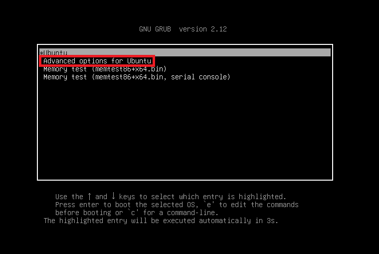
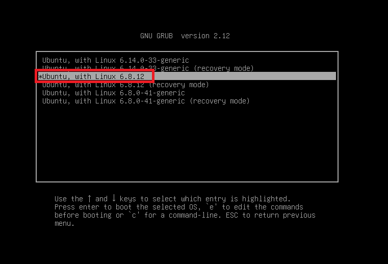

# 环境搭建

* [Virtualbox 7.1.6](https://mirror.nju.edu.cn/virtualbox/7.1.6/)
* host：Ubuntu24.04.1
* guest：Ubuntu24.04.1（内核版本 6.8.12）

>  [!tips]
>
> 注意内核版本不能过低，不然没有vmsvga的驱动。

## host编译安装Virtualbox 7.1.6

安装依赖：

```bash
# required packages
sudo apt-get install --no-install-recommends acpica-tools chrpath doxygen g++-multilib libasound2-dev libcap-dev \
        libcurl4-openssl-dev libdevmapper-dev libidl-dev libopus-dev libpam0g-dev \
        libpng-dev libpulse-dev qt6-base-dev qt6-l10n-tools libsdl1.2-dev libsdl-ttf2.0-dev \
        libssl-dev libvpx-dev libxcursor-dev libxinerama-dev libxml2-dev libxml2-utils \
        libxmu-dev libxrandr-dev linux-source make nasm python3-dev \
        texlive texlive-fonts-extra texlive-latex-extra unzip xsltproc \
        default-jdk libstdc++5 libxslt1-dev linux-kernel-headers makeself \
        mesa-common-dev subversion yasm zlib1g-dev glslang-tools \
        libc6-dev-i386 lib32z1 lib32gcc-s1 lib32stdc++6 linux-headers-generic

# For python hacking
sudo apt-get install pylint python3-psycopg2 python3-willow python3-psycopg2 python3-pil

# For Qt6
sudo apt-get install libqt6help6 libqt6statemachine6 qt6-scxml-dev qt6-tools-dev
```

下载源码：

```bash
wget https://mirror.nju.edu.cn/virtualbox/7.1.6/VirtualBox-7.1.6a.tar.bz2
tar -xvf ./VirtualBox-7.1.6a.tar.bz2
cd VirtualBox-7.1.6
./configure --disable-hardening --disable-docs
source `pwd`/env.sh
```

这里需要修改一下`Config.kmk`文件，避免编译错误（见`可能遇到的问题 - 1,2`），以及取消debug版本的assert报错退出（见`可能遇到的问题 - 4`）：

```bash
patch < Config.kmk.diff
```

还需要修改`src/VBox/Devices/Graphics/DevVGA-SVGA-cmd.cpp`一处代码，使之直接返回，否则会陷入死锁无法响应我们的请求（见`可能遇到的问题 - 3`）：

```bash
patch < DevVGA-SVGA-cmd.cpp.diff
```

编译debug版本（不知道为什么release版本会报`NS_ERROR`无法正常启动虚拟机）：

```bash
# build debug
kmk KBUILD_TYPE=debug
# build kernel module
cd ./out/linux.amd64/release/bin/src
make
sudo make install
cd ..
```

（好像）开启3D加速功能需要在guest中额外安装[Guest Addition](https://mirror.nju.edu.cn/virtualbox/7.1.6/VBoxGuestAdditions_7.1.6.iso)，可以先下载，而后**在创建虚拟机时选择Guest Addition镜像文件的目录**，也可以**后期手动安装**：

```bash
wget https://mirror.nju.edu.cn/virtualbox/7.1.6/VBoxGuestAdditions_7.1.6.iso
sudo mkdir /mnt/cdrom
sudo mount `pwd`/VBoxGuestAdditions_7.1.6.iso /mnt/cdrom
cd /mnt/cdrom
sudo ./VBoxLinuxAdditions.run
```

安装结果：

```bash
$ sudo ./VBoxLinuxAdditions.run
Verifying archive integrity...  100%   MD5 checksums are OK. All good.
Uncompressing VirtualBox 7.1.6 Guest Additions for Linux  100%  
VirtualBox Guest Additions installer
VirtualBox Guest Additions: Starting.
VirtualBox Guest Additions: Setting up modules
VirtualBox Guest Additions: Building the VirtualBox Guest Additions kernel 
modules.  This may take a while.
VirtualBox Guest Additions: To build modules for other installed kernels, run
VirtualBox Guest Additions:   /sbin/rcvboxadd quicksetup <version>
VirtualBox Guest Additions: or
VirtualBox Guest Additions:   /sbin/rcvboxadd quicksetup all
VirtualBox Guest Additions: Building the modules for kernel 6.8.12.
update-initramfs: Generating /boot/initrd.img-6.8.12
VirtualBox Guest Additions: Running kernel modules will not be replaced until 
the system is restarted or 'rcvboxadd reload' triggered
VirtualBox Guest Additions: reloading kernel modules and services
VirtualBox Guest Additions: kernel modules and services 7.1.6 r167084 reloaded
VirtualBox Guest Additions: NOTE: you may still consider to re-login if some 
user session specific services (Shared Clipboard, Drag and Drop, Seamless or 
Guest Screen Resize) were not restarted automatically
```


### 可能遇到的问题

#### 1. following symbols not defined in the files

[Reference](https://github.com/cyberus-technology/virtualbox-kvm/issues/40)：[0001-XXX-disable-building-guest-additions.patch.txt](https://github.com/user-attachments/files/18252865/0001-XXX-disable-building-guest-additions.patch.txt)

编译时会报错：

```bash {hide=true}
following symbols not defined in the files ...:
__memset_chk
```

需要事先打一个补丁，将`Config.kmk`中的`VBOX_WITH_ADDITIONS`选项取消：

```bash {hide=true}
VBOX_WITH_ADDITIONS =
```

#### 2. Could not find or load main class org.apache.tools.ant.launch.Launcher

编译的时候java调用ant报错：

```bash {hide=true}
kBuild: Building /home/ubt/Desktop/CVE-2025-30712/VirtualBox-7.1.6/out/linux.amd64/release/obj/manual/en_US/UserManual.pdf (/home/ubt/Desktop/CVE-2025-30712/VirtualBox-7.1.6/out/linux.amd64/release/obj/manual/en_US/UserManual_pdf.log)
Error: Could not find or load main class org.apache.tools.ant.launch.Launcher
Caused by: java.lang.ClassNotFoundException: org.apache.tools.ant.launch.Launcher
kmk: *** [/home/ubt/Desktop/CVE-2025-30712/VirtualBox-7.1.6/doc/manual/Makefile.kmk:912: /home/ubt/Desktop/CVE-2025-30712/VirtualBox-7.1.6/out/linux.amd64/release/obj/manual/en_US/UserManual.pdf] Error 1
kmk: *** Waiting for unfinished jobs....
kBuild: dita-ot-qhelp
Error: Could not find or load main class org.apache.tools.ant.launch.Launcher
Caused by: java.lang.ClassNotFoundException: org.apache.tools.ant.launch.Launcher
kmk: *** [/home/ubt/Desktop/CVE-2025-30712/VirtualBox-7.1.6/doc/manual/Makefile.kmk:1135: /home/ubt/Desktop/CVE-2025-30712/VirtualBox-7.1.6/out/linux.amd64/release/obj/manual/en_US/qhelp/UserManual.hhp] Error 1
kmk: *** Exiting with status 2
```

一开始发现用apt安装ant的根目录在`/usr/share/ant/lib/ant-launcher.jar`，解压jar包发现确实没有`org.apache.tools.ant.launch.Launcher`这个类（没有`org/apache/tools/ant/launch/Launcher.class`这个路径和文件），~~然后尝试从apache官网下载后手动配置路径：~~

```bash {hide=true}
wget https://dlcdn.apache.org/ant/binaries/apache-ant-1.10.14-bin.tar.xz
tar -xvf apache-ant-1.10.14-bin.tar.xz
vim ~/.bashrc
source ~/.bashrc
# test
java -cp "${ANT_HOME}/lib/ant-launcher.jar" org.apache.tools.ant.launch.Launcher -version
```

~~`~/.bashrc`末尾添加以下几行：~~

```bash {hide=true}
export JAVA_HOME=/usr/lib/jvm/java-21-openjdk-amd64
export ANT_HOME=/path/to/apache-ant-1.10.14
export CLASSPATH=${ANT_HOME}/lib/ant-launcher.jar
export PATH=${PATH}:${ANT_HOME}/bin
```

~~然后发现于事无补。~~

最后干脆直接给`configure`加`--disable-docs`参数不编译doc，避开问题：

```bash {hide=true}
./configure --disable-hardening --disable-docs
```

#### 3. NS_ERROR_FAILURE (0x80004005)

[Reference](https://forums.virtualbox.org/viewtopic.php?t=113071)

编译release版本无法正常使用VMSVGA并开启3D加速，会启动不了虚拟机，原因未知，报错如下：

```bash {hide=true}
Code: Select all

VM Name: XXXXXXXX

The VM session was aborted.
Result Code:
NS_ERROR_FAILURE (0x80004005)
Component:
SessionMachine
Interface:
ISession {c0447716-ff5a-4795-b57a-ecd5fffa18a4}
```

看log也没有发现任何有效的报错信息。

后来改成编译debug版本，能够正常开机但会卡死在开机画面，ssh可以连上去，但是无法执行我们输入的SVGA命令。调试`VirtualBoxVM`切换到`VMSVGA FIFO`线程，发现会不停调用`vmsvga3dCmdDXEndQuery`函数，并在里面某个地方被死锁。所以直接修改`src/VBox/Devices/Graphics/DevVGA-SVGA-cmd.cpp`文件，在执行`SVGA_3D_CMD_DX_END_QUERY`指令时不进入`vmsvga3dCmdDXEndQuery`函数，直接令`rcParse=VINF_SUCCESS`：

```c {hide=true}
    case SVGA_3D_CMD_DX_END_QUERY:
    {
        SVGA3dCmdDXEndQuery *pCmd = (SVGA3dCmdDXEndQuery *)pvCmd;
        VMSVGAFIFO_CHECK_3D_CMD_MIN_SIZE_BREAK(sizeof(*pCmd));
        //rcParse = vmsvga3dCmdDXEndQuery(pThisCC, idDXContext, pCmd, cbCmd);
        rcParse = VINF_SUCCESS;
        break;
    }
```

#### 4. Assertion Failed

编译debug版本时默认定义了`RT_STRICT`，所以在很多地方加了assert检查报错退出，如：

```bash {hide=true}
00:01:51.432871 !!Assertion Failed!!
00:01:51.432871 Expression: guest-input: failed
00:01:51.432872 Location  : /home/ubt/Desktop/CVE-2025-30712/VirtualBox-7.1.6/src/VBox/Devices/Graphics/DevVGA-SVGA-cmd.cpp(881) int vmsvgaR3MobCreate(PVMSVGAR3STATE, SVGAMobFormat, PPN64, uint32_t, SVGAMobId, PVMSVGAMOB)
00:01:51.432874 Stack     :
00:01:51.432874 000076e2c2aa78d9 VBoxRT.so!RTAssertMsg2V+0x3fb (rva:0x2a78d9)
```

需要修改`Config.kmk`：

```bash {hide=true}
# 关闭VBOX_WITH_STRICT_LOCKS选项
VBOX_WITH_STRICT_LOCKS =
# 在DEFS.debug添加RT_NO_STRICT选项
DEFS.debug      := DEBUG DEBUG_$(subst $(subst _, ,_),_,$(USERNAME)) DEBUG_USERNAME=$(subst $(subst _, ,_),_,$(U
SERNAME)) RT_NO_STRICT
```


## guest编译替换内核

### 编译安装

```bash
sudo apt update
sudo apt install linux-source
cp /usr/src/linux-source-6.8.0/linux-source-6.8.0.tar.bz2 ./
tar -xvf ./linux-source-6.8.0.tar.bz2
cd linux-source-6.8.0

sudo apt install libncurses-dev pkg-config flex bison libelf-dev libssl-dev
cp /boot/config-6.8.0-41-generic ./.config
make menuconfig # Load .config
vim .config
```

`.config`文件需要修改如下选项（见`可能遇到的问题`）：

```.config
CONFIG_SYSTEM_TRUSTED_KEYS=""
CONFIG_SYSTEM_REVOCATION_KEYS=""
CONFIG_FB_HYPERV=n
```

打patch，在`drivers/gpu/drm/vmwgfx/vmwgfx_drv.c`文件中添加一个用于申请和读写dma buffer，以及执行vmsvga指令的驱动设备：

```bash
patch -p1 < vmwgfx_drv.c.diff
```

编译安装：

```bash
sudo make -j2
#sudo make modules -j2

sudo make modules_install
sudo make install
```

修改grub默认选项，这里我们需要进入grub菜单的`Advanced options for Ubuntu>Ubuntu, with Linux 6.8.12`选项：





修改`/etc/default/grub`文件：

> 留5秒的显示时间，以防我们之后还需要切换其他内核，比如重新编译安装内核

```bash
#GRUB_DEFAULT=0
GRUB_DEFAULT="Advanced options for Ubuntu>Ubuntu, with Linux 6.8.12"
#GRUB_TIMEOUT_STYLE=hidden
GRUB_TIMEOUT=5
```

应用更新，重启：

```bash
sudo update-grub
reboot
```

然后就可以看到我们patch加的设备了：

```bash
ubt@but:~$ uname -r
6.8.12
ubt@but:~$ ls /dev/vgapwn_dev
/dev/vgapwn_dev
```

如果修改了内核模块的代码，重新编译安装模块即可：

```bash
sudo rm -rf /boot/*-6.8.12
sudo rm -rf /lib/modules/6.8.12

sudo make modules -j2
sudo make modules_install
```


### *卸载自己安装的内核

如果使用apt安装的内核，可以直接用dpkg卸载：

```bash
dpkg --list | grep kernel-image
sudo apt-get remove linux-image-<version>
```

如果是自己安装的内核，则手动删除`/boot`目录下的内核文件，以及和`/lib/modules/<version>`目录下的内核模块：

```bash
sudo rm -rf /boot/*-<version>
sudo rm -rf /lib/modules/<version>
```

> [!tips]
>
> 如果多次安装相同版本的内核，会在`/boot`目录下生成`/boot/*-<version>.old`文件，一起删了即可。


### 可能遇到的问题

```bash {hide=true}
drivers/video/fbdev/hyperv_fb.c: In function ‘hvfb_probe’:
drivers/video/fbdev/hyperv_fb.c:1195:15: error: implicit declaration of function ‘devm_register_framebuffer’; did you mean ‘unregister_framebuffer’? [-Werror=implicit-function-declaration]
 1195 |         ret = devm_register_framebuffer(&hdev->device, info);
      |               ^~~~~~~~~~~~~~~~~~~~~~~~~
      |               unregister_framebuffer
cc1: some warnings being treated as errors
make[5]: *** [scripts/Makefile.build:243: drivers/video/fbdev/hyperv_fb.o] Error 1
make[4]: *** [scripts/Makefile.build:481: drivers/video/fbdev] Error 2
make[3]: *** [scripts/Makefile.build:481: drivers/video] Error 2
make[2]: *** [scripts/Makefile.build:481: drivers] Error 2
```

参考：[Ubuntu x86_64 6.8 kernels won't build if CONFIG_FB_HYPERV config option is enabled](https://bugs.launchpad.net/ubuntu/+source/linux/+bug/2127971)

> The reason is that in the 6.8 Ubuntu kernel source, commit f26c2008d5bd6d (cherry pick from upstream ea2f45ab0e53b255) introduced call to 'devm_register_framebuffer', but there is missing an upstream commit 929c81ade6355b, which provides the implementation for 'devm_register_framebuffer'. This SRU adds the missing upstream commit 929c81ade6355b to the 6.8 Ubuntu kernel source.
>
> This issue hasn't been noticed because, by default, the`CONFIG_FB_HYPERV`is disabled for Ubuntu kernel builds:
>
> ```bash {hide=true}
> ./debian/scripts/misc/annotations --query --config CONFIG_FB_HYPERV
> {
> "CONFIG_FB_HYPERV": {
> "policy": {
> "amd64": "n",
> "arm64": "n"
> }
> }
> }
> ```

既然Ubuntu默认禁用，那我们修改`.config`直接禁用`CONFIG_FB_HYPERV`即可：

```.config {hide=true}
CONFIG_FB_HYPERV=n
```


# 漏洞分析

参考：

* [GHSA-qx2m-rcpc-v43v](https://github.com/google/security-research/security/advisories/GHSA-qx2m-rcpc-v43v)
* [CVE-2025-30712](https://nvd.nist.gov/vuln/detail/CVE-2025-30712)
* https://www.oracle.com/security-alerts/cpuapr2025.html

漏洞描述：

```text
An integer overflow vulnerability exists within the VirtualBox vmsvga3dSurfaceMipBufferSize function. This vulnerability allows an attacker to manipulate a malloc call such that 0 bytes are allocated while VirtualBox tracks the size of the buffer as a value greater than 0.

An attacker can exploit this condition and achieve linear read/write primitives which can then be escalated to arbitrary read/write access within the host's memory. We provide a proof-of-concept that demonstrates how to exploit this vulnerability to fully escape a virtual machine.
```

[[source](https://github.com/mirror/vbox/blob/74117a1cb257c00e2a92cf522e8e930bd1c4d64b/src/VBox/Devices/Graphics/DevVGA-SVGA3d-shared.cpp#L324)]

## 漏洞成因

漏洞点在`vmsvga3dSurfaceMipBufferSize`中计算`cbSurface`时，可能发生**整数溢出，使`cbSurface = 0`**：

```c
// src\VBox\Devices\Graphics\DevVGA-SVGA3d-shared.cpp
void vmsvga3dSurfaceMipBufferSize(SVGA3dSurfaceFormat format, SVGA3dSize mipmapSize, uint32_t multisampleCount,
                                  uint32_t *pcBlocksX,
                                  uint32_t *pcBlocksY,
                                  uint32_t *pcbSurfacePitch,
                                  uint32_t *pcbSurfacePlane,
                                  uint32_t *pcbSurface)
{
    const struct svga3d_surface_desc *desc = svga3dsurface_get_desc(format); // desc由format决定

    uint32_t const cxBlocks = (mipmapSize.width + desc->block_size.width - 1) / desc->block_size.width;
    uint32_t const cyBlocks = (mipmapSize.height + desc->block_size.height - 1) / desc->block_size.height;
    uint32_t const czBlocks = (mipmapSize.depth + desc->block_size.depth - 1) / desc->block_size.depth;

    uint32_t const cbPitch = cxBlocks * desc->pitch_bytes_per_block;

    uint32_t cbSurfacePlane = clamped_umul32(cxBlocks, cyBlocks);
    cbSurfacePlane = clamped_umul32(cbSurfacePlane, desc->bytes_per_block);

    uint32_t const cbSurfaceResolved = clamped_umul32(cbSurfacePlane, czBlocks);

    uint32_t const cbSurface = clamped_umul32(cbSurfaceResolved, RT_MAX(multisampleCount, 1)); // <-----

    *pcBlocksX = cxBlocks;
    *pcBlocksY = cyBlocks;
    *pcbSurfacePitch = cbPitch;
    *pcbSurfacePlane = cbSurfacePlane;
    *pcbSurface = cbSurface;
}

// src\VBox\Devices\Graphics\vmsvga_include\svga3d_surfacedefs.h
static inline u32 clamped_umul32(u32 a, u32 b)
{
	uint64_t tmp = (uint64_t) a*b;
	return (tmp > (uint64_t) ((u32) -1)) ? (u32) -1 : tmp;
}
```

`vmsvga3dSurfaceAllocMipLevels`中调用`RTMemAllocZ`申请buf：

```c
// src\VBox\Devices\Graphics\DevVGA-SVGA3d.cpp
static int vmsvga3dSurfaceAllocMipLevels(PVMSVGA3DSURFACE pSurface)
{
    /* Allocate buffer to hold the surface data until we can move it into a D3D object */
    for (uint32_t i = 0; i < pSurface->cLevels * pSurface->surfaceDesc.numArrayElements; ++i)
    {
        PVMSVGA3DMIPMAPLEVEL pMipmapLevel = &pSurface->paMipmapLevels[i];
        AssertReturn(pMipmapLevel->pSurfaceData == NULL, VERR_INVALID_STATE);
        pMipmapLevel->pSurfaceData = RTMemAllocZ(pMipmapLevel->cbSurface); // <-----
        AssertReturn(pMipmapLevel->pSurfaceData, VERR_NO_MEMORY);
    }
    return VINF_SUCCESS;
}
```

我们来看`RTMemAllocZ`在VirtualBox中的具体实现，当参数为`cb = 0`时，实际调用`calloc(1, 0)`：

```c
// include\iprt\mem.h
/**
 * Allocates zero'd memory with default tag.
 *
 * Instead of memset(pv, 0, sizeof()) use this when you want zero'd
 * memory. This keeps the code smaller and the heap can skip the memset
 * in about 0.42% of calls :-).
 *
 * @returns Pointer to the allocated memory.
 * @returns NULL on failure.
 * @param   cb      Size in bytes of the memory block to allocated.
 */
#define RTMemAllocZ(cb)                 RTMemAllocZTag((cb), RTMEM_TAG)

// src\VBox\Runtime\r3\alloc.cpp
RTDECL(void *) RTMemAllocZTag(size_t cb, const char *pszTag) RT_NO_THROW_DEF
{
#ifdef RTALLOC_USE_EFENCE
    void *pv = rtR3MemAlloc("AllocZ", RTMEMTYPE_RTMEMALLOCZ, cb, cb, pszTag, ASMReturnAddress(), NULL, 0, NULL);

#else /* !RTALLOC_USE_EFENCE */

    AssertMsg(cb, ("Allocating ZERO bytes is really not a good idea! Good luck with the next assertion!\n"));

# ifdef RTMEMALLOC_USE_TRACKER
    void *pv = RTMemTrackerHdrAlloc(calloc(1, cb + sizeof(RTMEMTRACKERHDR)), cb, pszTag, ASMReturnAddress(), RTMEMTRACKERMETHOD_ALLOCZ);
#else
    void *pv = calloc(1, cb); NOREF(pszTag);
#endif
    AssertMsg(pv, ("calloc(1,%#zx) failed!!!\n", cb));
    AssertMsg(   cb < RTMEM_ALIGNMENT
              || !((uintptr_t)pv & (RTMEM_ALIGNMENT - 1))
              || ( (cb & RTMEM_ALIGNMENT) + ((uintptr_t)pv & RTMEM_ALIGNMENT)) == RTMEM_ALIGNMENT
              , ("pv=%p RTMEM_ALIGNMENT=%#x\n", pv, RTMEM_ALIGNMENT));
#endif /* !RTALLOC_USE_EFENCE */
#ifdef IPRT_WITH_GCC_SANITIZER
    if (rtMemIsLeakTag(pszTag))
        __lsan_ignore_object(pv);
#endif
    return pv;
}
```



> [!note]
>
> 参考manpage：
>
> ```text
> SYNOPSIS
> 
> #include <stdlib.h>
> 
> void *malloc(size_t size);
> void *calloc(size_t nmemb, size_t size);
> 
> DESCRIPTION
> The malloc() function allocates size bytes and returns a pointer to the allocated memory.  The memory
> is not initialized.  If size is 0, then malloc() returns either NULL, **or a unique pointer value**  that
> can later be successfully passed to free().
> 
> The  calloc() function allocates memory for an array of nmemb elements of size bytes each and returns
> a pointer to the allocated memory.  The memory is set to zero.  If nmemb or size is 0, then  calloc()
> returns  either  NULL, **or a unique pointer value** that can later be successfully passed to free().
> ```
>
> 当`nmemb/size = 0`时的行为是未定义的，有可能返回NULL也有可能返回一个合法的内存指针，我们自己写个程序测试一下：
>
> ```c
> #include <stdlib.h>
> #include <stdio.h>
> 
> int main(int argc, char *argv[]) {
> char *buf1 = malloc(0);
> char *buf2 = calloc(0, 1);
> char *buf3 = calloc(1, 0);
> char *buf4 = calloc(0, 0);
> printf("buf1: %p\n", buf1);
> printf("buf2: %p\n", buf2);
> printf("buf3: %p\n", buf3);
> printf("buf4: %p\n", buf4);
> return 0;
> }
> ```
>
> 结果：
>
> ```bash
> ctf@ubuntu:/mnt/hgfs/VMShare$ gcc -o exp ./test.c
> ctf@ubuntu:/mnt/hgfs/VMShare$ ./exp
> buf1: 0x5633c8df42a0
> buf2: 0x5633c8df42c0
> buf3: 0x5633c8df42e0
> buf4: 0x5633c8df4300
> ```
>
> gdb查看堆：
>
> ```gdb
> pwndbg> heap
> Allocated chunk | PREV_INUSE
> Addr: 0x555555559000
> Size: 0x290 (with flag bits: 0x291)
> 
> Allocated chunk | PREV_INUSE
> Addr: 0x555555559290
> Size: 0x20 (with flag bits: 0x21)
> 
> Allocated chunk | PREV_INUSE
> Addr: 0x5555555592b0
> Size: 0x20 (with flag bits: 0x21)
> 
> Allocated chunk | PREV_INUSE
> Addr: 0x5555555592d0
> Size: 0x20 (with flag bits: 0x21)
> 
> Allocated chunk | PREV_INUSE
> Addr: 0x5555555592f0
> Size: 0x20 (with flag bits: 0x21)
> 
> Top chunk | PREV_INUSE
> Addr: 0x555555559310
> Size: 0x20cf0 (with flag bits: 0x20cf1)
> ```
>
> 也就是说，`nmemb/size = 0`时，`malloc`和`calloc`都会返回一个最小的堆内存块（0x20 chunk），并不会返回NULL。



所以，当`pSurface->paMipmapLevels[i]->cbSurface`值为0时，如果有读写`pMipmapLevel->pSurfaceData`的操作就可能会发生溢出。


## 漏洞触发

由上一节的分析可知，`vmsvga3dSurfaceMipBufferSize`中计算`cbSurface`的参数主要由`format`和`mipmapSize`决定，来看看这两个参数是否可控。

### SVGA_3D_CMD_DEFINE_GB_SURFACE

定义suface时存在如下调用链：

```text
vmsvgaR3Process3dCmd
[SVGA_3D_CMD_DEFINE_GB_SURFACE]
 -> vmsvga3dCmdDefineGBSurface
  -> vmsvga3dCmdDefineSurface
   -> vmsvga3dSurfaceDefine
    -> vmsvga3dSurfaceMipBufferSize
```

在`vmsvga3dCmdDefineGBSurface`中调用`vmsvga3dCmdDefineSurface`参数如下：

```c
// src\VBox\Devices\Graphics\DevVGA-SVGA-cmd.cpp
        /* Create the host surface. */
        SVGA3dMSPattern const multisamplePattern = pCmd->multisampleCount > 1 ? SVGA3D_MS_PATTERN_STANDARD : SVGA3D_MS_PATTERN_NONE;
        SVGA3dMSQualityLevel const qualityLevel = pCmd->multisampleCount > 1 ? SVGA3D_MS_QUALITY_FULL : SVGA3D_MS_QUALITY_NONE;
        vmsvga3dSurfaceDefine(pThisCC, pCmd->sid, pCmd->surfaceFlags, pCmd->format,
                              pCmd->multisampleCount, multisamplePattern, qualityLevel, pCmd->autogenFilter,
                              pCmd->numMipLevels, &pCmd->size, /* arraySize = */ 0, /* bufferByteStride = */ 0, /* fAllocMipLevels = */ false);
```

在`vmsvga3dSurfaceDefine`中调用`vmsvga3dSurfaceMipBufferSize`计算并赋值`pSurface->paMipmapLevels[iMipmap]->cbSurface`：

```c
// src\VBox\Devices\Graphics\DevVGA-SVGA3d.cpp
int vmsvga3dSurfaceDefine(PVGASTATECC pThisCC, uint32_t sid, SVGA3dSurfaceAllFlags surfaceFlags, SVGA3dSurfaceFormat format,
                          uint32_t multisampleCount, SVGA3dMSPattern multisamplePattern, SVGA3dMSQualityLevel qualityLevel, SVGA3dTextureFilter autogenFilter,
                          uint32_t numMipLevels, SVGA3dSize const *pMipLevel0Size, uint32_t arraySize, uint32_t bufferByteStride, bool fAllocMipLevels)
{
    PVMSVGA3DSURFACE pSurface;
    ...
      
    if (arraySize)
        pSurface->surfaceDesc.numArrayElements = arraySize; /* Also for an array of cubemaps where arraySize = 6 * numCubes. */
    else if (surfaceFlags & SVGA3D_SURFACE_CUBEMAP)
        pSurface->surfaceDesc.numArrayElements = SVGA3D_MAX_SURFACE_FACES;
    else
        pSurface->surfaceDesc.numArrayElements = 1;
    ...
      
    pSurface->cbBlock = vmsvga3dSurfaceFormatSize(format, &pSurface->cxBlock, &pSurface->cyBlock, &pSurface->cbPitchBlock); // 由pCmd->format决定pSurface->cxBlock/cyBlock/cbPitchBlock/cbBlock/...
    AssertReturn(pSurface->cbBlock, VERR_INVALID_PARAMETER);

    /** @todo cbMemRemaining = value of SVGA_REG_MOB_MAX_SIZE */
    uint32_t cbMemRemaining = SVGA3D_MAX_SURFACE_MEM_SIZE; /* Do not allow more than this for a surface. */
    SVGA3dSize mipmapSize = *pMipLevel0Size;
    int rc = VINF_SUCCESS;

    for (uint32_t i = 0; i < numMipLevels; ++i) // numMipLevels = pCmd->numMipLevels
    {
        for (uint32_t iArray = 0; iArray < pSurface->surfaceDesc.numArrayElements; ++iArray) // pSurface->surfaceDesc.numArrayElements = 1
        {
            uint32_t const iMipmap = vmsvga3dCalcSubresource(i, iArray, numMipLevels);
            LogFunc(("[%d] array %d mip level %d (%d,%d,%d) cbBlock=%#x block %dx%d\n",
                     iMipmap, iArray, i, mipmapSize.width, mipmapSize.height, mipmapSize.depth,
                     pSurface->cbBlock, pSurface->cxBlock, pSurface->cyBlock));

            uint32_t cBlocksX;
            uint32_t cBlocksY;
            uint32_t cbSurfacePitch;
            uint32_t cbSurfacePlane;
            uint32_t cbSurface;
            vmsvga3dSurfaceMipBufferSize(format, mipmapSize, pSurface->surfaceDesc.multisampleCount,
                                         &cBlocksX, &cBlocksY, &cbSurfacePitch, &cbSurfacePlane, &cbSurface);
            // format = pCmd->format
            // mipmapSize = pCmd->size
            AssertBreakStmt(cbMemRemaining >= cbSurface, rc = VERR_INVALID_PARAMETER);

            PVMSVGA3DMIPMAPLEVEL pMipmapLevel = &pSurface->paMipmapLevels[iMipmap];
            pMipmapLevel->mipmapSize     = mipmapSize;
            pMipmapLevel->cBlocksX       = cBlocksX;
            pMipmapLevel->cBlocksY       = cBlocksY;
            pMipmapLevel->cBlocks        = cBlocksX * cBlocksY * mipmapSize.depth;
            pMipmapLevel->cbSurfacePitch = cbSurfacePitch;
            pMipmapLevel->cbSurfacePlane = cbSurfacePlane;
            pMipmapLevel->cbSurface      = cbSurface;
            pMipmapLevel->pSurfaceData   = NULL;

            cbMemRemaining -= cbSurface;
        }

        AssertRCBreak(rc);

        mipmapSize.width >>= 1;
        if (mipmapSize.width == 0) mipmapSize.width = 1;
        mipmapSize.height >>= 1;
        if (mipmapSize.height == 0) mipmapSize.height = 1;
        mipmapSize.depth >>= 1;
        if (mipmapSize.depth == 0) mipmapSize.depth = 1;
    }
    ...
          
    if (fAllocMipLevels || pState->fVMSVGA2dGBO) // fAllocMipLevels = false, pState->fVMSVGA2dGBO = false
    {
        rc = vmsvga3dSurfaceAllocMipLevels(pSurface); // <--/-- 不会被执行！
        AssertRCReturn(rc, rc);
    }

    pSurface->id = sid;
    return VINF_SUCCESS;
}
```

其中：

* `mipmapSize`为用户SVGA指令中传入的`pCmd->size`
* `desc`根据用户SVGA指令中传入的`pCmd->format`决定，在`svga3dsurface_get_desc`函数中通过`&svga3d_surface_descs[format]`得到，为已知的固定值

`format`对应的`svga3d_surface_descs[]`数组成员结构体如下：

```c
struct svga3d_surface_desc {
	SVGA3dSurfaceFormat format;
	enum svga3d_block_desc block_desc;

	surf_size_struct block_size; // <-----
	u32 bytes_per_block; // <-----
	u32 pitch_bytes_per_block; // <-----

	struct svga3d_channel_def bit_depth;
	struct svga3d_channel_def bit_offset;
};
```

**所以，计算`pMipmapLevel->cbSurface`的参数完全可控，控制`pCmd->size`和`pCmd->format`即可。**

### SVGA_3D_CMD_SURFACE_DMA

但是在定义surface时时不会执行`vmsvga3dSurfaceAllocMipLevels`，也就是不会申请`pSurfaceData`，还需要用到另一条指令：

```c
vmsvgaR3Process3dCmd
[SVGA_3D_CMD_SURFACE_DMA]
 -> vmsvga3dSurfaceDMA
  -> vmsvga3dSurfaceAllocMipLevels
```

`vmsvga3dSurfaceDMA`函数中，当host surface的`pMipLevel->pSurfaceData`为空时会调用`vmsvga3dSurfaceAllocMipLevels`为host surface申请内存：

```c
// src\VBox\Devices\Graphics\DevVGA-SVGA3d.cpp
int vmsvga3dSurfaceDMA(PVGASTATE pThis, PVGASTATECC pThisCC, SVGAGuestImage guest, SVGA3dSurfaceImageId host,
                       SVGA3dTransferType transfer, uint32_t cCopyBoxes, SVGA3dCopyBox *paBoxes)
{
    PVMSVGA3DSTATE pState = pThisCC->svga.p3dState;
    AssertReturn(pState, VERR_NO_MEMORY);

    PVMSVGA3DSURFACE pSurface;
    int rc = vmsvga3dSurfaceFromSid(pState, host.sid, &pSurface);
    AssertRCReturn(rc, rc);

    LogFunc(("%sguestptr gmr=%x offset=%x pitch=%x host sid=%u face=%d mipmap=%d transfer=%s cCopyBoxes=%d\n",
             (pSurface->f.surfaceFlags & SVGA3D_SURFACE_HINT_TEXTURE) ? "TEXTURE " : "",
             guest.ptr.gmrId, guest.ptr.offset, guest.pitch,
             host.sid, host.face, host.mipmap, (transfer == SVGA3D_WRITE_HOST_VRAM) ? "READ" : "WRITE", cCopyBoxes));

    PVMSVGA3DMIPMAPLEVEL pMipLevel;
    rc = vmsvga3dMipmapLevel(pSurface, host.face, host.mipmap, &pMipLevel);
    AssertRCReturn(rc, rc);

    PVMSVGAR3STATE const pSvgaR3State = pThisCC->svga.pSvgaR3State;
    AssertReturn(pSvgaR3State->pFuncs3D, VERR_NOT_IMPLEMENTED);

    PVMSVGA3DCONTEXT pContext = NULL;
    if (!VMSVGA3DSURFACE_HAS_HW_SURFACE(pSurface))
    {
        /*
         * Not realized in host hardware/library yet, we have to work with
         * the copy of the data we've got in VMSVGA3DMIMAPLEVEL::pSurfaceData.
         */
        if (!pMipLevel->pSurfaceData)
        {
            rc = vmsvga3dSurfaceAllocMipLevels(pSurface); // <-----
            AssertRCReturn(rc, rc);
        }
    }
    else if (vmsvga3dIsLegacyBackend(pThisCC))
    {
        ...
    }

    /* SVGA_3D_CMD_SURFACE_DMA:
     * "define the 'source' in each copyBox as the guest image and the
     * 'destination' as the host image, regardless of transfer direction."
     */
    for (uint32_t i = 0; i < cCopyBoxes; ++i) // 令cCopyBoxes = 0即可跳过for循环
    {
        ...
    }

    if (!VMSVGA3DSURFACE_HAS_HW_SURFACE(pSurface))
    {
        pMipLevel->fDirty = true;
        pSurface->fDirty = true;
    }

    return rc;
}
```

其中`cCopyBoxes`为`pCmd`后面跟的`SVGA3dCopyBox`结构体数量，我们令其为0即可跳过`vmsvga3dSurfaceDMA`里的for循环：

```c
// src\VBox\Devices\Graphics\DevVGA-SVGA3d.cpp
    case SVGA_3D_CMD_SURFACE_DMA:
    {
        SVGA3dCmdSurfaceDMA *pCmd = (SVGA3dCmdSurfaceDMA *)pvCmd;
        VMSVGAFIFO_CHECK_3D_CMD_MIN_SIZE_BREAK(sizeof(*pCmd));
        STAM_REL_COUNTER_INC(&pSvgaR3State->StatR3Cmd3dSurfaceDma);

        ...
        uint32_t const cCopyBoxes = (cbCmd - sizeof(*pCmd)) / sizeof(SVGA3dCopyBox);
        STAM_PROFILE_START(&pSvgaR3State->StatR3Cmd3dSurfaceDmaProf, a);
        vmsvga3dSurfaceDMA(pThis, pThisCC, pCmd->guest, pCmd->host, pCmd->transfer,
                           cCopyBoxes, (SVGA3dCopyBox *)(pCmd + 1)); // <-----
        STAM_PROFILE_STOP(&pSvgaR3State->StatR3Cmd3dSurfaceDmaProf, a);
        if (LogRelIs3Enabled())
        {
            if (cCopyBoxes)
            {
                ...
            }
        }
        break;
    }
```

综上，先调用`SVGA_3D_CMD_DEFINE_GB_SURFACE`定义surface，再调用`SVGA_3D_CMD_SURFACE_DMA`申请`pSurfaceData`即可申请到一个可触发堆越界的surface。


## oob read

### SVGA_3D_CMD_DX_BUFFER_COPY

`SVGA_3D_CMD_DX_BUFFER_COPY`指令有以下调用链：

```text
vmsvgaR3Process3dCmd
[SVGA_3D_CMD_DX_BUFFER_COPY]
 -> vmsvga3dCmdDXBufferCopy
  -> vmsvga3dSurfaceMap
   -> vmsvga3dSurfaceMapInit
  -> memcpy
```

首先我们需要定义2个buggy_surface（分配了大小为“0”的缓冲区）和transfer_surface（正常缓冲区）。

在`vmsvga3dCmdDXBufferCopy`函数中：

1. 调用`vmsvga3dSurfaceMap`，将2个surface分别映射到`mapBufferSrc/mapBufferDst`
2. 调用`memcpy`，将数据从buggy_surface拷贝到transfer_surface

```c
// src\VBox\Devices\Graphics\DevVGA-SVGA-cmd.cpp
/* SVGA_3D_CMD_DX_BUFFER_COPY 1209 */
static int vmsvga3dCmdDXBufferCopy(PVGASTATECC pThisCC, uint32_t idDXContext, SVGA3dCmdDXBufferCopy const *pCmd, uint32_t cbCmd)
{
#ifdef VMSVGA3D_DX
    //DEBUG_BREAKPOINT_TEST();
    RT_NOREF(idDXContext, cbCmd);

    int rc;

    /** @todo Backend should o the copy is both buffers have a hardware resource. */
    SVGA3dSurfaceImageId imageBufferSrc;
    imageBufferSrc.sid = pCmd->src;
    imageBufferSrc.face = 0;
    imageBufferSrc.mipmap = 0;

    SVGA3dSurfaceImageId imageBufferDest;
    imageBufferDest.sid = pCmd->dest;
    imageBufferDest.face = 0;
    imageBufferDest.mipmap = 0;

    /*
     * Map the source buffer.
     */
    VMSVGA3D_MAPPED_SURFACE mapBufferSrc;
    rc = vmsvga3dSurfaceMap(pThisCC, &imageBufferSrc, NULL, VMSVGA3D_SURFACE_MAP_READ, &mapBufferSrc); // <-----
    if (RT_SUCCESS(rc))
    {
        /*
         * Map the destination buffer.
         */
        VMSVGA3D_MAPPED_SURFACE mapBufferDest;
        rc = vmsvga3dSurfaceMap(pThisCC, &imageBufferDest, NULL, VMSVGA3D_SURFACE_MAP_WRITE, &mapBufferDest); // <-----
        if (RT_SUCCESS(rc))
        {
            /*
             * Copy the source buffer to the destination.
             */
            uint8_t const *pu8BufferSrc = (uint8_t *)mapBufferSrc.pvData;
            uint32_t const cbBufferSrc = mapBufferSrc.cbRow;

            uint8_t *pu8BufferDest = (uint8_t *)mapBufferDest.pvData;
            uint32_t const cbBufferDest = mapBufferDest.cbRow; // cbBufferDest取决于mapBufferDest.cbRow

            if (   pCmd->srcX < cbBufferSrc
                && pCmd->width <= cbBufferSrc - pCmd->srcX
                && pCmd->destX < cbBufferDest
                && pCmd->width <= cbBufferDest - pCmd->destX) // pCmd->width的上限取决于cbBufferDest
            {
                RT_UNTRUSTED_VALIDATED_FENCE();

                memcpy(&pu8BufferDest[pCmd->destX], &pu8BufferSrc[pCmd->srcX], pCmd->width); // <-----
            }
            else
                ASSERT_GUEST_FAILED_STMT(rc = VERR_INVALID_PARAMETER);

            vmsvga3dSurfaceUnmap(pThisCC, &imageBufferDest, &mapBufferDest, true);
        }

        vmsvga3dSurfaceUnmap(pThisCC, &imageBufferSrc, &mapBufferSrc, false);
    }

    return rc;
#else
    RT_NOREF(pThisCC, idDXContext, pCmd, cbCmd);
    return VERR_NOT_SUPPORTED;
#endif
}
```

`vmsvga3dSurfaceMap -> vmsvga3dSurfaceMapInit`中会将我们之前定义surface时申请的`pSurfaceData`赋值给`pMap->pvData`：

```c
// src\VBox\Devices\Graphics\DevVGA-SVGA3d.cpp
int vmsvga3dSurfaceMap(PVGASTATECC pThisCC, SVGA3dSurfaceImageId const *pImage, SVGA3dBox const *pBox,
                       VMSVGA3D_SURFACE_MAP enmMapType, VMSVGA3D_MAPPED_SURFACE *pMap)
{
    PVMSVGA3DSURFACE pSurface;
    int rc = vmsvga3dSurfaceFromSid(pThisCC->svga.p3dState, pImage->sid, &pSurface);
    AssertRCReturn(rc, rc);

    ...

    PVMSVGA3DMIPMAPLEVEL pMipLevel;
    rc = vmsvga3dMipmapLevel(pSurface, pImage->face, pImage->mipmap, &pMipLevel);
    ASSERT_GUEST_RETURN(RT_SUCCESS(rc), rc);

    if (!pMipLevel->pSurfaceData)
    {
        rc = vmsvga3dSurfaceAllocMipLevels(pSurface);
        AssertRCReturn(rc, rc);
    }

    SVGA3dBox clipBox;
    if (pBox)
    {
        ...
    }
    else
    {
        clipBox.x = 0;
        clipBox.y = 0;
        clipBox.z = 0;
        clipBox.w = pMipLevel->mipmapSize.width; // 定义surface时由用户提供的pCmd->size.width赋值
        clipBox.h = pMipLevel->mipmapSize.height; // ...
        clipBox.d = pMipLevel->mipmapSize.depth; // ...
    }

    /// @todo Zero the box?
    //if (enmMapType == VMSVGA3D_SURFACE_MAP_WRITE_DISCARD)
    //    RT_BZERO(.);

    vmsvga3dSurfaceMapInit(pMap, enmMapType, &clipBox, pSurface,
                           pMipLevel->pSurfaceData, pMipLevel->cbSurfacePitch, pMipLevel->cbSurfacePlane); // <-----

    LogFunc(("SysMem: sid = %u, pvData %p\n", pImage->sid, pMap->pvData));
    return VINF_SUCCESS;
}

void vmsvga3dSurfaceMapInit(VMSVGA3D_MAPPED_SURFACE *pMap, VMSVGA3D_SURFACE_MAP enmMapType, SVGA3dBox const *pBox,
                            PVMSVGA3DSURFACE pSurface, void *pvData, uint32_t cbRowPitch, uint32_t cbDepthPitch)
{
    uint32_t const cxBlocks = (pBox->w + pSurface->cxBlock - 1) / pSurface->cxBlock; // <-----
    uint32_t const cyBlocks = (pBox->h + pSurface->cyBlock - 1) / pSurface->cyBlock;

    pMap->enmMapType   = enmMapType;
    pMap->format       = pSurface->format;
    pMap->box          = *pBox;
    pMap->cbBlock      = pSurface->cbBlock;
    pMap->cxBlocks     = cxBlocks;
    pMap->cyBlocks     = cyBlocks;
    pMap->cbRow        = cxBlocks * pSurface->cbPitchBlock; // <-----
    pMap->cbRowPitch   = cbRowPitch;
    pMap->cRows        = (cyBlocks * pSurface->cbBlock) / pSurface->cbPitchBlock;
    pMap->cbDepthPitch = cbDepthPitch;
    pMap->pvData       = (uint8_t *)pvData
                       + (pBox->x / pSurface->cxBlock) * pSurface->cbPitchBlock
                       + (pBox->y / pSurface->cyBlock) * cbRowPitch
                       + pBox->z * cbDepthPitch; // <-----
}
```

`memcpy`长度的上限取决于`cbRow`，而`cbRow`在`vmsvga3dSurfaceMapInit`中由`cxBlocks`和`pSurface->cbPitchBlock`计算得到，其中：

* `cxBlocks `由`pBox->w`和`pSurface->cxBlock`计算得到，`pBox->w`为创建surface时的`pCmd->size.width`；`pSurface->cxBlock`由`format`决定，为`desc->block_size.width`
* `pSurface->cbPitchBlock`在创建surface时由`format`决定，为`desc->pitch_bytes_per_block`

也就是说，`cbRow`的大小同样是受用户参数控制的。

**所以`vmsvga3dSurfaceMapInit`函数存在的问题是，对边界值`cbRow`的定义不取决于内存区域的实际大小，导致guest可以从分配了大小为 0 的缓冲区中拷贝最多`cbRow`个字节，可以越界。**


### SVGA_3D_CMD_DX_READBACK_SUBRESOURCE

`SVGA_3D_CMD_DX_READBACK_SUBRESOURCE`指令有以下调用链：

```text
vmsvgaR3Process3dCmd
 [SVGA_3D_CMD_DX_READBACK_SUBRESOURCE]
 -> vmsvga3dCmdDXReadbackSubResource
  -> vmsvgaR3TransferSurfaceLevel
   -> vmsvga3dSurfaceMap
   -> vmsvgaR3GboWrite
    -> vmsvgaR3GboTransfer
     -> PDMDevHlpPhysWrite
```

`vmsvgaR3TransferSurfaceLevel`函数如下：

```c
static int vmsvgaR3TransferSurfaceLevel(PVGASTATECC pThisCC,
                                        PVMSVGAMOB pMob,
                                        SVGA3dSurfaceImageId const *pImage,
                                        SVGA3dBox const *pBox,
                                        SVGA3dTransferType enmTransfer)
{
    if (vmsvga3dIsMultisampleSurface(pThisCC, pImage->sid))
    {
        /* Multisample surfaces can't be accessed. Skip. */
        return VINF_SUCCESS;
    }

    PVMSVGAR3STATE const pSvgaR3State = pThisCC->svga.pSvgaR3State;

    VMSVGA3D_SURFACE_MAP enmMapType;
    if (enmTransfer == SVGA3D_WRITE_HOST_VRAM)
        enmMapType = pBox
                   ? VMSVGA3D_SURFACE_MAP_WRITE
                   : VMSVGA3D_SURFACE_MAP_WRITE_DISCARD;
    else if (enmTransfer == SVGA3D_READ_HOST_VRAM)
        enmMapType = VMSVGA3D_SURFACE_MAP_READ;
    else
        AssertFailedReturn(VERR_INVALID_PARAMETER);

    VMSVGA3D_MAPPED_SURFACE map;
    int rc = vmsvga3dSurfaceMap(pThisCC, pImage, pBox, enmMapType, &map);
    if (RT_SUCCESS(rc))
    {
        /* Copy mapped surface <-> MOB. */
        VMSGA3D_BOX_DIMENSIONS dims;
        rc = vmsvga3dGetBoxDimensions(pThisCC, pImage, pBox, &dims);
        if (RT_SUCCESS(rc))
        {
            for (uint32_t z = 0; z < map.box.d; ++z)
            {
                uint8_t *pu8Map = (uint8_t *)map.pvData + z * map.cbDepthPitch;
                uint32_t offMob = dims.offSubresource + dims.offBox + z * dims.cbDepthPitch;

                for (uint32_t iRow = 0; iRow < map.cRows; ++iRow)
                {
                    if (enmTransfer == SVGA3D_READ_HOST_VRAM)
                        rc = vmsvgaR3GboWrite(pSvgaR3State, &pMob->Gbo, offMob, pu8Map, dims.cbRow); // <-----
                    else
                        rc = vmsvgaR3GboRead(pSvgaR3State, &pMob->Gbo, offMob, pu8Map, dims.cbRow);
                    AssertRCBreak(rc);

                    pu8Map += map.cbRowPitch;
                    offMob += dims.cbPitch;
                }
            }
        }

        // vmsvga3dMapWriteBmpFile(&map, "Dynamic");

        bool const fWritten = (enmTransfer == SVGA3D_WRITE_HOST_VRAM);
        vmsvga3dSurfaceUnmap(pThisCC, pImage, &map, fWritten);
    }

    return rc;
}
```

可以将transfer_surface的`pvData`缓冲区数据拷贝到Gbo对应的物理地址返回给用户。


## oob write

### SVGA_3D_CMD_DX_UPDATE_SUBRESOURCE

调用`SVGA_3D_CMD_DX_UPDATE_SUBRESOURCE`指令存在以下调用链：

```text
vmsvgaR3Process3dCmd
 [SVGA_3D_CMD_DX_UPDATE_SUBRESOURCE]
 -> vmsvga3dCmdDXUpdateSubResource
  -> vmsvgaR3TransferSurfaceLevel
   -> vmsvga3dSurfaceMap
   -> vmsvga3dGetBoxDimensions
   -> vmsvgaR3GboRead
    -> vmsvgaR3GboTransfer
     -> PDMDevHlpPhysRead
```

这里我们只需定义一个buggy_surface（分配大小为“0”的缓冲区）。

`vmsvga3dCmdDXUpdateSubResource -> vmsvgaR3TransferSurfaceLevel`中：

1. 调用`vmsvga3dSurfaceMap`，将`surface`映射到`map`
2. 调用`vmsvga3dGetBoxDimensions`，计算`dims`（计算方法与`vmsvga3dSurfaceMapInit`类似）
3. 调用`vmsvgaR3GboRead`，将物理地址对应内存数据读入缓冲区

```c
// src\VBox\Devices\Graphics\DevVGA-SVGA-cmd.cpp
/* SVGA_3D_CMD_DX_UPDATE_SUBRESOURCE 1182 */
static int vmsvga3dCmdDXUpdateSubResource(PVGASTATECC pThisCC, SVGA3dCmdDXUpdateSubResource const *pCmd, uint32_t cbCmd)
{
#ifdef VMSVGA3D_DX
    //DEBUG_BREAKPOINT_TEST();
    PVMSVGAR3STATE const pSvgaR3State = pThisCC->svga.pSvgaR3State;
    RT_NOREF(cbCmd);

    LogFlowFunc(("sid=%u, subResource=%u, box=%d,%d,%d %ux%ux%u\n",
                 pCmd->sid, pCmd->subResource, pCmd->box.x, pCmd->box.y, pCmd->box.z, pCmd->box.w, pCmd->box.h, pCmd->box.d));

    /* "Inform the device that the guest-contents have been updated." */
    SVGAOTableSurfaceEntry entrySurface;
    int rc = vmsvgaR3OTableRead(pSvgaR3State, &pSvgaR3State->aGboOTables[SVGA_OTABLE_SURFACE],
                                pCmd->sid, SVGA3D_OTABLE_SURFACE_ENTRY_SIZE, &entrySurface, sizeof(entrySurface));
    if (RT_SUCCESS(rc))
    {
        PVMSVGAMOB pMob = vmsvgaR3MobGet(pSvgaR3State, entrySurface.mobid);
        if (pMob)
        {
            uint32 const cSubresource = vmsvga3dGetSubresourceCount(pThisCC, pCmd->sid);
            ASSERT_GUEST_RETURN(pCmd->subResource < cSubresource, VERR_INVALID_PARAMETER);
            /* pCmd->box will be verified by the mapping function. */
            RT_UNTRUSTED_VALIDATED_FENCE();

            /** @todo Mapping functions should use subresource index rather than SVGA3dSurfaceImageId? */
            SVGA3dSurfaceImageId image;
            image.sid = pCmd->sid;
            vmsvga3dCalcMipmapAndFace(entrySurface.numMipLevels, pCmd->subResource, &image.mipmap, &image.face);

            rc = vmsvgaR3TransferSurfaceLevel(pThisCC, pMob, &image, &pCmd->box, SVGA3D_WRITE_HOST_VRAM); // <-----
            AssertRC(rc);
        }
    }

    return rc;
#else
    RT_NOREF(pThisCC, pCmd, cbCmd);
    return VERR_NOT_SUPPORTED;
#endif
}

// src\VBox\Devices\Graphics\DevVGA-SVGA-cmd.cpp
static int vmsvgaR3TransferSurfaceLevel(PVGASTATECC pThisCC,
                                        PVMSVGAMOB pMob,
                                        SVGA3dSurfaceImageId const *pImage,
                                        SVGA3dBox const *pBox,
                                        SVGA3dTransferType enmTransfer)
{
    if (vmsvga3dIsMultisampleSurface(pThisCC, pImage->sid))
    {
        /* Multisample surfaces can't be accessed. Skip. */
        return VINF_SUCCESS;
    }

    PVMSVGAR3STATE const pSvgaR3State = pThisCC->svga.pSvgaR3State;

    VMSVGA3D_SURFACE_MAP enmMapType;
    if (enmTransfer == SVGA3D_WRITE_HOST_VRAM)
        enmMapType = pBox
                   ? VMSVGA3D_SURFACE_MAP_WRITE
                   : VMSVGA3D_SURFACE_MAP_WRITE_DISCARD;
    else if (enmTransfer == SVGA3D_READ_HOST_VRAM)
        enmMapType = VMSVGA3D_SURFACE_MAP_READ;
    else
        AssertFailedReturn(VERR_INVALID_PARAMETER);

    VMSVGA3D_MAPPED_SURFACE map;
    int rc = vmsvga3dSurfaceMap(pThisCC, pImage, pBox, enmMapType, &map); // <----- [1]初始化map
    if (RT_SUCCESS(rc))
    {
        /* Copy mapped surface <-> MOB. */
        VMSGA3D_BOX_DIMENSIONS dims;
        rc = vmsvga3dGetBoxDimensions(pThisCC, pImage, pBox, &dims); // <----- [2]初始化dims
        if (RT_SUCCESS(rc))
        {
            for (uint32_t z = 0; z < map.box.d; ++z) // map.box.d >= 1
            {
                uint8_t *pu8Map = (uint8_t *)map.pvData + z * map.cbDepthPitch;
                uint32_t offMob = dims.offSubresource + dims.offBox + z * dims.cbDepthPitch;

                for (uint32_t iRow = 0; iRow < map.cRows; ++iRow) // map.cRows >= 1
                {
                    if (enmTransfer == SVGA3D_READ_HOST_VRAM)
                        rc = vmsvgaR3GboWrite(pSvgaR3State, &pMob->Gbo, offMob, pu8Map, dims.cbRow);
                    else
                        rc = vmsvgaR3GboRead(pSvgaR3State, &pMob->Gbo, offMob, pu8Map, dims.cbRow); // <----- [3]从GBMob拷贝到pu8Map
                    AssertRCBreak(rc);

                    pu8Map += map.cbRowPitch;
                    offMob += dims.cbPitch;
                }
            }
        }

        // vmsvga3dMapWriteBmpFile(&map, "Dynamic");

        bool const fWritten = (enmTransfer == SVGA3D_WRITE_HOST_VRAM);
        vmsvga3dSurfaceUnmap(pThisCC, pImage, &map, fWritten);
    }

    return rc;
}
```

> 注意这里需要控制`map.box.d >= 1`和`map.cRows >= 1`，不然不会进循环。

首先看初始化`map`，这里的`pBox`是用户命令中传入的值`pCmd->box`，`pMipLevel->mipmapSize`则是定义表面时用户传入的值`pCmd->size`，均可控，间接可控`clipBox`，最终可控`pMap->pvData`：

```c
// src\VBox\Devices\Graphics\DevVGA-SVGA3d.cpp
int vmsvga3dSurfaceMap(PVGASTATECC pThisCC, SVGA3dSurfaceImageId const *pImage, SVGA3dBox const *pBox,
                       VMSVGA3D_SURFACE_MAP enmMapType, VMSVGA3D_MAPPED_SURFACE *pMap)
{
    PVMSVGA3DSURFACE pSurface;
    int rc = vmsvga3dSurfaceFromSid(pThisCC->svga.p3dState, pImage->sid, &pSurface);
    AssertRCReturn(rc, rc);
    ...

    SVGA3dBox clipBox;
    if (pBox)
    {
        clipBox = *pBox;
        vmsvgaR3ClipBox(&pMipLevel->mipmapSize, &clipBox); // <-----
        ASSERT_GUEST_RETURN(clipBox.w && clipBox.h && clipBox.d, VERR_INVALID_PARAMETER);
    }
    else
    {
        ...
    }

    /// @todo Zero the box?
    //if (enmMapType == VMSVGA3D_SURFACE_MAP_WRITE_DISCARD)
    //    RT_BZERO(.);

    vmsvga3dSurfaceMapInit(pMap, enmMapType, &clipBox, pSurface,
                           pMipLevel->pSurfaceData, pMipLevel->cbSurfacePitch, pMipLevel->cbSurfacePlane); // <-----

    LogFunc(("SysMem: sid = %u, pvData %p\n", pImage->sid, pMap->pvData));
    return VINF_SUCCESS;
}

// src\VBox\Devices\Graphics\DevVGA-SVGA-cmd.cpp
/**
 * Unsigned coordinates in pBox. Clip to [0; pSize).
 *
 * @param   pSize   Source surface dimensions.
 * @param   pBox    Coordinates to be clipped.
 */
void vmsvgaR3ClipBox(const SVGA3dSize *pSize, SVGA3dBox *pBox)
{
    /* x, w */
    if (pBox->x > pSize->width)
        pBox->x = pSize->width;
    if (pBox->w > pSize->width - pBox->x)
        pBox->w = pSize->width - pBox->x;

    /* y, h */
    if (pBox->y > pSize->height)
        pBox->y = pSize->height;
    if (pBox->h > pSize->height - pBox->y)
        pBox->h = pSize->height - pBox->y;

    /* z, d */
    if (pBox->z > pSize->depth)
        pBox->z = pSize->depth;
    if (pBox->d > pSize->depth - pBox->z)
        pBox->d = pSize->depth - pBox->z;
} 

// src\VBox\Devices\Graphics\DevVGA-SVGA3d.cpp
void vmsvga3dSurfaceMapInit(VMSVGA3D_MAPPED_SURFACE *pMap, VMSVGA3D_SURFACE_MAP enmMapType, SVGA3dBox const *pBox,
                            PVMSVGA3DSURFACE pSurface, void *pvData, uint32_t cbRowPitch, uint32_t cbDepthPitch)
{
    uint32_t const cxBlocks = (pBox->w + pSurface->cxBlock - 1) / pSurface->cxBlock;
    uint32_t const cyBlocks = (pBox->h + pSurface->cyBlock - 1) / pSurface->cyBlock;

    pMap->enmMapType   = enmMapType;
    pMap->format       = pSurface->format;
    pMap->box          = *pBox; // <-----
    pMap->cbBlock      = pSurface->cbBlock;
    pMap->cxBlocks     = cxBlocks;
    pMap->cyBlocks     = cyBlocks;
    pMap->cbRow        = cxBlocks * pSurface->cbPitchBlock;
    pMap->cbRowPitch   = cbRowPitch;
    pMap->cRows        = (cyBlocks * pSurface->cbBlock) / pSurface->cbPitchBlock; // <-----
    pMap->cbDepthPitch = cbDepthPitch;
    pMap->pvData       = (uint8_t *)pvData
                       + (pBox->x / pSurface->cxBlock) * pSurface->cbPitchBlock
                       + (pBox->y / pSurface->cyBlock) * cbRowPitch
                       + pBox->z * cbDepthPitch; // <-----
}
```

`vmsvgaR3GboRead`函数写入的长度为`dims.cbRow`，而`dims.cbRow`在`vmsvga3dGetBoxDimensions`中也是由`cxBlock`计算得到的，计算方法和`vmsvga3dSurfaceMap -> vmsvga3dSurfaceMapInit`类似：

```c
// src\VBox\Devices\Graphics\DevVGA-SVGA3d.cpp
/*
 * Calculates memory layout of a surface box for memcpy:
 */
int vmsvga3dGetBoxDimensions(PVGASTATECC pThisCC, SVGA3dSurfaceImageId const *pImage, SVGA3dBox const *pBox,
                             VMSGA3D_BOX_DIMENSIONS *pResult)
{
    PVMSVGA3DSURFACE pSurface;
    int rc = vmsvga3dSurfaceFromSid(pThisCC->svga.p3dState, pImage->sid, &pSurface);
    AssertRCReturn(rc, rc);

    PVMSVGA3DMIPMAPLEVEL pMipLevel;
    rc = vmsvga3dMipmapLevel(pSurface, pImage->face, pImage->mipmap, &pMipLevel);
    ASSERT_GUEST_RETURN(RT_SUCCESS(rc), rc);

    /* Clip the box. */
    SVGA3dBox clipBox;
    if (pBox)
    {
        clipBox = *pBox;
        vmsvgaR3ClipBox(&pMipLevel->mipmapSize, &clipBox); // <-----
        ASSERT_GUEST_RETURN(clipBox.w && clipBox.h && clipBox.d, VERR_INVALID_PARAMETER);
    }
    else
    {
        ...
    }

    uint32_t const cBlocksX = (clipBox.w + pSurface->cxBlock - 1) / pSurface->cxBlock;
    uint32_t const cBlocksY = (clipBox.h + pSurface->cyBlock - 1) / pSurface->cyBlock;

    pResult->offSubresource = vmsvga3dCalcSubresourceOffset(pThisCC, pImage);
    pResult->offBox   = (clipBox.x / pSurface->cxBlock) * pSurface->cbPitchBlock
                      + (clipBox.y / pSurface->cyBlock) * pMipLevel->cbSurfacePitch
                      + clipBox.z * pMipLevel->cbSurfacePlane;
    pResult->cbRow    = cBlocksX * pSurface->cbPitchBlock; // <-----
    pResult->cbPitch  = pMipLevel->cbSurfacePitch;
    pResult->cyBlocks = cBlocksY;
    pResult->cRows    = (cBlocksY * pSurface->cbBlock) / pSurface->cbPitchBlock;
    pResult->cbDepthPitch = pMipLevel->cbSurfacePlane;

    return VINF_SUCCESS;
}
```

所以，`vmsvga3dGetBoxDimensions`和`vmsvga3dSurfaceMapInit`存在相同的问题，它们仅使用guest提供的尺寸来计算`cbRow`的大小，而没有考虑`surface`实际的缓冲区的大小，可以造成溢出。

# 利用过程

参考：[Oracle VM VirtualBox - VM escape via VGA device](https://github.com/google/security-research/security/advisories/GHSA-qx2m-rcpc-v43v)

> The algorithm is the following:
>
> 1. Trigger the allocation of a `buggy_surface` (surface allocated with size 0)
> 2. Allocate a `GBO` object with a value in `cbTotal` that could be used to finger print our object (a.k.a an “egg”). After trial an error the value `0x1421337` proved to be reliable enough (~100% success rate)
> 3. Exploit the out of bounds read and check the bytes just after `buggy_surface` if we can find the egg within a short range (the first `0x5a` bytes), assume that our target GBO object is allocated right after the surface.
> 4. If not, go back to 1
>
> This algorithm proved to be 100% reliable to get a heap grooming within the first <10 attempts.
>
> An arbitrary read can be achieved by corrupting `cbTotal` and `pvHost` using the linear write out of bounds with values of the attacker’s choice, then a guest can issue a [vmsvga3dDXReadbackCOTable](https://github.com/mirror/vbox/blob/74117a1cb257c00e2a92cf522e8e930bd1c4d64b/src/VBox/Devices/Graphics/DevVGA-SVGA3d-dx.cpp#L2358) command, that will end up calling [vmsvgaR3MobBackingStoreWriteToGuest](https://github.com/mirror/vbox/blob/74117a1cb257c00e2a92cf522e8e930bd1c4d64b/src/VBox/Devices/Graphics/DevVGA-SVGA3d-dx.cpp#L2358) which will use both corrupted variables to write cbTotal bytes from pvHost into the guest memory.
> Similarly, an arbitrary write can be achieved with a [GrowCOTable](https://github.com/mirror/vbox/blob/74117a1cb257c00e2a92cf522e8e930bd1c4d64b/src/VBox/Devices/Graphics/DevVGA-SVGA3d-dx.cpp#L2167) command, which upon calling [vmsvgaR3MobBackingStoreCreate](https://github.com/mirror/vbox/blob/74117a1cb257c00e2a92cf522e8e930bd1c4d64b/src/VBox/Devices/Graphics/DevVGA-SVGA3d-dx.cpp#L2192C14-L2192C43) will eventually result in the device [reading](https://github.com/mirror/vbox/blob/74117a1cb257c00e2a92cf522e8e930bd1c4d64b/src/VBox/Devices/Graphics/DevVGA-SVGA-cmd.cpp#L692) `cbTotal` bytes from guest memory into `pvHost`.
>
> #### Escaping the VM
>
> 1. Leak the value of the function pointer [pfnCommandClear](https://github.com/mirror/vbox/blob/74117a1cb257c00e2a92cf522e8e930bd1c4d64b/src/VBox/Devices/Graphics/DevVGA-SVGA3d.h#L427)
> 2. Deduce the base of `VBoxDD.so` with the value from 1
> 3. Read the GOT table of `VBoxDD.so` to find a function pointer that will lead to the base of VBoxRT.so`
> 4. Using the arbitrary heap allocation primitive to plant a shellcode
> 5. Construct a ROP chain with gadgets found on both files
>    5a. Pivoting the stack to a controlled section of the heap
>    5b. Call `mprotect` to make the shellcode location executable
>    5c. Jump into the shellcode
> 6. Corrupt the value of `pfnCommandClear` with the first ROP chain gadget pivoting the stack
> 7. Issue a [vmsvga3dCommandClear](https://github.com/mirror/vbox/blob/74117a1cb257c00e2a92cf522e8e930bd1c4d64b/src/VBox/Devices/Graphics/DevVGA-SVGA3d.cpp#L1526) command
> 8. Initiate RCE


## alloc dma buffer

参考：

* [Using Coherent DMA mappings](https://www.kernel.org/doc/html/latest/core-api/dma-api-howto.html#using-coherent-dma-mappings)
* [dma_alloc_coherent](https://elixir.bootlin.com/linux/v6.8.12/source/include/linux/dma-mapping.h#L428)
* [DMA内存申请--dma_alloc_coherent 及 寄存器与内存](https://blog.csdn.net/enlaihe/article/details/109716852)
* [__get_free_pages](https://elixir.bootlin.com/linux/v6.8.12/source/mm/page_alloc.c#L4612)
* [free_pages](https://elixir.bootlin.com/linux/v6.8.12/source/mm/page_alloc.c#L4662)

首先需要在内核空间申请一块内存，并获得其物理地址，将内核空间的虚拟地址`virt_addr`和物理地址`phys_addr`一起返回给用户，用于申请GB_MOB：

```c
			dma_buffer = (void *)__get_free_pages(GFP_KERNEL, get_order(args.size));
			if (dma_buffer) {
				memset(dma_buffer, 0, args.size);
				dma_handle = virt_to_phys(dma_buffer);
			}
```

还要写几个`ioctl`的功能，用于将用户缓冲区和`virt_addr`之间的数据拷贝，详见exp。


## alloc surface

### transfer surface

1. `SVGA_3D_CMD_DEFINE_GB_SURFACE`：申请transfer surface
2. `SVGA_3D_CMD_DEFINE_GB_MOD`：使用我们申请的dma buffer申请一个GB_MOB
3. `SVGA_3D_CMD_BIND_GB_SURFACE`：将GB_MOB和transfer surface绑定，便于我们从`pvData`读数据到GB_MOB返回给用户

申请transfer surface时，令`pCmd->size = {buf_size, 1, 1}`，`pCmd->format = SVGA3D_LUMINANCE8`：

```c
   {SVGA3D_LUMINANCE8, SVGA3DBLOCKDESC_L_UNORM,
      {1, 1, 1},  1, 1,
      {{0}, {0}, {8}, {0}},
      {{0}, {0}, {0}, {0}}},
```

则有：

```c
cxBlocks = (buf_size + 1 - 1) / 1 = buf_size;
cyBlocks = (1 + 1 - 1) / 1 = 1;
czBlocks = (1 + 1 - 1) / 1 = 1;

cbSurface = cxBlocks*cyBlocks*czBlocks*1 = buf_size;
cbRow = cxBlocks*1 = buf_size
```

### buggy surface

1. `SVGA_3D_CMD_DEFINE_GB_SURFACE`：申请buggy surface
2. `SVGA_3D_CMD_SURFACE_DMA`：申请大小为“0”的`pvData`（实际可能为0x20或0x30大小的堆块）

令`pCmd->size = {buf_size, 0xffffffff, 1}`，`pCmd->format = SVGA3D_NV12`：

```c
    {SVGA3D_NV12, SVGA3DBLOCKDESC_NV12,
      {2, 2, 1},  6, 2,
      {{0}, {0}, {48}, {0}},
      {{0}, {0}, {0}, {0}}},
```

则有：

```c
cxBlocks = (buf_size + 2 - 1) / 2 = (buf_size + 1) / 2;
cyBlocks = (0xffffffff + 2 - 1) / 2 = 0;
czBlocks = (1 + 1 - 1) / 1 = 1;

cbSurface = cxBlocks*cyBlocks*czBlocks*6 = 0;
cbRow = cxBlocks*2 = buf_size
```


## heap spray

首先我们需要创造利用条件，一是最好能创造稳定泄露的条件，二是最好能由越界读写转为任意地址读写，便于后续利用。

由前面的分析可知，我们构造越界读写最终都是通过`vmsvgaR3GboWrite/vmsvgaR3GboRead -> vmsvgaR3GboTransfer`函数在host buffer和surface绑定的GB_MOB之间相互拷贝，且surface的`pvData`和我们申请的GB_MOB都在线程堆上。

GB_MOB为`VMSVGAMOB`结构体，其中`Gbo`字段为`VMSVGAGBO`类型结构体，定义如下：

```c
// src\VBox\Devices\Graphics\DevVGA-SVGA.h
/* MOB is also a GBO.
 */
typedef struct VMSVGAMOB
{
    AVLU32NODECORE          Core; /* Key is the mobid. */
    RTLISTNODE              nodeLRU;
    VMSVGAGBO               Gbo;
} VMSVGAMOB, *PVMSVGAMOB;
typedef VMSVGAMOB const *PCVMSVGAMOB;

/* GBO.
 */
typedef struct VMSVGAGBO
{
    uint32_t                fGboFlags;
    uint32_t                cTotalPages;
    uint32_t                cbTotal;
    uint32_t                cDescriptors;
    PVMSVGAGBODESCRIPTOR    paDescriptors;
    void                   *pvHost; /* Pointer to cbTotal bytes on the host if VMSVGAGBO_F_HOST_BACKED is set. */
} VMSVGAGBO, *PVMSVGAGBO;
typedef VMSVGAGBO const *PCVMSVGAGBO;
```

其中，`Gbo.cbTotal`为我们申请的GB_MOB大小，`Gbo.pvHost`为一个缓冲区指针。

搜索对`vmsvgaR3GboWrite`的引用，可以找到`vmsvgaR3GboBackingStoreWriteToGuest`函数，将`pGbo->pvHost`处长度为`pGbo->cbTotal`的数据读回GB_MOB对应的物理内存：

```c
static int vmsvgaR3GboBackingStoreWriteToGuest(PVMSVGAR3STATE pSvgaR3State, PVMSVGAGBO pGbo)
{
    AssertReturn(pGbo->fGboFlags & VMSVGAGBO_F_HOST_BACKED, VERR_INVALID_STATE);
    return vmsvgaR3GboWrite(pSvgaR3State, pGbo, 0, pGbo->pvHost, pGbo->cbTotal);
}
```

可以找到如下调用链：

```text
vmsvgaR3Process3dCmd
 [SVGA_3D_CMD_DX_READBACK_COTABLE]
 -> vmsvga3dCmdDXReadbackCOTable
  -> vmsvga3dDXReadbackCOTable
    -> vmsvgaR3MobBackingStoreWriteToGuest
      -> vmsvgaR3GboBackingStoreWriteToGuest
         -> vmsvgaR3GboWrite
```

也就是说，**如果我们可以控制某个GB_MOB的`pGbo->pvHost`和`pGbo->cbTotal`就可以通过`vmsvgaR3GboBackingStoreWriteToGuest`函数实现任意任意地址读。**

搜索对`vmsvgaR3GboRead`的引用，可以找到`vmsvgaR3GboBackingStoreCreate`函数，将GB_MOB对应的物理内存长度为`cbValid`的数据写入`pGbo->pvHost`：

```c
static int vmsvgaR3GboBackingStoreCreate(PVMSVGAR3STATE pSvgaR3State, PVMSVGAGBO pGbo, uint32_t cbValid)
{
    int rc;

    /* Just reread the data if pvHost has been allocated already. */
    if (!(pGbo->fGboFlags & VMSVGAGBO_F_HOST_BACKED)) // 绕过
        pGbo->pvHost = RTMemAllocZ(pGbo->cbTotal);

    if (pGbo->pvHost)
    {
        cbValid = RT_MIN(cbValid, pGbo->cbTotal);
        rc = vmsvgaR3GboRead(pSvgaR3State, pGbo, 0, pGbo->pvHost, cbValid); // <-----
    }
    else
        rc = VERR_NO_MEMORY;

    if (RT_SUCCESS(rc))
        pGbo->fGboFlags |= VMSVGAGBO_F_HOST_BACKED;
    else
    {
        RTMemFree(pGbo->pvHost);
        pGbo->pvHost = NULL;
    }
    return rc;
}
```

可以找到如下调用链：

```text
vmsvgaR3Process3dCmd
 [SVGA_3D_CMD_DX_GROW_COTABLE]
 -> vmsvga3dCmdDXGrowCOTable
  -> dxSetOrGrowCOTable
   -> vmsvgaR3MobBackingStoreCreate
    -> vmsvgaR3GboBackingStoreCreate
     -> vmsvgaR3GboRead
```

拷贝长度`cbValid`由用户输入的`pCmd->validSizeInBytes`控制。也就是说，**如果我们可以控制某个GB_MOB的`pGbo->pvHost`和`pGbo->fGboFlags |= VMSVGAGBO_F_HOST_BACKED`，就可以通过`vmsvgaR3GboBackingStoreCreate`函数实现任意任意地址写。**

> [!note]
>
> 搜索对`vmsvgaR3GboRead`的引用，也可以找到调用链`vmsvgaR3MobBackingStoreReadFromGuest -> vmsvgaR3GboBackingStoreReadFromGuest`读数据到`pGbo->pvHost`，但是没有对`vmsvgaR3MobBackingStoreReadFromGuest `函数的引用，所以无法利用。

综上，GB_MOB是一个很好的控制对象，所以我们**通过堆喷，将buggy surface的`pvData`申请到一个GB_MOB的上方，利用越界写修改GB_MOB结构体中的变量，将越界写转化为任意地址读写。**

那么如何在堆喷过程中判断是否成功将`pvData`申请到可控GB_MOB前的相邻位置了呢？

我们可以将GB_MOB的`cbTotal`字段构造为一个特殊值（如`cbTotal = 0x01421337`），`Gbo.cbTotal`在GB_MOB结构体中的偏移为0x30，buggy surface的`pvData`大小为0x20或0x30（调试得知），所以利用越界读，判断读回的内容中`0x20~0x60`偏移范围内是否存在该特殊值，就能够得知是否申请到了相邻的堆块。


## abread

通过前面的分析，我们要用到`SVGA_3D_CMD_DX_READBACK_COTABLE`指令构造任意地址读。

分析调用链可知，调用该函数时先调用`vmsvga3dDXContextFromCid`从`VMSVGAR3STATE`结构体的`papDXContexts`数组中取出`pDXContext = pState->papDXContexts[pCmd->cid]`，再由`pMob = pDXContext->aCOTMobs[pCmd->type]`得到GB_MOB结构体指针：

```c
int vmsvga3dDXReadbackCOTable(PVGASTATECC pThisCC, SVGA3dCmdDXReadbackCOTable const *pCmd)
{
    int rc;
    PVMSVGAR3STATE const pSvgaR3State = pThisCC->svga.pSvgaR3State;
    AssertReturn(pSvgaR3State->pFuncsDX, VERR_INVALID_STATE);
    PVMSVGA3DSTATE p3dState = pThisCC->svga.p3dState;
    AssertReturn(p3dState, VERR_INVALID_STATE);

    PVMSVGA3DDXCONTEXT pDXContext;
    rc = vmsvga3dDXContextFromCid(p3dState, pCmd->cid, &pDXContext);
    AssertRCReturn(rc, rc);
    RT_UNTRUSTED_VALIDATED_FENCE();

    ASSERT_GUEST_RETURN(pCmd->type < RT_ELEMENTS(pDXContext->aCOTMobs), VERR_INVALID_PARAMETER);
    RT_UNTRUSTED_VALIDATED_FENCE();

    PVMSVGAMOB pMob = pDXContext->aCOTMobs[pCmd->type];
    rc = vmsvgaR3MobBackingStoreWriteToGuest(pSvgaR3State, pMob);
    return rc;
}
```

所以我们需要将我们越界可控的GB_MOB放到`pState->papDXContexts[pCmd->cid]->aCOTMobs[pCmd->type]`中：

1. `SVGA_3D_CMD_DX_DEFINE_CONTEXT`：注册一个新的context（cid）
2. `SVGA_3D_CMD_DX_BIND_CONTEXT`：将可控GB_MOB绑定到该context（cid）
3. 越界写可控GB_MOB：
   * `pMob->Gbo.pvHost = target`
   * `pMob->Gbo.cbTotal = size`
4. `SVGA_3D_CMD_DX_READBACK_COTABLE`


## abwrite

同理，我们要用到`SVGA_3D_CMD_DX_GROW_COTABLE`指令构造任意地址写，用abread中创建的context即可。

1. 越界写可控GB_MOB：
   * `pMob->Gbo.pvHost = target`
   * `pMob->Gbo.fGboFlags |= VMSVGAGBO_F_HOST_BACKED`
2. `SVGA_3D_CMD_DX_READBACK_COTABLE`：
   * `pCmd->validSizeInBytes = size`


## leak

利用GB_MOB结构体还有一个好处就是，`nodeLRU->pPrev`字段是`VMSVGAR3STATE`结构体中`MOBLRUList`双链表的指针字段，用于回收长期未使用的MOB。

在每次调用`vmsvgaR3MobGet`时，会都调用`RTListPrepend(&pSvgaR3State->MOBLRUList, &pMob->nodeLRU);`将被使用的GB_MOB放到`pSvgaR3State->MOBLRUList`的最前面（`pList->pNext`），而此时`pMob->pPrev`也会更新为指向`&pSvgaR3State->MOBLRUList`：

```c
PVMSVGAMOB vmsvgaR3MobGet(PVMSVGAR3STATE pSvgaR3State, SVGAMobId RT_UNTRUSTED_GUEST mobid)
{
    if (mobid == SVGA_ID_INVALID)
        return NULL;

    PVMSVGAMOB pMob = (PVMSVGAMOB)RTAvlU32Get(&pSvgaR3State->MOBTree, mobid);
    if (pMob)
    {
        /* Move to the head of the LRU list. */
        RTListNodeRemove(&pMob->nodeLRU);
        RTListPrepend(&pSvgaR3State->MOBLRUList, &pMob->nodeLRU); // <-----
    }
    else
        ASSERT_GUEST_FAILED();

    return pMob;
}

DECLINLINE(void) RTListPrepend(PRTLISTNODE pList, PRTLISTNODE pNode)
{
    pList->pNext->pPrev = pNode;
    pNode->pNext        = pList->pNext;
    pNode->pPrev        = pList; // <-----
    pList->pNext        = pNode;
}
```

通过该机制，我们可以在调用过一次`vmsvgaR3MobGet`之后通过buggy surface越界读泄露出`pSvgaR3State`指针地址，而`VMSVGAR3STATE`结构体中有一系列`pFuncs*`函数指针列表地址，可以用于泄露`VBoxDD.so`基址，以及替换列表中的指针劫持控制流：

```c
    VMSVGA3DBACKENDFUNCS3D  *pFuncs3D;
    VMSVGA3DBACKENDFUNCSVGPU9 *pFuncsVGPU9;
    VMSVGA3DBACKENDFUNCSMAP *pFuncsMap;
    VMSVGA3DBACKENDFUNCSGBO *pFuncsGBO;
    VMSVGA3DBACKENDFUNCSDX  *pFuncsDX;
    VMSVGA3DBACKENDFUNCSDXVIDEO *pFuncsDXVideo;
```

搜索对`vmsvgaR3MobGet`的引用，在我们构造任意地址读时正好调用了一次`vmsvga3dCmdDXGrowCOTable -> vmsvga3dDXGrowCOTable -> vmsvgaR3MobGet`，此时越界读就可以泄露`&pSvgaR3State->MOBLRUList`从而得到`pSvgaR3State`。

通过任意地址读，可以泄露`pSvgaR3State->pFuncs*`，进而泄露函数列表中的函数指针，计算出`VBoxDD.so`基址；再通过任意地址读，泄露`VBoxDD.so`的got表中的`libc.so`的函数指针，计算出`libc.so`基址。


## exploit

有了任意地址写之后，我们就可以通过覆盖`pSvgaR3State->pFuncs*`函数列表中的函数指针劫持控制流了，各种函数指针的调用可以参考`src\VBox\Devices\Graphics\DevVGA-SVGA3d.cpp`文件。

这里我们选择一个参数比较好控制的函数，因为gadgets里比较多`call qword ptr [rcx + *]`，所以这里我找了一个能控`rcx`的函数指针`pSvgaR3State->pFuncsVGPU9->pfnSetLightData`：

```c
int vmsvga3dSetLightData(PVGASTATECC pThisCC, uint32_t cid, uint32_t index, SVGA3dLightData *pData)
{
    PVMSVGAR3STATE const pSvgaR3State = pThisCC->svga.pSvgaR3State;
    AssertReturn(pSvgaR3State->pFuncsVGPU9, VERR_NOT_IMPLEMENTED);
    return pSvgaR3State->pFuncsVGPU9->pfnSetLightData(pThisCC, cid, index, pData); // <-----
}
```

调用链如下：

```text
vmsvgaR3Process3dCmd
 [SVGA_3D_CMD_SETLIGHTDATA]
 -> vmsvga3dSetLightData
  -> pSvgaR3State->pFuncsVGPU9->pfnSetLightData
```

其中`pData = &pCmd->data`，为用户输入的可控数据：

```c
    case SVGA_3D_CMD_SETLIGHTDATA:
    {
        SVGA3dCmdSetLightData *pCmd = (SVGA3dCmdSetLightData *)pvCmd;
        VMSVGAFIFO_CHECK_3D_CMD_MIN_SIZE_BREAK(sizeof(*pCmd));
        STAM_REL_COUNTER_INC(&pSvgaR3State->StatR3Cmd3dSetLightData);

        vmsvga3dSetLightData(pThisCC, pCmd->cid, pCmd->index, &pCmd->data);
        break;
    }
```

然后就可以用`rcx`做中转的gadgets进行ROP了。

# 完整Exp

[完整Exp](https://github.com/ArtoriaHotaru/hotaru_blog/tree/master/content/cve/cve-2025-30712-VBox_VMSVGA/Exp)

