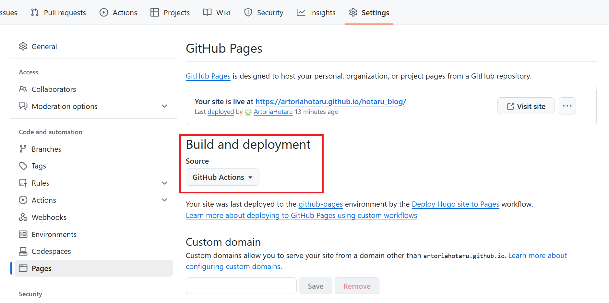
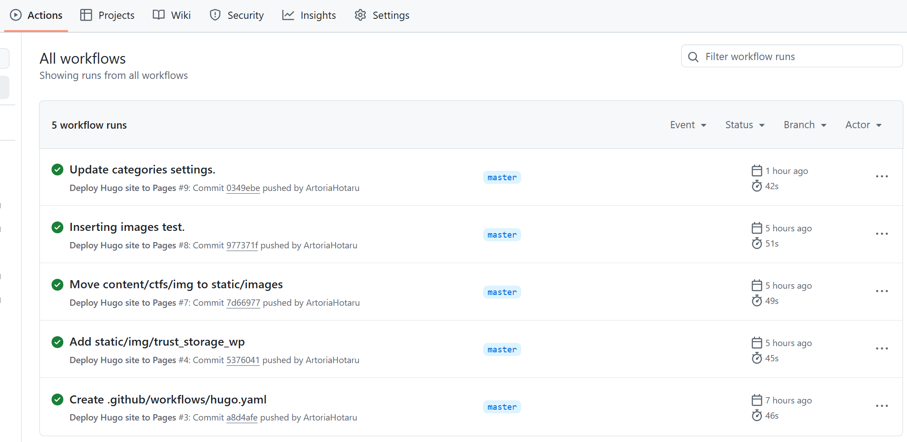

# Hugo

## Install

下载预编译版本：[latest release](https://github.com/gohugoio/hugo/releases/latest)

之后解压并将可执行文件`hugo.exe`所在目录添加到系统环境变量即可。

常用命令：

```bash
# 初始化网站
hugo new site hotaru_blog --format yaml

# 按模板添加新的文章
hugo new xxx.md # 使用默认模板生成文件
hugo new --kind xxx yyy.md # 使用archetypes/xxx.md作为模板生成新文件
```

`format`参数指定网站配置文件格式。

## 本地预览

之后，在blog根目录运行

```bash
hugo server
```

会在blog根目录生成public目录即渲染后的网站，之后访问`http://localhost:1313/`即可预览网站效果。

## 文章模板

将.md模板文件放置在`archetypes`目录下。

示例模板：[archetypes](https://github.com/ArtoriaHotaru/hotaru_blog/tree/master/archetypes)

用模板生成新文章：

```bash
hugo new ctfs/xxx/index.md --kind ctf 
hugo new daily/yyy/index.md --kind daily 
```

> [!error]
>
> 报错：
>
> ```bash
> > hugo new .\index.md --kind daily
> Error: no existing content directory configured for this project
> ```
>
> 原因：通过模板创建文章的路径为相对于hugo.yaml配置参数[`contentDir`](https://gohugo.io/configuration/all/#contentdir)的相对路径，默认配置为`content`，但是保险起见可以在hugo.yaml中添加：
>
> ```yaml
> contentDir: "content"
> ```
>
> 创建文件：
>
> ```bash
> hugo new daily/xxx/index.md --kind daily
> ```
>
> 

# PaperMod

## Install

参考[PaperMod Installation](https://github.com/adityatelange/hugo-PaperMod/wiki/Installation)

```bash
hugo new site hotaru_blog --format yaml
cd hotaru_blog
git clone https://github.com/adityatelange/hugo-PaperMod themes/PaperMod --depth=1
cd themes/PaperMod
git pull
```

在网站的配置`hugo.yaml`中添加：

```yaml
theme: ["PaperMod"]
```


## hugo.yml配置

参考：[exampleSite](https://github.com/adityatelange/hugo-PaperMod/blob/exampleSite/config.yml)

目前的配置：[hugo.yaml](https://github.com/ArtoriaHotaru/hotaru_blog/blob/master/hugo.yaml)


## PaperMod Customize

参考：

* [修改hugo中markdown的基础渲染](https://aikenh.cn/posts/%E4%BF%AE%E6%94%B9hugo%E4%B8%ADmarkdown%E7%9A%84%E5%9F%BA%E7%A1%80%E6%B8%B2%E6%9F%93/)
* https://github.com/AikenH/papermod-sidebar.git

> [!note]
>
> 没有特别说明的情况下，所作修改均为将`blog_root/themes/PaperMod`路径下的配置复制一份到`blog_root`下，即覆盖原有配置，避免更新主题时所作修改失效。

### 代码块折叠

参考 [[Feat\] update default code style · AikenH ](https://github.com/AikenH/papermod-sidebar/commit/2305a1c5a7098edaee8c850bae4efa2e22bb700d)（和示例代码有一些不同）。

实现了代码块折叠，并将`Copy`按钮移动到标题栏。

需要修改的文件：

* assets/css/common
  * main.css
  * post-single. css
* laylouts
  * \_default/\_markup
    * render-codeblock.html
  * partials
    * footer.html

main.css:

```css
.copy-code {
    position: absolute;
    top: 4px;
    right: 0px;
    color: rgba(255, 255, 255, 0.482);
    border-radius: 0px;
    padding: 0 20px;
    font-size: 1rem;
    user-select: none;
}
.copy-code:hover{
    transform: scale(1.1);
    font-weight: bold;
}
```

post-single. css

> [!note]
>
> 这里作者后来添加了`.code-block-open,.code-block-close`相关的内容没有在git的commit中体现，也是对比他博客的源码发现的css样式缺失，回溯了一下文件修改历史补上了。

```css
.post-content .highlight:not(table) {
    margin: 0px auto 10px auto;
    background: var(--code-block-bg) !important;
    border-radius: var(--radius);
    direction: ltr;
}

.code-block {
    background: var(--code-block-bg);
    box-shadow: 0px 4px 30px rgba(0, 0, 0, 0.5);
    border-radius: 8px;
    position: relative;
    /* padding: 2px; */
    margin: 8px 0px;
}

.code-title {
    display: flex;
    align-items: center;
    /* justify-content: space-between; */
    margin: 10px;
    border-bottom: 1px solid rgba(255, 255, 255, 0.602);
    cursor: pointer;
}

.code-title span {
    letter-spacing: 1.57px;
    color: rgb(212 212 212);
    /* width: 90%; */
    /* align-items: center; */
    font-size: 1rem;
    padding: 5px;
    padding-left: 10px;
    text-transform: capitalize;
}

.code-has-hidden-child {
    border: 4px solid rgb(195, 224, 163);
}

.code-block-open,
.code-block-close{
    margin-top: 5px;
}
.code-has-hidden-child .code-block-open,
.code-block-close{
    display: none;
}
.code-has-hidden-child .code-block-close,
.code-block-open{
    display: inline;
}
```

render-codeblock.html

```html
<div class="code-block">
    <div class="code-title" onclick="toggleCode(this)">
        <span class="code-block-open"><ion-icon name="chevron-down-outline"></ion-icon></span>
        <span class="code-block-close"><ion-icon name="chevron-forward-outline"></ion-icon></ion-icon></span>
        <span>{{.Type}}</span>
    </div>
    <div class="code-content">
        {{ $result := transform.HighlightCodeBlock . }}
        {{ $result.Wrapped }}
    </div>
</div>

<script>
function toggleCode(element) {
    const codeContent = element.nextElementSibling;
    if (codeContent.style.display === "none" || codeContent.style.display === "") {
        codeContent.style.display = "block"; // Show the code block
        codeContent.parentNode.classList.remove("code-has-hidden-child");
    } else {
        codeContent.style.display = "none"; // Hide the code block
        codeContent.parentNode.classList.add("code-has-hidden-child");
    }
}
</script>
```

footer.html

> [!note]
>
> 这里和原作者的实现不太一样，照搬原作者代码失败，对比网页源码发现好像是因为作者改过chroma所以标签的层级关系和主题源代码不同，所以自己根据实际情况魔改了一下。


```html
{{- if (and (eq .Kind "page") (ne .Layout "archives") (ne .Layout "search") (.Param "ShowCodeCopyButtons")) }}
<script>
    document.querySelectorAll('pre > code').forEach((codeblock) => {
        const container = codeblock.parentNode.parentNode;
        console.log(container);

        const copybutton = document.createElement('button');
        copybutton.classList.add('copy-code');
        copybutton.innerHTML = '{{- i18n "code_copy" | default "copy" }}';

        function copyingDone() {
            copybutton.innerHTML = '{{- i18n "code_copied" | default "copied!" }}';
            setTimeout(() => {
                copybutton.innerHTML = '{{- i18n "code_copy" | default "copy" }}';
            }, 2000);
        }

        copybutton.addEventListener('click', (cb) => {
            if ('clipboard' in navigator) {
                navigator.clipboard.writeText(codeblock.textContent);
                copyingDone();
                return;
            }

            const range = document.createRange();
            range.selectNodeContents(codeblock);
            const selection = window.getSelection();
            selection.removeAllRanges();
            selection.addRange(range);
            try {
                document.execCommand('copy');
                copyingDone();
            } catch (e) { };
            selection.removeRange(range);
        });

        // if (container.classList.contains("highlight")) {
        if (container.parentNode.parentNode.classList.contains("code-block")) {
            console.log("active");
            container.appendChild(copybutton);
        } else if (container.parentNode.firstChild == container) {
            // td containing LineNos
        } else if (codeblock.parentNode.parentNode.parentNode.parentNode.parentNode.nodeName == "TABLE") {
            // table containing LineNos and code
            codeblock.parentNode.parentNode.parentNode.parentNode
            .parentNode.parentNode.parentNode.parentNode.parentNode
            .appendChild(copybutton);
        } else {
            // code blocks not having highlight as parent class
            codeblock.parentNode.appendChild(copybutton);
        }
    });
</script>
{{- end }}
```

效果见本文各种代码块。

> [!error]
>
> 代码块的展开/收缩箭头图标无法显示，原因是没有安装[ionicons](https://ionic.io/ionicons)。参考官网手册，需要在`layouts/partials/extend_head.html`中添加如下内容
>
> ```html
> <script type="module" src="https://unpkg.com/ionicons@7.1.0/dist/ionicons/ionicons.esm.js"></script>
> <script nomodule src="https://unpkg.com/ionicons@7.1.0/dist/ionicons/ionicons.js"></script>
> ```


### Alert-Blockquote 特殊引用块

参考：

* [[Feat] update markdown render tempalte to support alert](https://github.com/AikenH/papermod-sidebar/commit/3cf3f4ff864604a48d5d04bfee06a4282255420e)
* [Alert-Blockquote 特殊引用块](https://aikenh.cn/posts/%E4%BF%AE%E6%94%B9hugo%E4%B8%ADmarkdown%E7%9A%84%E5%9F%BA%E7%A1%80%E6%B8%B2%E6%9F%93/#alert-blockquote-%E7%89%B9%E6%AE%8A%E5%BC%95%E7%94%A8%E5%9D%97)

需要修改的文件：

* assets/css
  * common
    * post-single. css
  * extended
    * blockquote.css
* laylouts
  * \_default/\_markup
    * render-blockquote.html

post-single. css:

```css
/* .post-content blockquote {
    margin: 20px 0;
    padding: 0 14px;
    border-inline-start: 3px solid var(--primary);
} */
```

blockquote.css

```css
.alert-blockquote {
  --title-color: #fff;
  --content-color: inherit;
  padding: 18px 18px 10px 18px !important;
  line-height: 24px;
  margin: 1rem 0;
  border-radius: 4px;
  color: var(--content-color);
  /* border-left: none !important; */
  /* border: 1px solid black; */
}

.dark .alert-blockquote *,
.alert-blockquote * {
  color: var(--content-color) !important;
}

.post-content blockquote {
  margin: 10px 0;
  padding: unset;
}

.alert-blockquote .alert-heading {
  margin: -18px -18px 12px;
  padding: 10px 18px;
  border-radius: 4px 4px 0 0;
  font-weight: 600;
  color: var(--title-color) !important;
  display: flex;
  align-items: center;
}

.alert-blockquote .alert-heading svg {
  width: 1em !important;
  height: 1em !important;
  margin-right: 0.5rem !important;
  fill: currentColor !important;
}

.alert-blockquote p:last-child {
  margin-bottom: 0;
}

/* Light theme */
/* default */
.alert-blockquote {
  border-top:unset;
  /* border: 1px solid #166dd0; */
  /* --title-background-color: rgba(221, 233, 244, 0.631); */
  --content-background-color: rgba(221, 233, 244, 0.602);
}
.alert-blockquote .alert-heading {
  /* border-bottom: 1px dashed #166dd07c; */
  color: #0969da !important;
}

/* note */
.alert-blockquote.alert-note {
  /* border: 1px solid #166dd0; */
  /* border-left-color: #0969da !important; */
  /* --title-background-color: rgba(221, 233, 244, 0.631); */
  --content-background-color: rgba(221, 233, 244, 0.602);
}
.alert-blockquote.alert-note .alert-heading {
  color: #0969da !important;
}

/* tip */
.alert-blockquote.alert-tip {
  /* border: 1px solid #1a7f37; */
  /* --title-background-color: rgb(173,193,182); */
  --content-background-color: rgba(222, 240, 223, 0.7);
}
.alert-blockquote.alert-tip .alert-heading {
  color: #1a7f37 !important;
  /* border-bottom: 1px dashed #1a7f37; */
}

/* important */
.alert-blockquote.alert-important {
  /* border: 1px solid #8250df; */
  /* border-left-color: #8250df !important; */
  /* --title-background-color: #6843ae7c; */
  --content-background-color: rgba(235, 227, 245, 0.9);
}

.alert-blockquote.alert-important .alert-heading {
  color: #8250df !important;
  /* border-bottom: 1px dashed #8250df; */
}

/* warning */
.alert-blockquote.alert-warning {
  /* border: 1px solid #9a6700; */
  /* border-left-color: #9a6700 !important; */
  /* --title-background-color: rgb(232, 198, 140); */
  --content-background-color: rgba(243, 232, 222);
}
.alert-blockquote.alert-warning .alert-heading {
  color: #9a6700 !important;
  /* border-bottom: 1px dashed #9a6700; */
}

/* caution */
.alert-blockquote.alert-error,
.alert-blockquote.alert-caution {
  /* border: 1px solid #cf222e; */
  /* border-left-color: #cf222e !important; */
  /* --title-background-color: rgb(244, 224, 223,0.5); */
  --content-background-color: rgba(243, 207, 205, 0.9);
}
.alert-blockquote.alert-error .alert-heading,
.alert-blockquote.alert-caution .alert-heading {
  color: #cf222e !important;
  /* border-bottom: 1px dashed #cf222e; */
}

/* Dark theme */
.dark .alert-blockquote {
  border-top:unset;
  /* --content-color: #d0d7dd; */
  /* --title-background-color: #5151527c; */
  --content-background-color: rgba(22, 37, 50, 0.8);
}

.dark .alert-blockquote .alert-heading {
  color: #58a6ff !important;
}

.dark .alert-blockquote.alert-note {
  /* --title-background-color: #58a6ff7c; */
  --content-background-color: rgba(22, 37, 50, 0.8);
}
.dark .alert-blockquote.alert-note .alert-heading {
  color: #58a6ff !important;
}

.dark .alert-blockquote.alert-tip {
  /* --title-background-color: #82bd8a7c; */
  --content-background-color: rgba(55, 84, 56, 0.7);
}
.dark .alert-blockquote.alert-tip .alert-heading {
  color: #3fb950 !important;
}

.dark .alert-blockquote.alert-important {
  /* --title-background-color: #9173c57c; */
  --content-background-color: rgba(46, 32, 62, 0.9);
}
.dark .alert-blockquote.alert-important .alert-heading {
  color: #8d62d8 !important;
}

.dark .alert-blockquote.alert-warning {
  /* --title-background-color: #d1b068a0; */
  --content-background-color: rgb(84, 68, 55);
}
.dark .alert-blockquote.alert-warning .alert-heading {
  color: #d1b271 !important;
}

.dark .alert-blockquote.alert-error,
.dark .alert-blockquote.alert-caution {
  /* --title-background-color: #c94a43; */
  --content-background-color: rgba(108, 57, 54, 0.9);
}
.dark .alert-blockquote.alert-error .alert-heading,
.dark .alert-blockquote.alert-caution .alert-heading {
  color: #ff9791 !important;
}

.alert-blockquote .alert-heading {
  background: var(--title-background-color);
}

.alert-blockquote {
  background: var(--content-background-color);
}

blockquote:not(.alert-blockquote){
  font-size: 0.9rem;
  border-inline-start: 4px solid rgb(0, 132, 255);
  background: rgba(221, 233, 244, 0.602);
  padding: 10px 10px 2px 18px !important;
  margin: 1rem 0;
}
```

render-blockquote.html:

```html
{{ $alertTypes := dict
    "note" "<path d=\"M0 8a8 8 0 1 1 16 0A8 8 0 0 1 0 8Zm8-6.5a6.5 6.5 0 1 0 0 13 6.5 6.5 0 0 0 0-13ZM6.5 7.75A.75.75 0 0 1 7.25 7h1a.75.75 0 0 1 .75.75v2.75h.25a.75.75 0 0 1 0 1.5h-2a.75.75 0 0 1 0-1.5h.25v-2h-.25a.75.75 0 0 1-.75-.75ZM8 6a1 1 0 1 1 0-2 1 1 0 0 1 0 2Z\"></path>"
    "tip" "<path d=\"M8 1.5c-2.363 0-4 1.69-4 3.75 0 .984.424 1.625.984 2.304l.214.253c.223.264.47.556.673.848.284.411.537.896.621 1.49a.75.75 0 0 1-1.484.211c-.04-.282-.163-.547-.37-.847a8.456 8.456 0 0 0-.542-.68c-.084-.1-.173-.205-.268-.32C3.201 7.75 2.5 6.766 2.5 5.25 2.5 2.31 4.863 0 8 0s5.5 2.31 5.5 5.25c0 1.516-.701 2.5-1.328 3.259-.095.115-.184.22-.268.319-.207.245-.383.453-.541.681-.208.3-.33.565-.37.847a.751.751 0 0 1-1.485-.212c.084-.593.337-1.078.621-1.489.203-.292.45-.584.673-.848.075-.088.147-.173.213-.253.561-.679.985-1.32.985-2.304 0-2.06-1.637-3.75-4-3.75ZM5.75 12h4.5a.75.75 0 0 1 0 1.5h-4.5a.75.75 0 0 1 0-1.5ZM6 15.25a.75.75 0 0 1 .75-.75h2.5a.75.75 0 0 1 0 1.5h-2.5a.75.75 0 0 1-.75-.75Z\"></path>"
    "important" "<path d=\"M0 1.75C0 .784.784 0 1.75 0h12.5C15.216 0 16 .784 16 1.75v9.5A1.75 1.75 0 0 1 14.25 13H8.06l-2.573 2.573A1.458 1.458 0 0 1 3 14.543V13H1.75A1.75 1.75 0 0 1 0 11.25Zm1.75-.25a.25.25 0 0 0-.25.25v9.5c0 .138.112.25.25.25h2a.75.75 0 0 1 .75.75v2.19l2.72-2.72a.749.749 0 0 1 .53-.22h6.5a.25.25 0 0 0 .25-.25v-9.5a.25.25 0 0 0-.25-.25Zm7 2.25v2.5a.75.75 0 0 1-1.5 0v-2.5a.75.75 0 0 1 1.5 0ZM9 9a1 1 0 1 1-2 0 1 1 0 0 1 2 0Z\"></path>"
    "warning" "<path d=\"M6.457 1.047c.659-1.234 2.427-1.234 3.086 0l6.082 11.378A1.75 1.75 0 0 1 14.082 15H1.918a1.75 1.75 0 0 1-1.543-2.575Zm1.763.707a.25.25 0 0 0-.44 0L1.698 13.132a.25.25 0 0 0 .22.368h12.164a.25.25 0 0 0 .22-.368Zm.53 3.996v2.5a.75.75 0 0 1-1.5 0v-2.5a.75.75 0 0 1 1.5 0ZM9 11a1 1 0 1 1-2 0 1 1 0 0 1 2 0Z\"></path>"
    "caution" "<path d=\"M4.47.22A.749.749 0 0 1 5 0h6c.199 0 .389.079.53.22l4.25 4.25c.141.14.22.331.22.53v6a.749.749 0 0 1-.22.53l-4.25 4.25A.749.749 0 0 1 11 16H5a.749.749 0 0 1-.53-.22L.22 11.53A.749.749 0 0 1 0 11V5c0-.199.079-.389.22-.53Zm.84 1.28L1.5 5.31v5.38l3.81 3.81h5.38l3.81-3.81V5.31L10.69 1.5ZM8 4a.75.75 0 0 1 .75.75v3.5a.75.75 0 0 1-1.5 0v-3.5A.75.75 0 0 1 8 4Zm0 8a1 1 0 1 1 0-2 1 1 0 0 1 0 2Z\"></path>"
    "error" "<path d=\"M4.47.22A.749.749 0 0 1 5 0h6c.199 0 .389.079.53.22l4.25 4.25c.141.14.22.331.22.53v6a.749.749 0 0 1-.22.53l-4.25 4.25A.749.749 0 0 1 11 16H5a.749.749 0 0 1-.53-.22L.22 11.53A.749.749 0 0 1 0 11V5c0-.199.079-.389.22-.53Zm.84 1.28L1.5 5.31v5.38l3.81 3.81h5.38l3.81-3.81V5.31L10.69 1.5ZM8 4a.75.75 0 0 1 .75.75v3.5a.75.75 0 0 1-1.5 0v-3.5A.75.75 0 0 1 8 4Zm0 8a1 1 0 1 1 0-2 1 1 0 0 1 0 2Z\"></path>"
  }}
  
  {{
    $default := "<path d=\"M0 8a8 8 0 1 1 16 0A8 8 0 0 1 0 8Zm8-6.5a6.5 6.5 0 1 0 0 13 6.5 6.5 0 0 0 0-13ZM6.5 7.75A.75.75 0 0 1 7.25 7h1a.75.75 0 0 1 .75.75v2.75h.25a.75.75 0 0 1 0 1.5h-2a.75.75 0 0 1 0-1.5h.25v-2h-.25a.75.75 0 0 1-.75-.75ZM8 6a1 1 0 1 1 0-2 1 1 0 0 1 0 2Z\"></path>"
  }}
    
    
  {{ if eq .Type "alert" }}
  <blockquote class="alert-blockquote alert-{{ .AlertType }}">
    <p class="alert-heading">
      <svg xmlns="http://www.w3.org/2000/svg" viewBox="0 0 16 16" width="16" height="16">
        {{- $alertType := index $alertTypes .AlertType | default $default }}
        {{ $alertType | safeHTML }}
      </svg>
      <span>{{ or (i18n .AlertType) (title .AlertType) }}</span>
    </p>
    {{ .Text | safeHTML }}
  </blockquote>
  {{ else }}
  <blockquote>
    {{ .Text | safeHTML }}
  </blockquote>
  {{ end }}
```

使用：

```markdown
> [!note]
> This is a note.

> [!tip]
> This is a tip.
```

效果：

> [!note]
> This is a note.

> [!tip]
> This is a tip.

### CTFs Section list navigate page

参考：

* [Hugo中的内容列表](https://hugo.opendocs.io/templates/lists/)
* [模板查找顺序](https://hugo.opendocs.io/templates/lookup-order/)
* [章节页面模板](https://hugo.opendocs.io/templates/section-templates/)
* [A quick reference guide to Hugo’s page collections.](https://gohugo.io/quick-reference/page-collections/)

修改/新增的文件：

* assets/css/extended/ctfs.css
* laylouts/\_default/ctfs.html
* content/ctfs/\_index.md

ctfs.html：

```html
{{- define "main" }}

{{- if .Title }}
<header class="page-header">
  {{- partial "breadcrumbs.html" . }}
  <h1>
    {{ .Title }}
    {{- if and (or (eq .Kind `term`) (eq .Kind `section`)) (.Param "ShowRssButtonInSectionTermList") }}
    {{- with .OutputFormats.Get "rss" }}
    <a href="{{ .RelPermalink }}" title="RSS" aria-label="RSS">
      <svg xmlns="http://www.w3.org/2000/svg" viewBox="0 0 24 24" fill="none" stroke="currentColor" stroke-width="2"
        stroke-linecap="round" stroke-linejoin="round" height="23">
        <path d="M4 11a9 9 0 0 1 9 9" />
        <path d="M4 4a16 16 0 0 1 16 16" />
        <circle cx="5" cy="19" r="1" />
      </svg>
    </a>
    {{- end }}
    {{- end }}
  </h1>
  {{- if .Description }}
  <div class="post-description">
    {{ .Description | markdownify }}
  </div>
  {{- end }}
</header>
{{- end }}

{{- if .Content }}
<div class="post-content">
  {{- if not (.Param "disableAnchoredHeadings") }}
  {{- partial "anchored_headings.html" .Content -}}
  {{- else }}{{ .Content }}{{ end }}
</div>
{{- end }}

<div class="ctf-table">
  <table>
    <thead>
        <tr>
        <th scope="col">Title</th>
        <th scope="col">Type</th>
        <th scope="col">Highlights</th>
        <th scope="col">Source</th>
        <th scope="col">Difficulty</th>
        </tr>
    </thead>
    <tbody>
      {{- $pages := union .RegularPages .Sections }}
      {{- $paginator := .Paginate $pages }}
      {{- $term := .Data.Term }}
      {{- range $index, $page := $paginator.Pages }}
      <tr>  
        <td> <a href="{{ .RelPermalink }}">{{ .LinkTitle }}</a> </td>
        <td>
          <ul class="small-tags">
            {{- range $name := .Params.series }}
            {{- with site.GetPage (printf "/series/%s" $name) }}
            <li><a style="background: var(--{{ $name }});" href="{{ .Permalink }}">{{ $name }}</a></li>
            {{- end }}
            {{- end }}
          </ul>
        </td>
        <td> {{ .Params.Highlights }} </td>
        <td> {{ .Params.Source }} </td>
        <td style="border-right: 0; text-align: center;"> {{ .Params.Difficulty }} </td>
      </tr>
      {{- end }}
  </tbody>
  </table>
</div>

{{- end }}{{- /* end main */ -}}
```

ctfs.css：

```css
.ctf-table {
    position: absolute;
    left: -48px;
    margin: auto;
    padding: var(--gap);
}

.ctf-table table {
    font-family:  "Maple Mono CN Medium";
    font-size: 14px;
    /* font-weight: 400; */
    position: relative;
    border: 0px;
    margin: 0px;
    min-width: calc(var(--main-width) + var(--gap) * 2 + 200px);
    border-collapse: collapse;
    border: none;
}

.ctf-table th {
    font-size: 14px;
    font-weight: bold;
    color: rgba(55, 53, 47, 0.65);
    padding: 10px 8px;
    border-bottom: 2px solid #ddd;
    text-align: center;
}

.ctf-table td {
    /* color: #669; */
    padding: 8px 8px 8px 8px;
    border-top: 1px solid #ddd;
    border-right: 1px solid #ddd;
    text-align: left;
}
.ctf-table tbody tr:hover td {
    font-weight: bold;
    color: rgba(55, 53, 47, 0.65);;
}

/* .ctf-table a {
    color: #669;
} */

.small-tags {
    --pwn: rgb(167, 195, 200);
    --stack: rgb(183, 220, 212);
    --heap: rgb(223, 241, 241);
    --shellcode: rgb(248, 228, 211);
    --cpp: rgb(210, 219, 229);
    --go: rgb(248, 229, 226);
    --sandbox: rgb(204, 235, 214);
    --qemu: rgb(246, 235, 188);
    --kernel: rgb(189, 213, 214);
    --windows: rgb(250, 219, 223);
    --aarch64: rgb(233, 247, 182);
    --arm: rgb(233, 247, 182);
    --mips: rgb(195, 224, 163);
    --ppc: rgb(142, 191, 90);
    --reverse: rgb(187, 214, 221);
    --realword: rgb(245, 190, 168);
    /* more... */
    --active: rgb(167, 195, 200);
}

.small-tags {
    padding: 2px 4px;
}

.small-tags li {
    display: inline-block;
    margin: 1px;
    font-weight: 50;
}

.small-tags a {
    display: block;
    padding: 2px 6px;
    /* background: var(--tertiary); */
    border-radius: 6px;
    transition: transform 0.1s;
}

.small-tags a:active {
    background: var(--active);
    transform: scale(0.96);
}
```

\_index.md：

```markdown
---
title: "CTFs"
layout: "ctfs"
url: "/ctfs"
summary: ctfs home page
---
```


### 显示侧边目录

参考：[在PaperMod中引入侧边目录和阅读进度显示](https://www.zhouxin.space/logs/introduce-side-toc-and-reading-percentage-to-papermod/)

修改/新增的文件：

* layouts/partials/toc.html
* assets/css/extended/toc.css

toc.html：

```html
{{- $headers := findRE "<h[1-6].*?>(.|\n])+?</h[1-6]>" .Content -}}
{{- $has_headers := ge (len $headers) 1 -}}
{{- if $has_headers -}}
<aside id="toc-container" class="toc-container wide">
    <div class="toc">
        <details {{if (.Param "TocOpen") }} open{{ end }}>
            <summary accesskey="c" title="(Alt + C)">
                <span class="details">{{- i18n "toc" | default "Table of Contents" }}</span>
            </summary>

            <div class="inner">
                {{- $largest := 6 -}}
                {{- range $headers -}}
                {{- $headerLevel := index (findRE "[1-6]" . 1) 0 -}}
                {{- $headerLevel := len (seq $headerLevel) -}}
                {{- if lt $headerLevel $largest -}}
                {{- $largest = $headerLevel -}}
                {{- end -}}
                {{- end -}}

                {{- $firstHeaderLevel := len (seq (index (findRE "[1-6]" (index $headers 0) 1) 0)) -}}

                {{- $.Scratch.Set "bareul" slice -}}
                <ul>
                    {{- range seq (sub $firstHeaderLevel $largest) -}}
                    <ul>
                        {{- $.Scratch.Add "bareul" (sub (add $largest .) 1) -}}
                        {{- end -}}
                        {{- range $i, $header := $headers -}}
                        {{- $headerLevel := index (findRE "[1-6]" . 1) 0 -}}
                        {{- $headerLevel := len (seq $headerLevel) -}}

                        {{/* get id="xyz" */}}
                        {{- $id := index (findRE "(id=\"(.*?)\")" $header 9) 0 }}

                        {{- /* strip id="" to leave xyz, no way to get regex capturing groups in hugo */ -}}
                        {{- $cleanedID := replace (replace $id "id=\"" "") "\"" "" }}
                        {{- $header := replaceRE "<h[1-6].*?>((.|\n])+?)</h[1-6]>" "$1" $header -}}

                        {{- if ne $i 0 -}}
                        {{- $prevHeaderLevel := index (findRE "[1-6]" (index $headers (sub $i 1)) 1) 0 -}}
                        {{- $prevHeaderLevel := len (seq $prevHeaderLevel) -}}
                        {{- if gt $headerLevel $prevHeaderLevel -}}
                        {{- range seq $prevHeaderLevel (sub $headerLevel 1) -}}
                        <ul>
                            {{/* the first should not be recorded */}}
                            {{- if ne $prevHeaderLevel . -}}
                            {{- $.Scratch.Add "bareul" . -}}
                            {{- end -}}
                            {{- end -}}
                            {{- else -}}
                            </li>
                            {{- if lt $headerLevel $prevHeaderLevel -}}
                            {{- range seq (sub $prevHeaderLevel 1) -1 $headerLevel -}}
                            {{- if in ($.Scratch.Get "bareul") . -}}
                        </ul>
                        {{/* manually do pop item */}}
                        {{- $tmp := $.Scratch.Get "bareul" -}}
                        {{- $.Scratch.Delete "bareul" -}}
                        {{- $.Scratch.Set "bareul" slice}}
                        {{- range seq (sub (len $tmp) 1) -}}
                        {{- $.Scratch.Add "bareul" (index $tmp (sub . 1)) -}}
                        {{- end -}}
                        {{- else -}}
                    </ul>
                    </li>
                    {{- end -}}
                    {{- end -}}
                    {{- end -}}
                    {{- end }}
                    <li>
                        <a href="#{{- $cleanedID -}}" aria-label="{{- $header | plainify -}}">{{- $header | safeHTML -}}</a>
                        {{- else }}
                    <li>
                        <a href="#{{- $cleanedID -}}" aria-label="{{- $header | plainify -}}">{{- $header | safeHTML -}}</a>
                        {{- end -}}
                        {{- end -}}
                        <!-- {{- $firstHeaderLevel := len (seq (index (findRE "[1-6]" (index $headers 0) 1) 0)) -}} -->
                        {{- $firstHeaderLevel := $largest }}
                        {{- $lastHeaderLevel := len (seq (index (findRE "[1-6]" (index $headers (sub (len $headers) 1)) 1) 0)) }}
                    </li>
                    {{- range seq (sub $lastHeaderLevel $firstHeaderLevel) -}}
                    {{- if in ($.Scratch.Get "bareul") (add . $firstHeaderLevel) }}
                </ul>
                {{- else }}
                </ul>
                </li>
                {{- end -}}
                {{- end }}
                </ul>
            </div>
        </details>
    </div>
</aside>
<script>
    let activeElement;
    let elements;
    
    document.addEventListener('DOMContentLoaded', function (event) {
        checkTocPosition();
    
        elements = document.querySelectorAll('h1[id],h2[id],h3[id],h4[id],h5[id],h6[id]');
        if (elements.length > 0) {
            // Make the first header active
            activeElement = elements[0];
            const id = encodeURI(activeElement.getAttribute('id')).toLowerCase();
            document.querySelector(`.inner ul li a[href="#${id}"]`).classList.add('active');
        }
    
        // Add event listener for the "back to top" link
        const topLink = document.getElementById('top-link');
        if (topLink) {
            topLink.addEventListener('click', (event) => {
                // Prevent the default action
                event.preventDefault();
    
                // Smooth scroll to the top
                window.scrollTo({ top: 0, behavior: 'smooth' });
            });
        }
    }, false);
    
    window.addEventListener('resize', function(event) {
        checkTocPosition();
    }, false);
    
    window.addEventListener('scroll', () => {
        // Get the current scroll position
        const scrollPosition = window.pageYOffset || document.documentElement.scrollTop;
    
        // Check if the scroll position is at the top of the page
        if (scrollPosition === 0) {
            return;
        }
    
        // Ensure elements is a valid NodeList
        if (elements && elements.length > 0) {
            // Check if there is an object in the top half of the screen or keep the last item active
            activeElement = Array.from(elements).find((element) => {
                if ((getOffsetTop(element) - scrollPosition) > 0 && 
                    (getOffsetTop(element) - scrollPosition) < window.innerHeight / 2) {
                    return element;
                }
            }) || activeElement;
    
            elements.forEach(element => {
                const id = encodeURI(element.getAttribute('id')).toLowerCase();
                const tocLink = document.querySelector(`.inner ul li a[href="#${id}"]`);
                if (element === activeElement){
                    tocLink.classList.add('active');
    
                    // Ensure the active element is in view within the .inner container
                    const tocContainer = document.querySelector('.toc .inner');
                    const linkOffsetTop = tocLink.offsetTop;
                    const containerHeight = tocContainer.clientHeight;
                    const linkHeight = tocLink.clientHeight;
    
                    // Calculate the scroll position to center the active link
                    const scrollPosition = linkOffsetTop - (containerHeight / 2) + (linkHeight / 2);
                    tocContainer.scrollTo({ top: scrollPosition, behavior: 'smooth' });
                } else {
                    tocLink.classList.remove('active');
                }
            });
        }
    }, false);
    
    const main = parseInt(getComputedStyle(document.body).getPropertyValue('--article-width'), 10);
    const toc = parseInt(getComputedStyle(document.body).getPropertyValue('--toc-width'), 10);
    const gap = parseInt(getComputedStyle(document.body).getPropertyValue('--gap'), 10);
    
    function checkTocPosition() {
        const width = document.body.scrollWidth;
    
        if (width - main - (toc * 2) - (gap * 4) > 0) {
            document.getElementById("toc-container").classList.add("wide");
        } else {
            document.getElementById("toc-container").classList.remove("wide");
        }
    }
    
    function getOffsetTop(element) {
        if (!element.getClientRects().length) {
            return 0;
        }
        let rect = element.getBoundingClientRect();
        let win = element.ownerDocument.defaultView;
        return rect.top + win.pageYOffset;   
    }
    
</script>
{{- end }}
```

toc.css：

```css
:root {
    --nav-width: 1380px;
    --article-width: 650px;
    --toc-width: 300px;
}

.toc {
    margin: 0 2px 40px 2px;
    border: 1px solid var(--border);
    background: var(--entry);
    border-radius: var(--radius);
    padding: 0.4em;
}

.toc-container.wide {
    position: absolute;
    height: 100%;
    border-right: 1px solid var(--border);
    left: calc((var(--toc-width) + var(--gap)) * -1);
    top: calc(var(--gap) * 2);
    width: var(--toc-width);
}

.wide .toc {
    position: sticky;
    top: var(--gap);
    border: unset;
    background: unset;
    border-radius: unset;
    width: 100%;
    margin: 0 2px 40px 2px;
}

.toc details summary {
    cursor: zoom-in;
    margin-inline-start: 20px;
    padding: 12px 0;
}

.toc details[open] summary {
    font-weight: 500;
}

.toc-container.wide .toc .inner {
    margin: 0;
}

.active {
    font-size: 110%;
    font-weight: 600;
}

.toc ul {
    list-style-type: circle;
}

.toc .inner {
    margin: 0 0 0 20px;
    padding: 0px 15px 15px 20px;
    font-size: 16px;

    /*目录显示高度*/
    max-height: 83vh;
    overflow-y: auto;
}

.toc .inner::-webkit-scrollbar-thumb {  /*滚动条*/
    background: var(--border);
    border: 7px solid var(--theme);
    border-radius: var(--radius);
}

.toc li ul {
    margin-inline-start: calc(var(--gap) * 0.5);
    list-style-type: none;
}

.toc li {
    list-style: none;
    font-size: 0.95rem;
    padding-bottom: 5px;
}

.toc li a:hover {
    color: var(--secondary);
}
```

### 在文章头部添加附件链接

修改/新增的文件：

* layouts
  * partials
    * post_attachment.html
  * \_default
    * single.html

post_attachment.html:

```html
{{ if .Params.attachmentURL }}
{{ $url := urls.Parse .Params.attachmentURL }}

{{- if or .Params.author site.Params.author (.Param "ShowReadingTime") (not .Date.IsZero) .IsTranslated (or .Params.editPost.URL site.Params.editPost.URL) }}&nbsp;|&nbsp;{{- end -}}
<span class="post-attach">
    <a href="{{ $url }}" target="_blank" rel="noopener noreferrer">
        <svg xmlns="http://www.w3.org/2000/svg" viewBox="0 0 16 16" width="16" height="16">
            <path d="M 19.007812 13.101562 C 21.662109 10.558594 21.662109 6.445312 19.007812 3.902344 C 16.359375 1.365234 12.058594 1.365234 9.404297 3.902344 M 7.916016 17.806641 L 15.808594 10.253906 C 16.757812 9.345703 16.757812 7.875 15.808594 6.966797 C 14.859375 6.064453 13.324219 6.064453 12.375 6.966797 L 4.541016 14.466797 C 2.742187 16.189453 2.742187 18.984375 4.541016 20.707031 C 6.345703 22.429687 9.263672 22.429687 11.0625 20.707031 L 15.035156 16.904297 M 3 10.037109 L 6.199219 6.966797" transform="matrix(0.666667,0,0,0.666667,0,0)"/>
        </svg>
        {{- (site.Params.CanonicalLinkText | default .Params.CanonicalLinkText) | default "Attachment" -}}
    </a>
</span>
{{- end }}

<style>
    .post-attach a {
        color: #0969da;
    }
    .post-attach a:hover {
        font-weight: bold;
        color: rgb(0, 57, 109);
    }
    .post-attach svg path {
        fill: none;
        stroke-width: 2.5;
        stroke-linecap: round;
        stroke-linejoin: miter;
        stroke:#0969da;
        stroke-opacity: 1;
        stroke-miterlimit: 4;
    }
</style>
```

single.html:

```html
    <div class="post-meta">
      {{- partial "post_meta.html" . -}}
      {{- partial "translation_list.html" . -}}
      {{- partial "edit_post.html" . -}}
      {{- partial "post_canonical.html" . -}}
      {{- partial "post_attachment.html" . -}}
    </div>
```


### 修改字体

参考：[字图CDN](https://chinese-font.netlify.app/zh-cn/cdn/)

修改/新增的文件：

* layouts/partials/extend_head.html
* assets/css/common/header.css

extend_head.html 添加:

```html
<link rel='stylesheet' href='https://chinese-fonts-cdn.deno.dev/packages/qxs/dist/quan/result.css' />
<link rel='stylesheet' href='https://chinese-fonts-cdn.deno.dev/packages/maple-mono-cn/dist/MapleMono-CN-Medium/result.css' />
```

header.css:

```css
.nav {
    font-family:'QuanPixel 8px';
    display: flex;
    flex-wrap: wrap;
    justify-content: space-between;
    max-width: calc(var(--nav-width) + var(--gap) * 2);
    margin-inline-start: auto;
    margin-inline-end: auto;
    line-height: var(--header-height);
}
```


### 盘古之白

官网：[vinta](https://github.com/vinta)/[pangu.js](https://github.com/vinta/pangu.js)

修改/新增的文件：

* layouts/partials/extend_footer.html
* assets/js/[pangu.min.js](https://cdnjs.cloudflare.com/ajax/libs/pangu/4.0.7/pangu.min.js)（下载放置到该目录）

extend_footer.html添加：

```html
{{- $highlight := resources.Get "js/pangu.min.js" }}$
<script>
  (function (u, c) {
    var d = document,
      t = "script",
      o = d.createElement(t),
      s = d.getElementsByTagName(t)[0];
    o.src = u;
    if (c) {
      o.addEventListener("load", function (e) {
        c(e);
      });
    }
    s.parentNode.insertBefore(o, s);
  })("{{ $highlight.RelPermalink }}", function () {
    pangu.spacingPage();
  });
</script>
```


# 部署到Github Pages

> [!note]
>
> 本来想放到Gitee Pages的，结果Gitee取消了Pages功能…

先在Github创建一个远程仓库，然后到blog根目录下执行：

```bash
git config --global user.name "ArtoriaHotaru"

git init
#touch README.md
#git add README.md

# 由于对PaperMod做过魔改，所以不打算当作submodule添加
rm -rf themes/PaperMod/.git
git add .
git commit -m "first commit"

git remote add origin https://github.com/ArtoriaHotaru/hotaru_blog.git
git push -u origin "master"
```

之后参考Hugo的官方部署流程：[Host on GitHub Pages](https://gohugo.io/host-and-deploy/host-on-github-pages/)

> [!error]
>
> 有一点和教程不一样，需要在主页`Settings - Pages`中设置`Source`为`Githun Actions`，最后`Actions`会执行失败报错。
>
> 

`hugo.yaml`中添加：

```yaml
caches:
  images:
    dir: :cacheDir/images
```

添加Action配置文件：

```bash
mkdir -p .github/workflows
touch .github/workflows/hugo.yaml
```

`.github/workflows/hugo.yaml`：

```yaml
# Sample workflow for building and deploying a Hugo site to GitHub Pages
name: Deploy Hugo site to Pages

on:
  # Runs on pushes targeting the default branch
  push:
    branches:
      - main

  # Allows you to run this workflow manually from the Actions tab
  workflow_dispatch:

# Sets permissions of the GITHUB_TOKEN to allow deployment to GitHub Pages
permissions:
  contents: read
  pages: write
  id-token: write

# Allow only one concurrent deployment, skipping runs queued between the run in-progress and latest queued.
# However, do NOT cancel in-progress runs as we want to allow these production deployments to complete.
concurrency:
  group: "pages"
  cancel-in-progress: false

# Default to bash
defaults:
  run:
    shell: bash

jobs:
  # Build job
  build:
    runs-on: ubuntu-latest
    env:
      HUGO_VERSION: 0.145.0
      HUGO_ENVIRONMENT: production
      TZ: America/Los_Angeles
    steps:
      - name: Install Hugo CLI
        run: |
          wget -O ${{ runner.temp }}/hugo.deb https://github.com/gohugoio/hugo/releases/download/v${HUGO_VERSION}/hugo_extended_${HUGO_VERSION}_linux-amd64.deb \
          && sudo dpkg -i ${{ runner.temp }}/hugo.deb
      - name: Install Dart Sass
        run: sudo snap install dart-sass
      - name: Checkout
        uses: actions/checkout@v4
        with:
          submodules: recursive
          fetch-depth: 0
      - name: Setup Pages
        id: pages
        uses: actions/configure-pages@v5
      - name: Install Node.js dependencies
        run: "[[ -f package-lock.json || -f npm-shrinkwrap.json ]] && npm ci || true"
      - name: Cache Restore
        id: cache-restore
        uses: actions/cache/restore@v4
        with:
          path: |
            ${{ runner.temp }}/hugo_cache
          key: hugo-${{ github.run_id }}
          restore-keys:
            hugo-
      - name: Build with Hugo
        run: |
          hugo \
            --gc \
            --minify \
            --baseURL "${{ steps.pages.outputs.base_url }}/" \
            --cacheDir "${{ runner.temp }}/hugo_cache"
      - name: Cache Save
        id: cache-save
        uses: actions/cache/save@v4
        with:
          path: |
            ${{ runner.temp }}/hugo_cache
          key: ${{ steps.cache-restore.outputs.cache-primary-key }}
      - name: Upload artifact
        uses: actions/upload-pages-artifact@v3
        with:
          path: ./public

  # Deployment job
  deploy:
    environment:
      name: github-pages
      url: ${{ steps.deployment.outputs.page_url }}
    runs-on: ubuntu-latest
    needs: build
    steps:
      - name: Deploy to GitHub Pages
        id: deployment
        uses: actions/deploy-pages@v4
```

上传：

```yaml
git add -A
git commit -m "Create hugo.yaml"
git push
```

之后在`Actions`菜单栏可以看到上传之后正在进行编译的任务，每一次提交都会自动创建一个workflow重新编译网站静态页面。



